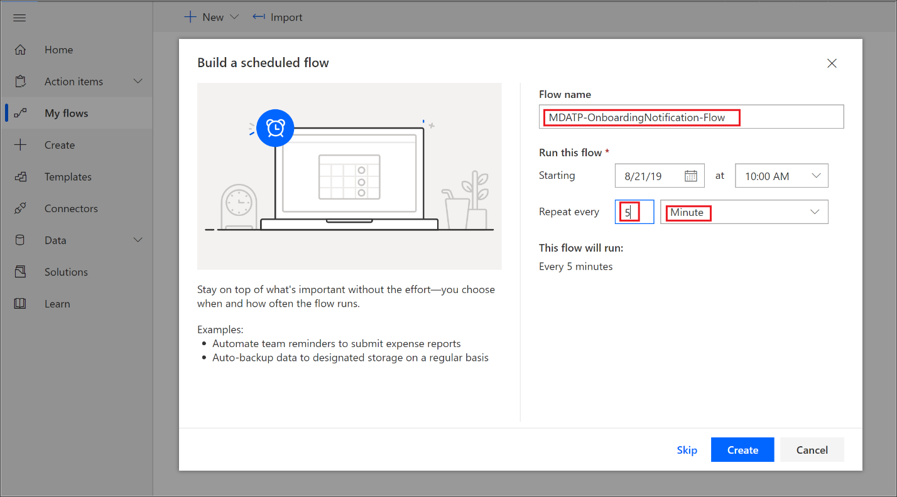
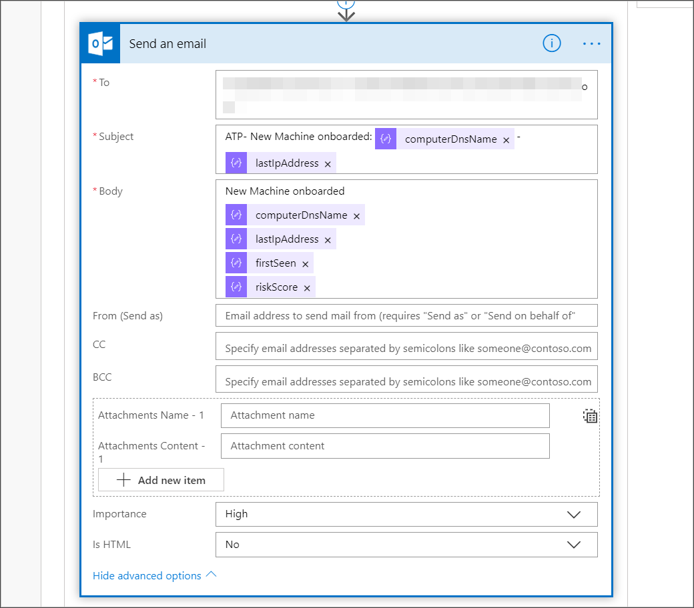

# <a name="create-a-notification-rule-when-a-local-onboarding-or-offboarding-script-is-used"></a><span data-ttu-id="b92a4-104">Erstellen einer Benachrichtigungsregel, wenn ein lokales Onboarding- oder Offboardingskript verwendet wird</span><span class="sxs-lookup"><span data-stu-id="b92a4-104">Create a notification rule when a local onboarding or offboarding script is used</span></span>

[!INCLUDE [Microsoft 365 Defender rebranding](../../includes/microsoft-defender.md)]


<span data-ttu-id="b92a4-105">**Gilt für:**</span><span class="sxs-lookup"><span data-stu-id="b92a4-105">**Applies to:**</span></span>
- [<span data-ttu-id="b92a4-106">Microsoft Defender für Endpunkt</span><span class="sxs-lookup"><span data-stu-id="b92a4-106">Microsoft Defender for Endpoint</span></span>](https://go.microsoft.com/fwlink/p/?linkid=2154037)
- [<span data-ttu-id="b92a4-107">Microsoft 365 Defender</span><span class="sxs-lookup"><span data-stu-id="b92a4-107">Microsoft 365 Defender</span></span>](https://go.microsoft.com/fwlink/?linkid=2118804)


> <span data-ttu-id="b92a4-108">Möchten Sie Microsoft Defender for Endpoint erleben?</span><span class="sxs-lookup"><span data-stu-id="b92a4-108">Want to experience Microsoft Defender for Endpoint?</span></span> [<span data-ttu-id="b92a4-109">Registrieren Sie sich für eine kostenlose Testversion.</span><span class="sxs-lookup"><span data-stu-id="b92a4-109">Sign up for a free trial.</span></span>](https://www.microsoft.com/microsoft-365/windows/microsoft-defender-atp?ocid=docs-wdatp-exposedapis-abovefoldlink)

[!include[Microsoft Defender for Endpoint API URIs for US Government](../../includes/microsoft-defender-api-usgov.md)]

[!include[Improve request performance](../../includes/improve-request-performance.md)]


<span data-ttu-id="b92a4-110">Erstellen Sie eine Benachrichtigungsregel, sodass Sie benachrichtigt werden, wenn ein lokales Onboarding- oder Offboardingskript verwendet wird.</span><span class="sxs-lookup"><span data-stu-id="b92a4-110">Create a notification rule so that when a local onboarding or offboarding script is used, you'll be notified.</span></span> 

## <a name="before-you-begin"></a><span data-ttu-id="b92a4-111">Bevor Sie beginnen</span><span class="sxs-lookup"><span data-stu-id="b92a4-111">Before you begin</span></span>
<span data-ttu-id="b92a4-112">Sie benötigen Zugriff auf:</span><span class="sxs-lookup"><span data-stu-id="b92a4-112">You'll need to have access to:</span></span>
 - <span data-ttu-id="b92a4-113">Microsoft Flow (Flow Plan 1 mindestens).</span><span class="sxs-lookup"><span data-stu-id="b92a4-113">Microsoft Flow (Flow Plan 1 at a minimum).</span></span> <span data-ttu-id="b92a4-114">Weitere Informationen finden Sie [auf Flow Preisseite](https://flow.microsoft.com/pricing/).</span><span class="sxs-lookup"><span data-stu-id="b92a4-114">For more information, see [Flow pricing page](https://flow.microsoft.com/pricing/).</span></span>
 - <span data-ttu-id="b92a4-115">Azure Table oder SharePoint List or Library / SQL DB</span><span class="sxs-lookup"><span data-stu-id="b92a4-115">Azure Table or SharePoint List or Library / SQL DB</span></span>

## <a name="create-the-notification-flow"></a><span data-ttu-id="b92a4-116">Erstellen des Benachrichtigungsflusses</span><span class="sxs-lookup"><span data-stu-id="b92a4-116">Create the notification flow</span></span>

1. <span data-ttu-id="b92a4-117">In [flow.microsoft.com](https://flow.microsoft.com/).</span><span class="sxs-lookup"><span data-stu-id="b92a4-117">In [flow.microsoft.com](https://flow.microsoft.com/).</span></span>

2. <span data-ttu-id="b92a4-118">Navigieren Sie **zu Meine Flüsse > New > Scheduled - from blank**.</span><span class="sxs-lookup"><span data-stu-id="b92a4-118">Navigate to **My flows > New > Scheduled - from blank**.</span></span> 

    


3. <span data-ttu-id="b92a4-120">Erstellen sie einen geplanten Fluss.</span><span class="sxs-lookup"><span data-stu-id="b92a4-120">Build a scheduled flow.</span></span>
   1. <span data-ttu-id="b92a4-121">Geben Sie einen Flussnamen ein.</span><span class="sxs-lookup"><span data-stu-id="b92a4-121">Enter a flow name.</span></span>
   2. <span data-ttu-id="b92a4-122">Geben Sie den Start und die Uhrzeit an.</span><span class="sxs-lookup"><span data-stu-id="b92a4-122">Specify the start and time.</span></span>
   3. <span data-ttu-id="b92a4-123">Geben Sie die Häufigkeit an.</span><span class="sxs-lookup"><span data-stu-id="b92a4-123">Specify the frequency.</span></span> <span data-ttu-id="b92a4-124">Beispielsweise alle 5 Minuten.</span><span class="sxs-lookup"><span data-stu-id="b92a4-124">For example, every 5 minutes.</span></span>

    

4. <span data-ttu-id="b92a4-126">Wählen Sie die Schaltfläche + aus, um eine neue Aktion hinzuzufügen.</span><span class="sxs-lookup"><span data-stu-id="b92a4-126">Select the + button to add a new action.</span></span> <span data-ttu-id="b92a4-127">Die neue Aktion ist eine HTTP-Anforderung an die Defender for Endpoint Security Center-API.</span><span class="sxs-lookup"><span data-stu-id="b92a4-127">The new action will be an HTTP request to the Defender for Endpoint security center device(s) API.</span></span> <span data-ttu-id="b92a4-128">Sie können sie auch durch den einsatzenden "WDATP Connector" (Aktion: "Computer – Liste der Computer erhalten") ersetzen.</span><span class="sxs-lookup"><span data-stu-id="b92a4-128">You can also replace it with the out-of-the-box "WDATP Connector" (action: "Machines - Get list of machines").</span></span> 

    


5. <span data-ttu-id="b92a4-130">Geben Sie die folgenden HTTP-Felder ein:</span><span class="sxs-lookup"><span data-stu-id="b92a4-130">Enter the following HTTP fields:</span></span>

   - <span data-ttu-id="b92a4-131">Methode: "GET" als Wert, um die Liste der Geräte zu erhalten.</span><span class="sxs-lookup"><span data-stu-id="b92a4-131">Method: "GET" as a value to get the list of devices.</span></span>
   - <span data-ttu-id="b92a4-132">URI: Geben Sie `https://api.securitycenter.microsoft.com/api/machines` ein.</span><span class="sxs-lookup"><span data-stu-id="b92a4-132">URI: Enter `https://api.securitycenter.microsoft.com/api/machines`.</span></span>
   - <span data-ttu-id="b92a4-133">Authentifizierung: Wählen Sie "Active Directory OAuth" aus.</span><span class="sxs-lookup"><span data-stu-id="b92a4-133">Authentication: Select "Active Directory OAuth".</span></span>
   - <span data-ttu-id="b92a4-134">Mandant: Melden Sie sich https://portal.azure.com an, und navigieren **Sie zu Azure Active Directory > App-Registrierungen,** und rufen Sie den Mandanten-ID-Wert ab.</span><span class="sxs-lookup"><span data-stu-id="b92a4-134">Tenant: Sign-in to https://portal.azure.com and navigate to **Azure Active Directory > App Registrations** and get the Tenant ID value.</span></span>
   - <span data-ttu-id="b92a4-135">Zielgruppe: `https://securitycenter.onmicrosoft.com/windowsatpservice\`</span><span class="sxs-lookup"><span data-stu-id="b92a4-135">Audience: `https://securitycenter.onmicrosoft.com/windowsatpservice\`</span></span>
   - <span data-ttu-id="b92a4-136">Client-ID: Melden Sie sich https://portal.azure.com an, und navigieren Sie zu **Azure Active Directory > App-Registrierungen,** und rufen Sie den Client-ID-Wert ab.</span><span class="sxs-lookup"><span data-stu-id="b92a4-136">Client ID: Sign-in to https://portal.azure.com and navigate to **Azure Active Directory > App Registrations** and  get the Client ID value.</span></span>
   - <span data-ttu-id="b92a4-137">Anmeldeinformationentyp: Wählen Sie "Secret" aus.</span><span class="sxs-lookup"><span data-stu-id="b92a4-137">Credential Type: Select "Secret".</span></span>
   - <span data-ttu-id="b92a4-138">Secret: Melden Sie sich an, und navigieren Sie https://portal.azure.com **zu Azure Active Directory > App-Registrierungen,** und rufen Sie den Mandanten-ID-Wert ab.</span><span class="sxs-lookup"><span data-stu-id="b92a4-138">Secret: Sign-in to https://portal.azure.com and navigate to **Azure Active Directory > App Registrations** and get the Tenant ID value.</span></span>

    


6. <span data-ttu-id="b92a4-140">Fügen Sie einen neuen Schritt hinzu, indem **Sie neue Aktion hinzufügen und** dann nach **Datenvorgängen** suchen und **JSON analysieren auswählen.**</span><span class="sxs-lookup"><span data-stu-id="b92a4-140">Add a new step by selecting **Add new action** then search for **Data Operations** and select **Parse JSON**.</span></span>

    

7. <span data-ttu-id="b92a4-142">Fügen Sie Body im **Feld Inhalt** hinzu.</span><span class="sxs-lookup"><span data-stu-id="b92a4-142">Add Body in the **Content** field.</span></span>

    

8. <span data-ttu-id="b92a4-144">Wählen Sie den **Link Beispielnutzlast zum Generieren des Schemas** verwenden aus.</span><span class="sxs-lookup"><span data-stu-id="b92a4-144">Select the **Use sample payload to generate schema** link.</span></span>

    

9. <span data-ttu-id="b92a4-146">Kopieren sie den folgenden JSON-Codeausschnitt, und fügen Sie ihn ein:</span><span class="sxs-lookup"><span data-stu-id="b92a4-146">Copy and paste the following JSON snippet:</span></span>

    ```
    {
        "type": "object",
        "properties": {
            "@@odata.context": {
                "type": "string"
            },
            "value": {
                "type": "array",
                "items": {
                    "type": "object",
                    "properties": {
                        "id": {
                            "type": "string"
                        },
                        "computerDnsName": {
                            "type": "string"
                        },
                        "firstSeen": {
                            "type": "string"
                        },
                        "lastSeen": {
                            "type": "string"
                        },
                        "osPlatform": {
                            "type": "string"
                        },
                        "osVersion": {},
                        "lastIpAddress": {
                            "type": "string"
                        },
                        "lastExternalIpAddress": {
                            "type": "string"
                        },
                        "agentVersion": {
                            "type": "string"
                        },
                        "osBuild": {
                            "type": "integer"
                        },
                        "healthStatus": {
                            "type": "string"
                        },
                        "riskScore": {
                            "type": "string"
                        },
                        "exposureScore": {
                            "type": "string"
                        },
                        "aadDeviceId": {},
                        "machineTags": {
                            "type": "array"
                        }
                    },
                    "required": [
                        "id",
                        "computerDnsName",
                        "firstSeen",
                        "lastSeen",
                        "osPlatform",
                        "osVersion",
                        "lastIpAddress",
                        "lastExternalIpAddress",
                        "agentVersion",
                        "osBuild",
                        "healthStatus",
                        "rbacGroupId",
                        "rbacGroupName",
                        "riskScore",
                        "exposureScore",
                        "aadDeviceId",
                        "machineTags"
                    ]
                }
            }
        }
    }

    ```

10.  <span data-ttu-id="b92a4-147">Extrahieren Sie die Werte aus dem JSON-Aufruf, und überprüfen Sie, ob die integrierten Geräte bereits in der liste SharePoint registriert sind:</span><span class="sxs-lookup"><span data-stu-id="b92a4-147">Extract the values from the JSON call and check if the onboarded device(s) is / are already registered at the SharePoint list as an example:</span></span>
- <span data-ttu-id="b92a4-148">Wenn ja, wird keine Benachrichtigung ausgelöst</span><span class="sxs-lookup"><span data-stu-id="b92a4-148">If yes, no notification will be triggered</span></span>
- <span data-ttu-id="b92a4-149">Wenn nein, werden die neuen integrierten Geräte in der Liste SharePoint registriert, und eine Benachrichtigung wird an den Defender for Endpoint-Administrator gesendet.</span><span class="sxs-lookup"><span data-stu-id="b92a4-149">If no, will register the new onboarded device(s) in the SharePoint list and a notification will be sent to the Defender for Endpoint admin</span></span>

    

    

11. <span data-ttu-id="b92a4-152">Fügen Sie unter **Bedingung** den folgenden Ausdruck hinzu: "length(body('Get_items')?[" value'])" und legen Sie die Bedingung auf 0 an.</span><span class="sxs-lookup"><span data-stu-id="b92a4-152">Under **Condition**, add the following expression: "length(body('Get_items')?['value'])" and set the condition to equal to 0.</span></span>

    <span data-ttu-id="b92a4-153"></span><span class="sxs-lookup"><span data-stu-id="b92a4-153"></span></span>  
    <span data-ttu-id="b92a4-154"> 
     </span><span class="sxs-lookup"><span data-stu-id="b92a4-154"> 
    </span></span>  
<span data-ttu-id="b92a4-155"></span><span class="sxs-lookup"><span data-stu-id="b92a4-155"></span></span>

## <a name="alert-notification"></a><span data-ttu-id="b92a4-156">Warnungsbenachrichtigung</span><span class="sxs-lookup"><span data-stu-id="b92a4-156">Alert notification</span></span>
<span data-ttu-id="b92a4-157">Die folgende Abbildung ist ein Beispiel für eine E-Mail-Benachrichtigung.</span><span class="sxs-lookup"><span data-stu-id="b92a4-157">The following image is an example of an email notification.</span></span>


## <a name="tips"></a><span data-ttu-id="b92a4-159">Tipps</span><span class="sxs-lookup"><span data-stu-id="b92a4-159">Tips</span></span>

- <span data-ttu-id="b92a4-160">Sie können hier nur mit lastSeen filtern:</span><span class="sxs-lookup"><span data-stu-id="b92a4-160">You can filter here using lastSeen only:</span></span>
    - <span data-ttu-id="b92a4-161">Alle 60 Minuten:</span><span class="sxs-lookup"><span data-stu-id="b92a4-161">Every 60 min:</span></span>
      - <span data-ttu-id="b92a4-162">Nehmen Sie alle Geräte, die zuletzt in den letzten 7 Tagen angezeigt wurden.</span><span class="sxs-lookup"><span data-stu-id="b92a4-162">Take all devices last seen in the past 7 days.</span></span> 

- <span data-ttu-id="b92a4-163">Für jedes Gerät:</span><span class="sxs-lookup"><span data-stu-id="b92a4-163">For each device:</span></span> 
    - <span data-ttu-id="b92a4-164">Wenn sich die zuletzt gesehene Eigenschaft im Ein-Stunden-Intervall von [-7 Tagen, -7Days + 60 Minuten ] befindet, > Warnung für offboarding-Möglichkeit.</span><span class="sxs-lookup"><span data-stu-id="b92a4-164">If last seen property is on the one hour interval of [-7 days, -7days + 60 minutes ] -> Alert for offboarding possibility.</span></span>
    - <span data-ttu-id="b92a4-165">Wenn das erste Mal angezeigt wird, wird in der letzten Stunde -> Benachrichtigung für das Onboarding angezeigt.</span><span class="sxs-lookup"><span data-stu-id="b92a4-165">If first seen is on the past hour -> Alert for onboarding.</span></span>

<span data-ttu-id="b92a4-166">In dieser Lösung gibt es keine doppelten Warnungen: Es gibt Mandanten mit zahlreichen Geräten.</span><span class="sxs-lookup"><span data-stu-id="b92a4-166">In this solution you will not have duplicate alerts: There are tenants that have numerous devices.</span></span> <span data-ttu-id="b92a4-167">Das Abrufen aller dieser Geräte ist möglicherweise sehr kostspielig und erfordert möglicherweise Auslagerungen.</span><span class="sxs-lookup"><span data-stu-id="b92a4-167">Getting all those devices might be very expensive and might require paging.</span></span>

<span data-ttu-id="b92a4-168">Sie können es in zwei Abfragen aufteilen:</span><span class="sxs-lookup"><span data-stu-id="b92a4-168">You can split it to two queries:</span></span> 
1.  <span data-ttu-id="b92a4-169">Für offboarding nehmen Sie nur dieses Intervall mit dem OData-$filter und benachrichtigen Sie nur, wenn die Bedingungen erfüllt sind.</span><span class="sxs-lookup"><span data-stu-id="b92a4-169">For offboarding take only this interval using the OData $filter and only notify if the conditions are met.</span></span>
2.  <span data-ttu-id="b92a4-170">Nehmen Sie alle Geräte, die zuletzt in der letzten Stunde gesehen wurden, und überprüfen Sie die erste angezeigte Eigenschaft für sie (wenn sich die erste angezeigte Eigenschaft in der letzten Stunde befindet, muss auch die zuletzt angezeigte Eigenschaft dort sein).</span><span class="sxs-lookup"><span data-stu-id="b92a4-170">Take all devices last seen in the past hour and check first seen property for them (if the first seen property is on the past hour, the last seen must be there too).</span></span> 

