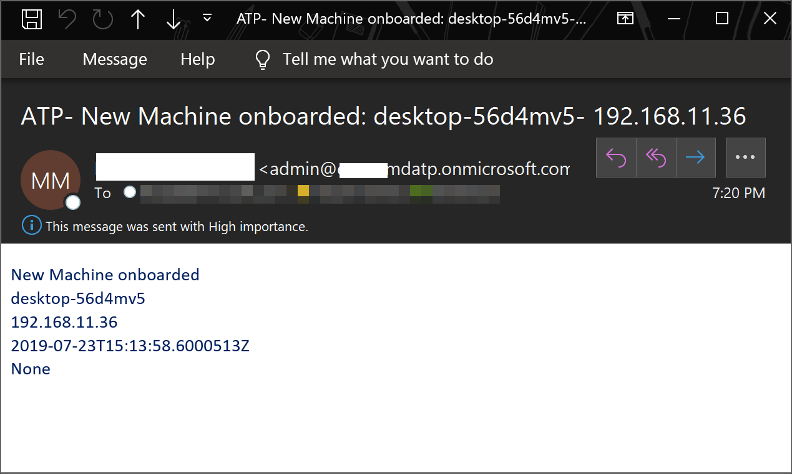

# <a name="create-a-notification-rule-when-a-local-onboarding-or-offboarding-script-is-used"></a>Erstellen einer Benachrichtigungsregel, wenn ein lokales Onboarding- oder Offboardingskript verwendet wird

[!INCLUDE [Microsoft 365 Defender rebranding](../../includes/microsoft-defender.md)]


**Gilt für:**
- [Microsoft Defender für Endpunkt](https://go.microsoft.com/fwlink/p/?linkid=2154037)
- [Microsoft 365 Defender](https://go.microsoft.com/fwlink/?linkid=2118804)


> Möchten Sie Microsoft Defender for Endpoint erleben? [Registrieren Sie sich für eine kostenlose Testversion.](https://www.microsoft.com/microsoft-365/windows/microsoft-defender-atp?ocid=docs-wdatp-exposedapis-abovefoldlink)

[!include[Microsoft Defender for Endpoint API URIs for US Government](../../includes/microsoft-defender-api-usgov.md)]

[!include[Improve request performance](../../includes/improve-request-performance.md)]


Erstellen Sie eine Benachrichtigungsregel, sodass Sie benachrichtigt werden, wenn ein lokales Onboarding- oder Offboardingskript verwendet wird. 

## <a name="before-you-begin"></a>Bevor Sie beginnen
Sie benötigen Zugriff auf:
 - Microsoft Flow (Flow Plan 1 mindestens). Weitere Informationen finden Sie [auf Flow Preisseite](https://flow.microsoft.com/pricing/).
 - Azure Table oder SharePoint List or Library / SQL DB

## <a name="create-the-notification-flow"></a>Erstellen des Benachrichtigungsflusses

1. In [flow.microsoft.com](https://flow.microsoft.com/).

2. Navigieren Sie **zu Meine Flüsse > New > Scheduled - from blank**. 

    


3. Erstellen sie einen geplanten Fluss.
   1. Geben Sie einen Flussnamen ein.
   2. Geben Sie den Start und die Uhrzeit an.
   3. Geben Sie die Häufigkeit an. Beispielsweise alle 5 Minuten.

    

4. Wählen Sie die Schaltfläche + aus, um eine neue Aktion hinzuzufügen. Die neue Aktion ist eine HTTP-Anforderung an die Defender for Endpoint Security Center-API. Sie können sie auch durch den einsatzenden "WDATP Connector&quot; (Aktion: &quot;Computer – Liste der Computer erhalten") ersetzen. 

    


5. Geben Sie die folgenden HTTP-Felder ein:

   - Methode: "GET" als Wert, um die Liste der Geräte zu erhalten.
   - URI: Geben Sie `https://api.securitycenter.microsoft.com/api/machines` ein.
   - Authentifizierung: Wählen Sie "Active Directory OAuth" aus.
   - Mandant: Melden Sie sich https://portal.azure.com an, und navigieren **Sie zu Azure Active Directory > App-Registrierungen,** und rufen Sie den Mandanten-ID-Wert ab.
   - Zielgruppe: `https://securitycenter.onmicrosoft.com/windowsatpservice\`
   - Client-ID: Melden Sie sich https://portal.azure.com an, und navigieren Sie zu **Azure Active Directory > App-Registrierungen,** und rufen Sie den Client-ID-Wert ab.
   - Anmeldeinformationentyp: Wählen Sie "Secret" aus.
   - Secret: Melden Sie sich an, und navigieren Sie https://portal.azure.com **zu Azure Active Directory > App-Registrierungen,** und rufen Sie den Mandanten-ID-Wert ab.

    


6. Fügen Sie einen neuen Schritt hinzu, indem **Sie neue Aktion hinzufügen und** dann nach **Datenvorgängen** suchen und **JSON analysieren auswählen.**

    

7. Fügen Sie Body im **Feld Inhalt** hinzu.

    

8. Wählen Sie den **Link Beispielnutzlast zum Generieren des Schemas** verwenden aus.

    

9. Kopieren sie den folgenden JSON-Codeausschnitt, und fügen Sie ihn ein:

    ```
    {
        "type": "object",
        "properties": {
            "@@odata.context": {
                "type": "string"
            },
            "value": {
                "type": "array",
                "items": {
                    "type": "object",
                    "properties": {
                        "id": {
                            "type": "string"
                        },
                        "computerDnsName": {
                            "type": "string"
                        },
                        "firstSeen": {
                            "type": "string"
                        },
                        "lastSeen": {
                            "type": "string"
                        },
                        "osPlatform": {
                            "type": "string"
                        },
                        "osVersion": {},
                        "lastIpAddress": {
                            "type": "string"
                        },
                        "lastExternalIpAddress": {
                            "type": "string"
                        },
                        "agentVersion": {
                            "type": "string"
                        },
                        "osBuild": {
                            "type": "integer"
                        },
                        "healthStatus": {
                            "type": "string"
                        },
                        "riskScore": {
                            "type": "string"
                        },
                        "exposureScore": {
                            "type": "string"
                        },
                        "aadDeviceId": {},
                        "machineTags": {
                            "type": "array"
                        }
                    },
                    "required": [
                        "id",
                        "computerDnsName",
                        "firstSeen",
                        "lastSeen",
                        "osPlatform",
                        "osVersion",
                        "lastIpAddress",
                        "lastExternalIpAddress",
                        "agentVersion",
                        "osBuild",
                        "healthStatus",
                        "rbacGroupId",
                        "rbacGroupName",
                        "riskScore",
                        "exposureScore",
                        "aadDeviceId",
                        "machineTags"
                    ]
                }
            }
        }
    }

    ```

10.  Extrahieren Sie die Werte aus dem JSON-Aufruf, und überprüfen Sie, ob die integrierten Geräte bereits in der liste SharePoint registriert sind:
- Wenn ja, wird keine Benachrichtigung ausgelöst
- Wenn nein, werden die neuen integrierten Geräte in der Liste SharePoint registriert, und eine Benachrichtigung wird an den Defender for Endpoint-Administrator gesendet.

    

    

11. Fügen Sie unter **Bedingung** den folgenden Ausdruck hinzu: "length(body('Get_items')?[" value'])" und legen Sie die Bedingung auf 0 an.

      
     
       
    

## <a name="alert-notification"></a>Warnungsbenachrichtigung
Die folgende Abbildung ist ein Beispiel für eine E-Mail-Benachrichtigung.




## <a name="tips"></a>Tipps

- Sie können hier nur mit lastSeen filtern:
    - Alle 60 Minuten:
      - Nehmen Sie alle Geräte, die zuletzt in den letzten 7 Tagen angezeigt wurden. 

- Für jedes Gerät: 
    - Wenn sich die zuletzt gesehene Eigenschaft im Ein-Stunden-Intervall von [-7 Tagen, -7Days + 60 Minuten ] befindet, > Warnung für offboarding-Möglichkeit.
    - Wenn das erste Mal angezeigt wird, wird in der letzten Stunde -> Benachrichtigung für das Onboarding angezeigt.

In dieser Lösung gibt es keine doppelten Warnungen: Es gibt Mandanten mit zahlreichen Geräten. Das Abrufen aller dieser Geräte ist möglicherweise sehr kostspielig und erfordert möglicherweise Auslagerungen.

Sie können es in zwei Abfragen aufteilen: 
1.  Für offboarding nehmen Sie nur dieses Intervall mit dem OData-$filter und benachrichtigen Sie nur, wenn die Bedingungen erfüllt sind.
2.  Nehmen Sie alle Geräte, die zuletzt in der letzten Stunde gesehen wurden, und überprüfen Sie die erste angezeigte Eigenschaft für sie (wenn sich die erste angezeigte Eigenschaft in der letzten Stunde befindet, muss auch die zuletzt angezeigte Eigenschaft dort sein). 

