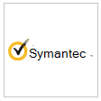

# Partneranwendungen in Microsoft Defender for Endpoint 

[!INCLUDE [Microsoft 365 Defender rebranding](../../includes/microsoft-defender.md)]

**Gilt für:**
- [Microsoft Defender für Endpunkt](https://go.microsoft.com/fwlink/p/?linkid=2154037)
- [Microsoft 365 Defender](https://go.microsoft.com/fwlink/?linkid=2118804)

> Möchten Sie Microsoft Defender for Endpoint erleben? [Registrieren Sie sich für eine kostenlose Testversion.](https://www.microsoft.com/microsoft-365/windows/microsoft-defender-atp?ocid=docs-wdatp-exposedapis-abovefoldlink)

Defender for Endpoint unterstützt Anwendungen von Drittanbietern, um die Erkennungs-, Untersuchungs- und Bedrohungserkennungsfunktionen der Plattform zu verbessern.

Die Unterstützung von Drittanbieterlösungen trägt dazu bei, die Verteidigung anderer Anbieter mit Microsoft Defender for Endpoint weiter zu optimieren, zu integrieren und zu orchestrieren. Ermöglichen, dass Sicherheitsteams effektiv besser auf moderne Bedrohungen reagieren können.

Microsoft Defender for Endpoint lässt sich nahtlos in vorhandene Sicherheitslösungen integrieren. Die Integration ermöglicht die Integration in die folgenden Lösungen, z. B.:

- SIEM
- Ticketing- und IT-Serviceverwaltungslösungen
- Managed Security Service Providers (MSSP)
- Erfassung und Abgleich von IoC-Indikatoren
- Automatisierte Geräteuntersuchung und -behebung basierend auf externen Warnungen
- Integration in SoAR-Systeme (Security Orchestration and Automation Response)

## Unterstützte Anwendungen

### Sicherheitsinformationen und Analysen

Logo |Partnername   | Beschreibung 
:---|:---|:---
| [AttackIQ-Plattform](https://go.microsoft.com/fwlink/?linkid=2103502) | Die AttackIQ-Plattform überprüft, ob Defender for Endpoint ordnungsgemäß konfiguriert ist, indem kontinuierliche Angriffe sicher auf Produktionsressourcen gestartet werden.
| [AzureSentinel](https://go.microsoft.com/fwlink/?linkid=2135705) | Streamen von Warnungen von Microsoft Defender for Endpoint in Azure Sentinel 
 | [Cymulate](https://go.microsoft.com/fwlink/?linkid=2135574)| Korrelieren von Defender for Endpoint-Ergebnissen mit simulierten Angriffen, um eine genaue Erkennung und effektive Reaktionsaktionen zu überprüfen
 | [Elastic Security](https://go.microsoft.com/fwlink/?linkid=2139303) | Elastic Security ist eine kostenlose und offene Lösung zum Verhindern, Erkennen und Reagieren auf Bedrohungen
 | [IBM QRadar](https://go.microsoft.com/fwlink/?linkid=2113903) | Konfigurieren von IBM QRadar zum Erfassen von Erkennungen von Defender for Endpoint 
 | [Micro Focus ArcSight](https://go.microsoft.com/fwlink/?linkid=2113548) | Verwenden von Micro Focus ArcSight zum Ziehen von Defender for Endpoint-Erkennungen
 | [RSA NetWitness](https://go.microsoft.com/fwlink/?linkid=2118566) | Stream Defender for Endpoint Alerts to RSA NetWitness mithilfe der Microsoft Graph-Sicherheits-API
 | [SafeBreach](https://go.microsoft.com/fwlink/?linkid=2114114)| Einblicke in Defender for Endpoint-Sicherheitsereignisse, die automatisch mit SafeBreach-Simulationen korreliert werden
 | [Skybox-Sicherheitsrisikosteuerung](https://go.microsoft.com/fwlink/?linkid=2127467) | Skybox Vulnerability Control durchschneidet das Geräusch des Sicherheitsrisikomanagements und korreliert den Geschäfts-, Netzwerk- und Bedrohungskontext, um Ihre riskantesten Sicherheitsrisiken aufzudecken.
 | [Splunk](https://go.microsoft.com/fwlink/?linkid=2129805) | Das Defender for Endpoint-Add-On ermöglicht Splunk-Benutzern, alle Warnungen und unterstützenden Informationen an ihren Splunk zu empfangen.
 | [XM Cyber](https://go.microsoft.com/fwlink/?linkid=2136700) | Priorisieren Der Reaktion auf eine Warnung basierend auf Risikofaktoren und hochwertigen Ressourcen

### Orchestrierung und Automatisierung

Logo |Partnername   | Beschreibung 
:---|:---|:---
 | [CyberSponse CyOps](https://go.microsoft.com/fwlink/?linkid=2115943) | CyOps wird in Defender for Endpoint integriert, um die High-Speed-Playbooks zur Reaktion auf Vorfälle von Kunden zu automatisieren.
 | [Delta Risk ActiveEye](https://go.microsoft.com/fwlink/?linkid=2127468) | Delta Risk, ein führender Anbieter von SOC-as-a-Service- und Sicherheitsdiensten, integriert Defender for Endpoint in seine cloudeigene SOAR-Plattform ActiveEye.
 | [Demisto, ein Palo Alto Networks Company](https://go.microsoft.com/fwlink/?linkid=2108414) | Demisto integriert sich in Defender for Endpoint, um Sicherheitsteams die Orchestrierung und Automatisierung der Überwachung, Anreicherung und Reaktion von Endpunktsicherheit zu ermöglichen.
 | [Microsoft Flow & Azure Functions](https://go.microsoft.com/fwlink/?linkid=2114300) | Verwenden der Defender for Endpoint-Connectors für Azure Logic Apps & Microsoft Flow zum Automatisieren von Sicherheitsverfahren
 | [Rapid7 InsightConnect](https://go.microsoft.com/fwlink/?linkid=2116040) | InsightConnect ist in Defender for Endpoint integriert, um Ihre zeitintensiven Sicherheitsprozesse zu beschleunigen, zu optimieren und zu integrieren.
 | [ServiceNow](https://go.microsoft.com/fwlink/?linkid=2135621) | Abrufen von Warnungen in die ServiceNow Security Operations-Lösung basierend auf der Microsoft Graph-API-Integration
 | [Swimlane](https://go.microsoft.com/fwlink/?linkid=2113902) | Maximieren der Funktionen für die Reaktion auf Vorfälle mithilfe von Swimlane und Defender for Endpoint zusammen

### Bedrohungsintelligenz

Logo |Partnername   | Beschreibung 
:---|:---|:---
 | [MISP (Malware Information Sharing Platform)](https://go.microsoft.com/fwlink/?linkid=2127543) | Integrieren von Bedrohungsindikatoren aus der Open Source Threat Intelligence Sharing Platform in Ihre Defender for Endpoint-Umgebung
 | [Palo Alto Networks](https://go.microsoft.com/fwlink/?linkid=2099582) | Erweitern Des Endpunktschutzes durch Erweitern von Autofokus und anderen Bedrohungsfeeds auf Defender for Endpoint mithilfe von MineMeld
 | [ThreatConnect](https://go.microsoft.com/fwlink/?linkid=2114115) | Warnung und/oder Blockierung von benutzerdefinierter Bedrohungsintelligenz von ThreatConnect Playbooks mithilfe von Defender for Endpoint-Indikatoren

### Netzwerksicherheit
Logo |Partnername   | Beschreibung 
:---|:---|:---
 | [Aruba ClearPass Policy Manager](https://go.microsoft.com/fwlink/?linkid=2127544) | Stellen Sie sicher, dass Defender for Endpoint auf jedem Endpunkt installiert und aktualisiert wird, bevor Sie den Zugriff auf das Netzwerk zulassen
 | [Blaues Hexagon für Netzwerk](https://go.microsoft.com/fwlink/?linkid=2104613) | Blue Hexagon hat die erste Echtzeit-Deep-Learning-Plattform der Branche für den Schutz vor Netzwerkbedrohungen entwickelt.
 | [CyberMDX](https://go.microsoft.com/fwlink/?linkid=2135620) | Cyber MDX integriert umfassende Sichtbarkeit, Bedrohungsverhütung und -repose in Ihre Defender for Endpoint-Umgebung
 | [HYAS Protect](https://go.microsoft.com/fwlink/?linkid=2156763) | HYAS Protect nutzt autorisierende Kenntnisse der Angreiferinfrastruktur, um Microsoft Defender for Endpoint-Endpunkte proaktiv vor Cyberangriffen zu schützen.
 |[Vectra Network Detection and Response (NDR)](https://go.microsoft.com/fwlink/?linkid=866934)| Vectra wendet ki-& Sicherheitsforschung an, um Cyberangriffe in Echtzeit zu erkennen und darauf zu reagieren

### Plattformübergreifend
Logo |Partnername   | Beschreibung 
:---|:---|:---
| [Bitdefender](https://go.microsoft.com/fwlink/?linkid=860032)| Bitdefender GravityZone ist eine mehrschichtige Endpunktschutzplattform der nächsten Generation, die umfassenden Schutz vor dem vollständigen Spektrum anspruchsvoller Cyberbedrohungen bietet.
 | [Better Mobile](https://go.microsoft.com/fwlink/?linkid=2086214)| KI-basierte MTD-Lösung zum Beenden von mobilen Bedrohungen & Phishing. Privates Internetbrowsing zum Schutz der Benutzerdaten 
| [Corrata](https://go.microsoft.com/fwlink/?linkid=2081148) | Mobile Lösung – Schützen Sie Ihre mobilen Geräte mit präziser Sichtbarkeit und Kontrolle vor Corrata 
| [Lookout](https://go.microsoft.com/fwlink/?linkid=866935)| Lookout Mobile Threat Protection-Telemetrie für mobile Android- und iOS-Geräte
 | [Symantec Endpoint Protection Mobile](https://go.microsoft.com/fwlink/?linkid=2090992)| SEP Mobile hilft Unternehmen dabei, Sicherheitsbedrohungen und Sicherheitsrisiken auf mobilen Geräten vorherzusagen, zu erkennen und zu verhindern. 
| [Zimperium](https://go.microsoft.com/fwlink/?linkid=2118044)|Erweitern Ihres Defender for Endpoint auf iOS und Android mit Machine Learning-basierter mobiler Bedrohungsabwehr

## Andere Integrationen

Logo |Partnername   | Beschreibung 
:---|:---|:---
| [Cyren Web Filter](https://go.microsoft.com/fwlink/?linkid=2108221)| Verbessern Ihres Defender for Endpoint durch erweiterte Webfilterung
| [Morphisec](https://go.microsoft.com/fwlink/?linkid=2086215)| Bietet moving target defense-powered advanced threat prevention. Integriert forensische Daten direkt in WD Security Center-Dashboards, um Warnungen zu priorisieren, die Risikobewertung für Geräte zu ermitteln und die vollständige Angriffszeitachse einschließlich interner Speicherinformationen zu visualisieren.
| [THOR Cloud](https://go.microsoft.com/fwlink/?linkid=862988)| Bietet On-Demand-Liveforensikscans mithilfe einer Signaturbasis mit Fokus auf beständigen Bedrohungen

## SIEM-Integration
Defender for Endpoint unterstützt die SIEM-Integration über verschiedene Methoden. Dies kann eine spezielle SIEM-Systemschnittstelle mit sofort einsatzfertigen Connectors, eine generische Warnungs-API, die benutzerdefinierte Implementierungen ermöglicht, und eine Aktions-API zur Aktivierung der Warnungsstatusverwaltung umfassen.  Weitere Informationen finden Sie unter [Aktivieren der SIEM-Integration](enable-siem-integration.md).

## Ticketing und VERWALTUNG von IT-Diensts 
Die Integration von Ticketlösungen hilft bei der Implementierung manueller und automatischer Reaktionsprozesse. Defender for Endpoint kann beim automatischen Erstellen von Tickets helfen, wenn eine Warnung generiert wird, und die Warnungen zu beheben, wenn Tickets mithilfe der Benachrichtigungs-API geschlossen werden. 

## Integration von Sicherheits orchestrierung und Automatisierungsreaktion (SoAR) 
Orchestrierungslösungen können beim Erstellen von Playbooks helfen und das umfassende Datenmodell und die Aktionen integrieren, die Defender for Endpoint-APIs für orchestrierte Antworten verfügbar machen, z. B. Abfragen von Gerätedaten, Auslösen der Geräteisolation, Blockieren/Zulassen, Auflösen von Warnungen und andere. 

## Korrelation externer Warnungen und automatisierte Untersuchung und Behebung  
Defender for Endpoint bietet einzigartige automatisierte Untersuchungs- und Behebungsfunktionen, um die Reaktion auf Vorfälle in einem großen Umfang zu unterstützen.
  
Die Integration der automatisierten Untersuchungs- und Reaktionsfunktionen in andere Lösungen wie IDS und Firewalls hilft, Warnungen zu adressieren und die Komplexität der Netzwerk- und Gerätesignalkorrelation zu minimieren und die Untersuchungs- und Bedrohungsbehebungsmaßnahmen auf Geräten effektiv zu veransten.  

Externe Warnungen können an Defender for Endpoint gesendet werden. Diese Warnungen werden neben zusätzlichen gerätebasierten Warnungen von Defender for Endpoint angezeigt. Diese Ansicht bietet einen vollständigen Kontext der Warnung und kann den vollständigen Hintergrund eines Angriffs anzeigen.  

## Indikatorenvergleich
Sie können Bedrohungsintelligenz von Anbietern und Aggregatoren verwenden, um Gefährdungsindikatoren (IoCs) zu verwalten und zu verwenden.

Mit Defender for Endpoint können Sie sich in diese Lösungen integrieren und auf IoCs reagieren, indem Umfangreiche Telemetriedaten korreliert werden, um Warnungen zu erstellen.  Sie können auch Präventions- und automatisierte Reaktionsfunktionen verwenden, um die Ausführung zu blockieren und Abhilfemaßnahmen zu ergreifen, wenn eine Übereinstimmung vor sich geht.

Defender for Endpoint unterstützt derzeit den IOC-Abgleich und die Korrektur für Datei- und Netzwerkindikatoren. Das Blockieren wird für Dateiindikatoren unterstützt.  

## Unterstützung für Nicht-Windows-Plattformen
Defender for Endpoint bietet eine zentrale Sicherheitsbetriebserfahrung für Windows- und Nicht-Windows-Plattformen, einschließlich mobiler Geräte. Sie können Warnungen von verschiedenen unterstützten Betriebssystemen im Portal anzeigen und das Netzwerk Ihrer Organisation besser schützen. 
