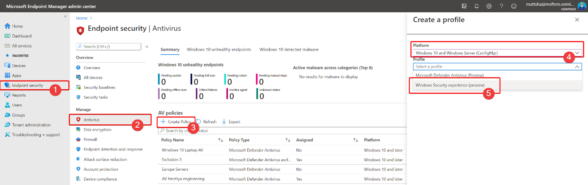

# Schützen von Sicherheitseinstellungen mit ManipulationsschutzProtect security settings with tamper protection

[!INCLUDE [Microsoft 365 Defender rebranding](../../includes/microsoft-defender.md)]

**Gilt für:****Applies to:**

- [Microsoft Defender für EndpunktMicrosoft Defender for Endpoint](/microsoft-365/security/defender-endpoint/)

Manipulationsschutz ist für Geräte verfügbar, auf der eine der folgenden Versionen von Windows:Tamper protection is available for devices that are running one of the following versions of Windows:

- Windows 10Windows 10
- Windows Server 2019Windows Server 2019
- Windows Server, Version 1803 oder höherWindows Server, version 1803 or later
- Windows Server 2016Windows Server 2016

## ÜbersichtOverview

Bei einigen Arten von Cyberangriffen versuchen schlechte Akteure, Sicherheitsfeatures, z. B. Virenschutz, auf Ihren Computern zu deaktivieren.During some kinds of cyber attacks, bad actors try to disable security features, such as anti-virus protection, on your machines. Schlechte Akteure möchten Ihre Sicherheitsfeatures deaktivieren, um leichteren Zugriff auf Ihre Daten zu erhalten, Schadsoftware zu installieren oder Ihre Daten, Identität und Geräte anderweitig auszunutzen.Bad actors like to disable your security features to get easier access to your data, to install malware, or to otherwise exploit your data, identity, and devices. Manipulationsschutz verhindert, dass solche Dinge auftreten.Tamper protection helps prevent these kinds of things from occurring.

Mit dem Schutz vor Manipulationen können schädliche Apps keine Aktionen wie z. B.:With tamper protection, malicious apps are prevented from taking actions such as:

- Deaktivieren des Viren- und BedrohungsschutzesDisabling virus and threat protection
- Deaktivieren des EchtzeitschutzesDisabling real-time protection
- Deaktivieren der VerhaltensüberwachungTurning off behavior monitoring
- Deaktivieren von Antivirenprogrammen (z. B. IOfficeAntivirus (IOAV))Disabling antivirus (such as IOfficeAntivirus (IOAV))
- Deaktivieren des in der Cloud übermittelten SchutzesDisabling cloud-delivered protection
- Entfernen von SicherheitsintelligenzupdatesRemoving security intelligence updates

### FunktionsweiseHow it works

Der Manipulationsschutz sperrt Microsoft Defender Antivirus und verhindert, dass Ihre Sicherheitseinstellungen über Apps und Methoden wie z. B.:Tamper protection essentially locks Microsoft Defender Antivirus and prevents your security settings from being changed through apps and methods such as:

- Konfigurieren von Einstellungen im Registrierungs-Editor auf Ihrem Windows GerätConfiguring settings in Registry Editor on your Windows device
- Ändern von Einstellungen über PowerShell-CmdletsChanging settings through PowerShell cmdlets
- Bearbeiten oder Entfernen von Sicherheitseinstellungen über GruppenrichtlinienEditing or removing security settings through group policies

Manipulationsschutz verhindert nicht, dass Sie Ihre Sicherheitseinstellungen anzeigen.Tamper protection doesn't prevent you from viewing your security settings. Und der Manipulationsschutz hat keine Auswirkungen darauf, wie sich Antiviren-Apps von Drittanbietern bei der Windows-Sicherheit registrieren.And, tamper protection doesn't affect how third-party antivirus apps register with the Windows Security app. Wenn Ihre Organisation E5 Windows 10 Enterprise, können einzelne Benutzer die Einstellung zum Schutz vor Manipulationen nicht ändern. In diesen Fällen wird der Manipulationsschutz von Ihrem Sicherheitsteam verwaltet.If your organization is using Windows 10 Enterprise E5, individual users can't change the tamper protection setting; in those cases, tamper protection is managed by your security team.

### Was möchten Sie machen?What do you want to do?

| So führen Sie diese Aufgabe aus...To perform this task... | Siehe diesen Abschnitt...See this section... |
|:---|:---|
| Aktivieren (oder Deaktivieren) des Manipulationsschutzes in der Microsoft Defender Security CenterTurn tamper protection on (or off) in the Microsoft Defender Security Center 
Verwalten des Manipulationsschutzes in Ihrem MandantenManage tamper protection across your tenant | [Verwalten des Manipulationsschutzes für Ihre Organisation mithilfe der Microsoft Defender Security CenterManage tamper protection for your organization using the Microsoft Defender Security Center](#manage-tamper-protection-for-your-organization-using-the-microsoft-defender-security-center) |
| Aktivieren (oder Deaktivieren) von Manipulationsschutz für die ganze oder einen Teil Ihrer Organisation mithilfe von IntuneTurn tamper protection on (or off) for all or part of your organization using Intune 
Optimieren von Manipulationsschutzeinstellungen in Ihrer OrganisationFine-tune tamper protection settings in your organization | [Verwalten von Manipulationsschutz für Ihre Organisation mithilfe von IntuneManage tamper protection for your organization using Intune](#manage-tamper-protection-for-your-organization-using-intune) |
| Aktivieren (oder Deaktivieren) von Manipulationsschutz für Ihre Organisation mit Configuration ManagerTurn tamper protection on (or off) for your organization with Configuration Manager | [Verwalten des Fälschungsschutzes für Ihre Organisation mithilfe von Mandanten-Anfügen mit Configuration Manager, Version 2006Manage tamper protection for your organization using tenant attach with Configuration Manager, version 2006](#manage-tamper-protection-for-your-organization-with-configuration-manager-version-2006) |
| Aktivieren (oder Deaktivieren) von Manipulationsschutz für ein einzelnes GerätTurn tamper protection on (or off) for an individual device | [Verwalten des Manipulationsschutzes auf einem einzelnen GerätManage tamper protection on an individual device](#manage-tamper-protection-on-an-individual-device) |
| Anzeigen von Details zu Manipulationsversuchen auf GerätenView details about tampering attempts on devices | [Anzeigen von Informationen zu ManipulationsversuchenView information about tampering attempts](#view-information-about-tampering-attempts) |
| Überprüfen Ihrer SicherheitsempfehlungenReview your security recommendations | [Überprüfen von SicherheitsempfehlungenReview security recommendations](#review-your-security-recommendations) |
| Überprüfen der Liste der häufig gestellten Fragen (FAQs)Review the list of frequently asked questions (FAQs) | [Durchsuchen der FAQsBrowse the FAQs](#view-information-about-tampering-attempts) |

Abhängig von der Methode oder dem Verwaltungstool, die Sie zum Aktivieren des Manipulationsschutzes verwenden, kann es eine Abhängigkeit von MAPS (Cloud-delivered Protection) gibt.Depending on the method or management tool you use to enable Tamper protection, there may be a dependency on MAPS (cloud-delivered protection). 

Die folgende Tabelle enthält Details zu den Methoden, Tools und Abhängigkeiten.The following table provides details on the methods, tools, and dependencies.

|     Aktivieren des Schutzes von ManipulationenHow Tamper protection is enabled                                         |     Abhängigkeit von MAPS (Cloud-zugestellter Schutz)Dependency on MAPS (cloud-delivered protection)    |
|------------------------------------------------------------------------------|--------------------------------------------------------|
|     Microsoft IntuneMicrosoft Intune                                                         |     NeinNo                                                 |
| Microsoft Endpoint Configuration Manager + Tenant AttachMicrosoft Endpoint Configuration Manager + Tenant Attach                     |     NeinNo                                                 |
|     Microsoft Defender for Endpoint Portal (securitycenter.microsoft.com)Microsoft Defender for Endpoint portal (securitycenter.microsoft.com)    |     JaYes                                                |
|     Microsoft 365 Defender-Portal (security.microsoft.com)Microsoft 365 Defender portal (security.microsoft.com)                   |     JaYes                                                |

## Verwalten des Manipulationsschutzes für Ihre Organisation mithilfe der Microsoft Defender Security CenterManage tamper protection for your organization using the Microsoft Defender Security Center

Der Manipulationsschutz kann für Ihren Mandanten mithilfe der Microsoft Defender Security Center ( ) aktiviert oder deaktiviert [https://securitycenter.windows.com](https://securitycenter.windows.com) werden.Tamper protection can be turned on or off for your tenant using the Microsoft Defender Security Center ([https://securitycenter.windows.com](https://securitycenter.windows.com)). Hier sind einige Punkte, die Sie beachten sollten:Here are a few points to keep in mind:

- Derzeit ist die Option zum Verwalten des Manipulationsschutzes in Microsoft Defender Security Center für neue Bereitstellungen standardmäßig aktiviert.Currently, the option to manage tamper protection in the Microsoft Defender Security Center is on by default for new deployments. Bei vorhandenen Bereitstellungen ist manipulationsschutz auf Opt-In-Basis verfügbar, mit Plänen, dies in naher Zukunft zur Standardmethode zu machen.For existing deployments, tamper protection is available on an opt-in basis, with plans to make this the default method in the near future. (Um sich zu entscheiden, wählen Sie im Microsoft Defender Security Center die **option Einstellungen**  >  **Erweiterte Features**  >  **Manipulationsschutz**.)(To opt in, in the Microsoft Defender Security Center, choose **Settings** > **Advanced features** > **Tamper protection**.) 

- Wenn Sie die Microsoft Defender Security Center zum Verwalten des Manipulationsschutzes verwenden, müssen Sie weder Intune noch die Methode zum Anfügen von Mandanten verwenden.When you use the Microsoft Defender Security Center to manage tamper protection, you do not have to use Intune or the tenant attach method.

- Wenn Sie den Manipulationsschutz in der Microsoft Defender Security Center verwalten, wird die Einstellung mandantenweit angewendet, was sich auf alle Geräte aus, auf denen Windows 10, Windows Server 2016 oder Windows Server 2019 ausgeführt wird.When you manage tamper protection in the Microsoft Defender Security Center, the setting is applied tenant wide, affecting all of your devices that are running Windows 10, Windows Server 2016, or Windows Server 2019. Verwenden Sie zum Optimieren des Manipulationsschutzes (z. B. den Manipulationsschutz für einige Geräte, aber für andere deaktiviert), [entweder Intune](#manage-tamper-protection-for-your-organization-using-intune) oder [Configuration Manager mit Mandantenattachgabe](#manage-tamper-protection-for-your-organization-with-configuration-manager-version-2006).To fine-tune tamper protection (such as having tamper protection on for some devices but off for others), use either [Intune](#manage-tamper-protection-for-your-organization-using-intune) or [Configuration Manager with tenant attach](#manage-tamper-protection-for-your-organization-with-configuration-manager-version-2006).

- Wenn Sie über eine Hybridumgebung verfügen, haben in Intune konfigurierte Manipulationsschutzeinstellungen Vorrang vor einstellungen, die in der Microsoft Defender Security Center.If you have a hybrid environment, tamper protection settings configured in Intune take precedence over settings configured in the Microsoft Defender Security Center. 

### Anforderungen für die Verwaltung des Manipulationsschutzes in Microsoft Defender Security CenterRequirements for managing tamper protection in the Microsoft Defender Security Center

- Sie müssen über entsprechende Berechtigungen [verfügen,](/microsoft-365/security/defender-endpoint/assign-portal-access)z. B. globaler Administrator, Sicherheitsadministrator oder Sicherheitsvorgänge.You must have appropriate [permissions](/microsoft-365/security/defender-endpoint/assign-portal-access), such as global admin, security admin, or security operations.

- Auf Windows geräten muss eine der folgenden Versionen von Windows:Your Windows devices must be running one of the following versions of Windows:
   - Windows 10Windows 10
   - [Windows Server 2019Windows Server 2019](/windows-server/get-started-19/whats-new-19)
   - Windows Server, Version [1803](/windows/release-health/status-windows-10-1803) oder höherWindows Server, version [1803](/windows/release-health/status-windows-10-1803) or later
   - [Windows Server 2016Windows Server 2016](/windows-server/get-started/whats-new-in-windows-server-2016)
   - Weitere Informationen zu Versionen finden Sie [unter Windows 10 Release information](/windows/release-health/release-information).For more information about releases, see [Windows 10 release information](/windows/release-health/release-information).

- Ihre Geräte müssen [in Microsoft Defender for Endpoint onboarded werden.](/microsoft-365/security/defender-endpoint/onboarding)Your devices must be [onboarded to Microsoft Defender for Endpoint](/microsoft-365/security/defender-endpoint/onboarding).

- Ihre Geräte müssen die Anti-Malware-Plattform Version 4.18.2010.7 (oder höher) und die Version 1.1.17600.5 (oder höher) des An malware-Moduls verwenden.Your devices must be using anti-malware platform version 4.18.2010.7 (or above) and anti-malware engine version 1.1.17600.5 (or above). ([Manage Microsoft Defender Antivirus updates and apply baselines](manage-updates-baselines-microsoft-defender-antivirus.md).)([Manage Microsoft Defender Antivirus updates and apply baselines](manage-updates-baselines-microsoft-defender-antivirus.md).)

- [Der in der Cloud zugestellte Schutz](enable-cloud-protection-microsoft-defender-antivirus.md) muss aktiviert sein.[Cloud-delivered protection](enable-cloud-protection-microsoft-defender-antivirus.md) must be turned on.

### Aktivieren (oder Deaktivieren) des Manipulationsschutzes in der Microsoft Defender Security CenterTurn tamper protection on (or off) in the Microsoft Defender Security Center 

1. Wechseln Sie zum Microsoft Defender Security Center ( [https://securitycenter.windows.com](https://securitycenter.windows.com) ) und melden Sie sich an.Go to the Microsoft Defender Security Center ([https://securitycenter.windows.com](https://securitycenter.windows.com)) and sign in.

2. Wählen **Sie Einstellungen** aus.Choose **Settings**.

3. Wechseln Sie **zu Allgemeine**  >  **erweiterte Features,** und aktivieren Sie dann den Manipulationsschutz.Go to **General** > **Advanced features**, and then turn tamper protection on.

## Verwalten von Manipulationsschutz für Ihre Organisation mithilfe von IntuneManage tamper protection for your organization using Intune

Wenn Sie Teil des Sicherheitsteams Ihrer Organisation sind und Ihr Abonnement [Intune](/intune/fundamentals/what-is-intune)umfasst, können Sie den Manipulationsschutz für Ihre Organisation im Microsoft Endpoint Manager Admin Center-Portal aktivieren [(oder](https://endpoint.microsoft.com) deaktivieren).If you are part of your organization's security team, and your subscription includes [Intune](/intune/fundamentals/what-is-intune), you can turn tamper protection on (or off) for your organization in the [Microsoft Endpoint Manager admin center](https://endpoint.microsoft.com) portal. Verwenden Sie Intune, wenn Sie Manipulationsschutzeinstellungen optimieren möchten.Use Intune when you want to fine-tune tamper protection settings. Wenn Sie z. B. den Manipulationsschutz auf einigen Geräten aktivieren möchten, aber nicht auf allen Geräten, verwenden Sie Intune.For example, if you want to enable tamper protection on some devices, but not all, use Intune.

### Anforderungen für die Verwaltung von Manipulationsschutz in IntuneRequirements for managing tamper protection in Intune

- Sie müssen über entsprechende Berechtigungen [verfügen,](/microsoft-365/security/defender-endpoint/assign-portal-access)z. B. globaler Administrator, Sicherheitsadministrator oder Sicherheitsvorgänge.You must have appropriate [permissions](/microsoft-365/security/defender-endpoint/assign-portal-access), such as global admin, security admin, or security operations.

- Ihre Organisation verwendet [Intune zum Verwalten von Geräten.](/intune/fundamentals/what-is-device-management)Your organization uses [Intune to manage devices](/intune/fundamentals/what-is-device-management). ([#A0](/intune/fundamentals/licenses) sind erforderlich; Intune ist in Microsoft 365 E5.)([Intune licenses](/intune/fundamentals/licenses) are required; Intune is included in Microsoft 365 E5.)

- Ihre Windows müssen unter os [1709 , 1803](/windows/release-health/status-windows-10-1709), [1809](/windows/release-health/status-windows-10-1809-and-windows-server-2019) oder höher Windows 10 ausgeführt werden. Your Windows devices must be running Windows 10 OS [1709](/windows/release-health/status-windows-10-1709), [1803](/windows/release-health/status-windows-10-1803), [1809](/windows/release-health/status-windows-10-1809-and-windows-server-2019) or later. (Weitere Informationen zu Versionen finden Sie [unter Windows 10 Versionsinformationen](/windows/release-health/release-information).)(For more information about releases, see [Windows 10 release information](/windows/release-health/release-information).)

- Sie müssen die sicherheit Windows [Sicherheitsintelligenz](https://www.microsoft.com/wdsi/definitions) verwenden, die auf Version 1.287.60.0 (oder höher) aktualisiert wurde.You must be using Windows security with [security intelligence](https://www.microsoft.com/wdsi/definitions) updated to version 1.287.60.0 (or above).

- Ihre Geräte müssen die Anti-Malware-Plattform Version 4.18.1906.3 (oder höher) und die Version 1.1.15500.X (oder höher) des An malware-Moduls verwenden.Your devices must be using anti-malware platform version 4.18.1906.3 (or above) and anti-malware engine version 1.1.15500.X (or above). ([Manage Microsoft Defender Antivirus updates and apply baselines](manage-updates-baselines-microsoft-defender-antivirus.md).)([Manage Microsoft Defender Antivirus updates and apply baselines](manage-updates-baselines-microsoft-defender-antivirus.md).)

### Aktivieren (oder Deaktivieren) von Manipulationsschutz in IntuneTurn tamper protection on (or off) in Intune

1. Wechseln Sie zum [Microsoft Endpoint Manager Admin Center,](https://endpoint.microsoft.com) und melden Sie sich mit Ihrem Arbeits- oder Schulkonto an.Go to the [Microsoft Endpoint Manager admin center](https://endpoint.microsoft.com) and sign in with your work or school account.

2. Wählen **Sie**  >  **Gerätekonfigurationsprofile aus.**Select **Devices** > **Configuration Profiles**.

3. Erstellen Sie ein Profil, das die folgenden Einstellungen enthält:Create a profile that includes the following settings:
    - **Plattform: Windows 10 und höher****Platform: Windows 10 and later**
    - **Profiltyp: Endpunktschutz****Profile type: Endpoint protection**
    - **Kategorie: Microsoft Defender Security Center****Category: Microsoft Defender Security Center**
    - **Manipulationsschutz: Aktiviert****Tamper Protection: Enabled**

4. Weisen Sie das Profil einer oder mehreren Gruppen zu.Assign the profile to one or more groups.

### Verwenden Sie Windows OS 1709, 1803 oder 1809?Are you using Windows OS 1709, 1803, or 1809?

Wenn Sie Windows 10 OS [1709,](/windows/release-health/status-windows-10-1709) [1803](/windows/release-health/status-windows-10-1803)oder [1809](/windows/release-health/status-windows-10-1809-and-windows-server-2019)verwenden, wird in der Windows-Sicherheit kein **Manipulationsschutz** angezeigt.If you are using Windows 10 OS [1709](/windows/release-health/status-windows-10-1709), [1803](/windows/release-health/status-windows-10-1803), or [1809](/windows/release-health/status-windows-10-1809-and-windows-server-2019), you won't see **Tamper Protection** in the Windows Security app. Stattdessen können Sie powerShell verwenden, um zu bestimmen, ob der Manipulationsschutz aktiviert ist.Instead, you can use PowerShell to determine whether tamper protection is enabled.

#### Verwenden von PowerShell zum Bestimmen, ob der Manipulationsschutz aktiviert istUse PowerShell to determine whether tamper protection is turned on

1. Öffnen Sie die Windows PowerShell App.Open the Windows PowerShell app.

2. Verwenden Sie [das Get-MpComputerStatus](/powershell/module/defender/get-mpcomputerstatus?preserve-view=true&view=win10-ps) PowerShell-Cmdlet.Use the [Get-MpComputerStatus](/powershell/module/defender/get-mpcomputerstatus?preserve-view=true&view=win10-ps) PowerShell cmdlet.

3. Suchen Sie in der Liste der Ergebnisse nach `IsTamperProtected` .In the list of results, look for `IsTamperProtected`. (Der Wert *true bedeutet,* dass der Manipulationsschutz aktiviert ist.)(A value of *true* means tamper protection is enabled.)

## Verwalten des Manipulationsschutzes für Ihre Organisation mit Configuration Manager, Version 2006Manage tamper protection for your organization with Configuration Manager, version 2006

Wenn Sie Version [2006](/mem/configmgr/core/plan-design/changes/whats-new-in-version-2006)von Configuration Manager verwenden, können Sie Manipulationsschutzeinstellungen auf Windows 10, Windows Server 2016 und Windows Server 2019 mithilfe einer Methode namens Tenant *Attach verwalten.*If you're using [version 2006 of Configuration Manager](/mem/configmgr/core/plan-design/changes/whats-new-in-version-2006), you can manage tamper protection settings on Windows 10, Windows Server 2016, and Windows Server 2019 by using a method called *tenant attach*. Mit mandantenattachgefügen können Sie Ihre lokalen Konfigurations-Manager-Geräte mit dem Microsoft Endpoint Manager Admin Center synchronisieren und dann Konfigurationsrichtlinien für die Endpunktsicherheit an lokale Sammlungen auf & bereitstellen.Tenant attach enables you to sync your on-premises-only Configuration Manager devices into the Microsoft Endpoint Manager admin center, and then deliver endpoint security configuration policies to on-premises collections & devices.

> [!NOTE]
> Das Verfahren kann verwendet werden, um den Manipulationsschutz auf Geräte zu erweitern, auf Windows 10 und Windows Server 2019 ausgeführt werden.The procedure can be used to extend tamper protection to devices running Windows 10 and Windows Server 2019. Überprüfen Sie unbedingt die Voraussetzungen und andere Informationen in den in diesem Verfahren genannten Ressourcen.Make sure to review the prerequisites and other information in the resources mentioned in this procedure.

1. Einrichten von Mandantenattaching.Set up tenant attach. Hilfe dazu finden Sie unter [Microsoft Endpoint Manager: Gerätesynchronisierung und Geräteaktionen](/mem/configmgr/tenant-attach/device-sync-actions).To get help with this, see [Microsoft Endpoint Manager tenant attach: Device sync and device actions](/mem/configmgr/tenant-attach/device-sync-actions).

2. Wechseln Sie [Microsoft Endpoint Manager Admin Center](https://go.microsoft.com/fwlink/?linkid=2109431)zu Endpoint **Security**  >  **Antivirus,** und wählen Sie **dann + Richtlinie erstellen aus.**In the [Microsoft Endpoint Manager admin center](https://go.microsoft.com/fwlink/?linkid=2109431), go to **Endpoint security** > **Antivirus**, and then choose **+ Create Policy**.  
   - Wählen Sie **in der** Liste Plattform Windows 10 und Windows **Server (ConfigMgr) aus.**In the **Platform** list, select **Windows 10 and Windows Server (ConfigMgr)**.  
   - Wählen Sie **in der** Liste Profil die option **Windows-Sicherheit (Vorschau) aus.**In the **Profile** list, select **Windows Security experience (preview)**.  

3. Stellen Sie die Richtlinie in Ihrer Gerätesammlung zur Bereitstellung.Deploy the policy to your device collection.

### Benötigen Sie Hilfe bei dieser Methode?Need help with this method? 

Informationen finden Sie in den folgenden Ressourcen:See the following resources:

- [Einstellungen für das Windows-Sicherheit in Microsoft IntuneSettings for the Windows Security experience profile in Microsoft Intune](/mem/intune/protect/antivirus-security-experience-windows-settings)
- [Tech Community Blog: Ankündigung von Manipulationsschutz für Configuration Manager Tenant Attach ClientsTech Community Blog: Announcing Tamper Protection for Configuration Manager Tenant Attach clients](https://techcommunity.microsoft.com/t5/microsoft-endpoint-manager-blog/announcing-tamper-protection-for-configuration-manager-tenant/ba-p/1700246#.X3QLR5Ziqq8.linkedin)

## Verwalten des Manipulationsschutzes auf einem einzelnen GerätManage tamper protection on an individual device

> [!NOTE]
> Manipulationsschutz blockiert Versuche, Microsoft Defender Antivirus Einstellungen über die Registrierung zu ändern.Tamper protection blocks attempts to modify Microsoft Defender Antivirus settings through the registry.
>
> Um sicherzustellen, dass der Manipulationsschutz keine Auswirkungen auf Sicherheitsprodukte von Drittanbietern oder Unternehmensinstallationsskripts hat, die diese Einstellungen ändern, wechseln Sie zu **Windows-Sicherheit,** und aktualisieren Sie **Security Intelligence** auf Version 1.287.60.0 oder höher.To help ensure that tamper protection doesn’t interfere with third-party security products or enterprise installation scripts that modify these settings, go to **Windows Security** and update **Security intelligence** to version 1.287.60.0 or later. (Siehe [Security Intelligence Updates](https://www.microsoft.com/wdsi/definitions).)(See [Security intelligence updates](https://www.microsoft.com/wdsi/definitions).)
>
> Nachdem Sie dieses Update vorgenommen haben, schützt der Manipulationsschutz weiterhin Ihre Registrierungseinstellungen, und die Protokolle versuchen, sie ohne Fehler zurück zu ändern.Once you’ve made this update, tamper protection continues to protect your registry settings, and logs attempts to modify them without returning errors.

Wenn Sie ein Heimbenutzer sind oder von einem Sicherheitsteam verwaltete Einstellungen nicht unterliegen, können Sie die Windows-Sicherheit-App verwenden, um den Manipulationsschutz zu verwalten.If you are a home user, or you are not subject to settings managed by a security team, you can use the Windows Security app to manage tamper protection. Sie müssen über die entsprechenden Administratorberechtigungen auf Ihrem Gerät verfügen, um Sicherheitseinstellungen wie Manipulationsschutz ändern zu können.You must have appropriate admin permissions on your device to do change security settings, such as tamper protection.

Dies sehen Sie in der Windows-Sicherheit App:Here's what you see in the Windows Security app:

1. Wählen **Sie Start** aus, und geben Sie Sicherheit *ein.*Select **Start**, and start typing *Security*. Wählen Sie in den Suchergebnissen **Windows-Sicherheit** aus.In the search results, select **Windows Security**.

2. Wählen **Sie Virenschutz &**  >  **Virenschutz & Bedrohungsschutzeinstellungen aus.**Select **Virus & threat protection** > **Virus & threat protection settings**.

3. Legen **Sie Den Manipulationsschutz auf** Ein **oder** Aus **.**Set **Tamper Protection** to **On** or **Off**.

## Anzeigen von Informationen zu ManipulationsversuchenView information about tampering attempts

Manipulationsversuche deuten in der Regel auf größere Cyberangriffe hin.Tampering attempts typically indicate bigger cyberattacks. Schlechte Akteure versuchen, die Sicherheitseinstellungen zu ändern, um zu bleiben und unentdeckt zu bleiben.Bad actors try to change security settings as a way to persist and stay undetected. Wenn Sie Teil des Sicherheitsteams Ihrer Organisation sind, können Sie Informationen zu solchen Versuchen anzeigen und dann geeignete Maßnahmen ergreifen, um Bedrohungen zu mindern.If you're part of your organization's security team, you can view information about such attempts, and then take appropriate actions to mitigate threats.

Wenn ein Manipulationsversuch erkannt wird, wird eine Warnung in der Microsoft Defender Security Center [(](/microsoft-365/security/defender-endpoint/portal-overview) [https://securitycenter.windows.com](https://securitycenter.windows.com) ) ausgelöst.When a tampering attempt is detected, an alert is raised in the [Microsoft Defender Security Center](/microsoft-365/security/defender-endpoint/portal-overview) ([https://securitycenter.windows.com](https://securitycenter.windows.com)).

Mithilfe [EDR](/microsoft-365/security/defender-endpoint/overview-endpoint-detection-response) und [erweiterten Suchfunktionen](/microsoft-365/security/defender-endpoint/advanced-hunting-overview) in Microsoft Defender for Endpoint kann Ihr Sicherheitsteam solche Versuche untersuchen und adressiert.Using [endpoint detection and response](/microsoft-365/security/defender-endpoint/overview-endpoint-detection-response) and [advanced hunting](/microsoft-365/security/defender-endpoint/advanced-hunting-overview) capabilities in Microsoft Defender for Endpoint, your security operations team can investigate and address such attempts.

## Überprüfen Ihrer SicherheitsempfehlungenReview your security recommendations

Der Schutz vor Manipulationen ist in die Funktionen [& Bedrohungsverwaltung](/microsoft-365/security/defender-endpoint/next-gen-threat-and-vuln-mgt) integriert.Tamper protection integrates with [Threat & Vulnerability Management](/microsoft-365/security/defender-endpoint/next-gen-threat-and-vuln-mgt) capabilities. [Zu den Sicherheitsempfehlungen](/microsoft-365/security/defender-endpoint/tvm-security-recommendation) gehört das Sicherstellen, dass der Manipulationsschutz aktiviert ist.[Security recommendations](/microsoft-365/security/defender-endpoint/tvm-security-recommendation) include making sure tamper protection is turned on. Sie können z. B. nach *Manipulationen suchen,* wie in der folgenden Abbildung dargestellt:For example, you can search on *tamper*, as shown in the following image:

In den Ergebnissen können Sie **Tamper Protection** aktivieren auswählen, um mehr zu erfahren und zu aktivieren.In the results, you can select **Turn on Tamper Protection** to learn more and turn it on.

Weitere Informationen zum & von Bedrohungen finden Sie unter [Threat & Vulnerability Management in Microsoft Defender Security Center](/microsoft-365/security/defender-endpoint/tvm-dashboard-insights#threat--vulnerability-management-in-microsoft-defender-security-center).To learn more about Threat & Vulnerability Management, see [Threat & Vulnerability Management in Microsoft Defender Security Center](/microsoft-365/security/defender-endpoint/tvm-dashboard-insights#threat--vulnerability-management-in-microsoft-defender-security-center).

## Häufig gestellte FragenFrequently asked questions

### Auf welche Windows Betriebssystemversionen ist der Schutz vor Manipulationen anwendbar?To which Windows OS versions is configuring tamper protection is applicable?

Windows 10 OS [1709](/windows/release-health/status-windows-10-1709), [1803](/windows/release-health/status-windows-10-1803), [1809](/windows/release-health/status-windows-10-1809-and-windows-server-2019)oder höher zusammen mit [Microsoft Defender for Endpoint](/microsoft-365/security/defender-endpoint).Windows 10 OS [1709](/windows/release-health/status-windows-10-1709), [1803](/windows/release-health/status-windows-10-1803), [1809](/windows/release-health/status-windows-10-1809-and-windows-server-2019), or later together with [Microsoft Defender for Endpoint](/microsoft-365/security/defender-endpoint).

Wenn Sie Configuration Manager, Version 2006, verwenden, kann der Schutz vor Manipulationen mit Mandanteninfügen auf Windows Server 2019 erweitert werden.If you are using Configuration Manager, version 2006, with tenant attach, tamper protection can be extended to Windows Server 2019. Weitere [Informationen finden Sie unter Tenant attach: Create and deploy endpoint security Antivirus policy from the Admin Center (preview)](/mem/configmgr/tenant-attach/deploy-antivirus-policy).See [Tenant attach: Create and deploy endpoint security Antivirus policy from the admin center (preview)](/mem/configmgr/tenant-attach/deploy-antivirus-policy).

### Hat der Manipulationsschutz Auswirkungen auf die Antivirenregistrierung von Drittanbietern?Will tamper protection have any impact on third-party antivirus registration?

Nein.No. Antivirenangebote von Drittanbietern registrieren sich weiterhin bei der Windows-Sicherheit Anwendung.Third-party antivirus offerings will continue to register with the Windows Security application.

### Was geschieht, Microsoft Defender Antivirus auf einem Gerät nicht aktiv ist?What happens if Microsoft Defender Antivirus is not active on a device?

Geräte, die in Microsoft Defender for Endpoint onboarded sind, Microsoft Defender Antivirus im passiven Modus ausgeführt werden.Devices that are onboarded to Microsoft Defender for Endpoint will have Microsoft Defender Antivirus running in passive mode. Der Manipulationsschutz schützt weiterhin den Dienst und seine Features.Tamper protection will continue to protect the service and its features. 

### Wie kann ich den Manipulationsschutz aktivieren/deaktivieren?How can I turn tamper protection on/off?

Wenn Sie ein Heimbenutzer sind, lesen Sie Verwalten von [Manipulationsschutz auf einem einzelnen Gerät](#manage-tamper-protection-on-an-individual-device).If you are a home user, see [Manage tamper protection on an individual device](#manage-tamper-protection-on-an-individual-device).

Wenn Sie eine Organisation sind, die [Microsoft Defender for Endpoint](/microsoft-365/security/defender-endpoint)verwendet, sollten Sie in der Lage sein, den Manipulationsschutz in Intune ähnlich wie andere Endpunktschutzfunktionen zu verwalten.If you are an organization using [Microsoft Defender for Endpoint](/microsoft-365/security/defender-endpoint), you should be able to manage tamper protection in Intune similar to how you manage other endpoint protection features. Weitere Informationen finden Sie in den folgenden Abschnitten dieses Artikels:See the following sections of this article: 

- [Verwalten des Fälschungsschutzes mithilfe von IntuneManage tamper protection using Intune](#manage-tamper-protection-for-your-organization-using-intune)
- [Verwalten des Manipulationsschutzes mit Configuration Manager, Version 2006Manage tamper protection using Configuration Manager, version 2006](#manage-tamper-protection-for-your-organization-with-configuration-manager-version-2006)
- [Verwalten des Manipulationsschutzes mithilfe Microsoft Defender Security Center](#manage-tamper-protection-for-your-organization-using-the-microsoft-defender-security-center) (derzeit in der Vorschau)[Manage tamper protection using the Microsoft Defender Security Center](#manage-tamper-protection-for-your-organization-using-the-microsoft-defender-security-center) (currently in preview)

### Wie wirkt sich das Konfigurieren des Manipulationsschutzes in Intune darauf aus, wie ich Microsoft Defender Antivirus über meine Gruppenrichtlinie verwalte?How does configuring tamper protection in Intune affect how I manage Microsoft Defender Antivirus through my group policy?

Ihre reguläre Gruppenrichtlinie gilt nicht für den Manipulationsschutz, und Änderungen an Microsoft Defender Antivirus werden ignoriert, wenn der Manipulationsschutz besteht.Your regular group policy doesn’t apply to tamper protection, and changes to Microsoft Defender Antivirus settings are ignored when tamper protection is on. 

### Konfigurieren Sie für Microsoft Defender for Endpoint den Manipulationsschutz in Intune nur für die gesamte Organisation?For Microsoft Defender for Endpoint, is configuring tamper protection in Intune targeted to the entire organization only?

Das Konfigurieren des Manipulationsschutzes in Intune oder Microsoft Endpoint Manager kann auf Ihre gesamte Organisation sowie auf bestimmte Geräte und Benutzergruppen ausgerichtet werden.Configuring tamper protection in Intune or Microsoft Endpoint Manager can be targeted to your entire organization and to specific devices and user groups.

### Kann ich den Manipulationsschutz in Microsoft Endpoint Configuration Manager?Can I configure Tamper Protection in Microsoft Endpoint Configuration Manager?

Wenn Sie Mandantenattache verwenden, können Sie Microsoft Endpoint Configuration Manager.If you are using tenant attach, you can use Microsoft Endpoint Configuration Manager. Informationen finden Sie in den folgenden Ressourcen:See the following resources:
- [Verwalten des Manipulationsschutzes für Ihre Organisation mit Configuration Manager, Version 2006Manage tamper protection for your organization with Configuration Manager, version 2006](#manage-tamper-protection-for-your-organization-with-configuration-manager-version-2006)
- [Tech Community blog: Announcing Tamper Protection for Configuration Manager Tenant Attach clientsTech Community blog: Announcing Tamper Protection for Configuration Manager Tenant Attach clients](https://techcommunity.microsoft.com/t5/microsoft-endpoint-manager-blog/announcing-tamper-protection-for-configuration-manager-tenant/ba-p/1700246#.X3QLR5Ziqq8.linkedin)

### Ich habe die Windows E3-Registrierung.I have the Windows E3 enrollment. Kann ich den Schutz vor Manipulationen in Intune konfigurieren?Can I use configuring tamper protection in Intune?

Derzeit ist das Konfigurieren des Manipulationsschutzes in Intune nur für Kunden verfügbar, die [Über Microsoft Defender for Endpoint verfügen.](/microsoft-365/security/defender-endpoint)Currently, configuring tamper protection in Intune is only available for customers who have [Microsoft Defender for Endpoint](/microsoft-365/security/defender-endpoint).

### Was geschieht, wenn ich versuche, microsoft Defender for Endpoint-Einstellungen in Intune, Microsoft Endpoint Configuration Manager und Windows Management Instrumentation zu ändern, wenn der Manipulationsschutz auf einem Gerät aktiviert ist?What happens if I try to change Microsoft Defender for Endpoint settings in Intune, Microsoft Endpoint Configuration Manager, and Windows Management Instrumentation when Tamper Protection is enabled on a device?

Sie können die Features, die durch Manipulationsschutz geschützt sind, nicht ändern. solche Änderungsanforderungen werden ignoriert.You won’t be able to change the features that are protected by tamper protection; such change requests are ignored.

### Ich bin ein Unternehmenskunde.I’m an enterprise customer. Können lokale Administratoren den Manipulationsschutz auf ihren Geräten ändern?Can local admins change tamper protection on their devices?

Nein.No. Lokale Administratoren können die Einstellungen für den Manipulationsschutz nicht ändern oder ändern.Local admins cannot change or modify tamper protection settings.

### Was geschieht, wenn mein Gerät in Microsoft Defender for Endpoint onboarded ist und dann in einen off-boarded-Zustand übergeht?What happens if my device is onboarded with Microsoft Defender for Endpoint and then goes into an off-boarded state?

Wenn ein Gerät von Microsoft Defender for Endpoint deaktiviert ist, ist der Manipulationsschutz aktiviert, was der Standardzustand für nicht verwaltete Geräte ist.If a device is off-boarded from Microsoft Defender for Endpoint, tamper protection is turned on, which is the default state for unmanaged devices. 

### Gibt es eine Warnung darüber, dass sich der Manipulationsschutzstatus in der Microsoft Defender Security Center?Will there be an alert about tamper protection status changing in the Microsoft Defender Security Center?

Ja.Yes. Die Warnung wird unter [https://securitycenter.microsoft.com](https://securitycenter.microsoft.com) Warnungen **angezeigt.**The alert is shown in [https://securitycenter.microsoft.com](https://securitycenter.microsoft.com) under **Alerts**.

Ihr Sicherheitsteam kann auch Suchabfragen verwenden, z. B. das folgende Beispiel:Your security operations team can also use hunting queries, such as the following example:

`DeviceAlertEvents | where Title == "Tamper Protection bypass"`

[Anzeigen von Informationen zu Manipulationsversuchen](#view-information-about-tampering-attempts).[View information about tampering attempts](#view-information-about-tampering-attempts).

## Siehe auchSee also

[Schützen von Windows PCs mit Endpoint Protection für Microsoft IntuneHelp secure Windows PCs with Endpoint Protection for Microsoft Intune](/intune/help-secure-windows-pcs-with-endpoint-protection-for-microsoft-intune)

[Verschaffen Sie sich einen Überblick über Microsoft Defender for EndpointGet an overview of Microsoft Defender for Endpoint](/microsoft-365/security/defender-endpoint)

[Noch besser zusammen: Microsoft Defender Antivirus und Microsoft Defender für EndpunktBetter together: Microsoft Defender Antivirus and Microsoft Defender for Endpoint](why-use-microsoft-defender-antivirus.md)