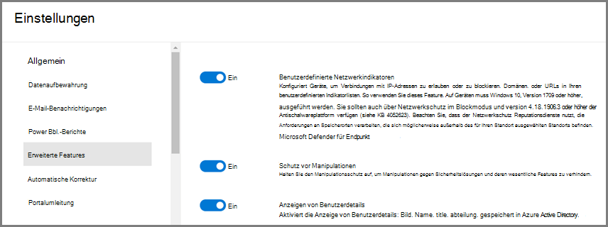
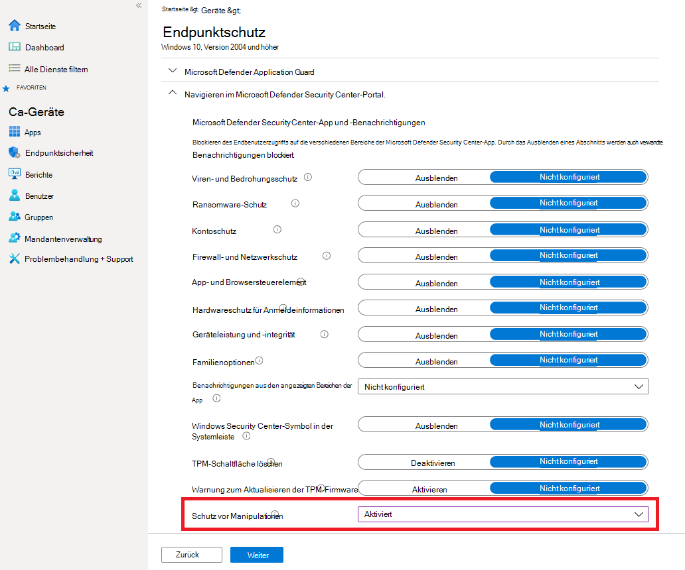
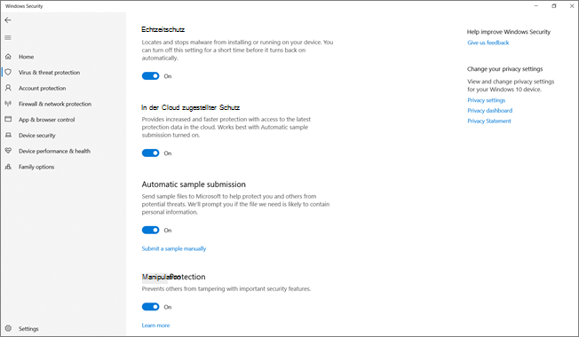
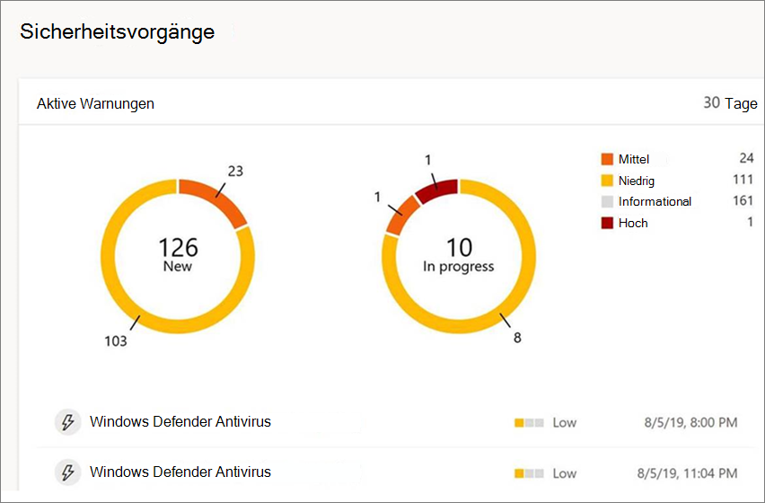

# Schützen von Sicherheitseinstellungen mit Manipulationsschutz

[!INCLUDE [Microsoft 365 Defender rebranding](../../includes/microsoft-defender.md)]

**Gilt für:**

- [Microsoft Defender für Endpunkt](/microsoft-365/security/defender-endpoint/)

Der Schutz vor Manipulationen ist für Geräte verfügbar, auf der eine der folgenden Versionen von Windows ausgeführt wird:

- Windows 10
- Windows Server 2019
- Windows Server, Version 1803 oder höher
- Windows Server 2016

## Übersicht

Bei einigen Arten von Cyberangriffen versuchen schlechte Akteure, Sicherheitsfeatures, z. B. Virenschutz, auf Ihren Computern zu deaktivieren. Schlechte Akteure möchten Ihre Sicherheitsfeatures deaktivieren, um leichteren Zugriff auf Ihre Daten zu erhalten, Schadsoftware zu installieren oder Ihre Daten, Identität und Geräte anderweitig auszunutzen. Manipulationsschutz verhindert, dass solche Dinge auftreten.

Mit dem Schutz vor Manipulationen können schädliche Apps keine Aktionen wie z. B.:

- Deaktivieren des Viren- und Bedrohungsschutzes
- Deaktivieren des Echtzeitschutzes
- Deaktivieren der Verhaltensüberwachung
- Deaktivieren von Antivirenprogrammen (z. B. IOfficeAntivirus (IOAV))
- Deaktivieren des in der Cloud übermittelten Schutzes
- Entfernen von Sicherheitsintelligenzupdates

### Funktionsweise

Manipulationsschutz sperrt Im Wesentlichen Microsoft Defender Antivirus und verhindert, dass Ihre Sicherheitseinstellungen über Apps und Methoden wie:

- Konfigurieren von Einstellungen im Registrierungs-Editor auf Ihrem Windows-Gerät
- Ändern von Einstellungen über PowerShell-Cmdlets
- Bearbeiten oder Entfernen von Sicherheitseinstellungen über Gruppenrichtlinien

Manipulationsschutz verhindert nicht, dass Sie Ihre Sicherheitseinstellungen anzeigen. Und der Manipulationsschutz hat keine Auswirkungen darauf, wie sich Antiviren-Apps von Drittanbietern bei der Windows Security-App registrieren. Wenn Ihre Organisation Windows 10 Enterprise E5 verwendet, können einzelne Benutzer die Einstellung zum Schutz vor Manipulationen nicht ändern. In diesen Fällen wird der Manipulationsschutz von Ihrem Sicherheitsteam verwaltet.

### Was möchten Sie machen?

| So führen Sie diese Aufgabe aus... | Siehe diesen Abschnitt... |
|:---|:---|
| Aktivieren (oder Deaktivieren) von Manipulationsschutz im Microsoft Defender Security Center 
Verwalten des Manipulationsschutzes in Ihrem Mandanten | [Verwalten des Manipulationsschutzes für Ihre Organisation mithilfe des Microsoft Defender Security Center](#manage-tamper-protection-for-your-organization-using-the-microsoft-defender-security-center) |
| Aktivieren (oder Deaktivieren) von Manipulationsschutz für die ganze oder einen Teil Ihrer Organisation mithilfe von Intune 
Optimieren von Manipulationsschutzeinstellungen in Ihrer Organisation | [Verwalten von Manipulationsschutz für Ihre Organisation mithilfe von Intune](#manage-tamper-protection-for-your-organization-using-intune) |
| Aktivieren (oder Deaktivieren) von Manipulationsschutz für Ihre Organisation mit Configuration Manager | [Verwalten des Fälschungsschutzes für Ihre Organisation mithilfe von Mandanten-Anfügen mit Configuration Manager, Version 2006](#manage-tamper-protection-for-your-organization-with-configuration-manager-version-2006) |
| Aktivieren (oder Deaktivieren) von Manipulationsschutz für ein einzelnes Gerät | [Verwalten des Manipulationsschutzes auf einem einzelnen Gerät](#manage-tamper-protection-on-an-individual-device) |
| Anzeigen von Details zu Manipulationsversuchen auf Geräten | [Anzeigen von Informationen zu Manipulationsversuchen](#view-information-about-tampering-attempts) |
| Überprüfen Ihrer Sicherheitsempfehlungen | [Überprüfen von Sicherheitsempfehlungen](#review-your-security-recommendations) |
| Überprüfen der Liste der häufig gestellten Fragen (FAQs) | [Durchsuchen der FAQs](#view-information-about-tampering-attempts) |

Abhängig von der Methode oder dem Verwaltungstool, die Sie zum Aktivieren des Manipulationsschutzes verwenden, kann es eine Abhängigkeit von MAPS (Cloud-delivered Protection) gibt. 

Die folgende Tabelle enthält Details zu den Methoden, Tools und Abhängigkeiten.

|     Aktivieren des Schutzes von Manipulationen                                         |     Abhängigkeit von MAPS (Cloud-zugestellter Schutz)    |
|------------------------------------------------------------------------------|--------------------------------------------------------|
|     Microsoft Intune                                                         |     Nein                                                 |
| Microsoft Endpoint Configuration Manager + Tenant Attach                     |     Nein                                                 |
|     Microsoft Defender for Endpoint Portal (securitycenter.microsoft.com)    |     Ja                                                |
|     Microsoft 365 Defender Portal (security.microsoft.com)                   |     Ja                                                |

## Verwalten des Manipulationsschutzes für Ihre Organisation mithilfe des Microsoft Defender Security Center

Der Manipulationsschutz kann für Ihren Mandanten über das Microsoft Defender Security Center ( ) aktiviert oder deaktiviert [https://securitycenter.windows.com](https://securitycenter.windows.com) werden. Hier sind einige Punkte, die Sie beachten sollten:

- Derzeit ist die Option zum Verwalten des Manipulationsschutzes im Microsoft Defender Security Center für neue Bereitstellungen standardmäßig aktiviert. Bei vorhandenen Bereitstellungen ist manipulationsschutz auf Opt-In-Basis verfügbar, mit Plänen, dies in naher Zukunft zur Standardmethode zu machen. (Wenn Sie sich dafür entscheiden möchten, wählen Sie im Microsoft Defender Security Center Einstellungen **aus.**  >  **Erweiterte Features**  >  **Manipulationsschutz**.) 

- Wenn Sie das Microsoft Defender Security Center zum Verwalten von Manipulationsschutz verwenden, müssen Sie weder Intune noch die Methode zum Anfügen von Mandanten verwenden.

- Wenn Sie den Manipulationsschutz im Microsoft Defender Security Center verwalten, wird die Einstellung mandantenweit angewendet, was sich auf alle Geräte mit Windows 10, Windows Server 2016 oder Windows Server 2019 ausdingt. Verwenden Sie zum Optimieren des Manipulationsschutzes (z. B. den Manipulationsschutz für einige Geräte, aber für andere deaktiviert), [entweder Intune](#manage-tamper-protection-for-your-organization-using-intune) oder [Configuration Manager mit Mandantenattachgabe](#manage-tamper-protection-for-your-organization-with-configuration-manager-version-2006).

- Wenn Sie über eine Hybridumgebung verfügen, haben in Intune konfigurierte Manipulationsschutzeinstellungen Vorrang vor einstellungen, die im Microsoft Defender Security Center konfiguriert sind. 

### Anforderungen für die Verwaltung von Manipulationsschutz im Microsoft Defender Security Center

- Sie müssen über entsprechende Berechtigungen [verfügen,](/microsoft-365/security/defender-endpoint/assign-portal-access)z. B. globaler Administrator, Sicherheitsadministrator oder Sicherheitsvorgänge.

- Auf Ihren Windows-Geräten muss eine der folgenden Versionen von Windows ausgeführt werden:
   - Windows 10
   - [Windows Server 2019](/windows-server/get-started-19/whats-new-19)
   - Windows Server, Version [1803](/windows/release-health/status-windows-10-1803) oder höher
   - [Windows Server 2016](/windows-server/get-started/whats-new-in-windows-server-2016)
   - Weitere Informationen zu Versionen finden Sie unter [Windows 10 Release Information](/windows/release-health/release-information).

- Ihre Geräte müssen [in Microsoft Defender for Endpoint onboarded werden.](/microsoft-365/security/defender-endpoint/onboarding)

- Ihre Geräte müssen die Anti-Malware-Plattform Version 4.18.2010.7 (oder höher) und die Version 1.1.17600.5 (oder höher) des An malware-Moduls verwenden. ([Verwalten von Microsoft Defender Antivirus-Updates und Anwenden von Basiswerten](manage-updates-baselines-microsoft-defender-antivirus.md).)

- [Der in der Cloud zugestellte Schutz](enable-cloud-protection-microsoft-defender-antivirus.md) muss aktiviert sein.

### Aktivieren (oder Deaktivieren) von Manipulationsschutz im Microsoft Defender Security Center 

1. Wechseln Sie zum Microsoft Defender Security Center ( [https://securitycenter.windows.com](https://securitycenter.windows.com) ) und melden Sie sich an.

2. Wählen Sie **Einstellungen** aus.

3. Wechseln Sie **zu Allgemeine**  >  **erweiterte Features,** und aktivieren Sie dann den Manipulationsschutz.

## Verwalten von Manipulationsschutz für Ihre Organisation mithilfe von Intune

Wenn Sie Teil des Sicherheitsteams Ihrer Organisation sind und Ihr Abonnement [Intune](/intune/fundamentals/what-is-intune)umfasst, können Sie den Manipulationsschutz für Ihre Organisation im [Microsoft Endpoint Manager Admin Center-Portal](https://endpoint.microsoft.com) aktivieren (oder deaktivieren). Verwenden Sie Intune, wenn Sie Manipulationsschutzeinstellungen optimieren möchten. Wenn Sie z. B. den Manipulationsschutz auf einigen Geräten aktivieren möchten, aber nicht auf allen Geräten, verwenden Sie Intune.

### Anforderungen für die Verwaltung von Manipulationsschutz in Intune

- Sie müssen über entsprechende Berechtigungen [verfügen,](/microsoft-365/security/defender-endpoint/assign-portal-access)z. B. globaler Administrator, Sicherheitsadministrator oder Sicherheitsvorgänge.

- Ihre Organisation verwendet [Intune zum Verwalten von Geräten.](/intune/fundamentals/what-is-device-management) ([#A0](/intune/fundamentals/licenses) sind erforderlich; Intune ist in Microsoft 365 E5 enthalten.)

- Auf Ihren Windows-Geräten muss Windows 10 OS [1709](/windows/release-health/status-windows-10-1709), [1803](/windows/release-health/status-windows-10-1803), [1809](/windows/release-health/status-windows-10-1809-and-windows-server-2019) oder höher ausgeführt werden. (Weitere Informationen zu Versionen finden Sie unter [Windows 10 Release Information](/windows/release-health/release-information).)

- Sie müssen die Windows-Sicherheit mit [Sicherheitsintelligenz](https://www.microsoft.com/wdsi/definitions) verwenden, die auf Version 1.287.60.0 (oder höher) aktualisiert wurde.

- Ihre Geräte müssen die Anti-Malware-Plattform Version 4.18.1906.3 (oder höher) und die Version 1.1.15500.X (oder höher) des An malware-Moduls verwenden. ([Manage Microsoft Defender Antivirus updates and apply baselines](manage-updates-baselines-microsoft-defender-antivirus.md).)

### Aktivieren (oder Deaktivieren) von Manipulationsschutz in Intune

1. Wechseln Sie zum [Microsoft Endpoint Manager Admin Center,](https://endpoint.microsoft.com) und melden Sie sich mit Ihrem Arbeits- oder Schulkonto an.

2. Wählen **Sie**  >  **Gerätekonfigurationsprofile aus.**

3. Erstellen Sie ein Profil, das die folgenden Einstellungen enthält:
    - **Plattform: Windows 10 und höher**
    - **Profiltyp: Endpunktschutz**
    - **Kategorie: Microsoft Defender Security Center**
    - **Manipulationsschutz: Aktiviert**

4. Weisen Sie das Profil einer oder mehreren Gruppen zu.

### Verwenden Sie Windows OS 1709, 1803 oder 1809?

Wenn Sie Windows 10 OS [1709,](/windows/release-health/status-windows-10-1709) [1803](/windows/release-health/status-windows-10-1803)oder [1809](/windows/release-health/status-windows-10-1809-and-windows-server-2019)verwenden, wird in der Windows-Sicherheit kein **Manipulationsschutz** angezeigt. Stattdessen können Sie powerShell verwenden, um zu bestimmen, ob der Manipulationsschutz aktiviert ist.

#### Verwenden von PowerShell zum Bestimmen, ob der Manipulationsschutz aktiviert ist

1. Öffnen Sie die Windows PowerShell App.

2. Verwenden Sie [das Get-MpComputerStatus](/powershell/module/defender/get-mpcomputerstatus?preserve-view=true&view=win10-ps) PowerShell-Cmdlet.

3. Suchen Sie in der Liste der Ergebnisse nach `IsTamperProtected` . (Der Wert *true bedeutet,* dass der Manipulationsschutz aktiviert ist.)

## Verwalten des Manipulationsschutzes für Ihre Organisation mit Configuration Manager, Version 2006

Wenn Sie Version [2006](/mem/configmgr/core/plan-design/changes/whats-new-in-version-2006)von Configuration Manager verwenden, können Sie Manipulationsschutzeinstellungen auf Windows 10, Windows Server 2016 und Windows Server 2019 mithilfe einer Methode namens Tenant *Attach verwalten.* Mit mandantenattachgefügen können Sie Ihre lokalen Konfigurations-Manager-Geräte mit dem Microsoft Endpoint Manager Admin Center synchronisieren und dann Konfigurationsrichtlinien für die Endpunktsicherheit an lokale Sammlungen auf & bereitstellen.

> [!NOTE]
> Das Verfahren kann verwendet werden, um den Manipulationsschutz auf Geräte zu erweitern, auf Windows 10 und Windows Server 2019 ausgeführt werden. Überprüfen Sie unbedingt die Voraussetzungen und andere Informationen in den in diesem Verfahren genannten Ressourcen.

1. Einrichten von Mandantenattaching. Hilfe dazu finden Sie unter [Microsoft Endpoint Manager: Gerätesynchronisierung und Geräteaktionen](/mem/configmgr/tenant-attach/device-sync-actions).

2. Wechseln Sie [Microsoft Endpoint Manager Admin Center](https://go.microsoft.com/fwlink/?linkid=2109431)zu Endpoint **Security**  >  **Antivirus,** und wählen Sie **dann + Richtlinie erstellen aus.**  
   - Wählen Sie **in der** Liste Plattform Windows 10 und Windows **Server (ConfigMgr) aus.**  
   - Wählen Sie **in der** Liste Profil die option **Windows-Sicherheit (Vorschau) aus.**  

3. Stellen Sie die Richtlinie in Ihrer Gerätesammlung zur Bereitstellung.

### Benötigen Sie Hilfe bei dieser Methode? 

Informationen finden Sie in den folgenden Ressourcen:

- [Einstellungen für das Windows-Sicherheit in Microsoft Intune](/mem/intune/protect/antivirus-security-experience-windows-settings)
- [Tech Community Blog: Ankündigung von Manipulationsschutz für Configuration Manager Tenant Attach Clients](https://techcommunity.microsoft.com/t5/microsoft-endpoint-manager-blog/announcing-tamper-protection-for-configuration-manager-tenant/ba-p/1700246#.X3QLR5Ziqq8.linkedin)

## Verwalten des Manipulationsschutzes auf einem einzelnen Gerät

> [!NOTE]
> Manipulationsschutz blockiert Versuche, Microsoft Defender Antivirus Einstellungen über die Registrierung zu ändern.
>
> Um sicherzustellen, dass der Manipulationsschutz keine Auswirkungen auf Sicherheitsprodukte von Drittanbietern oder Unternehmensinstallationsskripts hat, die diese Einstellungen ändern, wechseln Sie zu **Windows-Sicherheit,** und aktualisieren Sie **Security Intelligence** auf Version 1.287.60.0 oder höher. (Siehe [Security Intelligence Updates](https://www.microsoft.com/wdsi/definitions).)
>
> Nachdem Sie dieses Update vorgenommen haben, schützt der Manipulationsschutz weiterhin Ihre Registrierungseinstellungen, und die Protokolle versuchen, sie ohne Fehler zurück zu ändern.

Wenn Sie ein Heimbenutzer sind oder von einem Sicherheitsteam verwaltete Einstellungen nicht unterliegen, können Sie die Windows-Sicherheit-App verwenden, um den Manipulationsschutz zu verwalten. Sie müssen über die entsprechenden Administratorberechtigungen auf Ihrem Gerät verfügen, um Sicherheitseinstellungen wie Manipulationsschutz ändern zu können.

Dies sehen Sie in der Windows-Sicherheit App:

1. Wählen **Sie Start** aus, und geben Sie Sicherheit *ein.* Wählen Sie in den Suchergebnissen **Windows-Sicherheit** aus.

2. Wählen **Sie Virenschutz &**  >  **Virenschutz & Bedrohungsschutzeinstellungen aus.**

3. Legen **Sie Den Manipulationsschutz auf** Ein **oder** Aus **.**

## Anzeigen von Informationen zu Manipulationsversuchen

Manipulationsversuche deuten in der Regel auf größere Cyberangriffe hin. Schlechte Akteure versuchen, die Sicherheitseinstellungen zu ändern, um zu bleiben und unentdeckt zu bleiben. Wenn Sie Teil des Sicherheitsteams Ihrer Organisation sind, können Sie Informationen zu solchen Versuchen anzeigen und dann geeignete Maßnahmen ergreifen, um Bedrohungen zu mindern.

Wenn ein Manipulationsversuch erkannt wird, wird eine Warnung in der Microsoft Defender Security Center [(](/microsoft-365/security/defender-endpoint/portal-overview) [https://securitycenter.windows.com](https://securitycenter.windows.com) ) ausgelöst.

Mithilfe [EDR](/microsoft-365/security/defender-endpoint/overview-endpoint-detection-response) und [erweiterten Suchfunktionen](/microsoft-365/security/defender-endpoint/advanced-hunting-overview) in Microsoft Defender for Endpoint kann Ihr Sicherheitsteam solche Versuche untersuchen und adressiert.

## Überprüfen Ihrer Sicherheitsempfehlungen

Der Schutz vor Manipulationen ist in die Funktionen [& Bedrohungsverwaltung](/microsoft-365/security/defender-endpoint/next-gen-threat-and-vuln-mgt) integriert. [Zu den Sicherheitsempfehlungen](/microsoft-365/security/defender-endpoint/tvm-security-recommendation) gehört das Sicherstellen, dass der Manipulationsschutz aktiviert ist. Sie können z. B. nach *Manipulationen suchen,* wie in der folgenden Abbildung dargestellt:

In den Ergebnissen können Sie **Tamper Protection** aktivieren auswählen, um mehr zu erfahren und zu aktivieren.

Weitere Informationen zum & von Bedrohungen finden Sie unter [Threat & Vulnerability Management in Microsoft Defender Security Center](/microsoft-365/security/defender-endpoint/tvm-dashboard-insights#threat--vulnerability-management-in-microsoft-defender-security-center).

## Häufig gestellte Fragen

### Auf welche Windows Betriebssystemversionen ist der Schutz vor Manipulationen anwendbar?

Windows 10 OS [1709](/windows/release-health/status-windows-10-1709), [1803](/windows/release-health/status-windows-10-1803), [1809](/windows/release-health/status-windows-10-1809-and-windows-server-2019)oder höher zusammen mit [Microsoft Defender for Endpoint](/microsoft-365/security/defender-endpoint).

Wenn Sie Configuration Manager, Version 2006, verwenden, kann der Schutz vor Manipulationen mit Mandanteninfügen auf Windows Server 2019 erweitert werden. Weitere [Informationen finden Sie unter Tenant attach: Create and deploy endpoint security Antivirus policy from the Admin Center (preview)](/mem/configmgr/tenant-attach/deploy-antivirus-policy).

### Hat der Manipulationsschutz Auswirkungen auf die Antivirenregistrierung von Drittanbietern?

Nein. Antivirenangebote von Drittanbietern registrieren sich weiterhin bei der Windows-Sicherheit Anwendung.

### Was geschieht, Microsoft Defender Antivirus auf einem Gerät nicht aktiv ist?

Geräte, die in Microsoft Defender for Endpoint onboarded sind, Microsoft Defender Antivirus im passiven Modus ausgeführt werden. Der Manipulationsschutz schützt weiterhin den Dienst und seine Features. 

### Wie kann ich den Manipulationsschutz aktivieren/deaktivieren?

Wenn Sie ein Heimbenutzer sind, lesen Sie Verwalten von [Manipulationsschutz auf einem einzelnen Gerät](#manage-tamper-protection-on-an-individual-device).

Wenn Sie eine Organisation sind, die [Microsoft Defender for Endpoint](/microsoft-365/security/defender-endpoint)verwendet, sollten Sie in der Lage sein, den Manipulationsschutz in Intune ähnlich wie andere Endpunktschutzfunktionen zu verwalten. Weitere Informationen finden Sie in den folgenden Abschnitten dieses Artikels: 

- [Verwalten des Fälschungsschutzes mithilfe von Intune](#manage-tamper-protection-for-your-organization-using-intune)
- [Verwalten des Manipulationsschutzes mit Configuration Manager, Version 2006](#manage-tamper-protection-for-your-organization-with-configuration-manager-version-2006)
- [Verwalten des Manipulationsschutzes mithilfe Microsoft Defender Security Center](#manage-tamper-protection-for-your-organization-using-the-microsoft-defender-security-center) (derzeit in der Vorschau)

### Wie wirkt sich das Konfigurieren des Manipulationsschutzes in Intune darauf aus, wie ich Microsoft Defender Antivirus über meine Gruppenrichtlinie verwalte?

Ihre reguläre Gruppenrichtlinie gilt nicht für den Manipulationsschutz, und Änderungen an Microsoft Defender Antivirus werden ignoriert, wenn der Manipulationsschutz besteht. 

### Konfigurieren Sie für Microsoft Defender for Endpoint den Manipulationsschutz in Intune nur für die gesamte Organisation?

Das Konfigurieren des Manipulationsschutzes in Intune oder Microsoft Endpoint Manager kann auf Ihre gesamte Organisation sowie auf bestimmte Geräte und Benutzergruppen ausgerichtet werden.

### Kann ich den Manipulationsschutz in Microsoft Endpoint Configuration Manager?

Wenn Sie Mandantenattache verwenden, können Sie Microsoft Endpoint Configuration Manager. Informationen finden Sie in den folgenden Ressourcen:
- [Verwalten des Manipulationsschutzes für Ihre Organisation mit Configuration Manager, Version 2006](#manage-tamper-protection-for-your-organization-with-configuration-manager-version-2006)
- [Tech Community blog: Announcing Tamper Protection for Configuration Manager Tenant Attach clients](https://techcommunity.microsoft.com/t5/microsoft-endpoint-manager-blog/announcing-tamper-protection-for-configuration-manager-tenant/ba-p/1700246#.X3QLR5Ziqq8.linkedin)

### Ich habe die Windows E3-Registrierung. Kann ich den Schutz vor Manipulationen in Intune konfigurieren?

Derzeit ist das Konfigurieren des Manipulationsschutzes in Intune nur für Kunden verfügbar, die [Über Microsoft Defender for Endpoint verfügen.](/microsoft-365/security/defender-endpoint)

### Was geschieht, wenn ich versuche, microsoft Defender for Endpoint-Einstellungen in Intune, Microsoft Endpoint Configuration Manager und Windows Management Instrumentation zu ändern, wenn der Manipulationsschutz auf einem Gerät aktiviert ist?

Sie können die Features, die durch Manipulationsschutz geschützt sind, nicht ändern. solche Änderungsanforderungen werden ignoriert.

### Ich bin ein Unternehmenskunde. Können lokale Administratoren den Manipulationsschutz auf ihren Geräten ändern?

Nein. Lokale Administratoren können die Einstellungen für den Manipulationsschutz nicht ändern oder ändern.

### Was geschieht, wenn mein Gerät in Microsoft Defender for Endpoint onboarded ist und dann in einen off-boarded-Zustand übergeht?

Wenn ein Gerät von Microsoft Defender for Endpoint deaktiviert ist, ist der Manipulationsschutz aktiviert, was der Standardzustand für nicht verwaltete Geräte ist. 

### Gibt es eine Warnung darüber, dass sich der Manipulationsschutzstatus in der Microsoft Defender Security Center?

Ja. Die Warnung wird unter [https://securitycenter.microsoft.com](https://securitycenter.microsoft.com) Warnungen **angezeigt.**

Ihr Sicherheitsteam kann auch Suchabfragen verwenden, z. B. das folgende Beispiel:

`DeviceAlertEvents | where Title == "Tamper Protection bypass"`

[Anzeigen von Informationen zu Manipulationsversuchen](#view-information-about-tampering-attempts).

## Siehe auch

[Schützen von Windows PCs mit Endpoint Protection für Microsoft Intune](/intune/help-secure-windows-pcs-with-endpoint-protection-for-microsoft-intune)

[Verschaffen Sie sich einen Überblick über Microsoft Defender for Endpoint](/microsoft-365/security/defender-endpoint)

[Noch besser zusammen: Microsoft Defender Antivirus und Microsoft Defender für Endpunkt](why-use-microsoft-defender-antivirus.md)