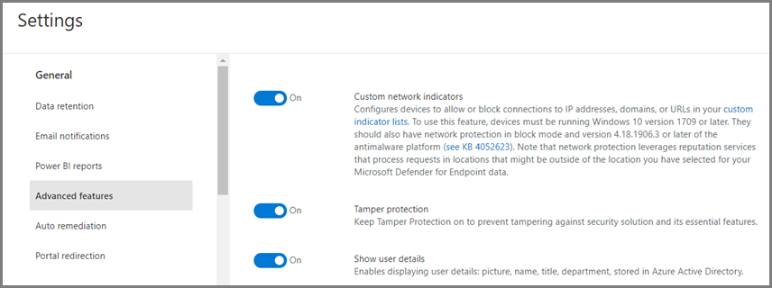

# Schützen von Sicherheitseinstellungen mit ManipulationsschutzProtect security settings with tamper protection

**Gilt für:****Applies to:**

- [Microsoft Defender für EndpunktMicrosoft Defender for Endpoint](/microsoft-365/security/defender-endpoint/)

Der Manipulationsschutz ist für Geräte verfügbar, auf denen eine der folgenden Versionen von Windows ausgeführt wird:Tamper protection is available for devices that are running one of the following versions of Windows:

- Windows 10Windows 10
- Windows Server 2019Windows Server 2019
- Windows Server, Version 1803 oder höherWindows Server, version 1803 or later
- Windows Server 2016Windows Server 2016

## ÜbersichtOverview

Bei einigen Arten von Cyberangriffen versuchen angreifer, Sicherheitsfeatures wie Virenschutz auf Ihren Computern zu deaktivieren.During some kinds of cyber attacks, bad actors try to disable security features, such as anti-virus protection, on your machines. Bad actors like to disable your security features to get easier access to your data, to install malware, or to otherwise exploit your data, identity, and devices.Bad actors like to disable your security features to get easier access to your data, to install malware, or to otherwise exploit your data, identity, and devices. Der Manipulationsschutz trägt dazu bei, diese Art von Dingen zu verhindern.Tamper protection helps prevent these kinds of things from occurring.

Mit Manipulationsschutz wird verhindert, dass schädliche Apps Aktionen ausführen, z. B.:With tamper protection, malicious apps are prevented from taking actions such as:

- Deaktivieren des Viren- und BedrohungsschutzesDisabling virus and threat protection
- Deaktivieren des EchtzeitschutzesDisabling real-time protection
- Deaktivieren der VerhaltensüberwachungTurning off behavior monitoring
- Deaktivieren von Antivirus (z. B. IOfficeAntivirus (IOAV))Disabling antivirus (such as IOfficeAntivirus (IOAV))
- Deaktivieren des über die Cloud bereitgestellten SchutzesDisabling cloud-delivered protection
- Entfernen von SicherheitsupdatesRemoving security intelligence updates

### FunktionsweiseHow it works

Der Manipulationsschutz sperrt im Wesentlichen Microsoft Defender Antivirus und verhindert, dass Ihre Sicherheitseinstellungen durch Apps und Methoden geändert werden, z. B.:Tamper protection essentially locks Microsoft Defender Antivirus and prevents your security settings from being changed through apps and methods such as:

- Konfigurieren von Einstellungen im Registrierungs-Editor auf Ihrem Windows GerätConfiguring settings in Registry Editor on your Windows device
- Ändern von Einstellungen über PowerShell-CmdletsChanging settings through PowerShell cmdlets
- Bearbeiten oder Entfernen von Sicherheitseinstellungen über GruppenrichtlinienEditing or removing security settings through group policies

Der Manipulationsschutz hindert Sie nicht daran, Ihre Sicherheitseinstellungen anzuzeigen.Tamper protection doesn't prevent you from viewing your security settings. Und der Manipulationsschutz hat keinen Einfluss darauf, wie Antiviren-Apps von Drittanbietern bei der Windows-Sicherheit-App registriert werden.And, tamper protection doesn't affect how third-party antivirus apps register with the Windows Security app. Wenn Ihre Organisation Windows 10 Enterprise E5 verwendet, können einzelne Benutzer die Einstellung für den Manipulationsschutz nicht ändern. In diesen Fällen wird der Manipulationsschutz von Ihrem Sicherheitsteam verwaltet.If your organization is using Windows 10 Enterprise E5, individual users can't change the tamper protection setting; in those cases, tamper protection is managed by your security team.

### Was möchten Sie machen?What do you want to do?

| So führen Sie diese Aufgabe aus...To perform this task... | Siehe diesen Abschnitt...See this section... |
|:---|:---|
| Verwalten des Manipulationsschutzes in Ihrem MandantenManage tamper protection across your tenant 
Verwenden der Microsoft Defender Security Center zum Ein- oder Ausschalten des ManipulationsschutzesUse the Microsoft Defender Security Center to turn tamper protection on or off | [Verwalten des Manipulationsschutzes für Ihre Organisation mithilfe der Microsoft Defender Security CenterManage tamper protection for your organization using the Microsoft Defender Security Center](#manage-tamper-protection-for-your-organization-using-the-microsoft-defender-security-center) |
| Optimieren der Manipulationsschutzeinstellungen in Ihrer OrganisationFine-tune tamper protection settings in your organization 
Verwenden Sie Intune (Microsoft Endpoint Manager), um den Manipulationsschutz zu aktivieren oder zu deaktivieren.Use Intune (Microsoft Endpoint Manager) to turn tamper protection on or off. Mit dieser Methode können Sie den Manipulationsschutz für einige oder alle Benutzer konfigurieren.You can configure tamper protection for some or all users with this method. | [Verwalten des Manipulationsschutzes für Ihre Organisation mit IntuneManage tamper protection for your organization using Intune](#manage-tamper-protection-for-your-organization-using-intune) |
| Aktivieren (oder Deaktivieren) des Manipulationsschutzes für Ihre Organisation mit Configuration ManagerTurn tamper protection on (or off) for your organization with Configuration Manager | [Verwalten des Manipulationsschutzes für Ihre Organisation mithilfe von Mandantenanfügung mit Configuration Manager, Version 2006Manage tamper protection for your organization using tenant attach with Configuration Manager, version 2006](#manage-tamper-protection-for-your-organization-with-configuration-manager-version-2006) |
| Ein- oder Ausschalten des Manipulationsschutzes für ein einzelnes GerätTurn tamper protection on (or off) for an individual device | [Verwalten des Manipulationsschutzes auf einem einzelnen GerätManage tamper protection on an individual device](#manage-tamper-protection-on-an-individual-device) |
| Anzeigen von Details zu Manipulationsversuchen auf GerätenView details about tampering attempts on devices | [Anzeigen von Informationen zu ManipulationsversuchenView information about tampering attempts](#view-information-about-tampering-attempts) |
| Überprüfen Ihrer SicherheitsempfehlungenReview your security recommendations | [Überprüfen von SicherheitsempfehlungenReview security recommendations](#review-your-security-recommendations) |
| Überprüfen der Liste der häufig gestellten Fragen (FAQs)Review the list of frequently asked questions (FAQs) | [Durchsuchen der häufig gestellten FragenBrowse the FAQs](#view-information-about-tampering-attempts) |

Abhängig von der Methode oder dem Verwaltungstool, das Sie zum Aktivieren des Manipulationsschutzes verwenden, besteht möglicherweise eine Abhängigkeit von MAPS (über die Cloud bereitgestellter Schutz).Depending on the method or management tool you use to enable Tamper protection, there might be a dependency on MAPS (cloud-delivered protection). 

Die folgende Tabelle enthält Details zu den Methoden, Tools und Abhängigkeiten.The following table provides details on the methods, tools, and dependencies.

| So wird der Manipulationsschutz aktiviertHow Tamper protection is enabled  | Abhängigkeit von MAPS (über die Cloud bereitgestellter Schutz)Dependency on MAPS (cloud-delivered protection)    |
|:----|:----|
| Microsoft IntuneMicrosoft Intune  | NeinNo |
| Microsoft Endpoint Configuration Manager + MandantenanfügungMicrosoft Endpoint Configuration Manager + Tenant Attach  |     NeinNo  |
| Microsoft Defender Security Center ( [https://securitycenter.microsoft.com](https://securitycenter.microsoft.com) )Microsoft Defender Security Center ([https://securitycenter.microsoft.com](https://securitycenter.microsoft.com))    |     JaYes |
| Microsoft 365 Security Center ( [https://security.microsoft.com](https://security.microsoft.com) )Microsoft 365 security center ([https://security.microsoft.com](https://security.microsoft.com))  |     JaYes  |

## Verwalten des Manipulationsschutzes für Ihre Organisation mithilfe der Microsoft Defender Security CenterManage tamper protection for your organization using the Microsoft Defender Security Center

Der Manipulationsschutz kann für Ihren Mandanten mithilfe der Microsoft Defender Security Center ( ) aktiviert oder deaktiviert [https://securitycenter.windows.com](https://securitycenter.windows.com) werden.Tamper protection can be turned on or off for your tenant using the Microsoft Defender Security Center ([https://securitycenter.windows.com](https://securitycenter.windows.com)). Beachten Sie hier einige Punkte:Here are a few points to keep in mind:

- Derzeit ist die Option zum Verwalten des Manipulationsschutzes im Microsoft Defender Security Center für neue Bereitstellungen standardmäßig aktiviert.Currently, the option to manage tamper protection in the Microsoft Defender Security Center is on by default for new deployments. Für vorhandene Bereitstellungen steht der Manipulationsschutz auf der Basis der Anmeldung zur Verfügung, mit Plänen, in naher Zukunft die Standardmethode zu aktivieren.For existing deployments, tamper protection is available on an opt-in basis, with plans to make opting in the default method in the near future. (Wenn Sie sich anmelden möchten, wählen Sie im Microsoft Defender Security Center **Einstellungen**  >  **Erweiterte Features**  >  **Manipulationsschutz**.)(To opt in, in the Microsoft Defender Security Center, choose **Settings** > **Advanced features** > **Tamper protection**.) 

- Wenn Sie die Microsoft Defender Security Center zum Verwalten des Manipulationsschutzes verwenden, müssen Sie intune oder die Methode zum Anfügen von Mandanten nicht verwenden.When you use the Microsoft Defender Security Center to manage tamper protection, you do not have to use Intune or the tenant attach method.

- Wenn Sie den Manipulationsschutz im Microsoft Defender Security Center verwalten, wird die Einstellung mandantenweit angewendet und wirkt sich auf alle Ihre Geräte aus, auf denen Windows 10, Windows Server 2016 oder Windows Server 2019 ausgeführt wird.When you manage tamper protection in the Microsoft Defender Security Center, the setting is applied tenant wide, affecting all of your devices that are running Windows 10, Windows Server 2016, or Windows Server 2019. Verwenden Sie [Intune](#manage-tamper-protection-for-your-organization-using-intune) oder [Configuration Manager mit Mandantenanfügung,](#manage-tamper-protection-for-your-organization-with-configuration-manager-version-2006)um den Manipulationsschutz (z. B. Manipulationsschutz für einige Geräte, aber deaktiviert für andere Geräte) zu optimieren.To fine-tune tamper protection (such as having tamper protection on for some devices but off for others), use either [Intune](#manage-tamper-protection-for-your-organization-using-intune) or [Configuration Manager with tenant attach](#manage-tamper-protection-for-your-organization-with-configuration-manager-version-2006).

- Wenn Sie über eine Hybridumgebung verfügen, haben in Intune konfigurierte Manipulationsschutzeinstellungen Vorrang vor einstellungen, die im Microsoft Defender Security Center konfiguriert sind.If you have a hybrid environment, tamper protection settings configured in Intune take precedence over settings configured in the Microsoft Defender Security Center. 

### Anforderungen für die Verwaltung des Manipulationsschutzes in der Microsoft Defender Security CenterRequirements for managing tamper protection in the Microsoft Defender Security Center

- Sie müssen über entsprechende [Berechtigungen](/microsoft-365/security/defender-endpoint/assign-portal-access)verfügen, z. B. globale Administratoren, Sicherheitsadministratoren oder Sicherheitsvorgänge.You must have appropriate [permissions](/microsoft-365/security/defender-endpoint/assign-portal-access), such as global admin, security admin, or security operations.

- Auf Ihren Windows Geräten muss eine der folgenden Versionen von Windows ausgeführt werden:Your Windows devices must be running one of the following versions of Windows:
   - Windows 10Windows 10
   - [Windows Server 2019Windows Server 2019](/windows-server/get-started-19/whats-new-19)
   - Windows Server, Version [1803](/windows/release-health/status-windows-10-1803) oder höherWindows Server, version [1803](/windows/release-health/status-windows-10-1803) or later
   - [Windows Server 2016Windows Server 2016](/windows-server/get-started/whats-new-in-windows-server-2016)
   - Weitere Informationen zu Versionen finden Sie unter [Windows 10 Versionsinformationen.](/windows/release-health/release-information)For more information about releases, see [Windows 10 release information](/windows/release-health/release-information).

- Ihre Geräte müssen [in Microsoft Defender für Endpunkt integriert](/microsoft-365/security/defender-endpoint/onboarding)sein.Your devices must be [onboarded to Microsoft Defender for Endpoint](/microsoft-365/security/defender-endpoint/onboarding).

- Ihre Geräte müssen die Antischadsoftwareplattform version 4.18.2010.7 (oder höher) und die Antischadsoftwaremodul-Version 1.1.17600.5 (oder höher) verwenden.Your devices must be using anti-malware platform version 4.18.2010.7 (or above) and anti-malware engine version 1.1.17600.5 (or above). ([Verwalten Microsoft Defender Antivirus Updates und Anwenden von Basisplänen.)](manage-updates-baselines-microsoft-defender-antivirus.md)([Manage Microsoft Defender Antivirus updates and apply baselines](manage-updates-baselines-microsoft-defender-antivirus.md).)

- Der über die [Cloud bereitgestellte Schutz](enable-cloud-protection-microsoft-defender-antivirus.md) muss aktiviert sein.[Cloud-delivered protection](enable-cloud-protection-microsoft-defender-antivirus.md) must be turned on.

### Manipulationsschutz im Microsoft Defender Security Center aktivieren (oder deaktivieren)Turn tamper protection on (or off) in the Microsoft Defender Security Center 

1. Wechseln Sie zum Microsoft Defender Security Center ( [https://securitycenter.windows.com](https://securitycenter.windows.com) ) und melden Sie sich an.Go to the Microsoft Defender Security Center ([https://securitycenter.windows.com](https://securitycenter.windows.com)) and sign in.

2. Wählen Sie **Einstellungen** aus.Choose **Settings**.

3. Wechseln Sie zu **"Allgemeine**  >  **erweiterte Features",** und aktivieren Sie dann den Manipulationsschutz.Go to **General** > **Advanced features**, and then turn tamper protection on.

## Verwalten des Manipulationsschutzes für Ihre Organisation mit IntuneManage tamper protection for your organization using Intune

Wenn Sie Teil des Sicherheitsteams Ihrer Organisation sind und Ihr Abonnement [Intune](/intune/fundamentals/what-is-intune)umfasst, können Sie den Manipulationsschutz für Ihre Organisation im Microsoft Endpoint Manager Admin Center ( ) aktivieren (oder [https://endpoint.microsoft.com](https://endpoint.microsoft.com) deaktivieren).If you are part of your organization's security team, and your subscription includes [Intune](/intune/fundamentals/what-is-intune), you can turn tamper protection on (or off) for your organization in the Microsoft Endpoint Manager admin center ([https://endpoint.microsoft.com](https://endpoint.microsoft.com)). Verwenden Sie Intune, wenn Sie Manipulationsschutzeinstellungen optimieren möchten.Use Intune when you want to fine-tune tamper protection settings. Wenn Sie beispielsweise den Manipulationsschutz auf einigen, aber nicht allen Geräten aktivieren möchten, verwenden Sie Intune.For example, if you want to enable tamper protection on some devices, but not all, use Intune.

### Anforderungen für die Verwaltung des Manipulationsschutzes in IntuneRequirements for managing tamper protection in Intune

- Sie müssen über entsprechende [Berechtigungen](/microsoft-365/security/defender-endpoint/assign-portal-access)verfügen, z. B. globale Administratoren, Sicherheitsadministratoren oder Sicherheitsvorgänge.You must have appropriate [permissions](/microsoft-365/security/defender-endpoint/assign-portal-access), such as global admin, security admin, or security operations.

- Ihre Organisation verwendet [Intune zum Verwalten von Geräten.](/intune/fundamentals/what-is-device-management)Your organization uses [Intune to manage devices](/intune/fundamentals/what-is-device-management). ([Intune-Lizenzen](/intune/fundamentals/licenses) sind erforderlich; Intune ist in Microsoft 365 E5 enthalten.)([Intune licenses](/intune/fundamentals/licenses) are required; Intune is included in Microsoft 365 E5.)

- Ihre Windows Geräte müssen Windows 10 Betriebssystem [1709](/windows/release-health/status-windows-10-1709), [1803](/windows/release-health/status-windows-10-1803), [1809](/windows/release-health/status-windows-10-1809-and-windows-server-2019) oder höher ausgeführt werden.Your Windows devices must be running Windows 10 OS [1709](/windows/release-health/status-windows-10-1709), [1803](/windows/release-health/status-windows-10-1803), [1809](/windows/release-health/status-windows-10-1809-and-windows-server-2019) or later. (Weitere Informationen zu Releases finden Sie [unter Windows 10 Versionsinformationen.)](/windows/release-health/release-information)(For more information about releases, see [Windows 10 release information](/windows/release-health/release-information).)

- Sie müssen Windows Sicherheit mit [Security Intelligence](https://www.microsoft.com/wdsi/definitions) verwenden, die auf Version 1.287.60.0 (oder höher) aktualisiert wurde.You must be using Windows security with [security intelligence](https://www.microsoft.com/wdsi/definitions) updated to version 1.287.60.0 (or above).

- Ihre Geräte müssen die Antischadsoftwareplattform version 4.18.1906.3 (oder höher) und die Antischadsoftware-Modulversion 1.1.15500.X (oder höher) verwenden.Your devices must be using anti-malware platform version 4.18.1906.3 (or above) and anti-malware engine version 1.1.15500.X (or above). ([Verwalten Microsoft Defender Antivirus Updates und Anwenden von Basisplänen.)](manage-updates-baselines-microsoft-defender-antivirus.md)([Manage Microsoft Defender Antivirus updates and apply baselines](manage-updates-baselines-microsoft-defender-antivirus.md).)

### Manipulationsschutz in Intune aktivieren (oder deaktivieren)Turn tamper protection on (or off) in Intune

1. Wechseln Sie zum [Microsoft Endpoint Manager Admin Center,](https://endpoint.microsoft.com) und melden Sie sich mit Ihrem Geschäfts-, Schul- oder Unikonto an.Go to the [Microsoft Endpoint Manager admin center](https://endpoint.microsoft.com) and sign in with your work or school account.

2. Wählen Sie  >  **Gerätekonfigurationsprofile aus.**Select **Devices** > **Configuration Profiles**.

3. Erstellen Sie ein Profil, das die folgenden Einstellungen enthält:Create a profile that includes the following settings:
    - **Plattform: Windows 10 und höher****Platform: Windows 10 and later**
    - **Profiltyp: Endpunktschutz****Profile type: Endpoint protection**
    - **Kategorie: Microsoft Defender Security Center****Category: Microsoft Defender Security Center**
    - **Manipulationsschutz: Aktiviert****Tamper Protection: Enabled**

4. Weisen Sie das Profil einer oder mehreren Gruppen zu.Assign the profile to one or more groups.

### Verwenden Sie Windows Betriebssystem 1709, 1803 oder 1809?Are you using Windows OS 1709, 1803, or 1809?

Wenn Sie Windows 10 OS [1709](/windows/release-health/status-windows-10-1709), [1803](/windows/release-health/status-windows-10-1803)oder [1809](/windows/release-health/status-windows-10-1809-and-windows-server-2019)verwenden, wird der **Manipulationsschutz** in der Windows-Sicherheit-App nicht angezeigt.If you are using Windows 10 OS [1709](/windows/release-health/status-windows-10-1709), [1803](/windows/release-health/status-windows-10-1803), or [1809](/windows/release-health/status-windows-10-1809-and-windows-server-2019), you won't see **Tamper Protection** in the Windows Security app. Stattdessen können Sie PowerShell verwenden, um zu bestimmen, ob der Manipulationsschutz aktiviert ist.Instead, you can use PowerShell to determine whether tamper protection is enabled.

#### Verwenden von PowerShell, um zu bestimmen, ob der Manipulationsschutz aktiviert istUse PowerShell to determine whether tamper protection is turned on

1. Öffnen Sie die Windows PowerShell-App.Open the Windows PowerShell app.

2. Verwenden Sie das [PowerShell-Cmdlet "Get-MpComputerStatus".](/powershell/module/defender/get-mpcomputerstatus?preserve-view=true&view=win10-ps)Use the [Get-MpComputerStatus](/powershell/module/defender/get-mpcomputerstatus?preserve-view=true&view=win10-ps) PowerShell cmdlet.

3. Suchen Sie in der Liste der Ergebnisse nach `IsTamperProtected` .In the list of results, look for `IsTamperProtected`. (Der Wert *"true"* bedeutet, dass der Manipulationsschutz aktiviert ist.)(A value of *true* means tamper protection is enabled.)

## Verwalten des Manipulationsschutzes für Ihre Organisation mit Configuration Manager, Version 2006Manage tamper protection for your organization with Configuration Manager, version 2006

Wenn Sie [Version 2006 von Configuration Manager](/mem/configmgr/core/plan-design/changes/whats-new-in-version-2006)verwenden, können Sie Manipulationsschutzeinstellungen auf Windows 10, Windows Server 2016 und Windows Server 2019 mithilfe einer Methode namens Tenant *Attach* verwalten.If you're using [version 2006 of Configuration Manager](/mem/configmgr/core/plan-design/changes/whats-new-in-version-2006), you can manage tamper protection settings on Windows 10, Windows Server 2016, and Windows Server 2019 by using a method called *tenant attach*. Die Mandantenanfügung ermöglicht es Ihnen, Ihre lokalen Configuration Manager-Geräte im Microsoft Endpoint Manager Admin Center zu synchronisieren und dann Endpunktsicherheitsrichtlinien für lokale Sammlungen & Geräte bereitzustellen.Tenant attach enables you to sync your on-premises-only Configuration Manager devices into the Microsoft Endpoint Manager admin center, and then deliver endpoint security configuration policies to on-premises collections & devices.

:::image type="content" source="images/win-security- exp-policy-endpt-security.png" alt-text="Windows-Sicherheit in Endpoint Manager":::

> [!NOTE]
> Das Verfahren kann verwendet werden, um den Manipulationsschutz auf Geräte zu erweitern, auf denen Windows 10 und Windows Server 2019 ausgeführt wird.The procedure can be used to extend tamper protection to devices running Windows 10 and Windows Server 2019. Überprüfen Sie die voraussetzungen und andere Informationen in den in diesem Verfahren erwähnten Ressourcen.Make sure to review the prerequisites and other information in the resources mentioned in this procedure.

1. Einrichten von Mandantenanfügung.Set up tenant attach. Weitere Informationen finden Sie [unter Microsoft Endpoint Manager Mandantenanfügung: Gerätesynchronisierung und Geräteaktionen.](/mem/configmgr/tenant-attach/device-sync-actions)To learn more, see [Microsoft Endpoint Manager tenant attach: Device sync and device actions](/mem/configmgr/tenant-attach/device-sync-actions).

2. Wechseln [Sie](https://go.microsoft.com/fwlink/?linkid=2109431)im Microsoft Endpoint Manager Admin Center zu **Endpoint Security**  >  **Antivirus,** und wählen Sie dann **+ Richtlinie erstellen** aus.In the [Microsoft Endpoint Manager admin center](https://go.microsoft.com/fwlink/?linkid=2109431), go to **Endpoint security** > **Antivirus**, and then choose **+ Create Policy**.  
   - Wählen Sie in der **Plattformliste** **Windows 10 und Windows Server (ConfigMgr)** aus.In the **Platform** list, select **Windows 10 and Windows Server (ConfigMgr)**.  
   - Wählen Sie in der **Profilliste** **Windows-Sicherheit Erfahrung (Vorschau)** aus.In the **Profile** list, select **Windows Security experience (preview)**.  

3. Stellen Sie die Richtlinie für Ihre Gerätesammlung bereit.Deploy the policy to your device collection.

### Benötigen Sie Hilfe bei dieser Methode?Need help with this method? 

Informationen finden Sie in den folgenden Ressourcen:See the following resources:

- [Einstellungen für das Windows-Sicherheit-Erfahrungsprofil in Microsoft IntuneSettings for the Windows Security experience profile in Microsoft Intune](/mem/intune/protect/antivirus-security-experience-windows-settings)
- [Tech Community Blog: Ankündigung des Manipulationsschutzes für Configuration Manager Tenant Attach-ClientsTech Community Blog: Announcing Tamper Protection for Configuration Manager Tenant Attach clients](https://techcommunity.microsoft.com/t5/microsoft-endpoint-manager-blog/announcing-tamper-protection-for-configuration-manager-tenant/ba-p/1700246#.X3QLR5Ziqq8.linkedin)

## Verwalten des Manipulationsschutzes auf einem einzelnen GerätManage tamper protection on an individual device

> [!NOTE]
> Der Manipulationsschutz blockiert Versuche, Microsoft Defender Antivirus Einstellungen über die Registrierung zu ändern.Tamper protection blocks attempts to modify Microsoft Defender Antivirus settings through the registry.
>
> Um sicherzustellen, dass der Manipulationsschutz keine Konflikte mit Sicherheitsprodukten von Drittanbietern oder Unternehmensinstallationsskripts zur Änderung dieser Einstellungen verhindert, wechseln Sie zu **Windows-Sicherheit** und aktualisieren **Sie Security Intelligence** auf Version 1.287.60.0 oder höher.To help ensure that tamper protection doesn’t interfere with third-party security products or enterprise installation scripts that modify these settings, go to **Windows Security** and update **Security intelligence** to version 1.287.60.0 or later. (Siehe [Security Intelligence-Updates.)](https://www.microsoft.com/wdsi/definitions)(See [Security intelligence updates](https://www.microsoft.com/wdsi/definitions).)
>
> Nachdem Sie dieses Update vorgenommen haben, schützt der Manipulationsschutz weiterhin Ihre Registrierungseinstellungen und protokolliert Versuche, diese zu ändern, ohne Fehler zurückzugeben.Once you’ve made this update, tamper protection continues to protect your registry settings, and logs attempts to modify them without returning errors.

Wenn Sie ein Privatbenutzer sind oder nicht den von einem Sicherheitsteam verwalteten Einstellungen unterliegen, können Sie die Windows-Sicherheit-App verwenden, um den Manipulationsschutz zu verwalten.If you are a home user, or you are not subject to settings managed by a security team, you can use the Windows Security app to manage tamper protection. Sie müssen über die entsprechenden Administratorberechtigungen auf Ihrem Gerät verfügen, um Sicherheitseinstellungen wie Manipulationsschutz zu ändern.You must have appropriate admin permissions on your device to do change security settings, such as tamper protection.

In der Windows-Sicherheit-App sehen Sie Folgendes:Here's what you see in the Windows Security app:

1. Wählen Sie **"Start"** aus, und beginnen Sie mit der Eingabe von *"Sicherheit".*Select **Start**, and start typing *Security*. Wählen Sie in den Suchergebnissen **Windows-Sicherheit** aus.In the search results, select **Windows Security**.

2. Wählen Sie Die Einstellungen **für viren- & Bedrohungsschutz**  >  **& Bedrohungsschutz** aus.Select **Virus & threat protection** > **Virus & threat protection settings**.

3. Legen Sie **den Manipulationsschutz** auf **"Ein"** oder **"Aus"** fest.Set **Tamper Protection** to **On** or **Off**.

## Anzeigen von Informationen zu ManipulationsversuchenView information about tampering attempts

Manipulationsversuche deuten in der Regel auf größere Cyberangriffe hin.Tampering attempts typically indicate bigger cyberattacks. Schlechte Akteure versuchen, Sicherheitseinstellungen zu ändern, um zu speichern und nicht erkannt zu bleiben.Bad actors try to change security settings as a way to persist and stay undetected. Wenn Sie Teil des Sicherheitsteams Ihrer Organisation sind, können Sie Informationen zu solchen Versuchen anzeigen und dann geeignete Maßnahmen ergreifen, um Bedrohungen zu mindern.If you're part of your organization's security team, you can view information about such attempts, and then take appropriate actions to mitigate threats.

Wenn ein Manipulationsversuch erkannt wird, wird im [Microsoft Defender Security Center](/microsoft-365/security/defender-endpoint/portal-overview) ( ) eine Warnung [https://securitycenter.windows.com](https://securitycenter.windows.com) ausgelöst.When a tampering attempt is detected, an alert is raised in the [Microsoft Defender Security Center](/microsoft-365/security/defender-endpoint/portal-overview) ([https://securitycenter.windows.com](https://securitycenter.windows.com)).

Mit [EDR](/microsoft-365/security/defender-endpoint/overview-endpoint-detection-response) und [erweiterten Suchfunktionen](/microsoft-365/security/defender-endpoint/advanced-hunting-overview) in Microsoft Defender für Endpunkt kann Ihr Sicherheitsteam solche Versuche untersuchen und behandeln.Using [endpoint detection and response](/microsoft-365/security/defender-endpoint/overview-endpoint-detection-response) and [advanced hunting](/microsoft-365/security/defender-endpoint/advanced-hunting-overview) capabilities in Microsoft Defender for Endpoint, your security operations team can investigate and address such attempts.

## Überprüfen Ihrer SicherheitsempfehlungenReview your security recommendations

Der Manipulationsschutz lässt sich in die Funktionen [von Threat & Vulnerability Management](/microsoft-365/security/defender-endpoint/next-gen-threat-and-vuln-mgt) integrieren.Tamper protection integrates with [Threat & Vulnerability Management](/microsoft-365/security/defender-endpoint/next-gen-threat-and-vuln-mgt) capabilities. [Sicherheitsempfehlungen](/microsoft-365/security/defender-endpoint/tvm-security-recommendation) umfassen das Sicherstellen, dass der Manipulationsschutz aktiviert ist.[Security recommendations](/microsoft-365/security/defender-endpoint/tvm-security-recommendation) include making sure tamper protection is turned on. Sie können z. B. nach *Manipulationen* suchen, wie in der folgenden Abbildung dargestellt:For example, you can search on *tamper*, as shown in the following image:

In den Ergebnissen können Sie **"Manipulationsschutz aktivieren"** auswählen, um mehr zu erfahren und es zu aktivieren.In the results, you can select **Turn on Tamper Protection** to learn more and turn it on.

Weitere Informationen zur Bedrohungs- & Sicherheitsrisikoverwaltung finden Sie unter ["Bedrohungs- & Sicherheitsrisikoverwaltung" in Microsoft Defender Security Center.](/microsoft-365/security/defender-endpoint/tvm-dashboard-insights#threat--vulnerability-management-in-microsoft-defender-security-center)To learn more about Threat & Vulnerability Management, see [Threat & Vulnerability Management in Microsoft Defender Security Center](/microsoft-365/security/defender-endpoint/tvm-dashboard-insights#threat--vulnerability-management-in-microsoft-defender-security-center).

## Häufig gestellte FragenFrequently asked questions

### Für welche Windows Betriebssystemversionen die Konfiguration des Manipulationsschutzes gilt?To which Windows OS versions is configuring tamper protection is applicable?

Windows 10 OS [1709](/windows/release-health/status-windows-10-1709), [1803](/windows/release-health/status-windows-10-1803), [1809](/windows/release-health/status-windows-10-1809-and-windows-server-2019)oder höher zusammen mit [Microsoft Defender für Endpunkt.](/microsoft-365/security/defender-endpoint)Windows 10 OS [1709](/windows/release-health/status-windows-10-1709), [1803](/windows/release-health/status-windows-10-1803), [1809](/windows/release-health/status-windows-10-1809-and-windows-server-2019), or later together with [Microsoft Defender for Endpoint](/microsoft-365/security/defender-endpoint).

Wenn Sie Configuration Manager, Version 2006, mit Mandantenanfügung verwenden, kann der Manipulationsschutz auf Windows Server 2019 erweitert werden.If you are using Configuration Manager, version 2006, with tenant attach, tamper protection can be extended to Windows Server 2019. Siehe ["Mandantenanfügung: Erstellen und Bereitstellen einer Antivirusrichtlinie für Endpunktsicherheit" im Admin Center (Vorschau).](/mem/configmgr/tenant-attach/deploy-antivirus-policy)See [Tenant attach: Create and deploy endpoint security Antivirus policy from the admin center (preview)](/mem/configmgr/tenant-attach/deploy-antivirus-policy).

### Hat der Manipulationsschutz Auswirkungen auf die Antivirenregistrierung von Drittanbietern?Will tamper protection have any impact on third-party antivirus registration?

Nein.No. Antivirenangebote von Drittanbietern werden weiterhin bei der Windows-Sicherheit-Anwendung registriert.Third-party antivirus offerings will continue to register with the Windows Security application.

### Was geschieht, wenn Microsoft Defender Antivirus nicht auf einem Gerät aktiv ist?What happens if Microsoft Defender Antivirus is not active on a device?

Auf Geräten, die in Microsoft Defender für Endpunkt integriert sind, wird Microsoft Defender Antivirus im passiven Modus ausgeführt.Devices that are onboarded to Microsoft Defender for Endpoint will have Microsoft Defender Antivirus running in passive mode. Der Manipulationsschutz schützt weiterhin den Dienst und seine Features.Tamper protection will continue to protect the service and its features. 

### Wie kann ich den Manipulationsschutz aktivieren/deaktivieren?How can I turn tamper protection on/off?

Wenn Sie ein Privatbenutzer sind, lesen [Sie "Verwalten des Manipulationsschutzes auf einem einzelnen Gerät".](#manage-tamper-protection-on-an-individual-device)If you are a home user, see [Manage tamper protection on an individual device](#manage-tamper-protection-on-an-individual-device).

Wenn Sie eine Organisation sind, die [Microsoft Defender für Endpunkt](/microsoft-365/security/defender-endpoint)verwendet, sollten Sie in der Lage sein, den Manipulationsschutz in Intune ähnlich wie bei der Verwaltung anderer Endpunktschutzfeatures zu verwalten.If you are an organization using [Microsoft Defender for Endpoint](/microsoft-365/security/defender-endpoint), you should be able to manage tamper protection in Intune similar to how you manage other endpoint protection features. Weitere Informationen finden Sie in den folgenden Abschnitten dieses Artikels:See the following sections of this article: 

- [Verwalten des Manipulationsschutzes mit IntuneManage tamper protection using Intune](#manage-tamper-protection-for-your-organization-using-intune)
- [Verwalten des Manipulationsschutzes mit configuration Manager, Version 2006Manage tamper protection using Configuration Manager, version 2006](#manage-tamper-protection-for-your-organization-with-configuration-manager-version-2006)
- [Verwalten des Manipulationsschutzes mithilfe der Microsoft Defender Security CenterManage tamper protection using the Microsoft Defender Security Center](#manage-tamper-protection-for-your-organization-using-the-microsoft-defender-security-center) 

### Wie wirkt sich die Konfiguration des Manipulationsschutzes in Intune darauf aus, wie ich Microsoft Defender Antivirus über meine Gruppenrichtlinie verwalte?How does configuring tamper protection in Intune affect how I manage Microsoft Defender Antivirus through my group policy?

Ihre reguläre Gruppenrichtlinie gilt nicht für den Manipulationsschutz, und Änderungen an Microsoft Defender Antivirus Einstellungen werden ignoriert, wenn der Manipulationsschutz aktiviert ist.Your regular group policy doesn’t apply to tamper protection, and changes to Microsoft Defender Antivirus settings are ignored when tamper protection is on. 

### Konfigurieren Sie für Microsoft Defender für Endpunkt den Manipulationsschutz in Intune nur für die gesamte Organisation?For Microsoft Defender for Endpoint, is configuring tamper protection in Intune targeted to the entire organization only?

Die Konfiguration des Manipulationsschutzes in Intune oder Microsoft Endpoint Manager kann auf Ihre gesamte Organisation sowie auf bestimmte Geräte und Benutzergruppen ausgerichtet sein.Configuring tamper protection in Intune or Microsoft Endpoint Manager can be targeted to your entire organization and to specific devices and user groups.

### Kann ich den Manipulationsschutz in Microsoft Endpoint Configuration Manager konfigurieren?Can I configure Tamper Protection in Microsoft Endpoint Configuration Manager?

Wenn Sie Tenant Attach verwenden, können Sie Microsoft Endpoint Configuration Manager verwenden.If you are using tenant attach, you can use Microsoft Endpoint Configuration Manager. Informationen finden Sie in den folgenden Ressourcen:See the following resources:
- [Verwalten des Manipulationsschutzes für Ihre Organisation mit Configuration Manager, Version 2006Manage tamper protection for your organization with Configuration Manager, version 2006](#manage-tamper-protection-for-your-organization-with-configuration-manager-version-2006)
- [Tech Community Blog: Ankündigung des Manipulationsschutzes für Configuration Manager Tenant Attach-ClientsTech Community blog: Announcing Tamper Protection for Configuration Manager Tenant Attach clients](https://techcommunity.microsoft.com/t5/microsoft-endpoint-manager-blog/announcing-tamper-protection-for-configuration-manager-tenant/ba-p/1700246#.X3QLR5Ziqq8.linkedin)

### Ich habe die Windows E3-Registrierung.I have the Windows E3 enrollment. Kann ich den Manipulationsschutz in Intune konfigurieren?Can I use configuring tamper protection in Intune?

Derzeit ist die Konfiguration des Manipulationsschutzes in Intune nur für Kunden verfügbar, die [Über Microsoft Defender für Endpunkt](/microsoft-365/security/defender-endpoint)verfügen.Currently, configuring tamper protection in Intune is only available for customers who have [Microsoft Defender for Endpoint](/microsoft-365/security/defender-endpoint).

### Was geschieht, wenn ich versuche, die Microsoft Defender für Endpunkt-Einstellungen in Intune, Microsoft Endpoint Configuration Manager und Windows-Verwaltungsinstrumentation zu ändern, wenn der Manipulationsschutz auf einem Gerät aktiviert ist?What happens if I try to change Microsoft Defender for Endpoint settings in Intune, Microsoft Endpoint Configuration Manager, and Windows Management Instrumentation when Tamper Protection is enabled on a device?

Sie können die Features, die durch Manipulationsschutz geschützt sind, nicht ändern. solche Änderungsanforderungen werden ignoriert.You won’t be able to change the features that are protected by tamper protection; such change requests are ignored.

### Ich bin ein Enterprise-Kunde.I’m an enterprise customer. Können lokale Administratoren den Manipulationsschutz auf ihren Geräten ändern?Can local admins change tamper protection on their devices?

Nein.No. Lokale Administratoren können die Einstellungen für den Manipulationsschutz nicht ändern oder ändern.Local admins cannot change or modify tamper protection settings.

### Was geschieht, wenn mein Gerät in Microsoft Defender für Endpunkt integriert ist und dann in einen off-boarded-Zustand wechselt?What happens if my device is onboarded with Microsoft Defender for Endpoint and then goes into an off-boarded state?

Wenn ein Gerät aus Microsoft Defender für Endpunkt aus dem Board entfernt ist, ist der Manipulationsschutz aktiviert, was der Standardzustand für nicht verwaltete Geräte ist.If a device is off-boarded from Microsoft Defender for Endpoint, tamper protection is turned on, which is the default state for unmanaged devices. 

### Wird eine Warnung zum Status des Manipulationsschutzes im Microsoft Defender Security Center angezeigt?Will there be an alert about tamper protection status changing in the Microsoft Defender Security Center?

Ja.Yes. Die Warnung wird [https://securitycenter.microsoft.com](https://securitycenter.microsoft.com) unter **Warnungen** angezeigt.The alert is shown in [https://securitycenter.microsoft.com](https://securitycenter.microsoft.com) under **Alerts**.

Ihr Sicherheitsteam kann auch Suchabfragen verwenden, z. B. das folgende Beispiel:Your security operations team can also use hunting queries, such as the following example:

`DeviceAlertEvents | where Title == "Tamper Protection bypass"`

[Anzeigen von Informationen zu Manipulationsversuchen.](#view-information-about-tampering-attempts)[View information about tampering attempts](#view-information-about-tampering-attempts).

## Siehe auchSee also

[Schützen Windows PCs mit Endpoint Protection für Microsoft IntuneHelp secure Windows PCs with Endpoint Protection for Microsoft Intune](/intune/help-secure-windows-pcs-with-endpoint-protection-for-microsoft-intune)

[Übersicht über Microsoft Defender für EndpunktGet an overview of Microsoft Defender for Endpoint](/microsoft-365/security/defender-endpoint)

[Noch besser zusammen: Microsoft Defender Antivirus und Microsoft Defender für EndpunktBetter together: Microsoft Defender Antivirus and Microsoft Defender for Endpoint](why-use-microsoft-defender-antivirus.md)