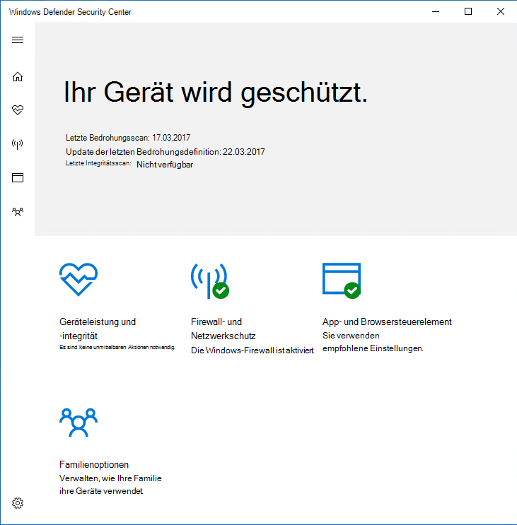
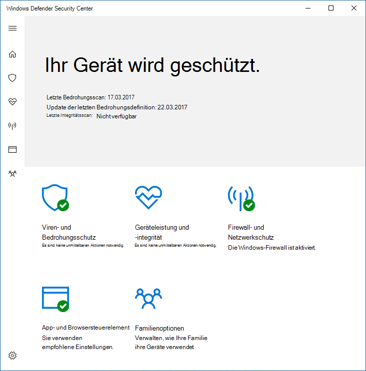

# Verhindern, dass Benutzer die Benutzeroberfläche Microsoft Defender Antivirus sehen oder interagieren

[!INCLUDE [Microsoft 365 Defender rebranding](../../includes/microsoft-defender.md)]

**Gilt für:**

- [Microsoft Defender für Endpunkt](/microsoft-365/security/defender-endpoint/)

Sie können gruppenrichtlinien verwenden, um zu verhindern, dass Benutzer auf Endpunkten die Microsoft Defender Antivirus sehen. Sie können auch verhindern, dass Scans angehalten werden.

## Ausblenden der Microsoft Defender Antivirus Schnittstelle

In Windows 10 Version 1703 blendet das Ausblenden der Schnittstelle Microsoft Defender Antivirus Benachrichtigungen aus und verhindert, dass die Kachel "Viren & Bedrohungsschutz" in der Windows-Sicherheit angezeigt wird.

Mit der Einstellung auf **Enabled festgelegt:**

Mit der Einstellung **deaktiviert** oder nicht konfiguriert:

>[!NOTE]
>Das Ausblenden der Schnittstelle verhindert auch, Microsoft Defender Antivirus Benachrichtigungen auf dem Endpunkt angezeigt werden. Microsoft Defender for Endpoint-Benachrichtigungen werden weiterhin angezeigt. Sie können auch die auf [Endpunkten angezeigten Benachrichtigungen einzeln konfigurieren.](configure-notifications-microsoft-defender-antivirus.md)

In früheren Versionen von Windows 10 blendet die Einstellung die Windows Defender aus. Wenn der Benutzer versucht, die App zu öffnen, wird eine Warnung mit dem Hinweis "Ihr Systemadministrator hat eingeschränkten Zugriff auf diese App" erhalten.

## Verwenden von Gruppenrichtlinien zum Ausblenden der Microsoft Defender AV-Schnittstelle vor Benutzern

1. Öffnen Sie auf dem Computer für die Gruppenrichtlinienverwaltung die [Gruppenrichtlinienverwaltungskonsole,](/previous-versions/windows/desktop/gpmc/group-policy-management-console-portal)klicken Sie mit der rechten Maustaste auf das Gruppenrichtlinienobjekt, das Sie konfigurieren möchten, und klicken Sie auf **Bearbeiten**.

2. Wechseln Sie **mit dem Gruppenrichtlinienverwaltungs-Editor** zu **Computerkonfiguration**.

3. Klicken Sie **auf Administrative Vorlagen**.

4. Erweitern Sie die **Struktur, Windows komponenten > Microsoft Defender Antivirus > Clientschnittstelle .**

5. Doppelklicken Sie auf die Einstellung **Kopflose Benutzeroberflächenmodus** aktivieren, und legen Sie die Option auf **Aktiviert .** Klicken Sie auf **OK**. 

Weitere [Optionen zum Verhindern,](configure-local-policy-overrides-microsoft-defender-antivirus.md) dass Benutzer den Schutz auf ihren PCs ändern, finden Sie unter Verhindern, dass Benutzer Richtlinieneinstellungen lokal ändern.

## Verhindern, dass Benutzer eine Überprüfung anhalten

Sie können verhindern, dass Benutzer Scans anhalten, was hilfreich sein kann, um sicherzustellen, dass geplante oder bedarfsmäßige Scans nicht von Benutzern unterbrochen werden.

> [!NOTE]
> Diese Einstellung wird bei der Windows 10.

### Verwenden von Gruppenrichtlinien, um zu verhindern, dass Benutzer eine Überprüfung anhalten

1. Öffnen Sie auf dem Computer für die Gruppenrichtlinienverwaltung die [Gruppenrichtlinienverwaltungskonsole,](/previous-versions/windows/desktop/gpmc/group-policy-management-console-portal)klicken Sie mit der rechten Maustaste auf das Gruppenrichtlinienobjekt, das Sie konfigurieren möchten, und klicken Sie auf **Bearbeiten**.

2. Wechseln Sie **mit dem Gruppenrichtlinienverwaltungs-Editor** zu **Computerkonfiguration**.

3. Klicken Sie **auf Administrative Vorlagen**.

4. Erweitern Sie die Struktur, **Windows komponenten Microsoft Defender Antivirus**  >    >  **scannen**.

5. Doppelklicken Sie auf die Einstellung **Benutzern das Anhalten der** Überprüfung erlauben, und legen Sie die Option auf Deaktiviert **.** Klicken Sie auf **OK**. 

## Verwandte Artikel

- [Konfigurieren der Benachrichtigungen, die auf Endpunkten angezeigt werden](configure-notifications-microsoft-defender-antivirus.md)

- [Konfigurieren der Endbenutzerinteraktion mit Microsoft Defender Antivirus](configure-end-user-interaction-microsoft-defender-antivirus.md)

- [Microsoft Defender Antivirus in Windows 10](microsoft-defender-antivirus-in-windows-10.md)