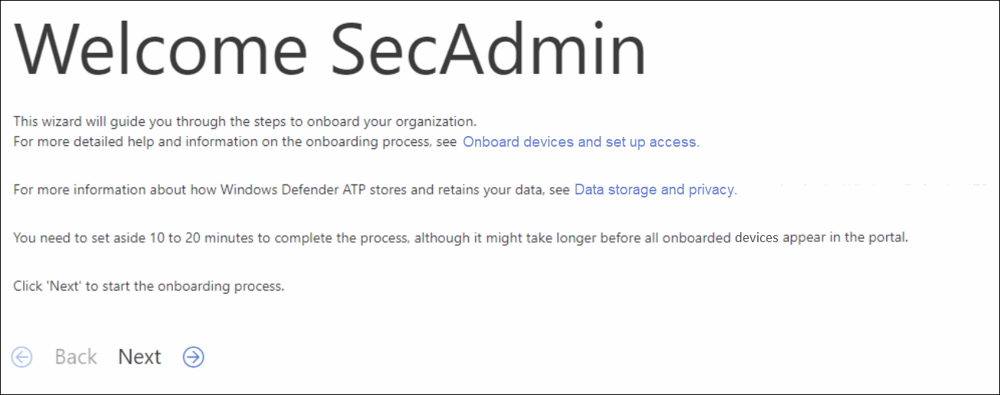
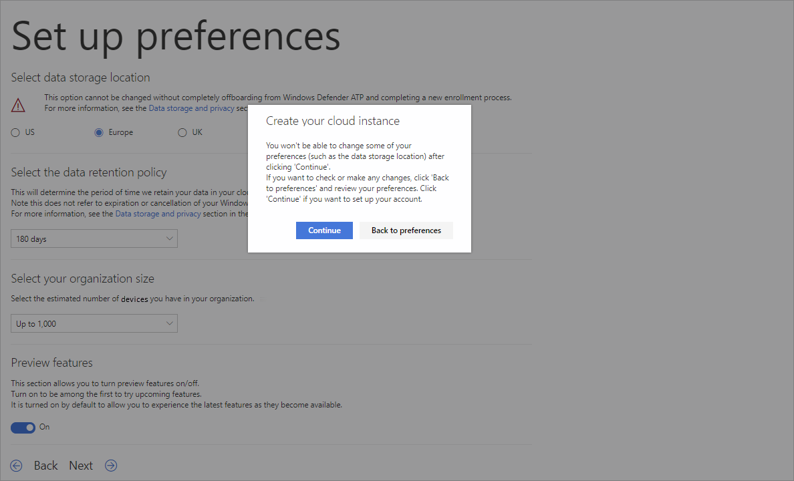

# <a name="set-up-microsoft-defender-for-endpoint-deployment"></a><span data-ttu-id="ff732-104">Einrichten der Bereitstellung von Microsoft Defender for Endpoint</span><span class="sxs-lookup"><span data-stu-id="ff732-104">Set up Microsoft Defender for Endpoint deployment</span></span>

[!INCLUDE [Microsoft 365 Defender rebranding](../../includes/microsoft-defender.md)]


<span data-ttu-id="ff732-105">**Gilt für:**</span><span class="sxs-lookup"><span data-stu-id="ff732-105">**Applies to:**</span></span>
- [<span data-ttu-id="ff732-106">Microsoft Defender für Endpunkt</span><span class="sxs-lookup"><span data-stu-id="ff732-106">Microsoft Defender for Endpoint</span></span>](https://go.microsoft.com/fwlink/p/?linkid=2146631)
- [<span data-ttu-id="ff732-107">Microsoft 365 Defender</span><span class="sxs-lookup"><span data-stu-id="ff732-107">Microsoft 365 Defender</span></span>](https://go.microsoft.com/fwlink/?linkid=2118804)

> <span data-ttu-id="ff732-108">Möchten Sie Microsoft Defender for Endpoint erleben?</span><span class="sxs-lookup"><span data-stu-id="ff732-108">Want to experience Microsoft Defender for Endpoint?</span></span> [<span data-ttu-id="ff732-109">Registrieren Sie sich für eine kostenlose Testversion.</span><span class="sxs-lookup"><span data-stu-id="ff732-109">Sign up for a free trial.</span></span>](https://www.microsoft.com/microsoft-365/windows/microsoft-defender-atp?ocid=docs-wdatp-exposedapis-abovefoldlink)

<span data-ttu-id="ff732-110">Die Bereitstellung von Defender for Endpoint ist ein drei phasenweiser Prozess:</span><span class="sxs-lookup"><span data-stu-id="ff732-110">Deploying Defender for Endpoint is a three-phase process:</span></span>

| <span data-ttu-id="ff732-111">[](prepare-deployment.md)</span><span class="sxs-lookup"><span data-stu-id="ff732-111">[](prepare-deployment.md)</span></span><br>[<span data-ttu-id="ff732-112">Phase 1: Vorbereiten</span><span class="sxs-lookup"><span data-stu-id="ff732-112">Phase 1: Prepare</span></span>](prepare-deployment.md) | <br><span data-ttu-id="ff732-114">Phase 2: Setup</span><span class="sxs-lookup"><span data-stu-id="ff732-114">Phase 2: Setup</span></span> | <span data-ttu-id="ff732-115">[](onboarding.md)</span><span class="sxs-lookup"><span data-stu-id="ff732-115">[](onboarding.md)</span></span><br>[<span data-ttu-id="ff732-116">Phase 3: Onboarding</span><span class="sxs-lookup"><span data-stu-id="ff732-116">Phase 3: Onboard</span></span>](onboarding.md) |
| ----- | ----- | ----- |
| | <span data-ttu-id="ff732-117">*Sie sind hier!*</span><span class="sxs-lookup"><span data-stu-id="ff732-117">*You are here!*</span></span>||

<span data-ttu-id="ff732-118">Sie befinden sich derzeit in der Einrichtungsphase.</span><span class="sxs-lookup"><span data-stu-id="ff732-118">You are currently in the set-up phase.</span></span>

<span data-ttu-id="ff732-119">In diesem Bereitstellungsszenario werden Sie durch die folgenden Schritte geführt:</span><span class="sxs-lookup"><span data-stu-id="ff732-119">In this deployment scenario, you'll be guided through the steps on:</span></span>
- <span data-ttu-id="ff732-120">Lizenzierungsüberprüfung</span><span class="sxs-lookup"><span data-stu-id="ff732-120">Licensing validation</span></span>
- <span data-ttu-id="ff732-121">Mandantenkonfiguration</span><span class="sxs-lookup"><span data-stu-id="ff732-121">Tenant configuration</span></span>
- <span data-ttu-id="ff732-122">Netzwerkkonfiguration</span><span class="sxs-lookup"><span data-stu-id="ff732-122">Network configuration</span></span>


>[!NOTE]
><span data-ttu-id="ff732-123">Um Sie durch eine typische Bereitstellung zu führen, wird in diesem Szenario nur die Verwendung von Microsoft Endpoint Configuration Manager beschrieben.</span><span class="sxs-lookup"><span data-stu-id="ff732-123">For the purpose of guiding you through a typical deployment, this scenario will only cover the use of Microsoft Endpoint Configuration Manager.</span></span> <span data-ttu-id="ff732-124">Defender for Endpoint unterstützt die Verwendung anderer Onboardingtools, diese Szenarien werden jedoch nicht im Bereitstellungshandbuch beschrieben.</span><span class="sxs-lookup"><span data-stu-id="ff732-124">Defender for Endpoint supports the use of other onboarding tools but will not cover those scenarios in the deployment guide.</span></span> <span data-ttu-id="ff732-125">Weitere Informationen finden Sie unter [Onboard devices to Microsoft Defender for Endpoint](onboard-configure.md).</span><span class="sxs-lookup"><span data-stu-id="ff732-125">For more information, see [Onboard devices to Microsoft Defender for Endpoint](onboard-configure.md).</span></span>

## <a name="check-license-state"></a><span data-ttu-id="ff732-126">Überprüfen des Lizenzstatus</span><span class="sxs-lookup"><span data-stu-id="ff732-126">Check license state</span></span>

<span data-ttu-id="ff732-127">Die Überprüfung auf den Lizenzstatus und ob er ordnungsgemäß bereitgestellt wurde, kann über das Admin Center oder über das **Microsoft Azure-Portal durchgeführt werden.**</span><span class="sxs-lookup"><span data-stu-id="ff732-127">Checking for the license state and whether it got properly provisioned, can be done through the admin center or through the **Microsoft Azure portal**.</span></span>

1. <span data-ttu-id="ff732-128">Um Ihre Lizenzen anzeigen zu können, wechseln Sie zum **Microsoft Azure-Portal,** und navigieren Sie zum [Microsoft Azure-Portallizenzabschnitt](https://portal.azure.com/#blade/Microsoft_AAD_IAM/LicensesMenuBlade/Products).</span><span class="sxs-lookup"><span data-stu-id="ff732-128">To view your licenses, go to the **Microsoft Azure portal** and navigate to the [Microsoft Azure portal license section](https://portal.azure.com/#blade/Microsoft_AAD_IAM/LicensesMenuBlade/Products).</span></span>

   

1. <span data-ttu-id="ff732-130">Navigieren Sie im Admin Center alternativ zu **Abrechnungsabonnements**  >  .</span><span class="sxs-lookup"><span data-stu-id="ff732-130">Alternately, in the admin center, navigate to **Billing** > **Subscriptions**.</span></span>

    <span data-ttu-id="ff732-131">Auf dem Bildschirm werden alle bereitgestellten Lizenzen und deren aktueller **Status angezeigt.**</span><span class="sxs-lookup"><span data-stu-id="ff732-131">On the screen, you will see all the provisioned licenses and their current **Status**.</span></span>

    


## <a name="cloud-service-provider-validation"></a><span data-ttu-id="ff732-133">Überprüfung des Clouddienstanbieters</span><span class="sxs-lookup"><span data-stu-id="ff732-133">Cloud Service Provider validation</span></span>

<span data-ttu-id="ff732-134">Um Zugriff darauf zu erhalten, welche Lizenzen für Ihr Unternehmen bereitgestellt werden, und um den Status der Lizenzen zu überprüfen, wechseln Sie zum Admin Center.</span><span class="sxs-lookup"><span data-stu-id="ff732-134">To gain access into which licenses are provisioned to your company, and to check the state of the licenses, go to the admin center.</span></span>

1. <span data-ttu-id="ff732-135">Wählen Sie **im Partnerportal** Die Option **Dienste > Office 365 verwalten aus.**</span><span class="sxs-lookup"><span data-stu-id="ff732-135">From the **Partner portal**, select **Administer services > Office 365**.</span></span>

2. <span data-ttu-id="ff732-136">Wenn Sie auf den **Link Partnerportal** klicken, wird die Option **Admin im** Namen geöffnet, und Sie erhalten Zugriff auf das Customer Admin Center.</span><span class="sxs-lookup"><span data-stu-id="ff732-136">Clicking on the **Partner portal** link will open the **Admin on behalf** option and will give you access to the customer admin center.</span></span>

   


## <a name="tenant-configuration"></a><span data-ttu-id="ff732-138">Mandantenkonfiguration</span><span class="sxs-lookup"><span data-stu-id="ff732-138">Tenant Configuration</span></span>

<span data-ttu-id="ff732-139">Beim ersten Zugriff auf Microsoft Defender Security Center ein Assistent, der Sie durch einige erste Schritte führt.</span><span class="sxs-lookup"><span data-stu-id="ff732-139">When accessing Microsoft Defender Security Center for the first time, a wizard that will guide you through some initial steps.</span></span> <span data-ttu-id="ff732-140">Am Ende des Setup-Assistenten wird eine dedizierte Cloudinstanz von Defender for Endpoint erstellt.</span><span class="sxs-lookup"><span data-stu-id="ff732-140">At the end of the setup wizard, there will be a dedicated cloud instance of Defender for Endpoint created.</span></span> <span data-ttu-id="ff732-141">Die einfachste Methode besteht in der Ausführung dieser Schritte auf einem Windows 10-Clientgerät.</span><span class="sxs-lookup"><span data-stu-id="ff732-141">The easiest method is to perform these steps from a Windows 10 client device.</span></span>

1. <span data-ttu-id="ff732-142">Navigieren Sie in einem Webbrowser zu <https://securitycenter.windows.com> .</span><span class="sxs-lookup"><span data-stu-id="ff732-142">From a web browser, navigate to <https://securitycenter.windows.com>.</span></span>

    

2. <span data-ttu-id="ff732-144">Wenn Sie eine TRIAL-Lizenz durchgehen, wechseln Sie zu dem Link ( <https://signup.microsoft.com/Signup?OfferId=6033e4b5-c320-4008-a936-909c2825d83c&dl=WIN_DEF_ATP&pc=xxxxxxx-xxxxxx-xxx-x> )</span><span class="sxs-lookup"><span data-stu-id="ff732-144">If going through a TRIAL license, go to the link (<https://signup.microsoft.com/Signup?OfferId=6033e4b5-c320-4008-a936-909c2825d83c&dl=WIN_DEF_ATP&pc=xxxxxxx-xxxxxx-xxx-x>)</span></span>

    <span data-ttu-id="ff732-145">Sobald der Autorisierungsschritt abgeschlossen ist, wird der **Willkommensbildschirm** angezeigt.</span><span class="sxs-lookup"><span data-stu-id="ff732-145">Once the authorization step is completed, the **Welcome** screen will be displayed.</span></span>
3. <span data-ttu-id="ff732-146">Gehen Sie durch die Autorisierungsschritte.</span><span class="sxs-lookup"><span data-stu-id="ff732-146">Go through the authorization steps.</span></span>

    

4. <span data-ttu-id="ff732-148">Richten Sie Einstellungen ein.</span><span class="sxs-lookup"><span data-stu-id="ff732-148">Set up preferences.</span></span>

   <span data-ttu-id="ff732-149">**Datenspeicherort:** Es ist wichtig, dass Sie dies ordnungsgemäß einrichten.</span><span class="sxs-lookup"><span data-stu-id="ff732-149">**Data storage location** - It's important to set this up correctly.</span></span> <span data-ttu-id="ff732-150">Bestimmen Sie, wo der Kunde hauptsächlich gehostet werden möchte: USA, EU oder Großbritannien.</span><span class="sxs-lookup"><span data-stu-id="ff732-150">Determine where the customer wants to be primarily hosted: US, EU, or UK.</span></span> <span data-ttu-id="ff732-151">Sie können den Speicherort nach dieser Einrichtung nicht ändern, und Microsoft übertstrat die Daten nicht von der angegebenen Geolocation.</span><span class="sxs-lookup"><span data-stu-id="ff732-151">You cannot change the location after this set up and Microsoft will not transfer the data from the specified geolocation.</span></span> 

    <span data-ttu-id="ff732-152">**Datenaufbewahrung** – Der Standardwert ist sechs Monate.</span><span class="sxs-lookup"><span data-stu-id="ff732-152">**Data retention** - The default is six months.</span></span>

    <span data-ttu-id="ff732-153">**Aktivieren von Vorschaufeatures** – Der Standardwert ist aktiviert, kann später geändert werden.</span><span class="sxs-lookup"><span data-stu-id="ff732-153">**Enable preview features** - The default is on, can be changed later.</span></span>

    

5. <span data-ttu-id="ff732-155">Wählen Sie **Weiter** aus.</span><span class="sxs-lookup"><span data-stu-id="ff732-155">Select **Next**.</span></span>

     

6. <span data-ttu-id="ff732-157">Wählen Sie **Weiter** aus.</span><span class="sxs-lookup"><span data-stu-id="ff732-157">Select **Continue**.</span></span>


## <a name="network-configuration"></a><span data-ttu-id="ff732-158">Netzwerkkonfiguration</span><span class="sxs-lookup"><span data-stu-id="ff732-158">Network configuration</span></span>
<span data-ttu-id="ff732-159">Wenn die Organisation nicht erfordert, dass die Endpunkte einen Proxy für den Zugriff auf das Internet verwenden, überspringen Sie diesen Abschnitt.</span><span class="sxs-lookup"><span data-stu-id="ff732-159">If the organization does not require the endpoints to use a Proxy to access the Internet, skip this section.</span></span>

<span data-ttu-id="ff732-160">Der Microsoft Defender für Endpunkt-Sensor setzt Microsoft Windows HTTP (WinHTTP) voraus, um Sensordaten zu melden und mit dem Microsoft Defender für Endpunkt-Dienst zu kommunizieren.</span><span class="sxs-lookup"><span data-stu-id="ff732-160">The Microsoft Defender for Endpoint sensor requires Microsoft Windows HTTP (WinHTTP) to report sensor data and communicate with the Microsoft Defender for Endpoint service.</span></span> <span data-ttu-id="ff732-161">Der eingebettete Microsoft Defender for Endpoint-Sensor wird im Systemkontext mithilfe des LocalSystem-Kontos ausgeführt.</span><span class="sxs-lookup"><span data-stu-id="ff732-161">The embedded Microsoft Defender for Endpoint sensor runs in the system context using the LocalSystem account.</span></span> <span data-ttu-id="ff732-162">Der Sensor verwendet Microsoft Windows-HTTP-Dienste (WinHTTP), um die Kommunikation mit dem Microsoft Defender für Endpunkt-Clouddienst zu ermöglichen.</span><span class="sxs-lookup"><span data-stu-id="ff732-162">The sensor uses Microsoft Windows HTTP Services (WinHTTP) to enable communication with the Microsoft Defender for Endpoint cloud service.</span></span> <span data-ttu-id="ff732-163">Die WinHTTP-Konfigurationseinstellung ist unabhängig von den Windows Internet (WinINet)-Internet-Browserproxyeinstellungen und kann nur mithilfe der folgenden Ermittlungsmethoden einen Proxyserver ermitteln:</span><span class="sxs-lookup"><span data-stu-id="ff732-163">The WinHTTP configuration setting is independent of the Windows Internet (WinINet) internet browsing proxy settings and can only discover a proxy server by using the following discovery methods:</span></span>

<span data-ttu-id="ff732-164">**AutoErmittlungsmethoden:**</span><span class="sxs-lookup"><span data-stu-id="ff732-164">**Autodiscovery methods:**</span></span>

-   <span data-ttu-id="ff732-165">Transparenter Proxy</span><span class="sxs-lookup"><span data-stu-id="ff732-165">Transparent proxy</span></span>

-   <span data-ttu-id="ff732-166">Webproxy-AutoErmittlungsprotokoll (WPAD)</span><span class="sxs-lookup"><span data-stu-id="ff732-166">Web Proxy Autodiscovery Protocol (WPAD)</span></span>

<span data-ttu-id="ff732-167">Wenn in der Netzwerktopologie ein transparenter Proxy oder ein WPAD implementiert wurde, sind keine speziellen Konfigurationseinstellungen erforderlich.</span><span class="sxs-lookup"><span data-stu-id="ff732-167">If a Transparent proxy or WPAD has been implemented in the network topology, there is no need for special configuration settings.</span></span> <span data-ttu-id="ff732-168">Weitere Informationen zu Microsoft Defender for Endpoint-URL-Ausschlüssen im Proxy finden Sie im Abschnitt Anhang in diesem Dokument für die LISTE der URLs zulassen oder in [Microsoft Docs](https://docs.microsoft.com/windows/security/threat-protection/windows-defender-atp/configure-proxy-internet-windows-defender-advanced-threat-protection#enable-access-to-windows-defender-atp-service-urls-in-the-proxy-server).</span><span class="sxs-lookup"><span data-stu-id="ff732-168">For more information on Microsoft Defender for Endpoint URL exclusions in the proxy, see the Appendix section in this document for the URLs allow list or on [Microsoft Docs](https://docs.microsoft.com/windows/security/threat-protection/windows-defender-atp/configure-proxy-internet-windows-defender-advanced-threat-protection#enable-access-to-windows-defender-atp-service-urls-in-the-proxy-server).</span></span>

> [!NOTE]
> <span data-ttu-id="ff732-169">Eine detaillierte Liste der URLs, die zugelassen werden müssen, finden Sie in [diesem Artikel](https://docs.microsoft.com/windows/security/threat-protection/microsoft-defender-antivirus/configure-network-connections-microsoft-defender-antivirus).</span><span class="sxs-lookup"><span data-stu-id="ff732-169">For a detailed list of URLs that need to be allowed, please see [this article](https://docs.microsoft.com/windows/security/threat-protection/microsoft-defender-antivirus/configure-network-connections-microsoft-defender-antivirus).</span></span>

<span data-ttu-id="ff732-170">**Manuelle Konfiguration von statischen Proxys:**</span><span class="sxs-lookup"><span data-stu-id="ff732-170">**Manual static proxy configuration:**</span></span>

-   <span data-ttu-id="ff732-171">Registrierungsbasierte Konfiguration</span><span class="sxs-lookup"><span data-stu-id="ff732-171">Registry-based configuration</span></span>

-   <span data-ttu-id="ff732-172">WinHTTP mit netsh-Befehl konfiguriert</span><span class="sxs-lookup"><span data-stu-id="ff732-172">WinHTTP configured using netsh command</span></span> <br> <span data-ttu-id="ff732-173">Nur für Desktops in einer stabilen Topologie geeignet (z. B. ein Desktop in einem Unternehmensnetzwerk hinter demselben Proxy)</span><span class="sxs-lookup"><span data-stu-id="ff732-173">Suitable only for desktops in a stable topology (for example: a desktop in a corporate network behind the same proxy)</span></span>

### <a name="configure-the-proxy-server-manually-using-a-registry-based-static-proxy"></a><span data-ttu-id="ff732-174">Manuelles Konfigurieren des Proxyservers mithilfe eines registrierungsbasierten statischen Proxys</span><span class="sxs-lookup"><span data-stu-id="ff732-174">Configure the proxy server manually using a registry-based static proxy</span></span>

<span data-ttu-id="ff732-175">Konfigurieren Sie einen registrierungsbasierten statischen Proxy, damit nur microsoft Defender for Endpoint-Sensor Diagnosedaten melden und mit Microsoft Defender for Endpoint-Diensten kommunizieren können, wenn ein Computer keine Verbindung mit dem Internet herstellen darf.</span><span class="sxs-lookup"><span data-stu-id="ff732-175">Configure a registry-based static proxy to allow only Microsoft Defender for Endpoint sensor to report diagnostic data and communicate with Microsoft Defender for Endpoint services if a computer is not permitted to connect to the Internet.</span></span> <span data-ttu-id="ff732-176">Der statische Proxy kann mithilfe von Gruppenrichtlinien konfiguriert werden.</span><span class="sxs-lookup"><span data-stu-id="ff732-176">The static proxy is configurable through Group Policy (GP).</span></span> <span data-ttu-id="ff732-177">Die Gruppenrichtlinien finden Sie unter:</span><span class="sxs-lookup"><span data-stu-id="ff732-177">The group policy can be found under:</span></span>

 - <span data-ttu-id="ff732-178">Administrative Vorlagen \> Windows-Komponenten Datensammlungs- und Vorschaubuilds Konfigurieren der authentifizierten Proxyverwendung für den verbundenen \> \> Benutzererfahrungs- und Telemetriedienst</span><span class="sxs-lookup"><span data-stu-id="ff732-178">Administrative Templates \> Windows Components \> Data Collection and Preview Builds \> Configure Authenticated Proxy usage for the Connected User Experience and Telemetry Service</span></span>
     - <span data-ttu-id="ff732-179">Legen Sie sie auf **Aktiviert,** und wählen **Sie Authentifizierte Proxyverwendung deaktivieren aus.**</span><span class="sxs-lookup"><span data-stu-id="ff732-179">Set it to **Enabled** and select **Disable Authenticated Proxy usage**</span></span>

1. <span data-ttu-id="ff732-180">Öffnen Sie die Gruppenrichtlinien-Verwaltungskonsole.</span><span class="sxs-lookup"><span data-stu-id="ff732-180">Open the Group Policy Management Console.</span></span>
2. <span data-ttu-id="ff732-181">Erstellen Sie eine Richtlinie, oder bearbeiten Sie eine vorhandene Richtlinie basierend auf den Organisationspraktiken.</span><span class="sxs-lookup"><span data-stu-id="ff732-181">Create a policy or edit an existing policy based off the organizational practices.</span></span>
3. <span data-ttu-id="ff732-182">Bearbeiten Sie die Gruppenrichtlinie, und navigieren Sie zu **Administrative Vorlagen Windows Components Data Collection and Preview Builds Configure \> \> \> Authenticated Proxy usage for the Connected User Experience and Telemetry Service**.</span><span class="sxs-lookup"><span data-stu-id="ff732-182">Edit the Group Policy and navigate to **Administrative Templates \> Windows Components \> Data Collection and Preview Builds \> Configure Authenticated Proxy usage for the Connected User Experience and Telemetry Service**.</span></span> 
    <span data-ttu-id="ff732-183"></span><span class="sxs-lookup"><span data-stu-id="ff732-183"></span></span>

4. <span data-ttu-id="ff732-184">Wählen Sie **Aktiviert** aus.</span><span class="sxs-lookup"><span data-stu-id="ff732-184">Select **Enabled**.</span></span>
5. <span data-ttu-id="ff732-185">Wählen **Sie Authentifizierte Proxyverwendung deaktivieren aus.**</span><span class="sxs-lookup"><span data-stu-id="ff732-185">Select **Disable Authenticated Proxy usage**.</span></span>
   
6. <span data-ttu-id="ff732-186">Navigieren Sie **zu Administrative Vorlagen \> Windows-Komponenten \> Datensammlung und Vorschaubuilds Konfigurieren \> von verbundenen Benutzererfahrungen und Telemetrie**.</span><span class="sxs-lookup"><span data-stu-id="ff732-186">Navigate to **Administrative Templates \> Windows Components \> Data Collection and Preview Builds \> Configure connected user experiences and telemetry**.</span></span>
    <span data-ttu-id="ff732-187"></span><span class="sxs-lookup"><span data-stu-id="ff732-187"></span></span>
7. <span data-ttu-id="ff732-188">Wählen Sie **Aktiviert** aus.</span><span class="sxs-lookup"><span data-stu-id="ff732-188">Select **Enabled**.</span></span>
8. <span data-ttu-id="ff732-189">Geben Sie den **Proxyservernamen ein.**</span><span class="sxs-lookup"><span data-stu-id="ff732-189">Enter the **Proxy Server Name**.</span></span>

<span data-ttu-id="ff732-190">Die Richtlinie setzt zwei Registrierungswerte (`TelemetryProxyServer` als "REG_SZ" und `DisableEnterpriseAuthProxy` als "REG_DWORD") unter dem Registrierungsschlüssel `HKLM\Software\Policies\Microsoft\Windows\DataCollection` fest.</span><span class="sxs-lookup"><span data-stu-id="ff732-190">The policy sets two registry values `TelemetryProxyServer` as REG_SZ and `DisableEnterpriseAuthProxy` as REG_DWORD under the registry key `HKLM\Software\Policies\Microsoft\Windows\DataCollection`.</span></span>

<span data-ttu-id="ff732-191">Der Registrierungswert `TelemetryProxyServer` hat das folgende Zeichenfolgenformat:</span><span class="sxs-lookup"><span data-stu-id="ff732-191">The registry value `TelemetryProxyServer` takes the following string format:</span></span>

```text
<server name or ip>:<port>
```

<span data-ttu-id="ff732-192">Beispiel: 10.0.0.6:8080.</span><span class="sxs-lookup"><span data-stu-id="ff732-192">For example: 10.0.0.6:8080</span></span>

<span data-ttu-id="ff732-193">Der Registrierungswert `DisableEnterpriseAuthProxy` sollte auf 1 festgelegt werden.</span><span class="sxs-lookup"><span data-stu-id="ff732-193">The registry value `DisableEnterpriseAuthProxy` should be set to 1.</span></span>

###  <a name="configure-the-proxy-server-manually-using-netsh-command"></a><span data-ttu-id="ff732-194">Konfigurieren des Proxyservers manuell mithilfe des Befehls netsh</span><span class="sxs-lookup"><span data-stu-id="ff732-194">Configure the proxy server manually using netsh command</span></span>

<span data-ttu-id="ff732-195">Verwenden Sie den netsh-Befehl, um einen systemweiten statischen Proxy zu konfigurieren.</span><span class="sxs-lookup"><span data-stu-id="ff732-195">Use netsh to configure a system-wide static proxy.</span></span>

> [!NOTE]
> - <span data-ttu-id="ff732-196">Dies wirkt sich auf alle Anwendungen aus, einschließlich Windows-Diensten, die WinHTTP mit Standardproxy verwenden.</span><span class="sxs-lookup"><span data-stu-id="ff732-196">This will affect all applications including Windows services which use WinHTTP with default proxy.</span></span></br>
> - <span data-ttu-id="ff732-197">Laptops, die die Topologie ändern (z. B. von Büro zu Haus) können mit netsh nicht mehr verwendet werden.</span><span class="sxs-lookup"><span data-stu-id="ff732-197">Laptops that are changing topology (for example: from office to home) will malfunction with netsh.</span></span> <span data-ttu-id="ff732-198">Verwenden Sie die registrierungsbasierte Konfiguration für statische Proxys.</span><span class="sxs-lookup"><span data-stu-id="ff732-198">Use the registry-based static proxy configuration.</span></span>

1. <span data-ttu-id="ff732-199">Öffnen Sie eine Befehlszeile mit erhöhten Rechten:</span><span class="sxs-lookup"><span data-stu-id="ff732-199">Open an elevated command line:</span></span>

    1. <span data-ttu-id="ff732-200">Wechseln Sie zu **Start**, und geben Sie **cmd** ein.</span><span class="sxs-lookup"><span data-stu-id="ff732-200">Go to **Start** and type **cmd**.</span></span>

    1. <span data-ttu-id="ff732-201">Klicken Sie mit der rechten Maustaste auf **Eingabeaufforderung**, und wählen Sie **Als Administrator ausführen** aus.</span><span class="sxs-lookup"><span data-stu-id="ff732-201">Right-click **Command prompt** and select **Run as administrator**.</span></span>

2. <span data-ttu-id="ff732-202">Geben Sie den folgenden Befehl ein, und drücken Sie dann die **Eingabetaste**:</span><span class="sxs-lookup"><span data-stu-id="ff732-202">Enter the following command and press **Enter**:</span></span>

   ```PowerShell
   netsh winhttp set proxy <proxy>:<port>
   ```

   <span data-ttu-id="ff732-203">Beispiel: netsh winhttp set proxy 10.0.0.6:8080</span><span class="sxs-lookup"><span data-stu-id="ff732-203">For example: netsh winhttp set proxy 10.0.0.6:8080</span></span>


###  <a name="proxy-configuration-for-down-level-devices"></a><span data-ttu-id="ff732-204">Proxykonfiguration für Geräte auf ebener ebener Ebene</span><span class="sxs-lookup"><span data-stu-id="ff732-204">Proxy Configuration for down-level devices</span></span>

<span data-ttu-id="ff732-205">Down-Level gehören Windows 7 SP1- und Windows 8.1-Arbeitsstationen sowie Windows Server 2008 R2,Windows Server 2012, Windows Server 2012 R2 und Versionen von Windows Server 2016 vor Windows Server CB 1803.</span><span class="sxs-lookup"><span data-stu-id="ff732-205">Down-Level devices include Windows 7 SP1 and Windows 8.1 workstations as well as Windows Server 2008 R2, Windows Server 2012, Windows Server 2012 R2, and versions of Windows Server 2016 prior to Windows Server CB 1803.</span></span> <span data-ttu-id="ff732-206">Für diese Betriebssysteme wird der Proxy als Teil des Microsoft Management Agent konfiguriert, um die Kommunikation vom Endpunkt an Azure zu verarbeiten.</span><span class="sxs-lookup"><span data-stu-id="ff732-206">These operating systems will have the proxy configured as part of the Microsoft Management Agent to handle communication from the endpoint to Azure.</span></span> <span data-ttu-id="ff732-207">Informationen zur Konfiguration eines Proxys auf diesen Geräten finden Sie im Microsoft Management Agent Fast Deployment Guide.</span><span class="sxs-lookup"><span data-stu-id="ff732-207">Refer to the Microsoft Management Agent Fast Deployment Guide for information on how a proxy is configured on these devices.</span></span>

### <a name="proxy-service-urls"></a><span data-ttu-id="ff732-208">Proxydienst-URLs</span><span class="sxs-lookup"><span data-stu-id="ff732-208">Proxy Service URLs</span></span>
<span data-ttu-id="ff732-209">URLs, die v20 enthalten, werden nur benötigt, wenn Sie Über Windows 10, Version 1803 oder höher, verfügen.</span><span class="sxs-lookup"><span data-stu-id="ff732-209">URLs that include v20 in them are only needed if you have Windows 10, version 1803 or later devices.</span></span> <span data-ttu-id="ff732-210">Ist beispielsweise nur erforderlich, wenn sich das ```us-v20.events.data.microsoft.com``` Gerät unter Windows 10, Version 1803 oder höher befindet.</span><span class="sxs-lookup"><span data-stu-id="ff732-210">For example, ```us-v20.events.data.microsoft.com``` is only needed if the device is on Windows 10, version 1803 or later.</span></span>
 

<span data-ttu-id="ff732-211">Wenn ein Proxy oder eine Firewall anonymen Datenverkehr blockiert, da der Microsoft Defender for Endpoint-Sensor eine Verbindung aus dem Systemkontext verbindet, stellen Sie sicher, dass anonymer Datenverkehr in den aufgeführten URLs zulässig ist.</span><span class="sxs-lookup"><span data-stu-id="ff732-211">If a proxy or firewall is blocking anonymous traffic, as Microsoft Defender for Endpoint sensor is connecting from system context, make sure anonymous traffic is permitted in the listed URLs.</span></span>

<span data-ttu-id="ff732-212">In der folgenden herunterladbaren Kalkulationstabelle sind die Dienste und die zugehörigen URLs aufgeführt, mit deren Netzwerk eine Verbindung herstellen kann.</span><span class="sxs-lookup"><span data-stu-id="ff732-212">The following downloadable spreadsheet lists the services and their associated URLs that your network must be able to connect to.</span></span> <span data-ttu-id="ff732-213">Stellen Sie sicher, dass es keine Firewall- oder Netzwerkfilterregeln gibt, die  den Zugriff auf diese URLs verweigern würden, oder Sie müssen möglicherweise eine speziell für sie zulässige Regel erstellen.</span><span class="sxs-lookup"><span data-stu-id="ff732-213">Ensure that there are no firewall or network filtering rules that would deny access to these URLs, or you may need to create an *allow* rule specifically for them.</span></span>

|<span data-ttu-id="ff732-214">**Tabellenkalkulation der Domänenliste**</span><span class="sxs-lookup"><span data-stu-id="ff732-214">**Spreadsheet of domains list**</span></span>|<span data-ttu-id="ff732-215">**Beschreibung**</span><span class="sxs-lookup"><span data-stu-id="ff732-215">**Description**</span></span>|
|:-----|:-----|
|<br/>  | <span data-ttu-id="ff732-217">Tabellenkalkulation bestimmter DNS-Einträge für Dienststandorte, geografische Standorte und Betriebssysteme.</span><span class="sxs-lookup"><span data-stu-id="ff732-217">Spreadsheet of specific DNS records for service locations, geographic locations, and OS.</span></span> <br><br>[<span data-ttu-id="ff732-218">Laden Sie die Tabelle hier herunter.</span><span class="sxs-lookup"><span data-stu-id="ff732-218">Download the spreadsheet here.</span></span>](https://download.microsoft.com/download/8/a/5/8a51eee5-cd02-431c-9d78-a58b7f77c070/mde-urls.xlsx) 


###  <a name="microsoft-defender-for-endpoint-service-backend-ip-range"></a><span data-ttu-id="ff732-219">Microsoft Defender for Endpoint Service-Back-End-IP-Bereich</span><span class="sxs-lookup"><span data-stu-id="ff732-219">Microsoft Defender for Endpoint service backend IP range</span></span>

<span data-ttu-id="ff732-220">Wenn Sie die im vorherigen Abschnitt aufgeführten URLs nicht unterstützen, können Sie die folgenden Informationen verwenden.</span><span class="sxs-lookup"><span data-stu-id="ff732-220">If you network devices don't support the URLs listed in the prior section, you can use the following information.</span></span>

<span data-ttu-id="ff732-221">Defender for Endpoint baut auf der Azure-Cloud auf, die in den folgenden Regionen bereitgestellt wird:</span><span class="sxs-lookup"><span data-stu-id="ff732-221">Defender for Endpoint is built on Azure cloud, deployed in the following regions:</span></span>

- \+\<Region Name="uswestcentral">
- \+\<Region Name="useast2">
- \+\<Region Name="useast">
- \+\<Region Name="europenorth">
- \+\<Region Name="europewest">
- \+\<Region Name="uksouth">
- \+\<Region Name="ukwest">

<span data-ttu-id="ff732-222">Den Azure-IP-Bereich finden Sie unter [Microsoft Azure Datacenter IP Ranges](https://www.microsoft.com/en-us/download/details.aspx?id=41653).</span><span class="sxs-lookup"><span data-stu-id="ff732-222">You can find the Azure IP range on [Microsoft Azure Datacenter IP Ranges](https://www.microsoft.com/en-us/download/details.aspx?id=41653).</span></span>

> [!NOTE]
> <span data-ttu-id="ff732-223">Als cloudbasierte Lösung kann sich der IP-Adressbereich ändern.</span><span class="sxs-lookup"><span data-stu-id="ff732-223">As a cloud-based solution, the IP address range can change.</span></span> <span data-ttu-id="ff732-224">Es wird empfohlen, zur Einstellung für die DNS-Auflösung zu wechseln.</span><span class="sxs-lookup"><span data-stu-id="ff732-224">It's recommended you move to DNS resolving setting.</span></span>

## <a name="next-step"></a><span data-ttu-id="ff732-225">Nächster Schritt</span><span class="sxs-lookup"><span data-stu-id="ff732-225">Next step</span></span>

<span data-ttu-id="ff732-226"></span><span class="sxs-lookup"><span data-stu-id="ff732-226"></span></span> <br><span data-ttu-id="ff732-227">[Phase 3: Onboarding:](onboarding.md)Onboarding devices to the service so that the Microsoft Defender for Endpoint service can get sensor data from them.</span><span class="sxs-lookup"><span data-stu-id="ff732-227">[Phase 3: Onboard](onboarding.md): Onboard devices to the service so that the Microsoft Defender for Endpoint service can get sensor data from them.</span></span> 
