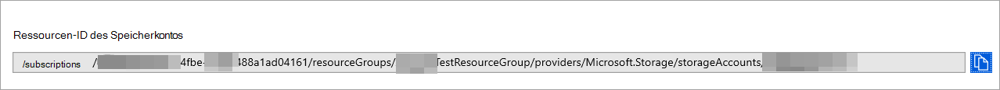

# <a name="configure--microsoft-365-defender-to-stream-advanced-hunting-events-to-your-storage-account"></a>Konfigurieren Microsoft 365 Defender zum Streamen von Advanced Hunting-Ereignissen an Ihr Storage Konto

[!INCLUDE [Microsoft 365 Defender rebranding](../../includes/microsoft-defender.md)]


**Gilt für:**
- [Microsoft 365 Defender](https://go.microsoft.com/fwlink/?linkid=2118804)

[!include[Prerelease information](../../includes/prerelease.md)]


## <a name="before-you-begin"></a>Bevor Sie beginnen:

1. Erstellen Sie [Storage Konto](/azure/storage/common/storage-account-overview) in Ihrem Mandanten.

2. Melden Sie sich bei Ihrem [Azure-Mandanten](https://ms.portal.azure.com/)an, wechseln Sie zu Abonnements > Ihr Abonnement > Ressourcenanbieter > **Registrieren bei Microsoft.Insights**.

## <a name="enable-raw-data-streaming"></a>Aktivieren des Streamings von Rohdaten:

1. Melden Sie sich [Microsoft 365 #A0](https://security.microsoft.com) als ***globaler Administrator** _ oder _*_Sicherheitsadministrator **_ an.

2. Wechseln Sie [zur Seite Datenexporteinstellungen](https://security.microsoft.com/settings/mtp_settings/raw_data_export) in Microsoft Defender Security Center.

3. Klicken Sie auf **Datenexporteinstellungen hinzufügen.**

4. Wählen Sie einen Namen für Ihre neuen Einstellungen aus.

5. Wählen **Sie Weiterleiten von Ereignissen aus, die Azure Storage.**

6. Geben Sie Storage **Kontoressourcen-ID ein.** Um Ihre **Storage-Kontoressourcen-ID** zu erhalten, wechseln Sie zu Ihrer Storage-Kontoseite im [Azure-Portal](https://ms.portal.azure.com/) > Eigenschaftenregisterkarte > kopieren Sie den Text unter **Storage Kontoressourcen-ID**:

   

7. Wählen Sie die Ereignisse aus, die Sie streamen möchten, und klicken Sie auf **Speichern.**

## <a name="the-schema-of-the-events-in-the-storage-account"></a>Das Schema der Ereignisse im Storage Konto:

- Für jeden Ereignistyp wird ein Blobcontainer erstellt: 

  

- Das Schema jeder Zeile in einem Blob ist das folgende JSON: 

  ```
  {
          "time": "<The time Microsoft 365 Defender received the event>"
          "tenantId": "<Your tenant ID>"
          "category": "<The Advanced Hunting table name with 'AdvancedHunting-' prefix>"
          "properties": { <Microsoft 365 Defender Advanced Hunting event as Json> }
  }               
  ```

- Jedes Blob enthält mehrere Zeilen.

- Jede Zeile enthält den Ereignisnamen, den Zeitpunkt, zu dem Defender for Endpoint das Ereignis empfangen hat, den Mandanten, zu dem sie gehört (Sie erhalten nur Ereignisse von Ihrem Mandanten), und das Ereignis im JSON-Format in einer Eigenschaft namens "properties".

- Weitere Informationen zum Schema Microsoft 365 Defender-Ereignisse finden Sie unter [Advanced Hunting overview](../defender/advanced-hunting-overview.md).


## <a name="data-types-mapping"></a>Datentypzuordnung:

Gehen Sie wie folgt vor, um die Datentypen für unsere Ereigniseigenschaften zu erhalten:

1. Melden Sie sich [bei Microsoft 365 Sicherheitscenter an,](https://security.microsoft.com) und wechseln Sie zur [Seite Erweiterte Suche](https://security.microsoft.com/hunting-package).

2. Führen Sie die folgende Abfrage aus, um die Datentypzuordnung für jedes Ereignis zu erhalten: 

   ```
   {EventType}
   | getschema
   | project ColumnName, ColumnType 
   ```

- Im Folgenden finden Sie ein Beispiel für ein Device Info-Ereignis: 

  

## <a name="related-topics"></a>Verwandte Themen
- [Übersicht über die erweiterte Suche](../defender/advanced-hunting-overview.md)
- [Microsoft 365 Defender Streaming-API](raw-data-export.md)
- [Streamen Microsoft 365 Von Defender-Ereignissen an Ihr Azure-Speicherkonto](raw-data-export-storage.md)
- [Azure Storage Kontodokumentation](/azure/storage/common/storage-account-overview)
