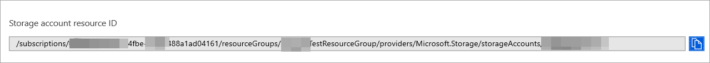

# <a name="configure-microsoft-defender-for-endpoint-to-stream-advanced-hunting-events-to-your-storage-account"></a>Konfigurieren von Microsoft Defender for Endpoint zum Streamen von Advanced Hunting-Ereignissen Storage Konto

[!INCLUDE [Microsoft 365 Defender rebranding](../../includes/microsoft-defender.md)]


**Gilt für:**
- [Microsoft Defender für Endpunkt](https://go.microsoft.com/fwlink/?linkid=2154037)

> Möchten Sie Defender for Endpoint erleben? [Registrieren Sie sich für eine kostenlose Testversion.](https://www.microsoft.com/microsoft-365/windows/microsoft-defender-atp?ocid=docs-wdatp-configuresiem-abovefoldlink) 

## <a name="before-you-begin"></a>Bevor Sie beginnen:

1. Erstellen Sie [Storage Konto](https://docs.microsoft.com/azure/storage/common/storage-account-overview) in Ihrem Mandanten.

2. Melden Sie sich bei Ihrem [Azure-Mandanten](https://ms.portal.azure.com/)an, wechseln Sie zu Abonnements > Ihr Abonnement > Ressourcenanbieter > **Registrieren bei Microsoft.insights**.

## <a name="enable-raw-data-streaming"></a>Aktivieren des Streamings von Rohdaten:

1. Melden Sie sich [beim Microsoft Defender for Endpoint-Portal](https://securitycenter.windows.com) als * globaler **Administrator** _ oder _*_Sicherheitsadministrator_** an.

2. Wechseln Sie [zu Seite Datenexporteinstellungen](https://securitycenter.windows.com/interoperability/dataexport) auf Microsoft Defender Security Center.

3. Klicken Sie auf **Datenexporteinstellungen hinzufügen.**

4. Wählen Sie einen Namen für Ihre neuen Einstellungen aus.

5. Wählen **Sie Weiterleiten von Ereignissen aus, die Azure Storage.**

6. Geben Sie Storage **Kontoressourcen-ID ein.** Um Ihre **Storage-Kontoressourcen-ID** zu erhalten, wechseln Sie zu Ihrer Storage-Kontoseite im [Azure-Portal](https://ms.portal.azure.com/) > Eigenschaftenregisterkarte > kopieren Sie den Text unter **Storage Kontoressourcen-ID**:

   

7. Wählen Sie die Ereignisse aus, die Sie streamen möchten, und klicken Sie auf **Speichern.**

## <a name="the-schema-of-the-events-in-the-storage-account"></a>Das Schema der Ereignisse im Storage Konto:

- Für jeden Ereignistyp wird ein Blobcontainer erstellt: 

  

- Das Schema jeder Zeile in einem Blob ist das folgende JSON: 

  ```
  {
          "time": "<The time WDATP received the event>"
          "tenantId": "<Your tenant ID>"
          "category": "<The Advanced Hunting table name with 'AdvancedHunting-' prefix>"
          "properties": { <WDATP Advanced Hunting event as Json> }
  }               
  ```

- Jedes Blob enthält mehrere Zeilen.

- Jede Zeile enthält den Ereignisnamen, den Zeitpunkt, zu dem Defender for Endpoint das Ereignis empfangen hat, den Mandanten, zu dem sie gehört (Sie erhalten nur Ereignisse von Ihrem Mandanten), und das Ereignis im JSON-Format in einer Eigenschaft namens "properties".

- Weitere Informationen zum Schema von Microsoft Defender for Endpoint-Ereignissen finden Sie unter [Advanced Hunting overview](advanced-hunting-overview.md).

- In Advanced Hunting verfügt **die DeviceInfo-Tabelle** über eine Spalte mit dem Namen **MachineGroup,** die die Gruppe des Geräts enthält. Hier wird jedes Ereignis auch mit dieser Spalte eingerichtet. Weitere [Informationen finden Sie](machine-groups.md) unter Gerätegruppen.

## <a name="data-types-mapping"></a>Datentypzuordnung:

Gehen Sie wie folgt vor, um die Datentypen für unsere Ereigniseigenschaften zu erhalten:

1. Melden Sie sich bei [Microsoft Defender Security Center](https://securitycenter.windows.com) an, und wechseln Sie zur [Seite Erweiterte Suche](https://securitycenter.windows.com/hunting-package).

2. Führen Sie die folgende Abfrage aus, um die Datentypzuordnung für jedes Ereignis zu erhalten: 

   ```
   {EventType}
   | getschema
   | project ColumnName, ColumnType 
   ```

- Im Folgenden finden Sie ein Beispiel für ein Device Info-Ereignis: 

  

## <a name="related-topics"></a>Verwandte Themen
- [Übersicht über die erweiterte Suche](advanced-hunting-overview.md)
- [Microsoft Defender for Endpoint Streaming API](raw-data-export.md)
- [Streamen von Microsoft Defender for Endpoint-Ereignissen an Ihr Azure-Speicherkonto](raw-data-export-storage.md)
- [Azure Storage Kontodokumentation](https://docs.microsoft.com/azure/storage/common/storage-account-overview)
