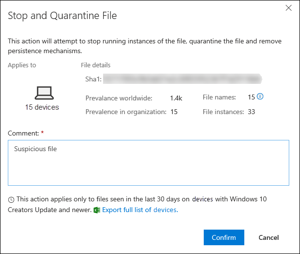

# <a name="take-response-actions-on-a-file"></a><span data-ttu-id="d1624-104">Ergreifen von Reaktionen auf eine Datei</span><span class="sxs-lookup"><span data-stu-id="d1624-104">Take response actions on a file</span></span>

[!INCLUDE [Microsoft 365 Defender rebranding](../../includes/microsoft-defender.md)]


<span data-ttu-id="d1624-105">**Gilt für:**</span><span class="sxs-lookup"><span data-stu-id="d1624-105">**Applies to:**</span></span>
- [<span data-ttu-id="d1624-106">Microsoft Defender für Endpunkt</span><span class="sxs-lookup"><span data-stu-id="d1624-106">Microsoft Defender for Endpoint</span></span>](https://go.microsoft.com/fwlink/?linkid=2154037)

[!include[Prerelease information](../../includes/prerelease.md)]

> <span data-ttu-id="d1624-107">Möchten Sie Defender für Endpunkt erfahren?</span><span class="sxs-lookup"><span data-stu-id="d1624-107">Want to experience Defender for Endpoint?</span></span> [<span data-ttu-id="d1624-108">Registrieren Sie sich für eine kostenlose Testversion</span><span class="sxs-lookup"><span data-stu-id="d1624-108">Sign up for a free trial.</span></span>](https://www.microsoft.com/microsoft-365/windows/microsoft-defender-atp?ocid=docs-wdatp-responddile-abovefoldlink)

<span data-ttu-id="d1624-109">Reagieren Sie schnell auf erkannte Angriffe, indem Sie Dateien beenden und quarantäneten oder eine Datei blockieren.</span><span class="sxs-lookup"><span data-stu-id="d1624-109">Quickly respond to detected attacks by stopping and quarantining files or blocking a file.</span></span> <span data-ttu-id="d1624-110">Nachdem Sie Maßnahmen für Dateien ergriffen haben, können Sie die Aktivitätsdetails im Info-Center überprüfen.</span><span class="sxs-lookup"><span data-stu-id="d1624-110">After taking action on files, you can check on activity details in the Action center.</span></span>

<span data-ttu-id="d1624-111">Antwortaktionen sind auf der detaillierten Profilseite einer Datei verfügbar.</span><span class="sxs-lookup"><span data-stu-id="d1624-111">Response actions are available on a file's detailed profile page.</span></span> <span data-ttu-id="d1624-112">Sobald Sie sich auf dieser Seite befinden, können Sie zwischen den neuen und alten Seitenlayouts wechseln, indem Sie die **neue Dateiseite** umschalten.</span><span class="sxs-lookup"><span data-stu-id="d1624-112">Once on this page, you can switch between the new and old page layouts by toggling **new File page**.</span></span> <span data-ttu-id="d1624-113">Der Rest dieses Artikels beschreibt das neuere Seitenlayout.</span><span class="sxs-lookup"><span data-stu-id="d1624-113">The rest of this article describes the newer page layout.</span></span>

<span data-ttu-id="d1624-114">Antwortaktionen werden oben auf der Dateiseite ausgeführt und umfassen Folgendes:</span><span class="sxs-lookup"><span data-stu-id="d1624-114">Response actions run along the top of the file page, and include:</span></span>

- <span data-ttu-id="d1624-115">Beenden und Isolieren von Dateien</span><span class="sxs-lookup"><span data-stu-id="d1624-115">Stop and Quarantine File</span></span>
- <span data-ttu-id="d1624-116">Indikator hinzufügen</span><span class="sxs-lookup"><span data-stu-id="d1624-116">Add Indicator</span></span>
- <span data-ttu-id="d1624-117">Datei herunterladen</span><span class="sxs-lookup"><span data-stu-id="d1624-117">Download file</span></span>
- <span data-ttu-id="d1624-118">Wenden Sie sich an einen Bedrohungsexperten</span><span class="sxs-lookup"><span data-stu-id="d1624-118">Consult a threat expert</span></span>
- <span data-ttu-id="d1624-119">Info-Center</span><span class="sxs-lookup"><span data-stu-id="d1624-119">Action center</span></span>

<span data-ttu-id="d1624-120">Sie können auch Dateien für eine umfassende Analyse übermitteln, um die Datei in einer sicheren Cloud-Sandbox auszuführen.</span><span class="sxs-lookup"><span data-stu-id="d1624-120">You can also submit files for deep analysis, to run the file in a secure cloud sandbox.</span></span> <span data-ttu-id="d1624-121">Wenn die Analyse abgeschlossen ist, erhalten Sie einen detaillierten Bericht, der Informationen über das Verhalten der Datei enthält.</span><span class="sxs-lookup"><span data-stu-id="d1624-121">When the analysis is complete, you'll get a detailed report that provides information about the behavior of the file.</span></span> <span data-ttu-id="d1624-122">Sie können Dateien für die umfassende Analyse übermitteln und frühere Berichte lesen, indem Sie die Registerkarte **"Umfassende Analyse"** auswählen. Er befindet sich unterhalb der Dateiinformationskarten.</span><span class="sxs-lookup"><span data-stu-id="d1624-122">You can submit files for deep analysis and read past reports by selecting the **Deep analysis** tab. It's located below the file information cards.</span></span>

<span data-ttu-id="d1624-123">Einige Aktionen erfordern bestimmte Berechtigungen.</span><span class="sxs-lookup"><span data-stu-id="d1624-123">Some actions require certain permissions.</span></span> <span data-ttu-id="d1624-124">In der folgenden Tabelle wird beschrieben, welche Aktionen bestimmte Berechtigungen für portierbare ausführbare Dateien (PE) und Nicht-PE-Dateien ausführen können:</span><span class="sxs-lookup"><span data-stu-id="d1624-124">The following table describes what action certain permissions can take on portable executable (PE) and non-PE files:</span></span>

| <span data-ttu-id="d1624-125">Berechtigung</span><span class="sxs-lookup"><span data-stu-id="d1624-125">Permission</span></span>             | <span data-ttu-id="d1624-126">PE-Dateien</span><span class="sxs-lookup"><span data-stu-id="d1624-126">PE files</span></span> | <span data-ttu-id="d1624-127">Nicht-PE-Dateien</span><span class="sxs-lookup"><span data-stu-id="d1624-127">Non-PE files</span></span> |
| :--------------------- | :------: | :----------: |
| <span data-ttu-id="d1624-128">Anzeigen von Daten</span><span class="sxs-lookup"><span data-stu-id="d1624-128">View data</span></span>              |     <span data-ttu-id="d1624-129">X</span><span class="sxs-lookup"><span data-stu-id="d1624-129">X</span></span>    |       <span data-ttu-id="d1624-130">X</span><span class="sxs-lookup"><span data-stu-id="d1624-130">X</span></span>      |
| <span data-ttu-id="d1624-131">Untersuchung von Warnungen</span><span class="sxs-lookup"><span data-stu-id="d1624-131">Alerts investigation</span></span>   | <span data-ttu-id="d1624-132">&#x2611;</span><span class="sxs-lookup"><span data-stu-id="d1624-132">&#x2611;</span></span> |       <span data-ttu-id="d1624-133">X</span><span class="sxs-lookup"><span data-stu-id="d1624-133">X</span></span>      |
| <span data-ttu-id="d1624-134">Grundlegende Live-Antwort</span><span class="sxs-lookup"><span data-stu-id="d1624-134">Live response basic</span></span>    |     <span data-ttu-id="d1624-135">X</span><span class="sxs-lookup"><span data-stu-id="d1624-135">X</span></span>    |       <span data-ttu-id="d1624-136">X</span><span class="sxs-lookup"><span data-stu-id="d1624-136">X</span></span>      |
| <span data-ttu-id="d1624-137">Live-Antwort erweitert</span><span class="sxs-lookup"><span data-stu-id="d1624-137">Live response advanced</span></span> | <span data-ttu-id="d1624-138">&#x2611;</span><span class="sxs-lookup"><span data-stu-id="d1624-138">&#x2611;</span></span> |   <span data-ttu-id="d1624-139">&#x2611;</span><span class="sxs-lookup"><span data-stu-id="d1624-139">&#x2611;</span></span>   |

<span data-ttu-id="d1624-140">Weitere Informationen zu Rollen finden Sie unter [Erstellen und Verwalten von Rollen für die rollenbasierte Zugriffssteuerung.](user-roles.md)</span><span class="sxs-lookup"><span data-stu-id="d1624-140">For more information on roles, see [Create and manage roles for role-based access control](user-roles.md).</span></span>

## <a name="stop-and-quarantine-files-in-your-network"></a><span data-ttu-id="d1624-141">Dateien in Ihrem Netzwerk beenden und unter Quarantäne stellen</span><span class="sxs-lookup"><span data-stu-id="d1624-141">Stop and quarantine files in your network</span></span>

<span data-ttu-id="d1624-142">Sie können einen Angriff in Ihrer Organisation enthalten, indem Sie den bösartigen Prozess stoppen und die Datei isolieren, in der sie beobachtet wurde.</span><span class="sxs-lookup"><span data-stu-id="d1624-142">You can contain an attack in your organization by stopping the malicious process and quarantining the file where it was observed.</span></span>

> [!IMPORTANT]
> <span data-ttu-id="d1624-143">Sie können diese Aktion nur ausführen, wenn:</span><span class="sxs-lookup"><span data-stu-id="d1624-143">You can only take this action if:</span></span>
>
> - <span data-ttu-id="d1624-144">Das Gerät, auf dem Sie die Aktion ausführen, wird Windows 10, Version 1703 oder höher, ausgeführt.</span><span class="sxs-lookup"><span data-stu-id="d1624-144">The device you're taking the action on is running Windows 10, version 1703 or later</span></span>
> - <span data-ttu-id="d1624-145">Die Datei gehört nicht zu vertrauenswürdigen Herausgebern von Drittanbietern oder wird nicht von Microsoft signiert.</span><span class="sxs-lookup"><span data-stu-id="d1624-145">The file does not belong to trusted third-party publishers or is not signed by Microsoft</span></span>
> - <span data-ttu-id="d1624-146">Microsoft Defender Antivirus müssen mindestens im passiven Modus ausgeführt werden.</span><span class="sxs-lookup"><span data-stu-id="d1624-146">Microsoft Defender Antivirus must at least be running on Passive mode.</span></span> <span data-ttu-id="d1624-147">Weitere Informationen finden Sie unter [Microsoft Defender Antivirus Kompatibilität.](/windows/security/threat-protection/microsoft-defender-antivirus/microsoft-defender-antivirus-compatibility)</span><span class="sxs-lookup"><span data-stu-id="d1624-147">For more information, see [Microsoft Defender Antivirus compatibility](/windows/security/threat-protection/microsoft-defender-antivirus/microsoft-defender-antivirus-compatibility).</span></span>

<span data-ttu-id="d1624-148">Die Aktion **"Beenden und Isolieren von Dateien"** umfasst das Beenden ausgeführter Prozesse, das Isolieren der Dateien und das Löschen persistenter Daten wie Registrierungsschlüssel.</span><span class="sxs-lookup"><span data-stu-id="d1624-148">The **Stop and Quarantine File** action includes stopping running processes, quarantining the files, and deleting persistent data such as registry keys.</span></span>

<span data-ttu-id="d1624-149">Diese Aktion wird auf Geräten mit Windows 10 Version 1703 oder höher wirksam, auf denen die Datei in den letzten 30 Tagen beobachtet wurde.</span><span class="sxs-lookup"><span data-stu-id="d1624-149">This action takes effect on devices with Windows 10, version 1703 or later, where the file was observed in the last 30 days.</span></span>

> [!NOTE]
> <span data-ttu-id="d1624-150">Sie können die Datei jederzeit aus der Quarantäne wiederherstellen.</span><span class="sxs-lookup"><span data-stu-id="d1624-150">You’ll be able to restore the file from quarantine at any time.</span></span>

### <a name="stop-and-quarantine-files"></a><span data-ttu-id="d1624-151">Beenden und Isolieren von Dateien</span><span class="sxs-lookup"><span data-stu-id="d1624-151">Stop and quarantine files</span></span>

1. <span data-ttu-id="d1624-152">Wählen Sie die Datei aus, die Sie beenden und unter Quarantäne stellen möchten.</span><span class="sxs-lookup"><span data-stu-id="d1624-152">Select the file you want to stop and quarantine.</span></span> <span data-ttu-id="d1624-153">Sie können eine Datei aus einer der folgenden Ansichten auswählen oder das Suchfeld verwenden:</span><span class="sxs-lookup"><span data-stu-id="d1624-153">You can select a file from any of the following views or use the Search box:</span></span>

   - <span data-ttu-id="d1624-154">**Warnungen –** Klicken Sie auf die entsprechenden Links aus der Beschreibung oder den Details in der Zeitachse des Warnungsartikels.</span><span class="sxs-lookup"><span data-stu-id="d1624-154">**Alerts** - click the corresponding links from the Description or Details in the Alert Story timeline</span></span>
   - <span data-ttu-id="d1624-155">**Suchfeld** – Wählen Sie im Dropdownmenü die Option **"Datei"** aus, und geben Sie den Dateinamen ein.</span><span class="sxs-lookup"><span data-stu-id="d1624-155">**Search box** - select **File** from the drop–down menu and enter the file name</span></span>

   > [!NOTE]
   > <span data-ttu-id="d1624-156">Die Aktion zum Beenden und Isolieren von Dateien ist auf maximal 1.000 Geräte beschränkt.</span><span class="sxs-lookup"><span data-stu-id="d1624-156">The stop and quarantine file action is limited to a maximum of 1000 devices.</span></span> <span data-ttu-id="d1624-157">Informationen zum Beenden einer Datei auf einer größeren Anzahl von Geräten finden Sie unter Hinzufügen eines [Indikators zum Blockieren oder Zulassen](#add-indicator-to-block-or-allow-a-file)von Dateien.</span><span class="sxs-lookup"><span data-stu-id="d1624-157">To stop a file on a larger number of devices, see [Add indicator to block or allow file](#add-indicator-to-block-or-allow-a-file).</span></span>

2. <span data-ttu-id="d1624-158">Wechseln Sie zur oberen Leiste, und wählen Sie **"Beenden" und "Quarantänedatei"** aus.</span><span class="sxs-lookup"><span data-stu-id="d1624-158">Go to the top bar and select **Stop and Quarantine File**.</span></span>

   

3. <span data-ttu-id="d1624-160">Geben Sie einen Grund an, und wählen Sie dann **"Bestätigen"** aus.</span><span class="sxs-lookup"><span data-stu-id="d1624-160">Specify a reason, then select **Confirm**.</span></span>

   

   <span data-ttu-id="d1624-162">Im Info-Center werden die Übermittlungsinformationen angezeigt:</span><span class="sxs-lookup"><span data-stu-id="d1624-162">The Action center shows the submission information:</span></span>
   
   

   - <span data-ttu-id="d1624-164">**Übermittlungszeit** – Zeigt an, wann die Aktion übermittelt wurde.</span><span class="sxs-lookup"><span data-stu-id="d1624-164">**Submission time** - Shows when the action was submitted.</span></span>
   - <span data-ttu-id="d1624-165">**Erfolg** – Zeigt die Anzahl der Geräte an, auf denen die Datei angehalten und isoliert wurde.</span><span class="sxs-lookup"><span data-stu-id="d1624-165">**Success** - Shows the number of devices where the file has been stopped and quarantined.</span></span>
   - <span data-ttu-id="d1624-166">**Fehlgeschlagen** – Zeigt die Anzahl der Geräte an, auf denen die Aktion fehlgeschlagen ist, sowie Details zu dem Fehler.</span><span class="sxs-lookup"><span data-stu-id="d1624-166">**Failed** - Shows the number of devices where the action failed and details about the failure.</span></span>
   - <span data-ttu-id="d1624-167">**Ausstehend** – Zeigt die Anzahl der Geräte an, auf denen die Datei noch beendet und unter Quarantäne gestellt werden muss.</span><span class="sxs-lookup"><span data-stu-id="d1624-167">**Pending** - Shows the number of devices where the file is yet to be stopped and quarantined from.</span></span> <span data-ttu-id="d1624-168">Dies kann einige Zeit in Fällen dauern, in denen das Gerät offline oder nicht mit dem Netzwerk verbunden ist.</span><span class="sxs-lookup"><span data-stu-id="d1624-168">This can take time for cases when the device is offline or not connected to the network.</span></span>

4. <span data-ttu-id="d1624-169">Wählen Sie einen der Statusindikatoren aus, um weitere Informationen zu der Aktion anzuzeigen.</span><span class="sxs-lookup"><span data-stu-id="d1624-169">Select any of the status indicators to view more information about the action.</span></span> <span data-ttu-id="d1624-170">Wählen Sie beispielsweise **"Fehlgeschlagen"** aus, um zu sehen, wo die Aktion fehlgeschlagen ist.</span><span class="sxs-lookup"><span data-stu-id="d1624-170">For example, select **Failed** to see where the action failed.</span></span>

<span data-ttu-id="d1624-171">**Benachrichtigung für Gerätebenutzer:**</span><span class="sxs-lookup"><span data-stu-id="d1624-171">**Notification on device user**:</span></span></br>
<span data-ttu-id="d1624-172">Wenn die Datei von einem Gerät entfernt wird, wird die folgende Benachrichtigung angezeigt:</span><span class="sxs-lookup"><span data-stu-id="d1624-172">When the file is being removed from a device, the following notification is shown:</span></span>


<span data-ttu-id="d1624-174">In der Gerätezeitachse wird ein neues Ereignis für jedes Gerät hinzugefügt, auf dem eine Datei angehalten und isoliert wurde.</span><span class="sxs-lookup"><span data-stu-id="d1624-174">In the device timeline, a new event is added for each device where a file was stopped and quarantined.</span></span>

<span data-ttu-id="d1624-175">Es wird eine Warnung angezeigt, bevor die Aktion für Dateien implementiert wird, die in der gesamten Organisation häufig verwendet werden.</span><span class="sxs-lookup"><span data-stu-id="d1624-175">A warning is shown before the action is implemented for files widely used throughout an organization.</span></span> <span data-ttu-id="d1624-176">Es soll überprüft werden, ob der Vorgang beabsichtigt ist.</span><span class="sxs-lookup"><span data-stu-id="d1624-176">It's to validate that the operation is intended.</span></span>

## <a name="restore-file-from-quarantine"></a><span data-ttu-id="d1624-177">Datei aus der Quarantäne wiederherstellen</span><span class="sxs-lookup"><span data-stu-id="d1624-177">Restore file from quarantine</span></span>

<span data-ttu-id="d1624-178">Sie können ein Rollback ausführen und eine Datei aus der Quarantäne entfernen, wenn Sie nach einer Untersuchung festgestellt haben, dass sie sauber ist.</span><span class="sxs-lookup"><span data-stu-id="d1624-178">You can roll back and remove a file from quarantine if you’ve determined that it’s clean after an investigation.</span></span> <span data-ttu-id="d1624-179">Führen Sie den folgenden Befehl auf jedem Gerät aus, auf dem die Datei unter Quarantäne gestellt wurde.</span><span class="sxs-lookup"><span data-stu-id="d1624-179">Run the following command on each device where the file was quarantined.</span></span>

1. <span data-ttu-id="d1624-180">Öffnen Sie eine Eingabeaufforderung mit erhöhten Rechten auf dem Gerät:</span><span class="sxs-lookup"><span data-stu-id="d1624-180">Open an elevated command–line prompt on the device:</span></span>

   1. <span data-ttu-id="d1624-181">Wechseln Sie zu **Start**, und geben Sie _cmd_ ein.</span><span class="sxs-lookup"><span data-stu-id="d1624-181">Go to **Start** and type _cmd_.</span></span>

   1. <span data-ttu-id="d1624-182">Klicken Sie mit der rechten Maustaste auf **die Eingabeaufforderung,** und wählen Sie **"Als Administrator ausführen"** aus.</span><span class="sxs-lookup"><span data-stu-id="d1624-182">Right–click **Command prompt** and select **Run as administrator**.</span></span>

2. <span data-ttu-id="d1624-183">Geben Sie den folgenden Befehl ein, und drücken Sie die **EINGABETASTE:**</span><span class="sxs-lookup"><span data-stu-id="d1624-183">Enter the following command, and press **Enter**:</span></span>

   ```console
   “%ProgramFiles%\Windows Defender\MpCmdRun.exe” –Restore –Name EUS:Win32/CustomEnterpriseBlock –All
   ```

   > [!NOTE]
   > <span data-ttu-id="d1624-184">In einigen Szenarien kann **der ThreatName** folgendermaßen aussehen: EUS:Win32/CustomEnterpriseBlock!cl.</span><span class="sxs-lookup"><span data-stu-id="d1624-184">In some scenarios, the **ThreatName** may appear as: EUS:Win32/CustomEnterpriseBlock!cl.</span></span>
   >
   > <span data-ttu-id="d1624-185">Defender für Endpunkt stellt alle benutzerdefinierten blockierten Dateien wieder her, die in den letzten 30 Tagen auf diesem Gerät unter Quarantäne gestellt wurden.</span><span class="sxs-lookup"><span data-stu-id="d1624-185">Defender for Endpoint will restore all custom blocked files that were quarantined on this device in the last 30 days.</span></span>

> [!IMPORTANT]
> <span data-ttu-id="d1624-186">Eine Datei, die als potenzielle Netzwerkgefährdung unter Quarantäne gestellt wurde, kann möglicherweise nicht wiederhergestellt werden.</span><span class="sxs-lookup"><span data-stu-id="d1624-186">A file that was quarantined as a potential network threat might not be recoverable.</span></span> <span data-ttu-id="d1624-187">Wenn ein Benutzer versucht, die Datei nach der Quarantäne wiederherzustellen, kann auf diese Datei möglicherweise nicht zugegriffen werden.</span><span class="sxs-lookup"><span data-stu-id="d1624-187">If a user attempts to restore the file after quarantine, that file might not be accessible.</span></span> <span data-ttu-id="d1624-188">Dies kann darauf zurückzuführen sein, dass das System nicht mehr über Netzwerkanmeldeinformationen für den Zugriff auf die Datei verfügt.</span><span class="sxs-lookup"><span data-stu-id="d1624-188">This can be due to the system no longer having network credentials to access the file.</span></span> <span data-ttu-id="d1624-189">In der Regel ist dies ein Ergebnis einer temporären Anmeldung bei einem System oder freigegebenen Ordner, und die Zugriffstoken sind abgelaufen.</span><span class="sxs-lookup"><span data-stu-id="d1624-189">Typically, this is a result of a temporary log on to a system or shared folder and the access tokens expired.</span></span>

## <a name="download-or-collect-file"></a><span data-ttu-id="d1624-190">Datei herunterladen oder sammeln</span><span class="sxs-lookup"><span data-stu-id="d1624-190">Download or collect file</span></span>

<span data-ttu-id="d1624-191">Wenn Sie die Datei aus den Antwortaktionen **herunterladen** auswählen, können Sie ein lokales, kennwortgeschütztes .zip Archiv herunterladen, das Ihre Datei enthält.</span><span class="sxs-lookup"><span data-stu-id="d1624-191">Selecting **Download file** from the response actions allows you to download a local, password-protected .zip archive containing your file.</span></span> <span data-ttu-id="d1624-192">Es wird ein Flyout angezeigt, in dem Sie einen Grund für das Herunterladen der Datei aufzeichnen und ein Kennwort festlegen können.</span><span class="sxs-lookup"><span data-stu-id="d1624-192">A flyout will appear where you can record a reason for downloading the file, and set a password.</span></span>

<span data-ttu-id="d1624-193">Standardmäßig können Sie keine Dateien herunterladen, die sich in Quarantäne befinden.</span><span class="sxs-lookup"><span data-stu-id="d1624-193">By default, you will not be able to download files that are in quarantine.</span></span>


### <a name="collect-files"></a><span data-ttu-id="d1624-195">Sammeln von Dateien</span><span class="sxs-lookup"><span data-stu-id="d1624-195">Collect files</span></span>

<span data-ttu-id="d1624-196">Wenn eine Datei nicht bereits von Microsoft Defender für Endpunkt gespeichert wurde, können Sie sie nicht herunterladen.</span><span class="sxs-lookup"><span data-stu-id="d1624-196">If a file is not already stored by Microsoft Defender for Endpoint, you can't download it.</span></span> <span data-ttu-id="d1624-197">Stattdessen wird die Schaltfläche **"Datei sammeln"** am selben Speicherort angezeigt.</span><span class="sxs-lookup"><span data-stu-id="d1624-197">Instead, you'll see a **Collect file** button in the same location.</span></span> <span data-ttu-id="d1624-198">Wenn eine Datei in der Organisation in den letzten 30 Tagen nicht angezeigt wurde, wird die **Sammlungsdatei** deaktiviert.</span><span class="sxs-lookup"><span data-stu-id="d1624-198">If a file hasn't been seen in the organization in the past 30 days, **Collect file** will be disabled.</span></span>
> [!Important]
> <span data-ttu-id="d1624-199">Eine Datei, die als potenzielle Netzwerkgefährdung unter Quarantäne gestellt wurde, kann möglicherweise nicht wiederhergestellt werden.</span><span class="sxs-lookup"><span data-stu-id="d1624-199">A file that was quarantined as a potential network threat might not be recoverable.</span></span> <span data-ttu-id="d1624-200">Wenn ein Benutzer versucht, die Datei nach der Quarantäne wiederherzustellen, kann auf diese Datei möglicherweise nicht zugegriffen werden.</span><span class="sxs-lookup"><span data-stu-id="d1624-200">If a user attempts to restore the file after quarantine, that file might not be accessible.</span></span> <span data-ttu-id="d1624-201">Dies kann darauf zurückzuführen sein, dass das System nicht mehr über Netzwerkanmeldeinformationen für den Zugriff auf die Datei verfügt.</span><span class="sxs-lookup"><span data-stu-id="d1624-201">This can be due to the system no longer having network credentials to access the file.</span></span> <span data-ttu-id="d1624-202">In der Regel ist dies ein Ergebnis einer temporären Anmeldung bei einem System oder freigegebenen Ordner, und die Zugriffstoken sind abgelaufen.</span><span class="sxs-lookup"><span data-stu-id="d1624-202">Typically, this is a result of a temporary log on to a system or shared folder and the access tokens expired.</span></span>

## <a name="add-indicator-to-block-or-allow-a-file"></a><span data-ttu-id="d1624-203">Hinzufügen eines Indikators zum Blockieren oder Zulassen einer Datei</span><span class="sxs-lookup"><span data-stu-id="d1624-203">Add indicator to block or allow a file</span></span>

<span data-ttu-id="d1624-204">Verhindern Sie die weitere Verbreitung eines Angriffs in Ihrer Organisation, indem Sie potenziell schädliche Dateien oder verdächtige Schadsoftware verbieten.</span><span class="sxs-lookup"><span data-stu-id="d1624-204">Prevent further propagation of an attack in your organization by banning potentially malicious files or suspected malware.</span></span> <span data-ttu-id="d1624-205">Wenn Sie eine potenziell schädliche portierbare ausführbare Datei (PE) kennen, können Sie sie blockieren.</span><span class="sxs-lookup"><span data-stu-id="d1624-205">If you know a potentially malicious portable executable (PE) file, you can block it.</span></span> <span data-ttu-id="d1624-206">Dieser Vorgang verhindert, dass er auf Geräten in Ihrer Organisation gelesen, geschrieben oder ausgeführt wird.</span><span class="sxs-lookup"><span data-stu-id="d1624-206">This operation will prevent it from being read, written, or executed on devices in your organization.</span></span>

> [!IMPORTANT]
>
> - <span data-ttu-id="d1624-207">Dieses Feature ist verfügbar, wenn Ihre Organisation Microsoft Defender Antivirus verwendet und der über die Cloud bereitgestellte Schutz aktiviert ist.</span><span class="sxs-lookup"><span data-stu-id="d1624-207">This feature is available if your organization uses Microsoft Defender Antivirus and Cloud–delivered protection is enabled.</span></span> <span data-ttu-id="d1624-208">Weitere Informationen finden Sie unter [Verwalten des über die Cloud bereitgestellten Schutzes.](/windows/security/threat-protection/microsoft-defender-antivirus/deploy-manage-report-microsoft-defender-antivirus)</span><span class="sxs-lookup"><span data-stu-id="d1624-208">For more information, see [Manage cloud–delivered protection](/windows/security/threat-protection/microsoft-defender-antivirus/deploy-manage-report-microsoft-defender-antivirus).</span></span>
>
> - <span data-ttu-id="d1624-209">Die Antischadsoftware-Clientversion muss 4.18.1901.x oder höher sein.</span><span class="sxs-lookup"><span data-stu-id="d1624-209">The Antimalware client version must be 4.18.1901.x or later.</span></span>
> - <span data-ttu-id="d1624-210">Dieses Feature soll verhindern, dass verdächtige Schadsoftware (oder potenziell schädliche Dateien) aus dem Web heruntergeladen wird.</span><span class="sxs-lookup"><span data-stu-id="d1624-210">This feature is designed to prevent suspected malware (or potentially malicious files) from being downloaded from the web.</span></span> <span data-ttu-id="d1624-211">Derzeit werden portierbare ausführbare Dateien (PE) unterstützt, einschließlich _.exe-_ und _.dlldateien._</span><span class="sxs-lookup"><span data-stu-id="d1624-211">It currently supports portable executable (PE) files, including _.exe_ and _.dll_ files.</span></span> <span data-ttu-id="d1624-212">Die Abdeckung wird im Laufe der Zeit erweitert.</span><span class="sxs-lookup"><span data-stu-id="d1624-212">The coverage will be extended over time.</span></span>
> - <span data-ttu-id="d1624-213">Diese Antwortaktion ist für Geräte mit Windows 10 Version 1703 oder höher verfügbar.</span><span class="sxs-lookup"><span data-stu-id="d1624-213">This response action is available for devices on Windows 10, version 1703 or later.</span></span>
> - <span data-ttu-id="d1624-214">Die Funktion "Zulassen" oder "Blockieren" kann für Dateien nicht ausgeführt werden, wenn die Klassifizierung der Datei im Cache des Geräts vor der Zulassungs- oder Blockierungsaktion vorhanden ist.</span><span class="sxs-lookup"><span data-stu-id="d1624-214">The allow or block function cannot be done on files if the file's classification exists on the device's cache prior to the allow or block action.</span></span>

> [!NOTE]
> <span data-ttu-id="d1624-215">Die PE-Datei muss sich in der Gerätezeitachse befinden, damit Sie diese Aktion ausführen können.</span><span class="sxs-lookup"><span data-stu-id="d1624-215">The PE file needs to be in the device timeline for you to be able to take this action.</span></span>
>
> <span data-ttu-id="d1624-216">Zwischen dem Zeitpunkt, zu dem die Aktion ausgeführt wird, und dem Blockieren der tatsächlichen Datei kann es einige Minuten Wartezeit geben.</span><span class="sxs-lookup"><span data-stu-id="d1624-216">There may be a couple of minutes of latency between the time the action is taken and the actual file being blocked.</span></span>

### <a name="enable-the-block-file-feature"></a><span data-ttu-id="d1624-217">Aktivieren des Features "Datei blockieren"</span><span class="sxs-lookup"><span data-stu-id="d1624-217">Enable the block file feature</span></span>

<span data-ttu-id="d1624-218">Um mit dem Blockieren von Dateien zu beginnen, müssen Sie zuerst [das Feature **"Blockieren" oder "Zulassen"**](advanced-features.md) in Einstellungen aktivieren.</span><span class="sxs-lookup"><span data-stu-id="d1624-218">To start blocking files, you first need to [turn the **Block or allow** feature on](advanced-features.md) in Settings.</span></span>
### <a name="allow-or-block-file"></a><span data-ttu-id="d1624-219">Datei zulassen oder blockieren</span><span class="sxs-lookup"><span data-stu-id="d1624-219">Allow or block file</span></span>

<span data-ttu-id="d1624-220">Wenn Sie einen Indikatorhash für eine Datei hinzufügen, können Sie eine Warnung auslösen und die Datei blockieren, wenn ein Gerät in Ihrer Organisation versucht, sie auszuführen.</span><span class="sxs-lookup"><span data-stu-id="d1624-220">When you add an indicator hash for a file, you can choose to raise an alert and block the file whenever a device in your organization attempts to run it.</span></span>

<span data-ttu-id="d1624-221">Dateien, die automatisch durch einen Indikator blockiert werden, werden nicht im Info-Center der Datei angezeigt, aber die Warnungen werden weiterhin in der Warnungswarteschlange angezeigt.</span><span class="sxs-lookup"><span data-stu-id="d1624-221">Files automatically blocked by an indicator won't show up in the file's Action center, but the alerts will still be visible in the Alerts queue.</span></span>

<span data-ttu-id="d1624-222">Weitere Informationen zum Blockieren und Auslösen von Warnungen für Dateien finden Sie unter [Verwalten von Indikatoren.](manage-indicators.md)</span><span class="sxs-lookup"><span data-stu-id="d1624-222">See [manage indicators](manage-indicators.md) for more details on blocking and raising alerts on files.</span></span>

<span data-ttu-id="d1624-223">Um das Blockieren einer Datei zu beenden, entfernen Sie den Indikator.</span><span class="sxs-lookup"><span data-stu-id="d1624-223">To stop blocking a file, remove the indicator.</span></span> <span data-ttu-id="d1624-224">Sie können dies über die Aktion **"Indikator bearbeiten"** auf der Profilseite der Datei tun.</span><span class="sxs-lookup"><span data-stu-id="d1624-224">You can do so via the **Edit Indicator** action on the file's profile page.</span></span> <span data-ttu-id="d1624-225">Diese Aktion wird an derselben Position wie die Aktion **"Indikator hinzufügen"** angezeigt, bevor Sie den Indikator hinzugefügt haben.</span><span class="sxs-lookup"><span data-stu-id="d1624-225">This action will be visible in the same position as the **Add Indicator** action, before you added the indicator.</span></span>

<span data-ttu-id="d1624-226">Sie können Indikatoren auch auf der **Einstellungen** Seite unter   >  **Regelindikatoren** bearbeiten.</span><span class="sxs-lookup"><span data-stu-id="d1624-226">You can also edit indicators from  the **Settings** page, under **Rules** > **Indicators**.</span></span> <span data-ttu-id="d1624-227">Indikatoren werden in diesem Bereich anhand des Hash ihrer Datei aufgelistet.</span><span class="sxs-lookup"><span data-stu-id="d1624-227">Indicators are listed in this area by their file's hash.</span></span>

## <a name="consult-a-threat-expert"></a><span data-ttu-id="d1624-228">Wenden Sie sich an einen Bedrohungsexperten</span><span class="sxs-lookup"><span data-stu-id="d1624-228">Consult a threat expert</span></span>

<span data-ttu-id="d1624-229">Wenden Sie sich an einen Microsoft-Bedrohungsexperten, um weitere Einblicke auf ein potenziell kompromittiertes Gerät oder bereits gefährdete Geräte zu erhalten.</span><span class="sxs-lookup"><span data-stu-id="d1624-229">Consult a Microsoft threat expert for more insights on a potentially compromised device, or already compromised devices.</span></span> <span data-ttu-id="d1624-230">Microsoft-Bedrohungsexperten werden direkt innerhalb der Microsoft Defender Security Center für eine zeitnahe und genaue Antwort eingebunden.</span><span class="sxs-lookup"><span data-stu-id="d1624-230">Microsoft Threat Experts are engaged directly from within the Microsoft Defender Security Center for timely and accurate response.</span></span> <span data-ttu-id="d1624-231">Experten bieten Einblicke auf ein potenziell kompromittiertes Gerät und helfen Ihnen, komplexe Bedrohungen und Benachrichtigungen über gezielte Angriffe zu verstehen.</span><span class="sxs-lookup"><span data-stu-id="d1624-231">Experts provide insights on a potentially compromised device and help you understand complex threats and targeted attack notifications.</span></span> <span data-ttu-id="d1624-232">Sie können auch Informationen zu warnungen oder einem Kontext für die Bedrohungserkennung bereitstellen, der auf Ihrem Portaldashboard angezeigt wird.</span><span class="sxs-lookup"><span data-stu-id="d1624-232">They can also provide information about the alerts or a threat intelligence context that you see on your portal dashboard.</span></span>

<span data-ttu-id="d1624-233">Weitere Informationen finden [Sie unter "Microsoft Threat Expert".](/microsoft-365/security/defender-endpoint/configure-microsoft-threat-experts#consult-a-microsoft-threat-expert-about-suspicious-cybersecurity-activities-in-your-organization)</span><span class="sxs-lookup"><span data-stu-id="d1624-233">See [Consult a Microsoft Threat Expert](/microsoft-365/security/defender-endpoint/configure-microsoft-threat-experts#consult-a-microsoft-threat-expert-about-suspicious-cybersecurity-activities-in-your-organization) for details.</span></span>

## <a name="check-activity-details-in-action-center"></a><span data-ttu-id="d1624-234">Überprüfen von Aktivitätsdetails im Aktionscenter</span><span class="sxs-lookup"><span data-stu-id="d1624-234">Check activity details in Action center</span></span>

<span data-ttu-id="d1624-235">Das **Info-Center** enthält Informationen zu Aktionen, die auf einem Gerät oder einer Datei ausgeführt wurden.</span><span class="sxs-lookup"><span data-stu-id="d1624-235">The **Action center** provides information on actions that were taken on a device or file.</span></span> <span data-ttu-id="d1624-236">Sie können die folgenden Details anzeigen:</span><span class="sxs-lookup"><span data-stu-id="d1624-236">You can view the following details:</span></span>

- <span data-ttu-id="d1624-237">Untersuchungspaketsammlung</span><span class="sxs-lookup"><span data-stu-id="d1624-237">Investigation package collection</span></span>
- <span data-ttu-id="d1624-238">Antivirus-Scan</span><span class="sxs-lookup"><span data-stu-id="d1624-238">Antivirus scan</span></span>
- <span data-ttu-id="d1624-239">App-Einschränkung</span><span class="sxs-lookup"><span data-stu-id="d1624-239">App restriction</span></span>
- <span data-ttu-id="d1624-240">Geräteisolation</span><span class="sxs-lookup"><span data-stu-id="d1624-240">Device isolation</span></span>

<span data-ttu-id="d1624-241">Alle anderen verwandten Details werden ebenfalls angezeigt, z. B. Übermittlungsdatum/-uhrzeit, Übermitteln des Benutzers und ob die Aktion erfolgreich war oder fehlgeschlagen ist.</span><span class="sxs-lookup"><span data-stu-id="d1624-241">All other related details are also shown, such as submission date/time, submitting user, and if the action succeeded or failed.</span></span>


## <a name="deep-analysis"></a><span data-ttu-id="d1624-243">Tiefe Analyse</span><span class="sxs-lookup"><span data-stu-id="d1624-243">Deep analysis</span></span>

<span data-ttu-id="d1624-244">Untersuchungen zur Cybersicherheit werden in der Regel durch eine Warnung ausgelöst.</span><span class="sxs-lookup"><span data-stu-id="d1624-244">Cyber security investigations are typically triggered by an alert.</span></span> <span data-ttu-id="d1624-245">Warnungen beziehen sich auf eine oder mehrere beobachtete Dateien, die häufig neu oder unbekannt sind.</span><span class="sxs-lookup"><span data-stu-id="d1624-245">Alerts are related to one or more observed files that are often new or unknown.</span></span> <span data-ttu-id="d1624-246">Wenn Sie eine Datei auswählen, gelangen Sie zur Dateiansicht, in der Sie die Metadaten der Datei sehen können.</span><span class="sxs-lookup"><span data-stu-id="d1624-246">Selecting a file takes you to the file view where you can see the file's metadata.</span></span> <span data-ttu-id="d1624-247">Um die Daten im Zusammenhang mit der Datei zu erweitern, können Sie die Datei für eine umfassende Analyse übermitteln.</span><span class="sxs-lookup"><span data-stu-id="d1624-247">To enrich the data related to the file, you can submit the file for deep analysis.</span></span>

<span data-ttu-id="d1624-248">Das Feature "Umfassende Analyse" führt eine Datei in einer sicheren, vollständig instrumentierten Cloudumgebung aus.</span><span class="sxs-lookup"><span data-stu-id="d1624-248">The Deep analysis feature executes a file in a secure, fully instrumented cloud environment.</span></span> <span data-ttu-id="d1624-249">Umfassende Analyseergebnisse zeigen die Aktivitäten der Datei, beobachtete Verhaltensweisen und zugehörige Artefakte, z. B. verworfene Dateien, Registrierungsänderungen und Kommunikation mit IP-Adressen.</span><span class="sxs-lookup"><span data-stu-id="d1624-249">Deep analysis results show the file's activities, observed behaviors, and associated artifacts, such as dropped files, registry modifications, and communication with IPs.</span></span>
<span data-ttu-id="d1624-250">Die umfassende Analyse unterstützt derzeit die umfassende Analyse portierbarer ausführbarer Dateien (einschließlich _.exe_ und _.dll)._</span><span class="sxs-lookup"><span data-stu-id="d1624-250">Deep analysis currently supports extensive analysis of portable executable (PE) files (including _.exe_ and _.dll_ files).</span></span>

<span data-ttu-id="d1624-251">Die umfassende Analyse einer Datei dauert mehrere Minuten.</span><span class="sxs-lookup"><span data-stu-id="d1624-251">Deep analysis of a file takes several minutes.</span></span> <span data-ttu-id="d1624-252">Sobald die Dateianalyse abgeschlossen ist, wird die Registerkarte "Umfassende Analyse" aktualisiert, um eine Zusammenfassung und das Datum und die Uhrzeit der neuesten verfügbaren Ergebnisse anzuzeigen.</span><span class="sxs-lookup"><span data-stu-id="d1624-252">Once the file analysis is complete, the Deep Analysis tab will update to display a summary and the date and time of the latest available results.</span></span>

<span data-ttu-id="d1624-253">Die umfassende Analysezusammenfassung enthält eine Liste der *beobachteten Verhaltensweisen,* von denen einige auf böswillige Aktivitäten und *Observables* hinweisen können, einschließlich kontaktierter IPs und dateien, die auf dem Datenträger erstellt wurden.</span><span class="sxs-lookup"><span data-stu-id="d1624-253">The deep analysis summary includes a list of observed *behaviors*, some of which can indicate malicious activity, and *observables*, including contacted IPs and files created on the disk.</span></span> <span data-ttu-id="d1624-254">Wenn nichts gefunden wurde, wird in diesen Abschnitten eine kurze Meldung angezeigt.</span><span class="sxs-lookup"><span data-stu-id="d1624-254">If nothing was found, these sections will display a brief message.</span></span>

<span data-ttu-id="d1624-255">Die Ergebnisse einer umfassenden Analyse werden mit der Bedrohungserkennung abgeglichen, und alle Übereinstimmungen generieren entsprechende Warnungen.</span><span class="sxs-lookup"><span data-stu-id="d1624-255">Results of deep analysis are matched against threat intelligence and any matches will generate appropriate alerts.</span></span>

<span data-ttu-id="d1624-256">Verwenden Sie die umfassende Analysefunktion, um die Details einer Datei zu untersuchen, in der Regel während einer Untersuchung einer Warnung oder aus einem anderen Grund, aus dem Sie bösartiges Verhalten vermuten.</span><span class="sxs-lookup"><span data-stu-id="d1624-256">Use the deep analysis feature to investigate the details of any file, usually during an investigation of an alert or for any other reason where you suspect malicious behavior.</span></span> <span data-ttu-id="d1624-257">Dieses Feature ist auf der Registerkarte **"Umfassende Analyse"** auf der Profilseite der Datei verfügbar.</span><span class="sxs-lookup"><span data-stu-id="d1624-257">This feature is available within the **Deep analysis** tab, on the file's profile page.</span></span><br/>
<br/>

> [!VIDEO https://www.microsoft.com/en-us/videoplayer/embed/RE4aAYy?rel=0]

<span data-ttu-id="d1624-258">**Submit for deep analysis** is enabled when the file is available in the Defender for Endpoint backend sample collection, or if it was observed on a Windows 10 device that supports submitting to deep analysis.</span><span class="sxs-lookup"><span data-stu-id="d1624-258">**Submit for deep analysis** is enabled when the file is available in the Defender for Endpoint backend sample collection, or if it was observed on a Windows 10 device that supports submitting to deep analysis.</span></span>

> [!NOTE]
> <span data-ttu-id="d1624-259">Nur Dateien aus Windows 10 können automatisch erfasst werden.</span><span class="sxs-lookup"><span data-stu-id="d1624-259">Only files from Windows 10 can be automatically collected.</span></span>

<span data-ttu-id="d1624-260">Sie können auch ein Beispiel über das [Microsoft Security Center-Portal](https://www.microsoft.com/security/portal/submission/submit.aspx) übermitteln, wenn die Datei auf einem Windows 10 Gerät nicht beobachtet wurde, und warten, bis die Schaltfläche **"Submit for deep analysis"** verfügbar ist.</span><span class="sxs-lookup"><span data-stu-id="d1624-260">You can also submit a sample through the [Microsoft Security Center Portal](https://www.microsoft.com/security/portal/submission/submit.aspx) if the file wasn't observed on a Windows 10 device, and wait for **Submit for deep analysis** button to become available.</span></span>

> [!NOTE]
> <span data-ttu-id="d1624-261">Aufgrund von Back-End-Verarbeitungsflüssen im Microsoft Security Center-Portal kann es zwischen der Dateiübermittlung und der Verfügbarkeit des umfassenden Analysefeatures in Defender für Endpunkt eine Latenz von bis zu 10 Minuten geben.</span><span class="sxs-lookup"><span data-stu-id="d1624-261">Due to backend processing flows in the Microsoft Security Center Portal, there could be up to 10 minutes of latency between file submission and availability of the deep analysis feature in Defender for Endpoint.</span></span>

### <a name="submit-files-for-deep-analysis"></a><span data-ttu-id="d1624-262">Übermitteln von Dateien für eine umfassende Analyse</span><span class="sxs-lookup"><span data-stu-id="d1624-262">Submit files for deep analysis</span></span>

1. <span data-ttu-id="d1624-263">Wählen Sie die Datei aus, die Sie für eine umfassende Analyse übermitteln möchten.</span><span class="sxs-lookup"><span data-stu-id="d1624-263">Select the file that you want to submit for deep analysis.</span></span> <span data-ttu-id="d1624-264">Sie können eine Datei aus einer der folgenden Ansichten auswählen oder durchsuchen:</span><span class="sxs-lookup"><span data-stu-id="d1624-264">You can select or search a file from any of the following views:</span></span>

    - <span data-ttu-id="d1624-265">**Warnungen** – Wählen Sie die Dateilinks aus der **Beschreibung** oder **Details** in der Zeitachse des Warnungsartikels aus.</span><span class="sxs-lookup"><span data-stu-id="d1624-265">**Alerts** - select the file links from the **Description** or **Details** in the Alert Story timeline</span></span>
    - <span data-ttu-id="d1624-266">**Geräteliste** – Wählen Sie die Dateilinks aus dem Abschnitt **"Beschreibung"** oder **"Details"** im Abschnitt **"Gerät in Organisation"** aus.</span><span class="sxs-lookup"><span data-stu-id="d1624-266">**Devices list** - select the file links from the **Description** or **Details** in the **Device in organization** section</span></span>
    - <span data-ttu-id="d1624-267">**Suchfeld** – Wählen Sie im Dropdownmenü die Option **"Datei"** aus, und geben Sie den Dateinamen ein.</span><span class="sxs-lookup"><span data-stu-id="d1624-267">**Search box** - select **File** from the drop–down menu and enter the file name</span></span>

2. <span data-ttu-id="d1624-268">Wählen Sie auf der Registerkarte **"Umfassende Analyse"** der Dateiansicht **"Absenden"** aus.</span><span class="sxs-lookup"><span data-stu-id="d1624-268">In the **Deep analysis** tab of the file view, select **Submit**.</span></span>

   

   > [!NOTE]
   > <span data-ttu-id="d1624-270">Es werden nur PE-Dateien unterstützt, einschließlich _.exe-_ und _.dlldateien._</span><span class="sxs-lookup"><span data-stu-id="d1624-270">Only PE files are supported, including _.exe_ and _.dll_ files.</span></span>

   <span data-ttu-id="d1624-271">Eine Statusanzeige wird angezeigt und enthält Informationen zu den verschiedenen Phasen der Analyse.</span><span class="sxs-lookup"><span data-stu-id="d1624-271">A progress bar is displayed and provides information on the different stages of the analysis.</span></span> <span data-ttu-id="d1624-272">Sie können den Bericht dann anzeigen, wenn die Analyse abgeschlossen ist.</span><span class="sxs-lookup"><span data-stu-id="d1624-272">You can then view the report when the analysis is done.</span></span>

> [!NOTE]
> <span data-ttu-id="d1624-273">Je nach Geräteverfügbarkeit kann die Dauer der Beispielsammlung variieren.</span><span class="sxs-lookup"><span data-stu-id="d1624-273">Depending on device availability, sample collection time can vary.</span></span> <span data-ttu-id="d1624-274">Es gibt ein 3-Stunden-Timeout für die Beispielsammlung.</span><span class="sxs-lookup"><span data-stu-id="d1624-274">There is a 3–hour timeout for sample collection.</span></span> <span data-ttu-id="d1624-275">Die Auflistung schlägt fehl, und der Vorgang wird abgebrochen, wenn zu diesem Zeitpunkt keine Online-Windows 10 Geräteberichterstellung vorhanden ist.</span><span class="sxs-lookup"><span data-stu-id="d1624-275">The collection will fail and the operation will abort if there is no online Windows 10 device reporting at that time.</span></span> <span data-ttu-id="d1624-276">Sie können Dateien zur umfassenden Analyse erneut übermitteln, um neue Daten zu der Datei zu erhalten.</span><span class="sxs-lookup"><span data-stu-id="d1624-276">You can re–submit files for deep analysis to get fresh data on the file.</span></span>

### <a name="view-deep-analysis-reports"></a><span data-ttu-id="d1624-277">Anzeigen umfassender Analyseberichte</span><span class="sxs-lookup"><span data-stu-id="d1624-277">View deep analysis reports</span></span>

<span data-ttu-id="d1624-278">Sehen Sie sich den bereitgestellten umfassenden Analysebericht an, um ausführlichere Einblicke in die von Ihnen übermittelte Datei zu erhalten.</span><span class="sxs-lookup"><span data-stu-id="d1624-278">View the provided deep analysis report to see more in-depth insights on the file you submitted.</span></span> <span data-ttu-id="d1624-279">Dieses Feature ist im Kontext der Dateiansicht verfügbar.</span><span class="sxs-lookup"><span data-stu-id="d1624-279">This feature is available in the file view context.</span></span>

<span data-ttu-id="d1624-280">Sie können den umfassenden Bericht anzeigen, der Details in den folgenden Abschnitten bereitstellt:</span><span class="sxs-lookup"><span data-stu-id="d1624-280">You can view the comprehensive report that provides details on the following sections:</span></span>

- <span data-ttu-id="d1624-281">Behaviors</span><span class="sxs-lookup"><span data-stu-id="d1624-281">Behaviors</span></span>
- <span data-ttu-id="d1624-282">Observables</span><span class="sxs-lookup"><span data-stu-id="d1624-282">Observables</span></span>

<span data-ttu-id="d1624-283">Die bereitgestellten Details können Ihnen dabei helfen, zu untersuchen, ob Es Hinweise auf einen potenziellen Angriff gibt.</span><span class="sxs-lookup"><span data-stu-id="d1624-283">The details provided can help you investigate if there are indications of a potential attack.</span></span>

1. <span data-ttu-id="d1624-284">Wählen Sie die Datei aus, die Sie für eine umfassende Analyse übermittelt haben.</span><span class="sxs-lookup"><span data-stu-id="d1624-284">Select the file you submitted for deep analysis.</span></span>
2. <span data-ttu-id="d1624-285">Wählen Sie die Registerkarte **"Umfassende Analyse"** aus. Wenn vorherige Berichte vorhanden sind, wird die Berichtszusammenfassung auf dieser Registerkarte angezeigt.</span><span class="sxs-lookup"><span data-stu-id="d1624-285">Select the **Deep analysis** tab. If there are any previous reports, the report summary will appear in this tab.</span></span>

    

#### <a name="troubleshoot-deep-analysis"></a><span data-ttu-id="d1624-287">Problembehandlung bei der umfassenden Analyse</span><span class="sxs-lookup"><span data-stu-id="d1624-287">Troubleshoot deep analysis</span></span>

<span data-ttu-id="d1624-288">Wenn beim Versuch, eine Datei zu übermitteln, ein Problem auftritt, führen Sie jeden der folgenden Schritte zur Problembehandlung aus.</span><span class="sxs-lookup"><span data-stu-id="d1624-288">If you come across a problem when trying to submit a file, try each of the following troubleshooting steps.</span></span>

1. <span data-ttu-id="d1624-289">Stellen Sie sicher, dass es sich bei der betreffenden Datei um eine PE-Datei handelt.</span><span class="sxs-lookup"><span data-stu-id="d1624-289">Ensure that the file in question is a PE file.</span></span> <span data-ttu-id="d1624-290">PE-Dateien verfügen in der Regel _über.exe_ oder _.dll_ Erweiterungen (ausführbare Programme oder Anwendungen).</span><span class="sxs-lookup"><span data-stu-id="d1624-290">PE files typically have _.exe_ or _.dll_ extensions (executable programs or applications).</span></span>

2. <span data-ttu-id="d1624-291">Stellen Sie sicher, dass der Dienst Zugriff auf die Datei hat, dass er noch vorhanden ist und nicht beschädigt oder geändert wurde.</span><span class="sxs-lookup"><span data-stu-id="d1624-291">Ensure the service has access to the file, that it still exists, and hasn't been corrupted or modified.</span></span>

3. <span data-ttu-id="d1624-292">Warten Sie kurz, und versuchen Sie erneut, die Datei zu übermitteln.</span><span class="sxs-lookup"><span data-stu-id="d1624-292">Wait a short while and try to submit the file again.</span></span> <span data-ttu-id="d1624-293">Die Warteschleife ist möglicherweise voll, oder es ist ein temporärer Verbindungs- oder Kommunikationsfehler aufgetreten.</span><span class="sxs-lookup"><span data-stu-id="d1624-293">The queue may be full, or there was a temporary connection or communication error.</span></span>

4. <span data-ttu-id="d1624-294">Wenn die Beispielsammlungsrichtlinie nicht konfiguriert ist, ist das Standardverhalten das Zulassen der Beispielsammlung.</span><span class="sxs-lookup"><span data-stu-id="d1624-294">If the sample collection policy isn't configured, then the default behavior is to allow sample collection.</span></span> <span data-ttu-id="d1624-295">Wenn sie konfiguriert ist, überprüfen Sie, ob die Richtlinieneinstellung die Beispielsammlung zulässt, bevor Sie die Datei erneut übermitteln.</span><span class="sxs-lookup"><span data-stu-id="d1624-295">If it's configured, then verify the policy setting allows sample collection before submitting the file again.</span></span> <span data-ttu-id="d1624-296">Wenn die Beispielsammlung konfiguriert ist, überprüfen Sie den folgenden Registrierungswert:</span><span class="sxs-lookup"><span data-stu-id="d1624-296">When sample collection is configured, then check the following registry value:</span></span>

    ```console
    Path: HKLM\SOFTWARE\Policies\Microsoft\Windows Advanced Threat Protection
    Name: AllowSampleCollection
    Type: DWORD
    Hexadecimal value :
      Value = 0 – block sample collection
      Value = 1 – allow sample collection
    ```

1. <span data-ttu-id="d1624-297">Ändern Sie die Organisationseinheit über die Gruppenrichtlinie.</span><span class="sxs-lookup"><span data-stu-id="d1624-297">Change the organizational unit through the Group Policy.</span></span> <span data-ttu-id="d1624-298">Weitere Informationen finden Sie unter ["Konfigurieren mit Gruppenrichtlinie".](configure-endpoints-gp.md)</span><span class="sxs-lookup"><span data-stu-id="d1624-298">For more information, see [Configure with Group Policy](configure-endpoints-gp.md).</span></span>

1. <span data-ttu-id="d1624-299">Wenn das Problem durch diese Schritte nicht behoben wird, wenden Sie sich an [winatp@microsoft.com](mailto:winatp@microsoft.com).</span><span class="sxs-lookup"><span data-stu-id="d1624-299">If these steps do not resolve the issue, contact [winatp@microsoft.com](mailto:winatp@microsoft.com).</span></span>

## <a name="related-topics"></a><span data-ttu-id="d1624-300">Verwandte Themen</span><span class="sxs-lookup"><span data-stu-id="d1624-300">Related topics</span></span>

- [<span data-ttu-id="d1624-301">Ergreifen von Reaktionen auf einem Gerät</span><span class="sxs-lookup"><span data-stu-id="d1624-301">Take response actions on a device</span></span>](respond-machine-alerts.md)
- [<span data-ttu-id="d1624-302">Untersuchen von Dateien</span><span class="sxs-lookup"><span data-stu-id="d1624-302">Investigate files</span></span>](investigate-files.md)
