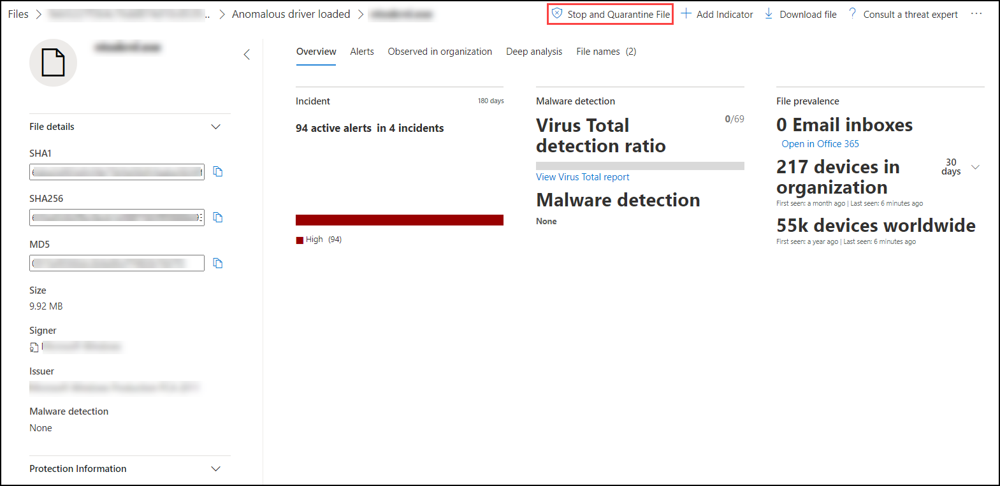

# <a name="take-response-actions-on-a-file"></a>Ergreifen von Reaktionen auf eine Datei

[!INCLUDE [Microsoft 365 Defender rebranding](../../includes/microsoft-defender.md)]


**Gilt für:**
- [Microsoft Defender für Endpunkt](https://go.microsoft.com/fwlink/?linkid=2154037)

[!include[Prerelease information](../../includes/prerelease.md)]

> Möchten Sie Defender für Endpunkt erfahren? [Registrieren Sie sich für eine kostenlose Testversion](https://www.microsoft.com/microsoft-365/windows/microsoft-defender-atp?ocid=docs-wdatp-responddile-abovefoldlink)

Reagieren Sie schnell auf erkannte Angriffe, indem Sie Dateien beenden und quarantäneten oder eine Datei blockieren. Nachdem Sie Maßnahmen für Dateien ergriffen haben, können Sie die Aktivitätsdetails im Info-Center überprüfen.

Antwortaktionen sind auf der detaillierten Profilseite einer Datei verfügbar. Sobald Sie sich auf dieser Seite befinden, können Sie zwischen den neuen und alten Seitenlayouts wechseln, indem Sie die **neue Dateiseite** umschalten. Der Rest dieses Artikels beschreibt das neuere Seitenlayout.

Antwortaktionen werden oben auf der Dateiseite ausgeführt und umfassen Folgendes:

- Beenden und Isolieren von Dateien
- Indikator hinzufügen
- Datei herunterladen
- Wenden Sie sich an einen Bedrohungsexperten
- Info-Center

Sie können auch Dateien für eine umfassende Analyse übermitteln, um die Datei in einer sicheren Cloud-Sandbox auszuführen. Wenn die Analyse abgeschlossen ist, erhalten Sie einen detaillierten Bericht, der Informationen über das Verhalten der Datei enthält. Sie können Dateien für die umfassende Analyse übermitteln und frühere Berichte lesen, indem Sie die Registerkarte **"Umfassende Analyse"** auswählen. Er befindet sich unterhalb der Dateiinformationskarten.

Einige Aktionen erfordern bestimmte Berechtigungen. In der folgenden Tabelle wird beschrieben, welche Aktionen bestimmte Berechtigungen für portierbare ausführbare Dateien (PE) und Nicht-PE-Dateien ausführen können:

| Berechtigung             | PE-Dateien | Nicht-PE-Dateien |
| :--------------------- | :------: | :----------: |
| Anzeigen von Daten              |     X    |       X      |
| Untersuchung von Warnungen   | &#x2611; |       X      |
| Grundlegende Live-Antwort    |     X    |       X      |
| Live-Antwort erweitert | &#x2611; |   &#x2611;   |

Weitere Informationen zu Rollen finden Sie unter [Erstellen und Verwalten von Rollen für die rollenbasierte Zugriffssteuerung.](user-roles.md)

## <a name="stop-and-quarantine-files-in-your-network"></a>Dateien in Ihrem Netzwerk beenden und unter Quarantäne stellen

Sie können einen Angriff in Ihrer Organisation enthalten, indem Sie den bösartigen Prozess stoppen und die Datei isolieren, in der sie beobachtet wurde.

> [!IMPORTANT]
> Sie können diese Aktion nur ausführen, wenn:
>
> - Das Gerät, auf dem Sie die Aktion ausführen, wird Windows 10, Version 1703 oder höher, ausgeführt.
> - Die Datei gehört nicht zu vertrauenswürdigen Herausgebern von Drittanbietern oder wird nicht von Microsoft signiert.
> - Microsoft Defender Antivirus müssen mindestens im passiven Modus ausgeführt werden. Weitere Informationen finden Sie unter [Microsoft Defender Antivirus Kompatibilität.](/windows/security/threat-protection/microsoft-defender-antivirus/microsoft-defender-antivirus-compatibility)

Die Aktion **"Beenden und Isolieren von Dateien"** umfasst das Beenden ausgeführter Prozesse, das Isolieren der Dateien und das Löschen persistenter Daten wie Registrierungsschlüssel.

Diese Aktion wird auf Geräten mit Windows 10 Version 1703 oder höher wirksam, auf denen die Datei in den letzten 30 Tagen beobachtet wurde.

> [!NOTE]
> Sie können die Datei jederzeit aus der Quarantäne wiederherstellen.

### <a name="stop-and-quarantine-files"></a>Beenden und Isolieren von Dateien

1. Wählen Sie die Datei aus, die Sie beenden und unter Quarantäne stellen möchten. Sie können eine Datei aus einer der folgenden Ansichten auswählen oder das Suchfeld verwenden:

   - **Warnungen –** Klicken Sie auf die entsprechenden Links aus der Beschreibung oder den Details in der Zeitachse des Warnungsartikels.
   - **Suchfeld** – Wählen Sie im Dropdownmenü die Option **"Datei"** aus, und geben Sie den Dateinamen ein.

   > [!NOTE]
   > Die Aktion zum Beenden und Isolieren von Dateien ist auf maximal 1.000 Geräte beschränkt. Informationen zum Beenden einer Datei auf einer größeren Anzahl von Geräten finden Sie unter Hinzufügen eines [Indikators zum Blockieren oder Zulassen](#add-indicator-to-block-or-allow-a-file)von Dateien.

2. Wechseln Sie zur oberen Leiste, und wählen Sie **"Beenden" und "Quarantänedatei"** aus.

   

3. Geben Sie einen Grund an, und wählen Sie dann **"Bestätigen"** aus.

   

   Im Info-Center werden die Übermittlungsinformationen angezeigt:
   
   

   - **Übermittlungszeit** – Zeigt an, wann die Aktion übermittelt wurde.
   - **Erfolg** – Zeigt die Anzahl der Geräte an, auf denen die Datei angehalten und isoliert wurde.
   - **Fehlgeschlagen** – Zeigt die Anzahl der Geräte an, auf denen die Aktion fehlgeschlagen ist, sowie Details zu dem Fehler.
   - **Ausstehend** – Zeigt die Anzahl der Geräte an, auf denen die Datei noch beendet und unter Quarantäne gestellt werden muss. Dies kann einige Zeit in Fällen dauern, in denen das Gerät offline oder nicht mit dem Netzwerk verbunden ist.

4. Wählen Sie einen der Statusindikatoren aus, um weitere Informationen zu der Aktion anzuzeigen. Wählen Sie beispielsweise **"Fehlgeschlagen"** aus, um zu sehen, wo die Aktion fehlgeschlagen ist.

**Benachrichtigung für Gerätebenutzer:**</br>
Wenn die Datei von einem Gerät entfernt wird, wird die folgende Benachrichtigung angezeigt:


In der Gerätezeitachse wird ein neues Ereignis für jedes Gerät hinzugefügt, auf dem eine Datei angehalten und isoliert wurde.

Es wird eine Warnung angezeigt, bevor die Aktion für Dateien implementiert wird, die in der gesamten Organisation häufig verwendet werden. Es soll überprüft werden, ob der Vorgang beabsichtigt ist.

## <a name="restore-file-from-quarantine"></a>Datei aus der Quarantäne wiederherstellen

Sie können ein Rollback ausführen und eine Datei aus der Quarantäne entfernen, wenn Sie nach einer Untersuchung festgestellt haben, dass sie sauber ist. Führen Sie den folgenden Befehl auf jedem Gerät aus, auf dem die Datei unter Quarantäne gestellt wurde.

1. Öffnen Sie eine Eingabeaufforderung mit erhöhten Rechten auf dem Gerät:

   1. Wechseln Sie zu **Start**, und geben Sie _cmd_ ein.

   1. Klicken Sie mit der rechten Maustaste auf **die Eingabeaufforderung,** und wählen Sie **"Als Administrator ausführen"** aus.

2. Geben Sie den folgenden Befehl ein, und drücken Sie die **EINGABETASTE:**

   ```console
   “%ProgramFiles%\Windows Defender\MpCmdRun.exe” –Restore –Name EUS:Win32/CustomEnterpriseBlock –All
   ```

   > [!NOTE]
   > In einigen Szenarien kann **der ThreatName** folgendermaßen aussehen: EUS:Win32/CustomEnterpriseBlock!cl.
   >
   > Defender für Endpunkt stellt alle benutzerdefinierten blockierten Dateien wieder her, die in den letzten 30 Tagen auf diesem Gerät unter Quarantäne gestellt wurden.

> [!IMPORTANT]
> Eine Datei, die als potenzielle Netzwerkgefährdung unter Quarantäne gestellt wurde, kann möglicherweise nicht wiederhergestellt werden. Wenn ein Benutzer versucht, die Datei nach der Quarantäne wiederherzustellen, kann auf diese Datei möglicherweise nicht zugegriffen werden. Dies kann darauf zurückzuführen sein, dass das System nicht mehr über Netzwerkanmeldeinformationen für den Zugriff auf die Datei verfügt. In der Regel ist dies ein Ergebnis einer temporären Anmeldung bei einem System oder freigegebenen Ordner, und die Zugriffstoken sind abgelaufen.

## <a name="download-or-collect-file"></a>Datei herunterladen oder sammeln

Wenn Sie die Datei aus den Antwortaktionen **herunterladen** auswählen, können Sie ein lokales, kennwortgeschütztes .zip Archiv herunterladen, das Ihre Datei enthält. Es wird ein Flyout angezeigt, in dem Sie einen Grund für das Herunterladen der Datei aufzeichnen und ein Kennwort festlegen können.

Standardmäßig können Sie keine Dateien herunterladen, die sich in Quarantäne befinden.


### <a name="collect-files"></a>Sammeln von Dateien

Wenn eine Datei nicht bereits von Microsoft Defender für Endpunkt gespeichert wurde, können Sie sie nicht herunterladen. Stattdessen wird die Schaltfläche **"Datei sammeln"** am selben Speicherort angezeigt. Wenn eine Datei in der Organisation in den letzten 30 Tagen nicht angezeigt wurde, wird die **Sammlungsdatei** deaktiviert.
> [!Important]
> Eine Datei, die als potenzielle Netzwerkgefährdung unter Quarantäne gestellt wurde, kann möglicherweise nicht wiederhergestellt werden. Wenn ein Benutzer versucht, die Datei nach der Quarantäne wiederherzustellen, kann auf diese Datei möglicherweise nicht zugegriffen werden. Dies kann darauf zurückzuführen sein, dass das System nicht mehr über Netzwerkanmeldeinformationen für den Zugriff auf die Datei verfügt. In der Regel ist dies ein Ergebnis einer temporären Anmeldung bei einem System oder freigegebenen Ordner, und die Zugriffstoken sind abgelaufen.

## <a name="add-indicator-to-block-or-allow-a-file"></a>Hinzufügen eines Indikators zum Blockieren oder Zulassen einer Datei

Verhindern Sie die weitere Verbreitung eines Angriffs in Ihrer Organisation, indem Sie potenziell schädliche Dateien oder verdächtige Schadsoftware verbieten. Wenn Sie eine potenziell schädliche portierbare ausführbare Datei (PE) kennen, können Sie sie blockieren. Dieser Vorgang verhindert, dass er auf Geräten in Ihrer Organisation gelesen, geschrieben oder ausgeführt wird.

> [!IMPORTANT]
>
> - Dieses Feature ist verfügbar, wenn Ihre Organisation Microsoft Defender Antivirus verwendet und der über die Cloud bereitgestellte Schutz aktiviert ist. Weitere Informationen finden Sie unter [Verwalten des über die Cloud bereitgestellten Schutzes.](/windows/security/threat-protection/microsoft-defender-antivirus/deploy-manage-report-microsoft-defender-antivirus)
>
> - Die Antischadsoftware-Clientversion muss 4.18.1901.x oder höher sein.
> - Dieses Feature soll verhindern, dass verdächtige Schadsoftware (oder potenziell schädliche Dateien) aus dem Web heruntergeladen wird. Derzeit werden portierbare ausführbare Dateien (PE) unterstützt, einschließlich _.exe-_ und _.dlldateien._ Die Abdeckung wird im Laufe der Zeit erweitert.
> - Diese Antwortaktion ist für Geräte mit Windows 10 Version 1703 oder höher verfügbar.
> - Die Funktion "Zulassen" oder "Blockieren" kann für Dateien nicht ausgeführt werden, wenn die Klassifizierung der Datei im Cache des Geräts vor der Zulassungs- oder Blockierungsaktion vorhanden ist.

> [!NOTE]
> Die PE-Datei muss sich in der Gerätezeitachse befinden, damit Sie diese Aktion ausführen können.
>
> Zwischen dem Zeitpunkt, zu dem die Aktion ausgeführt wird, und dem Blockieren der tatsächlichen Datei kann es einige Minuten Wartezeit geben.

### <a name="enable-the-block-file-feature"></a>Aktivieren des Features "Datei blockieren"

Um mit dem Blockieren von Dateien zu beginnen, müssen Sie zuerst [das Feature **"Blockieren" oder "Zulassen"**](advanced-features.md) in Einstellungen aktivieren.
### <a name="allow-or-block-file"></a>Datei zulassen oder blockieren

Wenn Sie einen Indikatorhash für eine Datei hinzufügen, können Sie eine Warnung auslösen und die Datei blockieren, wenn ein Gerät in Ihrer Organisation versucht, sie auszuführen.

Dateien, die automatisch durch einen Indikator blockiert werden, werden nicht im Info-Center der Datei angezeigt, aber die Warnungen werden weiterhin in der Warnungswarteschlange angezeigt.

Weitere Informationen zum Blockieren und Auslösen von Warnungen für Dateien finden Sie unter [Verwalten von Indikatoren.](manage-indicators.md)

Um das Blockieren einer Datei zu beenden, entfernen Sie den Indikator. Sie können dies über die Aktion **"Indikator bearbeiten"** auf der Profilseite der Datei tun. Diese Aktion wird an derselben Position wie die Aktion **"Indikator hinzufügen"** angezeigt, bevor Sie den Indikator hinzugefügt haben.

Sie können Indikatoren auch auf der **Einstellungen** Seite unter   >  **Regelindikatoren** bearbeiten. Indikatoren werden in diesem Bereich anhand des Hash ihrer Datei aufgelistet.

## <a name="consult-a-threat-expert"></a>Wenden Sie sich an einen Bedrohungsexperten

Wenden Sie sich an einen Microsoft-Bedrohungsexperten, um weitere Einblicke auf ein potenziell kompromittiertes Gerät oder bereits gefährdete Geräte zu erhalten. Microsoft-Bedrohungsexperten werden direkt innerhalb der Microsoft Defender Security Center für eine zeitnahe und genaue Antwort eingebunden. Experten bieten Einblicke auf ein potenziell kompromittiertes Gerät und helfen Ihnen, komplexe Bedrohungen und Benachrichtigungen über gezielte Angriffe zu verstehen. Sie können auch Informationen zu warnungen oder einem Kontext für die Bedrohungserkennung bereitstellen, der auf Ihrem Portaldashboard angezeigt wird.

Weitere Informationen finden [Sie unter "Microsoft Threat Expert".](/microsoft-365/security/defender-endpoint/configure-microsoft-threat-experts#consult-a-microsoft-threat-expert-about-suspicious-cybersecurity-activities-in-your-organization)

## <a name="check-activity-details-in-action-center"></a>Überprüfen von Aktivitätsdetails im Aktionscenter

Das **Info-Center** enthält Informationen zu Aktionen, die auf einem Gerät oder einer Datei ausgeführt wurden. Sie können die folgenden Details anzeigen:

- Untersuchungspaketsammlung
- Antivirus-Scan
- App-Einschränkung
- Geräteisolation

Alle anderen verwandten Details werden ebenfalls angezeigt, z. B. Übermittlungsdatum/-uhrzeit, Übermitteln des Benutzers und ob die Aktion erfolgreich war oder fehlgeschlagen ist.


## <a name="deep-analysis"></a>Tiefe Analyse

Untersuchungen zur Cybersicherheit werden in der Regel durch eine Warnung ausgelöst. Warnungen beziehen sich auf eine oder mehrere beobachtete Dateien, die häufig neu oder unbekannt sind. Wenn Sie eine Datei auswählen, gelangen Sie zur Dateiansicht, in der Sie die Metadaten der Datei sehen können. Um die Daten im Zusammenhang mit der Datei zu erweitern, können Sie die Datei für eine umfassende Analyse übermitteln.

Das Feature "Umfassende Analyse" führt eine Datei in einer sicheren, vollständig instrumentierten Cloudumgebung aus. Umfassende Analyseergebnisse zeigen die Aktivitäten der Datei, beobachtete Verhaltensweisen und zugehörige Artefakte, z. B. verworfene Dateien, Registrierungsänderungen und Kommunikation mit IP-Adressen.
Die umfassende Analyse unterstützt derzeit die umfassende Analyse portierbarer ausführbarer Dateien (einschließlich _.exe_ und _.dll)._

Die umfassende Analyse einer Datei dauert mehrere Minuten. Sobald die Dateianalyse abgeschlossen ist, wird die Registerkarte "Umfassende Analyse" aktualisiert, um eine Zusammenfassung und das Datum und die Uhrzeit der neuesten verfügbaren Ergebnisse anzuzeigen.

Die umfassende Analysezusammenfassung enthält eine Liste der *beobachteten Verhaltensweisen,* von denen einige auf böswillige Aktivitäten und *Observables* hinweisen können, einschließlich kontaktierter IPs und dateien, die auf dem Datenträger erstellt wurden. Wenn nichts gefunden wurde, wird in diesen Abschnitten eine kurze Meldung angezeigt.

Die Ergebnisse einer umfassenden Analyse werden mit der Bedrohungserkennung abgeglichen, und alle Übereinstimmungen generieren entsprechende Warnungen.

Verwenden Sie die umfassende Analysefunktion, um die Details einer Datei zu untersuchen, in der Regel während einer Untersuchung einer Warnung oder aus einem anderen Grund, aus dem Sie bösartiges Verhalten vermuten. Dieses Feature ist auf der Registerkarte **"Umfassende Analyse"** auf der Profilseite der Datei verfügbar.<br/>
<br/>

> [!VIDEO https://www.microsoft.com/en-us/videoplayer/embed/RE4aAYy?rel=0]

**Submit for deep analysis** is enabled when the file is available in the Defender for Endpoint backend sample collection, or if it was observed on a Windows 10 device that supports submitting to deep analysis.

> [!NOTE]
> Nur Dateien aus Windows 10 können automatisch erfasst werden.

Sie können auch ein Beispiel über das [Microsoft Security Center-Portal](https://www.microsoft.com/security/portal/submission/submit.aspx) übermitteln, wenn die Datei auf einem Windows 10 Gerät nicht beobachtet wurde, und warten, bis die Schaltfläche **"Submit for deep analysis"** verfügbar ist.

> [!NOTE]
> Aufgrund von Back-End-Verarbeitungsflüssen im Microsoft Security Center-Portal kann es zwischen der Dateiübermittlung und der Verfügbarkeit des umfassenden Analysefeatures in Defender für Endpunkt eine Latenz von bis zu 10 Minuten geben.

### <a name="submit-files-for-deep-analysis"></a>Übermitteln von Dateien für eine umfassende Analyse

1. Wählen Sie die Datei aus, die Sie für eine umfassende Analyse übermitteln möchten. Sie können eine Datei aus einer der folgenden Ansichten auswählen oder durchsuchen:

    - **Warnungen** – Wählen Sie die Dateilinks aus der **Beschreibung** oder **Details** in der Zeitachse des Warnungsartikels aus.
    - **Geräteliste** – Wählen Sie die Dateilinks aus dem Abschnitt **"Beschreibung"** oder **"Details"** im Abschnitt **"Gerät in Organisation"** aus.
    - **Suchfeld** – Wählen Sie im Dropdownmenü die Option **"Datei"** aus, und geben Sie den Dateinamen ein.

2. Wählen Sie auf der Registerkarte **"Umfassende Analyse"** der Dateiansicht **"Absenden"** aus.

   

   > [!NOTE]
   > Es werden nur PE-Dateien unterstützt, einschließlich _.exe-_ und _.dlldateien._

   Eine Statusanzeige wird angezeigt und enthält Informationen zu den verschiedenen Phasen der Analyse. Sie können den Bericht dann anzeigen, wenn die Analyse abgeschlossen ist.

> [!NOTE]
> Je nach Geräteverfügbarkeit kann die Dauer der Beispielsammlung variieren. Es gibt ein 3-Stunden-Timeout für die Beispielsammlung. Die Auflistung schlägt fehl, und der Vorgang wird abgebrochen, wenn zu diesem Zeitpunkt keine Online-Windows 10 Geräteberichterstellung vorhanden ist. Sie können Dateien zur umfassenden Analyse erneut übermitteln, um neue Daten zu der Datei zu erhalten.

### <a name="view-deep-analysis-reports"></a>Anzeigen umfassender Analyseberichte

Sehen Sie sich den bereitgestellten umfassenden Analysebericht an, um ausführlichere Einblicke in die von Ihnen übermittelte Datei zu erhalten. Dieses Feature ist im Kontext der Dateiansicht verfügbar.

Sie können den umfassenden Bericht anzeigen, der Details in den folgenden Abschnitten bereitstellt:

- Behaviors
- Observables

Die bereitgestellten Details können Ihnen dabei helfen, zu untersuchen, ob Es Hinweise auf einen potenziellen Angriff gibt.

1. Wählen Sie die Datei aus, die Sie für eine umfassende Analyse übermittelt haben.
2. Wählen Sie die Registerkarte **"Umfassende Analyse"** aus. Wenn vorherige Berichte vorhanden sind, wird die Berichtszusammenfassung auf dieser Registerkarte angezeigt.

    

#### <a name="troubleshoot-deep-analysis"></a>Problembehandlung bei der umfassenden Analyse

Wenn beim Versuch, eine Datei zu übermitteln, ein Problem auftritt, führen Sie jeden der folgenden Schritte zur Problembehandlung aus.

1. Stellen Sie sicher, dass es sich bei der betreffenden Datei um eine PE-Datei handelt. PE-Dateien verfügen in der Regel _über.exe_ oder _.dll_ Erweiterungen (ausführbare Programme oder Anwendungen).

2. Stellen Sie sicher, dass der Dienst Zugriff auf die Datei hat, dass er noch vorhanden ist und nicht beschädigt oder geändert wurde.

3. Warten Sie kurz, und versuchen Sie erneut, die Datei zu übermitteln. Die Warteschleife ist möglicherweise voll, oder es ist ein temporärer Verbindungs- oder Kommunikationsfehler aufgetreten.

4. Wenn die Beispielsammlungsrichtlinie nicht konfiguriert ist, ist das Standardverhalten das Zulassen der Beispielsammlung. Wenn sie konfiguriert ist, überprüfen Sie, ob die Richtlinieneinstellung die Beispielsammlung zulässt, bevor Sie die Datei erneut übermitteln. Wenn die Beispielsammlung konfiguriert ist, überprüfen Sie den folgenden Registrierungswert:

    ```console
    Path: HKLM\SOFTWARE\Policies\Microsoft\Windows Advanced Threat Protection
    Name: AllowSampleCollection
    Type: DWORD
    Hexadecimal value :
      Value = 0 – block sample collection
      Value = 1 – allow sample collection
    ```

1. Ändern Sie die Organisationseinheit über die Gruppenrichtlinie. Weitere Informationen finden Sie unter ["Konfigurieren mit Gruppenrichtlinie".](configure-endpoints-gp.md)

1. Wenn das Problem durch diese Schritte nicht behoben wird, wenden Sie sich an [winatp@microsoft.com](mailto:winatp@microsoft.com).

## <a name="related-topics"></a>Verwandte Themen

- [Ergreifen von Reaktionen auf einem Gerät](respond-machine-alerts.md)
- [Untersuchen von Dateien](investigate-files.md)
