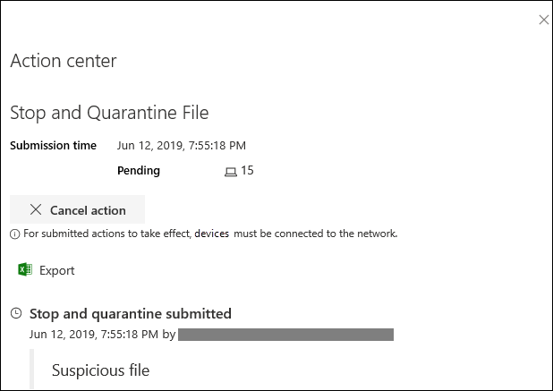

# <a name="take-response-actions-on-a-file"></a><span data-ttu-id="7cf35-104">Ergreifen von Reaktionen auf eine Datei</span><span class="sxs-lookup"><span data-stu-id="7cf35-104">Take response actions on a file</span></span>

[!INCLUDE [Microsoft 365 Defender rebranding](../../includes/microsoft-defender.md)]


<span data-ttu-id="7cf35-105">**Gilt für:**</span><span class="sxs-lookup"><span data-stu-id="7cf35-105">**Applies to:**</span></span>
- [<span data-ttu-id="7cf35-106">Microsoft Defender für Endpunkt</span><span class="sxs-lookup"><span data-stu-id="7cf35-106">Microsoft Defender for Endpoint</span></span>](https://go.microsoft.com/fwlink/?linkid=2154037)

[!include[Prerelease information](../../includes/prerelease.md)]

> <span data-ttu-id="7cf35-107">Möchten Sie Defender for Endpoint erleben?</span><span class="sxs-lookup"><span data-stu-id="7cf35-107">Want to experience Defender for Endpoint?</span></span> [<span data-ttu-id="7cf35-108">Registrieren Sie sich für eine kostenlose Testversion.</span><span class="sxs-lookup"><span data-stu-id="7cf35-108">Sign up for a free trial.</span></span>](https://www.microsoft.com/microsoft-365/windows/microsoft-defender-atp?ocid=docs-wdatp-responddile-abovefoldlink)

<span data-ttu-id="7cf35-109">Reagieren Sie schnell auf erkannte Angriffe, indem Sie Dateien beenden und quarantinieren oder eine Datei blockieren.</span><span class="sxs-lookup"><span data-stu-id="7cf35-109">Quickly respond to detected attacks by stopping and quarantining files or blocking a file.</span></span> <span data-ttu-id="7cf35-110">Nach dem Ergreifen von Aktionen für Dateien können Sie die Aktivitätsdetails im Aktionscenter überprüfen.</span><span class="sxs-lookup"><span data-stu-id="7cf35-110">After taking action on files, you can check activity details in the Action center.</span></span>

<span data-ttu-id="7cf35-111">Reaktionsaktionen sind auf der detaillierten Profilseite einer Datei verfügbar.</span><span class="sxs-lookup"><span data-stu-id="7cf35-111">Response actions are available on a file's detailed profile page.</span></span> <span data-ttu-id="7cf35-112">Sobald Sie auf dieser Seite sind, können Sie zwischen den neuen und alten Seitenlayouts wechseln, indem Sie die neue **Dateiseite umschalten.**</span><span class="sxs-lookup"><span data-stu-id="7cf35-112">Once on this page, you can switch between the new and old page layouts by toggling **new File page**.</span></span> <span data-ttu-id="7cf35-113">Der Rest dieses Artikels beschreibt das neuere Seitenlayout.</span><span class="sxs-lookup"><span data-stu-id="7cf35-113">The rest of this article describes the newer page layout.</span></span>

<span data-ttu-id="7cf35-114">Reaktionsaktionen werden am oberen Rand der Dateiseite ausgeführt und umfassen Folgendes:</span><span class="sxs-lookup"><span data-stu-id="7cf35-114">Response actions run along the top of the file page, and include:</span></span>

- <span data-ttu-id="7cf35-115">Datei zum Beenden und Isolieren</span><span class="sxs-lookup"><span data-stu-id="7cf35-115">Stop and Quarantine File</span></span>
- <span data-ttu-id="7cf35-116">Add Indicator</span><span class="sxs-lookup"><span data-stu-id="7cf35-116">Add Indicator</span></span>
- <span data-ttu-id="7cf35-117">Datei herunterladen</span><span class="sxs-lookup"><span data-stu-id="7cf35-117">Download file</span></span>
- <span data-ttu-id="7cf35-118">Wenden Sie sich an einen Bedrohungsexperten</span><span class="sxs-lookup"><span data-stu-id="7cf35-118">Consult a threat expert</span></span>
- <span data-ttu-id="7cf35-119">Info-Center</span><span class="sxs-lookup"><span data-stu-id="7cf35-119">Action center</span></span>

<span data-ttu-id="7cf35-120">Sie können auch Dateien zur tiefen Analyse übermitteln, um die Datei in einem sicheren Cloud-Sandkasten ausführen zu können.</span><span class="sxs-lookup"><span data-stu-id="7cf35-120">You can also submit files for deep analysis, to run the file in a secure cloud sandbox.</span></span> <span data-ttu-id="7cf35-121">Nach Abschluss der Analyse erhalten Sie einen detaillierten Bericht, der Informationen zum Verhalten der Datei enthält.</span><span class="sxs-lookup"><span data-stu-id="7cf35-121">When the analysis is complete, you'll get a detailed report that provides information about the behavior of the file.</span></span> <span data-ttu-id="7cf35-122">Sie können Dateien zur tiefen Analyse übermitteln und vergangene Berichte lesen, indem Sie die Registerkarte **Tiefe Analyse** auswählen. Sie befindet sich unterhalb der Dateiinformationskarten.</span><span class="sxs-lookup"><span data-stu-id="7cf35-122">You can submit files for deep analysis and read past reports by selecting the **Deep analysis** tab. It's located below the file information cards.</span></span>

<span data-ttu-id="7cf35-123">Einige Aktionen erfordern bestimmte Berechtigungen.</span><span class="sxs-lookup"><span data-stu-id="7cf35-123">Some actions require certain permissions.</span></span> <span data-ttu-id="7cf35-124">In der folgenden Tabelle wird beschrieben, welche Aktionen bestimmte Berechtigungen für portable ausführbare Dateien (PE) und Nicht-PE-Dateien ausführen können:</span><span class="sxs-lookup"><span data-stu-id="7cf35-124">The following table describes what action certain permissions can take on portable executable (PE) and non-PE files:</span></span>

| <span data-ttu-id="7cf35-125">Berechtigung</span><span class="sxs-lookup"><span data-stu-id="7cf35-125">Permission</span></span>             | <span data-ttu-id="7cf35-126">PE-Dateien</span><span class="sxs-lookup"><span data-stu-id="7cf35-126">PE files</span></span> | <span data-ttu-id="7cf35-127">Nicht-PE-Dateien</span><span class="sxs-lookup"><span data-stu-id="7cf35-127">Non-PE files</span></span> |
| :--------------------- | :------: | :----------: |
| <span data-ttu-id="7cf35-128">Anzeigen von Daten</span><span class="sxs-lookup"><span data-stu-id="7cf35-128">View data</span></span>              |     <span data-ttu-id="7cf35-129">X</span><span class="sxs-lookup"><span data-stu-id="7cf35-129">X</span></span>    |       <span data-ttu-id="7cf35-130">X</span><span class="sxs-lookup"><span data-stu-id="7cf35-130">X</span></span>      |
| <span data-ttu-id="7cf35-131">Warnungsuntersuchung</span><span class="sxs-lookup"><span data-stu-id="7cf35-131">Alerts investigation</span></span>   | <span data-ttu-id="7cf35-132">&#x2611;</span><span class="sxs-lookup"><span data-stu-id="7cf35-132">&#x2611;</span></span> |       <span data-ttu-id="7cf35-133">X</span><span class="sxs-lookup"><span data-stu-id="7cf35-133">X</span></span>      |
| <span data-ttu-id="7cf35-134">Grundlegende Liveantwort</span><span class="sxs-lookup"><span data-stu-id="7cf35-134">Live response basic</span></span>    |     <span data-ttu-id="7cf35-135">X</span><span class="sxs-lookup"><span data-stu-id="7cf35-135">X</span></span>    |       <span data-ttu-id="7cf35-136">X</span><span class="sxs-lookup"><span data-stu-id="7cf35-136">X</span></span>      |
| <span data-ttu-id="7cf35-137">Erweiterte Liveantwort</span><span class="sxs-lookup"><span data-stu-id="7cf35-137">Live response advanced</span></span> | <span data-ttu-id="7cf35-138">&#x2611;</span><span class="sxs-lookup"><span data-stu-id="7cf35-138">&#x2611;</span></span> |   <span data-ttu-id="7cf35-139">&#x2611;</span><span class="sxs-lookup"><span data-stu-id="7cf35-139">&#x2611;</span></span>   |

<span data-ttu-id="7cf35-140">Weitere Informationen zu Rollen finden Sie unter Erstellen und Verwalten von [Rollen für die rollenbasierte Zugriffssteuerung](user-roles.md).</span><span class="sxs-lookup"><span data-stu-id="7cf35-140">For more information on roles, see [Create and manage roles for role-based access control](user-roles.md).</span></span>

## <a name="stop-and-quarantine-files-in-your-network"></a><span data-ttu-id="7cf35-141">Dateien in Ihrem Netzwerk beenden und unter Quarantäne stellen</span><span class="sxs-lookup"><span data-stu-id="7cf35-141">Stop and quarantine files in your network</span></span>

<span data-ttu-id="7cf35-142">Sie können einen Angriff in Ihrer Organisation verhindern, indem Sie den bösartigen Prozess beenden und die Datei quarantinieren, in der sie beobachtet wurde.</span><span class="sxs-lookup"><span data-stu-id="7cf35-142">You can contain an attack in your organization by stopping the malicious process and quarantining the file where it was observed.</span></span>

> [!IMPORTANT]
> <span data-ttu-id="7cf35-143">Sie können diese Aktion nur dann ergreifen, wenn:</span><span class="sxs-lookup"><span data-stu-id="7cf35-143">You can only take this action if:</span></span>
>
> - <span data-ttu-id="7cf35-144">Auf dem Gerät, auf dem Sie die Aktion ausführen, wird Windows 10 Version 1703 oder höher ausgeführt.</span><span class="sxs-lookup"><span data-stu-id="7cf35-144">The device you're taking the action on is running Windows 10, version 1703 or later</span></span>
> - <span data-ttu-id="7cf35-145">Die Datei gehört nicht zu vertrauenswürdigen Herausgebern von Drittanbietern oder nicht von Microsoft signiert</span><span class="sxs-lookup"><span data-stu-id="7cf35-145">The file does not belong to trusted third-party publishers or not signed by Microsoft</span></span>
> - <span data-ttu-id="7cf35-146">Microsoft Defender Antivirus muss mindestens im passiven Modus ausgeführt werden.</span><span class="sxs-lookup"><span data-stu-id="7cf35-146">Microsoft Defender Antivirus must at least be running on Passive mode.</span></span> <span data-ttu-id="7cf35-147">Weitere Informationen finden Sie unter [Microsoft Defender Antivirus Kompatibilität](https://docs.microsoft.com/windows/security/threat-protection/microsoft-defender-antivirus/microsoft-defender-antivirus-compatibility).</span><span class="sxs-lookup"><span data-stu-id="7cf35-147">For more information, see [Microsoft Defender Antivirus compatibility](https://docs.microsoft.com/windows/security/threat-protection/microsoft-defender-antivirus/microsoft-defender-antivirus-compatibility).</span></span>

<span data-ttu-id="7cf35-148">Die **Aktion Datei beenden und isolieren** umfasst das Beenden ausgeführter Prozesse, das Quarantinieren der Dateien und das Löschen von beständigen Daten wie Registrierungsschlüsseln.</span><span class="sxs-lookup"><span data-stu-id="7cf35-148">The **Stop and Quarantine File** action includes stopping running processes, quarantining the files, and deleting persistent data such as registry keys.</span></span>

<span data-ttu-id="7cf35-149">Diese Aktion wird auf Geräten mit Windows 10 Version 1703 oder höher wirksam, auf denen die Datei in den letzten 30 Tagen beobachtet wurde.</span><span class="sxs-lookup"><span data-stu-id="7cf35-149">This action takes effect on devices with Windows 10, version 1703 or later, where the file was observed in the last 30 days.</span></span>

> [!NOTE]
> <span data-ttu-id="7cf35-150">Sie können die Datei jederzeit aus der Quarantäne wiederherstellen.</span><span class="sxs-lookup"><span data-stu-id="7cf35-150">You’ll be able to restore the file from quarantine at any time.</span></span>

### <a name="stop-and-quarantine-files"></a><span data-ttu-id="7cf35-151">Beenden und Isolieren von Dateien</span><span class="sxs-lookup"><span data-stu-id="7cf35-151">Stop and quarantine files</span></span>

1. <span data-ttu-id="7cf35-152">Wählen Sie die Datei aus, die Sie beenden und isolieren möchten.</span><span class="sxs-lookup"><span data-stu-id="7cf35-152">Select the file you want to stop and quarantine.</span></span> <span data-ttu-id="7cf35-153">Sie können eine Datei aus einer der folgenden Ansichten auswählen oder das Feld Suchen verwenden:</span><span class="sxs-lookup"><span data-stu-id="7cf35-153">You can select a file from any of the following views or use the Search box:</span></span>

   - <span data-ttu-id="7cf35-154">**Warnungen** – Klicken Sie in der Artefaktzeitachse auf die entsprechenden Links in der Beschreibung oder den Details.</span><span class="sxs-lookup"><span data-stu-id="7cf35-154">**Alerts** - click the corresponding links from the Description or Details in the Artifact timeline</span></span>
   - <span data-ttu-id="7cf35-155">**Suchfeld** : Wählen **Sie im** Dropdownmenü Datei aus, und geben Sie den Dateinamen ein.</span><span class="sxs-lookup"><span data-stu-id="7cf35-155">**Search box** - select **File** from the drop–down menu and enter the file name</span></span>

   > [!NOTE]
   > <span data-ttu-id="7cf35-156">Die Aktion "Beenden und Isolieren" ist auf maximal 1.000 Geräte beschränkt.</span><span class="sxs-lookup"><span data-stu-id="7cf35-156">The stop and quarantine file action is limited to a maximum of 1000 devices.</span></span> <span data-ttu-id="7cf35-157">Informationen zum Beenden einer Datei auf einer größeren Anzahl von Geräten finden Sie unter [Add indicator to block or allow file](#add-indicator-to-block-or-allow-a-file).</span><span class="sxs-lookup"><span data-stu-id="7cf35-157">To stop a file on a larger number of devices, see [Add indicator to block or allow file](#add-indicator-to-block-or-allow-a-file).</span></span>

2. <span data-ttu-id="7cf35-158">Wechseln Sie zur oberen Leiste, und wählen **Sie Stop and Quarantine File aus.**</span><span class="sxs-lookup"><span data-stu-id="7cf35-158">Go to the top bar and select **Stop and Quarantine File**.</span></span>

   

3. <span data-ttu-id="7cf35-160">Geben Sie einen Grund an, und wählen Sie **dann Bestätigen aus.**</span><span class="sxs-lookup"><span data-stu-id="7cf35-160">Specify a reason, then select **Confirm**.</span></span>

   

   <span data-ttu-id="7cf35-162">Das Aktionscenter zeigt die Übermittlungsinformationen an:</span><span class="sxs-lookup"><span data-stu-id="7cf35-162">The Action center shows the submission information:</span></span>
   
   

   - <span data-ttu-id="7cf35-164">**Übermittlungszeit** – Zeigt an, wann die Aktion übermittelt wurde.</span><span class="sxs-lookup"><span data-stu-id="7cf35-164">**Submission time** - Shows when the action was submitted.</span></span>
   - <span data-ttu-id="7cf35-165">**Erfolg** – Zeigt die Anzahl der Geräte an, auf denen die Datei beendet und unter Quarantäne gestellt wurde.</span><span class="sxs-lookup"><span data-stu-id="7cf35-165">**Success** - Shows the number of devices where the file has been stopped and quarantined.</span></span>
   - <span data-ttu-id="7cf35-166">**Fehler** – Zeigt die Anzahl der Geräte an, auf denen die Aktion fehlgeschlagen ist, und Details zu dem Fehler.</span><span class="sxs-lookup"><span data-stu-id="7cf35-166">**Failed** - Shows the number of devices where the action failed and details about the failure.</span></span>
   - <span data-ttu-id="7cf35-167">**Ausstehend** – Zeigt die Anzahl der Geräte an, auf denen die Datei noch beendet und unter Quarantäne gestellt werden muss.</span><span class="sxs-lookup"><span data-stu-id="7cf35-167">**Pending** - Shows the number of devices where the file is yet to be stopped and quarantined from.</span></span> <span data-ttu-id="7cf35-168">Dies kann für Fälle dauern, in denen das Gerät offline ist oder nicht mit dem Netzwerk verbunden ist.</span><span class="sxs-lookup"><span data-stu-id="7cf35-168">This can take time for cases when the device is offline or not connected to the network.</span></span>

4. <span data-ttu-id="7cf35-169">Wählen Sie einen der Statusindikatoren aus, um weitere Informationen zur Aktion anzeigen zu können.</span><span class="sxs-lookup"><span data-stu-id="7cf35-169">Select any of the status indicators to view more information about the action.</span></span> <span data-ttu-id="7cf35-170">Wählen Sie beispielsweise **Fehler aus,** um zu sehen, wo die Aktion fehlgeschlagen ist.</span><span class="sxs-lookup"><span data-stu-id="7cf35-170">For example, select **Failed** to see where the action failed.</span></span>

<span data-ttu-id="7cf35-171">**Benachrichtigung für Gerätebenutzer:**</span><span class="sxs-lookup"><span data-stu-id="7cf35-171">**Notification on device user**:</span></span></br>
<span data-ttu-id="7cf35-172">Wenn die Datei von einem Gerät entfernt wird, wird die folgende Benachrichtigung angezeigt:</span><span class="sxs-lookup"><span data-stu-id="7cf35-172">When the file is being removed from a device, the following notification is shown:</span></span>


<span data-ttu-id="7cf35-174">Auf der Gerätezeitachse wird für jedes Gerät, auf dem eine Datei beendet und isoliert wurde, ein neues Ereignis hinzugefügt.</span><span class="sxs-lookup"><span data-stu-id="7cf35-174">In the device timeline, a new event is added for each device where a file was stopped and quarantined.</span></span>

<span data-ttu-id="7cf35-175">Es wird eine Warnung angezeigt, bevor die Aktion für Dateien implementiert wird, die in einer Organisation weit verbreitet sind.</span><span class="sxs-lookup"><span data-stu-id="7cf35-175">A warning is shown before the action is implemented for files widely used throughout an organization.</span></span> <span data-ttu-id="7cf35-176">Es wird überprüft, ob der Vorgang beabsichtigt ist.</span><span class="sxs-lookup"><span data-stu-id="7cf35-176">It's to validate that the operation is intended.</span></span>

## <a name="restore-file-from-quarantine"></a><span data-ttu-id="7cf35-177">Datei aus der Quarantäne wiederherstellen</span><span class="sxs-lookup"><span data-stu-id="7cf35-177">Restore file from quarantine</span></span>

<span data-ttu-id="7cf35-178">Sie können ein Rollback für eine Datei aus der Quarantäne erstellen und entfernen, wenn Sie nach einer Untersuchung festgestellt haben, dass sie sauber ist.</span><span class="sxs-lookup"><span data-stu-id="7cf35-178">You can roll back and remove a file from quarantine if you’ve determined that it’s clean after an investigation.</span></span> <span data-ttu-id="7cf35-179">Führen Sie auf jedem Gerät, auf dem die Datei isoliert wurde, den folgenden Befehl aus.</span><span class="sxs-lookup"><span data-stu-id="7cf35-179">Run the following command on each device where the file was quarantined.</span></span>

1. <span data-ttu-id="7cf35-180">Öffnen Sie eine Eingabeaufforderung mit erhöhten Rechten auf dem Gerät:</span><span class="sxs-lookup"><span data-stu-id="7cf35-180">Open an elevated command–line prompt on the device:</span></span>

   1. <span data-ttu-id="7cf35-181">Wechseln Sie zu **Start**, und geben Sie _cmd_ ein.</span><span class="sxs-lookup"><span data-stu-id="7cf35-181">Go to **Start** and type _cmd_.</span></span>

   1. <span data-ttu-id="7cf35-182">Klicken Sie mit der rechten Maustaste auf Eingabeaufforderung, und wählen **Sie Als Administrator ausführen aus.** </span><span class="sxs-lookup"><span data-stu-id="7cf35-182">Right–click **Command prompt** and select **Run as administrator**.</span></span>

2. <span data-ttu-id="7cf35-183">Geben Sie den folgenden Befehl ein, und drücken Sie die **EINGABETASTE**:</span><span class="sxs-lookup"><span data-stu-id="7cf35-183">Enter the following command, and press **Enter**:</span></span>

   ```powershell
   “%ProgramFiles%\Windows Defender\MpCmdRun.exe” –Restore –Name EUS:Win32/CustomEnterpriseBlock –All
   ```

> [!NOTE]
> <span data-ttu-id="7cf35-184">In einigen Szenarien wird **ThreatName** möglicherweise als EUS:Win32/CustomEnterpriseBlock!cl angezeigt.</span><span class="sxs-lookup"><span data-stu-id="7cf35-184">In some scenarios, the **ThreatName** may appear as: EUS:Win32/CustomEnterpriseBlock!cl.</span></span>
>
> <span data-ttu-id="7cf35-185">Defender for Endpoint stellt alle benutzerdefinierten blockierten Dateien wieder in Quarantäne, die in den letzten 30 Tagen auf diesem Gerät isoliert wurden.</span><span class="sxs-lookup"><span data-stu-id="7cf35-185">Defender for Endpoint will restore all custom blocked files that were quarantined on this device in the last 30 days.</span></span>

> [!IMPORTANT]
> <span data-ttu-id="7cf35-186">Eine Datei, die als potenzielle Netzwerkbedrohung isoliert wurde, kann möglicherweise nicht wiederhergestellt werden.</span><span class="sxs-lookup"><span data-stu-id="7cf35-186">A file that was quarantined as a potential network threat might not be recoverable.</span></span> <span data-ttu-id="7cf35-187">Wenn ein Benutzer versucht, die Datei nach der Quarantäne wiederherzustellen, ist der Zugriff auf diese Datei möglicherweise nicht möglich.</span><span class="sxs-lookup"><span data-stu-id="7cf35-187">If a user attempts to restore the file after quarantine, that file might not be accessible.</span></span> <span data-ttu-id="7cf35-188">Dies kann daran liegt, dass das System keine Netzwerkanmeldeinformationen mehr für den Zugriff auf die Datei hat.</span><span class="sxs-lookup"><span data-stu-id="7cf35-188">This can be due to the system no longer having network credentials to access the file.</span></span> <span data-ttu-id="7cf35-189">In der Regel ist dies das Ergebnis einer temporären Anmeldung bei einem System oder freigegebenen Ordner, und die Zugriffstoken sind abgelaufen.</span><span class="sxs-lookup"><span data-stu-id="7cf35-189">Typically, this is a result of a temporary log on to a system or shared folder and the access tokens expired.</span></span>

## <a name="download-or-collect-file"></a><span data-ttu-id="7cf35-190">Datei herunterladen oder sammeln</span><span class="sxs-lookup"><span data-stu-id="7cf35-190">Download or collect file</span></span>

<span data-ttu-id="7cf35-191">Wenn **Sie Datei aus** den Antwortaktionen herunterladen auswählen, können Sie ein lokales, kennwortgeschütztes .zip, das Ihre Datei enthält.</span><span class="sxs-lookup"><span data-stu-id="7cf35-191">Selecting **Download file** from the response actions allows you to download a local, password-protected .zip archive containing your file.</span></span> <span data-ttu-id="7cf35-192">Es wird ein Flyout angezeigt, in dem Sie einen Grund für das Herunterladen der Datei aufzeichnen und ein Kennwort festlegen können.</span><span class="sxs-lookup"><span data-stu-id="7cf35-192">A flyout will appear where you can record a reason for downloading the file, and set a password.</span></span>

<span data-ttu-id="7cf35-193">Standardmäßig können Sie keine Dateien herunterladen, die sich in Quarantäne befinden.</span><span class="sxs-lookup"><span data-stu-id="7cf35-193">By default, you will not be able to download files that are in quarantine.</span></span>


### <a name="collect-files"></a><span data-ttu-id="7cf35-195">Sammeln von Dateien</span><span class="sxs-lookup"><span data-stu-id="7cf35-195">Collect files</span></span>

<span data-ttu-id="7cf35-196">Wenn eine Datei noch nicht von Microsoft Defender for Endpoint gespeichert ist, können Sie sie nicht herunterladen.</span><span class="sxs-lookup"><span data-stu-id="7cf35-196">If a file is not already stored by Microsoft Defender for Endpoint, you can't download it.</span></span> <span data-ttu-id="7cf35-197">Stattdessen wird die Schaltfläche **Datei** sammeln am gleichen Speicherort angezeigt.</span><span class="sxs-lookup"><span data-stu-id="7cf35-197">Instead, you'll see a **Collect file** button in the same location.</span></span> <span data-ttu-id="7cf35-198">Wenn in den letzten 30 Tagen keine Datei in der Organisation angezeigt wurde, wird **die Datei Sammeln** deaktiviert.</span><span class="sxs-lookup"><span data-stu-id="7cf35-198">If a file hasn't been seen in the organization in the past 30 days, **Collect file** will be disabled.</span></span>
> [!Important]
> <span data-ttu-id="7cf35-199">Eine Datei, die als potenzielle Netzwerkbedrohung isoliert wurde, kann möglicherweise nicht wiederhergestellt werden.</span><span class="sxs-lookup"><span data-stu-id="7cf35-199">A file that was quarantined as a potential network threat might not be recoverable.</span></span> <span data-ttu-id="7cf35-200">Wenn ein Benutzer versucht, die Datei nach der Quarantäne wiederherzustellen, ist der Zugriff auf diese Datei möglicherweise nicht möglich.</span><span class="sxs-lookup"><span data-stu-id="7cf35-200">If a user attempts to restore the file after quarantine, that file might not be accessible.</span></span> <span data-ttu-id="7cf35-201">Dies kann daran liegt, dass das System keine Netzwerkanmeldeinformationen mehr für den Zugriff auf die Datei hat.</span><span class="sxs-lookup"><span data-stu-id="7cf35-201">This can be due to the system no longer having network credentials to access the file.</span></span> <span data-ttu-id="7cf35-202">In der Regel ist dies das Ergebnis einer temporären Anmeldung bei einem System oder freigegebenen Ordner, und die Zugriffstoken sind abgelaufen.</span><span class="sxs-lookup"><span data-stu-id="7cf35-202">Typically, this is a result of a temporary log on to a system or shared folder and the access tokens expired.</span></span>

## <a name="add-indicator-to-block-or-allow-a-file"></a><span data-ttu-id="7cf35-203">Hinzufügen eines Indikators zum Blockieren oder Zulassen einer Datei</span><span class="sxs-lookup"><span data-stu-id="7cf35-203">Add indicator to block or allow a file</span></span>

<span data-ttu-id="7cf35-204">Verhindern Sie die weitere Verbreitung eines Angriffs in Ihrer Organisation, indem Sie potenziell schädliche Dateien oder mutmaßliche Schadsoftware verbieten.</span><span class="sxs-lookup"><span data-stu-id="7cf35-204">Prevent further propagation of an attack in your organization by banning potentially malicious files or suspected malware.</span></span> <span data-ttu-id="7cf35-205">Wenn Sie eine potenziell schädliche ausführbare Datei (PE) kennen, können Sie sie blockieren.</span><span class="sxs-lookup"><span data-stu-id="7cf35-205">If you know a potentially malicious portable executable (PE) file, you can block it.</span></span> <span data-ttu-id="7cf35-206">Dieser Vorgang verhindert, dass er auf Geräten in Ihrer Organisation gelesen, geschrieben oder ausgeführt wird.</span><span class="sxs-lookup"><span data-stu-id="7cf35-206">This operation will prevent it from being read, written, or executed on devices in your organization.</span></span>

> [!IMPORTANT]
>
> - <span data-ttu-id="7cf35-207">Dieses Feature ist verfügbar, wenn Ihre Organisation Microsoft Defender Antivirus und der von der Cloud zugestellte Schutz aktiviert ist.</span><span class="sxs-lookup"><span data-stu-id="7cf35-207">This feature is available if your organization uses Microsoft Defender Antivirus and Cloud–delivered protection is enabled.</span></span> <span data-ttu-id="7cf35-208">Weitere Informationen finden Sie unter [Manage cloud-delivered protection](https://docs.microsoft.com/windows/security/threat-protection/microsoft-defender-antivirus/deploy-manage-report-microsoft-defender-antivirus).</span><span class="sxs-lookup"><span data-stu-id="7cf35-208">For more information, see [Manage cloud–delivered protection](https://docs.microsoft.com/windows/security/threat-protection/microsoft-defender-antivirus/deploy-manage-report-microsoft-defender-antivirus).</span></span>
>
> - <span data-ttu-id="7cf35-209">Die Antischalwareclientversion muss 4.18.1901.x oder höher sein.</span><span class="sxs-lookup"><span data-stu-id="7cf35-209">The Antimalware client version must be 4.18.1901.x or later.</span></span>
> - <span data-ttu-id="7cf35-210">Dieses Feature soll verhindern, dass mutmaßliche Schadsoftware (oder potenziell schädliche Dateien) aus dem Web heruntergeladen werden.</span><span class="sxs-lookup"><span data-stu-id="7cf35-210">This feature is designed to prevent suspected malware (or potentially malicious files) from being downloaded from the web.</span></span> <span data-ttu-id="7cf35-211">Es unterstützt derzeit portable ausführbare (PE)-Dateien, einschließlich.exe _und_ _.dll_ Dateien.</span><span class="sxs-lookup"><span data-stu-id="7cf35-211">It currently supports portable executable (PE) files, including _.exe_ and _.dll_ files.</span></span> <span data-ttu-id="7cf35-212">Die Abdeckung wird im Laufe der Zeit erweitert.</span><span class="sxs-lookup"><span data-stu-id="7cf35-212">The coverage will be extended over time.</span></span>
> - <span data-ttu-id="7cf35-213">Diese Reaktionsaktion ist für Geräte auf Windows 10 Version 1703 oder höher verfügbar.</span><span class="sxs-lookup"><span data-stu-id="7cf35-213">This response action is available for devices on Windows 10, version 1703 or later.</span></span>
> - <span data-ttu-id="7cf35-214">Die Allow- oder Block-Funktion kann nicht für Dateien durchgeführt werden, wenn die Dateiklassifikation im Cache des Geräts vor der Aktion zulassen oder blockieren vorhanden ist.</span><span class="sxs-lookup"><span data-stu-id="7cf35-214">The allow or block function cannot be done on files if the file's classification exists on the device's cache prior to the allow or block action.</span></span>

> [!NOTE]
> <span data-ttu-id="7cf35-215">Die PE-Datei muss in der Gerätezeitachse enthalten sein, damit Sie diese Aktion ergreifen können.</span><span class="sxs-lookup"><span data-stu-id="7cf35-215">The PE file needs to be in the device timeline for you to be able to take this action.</span></span>
>
> <span data-ttu-id="7cf35-216">Es kann einige Minuten Wartezeit zwischen dem Zeitpunkt der Aktion und der tatsächlichen Datei liegen, die blockiert wird.</span><span class="sxs-lookup"><span data-stu-id="7cf35-216">There may be a couple of minutes of latency between the time the action is taken and the actual file being blocked.</span></span>

### <a name="enable-the-block-file-feature"></a><span data-ttu-id="7cf35-217">Aktivieren des Blockdateifeatures</span><span class="sxs-lookup"><span data-stu-id="7cf35-217">Enable the block file feature</span></span>

<span data-ttu-id="7cf35-218">Um mit dem Blockieren von Dateien zu beginnen, müssen Sie zuerst das [ **Feature Blockieren**](advanced-features.md) oder Zulassen in der Einstellungen.</span><span class="sxs-lookup"><span data-stu-id="7cf35-218">To start blocking files, you first need to [turn the **Block or allow** feature on](advanced-features.md) in Settings.</span></span>
### <a name="allow-or-block-file"></a><span data-ttu-id="7cf35-219">Zulassen oder Blockieren von Dateien</span><span class="sxs-lookup"><span data-stu-id="7cf35-219">Allow or block file</span></span>

<span data-ttu-id="7cf35-220">Wenn Sie einen Indikatorhash für eine Datei hinzufügen, können Sie eine Warnung ausgelöst und die Datei blockieren, wenn ein Gerät in Ihrer Organisation versucht, sie zu ausführen.</span><span class="sxs-lookup"><span data-stu-id="7cf35-220">When you add an indicator hash for a file, you can choose to raise an alert and block the file whenever a device in your organization attempts to run it.</span></span>

<span data-ttu-id="7cf35-221">Dateien, die automatisch von einem Indikator blockiert werden, werden nicht im Aktionscenter der Datei angezeigt, aber die Warnungen werden weiterhin in der Warnungswarteschlange angezeigt.</span><span class="sxs-lookup"><span data-stu-id="7cf35-221">Files automatically blocked by an indicator won't show up in the file's Action center, but the alerts will still be visible in the Alerts queue.</span></span>

<span data-ttu-id="7cf35-222">Weitere [Informationen zum Blockieren](manage-indicators.md) und Auslösen von Warnungen für Dateien finden Sie unter Verwalten von Indikatoren.</span><span class="sxs-lookup"><span data-stu-id="7cf35-222">See [manage indicators](manage-indicators.md) for more details on blocking and raising alerts on files.</span></span>

<span data-ttu-id="7cf35-223">Um das Blockieren einer Datei zu beenden, entfernen Sie den Indikator.</span><span class="sxs-lookup"><span data-stu-id="7cf35-223">To stop blocking a file, remove the indicator.</span></span> <span data-ttu-id="7cf35-224">Sie können dies über die **Aktion Indikator** bearbeiten auf der Profilseite der Datei tun.</span><span class="sxs-lookup"><span data-stu-id="7cf35-224">You can do so via the **Edit Indicator** action on the file's profile page.</span></span> <span data-ttu-id="7cf35-225">Diese Aktion wird an derselben Position wie die Aktion **Indikator** hinzufügen angezeigt, bevor Sie den Indikator hinzugefügt haben.</span><span class="sxs-lookup"><span data-stu-id="7cf35-225">This action will be visible in the same position as the **Add Indicator** action, before you added the indicator.</span></span>

<span data-ttu-id="7cf35-226">Sie können Indikatoren auch auf der Seite **Einstellungen** unter **Regelindikatoren**  >  **bearbeiten.**</span><span class="sxs-lookup"><span data-stu-id="7cf35-226">You can also edit indicators from  the **Settings** page, under **Rules** > **Indicators**.</span></span> <span data-ttu-id="7cf35-227">Indikatoren werden in diesem Bereich nach dem Hash ihrer Datei aufgelistet.</span><span class="sxs-lookup"><span data-stu-id="7cf35-227">Indicators are listed in this area by their file's hash.</span></span>

## <a name="consult-a-threat-expert"></a><span data-ttu-id="7cf35-228">Wenden Sie sich an einen Bedrohungsexperten</span><span class="sxs-lookup"><span data-stu-id="7cf35-228">Consult a threat expert</span></span>

<span data-ttu-id="7cf35-229">Wenden Sie sich an einen Microsoft-Bedrohungsexperten, um weitere Einblicke auf ein potenziell gefährdetes Gerät oder bereits gefährdete Geräte zu erhalten.</span><span class="sxs-lookup"><span data-stu-id="7cf35-229">Consult a Microsoft threat expert for more insights on a potentially compromised device, or already compromised devices.</span></span> <span data-ttu-id="7cf35-230">Microsoft-Bedrohungsexperten werden direkt innerhalb der Microsoft Defender Security Center für eine zeitnahe und genaue Antwort engagiert.</span><span class="sxs-lookup"><span data-stu-id="7cf35-230">Microsoft Threat Experts are engaged directly from within the Microsoft Defender Security Center for timely and accurate response.</span></span> <span data-ttu-id="7cf35-231">Experten bieten Einblicke in ein potenziell gefährdetes Gerät und helfen Ihnen, komplexe Bedrohungen und gezielte Angriffsbenachrichtigungen zu verstehen.</span><span class="sxs-lookup"><span data-stu-id="7cf35-231">Experts provide insights on a potentially compromised device and help you understand complex threats and targeted attack notifications.</span></span> <span data-ttu-id="7cf35-232">Sie können auch Informationen zu den Warnungen oder einem Bedrohungsintelligenzkontext bereitstellen, den Sie im Portaldashboard sehen.</span><span class="sxs-lookup"><span data-stu-id="7cf35-232">They can also provide information about the alerts or a threat intelligence context that you see on your portal dashboard.</span></span>

<span data-ttu-id="7cf35-233">Weitere Informationen finden Sie unter Consult [a Microsoft Threat Expert.](https://docs.microsoft.com/microsoft-365/security/defender-endpoint/configure-microsoft-threat-experts#consult-a-microsoft-threat-expert-about-suspicious-cybersecurity-activities-in-your-organization)</span><span class="sxs-lookup"><span data-stu-id="7cf35-233">See [Consult a Microsoft Threat Expert](https://docs.microsoft.com/microsoft-365/security/defender-endpoint/configure-microsoft-threat-experts#consult-a-microsoft-threat-expert-about-suspicious-cybersecurity-activities-in-your-organization) for details.</span></span>

## <a name="check-activity-details-in-action-center"></a><span data-ttu-id="7cf35-234">Überprüfen von Aktivitätsdetails im Aktionscenter</span><span class="sxs-lookup"><span data-stu-id="7cf35-234">Check activity details in Action center</span></span>

<span data-ttu-id="7cf35-235">Das **Aktionscenter** enthält Informationen zu Aktionen, die auf einem Gerät oder einer Datei ergriffen wurden.</span><span class="sxs-lookup"><span data-stu-id="7cf35-235">The **Action center** provides information on actions that were taken on a device or file.</span></span> <span data-ttu-id="7cf35-236">Sie können die folgenden Details anzeigen:</span><span class="sxs-lookup"><span data-stu-id="7cf35-236">You can view the following details:</span></span>

- <span data-ttu-id="7cf35-237">Sammlung von Untersuchungspaketen</span><span class="sxs-lookup"><span data-stu-id="7cf35-237">Investigation package collection</span></span>
- <span data-ttu-id="7cf35-238">Antivirusscan</span><span class="sxs-lookup"><span data-stu-id="7cf35-238">Antivirus scan</span></span>
- <span data-ttu-id="7cf35-239">App-Einschränkung</span><span class="sxs-lookup"><span data-stu-id="7cf35-239">App restriction</span></span>
- <span data-ttu-id="7cf35-240">Geräteisolation</span><span class="sxs-lookup"><span data-stu-id="7cf35-240">Device isolation</span></span>

<span data-ttu-id="7cf35-241">Alle anderen zugehörigen Details werden ebenfalls angezeigt, z. B. Übermittlungsdatum/-uhrzeit, Übermitteln des Benutzers und ob die Aktion erfolgreich war oder fehlgeschlagen ist.</span><span class="sxs-lookup"><span data-stu-id="7cf35-241">All other related details are also shown, such as submission date/time, submitting user, and if the action succeeded or failed.</span></span>


## <a name="deep-analysis"></a><span data-ttu-id="7cf35-243">Tiefe Analyse</span><span class="sxs-lookup"><span data-stu-id="7cf35-243">Deep analysis</span></span>

<span data-ttu-id="7cf35-244">Cybersicherheitsuntersuchungen werden in der Regel durch eine Warnung ausgelöst.</span><span class="sxs-lookup"><span data-stu-id="7cf35-244">Cyber security investigations are typically triggered by an alert.</span></span> <span data-ttu-id="7cf35-245">Warnungen stehen im Zusammenhang mit einer oder mehreren beobachteten Dateien, die häufig neu oder unbekannt sind.</span><span class="sxs-lookup"><span data-stu-id="7cf35-245">Alerts are related to one or more observed files that are often new or unknown.</span></span> <span data-ttu-id="7cf35-246">Wenn Sie eine Datei auswählen, können Sie die Dateiansicht anzeigen, in der die Metadaten der Datei angezeigt werden.</span><span class="sxs-lookup"><span data-stu-id="7cf35-246">Selecting a file takes you to the file view where you can see the file's metadata.</span></span> <span data-ttu-id="7cf35-247">Zum Anreichern der Daten im Zusammenhang mit der Datei können Sie die Datei zur tiefen Analyse übermitteln.</span><span class="sxs-lookup"><span data-stu-id="7cf35-247">To enrich the data related to the file, you can submit the file for deep analysis.</span></span>

<span data-ttu-id="7cf35-248">Das Feature "Tiefe Analyse" führt eine Datei in einer sicheren, vollständig instrumentierten Cloudumgebung aus.</span><span class="sxs-lookup"><span data-stu-id="7cf35-248">The Deep analysis feature executes a file in a secure, fully instrumented cloud environment.</span></span> <span data-ttu-id="7cf35-249">Tiefe Analyseergebnisse zeigen die Aktivitäten der Datei, beobachtete Verhaltensweisen und zugehörige Artefakte, z. B. gelöschte Dateien, Registrierungsänderungen und die Kommunikation mit IPs.</span><span class="sxs-lookup"><span data-stu-id="7cf35-249">Deep analysis results show the file's activities, observed behaviors, and associated artifacts, such as dropped files, registry modifications, and communication with IPs.</span></span>
<span data-ttu-id="7cf35-250">Eine umfassende Analyse unterstützt derzeit eine umfassende Analyse von portablen ausführbaren Dateien (einschließlich.exe _und_ _.dll_ Dateien).</span><span class="sxs-lookup"><span data-stu-id="7cf35-250">Deep analysis currently supports extensive analysis of portable executable (PE) files (including _.exe_ and _.dll_ files).</span></span>

<span data-ttu-id="7cf35-251">Die tiefe Analyse einer Datei dauert mehrere Minuten.</span><span class="sxs-lookup"><span data-stu-id="7cf35-251">Deep analysis of a file takes several minutes.</span></span> <span data-ttu-id="7cf35-252">Sobald die Dateianalyse abgeschlossen ist, wird die Registerkarte Tiefenanalyse aktualisiert, um eine Zusammenfassung sowie das Datum und die Uhrzeit der neuesten verfügbaren Ergebnisse anzeigen zu können.</span><span class="sxs-lookup"><span data-stu-id="7cf35-252">Once the file analysis is complete, the Deep Analysis tab will update to display a summary and the date and time of the latest available results.</span></span>

<span data-ttu-id="7cf35-253">Die Zusammenfassung der tiefen Analyse enthält eine Liste der beobachteten Verhaltensweisen, von denen einige auf böswillige Aktivitäten hinweisen können, sowie *Observables*, einschließlich kontaktierte IPs und Dateien, die auf dem Datenträger erstellt wurden.</span><span class="sxs-lookup"><span data-stu-id="7cf35-253">The deep analysis summary includes a list of observed *behaviors*, some of which can indicate malicious activity, and *observables*, including contacted IPs and files created on the disk.</span></span> <span data-ttu-id="7cf35-254">Wenn nichts gefunden wurde, wird in diesen Abschnitten eine kurze Meldung angezeigt.</span><span class="sxs-lookup"><span data-stu-id="7cf35-254">If nothing was found, these sections will display a brief message.</span></span>

<span data-ttu-id="7cf35-255">Ergebnisse einer tiefen Analyse werden mit der Bedrohungsintelligenz abgestimmt, und alle Übereinstimmungen generieren entsprechende Warnungen.</span><span class="sxs-lookup"><span data-stu-id="7cf35-255">Results of deep analysis are matched against threat intelligence and any matches will generate appropriate alerts.</span></span>

<span data-ttu-id="7cf35-256">Verwenden Sie das Deep Analysis-Feature, um die Details einer Datei zu untersuchen, in der Regel während einer Untersuchung einer Warnung oder aus einem anderen Grund, aus dem Sie schädliches Verhalten vermuten.</span><span class="sxs-lookup"><span data-stu-id="7cf35-256">Use the deep analysis feature to investigate the details of any file, usually during an investigation of an alert or for any other reason where you suspect malicious behavior.</span></span> <span data-ttu-id="7cf35-257">Dieses Feature ist auf der Registerkarte **Tiefe Analyse** auf der Profilseite der Datei verfügbar.</span><span class="sxs-lookup"><span data-stu-id="7cf35-257">This feature is available within the **Deep analysis** tab, on the file's profile page.</span></span><br/>
<br/>

> [!VIDEO https://www.microsoft.com/en-us/videoplayer/embed/RE4aAYy?rel=0]

<span data-ttu-id="7cf35-258">**Submit for deep analysis** is enabled when the file is available in the Defender for Endpoint backend sample collection, or if it was observed on a Windows 10 device that supports submiting to deep analysis.</span><span class="sxs-lookup"><span data-stu-id="7cf35-258">**Submit for deep analysis** is enabled when the file is available in the Defender for Endpoint backend sample collection, or if it was observed on a Windows 10 device that supports submitting to deep analysis.</span></span>

> [!NOTE]
> <span data-ttu-id="7cf35-259">Nur Dateien aus Windows 10 können automatisch erfasst werden.</span><span class="sxs-lookup"><span data-stu-id="7cf35-259">Only files from Windows 10 can be automatically collected.</span></span>

<span data-ttu-id="7cf35-260">Sie können auch ein Beispiel über das [Microsoft Security Center-Portal](https://www.microsoft.com/security/portal/submission/submit.aspx) übermitteln, wenn die Datei  nicht auf einem Windows 10-Gerät beobachtet wurde, und auf die Schaltfläche Übermitteln warten, bis die Schaltfläche "Tiefe Analyse" verfügbar ist.</span><span class="sxs-lookup"><span data-stu-id="7cf35-260">You can also submit a sample through the [Microsoft Security Center Portal](https://www.microsoft.com/security/portal/submission/submit.aspx) if the file wasn't observed on a Windows 10 device, and wait for **Submit for deep analysis** button to become available.</span></span>

> [!NOTE]
> <span data-ttu-id="7cf35-261">Aufgrund von Back-End-Verarbeitungsflüssen im Microsoft Security Center Portal kann es bis zu 10 Minuten Wartezeit zwischen der Dateiübermittlung und der Verfügbarkeit des Features für die tiefe Analyse in Defender for Endpoint sein.</span><span class="sxs-lookup"><span data-stu-id="7cf35-261">Due to backend processing flows in the Microsoft Security Center Portal, there could be up to 10 minutes of latency between file submission and availability of the deep analysis feature in Defender for Endpoint.</span></span>

<span data-ttu-id="7cf35-262">Wenn das Beispiel gesammelt wird, führt Defender for Endpoint die Datei in einer sicheren Umgebung aus.</span><span class="sxs-lookup"><span data-stu-id="7cf35-262">When the sample is collected, Defender for Endpoint runs the file in a secure environment.</span></span> <span data-ttu-id="7cf35-263">Anschließend wird ein detaillierter Bericht über beobachtete Verhaltensweisen und zugehörige Artefakte erstellt, z. B. auf Geräten abgelegte Dateien, Kommunikation mit IPs und Registrierungsänderungen.</span><span class="sxs-lookup"><span data-stu-id="7cf35-263">It then creates a detailed report of observed behaviors and associated artifacts, such as files dropped on devices, communication to IPs, and registry modifications.</span></span>

### <a name="submit-files-for-deep-analysis"></a><span data-ttu-id="7cf35-264">Übermitteln von Dateien für eine tiefe Analyse</span><span class="sxs-lookup"><span data-stu-id="7cf35-264">Submit files for deep analysis</span></span>

1. <span data-ttu-id="7cf35-265">Wählen Sie die Datei aus, die Sie zur tiefen Analyse übermitteln möchten.</span><span class="sxs-lookup"><span data-stu-id="7cf35-265">Select the file that you want to submit for deep analysis.</span></span> <span data-ttu-id="7cf35-266">Sie können eine Datei aus einer der folgenden Ansichten auswählen oder durchsuchen:</span><span class="sxs-lookup"><span data-stu-id="7cf35-266">You can select or search a file from any of the following views:</span></span>

    - <span data-ttu-id="7cf35-267">Warnungen – Wählen Sie die Dateilinks aus der **Beschreibung** oder **details** auf der Artefaktzeitachse aus.</span><span class="sxs-lookup"><span data-stu-id="7cf35-267">Alerts - select the file links from the **Description** or **Details** in the Artifact timeline</span></span>
    - <span data-ttu-id="7cf35-268">**Geräteliste** – Wählen Sie die Dateilinks im Abschnitt **Beschreibung** oder **Details** im Abschnitt Gerät **in Organisation** aus.</span><span class="sxs-lookup"><span data-stu-id="7cf35-268">**Devices list** - select the file links from the **Description** or **Details** in the **Device in organization** section</span></span>
    - <span data-ttu-id="7cf35-269">Suchfeld : Wählen **Sie im** Dropdownmenü Datei aus, und geben Sie den Dateinamen ein.</span><span class="sxs-lookup"><span data-stu-id="7cf35-269">Search box - select **File** from the drop–down menu and enter the file name</span></span>

2. <span data-ttu-id="7cf35-270">Wählen Sie **auf der Registerkarte** Tiefe Analyse der Dateiansicht die Option Senden **aus.**</span><span class="sxs-lookup"><span data-stu-id="7cf35-270">In the **Deep analysis** tab of the file view, select **Submit**.</span></span>

   

   > [!NOTE]
   > <span data-ttu-id="7cf35-272">Es werden nur PE-Dateien unterstützt, _einschließlich.exe_ _und.dll_ Dateien.</span><span class="sxs-lookup"><span data-stu-id="7cf35-272">Only PE files are supported, including _.exe_ and _.dll_ files.</span></span>

<span data-ttu-id="7cf35-273">Eine Statusleiste wird angezeigt und enthält Informationen zu den verschiedenen Phasen der Analyse.</span><span class="sxs-lookup"><span data-stu-id="7cf35-273">A progress bar is displayed and provides information on the different stages of the analysis.</span></span> <span data-ttu-id="7cf35-274">Anschließend können Sie den Bericht anzeigen, wenn die Analyse erfolgt ist.</span><span class="sxs-lookup"><span data-stu-id="7cf35-274">You can then view the report when the analysis is done.</span></span>

> [!NOTE]
> <span data-ttu-id="7cf35-275">Je nach Geräteverfügbarkeit kann die Zeit der Beispielsammlung variieren.</span><span class="sxs-lookup"><span data-stu-id="7cf35-275">Depending on device availability, sample collection time can vary.</span></span> <span data-ttu-id="7cf35-276">Für die Beispielsammlung gibt es ein Timeout von 3 Stunden.</span><span class="sxs-lookup"><span data-stu-id="7cf35-276">There is a 3–hour timeout for sample collection.</span></span> <span data-ttu-id="7cf35-277">Bei der Auflistung wird ein Fehler angezeigt, und der Vorgang wird abgebrochen, wenn zu diesem Zeitpunkt Windows 10 keine Geräteberichte verfügbar sind.</span><span class="sxs-lookup"><span data-stu-id="7cf35-277">The collection will fail and the operation will abort if there is no online Windows 10 device reporting at that time.</span></span> <span data-ttu-id="7cf35-278">Sie können Dateien erneut für eine tiefe Analyse übermitteln, um neue Daten für die Datei zu erhalten.</span><span class="sxs-lookup"><span data-stu-id="7cf35-278">You can re–submit files for deep analysis to get fresh data on the file.</span></span>

### <a name="view-deep-analysis-reports"></a><span data-ttu-id="7cf35-279">Anzeigen von detaillierten Analyseberichten</span><span class="sxs-lookup"><span data-stu-id="7cf35-279">View deep analysis reports</span></span>

<span data-ttu-id="7cf35-280">Sehen Sie sich den bereitgestellten ausführlichen Analysebericht an, um detailliertere Einblicke in die von Ihnen übermittelte Datei zu erhalten.</span><span class="sxs-lookup"><span data-stu-id="7cf35-280">View the provided deep analysis report to see more in-depth insights on the file you submitted.</span></span> <span data-ttu-id="7cf35-281">Dieses Feature ist im Kontext der Dateiansicht verfügbar.</span><span class="sxs-lookup"><span data-stu-id="7cf35-281">This feature is available in the file view context.</span></span>

<span data-ttu-id="7cf35-282">Sie können den umfassenden Bericht anzeigen, der Details zu den folgenden Abschnitten enthält:</span><span class="sxs-lookup"><span data-stu-id="7cf35-282">You can view the comprehensive report that provides details on the following sections:</span></span>

- <span data-ttu-id="7cf35-283">Behaviors</span><span class="sxs-lookup"><span data-stu-id="7cf35-283">Behaviors</span></span>
- <span data-ttu-id="7cf35-284">Observables</span><span class="sxs-lookup"><span data-stu-id="7cf35-284">Observables</span></span>

<span data-ttu-id="7cf35-285">Die bereitgestellten Details können Ihnen bei der Untersuchung helfen, ob Anzeichen für einen potenziellen Angriff vorhanden sind.</span><span class="sxs-lookup"><span data-stu-id="7cf35-285">The details provided can help you investigate if there are indications of a potential attack.</span></span>

1. <span data-ttu-id="7cf35-286">Wählen Sie die Datei aus, die Sie zur tiefen Analyse übermittelt haben.</span><span class="sxs-lookup"><span data-stu-id="7cf35-286">Select the file you submitted for deep analysis.</span></span>
2. <span data-ttu-id="7cf35-287">Wählen Sie die **Registerkarte Tiefe Analyse** aus. Wenn frühere Berichte vor sind, wird die Berichtszusammenfassung auf dieser Registerkarte angezeigt.</span><span class="sxs-lookup"><span data-stu-id="7cf35-287">Select the **Deep analysis** tab. If there are any previous reports, the report summary will appear in this tab.</span></span>

    

#### <a name="troubleshoot-deep-analysis"></a><span data-ttu-id="7cf35-289">Problembehandlung bei der tiefen Analyse</span><span class="sxs-lookup"><span data-stu-id="7cf35-289">Troubleshoot deep analysis</span></span>

<span data-ttu-id="7cf35-290">Wenn beim Versuch, eine Datei zu übermitteln, ein Problem besteht, führen Sie die folgenden Schritte zur Problembehandlung aus.</span><span class="sxs-lookup"><span data-stu-id="7cf35-290">If you come across a problem when trying to submit a file, try each of the following troubleshooting steps.</span></span>

1. <span data-ttu-id="7cf35-291">Stellen Sie sicher, dass es sich bei der datei um eine PE-Datei handelt.</span><span class="sxs-lookup"><span data-stu-id="7cf35-291">Ensure that the file in question is a PE file.</span></span> <span data-ttu-id="7cf35-292">PE-Dateien verfügen _.exe_ oder _.dll_ (ausführbare Programme oder Anwendungen).</span><span class="sxs-lookup"><span data-stu-id="7cf35-292">PE files typically have _.exe_ or _.dll_ extensions (executable programs or applications).</span></span>
2. <span data-ttu-id="7cf35-293">Stellen Sie sicher, dass der Dienst Zugriff auf die Datei hat, dass sie noch vorhanden ist und nicht beschädigt oder geändert wurde.</span><span class="sxs-lookup"><span data-stu-id="7cf35-293">Ensure the service has access to the file, that it still exists, and hasn't been corrupted or modified.</span></span>
3. <span data-ttu-id="7cf35-294">Warten Sie kurz, und versuchen Sie, die Datei erneut zu übermitteln.</span><span class="sxs-lookup"><span data-stu-id="7cf35-294">Wait a short while and try to submit the file again.</span></span> <span data-ttu-id="7cf35-295">Die Warteschlange ist möglicherweise voll, oder es gab einen temporären Verbindungs- oder Kommunikationsfehler.</span><span class="sxs-lookup"><span data-stu-id="7cf35-295">The queue may be full, or there was a temporary connection or communication error.</span></span>
4. <span data-ttu-id="7cf35-296">Wenn die Beispielsammlungsrichtlinie nicht konfiguriert ist, ist das Standardverhalten, die Beispielsammlung zu erlauben.</span><span class="sxs-lookup"><span data-stu-id="7cf35-296">If the sample collection policy isn't configured, then the default behavior is to allow sample collection.</span></span> <span data-ttu-id="7cf35-297">Wenn sie konfiguriert ist, überprüfen Sie, ob die Richtlinieneinstellung eine Beispielsammlung zulässt, bevor Sie die Datei erneut übermitteln.</span><span class="sxs-lookup"><span data-stu-id="7cf35-297">If it's configured, then verify the policy setting allows sample collection before submitting the file again.</span></span> <span data-ttu-id="7cf35-298">Wenn die Beispielsammlung konfiguriert ist, überprüfen Sie den folgenden Registrierungswert:</span><span class="sxs-lookup"><span data-stu-id="7cf35-298">When sample collection is configured, then check the following registry value:</span></span>

    ```powershell
    Path: HKLM\SOFTWARE\Policies\Microsoft\Windows Advanced Threat Protection
    Name: AllowSampleCollection
    Type: DWORD
    Hexadecimal value :
      Value = 0 – block sample collection
      Value = 1 – allow sample collection
    ```

1. <span data-ttu-id="7cf35-299">Ändern Sie die Organisationseinheit über die Gruppenrichtlinie.</span><span class="sxs-lookup"><span data-stu-id="7cf35-299">Change the organizational unit through the Group Policy.</span></span> <span data-ttu-id="7cf35-300">Weitere Informationen finden Sie unter [Configure with Group Policy](configure-endpoints-gp.md).</span><span class="sxs-lookup"><span data-stu-id="7cf35-300">For more information, see [Configure with Group Policy](configure-endpoints-gp.md).</span></span>
1. <span data-ttu-id="7cf35-301">Wenn das Problem durch diese Schritte nicht behoben werden kann, wenden Sie sich [an winatp@microsoft.com](mailto:winatp@microsoft.com).</span><span class="sxs-lookup"><span data-stu-id="7cf35-301">If these steps do not resolve the issue, contact [winatp@microsoft.com](mailto:winatp@microsoft.com).</span></span>

## <a name="related-topics"></a><span data-ttu-id="7cf35-302">Verwandte Themen</span><span class="sxs-lookup"><span data-stu-id="7cf35-302">Related topics</span></span>

- [<span data-ttu-id="7cf35-303">Ergreifen von Reaktionen auf einem Gerät</span><span class="sxs-lookup"><span data-stu-id="7cf35-303">Take response actions on a device</span></span>](respond-machine-alerts.md)
- [<span data-ttu-id="7cf35-304">Untersuchen von Dateien</span><span class="sxs-lookup"><span data-stu-id="7cf35-304">Investigate files</span></span>](investigate-files.md)
