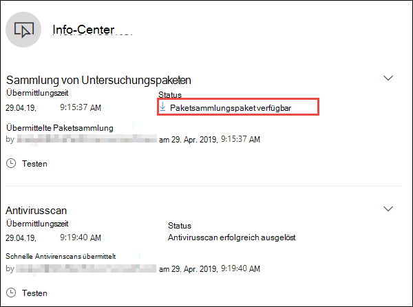
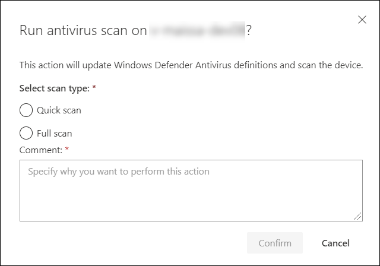

# Ergreifen von Reaktionen auf einem Gerät

[!INCLUDE [Microsoft 365 Defender rebranding](../../includes/microsoft-defender.md)]

**Gilt für:**
- [Microsoft Defender für Endpunkt](https://go.microsoft.com/fwlink/?linkid=2154037)

>Möchten Sie Defender for Endpoint erleben? [Registrieren Sie sich für eine kostenlose Testversion.](https://www.microsoft.com/microsoft-365/windows/microsoft-defender-atp?ocid=docs-wdatp-respondmachine-abovefoldlink) 

Reagieren Sie schnell auf erkannte Angriffe, indem Sie Geräte isolieren oder ein Untersuchungspaket sammeln. Nach dem Ergreifen von Aktionen auf Geräten können Sie die Aktivitätsdetails im Aktionscenter überprüfen.

Reaktionsaktionen werden am oberen Rand einer bestimmten Geräteseite ausgeführt und umfassen Folgendes:

- Verwalten von Kategorien
- Initiieren einer automatisierten Untersuchung
- Initiieren der Liveantwortsitzung
- Untersuchungspaket sammeln
- Antivirusscan ausführen
- Einschränken der App-Ausführung
- Isolieren des Geräts
- Wenden Sie sich an einen Bedrohungsexperten
- Info-Center

 Geräteseiten finden Sie in einer der folgenden Ansichten:

- **Dashboard für Sicherheitsvorgänge:** Wählen Sie auf der Karte Geräte mit Risiko einen Gerätenamen aus.
- **Warnungswarteschlange** : Wählen Sie den Gerätenamen neben dem Gerätesymbol aus der Benachrichtigungswarteschlange aus.
- **Geräteliste** – Wählen Sie die Überschrift des Gerätenamens aus der Geräteliste aus.
- **Suchfeld** : Wählen Sie im Dropdownmenü Gerät aus, und geben Sie den Gerätenamen ein.

>[!IMPORTANT]
> - Diese Reaktionsaktionen sind nur für Geräte unter Windows 10, Version 1703 oder höher, verfügbar. 
> - Für Nicht-Windows-Plattformen sind Reaktionsfunktionen (z. B. Geräteisolation) von den Drittanbieterfunktionen abhängig.

## Verwalten von Kategorien

Hinzufügen oder Verwalten von Tags zum Erstellen einer logischen Gruppenzugehörigkeit. Gerätetags unterstützen die ordnungsgemäße Zuordnung des Netzwerks, sodass Sie verschiedene Tags anfügen können, um Kontext zu erfassen und dynamische Listenerstellung als Teil eines Vorfalls zu ermöglichen.

Weitere Informationen zum Taggen von Geräten finden Sie unter [Create and manage device tags](machine-tags.md).

## Initiieren einer automatisierten Untersuchung

Sie können bei Bedarf eine neue allgemeine automatisierte Untersuchung auf dem Gerät starten. Während eine Untersuchung ausgeführt wird, werden alle anderen vom Gerät generierten Warnungen einer fortlaufenden automatisierten Untersuchung hinzugefügt, bis diese Untersuchung abgeschlossen ist. Wenn die gleiche Bedrohung auch auf anderen Geräten angezeigt wird, werden diese Geräte der Untersuchung hinzugefügt.

Weitere Informationen zu automatisierten Untersuchungen finden Sie [unter Overview of Automated investigations](automated-investigations.md).

## Initiieren der Liveantwortsitzung

Die Liveantwort ist eine Funktion, mit der Sie über eine Remoteshellverbindung sofort auf ein Gerät zugreifen können. Dies gibt Ihnen die Macht, eingehende Ermittlungen zu machen und sofort Maßnahmen zur Sofortigen Eindämmung identifizierter Bedrohungen zu ergreifen – in Echtzeit.

Die Liveantwort dient der Verbesserung der Untersuchungen, indem Sie forensische Daten sammeln, Skripts ausführen, verdächtige Entitäten zur Analyse senden, Bedrohungen behebt und proaktiv nach neuen Bedrohungen fahnen kann.

Weitere Informationen zur Liveantwort finden Sie unter [Investigate entities on devices using live response](live-response.md).

## Sammeln von Untersuchungspaketen von Geräten

Im Rahmen des Untersuchungs- oder Reaktionsprozesses können Sie ein Untersuchungspaket von einem Gerät erfassen. Durch das Sammeln des Untersuchungspakets können Sie den aktuellen Zustand des Geräts identifizieren und die vom Angreifer verwendeten Tools und Techniken besser verstehen.

So laden Sie das Paket (Zip-Datei) herunter, und untersuchen Sie die Ereignisse, die auf einem Gerät aufgetreten sind

1. Wählen **Sie untersuchungspaket sammeln** in der Zeile der Reaktionsaktionen oben auf der Geräteseite aus.
2. Geben Sie im Textfeld an, warum Sie diese Aktion ausführen möchten. Wählen Sie **Bestätigen** aus.
3. Die ZIP-Datei wird heruntergeladen

Alternative Methode:

1. Wählen **Sie auf der** Geräteseite im Abschnitt Reaktionsaktionen die Option Aktionscenter aus.

    

3. Wählen Sie im Fly-out des Aktionscenters die Option **Paketsammlungspaket aus, das** zum Herunterladen der ZIP-Datei verfügbar ist.
  
    

Das Paket enthält die folgenden Ordner:

| Ordner | Beschreibung |
|:---|:---------|
|Autoruns | Enthält eine Reihe von Dateien, die jeweils den Inhalt der Registrierung eines bekannten automatischen Startpunkts (AsEP) darstellen, um die Persistenz des Angreifers auf dem Gerät zu identifizieren.    
<b>HINWEIS:</b> Wenn der Registrierungsschlüssel nicht gefunden wird, enthält die Datei die folgende Meldung: "FEHLER: Das System konnte den angegebenen Registrierungsschlüssel oder -wert nicht finden."
                                                                                                                                |
|Installierte Programme | Dies . Die CSV-Datei enthält die Liste der installierten Programme, mit deren Hilfe ermittelt werden kann, was derzeit auf dem Gerät installiert ist. Weitere Informationen finden Sie unter [Win32_Product Klasse](https://go.microsoft.com/fwlink/?linkid=841509).                                                                                  |
|Netzwerkverbindungen | Dieser Ordner enthält eine Reihe von Datenpunkten im Zusammenhang mit den Konnektivitätsinformationen, die bei der Identifizierung der Konnektivität mit verdächtigen URLs, der Befehls- und Steuerungsinfrastruktur (C&C) des Angreifers, einer quer stehenden Bewegung oder Remoteverbindungen helfen können.   - ActiveNetConnections.txt – Zeigt Protokollstatistiken und aktuelle TCP/IP-Netzwerkverbindungen an. Bietet die Möglichkeit, nach verdächtigen Verbindungen zu suchen, die von einem Prozess hergestellt wurden.    - Arp.txt – Zeigt die aktuellen ARP-Cachetabellen (Address Resolution Protocol) für alle Schnittstellen an.    Der ARP-Cache kann zusätzliche Hosts in einem Netzwerk offen lassen, die gefährdet oder verdächtige Systeme im Netzwerk sind, die möglicherweise zum Ausführen eines internen Angriffs verwendet wurden.   - DnsCache.txt – Zeigt den Inhalt des DNS-Client-Resolvercaches an, der sowohl einträge enthält, die aus der lokalen Hosts-Datei vorinstalliert sind, als auch alle kürzlich erhaltenen Ressourceneinträge für vom Computer aufgelöste Namensabfragen. Dies kann bei der Identifizierung verdächtiger Verbindungen helfen.    - IpConfig.txt – Zeigt die vollständige TCP/IP-Konfiguration für alle Adapter an. Adapter können physische Schnittstellen darstellen, z. B. installierte Netzwerkadapter oder logische Schnittstellen, z. B. Einwahlverbindungen.    - FirewallExecutionLog.txt und pfirewall.log                                                                                  |
| Vorabfetchdateien| Windows Prefetch-Dateien wurden entwickelt, um den Anwendungsstartvorgang zu beschleunigen. Sie kann verwendet werden, um alle zuletzt im System verwendeten Dateien nachverfolgt und Nachverfolgungen für Anwendungen zu finden, die möglicherweise gelöscht wurden, aber weiterhin in der Liste der Vorabfetchdateien enthalten sind.    - Ordner "Prefetch" – Enthält eine Kopie der Vorabfetchdateien aus `%SystemRoot%\Prefetch` . HINWEIS: Es wird empfohlen, eine Vorabfetchdateianzeige herunterzuladen, um die Vorabfetchdateien anzeigen zu können.    - PrefetchFilesList.txt – Enthält die Liste aller kopierten Dateien, mit denen nachverfolgt werden kann, ob kopierfehler im Ordner "Prefetch" vorhanden sind.                                                                                                      |
| Prozesse| Enthält eine . CSV-Datei, die die ausgeführten Prozesse auflistet, die die Möglichkeit bietet, aktuelle Prozesse zu identifizieren, die auf dem Gerät ausgeführt werden. Dies kann hilfreich sein, wenn Ein verdächtiger Prozess und dessen Status identifiziert werden.                                                                                                                                                                                                       |
| Geplante Vorgänge| Enthält eine . EINE CSV-Datei mit den geplanten Aufgaben, mit der Routinen identifiziert werden können, die automatisch auf einem ausgewählten Gerät ausgeführt werden, um nach verdächtigem Code zu suchen, der für die automatische Ausführung festgelegt wurde.                                                                                                                                                                                                      |
| Sicherheitsereignisprotokoll| Enthält das Sicherheitsereignisprotokoll, das Datensätze der Anmelde- oder Abmeldeaktivität oder andere sicherheitsrelevante Ereignisse enthält, die in der Überwachungsrichtlinie des Systems angegeben sind.   
<b>HINWEIS:</b> Öffnen Sie die Ereignisprotokolldatei mithilfe der Ereignisanzeige.
                                                                                    |
| Dienste| Enthält eine . CSV-Datei, die Dienste und deren Zustände auflistet.                                                                                      |
| Windows Server Message Block (SMB)-Sitzungen | Listet freigegebenen Zugriff auf Dateien, Drucker und serielle Ports sowie verschiedene Kommunikationen zwischen Knoten in einem Netzwerk auf. Dies kann dazu beitragen, daten exfiltration oder laterale Bewegung zu identifizieren.    Enthält Dateien für SMBInboundSessions und SMBOutboundSession.    
<b>HINWEIS:</b> Wenn keine Sitzungen (ein- oder ausgehend) vorhanden sind, erhalten Sie eine Textdatei, in der Sie sehen, dass keine SMB-Sitzungen gefunden wurden.
                                                                                                                          |
| Systeminformationen| Enthält eine SystemInformation.txt, in der Systeminformationen wie Betriebssystemversion und Netzwerkkarten aufgeführt sind.                                                                                     |
| Temp Directories| Enthält eine Reihe von Textdateien, die die Dateien in %Temp% für jeden Benutzer im System auflisten.    Dadurch können Verdächtige Dateien nachverfolgt werden, die ein Angreifer möglicherweise auf dem System abgelegt hat.    
<b>HINWEIS:</b> Wenn die Datei die folgende Meldung enthält: "Das System kann den angegebenen Pfad nicht finden", bedeutet dies, dass für diesen Benutzer kein temporäres Verzeichnis vorhanden ist, was möglicherweise daran liegt, dass sich der Benutzer nicht beim System anmeldete.
                                                                                                                                         |
| Benutzer und Gruppen| Enthält eine Liste der Dateien, die jeweils eine Gruppe und ihre Mitglieder darstellen.                                                                                                                   |
|WdSupportLogs| Stellt die MpCmdRunLog.txt und MPSupportFiles.cab     
<b>HINWEIS:</b> Dieser Ordner wird nur unter Windows 10, Version 1709 oder höher, mit dem Updaterollup vom Februar 2020 oder einer neueren Installation erstellt:  Win10 1709 (RS3) Build 16299.1717 : [KB4537816](https://support.microsoft.com/en-us/help/4537816/windows-10-update-kb4537816)   Win10 1803 (RS4) Build 17134.1345 : [KB4537795](https://support.microsoft.com/en-us/help/4537795/windows-10-update-kb4537795)   Win10 1809 (RS5) Build 17763.1075 : [KB4537818](https://support.microsoft.com/en-us/help/4537818/windows-10-update-kb4537818)   Win10 1903/1909 (19h1/19h2) Builds 18362.693 und 18363.693 : [KB4535996](https://support.microsoft.com/en-us/help/4535996/windows-10-update-kb4535996) 
                                                                                                                    |
| CollectionSummaryReport.xls| Diese Datei ist eine Zusammenfassung der Untersuchungspaketsammlung, sie enthält die Liste der Datenpunkte, den Befehl zum Extrahieren der Daten, den Ausführungsstatus und den Fehlercode im Falle eines Fehlers. Mit diesem Bericht können Sie nachverfolgen, ob das Paket alle erwarteten Daten enthält, und ermitteln, ob Fehler aufgetreten sind. |

## Ausführen der Microsoft Defender Antivirus-Überprüfung auf Geräten

Im Rahmen des Untersuchungs- oder Reaktionsprozesses können Sie eine Antivirenuntersuchung remote initiieren, um Schadsoftware zu identifizieren und zu beheben, die möglicherweise auf einem gefährdeten Gerät vorhanden ist.

>[!IMPORTANT]
>- Diese Aktion ist für Geräte unter Windows 10, Version 1709 oder höher, verfügbar.
>- Eine Überprüfung von Microsoft Defender Antivirus (Microsoft Defender AV) kann zusammen mit anderen Antivirenlösungen ausgeführt werden, unabhängig davon, ob Microsoft Defender AV die aktive Antivirenlösung ist oder nicht. Microsoft Defender AV kann sich im passiven Modus befinden. Weitere Informationen finden Sie unter [Microsoft Defender Antivirus Compatibility](https://docs.microsoft.com/windows/security/threat-protection/microsoft-defender-antivirus/microsoft-defender-antivirus-compatibility.md).

Einer, den Sie **antivirusscan ausführen** ausgewählt haben, wählen Sie den Scantyp aus, den Sie ausführen möchten (schnell oder vollständig), und fügen Sie einen Kommentar hinzu, bevor Sie die Überprüfung bestätigen.

Das Aktionscenter zeigt die Scaninformationen an, und die Gerätezeitachse enthält ein neues Ereignis, das zeigt, dass eine Überprüfungsaktion auf dem Gerät übermittelt wurde. Microsoft Defender AV-Warnungen spiegeln alle Erkennungen wider, die während der Überprüfung angezeigt wurden.

>[!NOTE]
>Beim Auslösen einer Überprüfung mithilfe der Defender for Endpoint-Reaktionsaktion gilt der Wert "ScanAvgCPULoadFactor" von Microsoft Defender Antivirus weiterhin und begrenzt die AUSWIRKUNGEN der Überprüfung auf die CPU.  Wenn ScanAvgCPULoadFactor nicht konfiguriert ist, ist der Standardwert eine Maximale CPU-Auslastung von 50 % während eines Scans. 
>Weitere Informationen finden Sie unter [configure-advanced-scan-types-microsoft-defender-antivirus](https://docs.microsoft.com/windows/security/threat-protection/microsoft-defender-antivirus/configure-advanced-scan-types-microsoft-defender-antivirus).

## Einschränken der App-Ausführung

Zusätzlich zum Eindlösern eines Angriffs durch Beenden bösartiger Prozesse können Sie auch ein Gerät sperren und verhindern, dass nachfolgende Versuche potenziell schädlicher Programme ausgeführt werden.

>[!IMPORTANT]
> - Diese Aktion ist für Geräte unter Windows 10, Version 1709 oder höher, verfügbar.
> - Dieses Feature ist verfügbar, wenn Ihre Organisation Microsoft Defender Antivirus verwendet.
> - Diese Aktion muss die Richtlinienformate und Signaturanforderungen Windows Defender Anwendungssteuerungscodeintegrität erfüllen. Weitere Informationen finden Sie unter [Formaten und Signieren von Codeintegritätsrichtlinien.](https://docs.microsoft.com/windows/device-security/device-guard/requirements-and-deployment-planning-guidelines-for-device-guard#code-integrity-policy-formats-and-signing)

Um die Ausführung einer Anwendung einzuschränken, wird eine Codeintegritätsrichtlinie angewendet, die nur die Ausführung von Dateien zulässt, wenn sie von einem von Microsoft ausgestellten Zertifikat signiert sind. Diese Einschränkungsmethode kann verhindern, dass ein Angreifer gefährdete Geräte steuert und weitere schädliche Aktivitäten ausführen kann.

>[!NOTE]
>Sie können die Einschränkung der Ausführung von Anwendungen jederzeit rückgängig machen. Die Schaltfläche auf der Geräteseite ändert sich so, dass Sie **App-Einschränkungen** entfernen sagen, und dann gehen Sie wie beim Einschränken der App-Ausführung vor.

Nachdem Sie auf der Geräteseite **App-Ausführung** einschränken ausgewählt haben, geben Sie einen Kommentar ein, und wählen Sie **Bestätigen aus.** Das Aktionscenter zeigt die Scaninformationen an, und die Gerätezeitachse enthält ein neues Ereignis.

**Benachrichtigung für Gerätebenutzer:** 
Wenn eine App eingeschränkt ist, wird die folgende Benachrichtigung angezeigt, um den Benutzer darüber zu informieren, dass eine App nicht ausgeführt werden kann:

## Isolieren von Geräten aus dem Netzwerk

Abhängig vom Schweregrad des Angriffs und der Vertraulichkeit des Geräts können Sie das Gerät vom Netzwerk isolieren. Diese Aktion kann verhindern, dass der Angreifer das gefährdete Gerät steuert und weitere Aktivitäten wie Daten-Exfiltration und Querbewegungen ausführen kann.

>[!IMPORTANT]
>- Die vollständige Isolation ist für Geräte unter Windows 10, Version 1703, verfügbar.
>- Die selektive Isolation ist für Geräte unter Windows 10, Version 1709 oder höher, verfügbar.

Diese Geräteisolationsfunktion trennt das gefährdete Gerät vom Netzwerk, während die Verbindung mit dem Defender for Endpoint-Dienst beibehalten wird, der das Gerät weiterhin überwacht.

Unter Windows 10, Version 1709 oder höher, haben Sie zusätzliche Kontrolle über die Netzwerkisolationsstufe. Sie können auch die Outlook-, Microsoft Teams- und Skype for Business-Konnektivität aktivieren (z. B. eine selektive Isolation).

>[!NOTE]
>Sie können das Gerät jederzeit wieder mit dem Netzwerk verbinden. Die Schaltfläche auf der Geräteseite ändert sich in **"Aus** Isolation loslassen", und Dann führen Sie die gleichen Schritte aus wie das Isolieren des Geräts.

Nachdem Sie gerät **auf** der Geräteseite isolieren ausgewählt haben, geben Sie einen Kommentar ein, und wählen Sie Bestätigen **aus.** Das Aktionscenter zeigt die Scaninformationen an, und die Gerätezeitachse enthält ein neues Ereignis.

>[!NOTE]
>Das Gerät bleibt auch dann mit dem Defender for Endpoint-Dienst verbunden, wenn es vom Netzwerk isoliert ist. Wenn Sie die Outlook- und Skype for Business-Kommunikation aktivieren möchten, können Sie mit dem Benutzer kommunizieren, während das Gerät isoliert ist.

**Benachrichtigung für Gerätebenutzer:** 
Wenn ein Gerät isoliert wird, wird die folgende Benachrichtigung angezeigt, um den Benutzer darüber zu informieren, dass das Gerät vom Netzwerk isoliert wird:

## Wenden Sie sich an einen Bedrohungsexperten

Sie können einen Microsoft-Bedrohungsexperten konsultieren, um weitere Einblicke in ein potenziell gefährdetes oder bereits gefährdetes Gerät zu erhalten. Microsoft Threat Experts können direkt im Microsoft Defender Security Center für eine zeitnahe und genaue Reaktion eingeschaltet werden. Experten bieten Einblicke nicht nur zu einem potenziell gefährdeten Gerät, sondern auch zum besseren Verständnis komplexer Bedrohungen, gezielter Angriffsbenachrichtigungen, die Sie erhalten, oder wenn Sie weitere Informationen zu den Warnungen oder einen Bedrohungsintelligenzkontext benötigen, den Sie im Portaldashboard sehen.

Weitere Informationen finden Sie unter Consult [a Microsoft Threat Expert.](https://docs.microsoft.com/microsoft-365/security/defender-endpoint/configure-microsoft-threat-experts#consult-a-microsoft-threat-expert-about-suspicious-cybersecurity-activities-in-your-organization)

## Überprüfen von Aktivitätsdetails im Aktionscenter

Das **Aktionscenter** enthält Informationen zu Aktionen, die auf einem Gerät oder einer Datei ergriffen wurden. Sie können die folgenden Details anzeigen:

- Sammlung von Untersuchungspaketen
- Antivirusscan
- App-Einschränkung
- Geräteisolation

Alle anderen zugehörigen Details werden ebenfalls angezeigt, z. B. Übermittlungsdatum/-uhrzeit, Übermitteln des Benutzers und ob die Aktion erfolgreich war oder fehlgeschlagen ist.

## Verwandtes Thema
- [Ergreifen von Reaktionen auf eine Datei](respond-file-alerts.md)
- [Ungenauigkeit melden](https://docs.microsoft.com/microsoft-365/security/defender-endpoint/tvm-security-recommendation#report-inaccuracy)
