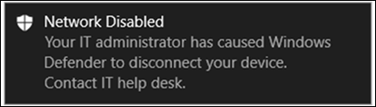

# Ergreifen von Reaktionen auf einem Gerät

[!INCLUDE [Microsoft 365 Defender rebranding](../../includes/microsoft-defender.md)]

**Gilt für:**
- [Microsoft Defender für Endpunkt](https://go.microsoft.com/fwlink/?linkid=2154037)

>Möchten Sie Defender für Endpunkt erleben? [Registrieren Sie sich für eine kostenlose Testversion.](https://www.microsoft.com/microsoft-365/windows/microsoft-defender-atp?ocid=docs-wdatp-respondmachine-abovefoldlink) 

Reagieren Sie schnell auf erkannte Angriffe, indem Sie Geräte isolieren oder ein Untersuchungspaket sammeln. Nachdem Sie Maßnahmen auf Geräten ergriffen haben, können Sie die Aktivitätsdetails im Info-Center überprüfen.

Antwortaktionen werden oben auf einer bestimmten Geräteseite ausgeführt und umfassen Folgendes:

- Verwalten von Kategorien
- Initiieren einer automatischen Untersuchung
- Initiieren einer Liveantwortsitzung
- Untersuchungspaket sammeln
- Antivirusscan ausführen
- Einschränken der App-Ausführung
- Gerät isolieren
- Wenden Sie sich an einen Bedrohungsexperten
- Info-Center

 Geräteseiten finden Sie in einer der folgenden Ansichten:

- **Dashboard für Sicherheitsvorgänge** – Wählen Sie einen Gerätenamen auf der Karte "Geräte mit Risiko" aus.
- **Benachrichtigungswarteschlange** – Wählen Sie den Gerätenamen neben dem Gerätesymbol aus der Benachrichtigungswarteschlange aus.
- **Geräteliste** – Wählen Sie die Überschrift des Gerätenamens aus der Geräteliste aus.
- **Suchfeld** – Wählen Sie im Dropdownmenü "Gerät" aus und geben Sie den Gerätenamen ein.

>[!IMPORTANT]
> - Diese Antwortaktionen sind nur für Geräte mit Windows 10, Version 1703 oder höher, verfügbar. 
> - Bei Plattformen, die nicht Windows sind Reaktionsfunktionen (z. B. Geräteisolation) von den Funktionen von Drittanbietern abhängig.

## Verwalten von Kategorien

Hinzufügen oder Verwalten von Tags zum Erstellen einer logischen Gruppenmitgliedschaft. Gerätekategorien unterstützen die ordnungsgemäße Zuordnung des Netzwerks, sodass Sie verschiedene Kategorien anfügen können, um den Kontext zu erfassen und die dynamische Listenerstellung als Teil eines Vorfalls zu ermöglichen.

Weitere Informationen zum Gerätetagging finden Sie unter [Erstellen und Verwalten von Gerätetags.](machine-tags.md)

## Initiieren einer automatischen Untersuchung

Sie können bei Bedarf eine neue allgemeine automatisierte Untersuchung auf dem Gerät starten. Während eine Untersuchung ausgeführt wird, wird jede andere vom Gerät generierte Warnung zu einer laufenden automatisierten Untersuchung hinzugefügt, bis diese Untersuchung abgeschlossen ist. Wenn die gleiche Bedrohung auf anderen Geräten angezeigt wird, werden diese Geräte der Untersuchung hinzugefügt.

Weitere Informationen zu automatisierten Untersuchungen finden Sie unter ["Übersicht über automatisierte Untersuchungen".](automated-investigations.md)

## Initiieren einer Liveantwortsitzung

Live response is a capability that gives you instantaneous access to a device by using a remote shell connection. Auf diese Weise haben Sie die Möglichkeit, tiefgehende Untersuchungsarbeit zu leisten und sofortige Maßnahmen zu ergreifen, um erkannte Bedrohungen umgehend einzudämmen – Echtzeit.

Live Response wurde entwickelt, um Untersuchungen zu verbessern, indem Sie es Ihnen ermöglichen, forensische Daten zu sammeln, Skripts auszuführen, verdächtige Entitäten zur Analyse zu senden, Bedrohungen zu beheben und proaktiv nach neuen Bedrohungen zu suchen.

Weitere Informationen zur Liveantwort finden Sie unter [Untersuchen von Entitäten auf Geräten, die Liveantwort verwenden.](live-response.md)

## Erfassen des Untersuchungspakets von Geräten

Im Rahmen des Untersuchungs- oder Reaktionsprozesses können Sie ein Untersuchungspaket von einem Gerät erfassen. Durch das Sammeln des Untersuchungspakets können Sie den aktuellen Zustand des Geräts identifizieren und die vom Angreifer verwendeten Tools und Techniken weiter verstehen.

So laden Sie das Paket (ZIP-Datei) herunter und untersuchen die Ereignisse, die auf einem Gerät aufgetreten sind

1. Wählen Sie **"Untersuchungspaket sammeln"** aus der Reihe der Antwortaktionen oben auf der Geräteseite aus.
2. Geben Sie im Textfeld an, warum Sie diese Aktion ausführen möchten. Wählen Sie **Bestätigen** aus.
3. Die ZIP-Datei wird heruntergeladen

Alternative Methode:

1. Wählen Sie im Abschnitt "Reaktionsaktionen" der Geräteseite das **Info-Center** aus.

    

3. Wählen Sie im Info-Center-Flyout **das Paketsammlungspaket** aus, das zum Herunterladen der ZIP-Datei verfügbar ist.
  
    

Das Paket enthält die folgenden Ordner:

| Ordner | Beschreibung |
|:---|:---------|
|Autoruns | Enthält eine Reihe von Dateien, die jeweils den Inhalt der Registrierung eines bekannten AsEP (Auto Start Entry Point) darstellen, um die Persistenz des Angreifers auf dem Gerät zu identifizieren.    
<b>HINWEIS:</b> Wenn der Registrierungsschlüssel nicht gefunden wird, enthält die Datei die folgende Meldung: "FEHLER: Das System konnte den angegebenen Registrierungsschlüssel oder -wert nicht finden."
                                                                                                                                |
|Installierte Programme | Diese .CSV-Datei enthält die Liste der installierten Programme, mit deren Hilfe Sie ermitteln können, was derzeit auf dem Gerät installiert ist. Weitere Informationen finden Sie unter [Win32_Product Klasse.](https://go.microsoft.com/fwlink/?linkid=841509)                                                                                  |
|Netzwerkverbindungen | Dieser Ordner enthält eine Reihe von Datenpunkten im Zusammenhang mit den Konnektivitätsinformationen, die bei der Identifizierung der Konnektivität zu verdächtigen URLs, der Befehls- und Steuerungsinfrastruktur des Angreifers (C&C), lateraler Bewegungen oder Remoteverbindungen helfen können.   – ActiveNetConnections.txt : Zeigt Protokollstatistiken und aktuelle TCP/IP-Netzwerkverbindungen an. Bietet die Möglichkeit, nach verdächtigen Verbindungen zu suchen, die von einem Prozess hergestellt werden.    - Arp.txt – Zeigt die aktuellen ARP-Cachetabellen (Address Resolution Protocol) für alle Schnittstellen an.    Der ARP-Cache kann zusätzliche Hosts in einem Netzwerk offenlegen, die kompromittiert wurden, oder verdächtige Systeme im Netzwerk, die möglicherweise zum Ausführen eines internen Angriffs verwendet wurden.   - DnsCache.txt – Zeigt den Inhalt des DNS-Client-Resolvercaches an, der sowohl einträge enthält, die aus der lokalen Hosts-Datei vorgeladen wurden, als auch alle kürzlich abgerufenen Ressourceneinträge für vom Computer aufgelöste Namensabfragen. Dies kann bei der Identifizierung verdächtiger Verbindungen hilfreich sein.    – IpConfig.txt – Zeigt die vollständige TCP/IP-Konfiguration für alle Adapter an. Adapter können physische Schnittstellen darstellen, z. B. installierte Netzwerkadapter oder logische Schnittstellen, z. B. DFÜ-Verbindungen.    – FirewallExecutionLog.txt und pfirewall.log                                                                                  |
| Vorabrufen von Dateien| Windows Vorabrufdateien sind so konzipiert, dass der Startvorgang der Anwendung beschleunigt wird. Es kann verwendet werden, um alle zuletzt im System verwendeten Dateien nachzuverfolgen und Nachverfolgungen für Anwendungen zu suchen, die möglicherweise gelöscht wurden, aber weiterhin in der Vorabrufdateiliste zu finden sind.    - Prefetch-Ordner – Enthält eine Kopie der Vorabrufdateien von `%SystemRoot%\Prefetch` . HINWEIS: Es wird empfohlen, einen Prefetch-Dateiviewer herunterzuladen, um die Vorabrufdateien anzuzeigen.    - PrefetchFilesList.txt – Enthält die Liste aller kopierten Dateien, die verwendet werden können, um nachzuverfolgen, ob Kopierfehler im Prefetch-Ordner aufgetreten sind.                                                                                                      |
| Prozesse| Enthält eine .CSV Datei mit den ausgeführten Prozessen, die die Möglichkeit bietet, aktuelle Prozesse zu identifizieren, die auf dem Gerät ausgeführt werden. Dies kann hilfreich sein, wenn ein verdächtiger Prozess und dessen Status identifiziert werden.                                                                                                                                                                                                       |
| Geplante Aufgaben| Enthält eine .CSV Datei mit den geplanten Aufgaben, die verwendet werden kann, um Routinen zu identifizieren, die automatisch auf einem ausgewählten Gerät ausgeführt werden, um nach verdächtigem Code zu suchen, der für die automatische Ausführung festgelegt wurde.                                                                                                                                                                                                      |
| Sicherheitsereignisprotokoll| Enthält das Sicherheitsereignisprotokoll, das Datensätze der Anmelde- oder Abmeldeaktivität oder andere sicherheitsrelevante Ereignisse enthält, die durch die Überwachungsrichtlinie des Systems angegeben werden.   
<b>HINWEIS:</b> Öffnen Sie die Ereignisprotokolldatei mithilfe der Ereignisanzeige.
                                                                                    |
| Dienste| Enthält eine .CSV Datei, die Dienste und deren Status auflistet.                                                                                      |
| Windows Server Message Block (SMB)-Sitzungen | Listet den freigegebenen Zugriff auf Dateien, Drucker und serielle Ports sowie verschiedene Kommunikationen zwischen Knoten in einem Netzwerk auf. Dies kann dazu beitragen, Datenexfiltration oder laterale Bewegungen zu identifizieren.    Enthält Dateien für SMBInboundSessions und SMBOutboundSession.    
<b>HINWEIS:</b> Wenn keine Sitzungen vorhanden sind (ein- oder ausgehend), erhalten Sie eine Textdatei, die Ihnen mitgibt, dass keine SMB-Sitzungen gefunden wurden.
                                                                                                                          |
| Systeminformationen| Enthält eine SystemInformation.txt Datei, die Systeminformationen wie Betriebssystemversion und Netzwerkkarten auflistet.                                                                                     |
| Temp-Verzeichnisse| Enthält eine Reihe von Textdateien, in denen die Dateien aufgelistet sind, die sich für jeden Benutzer im System in %Temp% befinden.    Dies kann dazu beitragen, verdächtige Dateien nachzuverfolgen, die ein Angreifer möglicherweise auf dem System abgelegt hat.    
<b>HINWEIS:</b> Wenn die Datei die folgende Meldung enthält: "Das System kann den angegebenen Pfad nicht finden", bedeutet dies, dass kein temporäres Verzeichnis für diesen Benutzer vorhanden ist und möglicherweise darauf zurückzuführen ist, dass sich der Benutzer nicht beim System angemeldet hat.
                                                                                                                                         |
| Benutzer und Gruppen| Stellt eine Liste der Dateien bereit, die jeweils eine Gruppe und ihre Mitglieder darstellen.                                                                                                                   |
|WdSupportLogs| Stellt die MpCmdRunLog.txt und MPSupportFiles.cab bereit.     
<b>HINWEIS:</b> Dieser Ordner wird nur auf Windows 10, Version 1709 oder höher, mit dem Updaterollup vom Februar 2020 oder einer neueren Installation erstellt:  Win10 1709 (RS3) Build 16299.1717 : [KB4537816](https://support.microsoft.com/en-us/help/4537816/windows-10-update-kb4537816)   Win10 1803 (RS4) Build 17134.1345 : [KB4537795](https://support.microsoft.com/en-us/help/4537795/windows-10-update-kb4537795)   Win10 1809 (RS5) Build 17763.1075 : [KB4537818](https://support.microsoft.com/en-us/help/4537818/windows-10-update-kb4537818)   Win10 1903/1909 (19h1/19h2) Builds 18362.693 and 18363.693 : [KB4535996](https://support.microsoft.com/en-us/help/4535996/windows-10-update-kb4535996) 
                                                                                                                    |
| CollectionSummaryReport.xls| Diese Datei ist eine Zusammenfassung der Untersuchungspaketsammlung und enthält die Liste der Datenpunkte, den Befehl zum Extrahieren der Daten, den Ausführungsstatus und den Fehlercode im Falle eines Fehlers. Sie können diesen Bericht verwenden, um nachzuverfolgen, ob das Paket alle erwarteten Daten enthält, und um zu ermitteln, ob Fehler aufgetreten sind. |

## Ausführen Microsoft Defender Antivirus Scans auf Geräten

Im Rahmen des Untersuchungs- oder Reaktionsprozesses können Sie remote einen Antivirenscan initiieren, um Schadsoftware zu identifizieren und zu beheben, die auf einem kompromittierten Gerät möglicherweise vorhanden ist.

>[!IMPORTANT]
>- Diese Aktion ist für Geräte auf Windows 10 Version 1709 oder höher verfügbar.
>- Ein Microsoft Defender Antivirus (Microsoft Defender AV)-Scan kann zusammen mit anderen Antivirenlösungen ausgeführt werden, unabhängig davon, ob Microsoft Defender AV die aktive Antivirenlösung ist oder nicht. Microsoft Defender AV kann sich im passiven Modus befinden. Weitere Informationen finden Sie unter [Microsoft Defender Antivirus Kompatibilität.](/windows/security/threat-protection/microsoft-defender-antivirus/microsoft-defender-antivirus-compatibility.md)

Eines, das Sie **"Antivirusscan ausführen"** ausgewählt haben, wählen Sie den Scantyp aus, den Sie ausführen möchten (schnell oder vollständig), und fügen Sie vor der Bestätigung des Scans einen Kommentar hinzu.

Das Info-Center zeigt die Scaninformationen an, und die Gerätezeitachse enthält ein neues Ereignis, das angibt, dass eine Scanaktion auf dem Gerät übermittelt wurde. Microsoft Defender AV-Warnungen spiegeln alle Erkennungen wider, die während der Überprüfung angezeigt wurden.

>[!NOTE]
>Beim Auslösen einer Überprüfung mithilfe der Defender für Endpunkt-Antwortaktion gilt der Microsoft Defender Antivirus-Wert "ScanAvgCPULoadFactor" weiterhin und schränkt die CPU-Auswirkungen des Scans ein.  Wenn ScanAvgCPULoadFactor nicht konfiguriert ist, ist der Standardwert ein Grenzwert von 50 % der maximalen CPU-Auslastung während eines Scans. 
>Weitere Informationen finden Sie unter [configure-advanced-scan-types-microsoft-defender-antivirus.](/windows/security/threat-protection/microsoft-defender-antivirus/configure-advanced-scan-types-microsoft-defender-antivirus)

## Einschränken der App-Ausführung

Zusätzlich zu einem Angriff durch Beenden bösartiger Prozesse können Sie auch ein Gerät sperren und verhindern, dass nachfolgende Versuche von potenziell schädlichen Programmen ausgeführt werden.

>[!IMPORTANT]
> - Diese Aktion ist für Geräte auf Windows 10 Version 1709 oder höher verfügbar.
> - Dieses Feature ist verfügbar, wenn Ihre Organisation Microsoft Defender Antivirus verwendet.
> - Diese Aktion muss die Windows Defender Codeintegritätsrichtlinienformate und Signaturanforderungen für die Anwendungssteuerung erfüllen. Weitere Informationen finden Sie unter [Formaten und Signieren von Codeintegritätsrichtlinien.](/windows/device-security/device-guard/requirements-and-deployment-planning-guidelines-for-device-guard#code-integrity-policy-formats-and-signing)

Um die Ausführung einer Anwendung einzuschränken, wird eine Codeintegritätsrichtlinie angewendet, die die Ausführung von Dateien nur zulässt, wenn sie von einem von Microsoft ausgestellten Zertifikat signiert wurden. Diese Einschränkungsmethode kann verhindern, dass ein Angreifer kompromittierte Geräte kontrolliert und weitere schädliche Aktivitäten ausführt.

>[!NOTE]
>Sie können die Einschränkung der Ausführung von Anwendungen jederzeit rückgängig machen. The button on the device page will change to say **Remove app restrictions,** and then you take the same steps as restricting app execution.

Nachdem Sie die Option **"App-Ausführung** auf der Geräteseite einschränken" ausgewählt haben, geben Sie einen Kommentar ein, und wählen Sie **"Bestätigen"** aus. Im Info-Center werden die Scaninformationen angezeigt, und die Gerätezeitachse enthält ein neues Ereignis.

**Benachrichtigung für Gerätebenutzer:** 
Wenn eine App eingeschränkt ist, wird die folgende Benachrichtigung angezeigt, um den Benutzer darüber zu informieren, dass die Ausführung einer App eingeschränkt wird:

## Isolieren von Geräten aus dem Netzwerk

Je nach Schweregrad des Angriffs und Empfindlichkeit des Geräts sollten Sie das Gerät vom Netzwerk isolieren. Diese Aktion kann verhindern, dass der Angreifer das kompromittierte Gerät steuert und weitere Aktivitäten wie Datenexfiltration und Lateral Movement ausführt.

>[!IMPORTANT]
>- Die vollständige Isolation ist für Geräte in Windows 10 Version 1703 verfügbar.
>- Die selektive Isolation ist für Geräte mit Windows 10, Version 1709 oder höher, verfügbar.
>- Beim Isolieren eines Geräts sind nur bestimmte Prozesse und Ziele zulässig. Daher können Geräte, die sich hinter einem vollständigen VPN-Tunnel befinden, den Microsoft Defender für Endpunkt-Clouddienst nicht erreichen, nachdem das Gerät isoliert wurde. Es wird empfohlen, ein SPLIT-Tunneling-VPN für Microsoft Defender für Endpunkt und Microsoft Defender Antivirus cloudbasierten schutzbezogenen Datenverkehr zu verwenden.

Diese Geräteisolationsfunktion trennt das kompromittierte Gerät vom Netzwerk und behält gleichzeitig die Verbindung mit dem Defender für Endpunkt-Dienst bei, der das Gerät weiterhin überwacht.

Auf Windows 10 Version 1709 oder höher haben Sie zusätzliche Kontrolle über die Netzwerkisolationsstufe. Sie können auch Outlook, Microsoft Teams und Skype for Business Konnektivität aktivieren (auch als "selektive Isolation" bezeichnet).

>[!NOTE]
>Sie können das Gerät jederzeit wieder mit dem Netzwerk verbinden. Die Schaltfläche auf der Geräteseite ändert sich so, dass sie **von der Isolation loslassen** heißt, und dann führen Sie die gleichen Schritte wie das Isolieren des Geräts aus.

Nachdem Sie das **Gerät** auf der Geräteseite isoliert ausgewählt haben, geben Sie einen Kommentar ein, und wählen Sie **Bestätigen** aus. Im Info-Center werden die Scaninformationen angezeigt, und die Gerätezeitachse enthält ein neues Ereignis.

>[!NOTE]
>Das Gerät bleibt mit dem Defender für Endpunkt-Dienst verbunden, auch wenn es vom Netzwerk isoliert ist. Wenn Sie sich entschieden haben, Outlook und Skype for Business Kommunikation zu aktivieren, können Sie mit dem Benutzer kommunizieren, während das Gerät isoliert ist.

**Benachrichtigung für Gerätebenutzer:** 
Wenn ein Gerät isoliert wird, wird die folgende Benachrichtigung angezeigt, um den Benutzer darüber zu informieren, dass das Gerät vom Netzwerk isoliert wird:

## Wenden Sie sich an einen Bedrohungsexperten

Sie können sich an einen Microsoft-Bedrohungsexperten wenden, um weitere Einblicke in ein potenziell kompromittiertes oder bereits kompromittiertes Gerät zu erhalten. Microsoft-Bedrohungsexperten können direkt innerhalb der Microsoft Defender Security Center für eine zeitnahe und genaue Antwort eingebunden werden. Experten bieten Nicht nur Einblicke in ein potenziell kompromittiertes Gerät, sondern auch, um komplexe Bedrohungen, Benachrichtigungen über gezielte Angriffe, die Sie erhalten, oder wenn Sie weitere Informationen zu den Warnungen benötigen, oder einen Kontext für die Bedrohungserkennung, den Sie in Ihrem Portaldashboard sehen, besser zu verstehen.

Weitere Informationen finden [Sie unter "Microsoft Threat Expert".](/microsoft-365/security/defender-endpoint/configure-microsoft-threat-experts#consult-a-microsoft-threat-expert-about-suspicious-cybersecurity-activities-in-your-organization)

## Überprüfen von Aktivitätsdetails im Aktionscenter

Das **Info-Center** enthält Informationen zu Aktionen, die auf einem Gerät oder einer Datei ausgeführt wurden. Sie können die folgenden Details anzeigen:

- Untersuchungspaketsammlung
- Antivirus-Scan
- App-Einschränkung
- Geräteisolation

Alle anderen verwandten Details werden ebenfalls angezeigt, z. B. Übermittlungsdatum/-uhrzeit, Übermitteln des Benutzers und ob die Aktion erfolgreich war oder fehlgeschlagen ist.

## Verwandtes Thema
- [Ergreifen von Reaktionen auf eine Datei](respond-file-alerts.md)
- [Ungenauigkeit melden](/microsoft-365/security/defender-endpoint/tvm-security-recommendation#report-inaccuracy)
