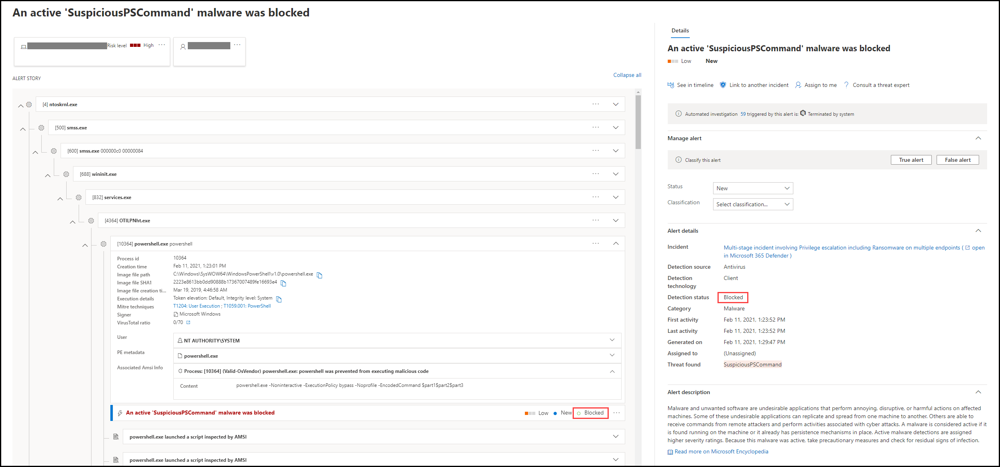
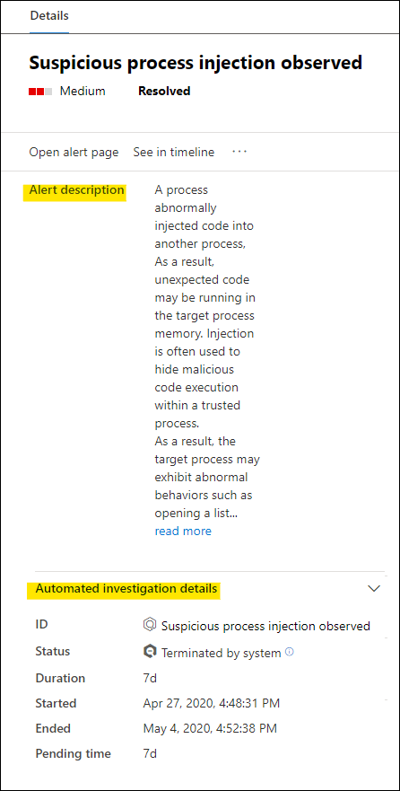
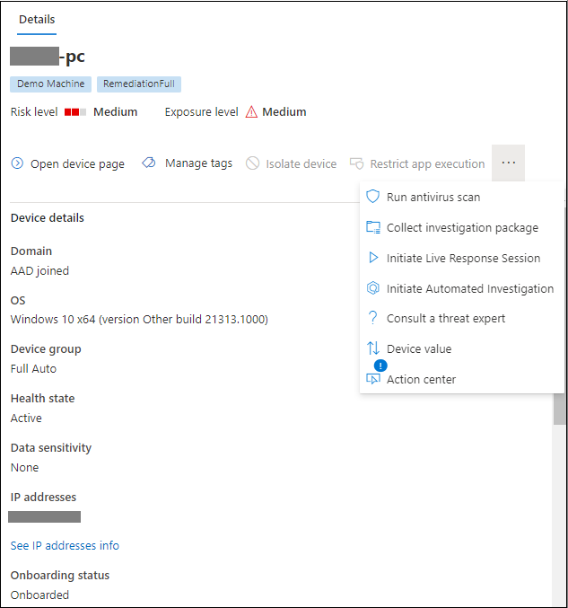

# Überprüfen von Warnungen in Microsoft Defender für Endpunkt

[!INCLUDE [Microsoft 365 Defender rebranding](../../includes/microsoft-defender.md)]

**Gilt für:**
- [Microsoft Defender für Endpunkt](https://go.microsoft.com/fwlink/?linkid=2154037)

>Möchten Sie Defender für Endpunkt erleben? [Registrieren Sie sich für eine kostenlose Testversion.](https://www.microsoft.com/microsoft-365/windows/microsoft-defender-atp?ocid=docs-wdatp-managealerts-abovefoldlink)

Die Warnungsseite in Microsoft Defender für Endpunkt bietet den vollständigen Kontext der Warnung, indem Angriffssignale und Warnungen im Zusammenhang mit der ausgewählten Warnung kombiniert werden, um eine detaillierte Warnung zu erstellen.

Schnelles Selektieren, Untersuchen und Ergreifen effektiver Maßnahmen bei Warnungen, die Sich auf Ihre Organisation auswirken. Verstehen Sie, warum sie ausgelöst wurden, und ihre Auswirkungen von einem Ort aus. Weitere Informationen finden Sie in dieser Übersicht.

> [!VIDEO https://www.microsoft.com/videoplayer/embed/RE4yiO5]

## Erste Schritte mit einer Warnung

Wenn Sie den Namen einer Warnung in Defender für Endpunkt auswählen, gelangen Sie auf der Warnungsseite. Auf der Warnungsseite werden alle Informationen im Kontext der ausgewählten Warnung angezeigt. Jede Warnungsseite besteht aus vier Abschnitten:

1. **Der Titel** der Warnung zeigt den Namen der Warnung und ist vorhanden, um Sie daran zu erinnern, welche Warnung Ihre aktuelle Untersuchung gestartet hat, unabhängig davon, was Sie auf der Seite ausgewählt haben.
2. [**Betroffene Objekte**](#review-affected-assets) listet Karten von Geräten und Benutzern auf, die von dieser Warnung betroffen sind und auf die geklickt werden kann, um weitere Informationen und Aktionen zu erhalten.
3. Der **Warnungsabschnitt** zeigt alle Entitäten im Zusammenhang mit der Warnung an, die durch eine Strukturansicht miteinander verbunden sind. Die Warnung im Titel steht im Fokus, wenn Sie zum ersten Mal auf der Seite der ausgewählten Warnung landen. Entitäten im Warnungsartikel können erweitert und angeklickt werden, um zusätzliche Informationen bereitzustellen und die Reaktion zu beschleunigen, indem Sie Aktionen direkt im Kontext der Warnungsseite ausführen können. Verwenden Sie den Warnungsartikel, um Ihre Untersuchung zu starten. Erfahren Sie, wie Sie [Warnungen in Microsoft Defender für Endpunkt untersuchen.](/microsoft-365/security/defender-endpoint/investigate-alerts)
4. Im **Detailbereich** werden zunächst die Details der ausgewählten Warnung mit Details und Aktionen im Zusammenhang mit dieser Warnung angezeigt. Wenn Sie eine der betroffenen Ressourcen oder Entitäten im Warnungsartikel auswählen, ändert sich der Detailbereich, um Kontextinformationen und Aktionen für das ausgewählte Objekt bereitzustellen.

Notieren Sie sich den Erkennungsstatus für Ihre Warnung. 
- Verhindert – Die versuchte verdächtige Aktion wurde vermieden. Beispielsweise wurde eine Datei nicht auf den Datenträger geschrieben oder ausgeführt.

- Blockiert – Verdächtiges Verhalten wurde ausgeführt und dann blockiert. Beispielsweise wurde ein Prozess ausgeführt, aber da er anschließend verdächtige Verhaltensweisen aufweist, wurde der Prozess beendet.

- Erkannt – Ein Angriff wurde erkannt und ist möglicherweise noch aktiv.

Sie können dann auch die Details der *automatischen Untersuchung* im Detailbereich Ihrer Warnung überprüfen, um zu sehen, welche Aktionen bereits ausgeführt wurden, sowie die Beschreibung der Warnung für empfohlene Aktionen lesen.

Weitere Informationen, die im Detailbereich verfügbar sind, wenn die Warnung geöffnet wird, umfassen MITRE-Techniken, Quelle und zusätzliche kontextbezogene Details.

## Überprüfen betroffener Ressourcen

Wenn Sie ein Gerät oder eine Benutzerkarte in den Abschnitten der betroffenen Objekte auswählen, wechseln Sie zu den Details des Geräts oder Benutzers im Detailbereich.

- **Bei Geräten** werden im Detailbereich Informationen über das Gerät selbst angezeigt, z. B. Domäne, Betriebssystem und IP. Aktive Warnungen und die angemeldeten Benutzer auf diesem Gerät sind ebenfalls verfügbar. Sie können sofortige Maßnahmen ergreifen, indem Sie das Gerät isolieren, die App-Ausführung einschränken oder eine Antivirenüberprüfung ausführen. Alternativ können Sie ein Untersuchungspaket erfassen, eine automatisierte Untersuchung initiieren oder zur Geräteseite wechseln, um die Untersuchung aus der Sicht des Geräts durchzuführen.

   

- **Für Benutzer** werden im Detailbereich detaillierte Benutzerinformationen angezeigt, z. B. SAM-Name und SID des Benutzers sowie von diesem Benutzer ausgeführte Anmeldetypen sowie alle warnungen und Vorfälle im Zusammenhang damit. Sie können die *Seite "Benutzer öffnen"* auswählen, um die Untersuchung aus der Sicht dieses Benutzers fortzusetzen.

   

## Verwandte Themen

- [Anzeigen und Organisieren der Vorfallwarteschlange](view-incidents-queue.md)
- [Untersuchen von Vorfällen](investigate-incidents.md)
- [Verwalten von Vorfällen](manage-incidents.md)
