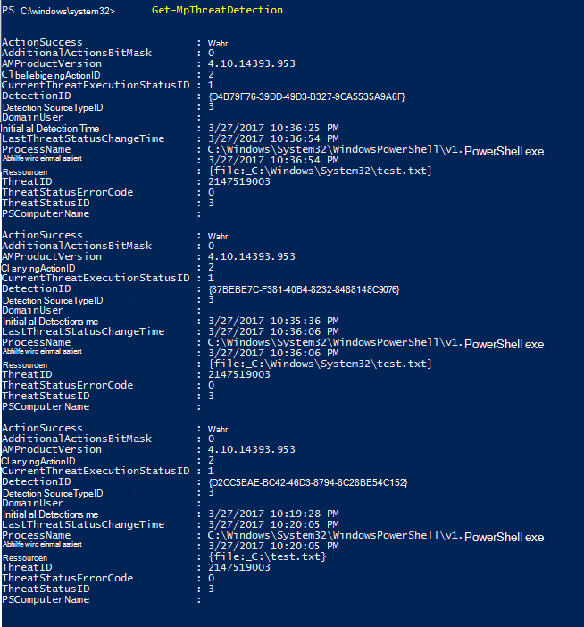
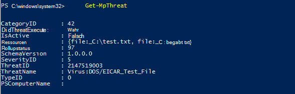

# <a name="review-microsoft-defender-antivirus-scan-results"></a>Überprüfen Microsoft Defender Antivirus Überprüfungsergebnisse

[!INCLUDE [Microsoft 365 Defender rebranding](../../includes/microsoft-defender.md)]


**Gilt für:**

- [Microsoft Defender für Endpunkt](/microsoft-365/security/defender-endpoint/)

Nach Abschluss Microsoft Defender Antivirus Überprüfung werden die Ergebnisse [](run-scan-microsoft-defender-antivirus.md) aufgezeichnet, [](scheduled-catch-up-scans-microsoft-defender-antivirus.md)unabhängig davon, ob es sich um eine bedarfs- oder geplante Überprüfung handelt, und Sie können die Ergebnisse anzeigen. 


## <a name="use-configuration-manager-to-review-scan-results"></a>Überprüfen der Scanergebnisse mithilfe von Configuration Manager

Weitere [Informationen finden Sie unter](/configmgr/protect/deploy-use/monitor-endpoint-protection)Überwachen Endpoint Protection Status .

## <a name="use-powershell-cmdlets-to-review-scan-results"></a>Verwenden von PowerShell-Cmdlets zum Überprüfen der Scanergebnisse

Das folgende Cmdlet gibt jede Erkennung auf dem Endpunkt zurück. Wenn es mehrere Erkennungen derselben Bedrohung gibt, wird jede Erkennung basierend auf dem Zeitpunkt jeder Erkennung separat aufgelistet:

```PowerShell
Get-MpThreatDetection
```



Sie können angeben, dass die Ausgabe so begrenzt wird, dass nur die `-ThreatID` Erkennungen für eine bestimmte Bedrohung angezeigt werden.

Wenn Sie Bedrohungserkennungen auflisten möchten, aber Erkennungen derselben Bedrohung in einem einzigen Element kombinieren möchten, können Sie das folgende Cmdlet verwenden:

```PowerShell
Get-MpThreat
```



Unter [Verwenden von PowerShell-Cmdlets](use-powershell-cmdlets-microsoft-defender-antivirus.md) zum Konfigurieren und Ausführen von Microsoft Defender Antivirus- und [Defender-Cmdlets](/powershell/module/defender/) finden Sie weitere Informationen zur Verwendung von PowerShell mit Microsoft Defender Antivirus.

## <a name="use-windows-management-instruction-wmi-to-review-scan-results"></a>Verwenden Windows Management Instruction (WMI) zum Überprüfen der Scanergebnisse

Verwenden Sie [ **die Get-Methode** der **MSFT_MpThreat** und **MSFT_MpThreatDetection**](/previous-versions/windows/desktop/defender/windows-defender-wmiv2-apis-portal) Klassen.


## <a name="related-articles"></a>Verwandte Artikel

- [Anpassen, Initiieren und Überprüfen der Ergebnisse Microsoft Defender Antivirus Überprüfungen und Korrekturen](customize-run-review-remediate-scans-microsoft-defender-antivirus.md)
- [Microsoft Defender Antivirus in Windows 10](microsoft-defender-antivirus-in-windows-10.md)