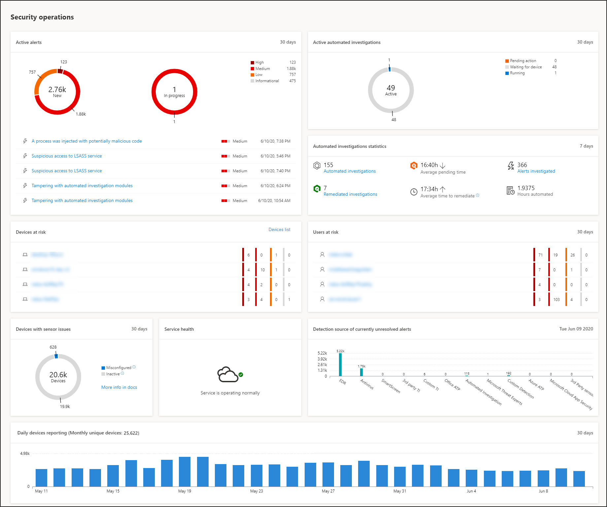
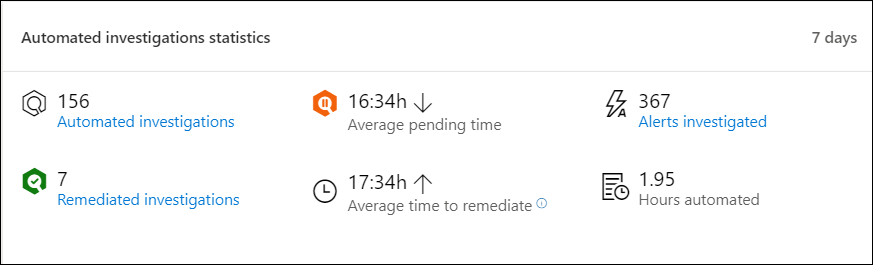

# Microsoft Defender Security Center Security Operations DashboardMicrosoft Defender Security Center Security operations dashboard

[!INCLUDE [Microsoft 365 Defender rebranding](../../includes/microsoft-defender.md)]

**Gilt für:****Applies to:**
- [Microsoft Defender für EndpunktMicrosoft Defender for Endpoint](https://go.microsoft.com/fwlink/?linkid=2154037)

>Möchten Sie Microsoft Defender for Endpoint erleben?Want to experience Microsoft Defender for Endpoint? [Registrieren Sie sich für eine kostenlose Testversion.Sign up for a free trial.](https://www.microsoft.com/microsoft-365/windows/microsoft-defender-atp?ocid=docs-wdatp-secopsdashboard-abovefoldlink) 

Im **Dashboard für Sicherheitsvorgänge** werden die Erkennungs- und Reaktionsfunktionen für Endpunkte angezeigt.The **Security operations dashboard** is where the endpoint detection and response capabilities are surfaced. Es bietet einen umfassenden Überblick darüber, wo Erkennungen angezeigt wurden, und hervorhebt, wo Reaktionsaktionen erforderlich sind.It provides a high level overview of where detections were seen and highlights where response actions are needed. 

Das Dashboard zeigt eine Momentaufnahme von:The dashboard displays a snapshot of:

- Aktive WarnungenActive alerts
- Gefährdete GeräteDevices at risk
- Sensorinte healthSensor health
- DienststatusService health
- Tägliche GeräteberichteDaily devices reporting
- Aktive automatisierte UntersuchungenActive automated investigations
- Statistiken zu automatisierten UntersuchungenAutomated investigations statistics
- Gefährdete BenutzerUsers at risk
- Verdächtige AktivitätenSuspicious activities

Sie können Warnungen und Geräte erkunden und untersuchen, um schnell zu ermitteln, ob, wo und wann verdächtige Aktivitäten in Ihrem Netzwerk aufgetreten sind, um den Kontext zu verstehen, in dem sie aufgetreten sind.You can explore and investigate alerts and devices to quickly determine if, where, and when suspicious activities occurred in your network to help you understand the context they appeared in.

Im **Dashboard für Sicherheitsvorgänge** werden aggregierte Ereignisse angezeigt, um die Identifizierung wichtiger Ereignisse oder Verhaltensweisen auf einem Gerät zu erleichtern.From the **Security operations dashboard** you will see aggregated events to facilitate the identification of significant events or behaviors on a device. Sie können auch detaillierte Informationen zu detaillierten Ereignissen und Indikatoren auf niedriger Ebene anzeigen.You can also drill down into granular events and low-level indicators.

Es verfügt auch über klickbare Kacheln, die visuelle Hinweise auf den allgemeinen Integritätsstatus Ihrer Organisation geben.It also has clickable tiles that give visual cues on the overall health state of your organization. Jede Kachel öffnet eine detaillierte Ansicht der entsprechenden Übersicht.Each tile opens a detailed view of the corresponding overview.

## Aktive WarnungenActive alerts
Sie können die Gesamtzahl der aktiven Warnungen aus den letzten 30 Tagen in Ihrem Netzwerk über die Kachel anzeigen.You can view the overall number of active alerts from the last 30 days in your network from the tile. Warnungen werden in **Neu und** In **Bearbeitung gruppieren.**Alerts are grouped into **New** and **In progress**.

Jede Gruppe wird in die entsprechenden Warnungsschweregrade unter kategorisiert.Each group is further sub-categorized into their corresponding alert severity levels. Klicken Sie auf die Anzahl der Warnungen in den einzelnen Warnungsringen, um eine sortierte Ansicht der Warteschlange dieser Kategorie anzuzeigen (**Neu** oder **In Bearbeitung**).Click the number of alerts inside each alert ring to see a sorted view of that category's queue (**New** or **In progress**).

Weitere Informationen finden Sie unter [Alerts overview](alerts-queue.md).For more information see, [Alerts overview](alerts-queue.md).

Jede Zeile enthält eine Kategorie für den Warnungsschweregrad und eine kurze Beschreibung der Warnung.Each row includes an alert severity category and a short description of the alert. Sie können auf eine Warnung klicken, um die detaillierte Ansicht zu sehen.You can click an alert to see its detailed view. Weitere Informationen finden Sie unter  [Investigate Microsoft Defender for Endpoint alerts](investigate-alerts.md) and Alerts [overview](alerts-queue.md).For more information see,  [Investigate Microsoft Defender for Endpoint alerts](investigate-alerts.md) and [Alerts overview](alerts-queue.md).

## Gefährdete GeräteDevices at risk
Diese Kachel zeigt eine Liste der Geräte mit der höchsten Anzahl aktiver Warnungen.This tile shows you a list of devices with the highest number of active alerts. Die Gesamtanzahl der Warnungen für jedes Gerät wird in einem Kreis neben dem Gerätenamen angezeigt und dann weiter nach Schweregraden am ende der Kachel kategorisiert (zeigen Sie auf jeden Schweregradbalken, um dessen Bezeichnung anzuzeigen).The total number of alerts for each device is shown in a circle next to the device name, and then further categorized by severity levels at the far end of the tile (hover over each severity bar to see its label).

Klicken Sie auf den Namen des Geräts, um Details zu diesem Gerät anzuzeigen.Click the name of the device to see details about that device. Weitere Informationen finden Sie unter [Untersuchen von Geräten in der Liste Microsoft Defender for Endpoint Devices](investigate-machines.md).For more information see, [Investigate devices in the Microsoft Defender for Endpoint Devices list](investigate-machines.md).

Sie können auch oben auf **der** Kachel auf Geräteliste klicken, um direkt zur Geräteliste **zu** wechseln, sortiert nach der Anzahl der aktiven Warnungen.You can also click **Devices list** at the top of the tile to go directly to the **Devices list**, sorted by the number of active alerts. Weitere Informationen finden Sie unter [Untersuchen von Geräten in der Liste Microsoft Defender for Endpoint Devices](investigate-machines.md).For more information see, [Investigate devices in the Microsoft Defender for Endpoint Devices list](investigate-machines.md).

## Geräte mit SensorproblemenDevices with sensor issues
Die **Kachel Geräte mit Sensorproblemen** enthält Informationen zur Fähigkeit des einzelnen Geräts, Sensordaten für den Microsoft Defender for Endpoint-Dienst zur Verfügung zu stellen.The **Devices with sensor issues** tile provides information on the individual device’s ability to provide sensor data to the Microsoft Defender for Endpoint service. Es berichtet, wie viele Geräte Aufmerksamkeit erfordern und hilft Ihnen, problematische Geräte zu identifizieren.It reports how many devices require attention and helps you identify problematic devices.

Es gibt zwei Statusindikatoren, die Informationen zur Anzahl der Geräte bereitstellen, die dem Dienst nicht ordnungsgemäß melden:There are two status indicators that provide information on the number of devices that are not reporting properly to the service:
- **Falsch konfiguriert –** Diese Geräte melden möglicherweise teilweise Sensordaten an den Microsoft Defender for Endpoint-Dienst und können Konfigurationsfehler haben, die korrigiert werden müssen.**Misconfigured** – These devices might partially be reporting sensor data to the Microsoft Defender for Endpoint service and might have configuration errors that need to be corrected.
- **Inaktiv** – Geräte, die die Berichterstellung an den Microsoft Defender for Endpoint-Dienst im letzten Monat für mehr als sieben Tage beendet haben.**Inactive** - Devices that have stopped reporting to the Microsoft Defender for Endpoint service for more than seven days in the past month.

Wenn Sie auf eine der Gruppen klicken, werden Sie zu der Geräteliste geleitet, die nach Ihrer Wahl gefiltert wird.When you click any of the groups, you’ll be directed to devices list, filtered according to your choice. Weitere Informationen finden Sie unter [Überprüfen des Sensorstatus und](check-sensor-status.md) Untersuchen von [Geräten](investigate-machines.md).For more information, see [Check sensor state](check-sensor-status.md) and [Investigate devices](investigate-machines.md).

## DienststatusService health
Die **Kachel Dienstintehzustand** informiert Sie, ob der Dienst aktiv ist oder probleme auftreten.The **Service health** tile informs you if the service is active or if there are issues.

Weitere Informationen zum Dienstzustand finden Sie unter [Überprüfen der Integrität des Microsoft Defender for Endpoint-Diensts](service-status.md).For more information on the service health, see [Check the Microsoft Defender for Endpoint service health](service-status.md).

## Tägliche GeräteberichteDaily devices reporting
Die **Kachel Tägliche Gerätebericht** zeigt ein Balkendiagramm, das die Anzahl der Täglichen Berichte in den letzten 30 Tagen darstellt.The **Daily devices reporting** tile shows a bar graph that represents the number of devices reporting daily in the last 30 days. Zeigen Sie auf einzelne Balken im Diagramm, um die genaue Anzahl der Geräte anzuzeigen, die jeden Tag berichten.Hover over individual bars on the graph to see the exact number of devices reporting in each day.

## Aktive automatisierte UntersuchungenActive automated investigations
Sie können die Gesamtzahl der automatisierten Untersuchungen aus den letzten 30 Tagen in Ihrem Netzwerk auf der **Kachel Aktive automatisierte Untersuchungen** anzeigen.You can view the overall number of automated investigations from the last 30 days in your network from the **Active automated investigations** tile. Untersuchungen werden in **ausstehende** Aktion, **Warten auf Gerät** und Ausführen **gruppieren.**Investigations are grouped into **Pending action**, **Waiting for device**, and **Running**.

## Statistiken zu automatisierten UntersuchungenAutomated investigations statistics
Diese Kachel zeigt Statistiken zu automatisierten Untersuchungen in den letzten sieben Tagen.This tile shows statistics related to automated investigations in the last seven days. Sie zeigt die Anzahl der abgeschlossenen Untersuchungen, die Anzahl der erfolgreich behobenen Untersuchungen, die durchschnittliche Ausstehendzeit für die Untersuchung, die durchschnittliche Zeit für die Behebung einer Warnung, die Anzahl der untersuchten Warnungen und die Anzahl der Stunden automatisierung, die bei einer typischen manuellen Untersuchung gespeichert wurden.It shows the number of investigations completed, the number of successfully remediated investigations, the average pending time it takes for an investigation to be initiated, the average time it takes to remediate an alert, the number of alerts investigated, and the number of hours of automation saved from a typical manual investigation. 

Sie können auf **Automatisierte** **Untersuchungen,** Nachgefilterte Untersuchungen und  **untersuchte Warnungen** klicken, um zur Seite Untersuchungen zu navigieren, gefiltert nach der entsprechenden Kategorie.You can click on **Automated investigations**, **Remediated investigations**, and **Alerts investigated** to navigate to the **Investigations** page, filtered by the appropriate category. Auf diese Weise können Sie eine detaillierte Aufschlüsselung der Untersuchungen im Kontext sehen.This lets you see a detailed breakdown of investigations in context.

## Gefährdete BenutzerUsers at risk
Die Kachel zeigt eine Liste der Benutzerkonten mit den aktivsten Warnungen und der Anzahl der Warnungen, die bei hohen, mittleren oder niedrigen Warnungen angezeigt werden.The tile shows you a list of user accounts with the most active alerts and the number of alerts seen on high, medium, or low alerts. 

Klicken Sie auf das Benutzerkonto, um Details zum Benutzerkonto anzuzeigen.Click the user account to see details about the user account. Weitere Informationen finden Sie [unter Untersuchen eines Benutzerkontos](investigate-user.md).For more information see [Investigate a user account](investigate-user.md).

>Möchten Sie Microsoft Defender for Endpoint erleben?Want to experience Microsoft Defender for Endpoint? [Registrieren Sie sich für eine kostenlose Testversion.Sign up for a free trial.](https://www.microsoft.com/microsoft-365/windows/microsoft-defender-atp?ocid=docs-wdatp-secopsdashboard-belowfoldlink)

## Verwandte ThemenRelated topics
- [Verstehen des Microsoft Defender for Endpoint-PortalsUnderstand the Microsoft Defender for Endpoint portal](use.md)
- [PortalübersichtPortal overview](portal-overview.md)
- [Anzeigen des Dashboards & BedrohungsrisikoverwaltungView the Threat & Vulnerability Management dashboard](tvm-dashboard-insights.md)
- [Anzeigen des Dashboards für die Bedrohungsanalyse und Ergreifen empfohlener GegenmaßnahmenView the Threat analytics dashboard and take recommended mitigation actions](threat-analytics.md)
