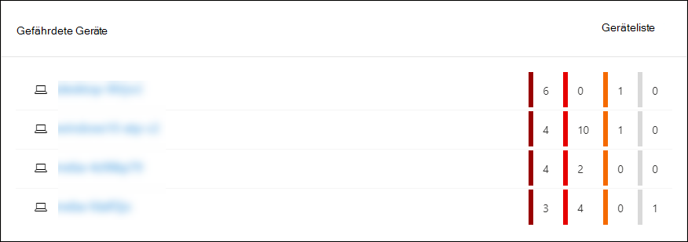
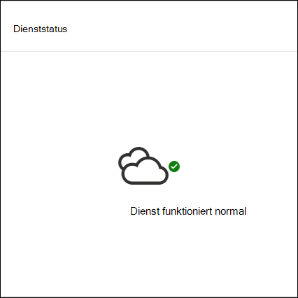
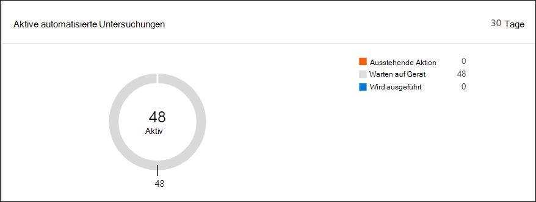
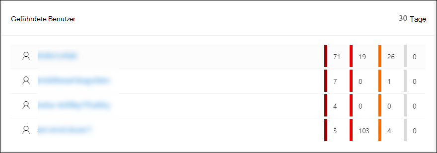

# Microsoft Defender Security Center Security Operations Dashboard

[!INCLUDE [Microsoft 365 Defender rebranding](../../includes/microsoft-defender.md)]

**Gilt für:**
- [Microsoft Defender für Endpunkt](https://go.microsoft.com/fwlink/?linkid=2154037)

>Möchten Sie Microsoft Defender for Endpoint erleben? [Registrieren Sie sich für eine kostenlose Testversion.](https://www.microsoft.com/microsoft-365/windows/microsoft-defender-atp?ocid=docs-wdatp-secopsdashboard-abovefoldlink) 

Im **Dashboard für Sicherheitsvorgänge** werden die Erkennungs- und Reaktionsfunktionen für Endpunkte angezeigt. Es bietet einen umfassenden Überblick darüber, wo Erkennungen angezeigt wurden, und hervorhebt, wo Reaktionsaktionen erforderlich sind. 

Das Dashboard zeigt eine Momentaufnahme von:

- Aktive Warnungen
- Gefährdete Geräte
- Sensorinte health
- Dienststatus
- Tägliche Geräteberichte
- Aktive automatisierte Untersuchungen
- Statistiken zu automatisierten Untersuchungen
- Gefährdete Benutzer
- Verdächtige Aktivitäten

Sie können Warnungen und Geräte erkunden und untersuchen, um schnell zu ermitteln, ob, wo und wann verdächtige Aktivitäten in Ihrem Netzwerk aufgetreten sind, um den Kontext zu verstehen, in dem sie aufgetreten sind.

Im **Dashboard für Sicherheitsvorgänge** werden aggregierte Ereignisse angezeigt, um die Identifizierung wichtiger Ereignisse oder Verhaltensweisen auf einem Gerät zu erleichtern. Sie können auch detaillierte Informationen zu detaillierten Ereignissen und Indikatoren auf niedriger Ebene anzeigen.

Es verfügt auch über klickbare Kacheln, die visuelle Hinweise auf den allgemeinen Integritätsstatus Ihrer Organisation geben. Jede Kachel öffnet eine detaillierte Ansicht der entsprechenden Übersicht.

## Aktive Warnungen
Sie können die Gesamtzahl der aktiven Warnungen aus den letzten 30 Tagen in Ihrem Netzwerk über die Kachel anzeigen. Warnungen werden in **Neu und** In **Bearbeitung gruppieren.**

Jede Gruppe wird in die entsprechenden Warnungsschweregrade unter kategorisiert. Klicken Sie auf die Anzahl der Warnungen in den einzelnen Warnungsringen, um eine sortierte Ansicht der Warteschlange dieser Kategorie anzuzeigen (**Neu** oder **In Bearbeitung**).

Weitere Informationen finden Sie unter [Alerts overview](alerts-queue.md).

Jede Zeile enthält eine Kategorie für den Warnungsschweregrad und eine kurze Beschreibung der Warnung. Sie können auf eine Warnung klicken, um die detaillierte Ansicht zu sehen. Weitere Informationen finden Sie unter  [Investigate Microsoft Defender for Endpoint alerts](investigate-alerts.md) and Alerts [overview](alerts-queue.md).

## Gefährdete Geräte
Diese Kachel zeigt eine Liste der Geräte mit der höchsten Anzahl aktiver Warnungen. Die Gesamtanzahl der Warnungen für jedes Gerät wird in einem Kreis neben dem Gerätenamen angezeigt und dann weiter nach Schweregraden am ende der Kachel kategorisiert (zeigen Sie auf jeden Schweregradbalken, um dessen Bezeichnung anzuzeigen).

Klicken Sie auf den Namen des Geräts, um Details zu diesem Gerät anzuzeigen. Weitere Informationen finden Sie unter [Untersuchen von Geräten in der Liste Microsoft Defender for Endpoint Devices](investigate-machines.md).

Sie können auch oben auf **der** Kachel auf Geräteliste klicken, um direkt zur Geräteliste **zu** wechseln, sortiert nach der Anzahl der aktiven Warnungen. Weitere Informationen finden Sie unter [Untersuchen von Geräten in der Liste Microsoft Defender for Endpoint Devices](investigate-machines.md).

## Geräte mit Sensorproblemen
Die **Kachel Geräte mit Sensorproblemen** enthält Informationen zur Fähigkeit des einzelnen Geräts, Sensordaten für den Microsoft Defender for Endpoint-Dienst zur Verfügung zu stellen. Es berichtet, wie viele Geräte Aufmerksamkeit erfordern und hilft Ihnen, problematische Geräte zu identifizieren.

Es gibt zwei Statusindikatoren, die Informationen zur Anzahl der Geräte bereitstellen, die dem Dienst nicht ordnungsgemäß melden:
- **Falsch konfiguriert –** Diese Geräte melden möglicherweise teilweise Sensordaten an den Microsoft Defender for Endpoint-Dienst und können Konfigurationsfehler haben, die korrigiert werden müssen.
- **Inaktiv** – Geräte, die die Berichterstellung an den Microsoft Defender for Endpoint-Dienst im letzten Monat für mehr als sieben Tage beendet haben.

Wenn Sie auf eine der Gruppen klicken, werden Sie zu der Geräteliste geleitet, die nach Ihrer Wahl gefiltert wird. Weitere Informationen finden Sie unter [Überprüfen des Sensorstatus und](check-sensor-status.md) Untersuchen von [Geräten](investigate-machines.md).

## Dienststatus
Die **Kachel Dienstintehzustand** informiert Sie, ob der Dienst aktiv ist oder probleme auftreten.

Weitere Informationen zum Dienstzustand finden Sie unter [Überprüfen der Integrität des Microsoft Defender for Endpoint-Diensts](service-status.md).

## Tägliche Geräteberichte
Die **Kachel Tägliche Gerätebericht** zeigt ein Balkendiagramm, das die Anzahl der Täglichen Berichte in den letzten 30 Tagen darstellt. Zeigen Sie auf einzelne Balken im Diagramm, um die genaue Anzahl der Geräte anzuzeigen, die jeden Tag berichten.

## Aktive automatisierte Untersuchungen
Sie können die Gesamtzahl der automatisierten Untersuchungen aus den letzten 30 Tagen in Ihrem Netzwerk auf der **Kachel Aktive automatisierte Untersuchungen** anzeigen. Untersuchungen werden in **ausstehende** Aktion, **Warten auf Gerät** und Ausführen **gruppieren.**

## Statistiken zu automatisierten Untersuchungen
Diese Kachel zeigt Statistiken zu automatisierten Untersuchungen in den letzten sieben Tagen. Sie zeigt die Anzahl der abgeschlossenen Untersuchungen, die Anzahl der erfolgreich behobenen Untersuchungen, die durchschnittliche Ausstehendzeit für die Untersuchung, die durchschnittliche Zeit für die Behebung einer Warnung, die Anzahl der untersuchten Warnungen und die Anzahl der Stunden automatisierung, die bei einer typischen manuellen Untersuchung gespeichert wurden. 

Sie können auf **Automatisierte** **Untersuchungen,** Nachgefilterte Untersuchungen und  **untersuchte Warnungen** klicken, um zur Seite Untersuchungen zu navigieren, gefiltert nach der entsprechenden Kategorie. Auf diese Weise können Sie eine detaillierte Aufschlüsselung der Untersuchungen im Kontext sehen.

## Gefährdete Benutzer
Die Kachel zeigt eine Liste der Benutzerkonten mit den aktivsten Warnungen und der Anzahl der Warnungen, die bei hohen, mittleren oder niedrigen Warnungen angezeigt werden. 

Klicken Sie auf das Benutzerkonto, um Details zum Benutzerkonto anzuzeigen. Weitere Informationen finden Sie [unter Untersuchen eines Benutzerkontos](investigate-user.md).

>Möchten Sie Microsoft Defender for Endpoint erleben? [Registrieren Sie sich für eine kostenlose Testversion.](https://www.microsoft.com/microsoft-365/windows/microsoft-defender-atp?ocid=docs-wdatp-secopsdashboard-belowfoldlink)

## Verwandte Themen
- [Verstehen des Microsoft Defender for Endpoint-Portals](use.md)
- [Portalübersicht](portal-overview.md)
- [Anzeigen des Dashboards & Bedrohungsrisikoverwaltung](tvm-dashboard-insights.md)
- [Anzeigen des Dashboards für die Bedrohungsanalyse und Ergreifen empfohlener Gegenmaßnahmen](threat-analytics.md)
