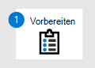

# Migrieren von Symantec – Phase 3: Onboarding zu Microsoft Defender for Endpoint

**Gilt für:**
- [Microsoft Defender für Endpunkt](https://go.microsoft.com/fwlink/p/?linkid=2146631)
- [Microsoft 365 Defender](https://go.microsoft.com/fwlink/?linkid=2118804)

| [Phase 1: Vorbereiten](symantec-to-microsoft-defender-atp-prepare.md) | [Phase 2: Einrichten](symantec-to-microsoft-defender-atp-setup.md) | Phase 3: Onboarding |
|--|--|--|
|| |*Sie sind hier!* |

**Willkommen bei Phase 3 der [Migration von Symantec zu Microsoft Defender for Endpoint](symantec-to-microsoft-defender-atp-migration.md#the-migration-process)**. Diese Migrationsphase umfasst die folgenden Schritte:

1. [Onboarding von Geräten in Microsoft Defender for Endpoint](#onboard-devices-to-microsoft-defender-for-endpoint).
2. [Führen Sie einen Erkennungstest aus.](#run-a-detection-test)
3. [Deinstallieren Von Symantec](#uninstall-symantec).
4. [Stellen Sie sicher, dass sich Microsoft Defender for Endpoint im aktiven Modus befindet.](#make-sure-microsoft-defender-for-endpoint-is-in-active-mode)

## Onboarding von Geräten in Microsoft Defender for Endpoint

1. Wechseln Sie zum Microsoft Defender Security Center ( [https://aka.ms/MDATPportal](https://aka.ms/MDATPportal) ) und melden Sie sich an.
2. Wählen **Sie Einstellungen**  >  **Geräteverwaltung**  >  **Onboarding aus.** 
3. Wählen Sie **in der Liste Betriebssystem zum Starten des Onboardingprozesses** auswählen ein Betriebssystem aus. 
4. Wählen **Sie unter Bereitstellungsmethode** eine Option aus. Folgen Sie den Links und Aufforderungen zum Onboarding der Geräte Ihrer Organisation. Benötigen Sie Hilfe? Weitere [Informationen finden Sie unter Onboarding-Methoden](#onboarding-methods) (in diesem Artikel).

### Onboardingmethoden
 
Die Bereitstellungsmethoden variieren, je nachdem, welches Betriebssystem ausgewählt ist. Weitere Informationen zum Onboarding finden Sie in den ressourcen, die in der folgenden Tabelle aufgeführt sind.

|Betriebssystem  |Methode  |
|---------|---------|
|Windows 10     |- [Gruppenrichtlinie](configure-endpoints-gp.md) - [Configuration Manager](configure-endpoints-sccm.md) - [Verwaltung mobiler Geräte (Intune)](configure-endpoints-mdm.md) - [Lokales Skript](configure-endpoints-script.md)   **HINWEIS:** Ein lokales Skript eignet sich für einen Nachweis des Konzepts, sollte jedoch nicht für die Produktionsbereitstellung verwendet werden. Für eine Produktionsbereitstellung wird die Verwendung von Gruppenrichtlinien, Microsoft Endpoint Configuration Manager oder Intune empfohlen.         |
|- Windows 8.1 Enterprise  - Windows 8.1 Pro  - Windows 7 SP1 Enterprise  - Windows 7 SP1 Pro     | [Microsoft Monitoring Agent](onboard-downlevel.md#install-and-configure-microsoft-monitoring-agent-mma-to-report-sensor-data-to-microsoft-defender-for-endpoint)  **HINWEIS:** Microsoft Monitoring Agent ist jetzt Azure Log Analytics Agent. Weitere Informationen finden Sie unter [Log Analytics Agent Overview](https://docs.microsoft.com/azure/azure-monitor/platform/log-analytics-agent).        |
|– Windows Server 2019 und höher  - Windows Server 2019 Core Edition  – Windows Server, Version 1803 und höher |- [Lokales Skript](configure-endpoints-script.md)  - [Gruppenrichtlinie](configure-endpoints-gp.md)  - [Configuration Manager](/configure-endpoints-sccm.md)  - [System Center Configuration Manager](configure-endpoints-sccm.md#onboard-devices-using-system-center-configuration-manager) - [VDI-Onboardingskripts für nicht persistente Geräte](configure-endpoints-vdi.md)   **HINWEIS:** Ein lokales Skript eignet sich für einen Nachweis des Konzepts, sollte jedoch nicht für die Produktionsbereitstellung verwendet werden. Für eine Produktionsbereitstellung wird die Verwendung von Gruppenrichtlinien, Microsoft Endpoint Configuration Manager oder Intune empfohlen.    |
|- Windows Server 2016  - Windows Server 2012 R2  - Windows Server 2008 R2 SP1  |- [Microsoft Defender Security Center](configure-server-endpoints.md) - [Azure Security Center](https://docs.microsoft.com/azure/security-center/security-center-wdatp) |
|macOS - 10.15 (Catalina) - 10.14 (Mojave) - 10.13 (High Sierra)  iOS  Linux: - RHEL 7.2+ - CentOS Linux 7.2+ - Ubuntu 16 LTS oder höher LTS - SLES 12+ - Debian 9+ - Oracle Linux 7.2 |[Onboarding von Nicht-Windows-Geräten](configure-endpoints-non-windows.md)  |

## Ausführen eines Erkennungstests

Um sicherzustellen, dass Ihre integrierten Geräte ordnungsgemäß mit Microsoft Defender for Endpoint verbunden sind, können Sie einen Erkennungstest ausführen.

|Betriebssystem  |Richtlinien  |
|---------|---------|
|- Windows 10  - Windows Server 2019  - Windows Server, Version 1803  - Windows Server 2016  - Windows Server 2012 R2     |Weitere [Informationen finden Sie unter Ausführen eines Erkennungstests.](run-detection-test.md)   Besuchen Sie die Microsoft Defender for Endpoint-Demoszenarien-Website ( ) und testen Sie eines [https://demo.wd.microsoft.com](https://demo.wd.microsoft.com) oder mehrere der Szenarien. Testen Sie beispielsweise das **Demoszenario für den Cloud-zugestellten** Schutz.         |
|macOS - 10.15 (Catalina) - 10.14 (Mojave) - 10.13 (High Sierra)     |Laden Sie die HEIMWERKER-App unter herunter und verwenden Sie [https://aka.ms/mdatpmacosdiy](https://aka.ms/mdatpmacosdiy) sie.   Weitere Informationen finden Sie unter [Microsoft Defender for Endpoint für Mac](microsoft-defender-endpoint-mac.md).        |
|Linux: - RHEL 7.2+ - CentOS Linux 7.2+ - Ubuntu 16 LTS oder höher LTS - SLES 12+ - Debian 9+ - Oracle Linux 7.2 |1. Führen Sie den folgenden Befehl aus, und suchen Sie nach einem Ergebnis von **1:**  `mdatp health --field real_time_protection_enabled`.   2. Öffnen Sie ein Terminalfenster, und führen Sie den folgenden Befehl aus:  `curl -o ~/Downloads/eicar.com.txt https://www.eicar.org/download/eicar.com.txt`.   3. Führen Sie den folgenden Befehl aus, um erkannte Bedrohungen auflisten:  `mdatp threat list`.   Weitere Informationen finden Sie unter [Microsoft Defender for Endpoint for Linux](microsoft-defender-endpoint-linux.md). |

## Deinstallieren von Symantec

Nachdem Sie die Geräte Ihrer Organisation in Microsoft Defender for Endpoint integrierte haben, besteht Der nächste Schritt in der Deinstallation von Symantec.

1. [Deaktivieren Sie den Manipulationsschutz](https://knowledge.broadcom.com/external/article?legacyId=tech192023) in Symantec.
2. Löschen Des Deinstallierekennworts für Symantec: 
   1. Öffnen Sie auf Ihren Windows-Geräten den Registrierungs-Editor als Administrator.
   2. Wechseln Sie zu `HKEY_LOCAL_MACHINE\SOFTWARE\Symantec\Symantec Endpoint Protection\SMC`.
   3. Suchen Sie nach einem Eintrag namens **SmcInstData**. 
   4. Klicken Sie mit der rechten Maustaste auf das Element, und wählen Sie **dann Löschen aus.** 
3. Entfernen Sie Symantec von Ihren Geräten. Wenn Sie Hilfe dazu benötigen, lesen Sie die Broadcom-Dokumentation. Hier sind einige Broadcom-Ressourcen: 
   - [Deinstallieren von Symantec Endpoint Protection](https://knowledge.broadcom.com/external/article/156148/uninstall-symantec-endpoint-protection.html)
   - Windows-Geräte: [Endpoint Protection 14-Clients unter Windows manuell deinstallieren](https://knowledge.broadcom.com/external/article?articleId=170040)
   - macOS-Computer: [Entfernen der Symantec-Software für Mac mithilfe von RemoveSymantecMacFiles](https://knowledge.broadcom.com/external/article?articleId=151387)
   - Linux-Geräte: [Häufig gestellte Fragen zu Endpoint Protection für Linux](https://knowledge.broadcom.com/external/article?articleId=162054)

## Stellen Sie sicher, dass sich Microsoft Defender for Endpoint im aktiven Modus befindet

Nachdem Sie Symantec deinstalliert haben, müssen Sie im nächsten Schritt sicherstellen, dass Microsoft Defender Antivirus und Microsoft Defender for Endpoint aktiviert und im aktiven Modus sind.

Besuchen Sie dazu die Microsoft Defender for Endpoint-Demoszenarien-Website ( [https://demo.wd.microsoft.com](https://demo.wd.microsoft.com) ). Testen Sie mindestens eines der Demoszenarien auf dieser Seite, einschließlich mindestens der folgenden:
- In der Cloud zugestellter Schutz
- Potenziell unerwünschte Anwendungen (PUA)
- Network Protection (NP)

> [!IMPORTANT]
> Wenn Sie Windows Server 2016 verwenden, müssen Sie Microsoft Defender Antivirus möglicherweise manuell starten. Dazu verwenden Sie das PowerShell-Cmdlet `mpcmdrun.exe -wdenable` auf dem Gerät.

## Nächste Schritte

**Herzlichen Glückwunsch!** Sie haben die Migration [von Symantec zu Microsoft Defender for Endpoint abgeschlossen!](symantec-to-microsoft-defender-atp-migration.md#the-migration-process) 
- [Besuchen Sie Ihr Sicherheitsbetriebsdashboard](security-operations-dashboard.md) im Microsoft Defender Security Center ( [https://aka.ms/MDATPportal](https://aka.ms/MDATPportal) ). 
- [Verwalten von Microsoft Defender for Endpoint, post migration](manage-atp-post-migration.md).
