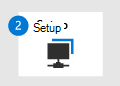

# Migrieren von Symantec – Phase 1: Vorbereiten der MigrationMigrate from Symantec - Phase 1: Prepare for your migration

**Gilt für:****Applies to:**
- [Microsoft Defender für EndpunktMicrosoft Defender for Endpoint](https://go.microsoft.com/fwlink/p/?linkid=2154037)
- [Microsoft 365 DefenderMicrosoft 365 Defender](https://go.microsoft.com/fwlink/?linkid=2118804)

| Phase 1: VorbereitenPhase 1: Prepare | [Phase 2: EinrichtenPhase 2: Set up](symantec-to-microsoft-defender-atp-setup.md) | [Phase 3: OnboardingPhase 3: Onboard](symantec-to-microsoft-defender-atp-onboard.md) |
|--|--|--|
|*Sie sind hier!**You are here!*| | |

**Willkommen bei der Vorbereitungsphase der [Migration von Symantec zu Microsoft Defender for Endpoint](symantec-to-microsoft-defender-endpoint-migration.md#the-migration-process)**.**Welcome to the Prepare phase of [migrating from Symantec to Microsoft Defender for Endpoint](symantec-to-microsoft-defender-endpoint-migration.md#the-migration-process)**. 

Diese Migrationsphase umfasst die folgenden Schritte:This migration phase includes the following steps:
1. [Microsoft Defender for Endpoint .](#get-microsoft-defender-for-endpoint)[Get Microsoft Defender for Endpoint](#get-microsoft-defender-for-endpoint).
2. [Gewähren von Zugriff auf das Microsoft Defender Security Center](#grant-access-to-the-microsoft-defender-security-center).[Grant access to the Microsoft Defender Security Center](#grant-access-to-the-microsoft-defender-security-center).
3. [Konfigurieren von Geräteproxy- und Internetkonnektivitätseinstellungen](#configure-device-proxy-and-internet-connectivity-settings).[Configure device proxy and internet connectivity settings](#configure-device-proxy-and-internet-connectivity-settings).

## Microsoft Defender for Endpoint erhaltenGet Microsoft Defender for Endpoint

Für die ersten Schritte müssen Sie Microsoft Defender for Endpoint mit zugewiesenen und bereitgestellten Lizenzen haben.To get started, you must have Microsoft Defender for Endpoint, with licenses assigned and provisioned.

1. Kaufen oder testen Sie Microsoft Defender for Endpoint noch heute.Buy or try Microsoft Defender for Endpoint today. [Besuchen Sie Microsoft Defender for Endpoint, um eine kostenlose Testversion zu starten oder ein Angebot an.](https://aka.ms/mdatp)[Visit Microsoft Defender for Endpoint to start a free trial or request a quote](https://aka.ms/mdatp). 
2. Stellen Sie sicher, dass Ihre Lizenzen ordnungsgemäß bereitgestellt sind.Verify that your licenses are properly provisioned. [Überprüfen Sie den Lizenzstatus](https://docs.microsoft.com/microsoft-365/security/defender-endpoint/production-deployment#check-license-state).[Check your license state](https://docs.microsoft.com/microsoft-365/security/defender-endpoint/production-deployment#check-license-state).
3. Richten Sie als globaler Administrator oder Sicherheitsadministrator Ihre dedizierte Cloudinstanz von Microsoft Defender for Endpoint ein.As a global administrator or security administrator, set up your dedicated cloud instance of Microsoft Defender for Endpoint. Weitere Informationen finden Sie unter [Microsoft Defender for Endpoint setup: Tenant configuration](https://docs.microsoft.com/microsoft-365/security/defender-endpoint/production-deployment#tenant-configuration).See [Microsoft Defender for Endpoint setup: Tenant configuration](https://docs.microsoft.com/microsoft-365/security/defender-endpoint/production-deployment#tenant-configuration).
4. Wenn Endpunkte (z. B. Geräte) in Ihrer Organisation einen Proxy für den Zugriff auf das Internet verwenden, finden Sie weitere Informationen unter [Microsoft Defender for Endpoint setup: Network configuration](https://docs.microsoft.com/microsoft-365/security/defender-endpoint/production-deployment#network-configuration).If endpoints (such as devices) in your organization use a proxy to access the internet, see [Microsoft Defender for Endpoint setup: Network configuration](https://docs.microsoft.com/microsoft-365/security/defender-endpoint/production-deployment#network-configuration).
 
An diesem Punkt sind Sie bereit, Ihren Sicherheitsadministratoren und Sicherheitsoperatoren, die das Microsoft Defender Security Center ( ) verwenden, Zugriff zu [https://aka.ms/MDATPportal](https://aka.ms/MDATPportal) gewähren.At this point, you are ready to grant access to your security administrators and security operators who will use the Microsoft Defender Security Center ([https://aka.ms/MDATPportal](https://aka.ms/MDATPportal)). 

> [!NOTE]
> Das Microsoft Defender Security Center wird manchmal als Microsoft Defender for Endpoint-Portal bezeichnet.The Microsoft Defender Security Center is sometimes referred to as the Microsoft Defender for Endpoint portal. 

## Gewähren von Zugriff auf das Microsoft Defender Security CenterGrant access to the Microsoft Defender Security Center

Im Microsoft Defender Security Center ( ) können Sie auf Features und Funktionen von Microsoft Defender for Endpoint zugreifen und [https://aka.ms/MDATPportal](https://aka.ms/MDATPportal) diese konfigurieren.The Microsoft Defender Security Center ([https://aka.ms/MDATPportal](https://aka.ms/MDATPportal)) is where you access and configure features and capabilities of Microsoft Defender for Endpoint. Weitere Informationen finden Sie [unter Übersicht über das Microsoft Defender Security Center](https://docs.microsoft.com/microsoft-365/security/defender-endpoint/use).To learn more, see [Overview of the Microsoft Defender Security Center](https://docs.microsoft.com/microsoft-365/security/defender-endpoint/use).

Berechtigungen für das Microsoft Defender Security Center können entweder mithilfe grundlegender Berechtigungen oder rollenbasierter Zugriffssteuerung (RBAC) erteilt werden.Permissions to the Microsoft Defender Security Center can be granted by using either basic permissions or role-based access control (RBAC). Es wird empfohlen, rbAC zu verwenden, damit Sie eine genauere Kontrolle über Berechtigungen haben.We recommend using RBAC so that you have more granular control over permissions.

1. Planen Sie die Rollen und Berechtigungen für Ihre Sicherheitsadministratoren und Sicherheitsoperatoren.Plan the roles and permissions for your security administrators and security operators. Weitere Informationen finden Sie unter [Rollenbasierte Zugriffssteuerung](https://docs.microsoft.com/microsoft-365/security/defender-endpoint/prepare-deployment#role-based-access-control).See [Role-based access control](https://docs.microsoft.com/microsoft-365/security/defender-endpoint/prepare-deployment#role-based-access-control).
2. Einrichten und Konfigurieren von RBAC.Set up and configure RBAC. Es wird empfohlen, [Intune](https://docs.microsoft.com/mem/intune/fundamentals/what-is-intune) zum Konfigurieren von RBAC zu verwenden, insbesondere wenn Ihre Organisation eine Kombination aus Windows 10-, macOS-, iOS- und Android-Geräten verwendet.We recommend using [Intune](https://docs.microsoft.com/mem/intune/fundamentals/what-is-intune) to configure RBAC, especially if your organization is using a combination of Windows 10, macOS, iOS, and Android devices. Weitere [Informationen finden Sie unter Einrichten von RBAC mithilfe von Intune](https://docs.microsoft.com/mem/intune/fundamentals/role-based-access-control).See [setting up RBAC using Intune](https://docs.microsoft.com/mem/intune/fundamentals/role-based-access-control). 
   Wenn Ihre Organisation eine andere Methode als Intune erfordert, wählen Sie eine der folgenden Optionen aus:If your organization requires a method other than Intune, choose one of the following options:
    - [Configuration ManagerConfiguration Manager](https://docs.microsoft.com/mem/configmgr/core/servers/deploy/configure/configure-role-based-administration)
    - [Erweiterte GruppenrichtlinienverwaltungAdvanced Group Policy Management](https://docs.microsoft.com/microsoft-desktop-optimization-pack/agpm)
    - [Windows Admin CenterWindows Admin Center](https://docs.microsoft.com/windows-server/manage/windows-admin-center/overview)
3. Gewähren sie Zugriff auf das Microsoft Defender Security Center.Grant access to the Microsoft Defender Security Center. (Benötigen Sie Hilfe?(Need help? Weitere [Informationen finden Sie unter Verwalten des Portalzugriffs mithilfe von RBAC](https://docs.microsoft.com/microsoft-365/security/defender-endpoint/rbac)).See [Manage portal access using RBAC](https://docs.microsoft.com/microsoft-365/security/defender-endpoint/rbac)).

## Konfigurieren von Geräteproxy- und InternetkonnektivitätseinstellungenConfigure device proxy and internet connectivity settings

Konfigurieren Sie Proxy- und Interneteinstellungen, um die Kommunikation zwischen Ihren Geräten und Microsoft Defender for Endpoint zu aktivieren.To enable communication between your devices and Microsoft Defender for Endpoint, configure proxy and internet settings. Die folgende Tabelle enthält Links zu Ressourcen, die Sie zum Konfigurieren ihrer Proxy- und Interneteinstellungen für verschiedene Betriebssysteme und Funktionen verwenden können:The following table includes links to resources you can use to configure your proxy and internet settings for various operating systems and capabilities:

|FunktionenCapabilities  | BetriebssystemOperating System | RessourcenResources |
|:----|:----|:---|
|[Endpunkterkennung und -antwort](https://docs.microsoft.com/microsoft-365/security/defender-endpoint/overview-endpoint-detection-response) (EDR)[Endpoint detection and response](https://docs.microsoft.com/microsoft-365/security/defender-endpoint/overview-endpoint-detection-response) (EDR) |- [Windows 10](https://docs.microsoft.com/windows/release-health/release-information/)- [Windows 10](https://docs.microsoft.com/windows/release-health/release-information/)  - [Windows Server 2019](https://docs.microsoft.com/windows/release-health/status-windows-10-1809-and-windows-server-2019)- [Windows Server 2019](https://docs.microsoft.com/windows/release-health/status-windows-10-1809-and-windows-server-2019) - [Windows Server 1803 oder höher](https://docs.microsoft.com/windows-server/get-started/whats-new-in-windows-server-1803)- [Windows Server 1803 or later](https://docs.microsoft.com/windows-server/get-started/whats-new-in-windows-server-1803)  |[Konfigurieren von Computerproxy- und InternetkonnektivitätseinstellungenConfigure machine proxy and internet connectivity settings](https://docs.microsoft.com/microsoft-365/security/defender-endpoint/configure-proxy-internet) |
|EDREDR |- [Windows Server 2016](https://docs.microsoft.com/windows/release-health/status-windows-10-1607-and-windows-server-2016)- [Windows Server 2016](https://docs.microsoft.com/windows/release-health/status-windows-10-1607-and-windows-server-2016)  - [Windows Server 2012 R2](https://docs.microsoft.com/windows/release-health/status-windows-8.1-and-windows-server-2012-r2)- [Windows Server 2012 R2](https://docs.microsoft.com/windows/release-health/status-windows-8.1-and-windows-server-2012-r2) - [Windows Server 2008 R2 SP1](https://docs.microsoft.com/windows/release-health/status-windows-7-and-windows-server-2008-r2-sp1)- [Windows Server 2008 R2 SP1](https://docs.microsoft.com/windows/release-health/status-windows-7-and-windows-server-2008-r2-sp1) - [Windows 8.1](https://docs.microsoft.com/windows/release-health/status-windows-8.1-and-windows-server-2012-r2)- [Windows 8.1](https://docs.microsoft.com/windows/release-health/status-windows-8.1-and-windows-server-2012-r2) - [Windows 7 SP1](https://docs.microsoft.com/windows/release-health/status-windows-7-and-windows-server-2008-r2-sp1)- [Windows 7 SP1](https://docs.microsoft.com/windows/release-health/status-windows-7-and-windows-server-2008-r2-sp1) |[Konfigurieren von Proxy- und InternetkonnektivitätseinstellungenConfigure proxy and internet connectivity settings](https://docs.microsoft.com/microsoft-365/security/defender-endpoint/onboard-downlevel#configure-proxy-and-internet-connectivity-settings) |
|EDREDR  |macOS:macOS:  - 10.15 (Catalina)- 10.15 (Catalina) - 10.14 (Mojave)- 10.14 (Mojave)  - 10.13 (High Sierra)- 10.13 (High Sierra)  |[Microsoft Defender for Endpoint für Mac: NetzwerkverbindungenMicrosoft Defender for Endpoint for Mac: Network connections](https://docs.microsoft.com/microsoft-365/security/defender-endpoint/microsoft-defender-atp-mac#network-connections) |
|[Microsoft Defender AntivirusMicrosoft Defender Antivirus](https://docs.microsoft.com/windows/security/threat-protection/microsoft-defender-antivirus/microsoft-defender-antivirus-in-windows-10) |- [Windows 10](https://docs.microsoft.com/windows/release-health/release-information/)- [Windows 10](https://docs.microsoft.com/windows/release-health/release-information/)  - [Windows Server 2019](https://docs.microsoft.com/windows/release-health/status-windows-10-1809-and-windows-server-2019)- [Windows Server 2019](https://docs.microsoft.com/windows/release-health/status-windows-10-1809-and-windows-server-2019) - [Windows Server 1803 oder höher](https://docs.microsoft.com/windows-server/get-started/whats-new-in-windows-server-1803)- [Windows Server 1803 or later](https://docs.microsoft.com/windows-server/get-started/whats-new-in-windows-server-1803)  - [Windows Server 2016](https://docs.microsoft.com/windows-server/get-started/whats-new-in-windows-server-2016)- [Windows Server 2016](https://docs.microsoft.com/windows-server/get-started/whats-new-in-windows-server-2016) |[Konfigurieren und Validieren von Microsoft Defender Antivirus-NetzwerkverbindungenConfigure and validate Microsoft Defender Antivirus network connections](https://docs.microsoft.com/windows/security/threat-protection/microsoft-defender-antivirus/configure-network-connections-microsoft-defender-antivirus)  |
|AntivirusAntivirus |macOS:macOS:  - 10.15 (Catalina)- 10.15 (Catalina) - 10.14 (Mojave)- 10.14 (Mojave)  - 10.13 (High Sierra)- 10.13 (High Sierra) |[Microsoft -Defender for Endpoint für Mac: NetzwerkverbindungenMicrosoft -Defender for Endpoint for Mac: Network connections](https://docs.microsoft.com/microsoft-365/security/defender-endpoint/microsoft-defender-atp-mac#network-connections) |
|AntivirusAntivirus |Linux:Linux:  - RHEL 7.2+- RHEL 7.2+ - CentOS Linux 7.2+- CentOS Linux 7.2+ - Ubuntu 16 LTS oder höher LTS- Ubuntu 16 LTS, or higher LTS - SLES 12+- SLES 12+ - Debian 9+- Debian 9+ - Oracle Linux 7.2- Oracle Linux 7.2 |[Microsoft Defender for Endpoint für Linux: NetzwerkverbindungenMicrosoft Defender for Endpoint for Linux: Network connections](https://docs.microsoft.com/microsoft-365/security/defender-endpoint/microsoft-defender-atp-linux#network-connections)  |

## Nächster SchrittNext step

**Herzlichen Glückwunsch!****Congratulations**! Sie haben die **Vorbereitungsphase** der [Migration von Symantec zu Microsoft Defender for Endpoint abgeschlossen.](symantec-to-microsoft-defender-endpoint-migration.md#the-migration-process)You have completed the **Prepare** phase of [migrating from Symantec to Microsoft Defender for Endpoint](symantec-to-microsoft-defender-endpoint-migration.md#the-migration-process)!
- [Fahren Sie mit dem Einrichten von Microsoft Defender for Endpoint fort.](symantec-to-microsoft-defender-atp-setup.md)[Proceed to set up Microsoft Defender for Endpoint](symantec-to-microsoft-defender-atp-setup.md).
