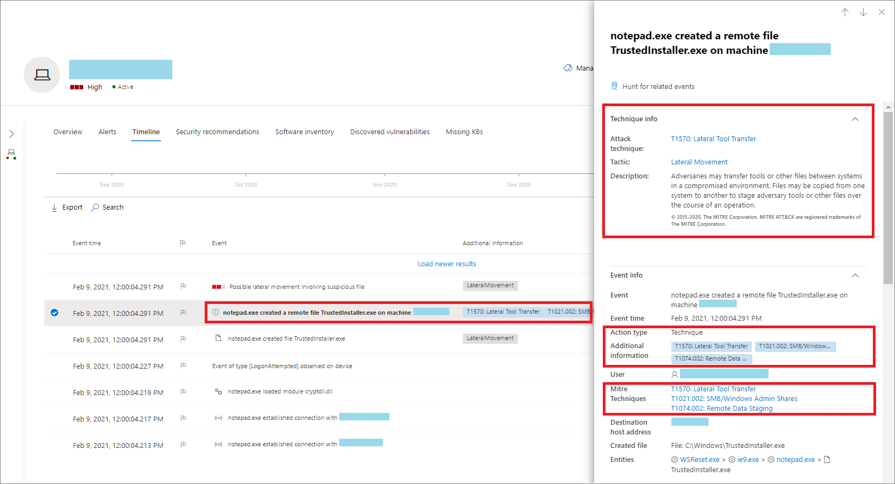

# Techniken in der GerätezeitachseTechniques in the device timeline

**Gilt für:****Applies to:**
- [Microsoft Defender für EndpunktMicrosoft Defender for Endpoint](https://go.microsoft.com/fwlink/p/?linkid=2154037)

Sie können mehr Einblick in eine Untersuchung gewinnen, indem Sie die Ereignisse analysieren, die auf einem bestimmten Gerät passiert sind.You can gain more insight in an investigation by analyzing the events that happened on a specific device. Wählen Sie zunächst das gerät von Interesse in der [Liste Geräte aus.](machines-view-overview.md)First, select the device of interest from the [Devices list](machines-view-overview.md). Auf der Geräteseite können Sie die Registerkarte **Zeitachse** auswählen, um alle Ereignisse anzuzeigen, die auf dem Gerät aufgetreten sind.On the device page, you can select the **Timeline** tab to view all the events that occurred on the device.

## Verstehen von Techniken in der ZeitachseUnderstand techniques in the timeline

>[!IMPORTANT]
>Einige Informationen beziehen sich auf ein vorab veröffentlichtes Produktfeature in der öffentlichen Vorschau, das vor der kommerziellen Veröffentlichung erheblich geändert werden kann.Some information relates to a prereleased product feature in public preview which may be substantially modified before it's commercially released. Microsoft übernimmt mit diesen Informationen keinerlei Gewährleistung, sei sie ausdrücklich oder konkludent.Microsoft makes no warranties, express or implied, with respect to the information provided here.

In Microsoft Defender for Endpoint sind **Techniken** ein zusätzlicher Datentyp in der Ereigniszeitachse.In Microsoft Defender for Endpoint, **Techniques** are an additional data type in the event timeline. Techniken bieten mehr Einblick in Aktivitäten im Zusammenhang mit [MITRE ATT&CK-Techniken](https://attack.mitre.org/) oder Untertechniken.Techniques provide more insight on activities associated with [MITRE ATT&CK](https://attack.mitre.org/) techniques or sub-techniques. 

Dieses Feature vereinfacht die Untersuchungserfahrung, indem Analysten die Aktivitäten verstehen, die auf einem Gerät beobachtet wurden.This feature simplifies the investigation experience by helping analysts understand the activities that were observed on a device. Analysten können dann entscheiden, weitere Untersuchungen zu treffen.Analysts can then decide to investigate further.

Für die öffentliche Vorschau sind Techniken standardmäßig verfügbar und werden zusammen mit Ereignissen angezeigt, wenn die Zeitachse eines Geräts angezeigt wird.For public preview, Techniques are available by default and shown together with events when a device's timeline is viewed. 

Techniken werden in fett formatiertem Text hervorgehoben und mit einem blauen Symbol auf der linken Seite angezeigt.Techniques are highlighted in bold text and appear with a blue icon on the left. Die entsprechende MITRE ATT-&CK-ID und dem Techniknamen werden auch unter Zusätzliche Informationen als Tags angezeigt.The corresponding MITRE ATT&CK ID and technique name also appear as tags under Additional information. 

Such- und Exportoptionen sind auch für Techniken verfügbar.Search and Export options are also available for Techniques.

## Untersuchen der Verwendung des SeitenbereichsInvestigate using the side pane

Wählen Sie eine Technik aus, um den entsprechenden Seitenbereich zu öffnen.Select a Technique to open its corresponding side pane. Hier finden Sie weitere Informationen und Einblicke wie verwandte ATT-&CK-Techniken, Taktiken und Beschreibungen.Here you can see additional information and insights like related ATT&CK techniques, tactics, and descriptions. 

Wählen Sie die spezifische *Angriffstechnik aus,* um die zugehörige ATT-&CK-Technikseite zu öffnen, auf der Sie weitere Informationen dazu finden.Select the specific *Attack technique* to open the related ATT&CK technique page where you can find more information about it.

Sie können die Details einer Entität kopieren, wenn rechts ein blaues Symbol angezeigt wird.You can copy an entity's details when you see a blue icon on the right. Wenn Sie beispielsweise sha1 einer verwandten Datei kopieren möchten, wählen Sie das blaue Seitensymbol aus.For instance, to copy a related file's SHA1, select the blue page icon.

Sie können dasselbe für Befehlszeilen ausführen.You can do the same for command lines.

## Untersuchen verwandter EreignisseInvestigate related events

Wenn Sie die [erweiterte Suche verwenden](advanced-hunting-overview.md) möchten, um Ereignisse im Zusammenhang mit der ausgewählten Technik zu finden, wählen Sie Hunt for related events **aus.**To use [advanced hunting](advanced-hunting-overview.md) to find events related to the selected Technique, select **Hunt for related events**. Dies führt zur erweiterten Suchseite mit einer Abfrage, um Ereignisse im Zusammenhang mit der Technik zu finden.This leads to the advanced hunting page with a query to find events related to the Technique.

>[!NOTE]
>Beim Abfragen mithilfe der Schaltfläche **"Suche** nach verwandten Ereignissen" aus einem Seitenbereich Technik werden alle Ereignisse im Zusammenhang mit der identifizierten Technik angezeigt, die Technik selbst wird jedoch nicht in die Abfrageergebnisse ein.Querying using the **Hunt for related events** button from a Technique side pane displays all the events related to the identified technique but does not include the Technique itself in the query results.

## Anpassen der GerätezeitachseCustomize your device timeline

Auf der oberen rechten Seite der Gerätezeitachse können Sie einen Datumsbereich auswählen, um die Anzahl der Ereignisse und Techniken auf der Zeitachse zu begrenzen.On the upper right-hand side of the device timeline, you can choose a date range to limit the number of events and techniques in the timeline. 

Sie können anpassen, welche Spalten verfügbar gemacht werden sollen.You can customize which columns to expose. Sie können auch nach gekennzeichneten Ereignissen nach Datentyp oder Ereignisgruppe filtern.You can also filter for flagged events by data type or by event group.

### Spalten auswählen, die verfügbar gemacht werden sollenChoose columns to expose
Sie können auswählen, welche Spalten in der Zeitachse verfügbar gemacht werden sollen, indem Sie die **Schaltfläche Spalten auswählen** auswählen auswählen.You can choose which columns to expose in the timeline by selecting the **Choose columns** button.

Dort können Sie auswählen, welche Informationen enthalten sein sollten.From there you can select which information set to include.

### Filtern, um nur Techniken oder Ereignisse anzeigen zu könnenFilter to view techniques or events only

Wenn Sie nur Ereignisse oder Techniken anzeigen möchten, wählen Sie **auf** der Gerätezeitachse Filter aus, und wählen Sie Den bevorzugten Datentyp aus, der angezeigt werden soll.To view only either events or techniques, select **Filters** from the device timeline and choose your preferred Data type to view.

## Siehe auchSee also
- [Anzeigen und Organisieren der GerätelisteView and organize the Devices list](machines-view-overview.md)
- [Microsoft Defender for Endpoint-GerätezeitachsenereigniskennzeichenMicrosoft Defender for Endpoint device timeline event flags](device-timeline-event-flag.md) 

 
