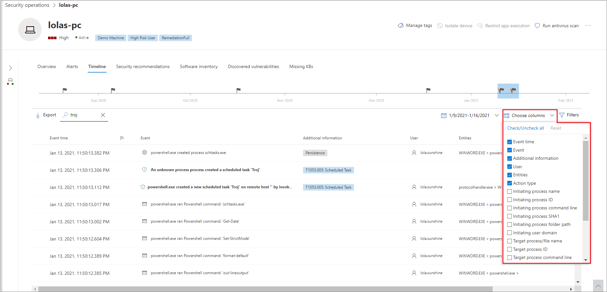

# Techniken in der Gerätezeitachse

**Gilt für:**
- [Microsoft Defender für Endpunkt](https://go.microsoft.com/fwlink/p/?linkid=2146631)

Sie können mehr Einblick in eine Untersuchung gewinnen, indem Sie die Ereignisse analysieren, die auf einem bestimmten Gerät passiert sind. Wählen Sie zunächst das gerät von Interesse in der [Liste Geräte aus.](machines-view-overview.md) Auf der Geräteseite können Sie die Registerkarte **Zeitachse** auswählen, um alle Ereignisse anzuzeigen, die auf dem Gerät aufgetreten sind.

## Verstehen von Techniken in der Zeitachse

>[!IMPORTANT]
>Einige Informationen beziehen sich auf ein vorab veröffentlichtes Produktfeature in der öffentlichen Vorschau, das vor der kommerziellen Veröffentlichung erheblich geändert werden kann. Microsoft übernimmt mit diesen Informationen keinerlei Gewährleistung, sei sie ausdrücklich oder konkludent.

In Microsoft Defender for Endpoint sind **Techniken** ein zusätzlicher Datentyp in der Ereigniszeitachse. Techniken bieten mehr Einblick in Aktivitäten im Zusammenhang mit [MITRE ATT&CK-Techniken](https://attack.mitre.org/) oder Untertechniken. 

Dieses Feature vereinfacht die Untersuchungserfahrung, indem Analysten die Aktivitäten verstehen, die auf einem Gerät beobachtet wurden. Analysten können dann entscheiden, weitere Untersuchungen zu treffen.

Für die öffentliche Vorschau sind Techniken standardmäßig verfügbar und werden zusammen mit Ereignissen angezeigt, wenn die Zeitachse eines Geräts angezeigt wird. 

Techniken werden in fett formatiertem Text hervorgehoben und mit einem blauen Symbol auf der linken Seite angezeigt. Die entsprechende MITRE ATT-&CK-ID und dem Techniknamen werden auch unter Zusätzliche Informationen als Tags angezeigt. 

Such- und Exportoptionen sind auch für Techniken verfügbar.

## Untersuchen der Verwendung des Seitenbereichs

Wählen Sie eine Technik aus, um den entsprechenden Seitenbereich zu öffnen. Hier finden Sie weitere Informationen und Einblicke wie verwandte ATT-&CK-Techniken, Taktiken und Beschreibungen. 

Wählen Sie die spezifische *Angriffstechnik aus,* um die zugehörige ATT-&CK-Technikseite zu öffnen, auf der Sie weitere Informationen dazu finden.

Sie können die Details einer Entität kopieren, wenn rechts ein blaues Symbol angezeigt wird. Wenn Sie beispielsweise sha1 einer verwandten Datei kopieren möchten, wählen Sie das blaue Seitensymbol aus.

Sie können dasselbe für Befehlszeilen ausführen.

## Untersuchen verwandter Ereignisse

Wenn Sie die [erweiterte Suche verwenden](advanced-hunting-overview.md) möchten, um Ereignisse im Zusammenhang mit der ausgewählten Technik zu finden, wählen Sie Hunt for related events **aus.** Dies führt zur erweiterten Suchseite mit einer Abfrage, um Ereignisse im Zusammenhang mit der Technik zu finden.

>[!NOTE]
>Beim Abfragen mithilfe der Schaltfläche **"Suche** nach verwandten Ereignissen" aus einem Seitenbereich Technik werden alle Ereignisse im Zusammenhang mit der identifizierten Technik angezeigt, die Technik selbst wird jedoch nicht in die Abfrageergebnisse ein.

## Anpassen der Gerätezeitachse

Auf der oberen rechten Seite der Gerätezeitachse können Sie einen Datumsbereich auswählen, um die Anzahl der Ereignisse und Techniken auf der Zeitachse zu begrenzen. 

Sie können anpassen, welche Spalten verfügbar gemacht werden sollen. Sie können auch nach gekennzeichneten Ereignissen nach Datentyp oder Ereignisgruppe filtern.

### Spalten auswählen, die verfügbar gemacht werden sollen
Sie können auswählen, welche Spalten in der Zeitachse verfügbar gemacht werden sollen, indem Sie die **Schaltfläche Spalten auswählen** auswählen auswählen.

Dort können Sie auswählen, welche Informationen enthalten sein sollten.

### Filtern, um nur Techniken oder Ereignisse anzeigen zu können

Wenn Sie nur Ereignisse oder Techniken anzeigen möchten, wählen Sie **auf** der Gerätezeitachse Filter aus, und wählen Sie Den bevorzugten Datentyp aus, der angezeigt werden soll.

## Siehe auch
- [Anzeigen und Organisieren der Geräteliste](machines-view-overview.md)
- [Microsoft Defender for Endpoint-Gerätezeitachsenereigniskennzeichen](device-timeline-event-flag.md) 

 
