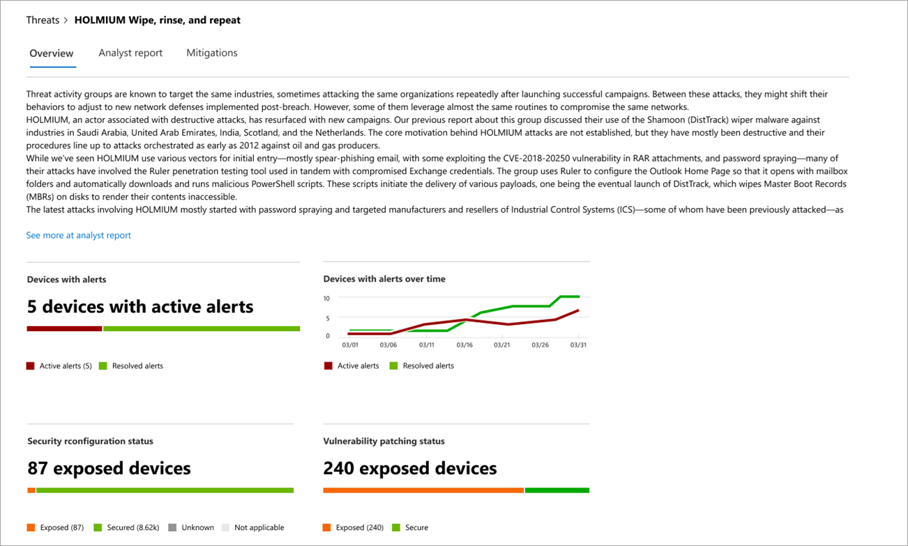

# Nachverfolgen und Reagieren auf neue Bedrohungen mit BedrohungsanalysenTrack and respond to emerging threats with threat analytics 

[!INCLUDE [Microsoft 365 Defender rebranding](../../includes/microsoft-defender.md)]

**Gilt für:****Applies to:**
- [Microsoft Defender für EndpunktMicrosoft Defender for Endpoint](https://go.microsoft.com/fwlink/?linkid=2154037)
- [Microsoft 365 DefenderMicrosoft 365 Defender](https://go.microsoft.com/fwlink/?linkid=2118804)

> Möchten Sie Microsoft Defender for Endpoint erleben?Want to experience Microsoft Defender for Endpoint? [Registrieren Sie sich für eine kostenlose Testversion.Sign up for a free trial.](https://www.microsoft.com/microsoft-365/windows/microsoft-defender-atp?ocid=docs-wdatp-exposedapis-abovefoldlink)

Da anspruchsvollere Gegner und neue Bedrohungen häufig und weit verbreitet entstehen, ist es wichtig, schnell in der Lage zu sein:With more sophisticated adversaries and new threats emerging frequently and prevalently, it's critical to be able to quickly:

- Bewerten der Auswirkungen neuer BedrohungenAssess the impact of new threats
- Überprüfen Der Ausfallsicherheit gegenüber oder der Gefährdung der BedrohungenReview your resilience against or exposure to the threats
- Identifizieren der Aktionen, die Sie zum Beenden oder Eindähen der Bedrohungen ergreifen könnenIdentify the actions you can take to stop or contain the threats

Die Bedrohungsanalyse ist eine Reihe von Berichten von Microsoft-Sicherheitsexperten, die die relevantesten Bedrohungen abdecken, einschließlich:Threat analytics is a set of reports from expert Microsoft security researchers covering the most relevant threats, including:

- Aktive Bedrohungsakteure und ihre KampagnenActive threat actors and their campaigns
- Beliebte und neue AngriffstechnikenPopular and new attack techniques
- Kritische SicherheitsrisikenCritical vulnerabilities
- Allgemeine AngriffsoberflächenCommon attack surfaces
- Verbreitete SchadsoftwarePrevalent malware

Jeder Bericht enthält eine detaillierte Analyse einer Bedrohung und umfassende Anleitungen zum Schutz vor dieser Bedrohung.Each report provides a detailed analysis of a threat and extensive guidance on how to defend against that threat. Es enthält auch Daten aus Ihrem Netzwerk, die angeben, ob die Bedrohung aktiv ist und ob Sie über entsprechende Schutzmaßnahmen verfügen.It also incorporates data from your network, indicating whether the threat is active and if you have applicable protections in place.

Sehen Sie sich dieses kurze Video an, um mehr darüber zu erfahren, wie Sie mithilfe von Bedrohungsanalysen die neuesten Bedrohungen nachverfolgen und beenden können.Watch this short video to learn more about how threat analytics can help you track the latest threats and stop them.

> [!VIDEO https://www.microsoft.com/en-us/videoplayer/embed/RE4bw1f]

## Anzeigen des Dashboards für die BedrohungsanalyseView the threat analytics dashboard

Das Dashboard für die Bedrohungsanalyse ist ein hervorragender Ausgangspunkt, um zu den Berichten zu kommen, die für Ihre Organisation am relevantesten sind.The threat analytics dashboard is a great jump off point for getting to the reports that are most relevant to your organization. Es fasst die Bedrohungen in den folgenden Abschnitten zusammen:It summarizes the threats in the following sections:

- **Neueste Bedrohungen**– listet die zuletzt veröffentlichten Bedrohungsberichte sowie die Anzahl der Geräte mit aktiven und aufgelösten Warnungen auf.**Latest threats**—lists the most recently published threat reports, along with the number of devices with active and resolved alerts.
- **Bedrohungen mit hoher** Auswirkung – listet die Bedrohungen auf, die die höchsten Auswirkungen auf die Organisation hatten.**High-impact threats**—lists the threats that have had the highest impact to the organization. In diesem Abschnitt werden Bedrohungen nach der Anzahl der Geräte mit aktiven Warnungen enteilt.This section ranks threats by the number of devices that have active alerts.
- **Bedrohungszusammenfassung**– zeigt die Gesamtwirkung von nachverfolgten Bedrohungen, indem die Anzahl der Bedrohungen mit aktiven und aufgelösten Warnungen angezeigt wird.**Threat summary**—shows the overall impact of tracked threats by showing the number of threats with active and resolved alerts.

Wählen Sie eine Bedrohung aus dem Dashboard aus, um den Bericht für diese Bedrohung anzuzeigen.Select a threat from the dashboard to view the report for that threat.

## Anzeigen eines Berichts zur BedrohungsanalyseView a threat analytics report

Jeder Bericht zur Bedrohungsanalyse enthält Informationen in drei Abschnitten: **Overview**, **Analyst report** und **Mitigations**.Each threat analytics report provides information in three sections: **Overview**, **Analyst report**, and **Mitigations**.

### Übersicht: Schnelles Verständnis der Bedrohung, Bewerten der Auswirkungen und Überprüfen der AbwehrOverview: Quickly understand the threat, assess its impact, and review defenses

Der **Abschnitt Übersicht** bietet eine Vorschau des detaillierten Analystenberichts.The **Overview** section provides a preview of the detailed analyst report. Außerdem enthält sie Diagramme, die die Auswirkungen der Bedrohung für Ihre Organisation und Ihre Gefährdung durch falsch konfigurierte und nicht gepatchte Geräte hervorheben.It also provides charts that highlight the impact of the threat to your organization and your exposure through misconfigured and unpatched devices.

 _(Übersicht) eines Berichts zur Bedrohungsanalyse_
_Overview section of a threat analytics report_

#### Bewerten der Auswirkungen auf Ihre OrganisationAssess the impact to your organization
Jeder Bericht enthält Diagramme, die Informationen zu den organisatorischen Auswirkungen einer Bedrohung liefern sollen:Each report includes charts designed to provide information about the organizational impact of a threat:
- **Geräte mit Warnungen**– zeigt die aktuelle Anzahl unterschiedlicher Geräte an, die von der Bedrohung betroffen sind.**Devices with alerts**—shows the current number of distinct devices that have been impacted by the threat. Ein Gerät wird als **Aktiv** kategorisiert, wenn dieser Bedrohung mindestens  eine Warnung zugeordnet ist, und **Resolved,** wenn alle Warnungen im Zusammenhang mit der Bedrohung auf dem Gerät aufgelöst wurden.A device is categorized as **Active** if there is at least one alert associated with that threat and **Resolved** if *all* alerts associated with the threat on the device have been resolved.
- **Geräte mit Warnungen im** Laufe der Zeit – zeigt die Anzahl unterschiedlicher Geräte mit **aktiven** und **aufgelösten** Warnungen im Laufe der Zeit an.**Devices with alerts over time**—shows the number of distinct devices with **Active** and **Resolved** alerts over time. Die Anzahl der aufgelösten Warnungen gibt an, wie schnell Ihre Organisation auf Warnungen reagiert, die einer Bedrohung zugeordnet sind.The number of resolved alerts indicates how quickly your organization responds to alerts associated with a threat. Idealerweise sollte das Diagramm Warnungen anzeigen, die innerhalb weniger Tage aufgelöst wurden.Ideally, the chart should be showing alerts resolved within a few days.

#### Überprüfen der Ausfallsicherheit und -haltungReview security resilience and posture
Jeder Bericht enthält Diagramme, die einen Überblick darüber bieten, wie widerstandsfähig Ihre Organisation gegen eine bestimmte Bedrohung ist:Each report includes charts that provide an overview of how resilient your organization is against a given threat:
- **Sicherheitskonfigurationsstatus**: Zeigt die Anzahl der Geräte an, die die empfohlenen Sicherheitseinstellungen angewendet haben, um die Bedrohung zu mindern.**Security configuration status**—shows the number of devices that have applied the recommended security settings that can help mitigate the threat. Geräte gelten als **sicher,** wenn sie _alle_ nachverfolgten Einstellungen angewendet haben.Devices are considered **Secure** if they have applied _all_ the tracked settings.
- **Status des Sicherheitsrisikopatchings**– Zeigt die Anzahl der Geräte an, auf die Sicherheitsupdates oder Patches angewendet wurden, die Sicherheitsrisiken ausnutzen, die von der Bedrohung ausgenutzt wurden.**Vulnerability patching status**—shows the number of devices that have applied security updates or patches that address vulnerabilities exploited by the threat.

### Analystenbericht: Experten-Einblick von Microsoft-Sicherheitsforschern erhaltenAnalyst report: Get expert insight from Microsoft security researchers
Wechseln Sie zum **Abschnitt Analyst report,** um die detaillierten Experten-Schreibzugriffe zu lesen.Go to the **Analyst report** section to read through the detailed expert write-up. Die meisten Berichte enthalten detaillierte Beschreibungen von Angriffsketten, einschließlich Taktiken und Techniken, die dem MITRE ATT&CK-Framework zugeordnet sind, umfassende Empfehlungen und leistungsstarke Anleitungen zur [Bedrohungssuche.](advanced-hunting-overview.md)Most reports provide detailed descriptions of attack chains, including tactics and techniques mapped to the MITRE ATT&CK framework, exhaustive lists of recommendations, and powerful [threat hunting](advanced-hunting-overview.md) guidance.

[Weitere Informationen zum AnalystenberichtLearn more about the analyst report](threat-analytics-analyst-reports.md)

### Gegenmaßnahmen: Überprüfen der Liste der Gegenmaßnahmen und des Status Ihrer GeräteMitigations: Review list of mitigations and the status of your devices
Überprüfen Sie **im Abschnitt** Gegenmaßnahmen die Liste der spezifischen Empfehlungen für Aktionen, die Ihnen helfen können, Ihre Ausfallsicherheit gegenüber der Bedrohung zu erhöhen.In the **Mitigations** section, review the list of specific actionable recommendations that can help you increase your organizational resilience against the threat. Die Liste der nachverfolgten Gegenmaßnahmen umfasst:The list of tracked mitigations includes:

- **Sicherheitsupdates**– Bereitstellung von Sicherheitsupdates oder Patches für Sicherheitsrisiken**Security updates**—deployment of security updates or patches for vulnerabilities
- **Microsoft Defender Antivirus Einstellungen****Microsoft Defender Antivirus settings**
  - Security Intelligence VersionSecurity intelligence version
  - Aus der Cloud gelieferter SchutzCloud-delivered protection  
  - Schutz potenziell unerwünschter Anwendungen (PUA)Potentially unwanted application (PUA) protection
  - EchtzeitschutzReal-time protection
 
Informationen zur Risikominderung in diesem Abschnitt enthalten Daten aus [Bedrohungs- und Sicherheitsrisikomanagement](next-gen-threat-and-vuln-mgt.md), die auch detaillierte Drilldowninformationen aus verschiedenen Links im Bericht enthalten.Mitigation information in this section incorporates data from [threat and vulnerability management](next-gen-threat-and-vuln-mgt.md), which also provides detailed drill-down information from various links in the report.

 _Berichts zur Bedrohungsanalyse_
_Mitigations section of a threat analytics report_

## Zusätzliche Berichtsdetails und EinschränkungenAdditional report details and limitations
Beachten Sie bei der Verwendung der Berichte Folgendes:When using the reports, keep the following in mind: 

- Die Daten werden basierend auf ihrem rollenbasierten Zugriffssteuerungsbereich (RBAC) bereichiert.Data is scoped based on your role-based access control (RBAC) scope. Sie sehen den Status von Geräten in [Gruppen, auf die Sie zugreifen können.](machine-groups.md)You will see the status of devices in [groups that you can access](machine-groups.md).
- Diagramme spiegeln nur nachverfolgte Gegenmaßnahmen wider.Charts reflect only mitigations that are tracked. Überprüfen Sie die Berichtsübersicht auf zusätzliche Gegenmaßnahmen, die nicht in den Diagrammen angezeigt werden.Check the report overview for additional mitigations that are not shown in the charts.
- Gegenmaßnahmen garantieren keine vollständige Ausfallsicherheit.Mitigations don't guarantee complete resilience. Die bereitgestellten Gegenmaßnahmen spiegeln die bestmöglichen Maßnahmen wider, die zur Verbesserung der Ausfallsicherheit erforderlich sind.The provided mitigations reflect the best possible actions needed to improve resiliency.
- Geräte werden als "nicht verfügbar" gezählt, wenn sie keine Daten an den Dienst übermittelt haben.Devices are counted as "unavailable" if they have not transmitted data to the service.
- Antivirusbezogene Statistiken basieren auf Microsoft Defender Antivirus Einstellungen.Antivirus-related statistics are based on Microsoft Defender Antivirus settings. Geräte mit Antivirenlösungen von Drittanbietern können als "verfügbar" angezeigt werden.Devices with third-party antivirus solutions can appear as "exposed".

## Verwandte ThemenRelated topics
- [Proaktives Aufsuchen von Bedrohungen mit erweiterter SucheProactively find threats with advanced hunting](advanced-hunting-overview.md) 
- [Verstehen des Abschnitts "Analystenbericht"Understand the analyst report section](threat-analytics-analyst-reports.md)
- [Bewerten und Beheben von Sicherheitsschwächen und -risikenAssess and resolve security weaknesses and exposures](next-gen-threat-and-vuln-mgt.md)