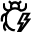
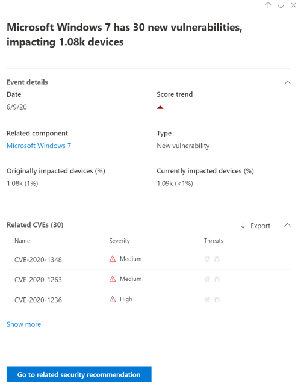

# Ereigniszeitachse – Bedrohungs- und SicherheitsrisikoverwaltungEvent timeline - threat and vulnerability management

[!INCLUDE [Microsoft 365 Defender rebranding](../../includes/microsoft-defender.md)]

**Gilt für:****Applies to:**
- [Microsoft Defender für EndpunktMicrosoft Defender for Endpoint](https://go.microsoft.com/fwlink/?linkid=2154037)
- [Microsoft 365 DefenderMicrosoft 365 Defender](https://go.microsoft.com/fwlink/?linkid=2118804)

>Möchten Sie Microsoft Defender for Endpoint erleben?Want to experience Microsoft Defender for Endpoint? [Registrieren Sie sich für eine kostenlose Testversion.Sign up for a free trial.](https://www.microsoft.com/microsoft-365/windows/microsoft-defender-atp?ocid=docs-wdatp-portaloverview-abovefoldlink)

Die Ereigniszeitachse ist ein Newsfeed für Risiken, mit dem Sie interpretieren können, wie Risiken durch neue Sicherheitsrisiken oder Exploits in die Organisation eingeführt werden.Event timeline is a risk news feed that helps you interpret how risk is introduced into the organization through new vulnerabilities or exploits. Sie können Ereignisse anzeigen, die sich auf das Risiko Ihrer Organisation auswirken können.You can view events that may impact your organization's risk. Beispielsweise finden Sie neue Sicherheitsrisiken, die eingeführt wurden, Sicherheitsrisiken, die ausgenutzt werden konnten, Exploits, die einem Exploit Kit hinzugefügt wurden, und vieles mehr.For example, you can find new vulnerabilities that were introduced, vulnerabilities that became exploitable, exploit that was added to an exploit kit, and more.

Die Ereigniszeitachse enthält  außerdem die Geschichte ihrer Belichtungsergebnis und [der Microsoft Secure Score für](tvm-microsoft-secure-score-devices.md) Geräte, damit Sie die Ursache für große Änderungen ermitteln können.Event timeline also tells the story of your [exposure score](tvm-exposure-score.md) and [Microsoft Secure Score for Devices](tvm-microsoft-secure-score-devices.md) so you can determine the cause of large changes. Ereignisse können sich auf Ihre Geräte oder Ihre Bewertung für Geräte auswirken.Events can impact your devices or your score for devices. Reduzieren Sie Ihre Risikoposition, indem Sie auf der Grundlage der priorisierten Sicherheitsempfehlungen das problembearbeiten, [was behoben werden muss.](tvm-security-recommendation.md)Reduce you exposure by addressing what needs to be remediated based on the prioritized [security recommendations](tvm-security-recommendation.md).

>[!TIP]
>Informationen zu E-Mails zu neuen Sicherheitsrisikoereignissen finden Sie unter [Configure vulnerability email notifications in Microsoft Defender for Endpoint](configure-vulnerability-email-notifications.md)To get emails about new vulnerability events, see [Configure vulnerability email notifications in Microsoft Defender for Endpoint](configure-vulnerability-email-notifications.md)

## Navigieren zur Seite EreigniszeitachseNavigate to the Event timeline page

Es gibt auch drei Einstiegspunkte aus dem Dashboard zur Verwaltung von Bedrohungen und [Sicherheitslücken:](tvm-dashboard-insights.md)There are also three entry points from the [threat and vulnerability management dashboard](tvm-dashboard-insights.md):

- **Belichtungsergebniskarte** der Organisation: Zeigen Sie im Diagramm "Belichtungsergebnis im Laufe der Zeit" auf die Ereignispunkte, und wählen Sie "Alle Ereignisse von diesem Tag anzeigen" aus.**Organization exposure score card**: Hover over the event dots in the "Exposure Score over time" graph and select "See all events from this day." Die Ereignisse stellen Softwarerisiken dar.The events represent software vulnerabilities.
- **Microsoft Secure Score for Devices**: Zeigen Sie im Diagramm "Ihre Bewertung für Geräte im Laufe der Zeit" auf die Ereignispunkte, und wählen Sie "Alle Ereignisse von diesem Tag anzeigen" aus.**Microsoft Secure Score for Devices**: Hover over the event dots in the "Your score for devices over time" graph and select "See all events from this day." Die Ereignisse stellen neue Konfigurationsbewertungen dar.The events represent new configuration assessments.
- **Karte "Top-Ereignisse":** Wählen Sie "Weitere Anzeigen" unten in der Tabelle "Top Events" aus.**Top events card**: Select "Show more" at the bottom of the top events table. Die Karte zeigt die drei auswirkungenreichsten Ereignisse der letzten 7 Tage an.The card displays the three most impactful events in the last 7 days. Zu den auswirkungenreichen Ereignissen kann gehören, wenn sich das Ereignis auf eine große Anzahl von Geräten auswirkt oder wenn es sich um eine kritische Sicherheitslücke handelt.Impactful events can include if the event affects a large number of devices, or if it is a critical vulnerability.

### Belichtungsergebnis und Microsoft Secure Score for Devices GraphsExposure score and Microsoft Secure Score for Devices graphs

Zeigen Sie im Dashboard für die Bedrohungs- und Sicherheitsrisikoverwaltung auf das Diagramm Belichtungsergebnis, um die top-Software-Sicherheitsrisikoereignisse von diesem Tag anzuzeigen, die sich auf Ihre Geräte auswirken.In the threat and vulnerability management dashboard, hover over the Exposure score graph to view top software vulnerability events from that day that impacted your devices. Zeigen Sie auf das Microsoft Secure Score for Devices-Diagramm, um neue Sicherheitskonfigurationsbewertungen anzuzeigen, die sich auf Ihre Bewertung auswirken.Hover over the Microsoft Secure Score for Devices graph to view new security configuration assessments that affect your score.

Wenn es keine Ereignisse gibt, die sich auf Ihre Geräte oder Ihre Bewertung für Geräte auswirken, wird keines angezeigt.If there are no events that affect your devices or your score for devices, then none will be shown.

 
  

### Drilldown zu Ereignissen von diesem TagDrill down to events from that day

Wenn Sie alle Ereignisse von diesem Tag anzeigen **auswählen,** gelangen Sie zur Seite Ereigniszeitachse mit einem benutzerdefinierten Datumsbereich für diesen Tag.Selecting **Show all events from this day** takes you to the Event timeline page with a custom date range for that day.

Wählen **Sie Benutzerdefinierter** Bereich aus, um den Datumsbereich in einen anderen benutzerdefinierten oder einen vordefinierten Zeitraum zu ändern.Select **Custom range** to change the date range to another custom one, or a pre-set time range.

## Übersicht über die EreigniszeitachseEvent timeline overview

Auf der Seite Ereigniszeitachse können Sie alle erforderlichen Informationen zu einem Ereignis anzeigen.On the Event timeline page, you can view the all the necessary info related to an event. 

Features:Features:

- Anpassen von SpaltenCustomize columns
- Filtern nach Ereignistyp oder Prozent der betroffener GeräteFilter by event type or percent of impacted devices
- Anzeigen von 30, 50 oder 100 Elementen pro SeiteView 30, 50, or 100 items per page

Die beiden großen Zahlen oben auf der Seite zeigen die Anzahl neuer Sicherheitsrisiken und ausnutzende Sicherheitsrisiken an, nicht Ereignisse.The two large numbers at the top of the page show the number of new vulnerabilities and exploitable vulnerabilities, not events. Einige Ereignisse können mehrere Sicherheitsrisiken aufweisen, und einige Sicherheitsrisiken können mehrere Ereignisse aufweisen.Some events can have multiple vulnerabilities, and some vulnerabilities can have multiple events.

### SpaltenColumns

- **Datum**: Monat, Tag, Jahr**Date**: month, day, year
- **Ereignis**: Auswirkungsereignis, einschließlich Komponente, Typ und Anzahl betroffener Geräte**Event**: impactful event, including component, type, and number of impacted devices
- **Verwandte Komponente**: Software**Related component**: software
- **Ursprünglich betroffener Geräte:** Die Anzahl und der Prozentsatz betroffener Geräte, als dieses Ereignis ursprünglich aufgetreten ist.**Originally impacted devices**: the number, and percentage, of impacted devices when this event originally occurred. Sie können auch nach dem Prozent der ursprünglich betroffenen Geräte filtern, und die Gesamtzahl der Geräte.You can also filter by the percent of originally impacted devices, out of your total number of devices.
- **Aktuell betroffener Geräte:** die aktuelle Anzahl und der Prozentsatz der Geräte, die dieses Ereignis derzeit beeinflusst.**Currently impacted devices**: the current number, and percentage, of devices that this event currently impacts. Sie finden dieses Feld, indem Sie **Spalten anpassen auswählen.**You can find this field by selecting **Customize columns**.
- **Typen**: spiegeln Zeitstempelereignisse wider, die sich auf die Bewertung auswirken.**Types**: reflect time-stamped events that impact the score. Sie können gefiltert werden.They can be filtered.
    - Einem Exploitkit hinzugefügter ExploitExploit added to an exploit kit
    - Exploit wurde überprüftExploit was verified
    - Neuer öffentlicher ExploitNew public exploit
    - Neue SicherheitslückeNew vulnerability
    - Neue KonfigurationsbewertungNew configuration assessment
- **Bewertungstrend**: Belichtungsergebnistrend**Score trend**: exposure score trend

### SymboleIcons

Die folgenden Symbole werden neben Ereignissen angezeigt:The following icons show up next to events:

-  Neuer öffentlicher ExploitNew public exploit
-  Neue Sicherheitslücke wurde veröffentlichtNew vulnerability was published
-  Exploit im Exploit KitExploit found in exploit kit
-  Exploit überprüftExploit verified

### Drilldown zu einem bestimmten EreignisDrill down to a specific event

Nachdem Sie ein Ereignis ausgewählt haben, wird ein Flyout mit einer Liste der Details und aktuellen CVEs angezeigt, die sich auf Ihre Geräte auswirken.Once you select an event, a flyout will appear with a list of the details and current CVEs that affect your devices. Sie können weitere CVEs anzeigen oder die zugehörige Empfehlung anzeigen.You can show more CVEs or view the related recommendation.

Der Pfeil unter "Bewertungstrend" hilft Ihnen zu bestimmen, ob dieses Ereignis ihre belichtungsbedingte Bewertung möglicherweise ausgelöst oder gesenkt hat.The arrow below "score trend" helps you determine whether this event potentially raised or lowered your organizational exposure score. Eine höhere Belichtungszahl bedeutet, dass Geräte anfälliger für die Nutzung sind.Higher exposure score means devices are more vulnerable to exploitation.

Wählen Sie von dort **auf der** Seite Sicherheitsempfehlungen die Option Zu zugehöriger Sicherheitsempfehlung wechseln die Empfehlung aus, die die neue Sicherheitslücke der Software [behebt.](tvm-security-recommendation.md)From there, select **Go to related security recommendation** view the recommendation that addresses the new software vulnerability in the [security recommendations page](tvm-security-recommendation.md). Nachdem Sie die Beschreibung und die Sicherheitsrisikodetails in der Sicherheitsempfehlung gelesen haben, können Sie eine Korrekturanforderung übermitteln und die Anforderung auf der Seite "Problembehebung" [nachverfolgen.](tvm-remediation.md)After reading the description and vulnerability details in the security recommendation, you can submit a remediation request, and track the request in the [remediation page](tvm-remediation.md).  

## Anzeigen von Ereigniszeitachsen auf SoftwareseitenView Event timelines in software pages

Wählen Sie zum Öffnen einer Softwareseite ein Ereignis aus, > im Flyout den Namen der mit Hyperlinks verknüpften Software (wie Visual Studio 2017) im Abschnitt "Verwandte Komponente" auswählen.To open a software page, select an event > select the hyperlinked software name (like Visual Studio 2017) in the section called "Related component" in the flyout. [Weitere Informationen zu SoftwareseitenLearn more about software pages](tvm-software-inventory.md#software-pages)

Eine vollständige Seite mit allen Details einer bestimmten Software wird angezeigt.A full page will appear with all the details of a specific software. Bewegen Sie die Maus über das Diagramm, um die Zeitachse der Ereignisse für diese bestimmte Software anzuzeigen.Mouse over the graph to see the timeline of events for that specific software.

Navigieren Sie zur Registerkarte Ereigniszeitachse, um alle Ereignisse im Zusammenhang mit dieser Software anzuzeigen.Navigate to the event timeline tab to view all the events related to that software. Sie können auch Sicherheitsempfehlungen, ermittelte Sicherheitsrisiken, installierte Geräte und Versionsverteilung sehen.You can also see security recommendations, discovered vulnerabilities, installed devices, and version distribution.

## Verwandte ThemenRelated topics

- [Übersicht über die Verwaltung von Bedrohungen und SicherheitslückenThreat and vulnerability management overview](next-gen-threat-and-vuln-mgt.md)
- [DashboardDashboard](tvm-dashboard-insights.md)
- [BelichtungsergebnisExposure score](tvm-exposure-score.md)
- [SicherheitsempfehlungenSecurity recommendations](tvm-security-recommendation.md)
- [Behebung von SicherheitsrisikenRemediate vulnerabilities](tvm-remediation.md)
- [SoftwarebestandSoftware inventory](tvm-software-inventory.md)

