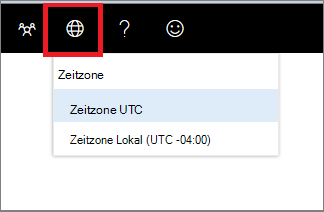

# Zeitzoneneinstellungen für Microsoft Defender Security CenterMicrosoft Defender Security Center time zone settings

[!INCLUDE [Microsoft 365 Defender rebranding](../../includes/microsoft-defender.md)]

**Gilt für:****Applies to:**
- [Microsoft Defender für EndpunktMicrosoft Defender for Endpoint](https://go.microsoft.com/fwlink/p/?linkid=2154037)

>Möchten Sie Microsoft Defender for Endpoint erleben?Want to experience Microsoft Defender for Endpoint? [Registrieren Sie sich für eine kostenlose Testversion.Sign up for a free trial.](https://www.microsoft.com/microsoft-365/windows/microsoft-defender-atp?ocid=docs-wdatp-settings-abovefoldlink)

Verwenden Sie **das Zeitzonenmenü**  symbol1, um die Zeitzone zu konfigurieren und Lizenzinformationen anzuzeigen.Use the **Time zone** menu  to configure the time zone and view license information.

## ZeitzoneneinstellungenTime zone settings
Der Zeitaspekt ist wichtig bei der Bewertung und Analyse von wahrgenommenen und tatsächlichen Cyberangriffen.The aspect of time is important in the assessment and analysis of perceived and actual cyberattacks.

Cyberforensische Untersuchungen beruhen häufig auf Zeitstempeln, um die Abfolge von Ereignissen zu verbinden.Cyberforensic investigations often rely on time stamps to piece together the sequence of events. Es ist wichtig, dass Ihr System die richtigen Zeitzoneneinstellungen widerspiegelt.It’s important that your system reflects the correct time zone settings.

Microsoft Defender for Endpoint kann entweder koordinierte Weltzeit (UTC) oder Ortszeit anzeigen.Microsoft Defender for Endpoint can display either Coordinated Universal Time (UTC) or local time.

Ihre aktuelle Zeitzoneneinstellung wird im Menü Microsoft Defender for Endpoint angezeigt.Your current time zone setting is shown in the Microsoft Defender for Endpoint menu. Sie können die angezeigte Zeitzone im **Menü** Zeitzone ändern.You can change the displayed time zone in the **Time zone** menu.

..

### UTC-ZeitzoneUTC time zone
Microsoft Defender for Endpoint verwendet standardmäßig UTC-Zeit.Microsoft Defender for Endpoint uses UTC time by default.

Wenn Sie die Microsoft Defender for Endpoint-Zeitzone auf UTC festlegen, werden alle Systemzeitstempel (Warnungen, Ereignisse und andere) in UTC für alle Benutzer angezeigt.Setting the Microsoft Defender for Endpoint time zone to UTC will display all system timestamps (alerts, events, and others) in UTC for all users. Dies kann Sicherheitsanalysten, die an verschiedenen Orten auf der ganzen Welt arbeiten, dabei helfen, die gleichen Zeitstempel zu verwenden, während Sie Ereignisse untersuchen.This can help security analysts working in different locations across the globe to use the same time stamps while investigating events.

### Lokale ZeitzoneLocal time zone
Sie können festlegen, dass Microsoft Defender for Endpoint lokale Zeitzoneneinstellungen verwendet.You can choose to have Microsoft Defender for Endpoint use local time zone settings. Alle Warnungen und Ereignisse werden mithilfe Ihrer lokalen Zeitzone angezeigt.All alerts and events will be displayed using your local time zone.

Die lokale Zeitzone wird aus den regionalen Einstellungen Ihres Geräts übernommen.The local time zone is taken from your device’s regional settings. Wenn Sie Ihre regionalen Einstellungen ändern, ändert sich auch die Microsoft Defender for Endpoint-Zeitzone.If you change your regional settings, the Microsoft Defender for Endpoint time zone will also change. Wenn Sie diese Einstellung auswählen, werden die in Microsoft Defender for Endpoint angezeigten Zeitstempel für alle Microsoft Defender for Endpoint-Benutzer an der Ortszeit ausgerichtet.Choosing this setting means that the timestamps displayed in Microsoft Defender for Endpoint will be aligned to local time for all Microsoft Defender for Endpoint users. Analysten, die sich an verschiedenen globalen Standorten befinden, sehen nun die Microsoft Defender for Endpoint-Warnungen entsprechend ihren regionalen Einstellungen.Analysts located in different global locations will now see the Microsoft Defender for Endpoint alerts according to their regional settings.

Die Verwendung der Ortszeit kann hilfreich sein, wenn sich die Analysten an einem einzigen Standort befinden.Choosing to use local time can be useful if the analysts are located in a single location. In diesem Fall ist es möglicherweise einfacher, Ereignisse mit der Ortszeit zu korrelieren, z. B. wenn ein lokaler Benutzer auf einen verdächtigen E-Mail-Link geklickt hat.In this case it might be easier to correlate events to local time, for example – when a local user clicked on a suspicious email link.

### Festlegen der ZeitzoneSet the time zone
Die Microsoft Defender for Endpoint-Zeitzone ist standardmäßig auf UTC festgelegt.The Microsoft Defender for Endpoint time zone is set by default to UTC.
Durch festlegen der Zeitzone werden auch die Zeiten für alle Microsoft Defender for Endpoint-Ansichten geändert.Setting the time zone also changes the times for all Microsoft Defender for Endpoint views.
So legen Sie die Zeitzone ein:To set the time zone:

1. Klicken Sie **auf das Zeitzonenmenü**  .Click the **Time zone** menu .
2. Wählen Sie **den Zeitzonen-UTC-Indikator** aus.Select the **Timezone UTC** indicator.
3. Wählen **Sie Zeitzone UTC** oder Ihre lokale Zeitzone aus, z. B. -7:00.Select **Timezone UTC** or your local time zone, for example -7:00.

### Regionale EinstellungenRegional settings
Verwenden Sie regionale Einstellungen für Internet Explorer (IE) und Microsoft Edge (Edge), um unterschiedliche Datumsformate für Microsoft Defender for Endpoint anzuwenden.To apply different date formats for Microsoft Defender for Endpoint, use regional settings for Internet Explorer (IE) and Microsoft Edge (Edge). Wenn Sie einen anderen Browser wie Google Chrome verwenden, führen Sie die erforderlichen Schritte aus, um die Zeit- und Datumseinstellungen für diesen Browser zu ändern.If you're using another browser such as Google Chrome, follow the required steps to change the time and date settings for that browser. 

**Internet Explorer (IE) und Microsoft Edge****Internet Explorer (IE) and Microsoft Edge**

IE und Microsoft  Edge verwenden die Region-Einstellungen, die in der Systemsteuerung in der Option **Uhren,** Sprache und Region konfiguriert sind.IE and Microsoft Edge use the **Region** settings configured in the **Clocks, Language, and Region** option in the Control panel. 

#### Bekannte Probleme mit regionalen FormatenKnown issues with regional formats

**Datums- und Uhrzeitformate****Date and time formats** 
Es gibt einige bekannte Probleme mit den Uhrzeit- und Datumsformaten.There are some known issues with the time and date formats. Wenn Sie Ihre regionalen Einstellungen auf andere als die unterstützten Formate konfigurieren, gibt das Portal möglicherweise ihre Einstellungen nicht richtig wieder.If you configure your regional settings to anything other than the supported formats, the portal may not correctly reflect your settings.

Die folgenden Datums- und Uhrzeitformate werden unterstützt:The following date and time formats are supported:
- Datumsformat MM/dd/yyyyDate format MM/dd/yyyy
- Datumsformat dd/MM/yyyyDate format dd/MM/yyyy
- Zeitformat hh:mm:ss (12-Stunden-Format)Time format hh:mm:ss (12 hour format)

Die folgenden Datums- und Uhrzeitformate werden derzeit nicht unterstützt:The following date and time formats are currently not supported:
- Datumsformat yyyy-MM-ddDate format yyyy-MM-dd
- Datumsformat dd-MMM-yyDate format dd-MMM-yy
- Datumsformat dd/MM/yyDate format dd/MM/yy
- Datumsformat MM/dd/yyDate format MM/dd/yy
- Datumsformat mit yy.Date format with yy. Zeigt nur yyyy an.Will only show yyyy.
- Zeitformat HH:mm:ss (24-Stunden-Format)Time format HH:mm:ss (24 hour format)

**Dezimalsymbol, das in Zahlen verwendet wird****Decimal symbol used in numbers** 
Das verwendete Dezimalsymbol ist immer ein Punkt, auch wenn in den Einstellungen für das **Zahlenformat** in den Regioneneinstellungen ein **Komma ausgewählt** ist.Decimal symbol used is always a dot, even if a comma is selected in  the **Numbers** format settings in **Region** settings. Beispielsweise wird 15,5K als 15,5K angezeigt.For example, 15,5K is displayed as 15.5K.

