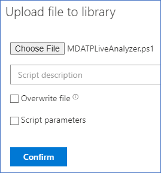

# <a name="collect-support-logs-in-microsoft-defender-for-endpoint-using-live-response"></a><span data-ttu-id="b0808-104">Sammeln von Supportprotokollen in Microsoft Defender for Endpoint mithilfe von Liveantworten</span><span class="sxs-lookup"><span data-stu-id="b0808-104">Collect support logs in Microsoft Defender for Endpoint using live response</span></span> 


<span data-ttu-id="b0808-105">**Gilt für:**</span><span class="sxs-lookup"><span data-stu-id="b0808-105">**Applies to:**</span></span>
- [<span data-ttu-id="b0808-106">Microsoft Defender für Endpunkt</span><span class="sxs-lookup"><span data-stu-id="b0808-106">Microsoft Defender for Endpoint</span></span>](https://go.microsoft.com/fwlink/p/?linkid=2154037)
- [<span data-ttu-id="b0808-107">Microsoft 365 Defender</span><span class="sxs-lookup"><span data-stu-id="b0808-107">Microsoft 365 Defender</span></span>](https://go.microsoft.com/fwlink/?linkid=2118804)

> <span data-ttu-id="b0808-108">Möchten Sie Defender for Endpoint erleben?</span><span class="sxs-lookup"><span data-stu-id="b0808-108">Want to experience Defender for Endpoint?</span></span> [<span data-ttu-id="b0808-109">Registrieren Sie sich für eine kostenlose Testversion.</span><span class="sxs-lookup"><span data-stu-id="b0808-109">Sign up for a free trial.</span></span>](https://www.microsoft.com/microsoft-365/windows/microsoft-defender-atp?ocid=docs-wdatp-pullalerts-abovefoldlink) 


<span data-ttu-id="b0808-110">Wenn Sie sich an den Support wenden, werden Sie möglicherweise aufgefordert, das Ausgabepaket des Microsoft Defender for Endpoint Client Analyzer-Tools zur Verfügung zu stellen.</span><span class="sxs-lookup"><span data-stu-id="b0808-110">When contacting support, you may be asked to provide the output package of the Microsoft Defender for Endpoint Client Analyzer tool.</span></span>

<span data-ttu-id="b0808-111">Dieses Thema enthält Anweisungen zum Ausführen des Tools über Live Response.</span><span class="sxs-lookup"><span data-stu-id="b0808-111">This topic provides instructions on how to run the tool via Live Response.</span></span>

1. <span data-ttu-id="b0808-112">Laden Sie das entsprechende Skript herunter</span><span class="sxs-lookup"><span data-stu-id="b0808-112">Download the appropriate script</span></span>
    * <span data-ttu-id="b0808-113">Microsoft Defender for Endpoint-Clientsensorprotokolle: [LiveAnalyzer.ps1 Skript .](https://aka.ms/MDELiveAnalyzer)</span><span class="sxs-lookup"><span data-stu-id="b0808-113">Microsoft Defender for Endpoint client sensor logs only: [LiveAnalyzer.ps1 script](https://aka.ms/MDELiveAnalyzer).</span></span>
      - <span data-ttu-id="b0808-114">Ungefähre Größe des Ergebnispakets: ~100Kb</span><span class="sxs-lookup"><span data-stu-id="b0808-114">Result package approximate size: ~100Kb</span></span> 
    *  <span data-ttu-id="b0808-115">Microsoft Defender for Endpoint-Clientsensor- und Antivirusprotokolle: [LiveAnalyzer+MDAV.ps1 Skript.](https://aka.ms/MDELiveAnalyzerAV)</span><span class="sxs-lookup"><span data-stu-id="b0808-115">Microsoft Defender for Endpoint client sensor and Antivirus logs: [LiveAnalyzer+MDAV.ps1 script](https://aka.ms/MDELiveAnalyzerAV).</span></span>
       - <span data-ttu-id="b0808-116">Ungefähre Größe des Ergebnispakets: ~10 Mb</span><span class="sxs-lookup"><span data-stu-id="b0808-116">Result package approximate size: ~10Mb</span></span> 
 
2.  <span data-ttu-id="b0808-117">Initiieren Sie [eine Live-Reaktionssitzung](live-response.md#initiate-a-live-response-session-on-a-device) auf dem Computer, den Sie untersuchen müssen.</span><span class="sxs-lookup"><span data-stu-id="b0808-117">Initiate a [Live Response session](live-response.md#initiate-a-live-response-session-on-a-device) on the machine you need to investigate.</span></span>

3.  <span data-ttu-id="b0808-118">Wählen **Hochladen datei in die Bibliothek aus.**</span><span class="sxs-lookup"><span data-stu-id="b0808-118">Select **Upload file to library**.</span></span>

    

4. <span data-ttu-id="b0808-120">Wählen **Sie Datei auswählen aus.**</span><span class="sxs-lookup"><span data-stu-id="b0808-120">Select **Choose file**.</span></span>

    

5. <span data-ttu-id="b0808-122">Wählen Sie die heruntergeladene Datei namens MDELiveAnalyzer.ps1 aus, und klicken Sie dann auf **Bestätigen.**</span><span class="sxs-lookup"><span data-stu-id="b0808-122">Select the downloaded file named MDELiveAnalyzer.ps1 and then click on **Confirm**</span></span>


   


6. <span data-ttu-id="b0808-124">Verwenden Sie während der LiveResponse-Sitzung die folgenden Befehle, um die Analyse auszuführen und die Ergebnisdatei zu erfassen:</span><span class="sxs-lookup"><span data-stu-id="b0808-124">While still in the LiveResponse session, use the commands below to run the analyzer and collect the result file:</span></span>

    ```console
    Run MDELiveAnalyzer.ps1
    GetFile "C:\ProgramData\Microsoft\Windows Defender Advanced Threat Protection\Downloads\MDEClientAnalyzerResult.zip" -auto
    ```

    <span data-ttu-id="b0808-125">[](images/analyzer-commands.png#lightbox)</span><span class="sxs-lookup"><span data-stu-id="b0808-125">[  ](images/analyzer-commands.png#lightbox)</span></span>


>[!NOTE]
> - <span data-ttu-id="b0808-126">Die neueste Vorschauversion von MDEClientAnalyzer finden Sie hier: [https://aka.ms/Betamdeanalyzer](https://aka.ms/Betamdeanalyzer) .</span><span class="sxs-lookup"><span data-stu-id="b0808-126">The latest preview version of MDEClientAnalyzer can be downloaded here: [https://aka.ms/Betamdeanalyzer](https://aka.ms/Betamdeanalyzer).</span></span>
> 
> - <span data-ttu-id="b0808-127">Das LiveAnalyzer-Skript lädt das Problembehandlungspaket auf dem Zielcomputer von: https://mdatpclientanalyzer.blob.core.windows.net herunter.</span><span class="sxs-lookup"><span data-stu-id="b0808-127">The LiveAnalyzer script downloads the troubleshooting package on the destination machine from: https://mdatpclientanalyzer.blob.core.windows.net.</span></span>
> 
>   <span data-ttu-id="b0808-128">Wenn Sie dem Computer nicht erlauben können, die oben aufgeführte URL zu erreichen, laden MDEClientAnalyzerPreview.zip in die Bibliothek hoch, bevor Sie das LiveAnalyzer-Skript ausführen:</span><span class="sxs-lookup"><span data-stu-id="b0808-128">If you cannot allow the machine to reach the above URL, then upload MDEClientAnalyzerPreview.zip file to the library before running the LiveAnalyzer script:</span></span>
>
>   ```console
>   PutFile MDEClientAnalyzerPreview.zip -overwrite
>   Run MDELiveAnalyzer.ps1
>   GetFile "C:\ProgramData\Microsoft\Windows Defender Advanced Threat Protection\Downloads\MDEClientAnalyzerResult.zip" -auto
>   ```
> 
> - <span data-ttu-id="b0808-129">Weitere Informationen zum lokalen Sammeln von Daten auf einem Computer, falls der Computer nicht mit Microsoft Defender for Endpoint-Clouddiensten kommuniziert oder nicht wie erwartet im Microsoft Defender for Endpoint-Portal angezeigt wird, finden Sie unter [Verify client connectivity to Microsoft Defender for Endpoint service URLs](configure-proxy-internet.md#verify-client-connectivity-to-microsoft-defender-for-endpoint-service-urls).</span><span class="sxs-lookup"><span data-stu-id="b0808-129">For more information on gathering data locally on a machine in case the machine isn't communicating with Microsoft Defender for Endpoint cloud services, or does not appear in Microsoft Defender for Endpoint portal as expected, see [Verify client connectivity to Microsoft Defender for Endpoint service URLs](configure-proxy-internet.md#verify-client-connectivity-to-microsoft-defender-for-endpoint-service-urls).</span></span>
