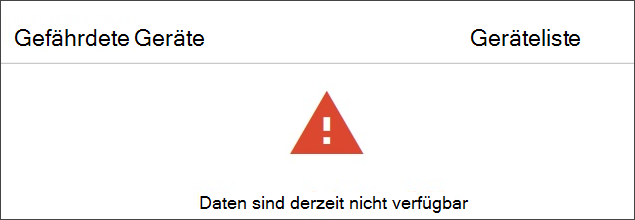

# Problembehandlung bei Abonnement- und PortalzugriffsproblemenTroubleshoot subscription and portal access issues

[!INCLUDE [Microsoft 365 Defender rebranding](../../includes/microsoft-defender.md)]

**Gilt für:****Applies to:**
- [Microsoft Defender für EndpunktMicrosoft Defender for Endpoint](https://go.microsoft.com/fwlink/p/?linkid=2146631)
- [Microsoft 365 DefenderMicrosoft 365 Defender](https://go.microsoft.com/fwlink/?linkid=2118804)

>Möchten Sie Microsoft Defender for Endpoint erleben?Want to experience Microsoft Defender for Endpoint? [Registrieren Sie sich für eine kostenlose Testversion.Sign up for a free trial.](https://www.microsoft.com/microsoft-365/windows/microsoft-defender-atp?ocid=docs-wdatp-troublshootonboarding-abovefoldlink)

Diese Seite enthält detaillierte Schritte zur Problembehandlung, die beim Einrichten Ihres Microsoft Defender for Endpoint-Diensts auftreten können.This page provides detailed steps to troubleshoot issues that might occur when setting up your Microsoft Defender for Endpoint service.

Wenn Sie eine Fehlermeldung erhalten, bietet Microsoft Defender Security Center eine ausführliche Erläuterung dazu, was das Problem ist, und relevante Links werden bereitgestellt.If you receive an error message, Microsoft Defender Security Center will provide a detailed explanation on what the issue is and relevant links will be supplied.

## Keine Abonnements gefundenNo subscriptions found

Wenn Sie beim Zugriff auf Microsoft  Defender Security Center eine Meldung "Keine Abonnements gefunden" erhalten, bedeutet dies, dass das Azure Active Directory (Azure AD), das zum Anmelden des Benutzers beim Portal verwendet wird, keine Microsoft Defender for Endpoint-Lizenz besitzt.If while accessing Microsoft Defender Security Center you get a **No subscriptions found** message, it means the Azure Active Directory (Azure AD) used to log in the user to the portal, does not have a Microsoft Defender for Endpoint license.

Mögliche Gründe:Potential reasons:
- Die Lizenzen für Windows E5 und Office E5 sind separate Lizenzen.The Windows E5 and Office E5 licenses are separate licenses.
- Die Lizenz wurde erworben, aber nicht für diese Azure AD-Instanz bereitgestellt.The license was purchased but not provisioned to this Azure AD instance.
    - Dies kann ein Problem mit der Lizenzbereitstellung sein.It could be a license provisioning issue.
    - Es könnte sein, dass Sie versehentlich die Lizenz für ein anderes Microsoft Azure AD bereitgestellt haben als die, die für die Authentifizierung im Dienst verwendet wird.It could be you inadvertently provisioned the license to a different Microsoft Azure AD than the one used for authentication into the service.

In beiden Fällen sollten Sie sich an den Microsoft-Support unter [General Microsoft Defender for Endpoint Support](https://support.microsoft.com/getsupport?wf=0&tenant=ClassicCommercial&oaspworkflow=start_1.0.0.0&locale=en-us&supportregion=en-us&pesid=16055&ccsid=636419533611396913) oder Volume license support [wenden.](https://www.microsoft.com/licensing/servicecenter/Help/Contact.aspx)For both cases, you should contact Microsoft support at [General Microsoft Defender for Endpoint Support](https://support.microsoft.com/getsupport?wf=0&tenant=ClassicCommercial&oaspworkflow=start_1.0.0.0&locale=en-us&supportregion=en-us&pesid=16055&ccsid=636419533611396913) or [Volume license support](https://www.microsoft.com/licensing/servicecenter/Help/Contact.aspx).

## Ihr Abonnement ist abgelaufenYour subscription has expired

Wenn Sie beim Zugriff auf Microsoft  Defender Security Center eine Nachricht erhalten, dass Ihr Abonnement abgelaufen ist, ist Ihr Onlinedienstabonnement abgelaufen.If while accessing Microsoft Defender Security Center you get a **Your subscription has expired** message, your online service subscription has expired. Microsoft Defender for Endpoint-Abonnement hat wie jedes andere Onlinedienstabonnement ein Ablaufdatum.Microsoft Defender for Endpoint subscription, like any other online service subscription, has an expiration date. 

Sie können die Lizenz jederzeit verlängern oder erweitern.You can choose to renew or extend the license at any point in time. Wenn Sie nach ablaufendem  Ablaufdatum auf das Portal zugreifen, wird einer Nachricht, die Ihr Abonnement abgelaufen ist, eine Option zum Herunterladen des Geräte-Offboarding-Pakets angezeigt, falls Sie die Lizenz nicht verlängern möchten.When accessing the portal after the expiration date a **Your subscription has expired** message will be presented with an option to download the device offboarding package, should you choose to not renew the license.

> [!NOTE]
> Aus Sicherheitsgründen läuft das für Offboard-Geräte verwendete Paket 30 Tage nach dem Downloaddatum ab.For security reasons, the package used to Offboard devices will expire 30 days after the date it was downloaded. Abgelaufene offboarding-Pakete, die an ein Gerät gesendet werden, werden abgelehnt.Expired offboarding packages sent to a device will be rejected. Beim Herunterladen eines offboarding-Pakets werden Sie über das Ablaufdatum der Pakete benachrichtigt und es wird auch im Paketnamen enthalten sein.When downloading an offboarding package you will be notified of the packages expiry date and it will also be included in the package name.

## Sie sind nicht autorisiert, auf das Portal zu zugreifenYou are not authorized to access the portal

Wenn Sie ein Produkt erhalten, das Sie nicht autorisiert haben, auf das Portal zu **zugreifen,** beachten Sie, dass Microsoft Defender for Endpoint ein Produkt für die Sicherheitsüberwachung, Die Untersuchung von Vorfällen und Reaktionen ist und daher der Zugriff darauf vom Benutzer eingeschränkt und gesteuert wird.If you receive a **You are not authorized to access the portal**, be aware that Microsoft Defender for Endpoint is a security monitoring, incident investigation and response product, and as such, access to it is restricted and controlled by the user.
Weitere Informationen finden Sie unter [**Zuweisen von Benutzerzugriff auf das Portal**](https://docs.microsoft.com/windows/threat-protection/windows-defender-atp/assign-portal-access-windows-defender-advanced-threat-protection).For more information, see, [**Assign user access to the portal**](https://docs.microsoft.com/windows/threat-protection/windows-defender-atp/assign-portal-access-windows-defender-advanced-threat-protection).

## Daten sind derzeit in einigen Abschnitten des Portals nicht verfügbarData currently isn't available on some sections of the portal
Wenn im Portaldashboard und in anderen Abschnitten eine Fehlermeldung angezeigt wird, z. B. "Daten sind derzeit nicht verfügbar":If the portal dashboard and other sections show an error message such as "Data currently isn't available":

Sie müssen die und alle Untergeordneten Domänen unter `securitycenter.windows.com` ihr zulassen.You'll need to allow the `securitycenter.windows.com` and all subdomains under it. Beispiel: `*.securitycenter.windows.com`.For example, `*.securitycenter.windows.com`.

## Probleme mit der PortalkommunikationPortal communication issues
Wenn Probleme beim Zugriff auf das Portal, fehlende Daten oder eingeschränkter Zugriff auf Teile des Portals auftreten, müssen Sie überprüfen, ob die folgenden URLs für die Kommunikation zulässig und geöffnet sind.If you encounter issues with accessing the portal, missing data, or restricted access to portions of the portal, you'll need to verify that the following URLs are allowed and open for communication.

- `*.blob.core.windows.net`
- `crl.microsoft.com`
- `https://*.microsoftonline-p.com`
- `https://*.securitycenter.windows.com` 
- `https://automatediracs-eus-prd.securitycenter.windows.com`
- `https://login.microsoftonline.com`
- `https://login.windows.net`
- `https://onboardingpackagescusprd.blob.core.windows.net`
- `https://secure.aadcdn.microsoftonline-p.com` 
- `https://securitycenter.windows.com` 
- `https://static2.sharepointonline.com` 

