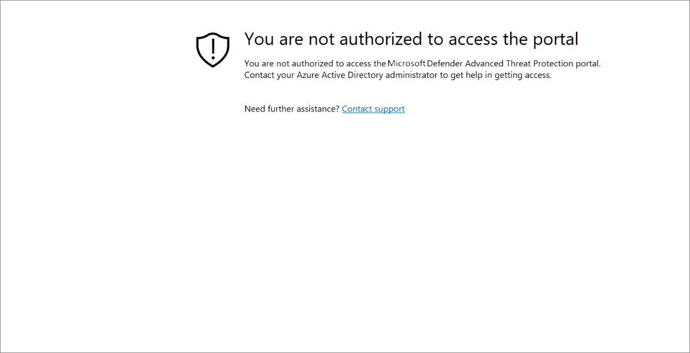

# Problembehandlung bei Abonnement- und Portalzugriffsproblemen

[!INCLUDE [Microsoft 365 Defender rebranding](../../includes/microsoft-defender.md)]

**Gilt für:**
- [Microsoft Defender für Endpunkt](https://go.microsoft.com/fwlink/p/?linkid=2146631)
- [Microsoft 365 Defender](https://go.microsoft.com/fwlink/?linkid=2118804)

>Möchten Sie Microsoft Defender for Endpoint erleben? [Registrieren Sie sich für eine kostenlose Testversion.](https://www.microsoft.com/microsoft-365/windows/microsoft-defender-atp?ocid=docs-wdatp-troublshootonboarding-abovefoldlink)

Diese Seite enthält detaillierte Schritte zur Problembehandlung, die beim Einrichten Ihres Microsoft Defender for Endpoint-Diensts auftreten können.

Wenn Sie eine Fehlermeldung erhalten, bietet Microsoft Defender Security Center eine ausführliche Erläuterung dazu, was das Problem ist, und relevante Links werden bereitgestellt.

## Keine Abonnements gefunden

Wenn Sie beim Zugriff auf Microsoft  Defender Security Center eine Meldung "Keine Abonnements gefunden" erhalten, bedeutet dies, dass das Azure Active Directory (Azure AD), das zum Anmelden des Benutzers beim Portal verwendet wird, keine Microsoft Defender for Endpoint-Lizenz besitzt.

Mögliche Gründe:
- Die Lizenzen für Windows E5 und Office E5 sind separate Lizenzen.
- Die Lizenz wurde erworben, aber nicht für diese Azure AD-Instanz bereitgestellt.
    - Dies kann ein Problem mit der Lizenzbereitstellung sein.
    - Es könnte sein, dass Sie versehentlich die Lizenz für ein anderes Microsoft Azure AD bereitgestellt haben als die, die für die Authentifizierung im Dienst verwendet wird.

In beiden Fällen sollten Sie sich an den Microsoft-Support unter [General Microsoft Defender for Endpoint Support](https://support.microsoft.com/getsupport?wf=0&tenant=ClassicCommercial&oaspworkflow=start_1.0.0.0&locale=en-us&supportregion=en-us&pesid=16055&ccsid=636419533611396913) oder Volume license support [wenden.](https://www.microsoft.com/licensing/servicecenter/Help/Contact.aspx)

## Ihr Abonnement ist abgelaufen

Wenn Sie beim Zugriff auf Microsoft  Defender Security Center eine Nachricht erhalten, dass Ihr Abonnement abgelaufen ist, ist Ihr Onlinedienstabonnement abgelaufen. Microsoft Defender for Endpoint-Abonnement hat wie jedes andere Onlinedienstabonnement ein Ablaufdatum. 

Sie können die Lizenz jederzeit verlängern oder erweitern. Wenn Sie nach ablaufendem  Ablaufdatum auf das Portal zugreifen, wird einer Nachricht, die Ihr Abonnement abgelaufen ist, eine Option zum Herunterladen des Geräte-Offboarding-Pakets angezeigt, falls Sie die Lizenz nicht verlängern möchten.

> [!NOTE]
> Aus Sicherheitsgründen läuft das für Offboard-Geräte verwendete Paket 30 Tage nach dem Downloaddatum ab. Abgelaufene offboarding-Pakete, die an ein Gerät gesendet werden, werden abgelehnt. Beim Herunterladen eines offboarding-Pakets werden Sie über das Ablaufdatum der Pakete benachrichtigt und es wird auch im Paketnamen enthalten sein.

## Sie sind nicht autorisiert, auf das Portal zu zugreifen

Wenn Sie ein Produkt erhalten, das Sie nicht autorisiert haben, auf das Portal zu **zugreifen,** beachten Sie, dass Microsoft Defender for Endpoint ein Produkt für die Sicherheitsüberwachung, Die Untersuchung von Vorfällen und Reaktionen ist und daher der Zugriff darauf vom Benutzer eingeschränkt und gesteuert wird.
Weitere Informationen finden Sie unter [**Zuweisen von Benutzerzugriff auf das Portal**](https://docs.microsoft.com/windows/threat-protection/windows-defender-atp/assign-portal-access-windows-defender-advanced-threat-protection).

## Daten sind derzeit in einigen Abschnitten des Portals nicht verfügbar
Wenn im Portaldashboard und in anderen Abschnitten eine Fehlermeldung angezeigt wird, z. B. "Daten sind derzeit nicht verfügbar":

Sie müssen die und alle Untergeordneten Domänen unter `securitycenter.windows.com` ihr zulassen. Beispiel: `*.securitycenter.windows.com`.

## Probleme mit der Portalkommunikation
Wenn Probleme beim Zugriff auf das Portal, fehlende Daten oder eingeschränkter Zugriff auf Teile des Portals auftreten, müssen Sie überprüfen, ob die folgenden URLs für die Kommunikation zulässig und geöffnet sind.

- `*.blob.core.windows.net`
- `crl.microsoft.com`
- `https://*.microsoftonline-p.com`
- `https://*.securitycenter.windows.com` 
- `https://automatediracs-eus-prd.securitycenter.windows.com`
- `https://login.microsoftonline.com`
- `https://login.windows.net`
- `https://onboardingpackagescusprd.blob.core.windows.net`
- `https://secure.aadcdn.microsoftonline-p.com` 
- `https://securitycenter.windows.com` 
- `https://static2.sharepointonline.com` 

