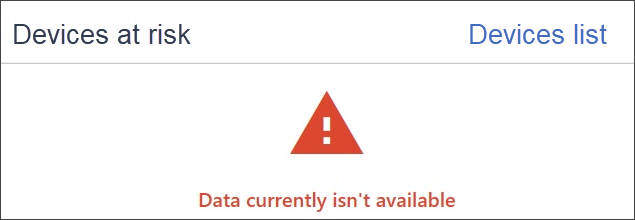

# Problembehandlung bei Abonnement- und Portalzugriffsproblemen.

[!INCLUDE [Microsoft 365 Defender rebranding](../../includes/microsoft-defender.md)]

**Gilt für:**
- [Microsoft Defender für Endpunkt](https://go.microsoft.com/fwlink/p/?linkid=2154037)
- [Microsoft 365 Defender](https://go.microsoft.com/fwlink/?linkid=2118804)

>Möchten Sie Microsoft Defender für Endpunkt erleben? [Registrieren Sie sich für eine kostenlose Testversion.](https://www.microsoft.com/microsoft-365/windows/microsoft-defender-atp?ocid=docs-wdatp-troublshootonboarding-abovefoldlink)

Auf dieser Seite finden Sie ausführliche Schritte zur Behandlung von Problemen, die beim Einrichten Ihres Microsoft Defender für Endpunkt-Diensts auftreten können.

Wenn Sie eine Fehlermeldung erhalten, geben Microsoft Defender Security Center eine ausführliche Erläuterung des Problems an, und es werden relevante Links bereitgestellt.

## Keine Abonnements gefunden

Wenn Sie beim Zugriff auf Microsoft Defender Security Center eine Meldung **"Keine Abonnements gefunden" erhalten,** bedeutet dies, dass die Azure Active Directory (Azure AD), die zum Anmelden des Benutzers beim Portal verwendet wird, nicht über eine Microsoft Defender für Endpunkt-Lizenz verfügt.

Mögliche Gründe:
- Die Lizenzen für Windows E5 und Office E5 sind separate Lizenzen.
- Die Lizenz wurde erworben, aber nicht für diese Azure AD-Instanz bereitgestellt.
    - Dies kann ein Lizenzbereitstellungsproblem sein.
    - Es kann sein, dass Sie die Lizenz versehentlich für eine andere Microsoft Azure AD bereitgestellt haben als die für die Authentifizierung beim Dienst verwendete Lizenz.

In beiden Fällen sollten Sie sich an den Microsoft-Support unter [General Microsoft Defender for Endpoint Support](https://support.microsoft.com/getsupport?wf=0&tenant=ClassicCommercial&oaspworkflow=start_1.0.0.0&locale=en-us&supportregion=en-us&pesid=16055&ccsid=636419533611396913) oder [Volumenlizenzsupport](https://www.microsoft.com/licensing/servicecenter/Help/Contact.aspx)wenden.

## Ihr Abonnement ist abgelaufen

Wenn Sie während des Zugriffs auf Microsoft Defender Security Center erhalten, dass **Ihr Abonnement abgelaufen ist,** ist Ihr Onlinedienstabonnement abgelaufen. Das Microsoft Defender für Endpunkt-Abonnement hat wie jedes andere Onlinedienstabonnement ein Ablaufdatum. 

Sie können die Lizenz jederzeit verlängern oder verlängern. Beim Zugriff auf das Portal nach dem Ablaufdatum, an dem ein **Abonnement abgelaufen ist,** wird eine Option zum Herunterladen des Offboarding-Pakets für Geräte angezeigt, falls Sie die Lizenz nicht verlängern möchten.

> [!NOTE]
> Aus Sicherheitsgründen läuft das Paket, das für Offboard-Geräte verwendet wird, 30 Tage nach dem Datum ab, an dem es heruntergeladen wurde. Abgelaufene Offboardingpakete, die an ein Gerät gesendet werden, werden abgelehnt. Beim Herunterladen eines Offboardingpakets werden Sie über das Ablaufdatum der Pakete benachrichtigt, und es wird auch im Paketnamen enthalten sein.

## Sie sind nicht berechtigt, auf das Portal zuzugreifen

Wenn Sie erhalten, dass **Sie nicht berechtigt sind, auf das Portal zuzugreifen,** beachten Sie, dass Microsoft Defender für Endpunkt ein Sicherheitsüberwachungs-, Vorfalluntersuchungs- und Reaktionsprodukt ist und daher der Zugriff darauf eingeschränkt und vom Benutzer gesteuert wird.
Weitere Informationen finden Sie unter Zuweisen des [**Benutzerzugriffs auf das Portal.**](/windows/threat-protection/windows-defender-atp/assign-portal-access-windows-defender-advanced-threat-protection)

## Daten sind derzeit in einigen Abschnitten des Portals nicht verfügbar.
Wenn im Portaldashboard und anderen Abschnitten eine Fehlermeldung angezeigt wird, z. B. "Daten sind derzeit nicht verfügbar":

Sie müssen die `securitycenter.windows.com` und alle darunter befindlichen Unterdomänen zulassen. Beispiel: `*.securitycenter.windows.com`.

## Probleme bei der Portalkommunikation
Wenn Probleme beim Zugriff auf das Portal, fehlende Daten oder eingeschränkter Zugriff auf Teile des Portals auftreten, müssen Sie überprüfen, ob die folgenden URLs zulässig und für die Kommunikation geöffnet sind.

- `*.blob.core.windows.net`
- `crl.microsoft.com`
- `https://*.microsoftonline-p.com`
- `https://*.securitycenter.windows.com` 
- `https://automatediracs-eus-prd.securitycenter.windows.com`
- `https://login.microsoftonline.com`
- `https://login.windows.net`
- `https://onboardingpackagescusprd.blob.core.windows.net`
- `https://secure.aadcdn.microsoftonline-p.com` 
- `https://securitycenter.windows.com` 
- `https://static2.sharepointonline.com` 

