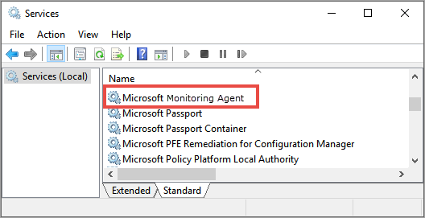
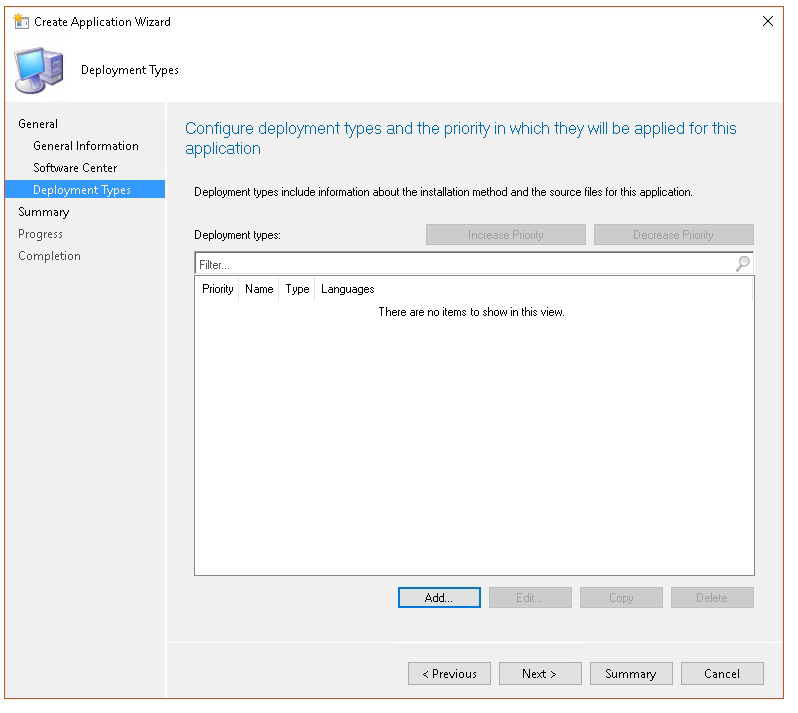

# <a name="troubleshoot-microsoft-defender-for-endpoint-onboarding-issues"></a>Behandeln von Problemen beim Onboarding von Microsoft Defender for Endpoint

[!INCLUDE [Microsoft 365 Defender rebranding](../../includes/microsoft-defender.md)]


**Gilt für:**

- [Microsoft Defender für Endpunkt](https://go.microsoft.com/fwlink/?linkid=2154037)
- Windows Server 2012 R2
- Windows Server 2016
- [Microsoft 365 Defender](https://go.microsoft.com/fwlink/?linkid=2118804)

> Möchten Sie Defender for Endpoint erleben? [Registrieren Sie sich für eine kostenlose Testversion.](https://www.microsoft.com/microsoft-365/windows/microsoft-defender-atp?ocid=docs-wdatp-pullalerts-abovefoldlink) 

Möglicherweise müssen Sie beim Microsoft Defender for Endpoint-Onboarding-Prozess Probleme beheben, wenn Probleme auftreten.
Diese Seite enthält detaillierte Schritte zur Problembehandlung bei Onboardingproblemen, die bei der Bereitstellung mit einem der Bereitstellungstools auftreten können, sowie häufige Fehler, die auf den Geräten auftreten können.

## <a name="troubleshoot-issues-with-onboarding-tools"></a>Behandeln von Problemen mit Onboardingtools

Wenn Sie den Onboardingprozess abgeschlossen haben und [](investigate-machines.md) geräte nach einer Stunde nicht mehr in der Liste Geräte angezeigt werden, kann dies auf ein Onboarding- oder Konnektivitätsproblem hinweisen.

### <a name="troubleshoot-onboarding-when-deploying-with-group-policy"></a>Problembehandlung beim Onboarding bei der Bereitstellung mit Gruppenrichtlinien

Die Bereitstellung mit Gruppenrichtlinien erfolgt durch Ausführen des Onboardingskripts auf den Geräten. Die Gruppenrichtlinienkonsole gibt nicht an, ob die Bereitstellung erfolgreich war oder nicht.

Wenn Sie den Onboardingprozess abgeschlossen haben und [](investigate-machines.md) geräte nach einer Stunde nicht mehr in der Liste Geräte angezeigt werden, können Sie die Ausgabe des Skripts auf den Geräten überprüfen. Weitere Informationen finden Sie unter [Problembehandlung beim Onboarding bei der Bereitstellung mit einem Skript.](#troubleshoot-onboarding-when-deploying-with-a-script)

Wenn das Skript erfolgreich abgeschlossen wurde, finden Sie unter Problembehandlung von [Onboardingproblemen](#troubleshoot-onboarding-issues-on-the-device) auf den Geräten weitere Fehler, die auftreten können.

### <a name="troubleshoot-onboarding-issues-when-deploying-with-microsoft-endpoint-configuration-manager"></a>Behandeln von Problemen beim Onboarding bei der Bereitstellung mit Microsoft Endpoint Configuration Manager

Beim Onboarding von Geräten mit den folgenden Versionen von Configuration Manager:

- Microsoft Endpoint Configuration Manager
- System Center 2012 Configuration Manager
- System Center 2012 R2 Configuration Manager

Die Bereitstellung mit den oben genannten Versionen von Configuration Manager erfolgt durch Ausführen des Onboardingskripts auf den Geräten. Sie können die Bereitstellung in der Configuration Manager-Konsole nachverfolgen.

Wenn die Bereitstellung fehlschlägt, können Sie die Ausgabe des Skripts auf den Geräten überprüfen.

Wenn das Onboarding erfolgreich abgeschlossen wurde, die  Geräte jedoch nach einer Stunde nicht in der Liste Geräte angezeigt werden, finden Sie unter Problembehandlung bei [Onboardingproblemen](#troubleshoot-onboarding-issues-on-the-device) auf dem Gerät weitere Fehler, die auftreten können.

### <a name="troubleshoot-onboarding-when-deploying-with-a-script"></a>Problembehandlung beim Onboarding bei der Bereitstellung mit einem Skript

**Überprüfen Sie das Ergebnis des Skripts auf dem Gerät:**

1. Klicken **Sie auf Start,** geben **Sie Ereignisanzeige ein,** und drücken Sie die **EINGABETASTE.**

2. Wechseln Sie **zu Windows Logs**  >  **Application**.

3. Suchen Sie nach einem Ereignis aus **der WDATPOnboarding-Ereignisquelle.**

Wenn das Skript fehlschlägt und das Ereignis ein Fehler ist, können Sie die Ereignis-ID in der folgenden Tabelle überprüfen, um Ihnen bei der Problembehandlung zu helfen.

> [!NOTE]
> Die folgenden Ereignis-IDs sind nur für das Onboardingskript spezifisch.

Ereignis-ID | Fehlertyp | Lösungsschritte
:---:|:---|:---
 `5` | Offboardingdaten wurden gefunden, konnten jedoch nicht gelöscht werden. | Überprüfen der Berechtigungen für die Registrierung, insbesondere<br> `HKLM\SOFTWARE\Policies\Microsoft\Windows Advanced Threat Protection`.
`10` | Onboardingdaten konnten nicht in die Registrierung geschrieben werden |  Überprüfen der Berechtigungen für die Registrierung, insbesondere<br> `HKLM\SOFTWARE\Policies\Microsoft\Windows Advanced Threat Protection`.<br>Stellen Sie sicher, dass das Skript als Administrator ausgeführt wurde.
`15` |  Fehler beim Starten des SENSE-Diensts |Überprüfen Sie den Dienstzustand ( `sc query sense` -Befehl). Stellen Sie sicher, dass es sich nicht in einem Zwischenzustand (*"Pending_Stopped"*, *"Pending_Running")* und versuchen Sie, das Skript erneut auszuführen (mit Administratorrechten). <br> <br> Wenn auf dem Gerät Windows 10, Version 1607, ausgeführt wird und der Befehl zurückgegeben wird, starten Sie `sc query sense` `START_PENDING` das Gerät neu. Wenn das Problem durch einen Neustart des Geräts nicht behoben wird, aktualisieren Sie auf KB4015217, und versuchen Sie es erneut.
`15` | Fehler beim Starten des SENSE-Diensts | Wenn die Fehlermeldung lautet: Systemfehler 577 oder Fehler 1058 ist aufgetreten, müssen Sie den Microsoft Defender Antivirus ELAM-Treiber aktivieren. Anweisungen dazu finden Sie unter [Sicherstellen,](#ensure-that-microsoft-defender-antivirus-is-not-disabled-by-a-policy) dass Microsoft Defender Antivirus nicht durch eine Richtlinie deaktiviert wird.
`30` |  Das Skript konnte nicht warten, bis der Dienst ausgeführt wurde | Der Dienst hätte beim Starten mehr Zeit zum Starten oder Fehler festgestellt. Weitere Informationen zu Ereignissen und Fehlern im Zusammenhang mit SENSE finden Sie unter [Überprüfen von Ereignissen und Fehlern mithilfe der Ereignisanzeige](event-error-codes.md).
`35` |  Das Skript konnte den erforderlichen Registrierungswert für den Onboardingstatus nicht finden. | Wenn der SENSE-Dienst zum ersten Mal gestartet wird, schreibt er den Onboardingstatus an den Registrierungsspeicherort.<br>`HKLM\SOFTWARE\Microsoft\Windows Advanced Threat Protection\Status`.<br> Das Skript konnte es nach einigen Sekunden nicht finden. Sie können ihn manuell testen und überprüfen, ob er dort ist. Weitere Informationen zu Ereignissen und Fehlern im Zusammenhang mit SENSE finden Sie unter [Überprüfen von Ereignissen und Fehlern mithilfe der Ereignisanzeige](event-error-codes.md).
`40` | Status des SENSE-Dienst-Onboardings ist nicht auf **1 festgelegt** | Fehler beim ordnungsgemäßen Onboarding des SENSE-Diensts. Weitere Informationen zu Ereignissen und Fehlern im Zusammenhang mit SENSE finden Sie unter [Überprüfen von Ereignissen und Fehlern mithilfe der Ereignisanzeige](event-error-codes.md).
`65` | Unzureichende Rechte| Führen Sie das Skript erneut mit Administratorrechten aus.

### <a name="troubleshoot-onboarding-issues-using-microsoft-intune"></a>Behandeln von Problemen beim Onboarding mithilfe von Microsoft Intune

Sie können Microsoft Intune verwenden, um Fehlercodes zu überprüfen und zu versuchen, die Ursache des Problems zu beheben.

Wenn Sie Richtlinien in Intune konfiguriert haben und sie nicht auf Geräten verbreitet werden, müssen Sie möglicherweise die automatische MDM-Registrierung konfigurieren.

Verwenden Sie die folgenden Tabellen, um die möglichen Ursachen von Problemen beim Onboarding zu verstehen:

- Microsoft Intune-Fehlercodes und OMA-URIs Tabelle
- Bekannte Probleme mit der Tabelle "Nichtkonformität"
- MdM-Ereignisprotokolltabelle (Mobile Device Management)

Wenn keines der Ereignisprotokolle und Problembehandlungsschritte funktioniert, laden Sie das Lokale Skript aus dem Abschnitt Geräteverwaltung des Portals herunter, und führen Sie es in einer Eingabeaufforderung mit erhöhten Rechten aus. 

#### <a name="microsoft-intune-error-codes-and-oma-uris"></a>Microsoft Intune-Fehlercodes und -OMA-URIs

Fehlercode-Hex | Fehlercode Dec | Fehlerbeschreibung | OMA-URI | Mögliche Ursachen- und Problembehandlungsschritte
:---:|:---|:---|:---|:---
0x87D1FDE8 | -2016281112 | Behebung fehlgeschlagen | Onboarding <br> Offboarding | **Mögliche Ursache:** Beim Onboarding oder Offboarding ist ein Fehler bei einem falschen Blob fehlgeschlagen: falsche Signatur oder fehlende PreviousOrgIds-Felder. <br><br> **Schritte zur Problembehandlung:** <br> Überprüfen Sie die Ereignis-IDs im Abschnitt Anzeigen von [Agent-Onboardingfehlern im Abschnitt Geräteereignisprotokoll.](#view-agent-onboarding-errors-in-the-device-event-log) <br><br> Überprüfen Sie die MDM-Ereignisprotokolle in der folgenden Tabelle, oder befolgen Sie die Anweisungen unter Diagnose von [MDM-Fehlern in Windows 10](https://docs.microsoft.com/windows/client-management/mdm/diagnose-mdm-failures-in-windows-10).
 | | | | Onboarding <br> Offboarding <br> SampleSharing | **Mögliche Ursache:** Microsoft Defender für Endpunktrichtlinien-Registrierungsschlüssel ist nicht vorhanden, oder der OMA -DM-Client verfügt nicht über Berechtigungen zum Schreiben. <br><br> **Schritte zur Problembehandlung:** Stellen Sie sicher, dass der folgende Registrierungsschlüssel vorhanden ist: `HKEY_LOCAL_MACHINE\SOFTWARE\Policies\Microsoft\Windows Advanced Threat Protection` <br> <br> Wenn er nicht vorhanden ist, öffnen Sie einen Befehl mit erhöhten Rechten, und fügen Sie den Schlüssel hinzu.
 | | | | SenseIsRunning <br> OnboardingState <br> OrgId |  **Mögliche Ursache:** Ein Versuch, die Behebung durch schreibgeschützte Eigenschaft zu versuchen. Das Onboarding ist fehlgeschlagen. <br><br> **Schritte zur Problembehandlung:** Überprüfen Sie die Schritte zur Problembehandlung unter Problembehandlung bei [Onboardingproblemen auf dem Gerät.](#troubleshoot-onboarding-issues-on-the-device) <br><br> Überprüfen Sie die MDM-Ereignisprotokolle in der folgenden Tabelle, oder befolgen Sie die Anweisungen unter Diagnose von [MDM-Fehlern in Windows 10](https://docs.microsoft.com/windows/client-management/mdm/diagnose-mdm-failures-in-windows-10).
 | | | | Alle | **Mögliche Ursache:** Versuchen Sie, Microsoft Defender for Endpoint auf nicht unterstützter SKU/Platform, insbesondere der Holographic SKU, zu implementieren. <br><br> Derzeit unterstützte Plattformen:<br> Enterprise, Education und Professional.<br> Server wird nicht unterstützt.
 0x87D101A9 | -2016345687 |SyncML(425): Fehler beim angeforderten Befehl, da der Absender nicht über ausreichende Zugriffssteuerungsberechtigungen (Access Control Permissions, ACL) für den Empfänger verfügt. | Alle |  **Mögliche Ursache:** Versuchen Sie, Microsoft Defender for Endpoint auf nicht unterstützter SKU/Platform, insbesondere der Holographic SKU, zu implementieren.<br><br> Derzeit unterstützte Plattformen:<br>  Enterprise, Education und Professional.

#### <a name="known-issues-with-non-compliance"></a>Bekannte Probleme mit der Nichtkonformität

Die folgende Tabelle enthält Informationen zu Problemen mit Nichtkonformität und wie Sie die Probleme beheben können.

Fall | Problembeschreibung | Mögliche Ursachen- und Problembehandlungsschritte
:---:|:---|:---
 `1` | Das Gerät ist kompatibel mit SenseIsRunning OMA-URI. Ist jedoch nicht kompatibel mit OrgId-, Onboarding- und OnboardingState-OMA-URIs. | **Mögliche Ursache:** Überprüfen Sie, ob der Benutzer OOBE nach der Installation oder dem Upgrade von Windows übergeben hat. Während des OOBE-Onboardings konnte das Onboarding nicht abgeschlossen werden, aber SENSE wird bereits ausgeführt.<br><br> **Schritte zur Problembehandlung:** Warten Sie, bis OOBE abgeschlossen ist.
 `2` |  Das Gerät ist kompatibel mit OrgId-, Onboarding- und OnboardingState-OMA-URIs, aber nicht kompatibel mit SenseIsRunning OMA-URI. |  **Mögliche Ursache:** Der Starttyp des Sense-Diensts wird als "Verzögerter Start" festgelegt. Manchmal führt dies dazu, dass der Microsoft Intune-Server das Gerät von SenseIsRunning als nicht kompatibel gemeldet, wenn die DM-Sitzung beim Systemstart stattfindet. <br><br> **Schritte zur Problembehandlung:** Das Problem sollte automatisch innerhalb von 24 Stunden behoben werden.
 `3` | Gerät ist nicht kompatibel | **Schritte zur Problembehandlung:** Stellen Sie sicher, dass Onboarding- und Offboardingrichtlinien nicht gleichzeitig auf demselben Gerät bereitgestellt werden.

#### <a name="mobile-device-management-mdm-event-logs"></a>Ereignisprotokolle für die Mobile Device Management (MDM)

Zeigen Sie die MDM-Ereignisprotokolle an, um Probleme zu beheben, die beim Onboarding auftreten können:

Protokollname: Microsoft\Windows\DeviceManagement-EnterpriseDiagnostics-Provider

Kanalname: Administrator

ID | Severity | Ereignisbeschreibung | Schritte zur Problembehandlung
:---|:---|:---|:---
1819 | Fehler | Microsoft Defender for Endpoint CSP: Fehler beim Festlegen des Knotenwerts. NodeId: (%1), TokenName: (%2), Ergebnis: (%3). | Laden Sie [das kumulative Update für Windows 10, 1607 herunter.](https://go.microsoft.com/fwlink/?linkid=829760)

## <a name="troubleshoot-onboarding-issues-on-the-device"></a>Behandeln von Problemen beim Onboarding auf dem Gerät

Wenn die verwendeten Bereitstellungstools keinen Fehler im Onboardingprozess angeben, Geräte jedoch weiterhin nicht in einer Stunde in der Geräteliste angezeigt werden, lesen Sie die folgenden Überprüfungsthemen, um zu überprüfen, ob beim Microsoft Defender for Endpoint-Agent ein Fehler aufgetreten ist.

- [Anzeigen von Fehlern beim Onboarding des Agents im Geräteereignisprotokoll](#view-agent-onboarding-errors-in-the-device-event-log)
- [Sicherstellen, dass der Diagnosedatendienst aktiviert ist](#ensure-the-diagnostics-service-is-enabled)
- [Sicherstellen, dass der Dienst auf den Start festgelegt ist](#ensure-the-service-is-set-to-start)
- [Sicherstellen, dass das Gerät über eine Internetverbindung verfügt](#ensure-the-device-has-an-internet-connection)
- [Stellen Sie sicher, dass Microsoft Defender Antivirus nicht durch eine Richtlinie deaktiviert ist](#ensure-that-microsoft-defender-antivirus-is-not-disabled-by-a-policy)

### <a name="view-agent-onboarding-errors-in-the-device-event-log"></a>Anzeigen von Fehlern beim Onboarding des Agents im Geräteereignisprotokoll

1. Klicken **Sie auf Start,** geben **Sie Ereignisanzeige ein,** und drücken Sie die **EINGABETASTE.**

2. Erweitern Sie **im Bereich Ereignisanzeige (Lokal)** **Anwendungen und Dienstprotokolle**  >  **Microsoft**  >  **Windows**  >  **SENSE**.

   > [!NOTE]
   > SENSE ist der interne Name, der verwendet wird, um auf den Verhaltenssensor zu verweisen, der Microsoft Defender for Endpoint unterstützt.

3. Wählen **Sie Betriebsbereit** aus, um das Protokoll zu laden.

4. Klicken Sie **im Aktionsbereich** auf **Aktuelles Protokoll filtern.**

5. Wählen Sie **auf der** Registerkarte Filter unter **Ereignisebene die** Option **Kritisch,** **Warnung** und **Fehler** aus, und klicken Sie auf **OK**.

   

6. Ereignisse, die auf Probleme hinweisen können, werden im **Bereich Betrieb** angezeigt. Sie können versuchen, sie basierend auf den Lösungen in der folgenden Tabelle zu beheben:

Ereigniskennung | Message | Lösungsschritte
:---:|:---|:---
 `5` | Microsoft Defender for Endpoint-Dienst konnte keine Verbindung mit dem Server unter Variable _herstellen_ | [Stellen Sie sicher, dass das Gerät über Internetzugriff verfügt.](#ensure-the-device-has-an-internet-connection)
 `6` | Der Microsoft Defender for Endpoint-Dienst ist nicht onboarded, und es wurden keine Onboardingparameter gefunden. Fehlercode: _Variable_ | [Führen Sie das Onboardingskript erneut aus.](configure-endpoints-script.md)
 `7` | Der Microsoft Defender for Endpoint-Dienst konnte die Onboardingparameter nicht lesen. Fehlercode: _Variable_ | [Stellen Sie sicher, dass das Gerät über Internetzugriff](#ensure-the-device-has-an-internet-connection)verfügt, und führen Sie dann den gesamten Onboardingvorgang erneut aus.
 `9` | Der Microsoft Defender for Endpoint-Dienst konnte seinen Starttyp nicht ändern. Fehlercode: Variable | Wenn das Ereignis während des Onboardings passiert ist, starten Sie das Onboardingskript neu, und versuchen Sie es erneut. Weitere Informationen finden Sie unter [Ausführen des Onboardingskripts erneut](configure-endpoints-script.md). <br><br>Wenn das Ereignis während des Offboardings passiert ist, wenden Sie sich an den Support.
`10` | Der Microsoft Defender for Endpoint-Dienst konnte die Onboardinginformationen nicht beibehalten. Fehlercode: Variable | Wenn das Ereignis während des Onboardings passiert ist, versuchen Sie erneut, das Onboardingskript auszuführen. Weitere Informationen finden Sie unter [Ausführen des Onboardingskripts erneut](configure-endpoints-script.md). <br><br>Wenn das Problem weiterhin besteht, wenden Sie sich an den Support.
`15` | Microsoft Defender for Endpoint kann den Befehlskanal nicht mit DER URL starten: _variable_ | [Stellen Sie sicher, dass das Gerät über Internetzugriff verfügt.](#ensure-the-device-has-an-internet-connection)
`17` | Der Microsoft Defender for Endpoint-Dienst konnte den Speicherort des Diensts für verbundene Benutzererfahrungen und Telemetrie nicht ändern. Fehlercode: Variable | [Führen Sie das Onboardingskript erneut aus.](configure-endpoints-script.md) Wenn das Problem weiterhin besteht, wenden Sie sich an den Support.
`25` | Der Microsoft Defender for Endpoint-Dienst konnte den Integritätsstatus in der Registrierung nicht zurücksetzen. Fehlercode: _Variable_ | Kontaktieren Sie den Support.
`27` | Fehler beim Aktivieren des Microsoft Defender for Endpoint-Modus in Windows Defender. Fehler beim Onboardingprozess. Fehlercode: Variable | Kontaktieren Sie den Support.
`29` | Fehler beim Lesen der offboarding-Parameter. Fehlertyp: %1, Fehlercode: %2, Beschreibung: %3 | Stellen Sie sicher, dass das Gerät über Internetzugriff verfügt, und führen Sie dann den gesamten Offboardingvorgang erneut aus.
`30` | Fehler beim Deaktivieren des $(build.sense.productDisplayName)-Modus in Microsoft Defender for Endpoint. Fehlercode: %1 | Kontaktieren Sie den Support.
`32` | $(build.sense.productDisplayName) service failed to request to stop itself after offboarding process. Fehlercode: %1 | Stellen Sie sicher, dass der Dienststarttyp manuell ist, und starten Sie das Gerät neu.
`55` | Fehler beim Erstellen des Secure ETW-Autologgers. Fehlercode: %1 | Starten Sie das Gerät neu.
`63` | Aktualisieren des Starttyps des externen Diensts. Name: %1, tatsächlicher Starttyp: %2, erwarteter Starttyp: %3, Exitcode: %4 | Identifizieren Sie, was Änderungen am Starttyp des erwähnten Diensts verursacht. Wenn der Exitcode nicht 0 ist, korrigieren Sie den Starttyp manuell auf den erwarteten Starttyp.
`64` | Starten des beendeten externen Diensts. Name: %1, Exitcode: %2 | Wenden Sie sich an den Support, wenn das Ereignis weiterhin angezeigt wird.
`68` | Der Starttyp des Diensts ist unerwartet. Dienstname: %1, tatsächlicher Starttyp: %2, erwarteter Starttyp: %3 | Identifizieren Sie, was Änderungen am Starttyp verursacht. Behebung des erwähnten Dienststarttyps.
`69` | Der Dienst wird beendet. Dienstname: %1 | Starten Sie den erwähnten Dienst. Wenden Sie sich an den Support, wenn diese beibehalten wird.

<br />

Es gibt zusätzliche Komponenten auf dem Gerät, von dem der Microsoft Defender for Endpoint-Agent abhängt, um ordnungsgemäß zu funktionieren. Wenn im Microsoft Defender for Endpoint-Agent-Ereignisprotokoll keine Onboardingfehler auftreten, führen Sie die folgenden Schritte aus, um sicherzustellen, dass die zusätzlichen Komponenten ordnungsgemäß konfiguriert sind.

<span id="ensure-the-diagnostics-service-is-enabled" />

### <a name="ensure-the-diagnostic-data-service-is-enabled"></a>Sicherstellen, dass der Diagnosedatendienst aktiviert ist

Wenn die Geräte nicht ordnungsgemäß melden, müssen Sie möglicherweise überprüfen, ob der Windows 10-Diagnosedatendienst auf den automatischen Start festgelegt ist und auf dem Gerät ausgeführt wird. Möglicherweise wurde der Dienst durch andere Programme oder Benutzerkonfigurationsänderungen deaktiviert.

Zuerst sollten Sie überprüfen, ob der Dienst automatisch gestartet wird, wenn Windows gestartet wird, und dann überprüfen, ob der Dienst gerade ausgeführt wird (und starten Sie ihn, falls nicht).

### <a name="ensure-the-service-is-set-to-start"></a>Sicherstellen, dass der Dienst auf den Start festgelegt ist

**Verwenden Sie die Befehlszeile, um den Starttyp des Windows 10-Diagnosedatendiensts zu überprüfen:**

1. Öffnen Sie eine Befehlszeilenaufforderung mit erhöhten Rechten auf dem Gerät:

   a. Klicken **Sie auf Start,** geben **Sie cmd** ein, und drücken Sie die **EINGABETASTE.**

   b. Klicken Sie mit der rechten Maustaste auf **Eingabeaufforderung**, und wählen Sie **Als Administrator ausführen** aus.

2. Geben Sie den folgenden Befehl ein, und drücken Sie die **EINGABETASTE**:

   ```text
   sc qc diagtrack
   ```

   Wenn der Dienst aktiviert ist, sollte das Ergebnis wie der folgende Screenshot aussehen:

   

   Wenn der nicht auf festgelegt ist, müssen Sie festlegen, dass der Dienst `START_TYPE` `AUTO_START` automatisch gestartet wird.

**Verwenden Sie die Befehlszeile, um den Windows 10-Diagnosedatendienst so zu legen, dass er automatisch gestartet wird:**

1. Öffnen Sie eine Befehlszeilenaufforderung mit erhöhten Rechten auf dem Gerät:

   a. Klicken **Sie auf Start,** geben **Sie cmd** ein, und drücken Sie die **EINGABETASTE.**

   b. Klicken Sie mit der rechten Maustaste auf **Eingabeaufforderung**, und wählen Sie **Als Administrator ausführen** aus.

2. Geben Sie den folgenden Befehl ein, und drücken Sie die **EINGABETASTE**:

   ```text
   sc config diagtrack start=auto
   ```

3. Es wird eine Erfolgsmeldung angezeigt. Überprüfen Sie die Änderung, indem Sie den folgenden Befehl eingeben, und drücken Sie die **EINGABETASTE:**

   ```text
   sc qc diagtrack
   ```

4. Starten Sie den Dienst.

   a. Geben Sie in der Eingabeaufforderung den folgenden Befehl ein, und drücken Sie die **EINGABETASTE**:

   ```text
   sc start diagtrack
   ```

### <a name="ensure-the-device-has-an-internet-connection"></a>Sicherstellen, dass das Gerät über eine Internetverbindung verfügt

Für den Window Defender ATP-Sensor muss Microsoft Windows HTTP (WinHTTP) Sensordaten melden und mit dem Microsoft Defender for Endpoint-Dienst kommunizieren.

WinHTTP ist unabhängig von den Internet-Browserproxyeinstellungen und anderen Benutzerkontextanwendungen und muss in der Lage sein, die Proxyserver zu erkennen, die in Ihrer bestimmten Umgebung verfügbar sind.

Führen Sie die im Thema Überprüfen der Clientkonnektivität mit [Microsoft Defender for Endpoint-Dienst-URLs](configure-proxy-internet.md#verify-client-connectivity-to-microsoft-defender-atp-service-urls) beschriebenen Schritte aus, um sicherzustellen, dass der Sensor über Dienstkonnektivität verfügt.

Wenn die Überprüfung fehlschlägt und Ihre Umgebung einen Proxy verwendet, um eine Verbindung mit dem Internet herzustellen, führen Sie die im Thema Konfigurieren von Proxy- und [Internetverbindungseinstellungen](configure-proxy-internet.md) beschriebenen Schritte aus.

### <a name="ensure-that-microsoft-defender-antivirus-is-not-disabled-by-a-policy"></a>Stellen Sie sicher, dass Microsoft Defender Antivirus nicht durch eine Richtlinie deaktiviert ist

> [!IMPORTANT]
> Folgendes gilt nur für  Geräte, die das Update vom August 2020 (Version 4.18.2007.8) für Microsoft Defender Antivirus noch nicht erhalten haben.
>
> Das Update stellt sicher, dass Microsoft Defender Antivirus nicht über eine Systemrichtlinie auf Clientgeräten deaktiviert werden kann.

**Problem:** Der Microsoft Defender for Endpoint-Dienst wird nach dem Onboarding nicht gestartet.

**Symptom:** Das Onboarding wurde erfolgreich abgeschlossen, beim Starten des Diensts wird jedoch Fehler 577 oder Fehler 1058 angezeigt.

**Lösung:** Wenn auf Ihren Geräten ein Drittanbieter-Antischatischwareclient ausgeführt wird, muss der Microsoft Defender for Endpoint-Agent den Early Launch Antimalware (ELAM)-Treiber aktivieren. Sie müssen sicherstellen, dass sie nicht von einer Systemrichtlinie deaktiviert wird.

- Je nach tool that you use to implement policies, you'll need to verify that the following Windows Defender policies are cleared:

  - DisableAntiSpyware
  - DisableAntiVirus

  In Gruppenrichtlinien sollten beispielsweise keine Einträge wie die folgenden Werte enthalten sein:

  - `<Key Path="SOFTWARE\Policies\Microsoft\Windows Defender"><KeyValue Value="0" ValueKind="DWord" Name="DisableAntiSpyware"/></Key>`
  - `<Key Path="SOFTWARE\Policies\Microsoft\Windows Defender"><KeyValue Value="0" ValueKind="DWord" Name="DisableAntiVirus"/></Key>`

> [!IMPORTANT]
> Die Einstellung wird eingestellt und wird ab dem `disableAntiSpyware` Update vom August 2020 (Version 4.18.2007.8) auf allen Clientgeräten auf Microsoft Defender Antivirus ignoriert.

- Führen Sie nach dem Löschen der Richtlinie die Onboardingschritte erneut aus.

- Sie können auch die vorherigen Registrierungsschlüsselwerte überprüfen, um zu überprüfen, ob die Richtlinie deaktiviert ist, indem Sie den Registrierungsschlüssel `HKEY_LOCAL_MACHINE\SOFTWARE\Policies\Microsoft\Windows Defender` öffnen.

    

   > [!NOTE]
   > Alle Windows Defender (wdboot, wdfilter, wdnisdrv, wdnissvc und windefend) sollten den Standardstatus haben. Das Ändern des Startvorgangs dieser Dienste wird nicht unterstützt und kann dazu zwingen, Ihr System neu zu abbilden.
   >
   > Beispiel für Standardkonfigurationen für WdBoot und WdFilter:
   > - `<Key Path="SYSTEM\CurrentControlSet\Services\WdBoot"><KeyValue Value="0" ValueKind="DWord" Name="Start"/></Key>`
   > - `<Key Path="SYSTEM\CurrentControlSet\Services\WdFilter"><KeyValue Value="0" ValueKind="DWord" Name="Start"/></Key>`

## <a name="troubleshoot-onboarding-issues-on-a-server"></a>Behandeln von Problemen beim Onboarding auf einem Server

Wenn beim Onboarding eines Servers Probleme auftreten, führen Sie die folgenden Überprüfungsschritte aus, um mögliche Probleme zu beheben.

- [Sicherstellen, dass Microsoft Monitoring Agent (MMA) installiert und konfiguriert ist, um Sensordaten an den Dienst zu melden](configure-server-endpoints.md)
- [Stellen Sie sicher, dass die Serverproxy- und Internetverbindungseinstellungen ordnungsgemäß konfiguriert sind.](configure-server-endpoints.md)

Möglicherweise müssen Sie auch Folgendes überprüfen:

- Überprüfen Sie, ob auf der Registerkarte  Prozesse im Task Manager ein Microsoft Defender for Endpoint Service **ausgeführt wird.** Zum Beispiel:

    

- Überprüfen Sie den Vorgangs-Manager für Ereignisanzeigeanwendungen und   >    >  **Diensteprotokolle,** um zu sehen, ob Fehler auftreten.

- Überprüfen **Sie unter Dienste,** ob **der Microsoft Monitoring Agent** auf dem Server ausgeführt wird. Beispiel:

    

- Überprüfen **Sie in Microsoft Monitoring Agent** Azure Log Analytics  >  **(OMS)** die Arbeitsbereiche, und überprüfen Sie, ob der Status ausgeführt wird.

    

- Überprüfen Sie, ob Geräte in der Liste **Geräte im** Portal angezeigt werden.

## <a name="confirming-onboarding-of-newly-built-devices"></a>Bestätigen des Onboardings von neu erstellten Geräten

Möglicherweise gibt es Instanzen, wenn das Onboarding auf einem neu erstellten Gerät bereitgestellt, aber nicht abgeschlossen wird.

Die folgenden Schritte bieten Anleitungen für das folgende Szenario:

- Onboardingpaket wird auf neu erstellten Geräten bereitgestellt
- Sensor wird nicht gestartet, da die Out-of-Box-Benutzeroberfläche (OOBE) oder die erste Benutzeranmeldung nicht abgeschlossen wurde
- Gerät ist deaktiviert oder neu gestartet, bevor der Endbenutzer eine erste Anmeldung durchführt
- In diesem Szenario wird der SENSE-Dienst nicht automatisch gestartet, obwohl das Onboardingpaket bereitgestellt wurde.

> [!NOTE]
> Die folgenden Schritte sind nur bei Verwendung von Microsoft Endpoint Configuration Manager relevant. Weitere Informationen zum Onboarding mit Microsoft Endpoint Configuration Manager finden Sie unter [Microsoft Defender for Endpoint](https://docs.microsoft.com/mem/configmgr/protect/deploy-use/windows-defender-advanced-threat-protection).

1. Erstellen Sie eine Anwendung in Microsoft Endpoint Configuration Manager.

    

2. Wählen **Sie Manuelles Angeben der Anwendungsinformationen aus.**

    

3. Geben Sie Informationen zur Anwendung an, und wählen Sie dann **Weiter aus.**

    

4. Geben Sie Informationen zum Software center an, und wählen Sie dann **Weiter aus.**

    

5. Wählen **Sie unter Bereitstellungstypen** **Hinzufügen aus.**

    

6. Wählen **Sie Manuelles Angeben der Bereitstellungstypinformationen** aus, und wählen Sie dann **Weiter aus.**

    

7. Geben Sie Informationen zum Bereitstellungstyp an, und wählen Sie dann **Weiter aus.**

    

8. Geben **Sie im Programm** für die  >  **Inhaltsinstallation** den Befehl an: `net start sense` .

    

9. Wählen **Sie in Detection-Methode** **Die Option Regeln konfigurieren aus,** um das Vorhandensein dieses Bereitstellungstyps zu erkennen, und wählen Sie **dann Add Clause aus.**

    

10. Geben Sie die folgenden Erkennungsregeldetails an, und wählen Sie dann **OK aus:**

    

11. Wählen **Sie unter Erkennungsmethode** **die Option Weiter aus.**

    

12. Geben **Sie in Benutzererfahrung** die folgenden Informationen an, und wählen Sie dann **Weiter** aus:

    

13. Wählen **Sie unter Anforderungen** die Option Weiter **aus.**

    

14. Wählen **Sie unter Abhängigkeiten** die Option **Weiter aus.**

    

15. Wählen **Sie in Zusammenfassung** **weiter** aus.

    

16. Wählen **Sie unter Fertigstellung** die Option Schließen **aus.**

    

17. Wählen **Sie unter Bereitstellungstypen** die Option **Weiter aus.**

    

18. Wählen **Sie in Zusammenfassung** **weiter** aus.

    

    Der Status wird dann angezeigt: 

19. Wählen **Sie unter Fertigstellung** die Option Schließen **aus.**

    

20. Sie können die Anwendung jetzt bereitstellen, indem Sie mit der rechten Maustaste auf die App klicken und **Bereitstellen auswählen.**

    

21. Wählen **Sie im Allgemeinen** Die Option Inhalte für **Abhängigkeiten automatisch verteilen und** Durchsuchen **aus.**

    

22. Wählen **Sie unter Inhalt** die Option Weiter **aus.**

    

23. Wählen **Sie unter Bereitstellungseinstellungen** die Option **Weiter aus.**

    

24. Wählen Sie unter **Planung** die Option So bald wie möglich nach der verfügbaren **Zeit** aus, und wählen Sie dann **Weiter aus.**

    

25. Wählen **Sie in Benutzererfahrung** die Option Änderungen zum Stichtag oder während eines Wartungsfensters **commit aus (erfordert Neustarts)** und wählen Sie dann **Weiter aus.**

    

26. Wählen **Sie unter Warnungen** **die Option Weiter aus.**

    

27. Wählen **Sie in Zusammenfassung** **weiter** aus.

    

    Der Status wird dann angezeigt 

28. Wählen **Sie unter Fertigstellung** die Option Schließen **aus.**

    


## <a name="related-topics"></a>Verwandte Themen

- [Problembehandlung von Microsoft Defender für Endpunkt](troubleshoot-mdatp.md)
- [Onboarding von Geräten](onboard-configure.md)
- [Konfigurieren von Geräteproxy- und Internetverbindungseinstellungen](configure-proxy-internet.md)
