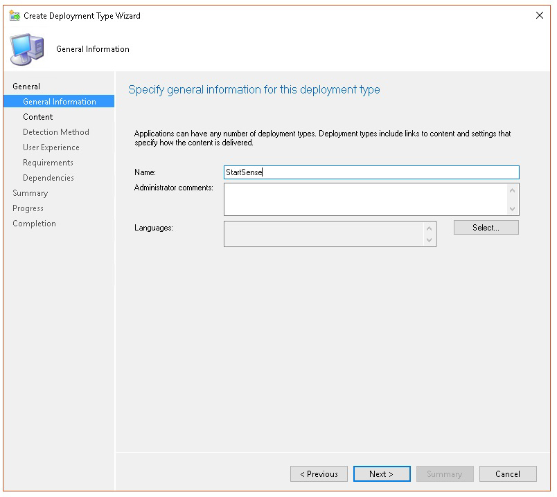

# <a name="troubleshoot-microsoft-defender-for-endpoint-onboarding-issues"></a>Behandeln von Problemen beim Onboarding von Microsoft Defender für Endpunkten

[!INCLUDE [Microsoft 365 Defender rebranding](../../includes/microsoft-defender.md)]


**Gilt für:**

- [Microsoft Defender für Endpunkt](https://go.microsoft.com/fwlink/?linkid=2154037)
- Windows Server 2012 R2
- Windows Server 2016
- [Microsoft 365 Defender](https://go.microsoft.com/fwlink/?linkid=2118804)

> Möchten Sie Defender für Endpunkt erfahren? [Registrieren Sie sich für eine kostenlose Testversion](https://www.microsoft.com/microsoft-365/windows/microsoft-defender-atp?ocid=docs-wdatp-pullalerts-abovefoldlink) 

Möglicherweise müssen Sie probleme beim Microsoft Defender für Endpunkt-Onboarding-Prozess beheben, wenn Probleme auftreten.
Diese Seite enthält detaillierte Schritte zur Behandlung von Problemen beim Onboarding, die bei der Bereitstellung mit einem der Bereitstellungstools auftreten können, sowie häufige Fehler, die auf den Geräten auftreten können.

## <a name="troubleshoot-issues-with-onboarding-tools"></a>Behandeln von Problemen mit Onboardingtools

Wenn Sie den Integrationsprozess abgeschlossen haben und nach einer Stunde keine Geräte in der [Geräteliste](investigate-machines.md) angezeigt werden, kann dies auf ein Onboarding- oder Verbindungsproblem hinweisen.

### <a name="troubleshoot-onboarding-when-deploying-with-group-policy"></a>Problembehandlung beim Onboarding bei der Bereitstellung mit gruppenrichtlinien

Die Bereitstellung mit gruppenrichtlinien erfolgt durch Ausführen des Onboarding-Skripts auf den Geräten. Die Gruppenrichtlinienkonsole gibt nicht an, ob die Bereitstellung erfolgreich war oder nicht.

Wenn Sie den Onboardingvorgang abgeschlossen haben und nach einer Stunde keine Geräte in der [Geräteliste](investigate-machines.md) sehen, können Sie die Ausgabe des Skripts auf den Geräten überprüfen. Weitere Informationen finden Sie unter [Problembehandlung beim Onboarding bei der Bereitstellung mit einem Skript.](#troubleshoot-onboarding-when-deploying-with-a-script)

Wenn das Skript erfolgreich abgeschlossen wurde, finden Sie unter ["Behandeln von Problemen beim Onboarding auf den Geräten"](#troubleshoot-onboarding-issues-on-the-device) weitere Fehler, die auftreten können.

### <a name="troubleshoot-onboarding-issues-when-deploying-with-microsoft-endpoint-configuration-manager"></a>Behandeln von Problemen beim Onboarding bei der Bereitstellung mit Microsoft Endpoint Configuration Manager

Beim Onboarding von Geräten mit den folgenden Versionen von Configuration Manager:

- Microsoft Endpoint Configuration Manager
- System Center 2012 Configuration Manager
- System Center 2012 R2 Configuration Manager

Die Bereitstellung mit den oben genannten Versionen von Configuration Manager erfolgt durch Ausführen des Onboarding-Skripts auf den Geräten. Sie können die Bereitstellung in der Configuration Manager-Konsole nachverfolgen.

Wenn die Bereitstellung fehlschlägt, können Sie die Ausgabe des Skripts auf den Geräten überprüfen.

Wenn das Onboarding erfolgreich abgeschlossen wurde, die Geräte jedoch nach einer Stunde nicht in der **Geräteliste** angezeigt werden, finden Sie unter ["Behandeln von Problemen beim Onboarding auf dem Gerät](#troubleshoot-onboarding-issues-on-the-device) weitere Fehler, die auftreten können".

### <a name="troubleshoot-onboarding-when-deploying-with-a-script"></a>Problembehandlung beim Onboarding bei der Bereitstellung mit einem Skript

**Überprüfen Sie das Ergebnis des Skripts auf dem Gerät:**

1. Klicken Sie auf **"Start",** geben **Sie "Ereignisanzeige"** ein, und drücken Sie die **EINGABETASTE.**

2. Wechseln Sie zu **Windows Logs**  >  **Application**.

3. Suchen Sie in der **WDATPOnboarding-Ereignisquelle** nach einem Ereignis.

Wenn das Skript fehlschlägt und das Ereignis ein Fehler ist, können Sie die Ereignis-ID in der folgenden Tabelle überprüfen, um Ihnen bei der Problembehandlung zu helfen.

> [!NOTE]
> Die folgenden Ereignis-IDs sind nur für das Onboardingskript spezifisch.

Ereignis-ID | Fehlertyp | Lösungsschritte
:---:|:---|:---
 `5` | Offboarding-Daten wurden gefunden, konnten aber nicht gelöscht werden | Überprüfen Sie die Berechtigungen für die Registrierung, insbesondere<br> `HKLM\SOFTWARE\Policies\Microsoft\Windows Advanced Threat Protection`.
`10` | Onboarding von Daten konnte nicht in die Registrierung geschrieben werden |  Überprüfen Sie die Berechtigungen für die Registrierung, insbesondere<br> `HKLM\SOFTWARE\Policies\Microsoft\Windows Advanced Threat Protection`.<br>Stellen Sie sicher, dass das Skript als Administrator ausgeführt wurde.
`15` |  Sense-Dienst konnte nicht gestartet werden |Überprüfen Sie den Dienststatus ( `sc query sense` Befehl). Stellen Sie sicher, dass er sich nicht in einem Zwischenzustand (*'Pending_Stopped'*, *'Pending_Running'*) befindet, und versuchen Sie, das Skript erneut auszuführen (mit Administratorrechten). <br> <br> Wenn auf dem Gerät Windows 10, Version 1607, ausgeführt wird und der Befehl `sc query sense` zurückgegeben `START_PENDING` wird, starten Sie das Gerät neu. Wenn das Problem durch einen Neustart des Geräts nicht behoben wird, führen Sie ein Upgrade auf KB4015217 durch, und versuchen Sie es erneut.
`15` | Sense-Dienst konnte nicht gestartet werden | Wenn die Meldung des Fehlers lautet: Systemfehler 577 oder Fehler 1058 ist aufgetreten, müssen Sie die Microsoft Defender Antivirus ELAM-Treiber aktivieren. Anweisungen finden Sie unter ["Sicherstellen, dass Microsoft Defender Antivirus nicht durch eine Richtlinie deaktiviert ist."](#ensure-that-microsoft-defender-antivirus-is-not-disabled-by-a-policy)
`30` |  Das Skript konnte nicht warten, bis der Dienst gestartet wurde. | Der Dienst hat möglicherweise mehr Zeit zum Starten benötigt, oder es sind Fehler beim Starten aufgetreten. Weitere Informationen zu Ereignissen und Fehlern im Zusammenhang mit SENSE finden Sie unter [Überprüfen von Ereignissen und Fehlern mithilfe der Ereignisanzeige.](event-error-codes.md)
`35` |  Das Skript konnte den erforderlichen Registrierungswert für den Integrationsstatus nicht finden. | Wenn der SENSE-Dienst zum ersten Mal gestartet wird, schreibt er den Integrationsstatus in den Registrierungsspeicherort.<br>`HKLM\SOFTWARE\Microsoft\Windows Advanced Threat Protection\Status`.<br> Das Skript konnte es nach einigen Sekunden nicht finden. Sie können es manuell testen und überprüfen, ob es vorhanden ist. Weitere Informationen zu Ereignissen und Fehlern im Zusammenhang mit SENSE finden Sie unter [Überprüfen von Ereignissen und Fehlern mithilfe der Ereignisanzeige.](event-error-codes.md)
`40` | DER INTEGRATIONSstatus des SENSE-Diensts ist nicht auf **1** festgelegt. | Der SENSE-Dienst konnte nicht ordnungsgemäß integriert werden. Weitere Informationen zu Ereignissen und Fehlern im Zusammenhang mit SENSE finden Sie unter [Überprüfen von Ereignissen und Fehlern mithilfe der Ereignisanzeige.](event-error-codes.md)
`65` | Unzureichende Berechtigungen| Führen Sie das Skript erneut mit Administratorrechten aus.

### <a name="troubleshoot-onboarding-issues-using-microsoft-intune"></a>Behandeln von Problemen beim Onboarding mithilfe von Microsoft Intune

Sie können Microsoft Intune verwenden, um Fehlercodes zu überprüfen und zu versuchen, die Ursache des Problems zu beheben.

Wenn Sie Richtlinien in Intune konfiguriert haben und diese nicht auf Geräten weitergegeben werden, müssen Sie möglicherweise die automatische MDM-Registrierung konfigurieren.

Verwenden Sie die folgenden Tabellen, um die möglichen Ursachen von Problemen beim Onboarding zu verstehen:

- Microsoft Intune Fehlercodes und OMA-URIs Tabelle
- Bekannte Probleme bei der Nichtkonformitätstabelle
- Mdm-Ereignisprotokolltabelle (Mobile Device Management)

Wenn keines der Ereignisprotokolle und Schritte zur Problembehandlung funktioniert, laden Sie das lokale Skript aus dem Abschnitt **"Geräteverwaltung"** des Portals herunter, und führen Sie es in einer Eingabeaufforderung mit erhöhten Rechten aus.

#### <a name="microsoft-intune-error-codes-and-oma-uris"></a>Microsoft Intune Fehlercodes und OMA-URIs

Fehlercode-Hexadezimalwert | Fehlercode Dez | Fehlerbeschreibung | OMA-URI | Mögliche Ursachen und Schritte zur Problembehandlung
:---:|:---|:---|:---|:---
0x87D1FDE8 | -2016281112 | Problembehebung fehlgeschlagen | Onboarding <br> Offboarding | **Mögliche Ursache:** Fehler beim Onboarding oder Offboarding für ein falsches Blob: falsche Signatur oder fehlende PreviousOrgIds-Felder. <br><br> **Schritte zur Problembehandlung:** <br> Überprüfen Sie die Ereignis-IDs im Abschnitt "Anzeigen von [Agent-Onboardingfehlern" im Abschnitt "Geräteereignisprotokoll".](#view-agent-onboarding-errors-in-the-device-event-log) <br><br> Überprüfen Sie die MDM-Ereignisprotokolle in der folgenden Tabelle, oder befolgen Sie die Anweisungen unter Diagnose von [MDM-Fehlern in Windows 10](/windows/client-management/mdm/diagnose-mdm-failures-in-windows-10).
 | | | | Onboarding <br> Offboarding <br> SampleSharing | **Mögliche Ursache:** Der Registrierungsschlüssel der Microsoft Defender für Endpunktrichtlinie ist nicht vorhanden, oder der OMA DM-Client verfügt nicht über die Berechtigungen zum Schreiben in den Client. <br><br> **Schritte zur Problembehandlung:** Stellen Sie sicher, dass der folgende Registrierungsschlüssel vorhanden ist: `HKEY_LOCAL_MACHINE\SOFTWARE\Policies\Microsoft\Windows Advanced Threat Protection` <br> <br> Wenn er nicht vorhanden ist, öffnen Sie einen Befehl mit erhöhten Rechten, und fügen Sie den Schlüssel hinzu.
 | | | | SenseIsRunning <br> OnboardingState <br> OrgId |  **Mögliche Ursache:** Ein Versuch, die Korrektur durch schreibgeschützte Eigenschaft zu beheben. Das Onboarding ist fehlgeschlagen. <br><br> **Schritte zur Problembehandlung:** Überprüfen Sie die Schritte zur Problembehandlung in [der Problembehandlung bei Onboarding-Problemen auf dem Gerät.](#troubleshoot-onboarding-issues-on-the-device) <br><br> Überprüfen Sie die MDM-Ereignisprotokolle in der folgenden Tabelle, oder befolgen Sie die Anweisungen unter [Diagnose von MDM-Fehlern in Windows 10](/windows/client-management/mdm/diagnose-mdm-failures-in-windows-10).
 | | | | Alle | **Mögliche Ursache:** Versuchen Sie, Microsoft Defender für Endpunkt auf nicht unterstützter SKU/Plattform bereitzustellen, insbesondere holografische SKU. <br><br> Derzeit unterstützte Plattformen:<br> Enterprise, Education und Professional.<br> Der Server wird nicht unterstützt.
 0x87D101A9 | -2016345687 |SyncML(425): Der angeforderte Befehl ist fehlgeschlagen, da der Absender nicht über ausreichende Zugriffssteuerungsberechtigungen (Access Control Permissions, ACL) für den Empfänger verfügt. | Alle |  **Mögliche Ursache:** Versuchen Sie, Microsoft Defender für Endpunkt auf nicht unterstützter SKU/Plattform bereitzustellen, insbesondere holografische SKU.<br><br> Derzeit unterstützte Plattformen:<br>  Enterprise, Education und Professional.

#### <a name="known-issues-with-non-compliance"></a>Bekannte Probleme bei Nichtkonformität

Die folgende Tabelle enthält Informationen zu Problemen mit Nichtkonformität und wie Sie die Probleme beheben können.

Fall | Problembeschreibung | Mögliche Ursachen und Schritte zur Problembehandlung
:---:|:---|:---
 `1` | Das Gerät ist mit SenseIsRunning OMA-URI kompatibel. Ist jedoch nicht kompatibel mit OrgId, Onboarding und OnboardingState-OMA-URIs. | **Mögliche Ursache:** Überprüfen Sie, ob der Benutzer die Windows-Willkommensseite nach Windows Installation oder dem Upgrade übergeben hat. Während der Windows-Willkommensseite konnte das Onboarding nicht abgeschlossen werden, sense wird jedoch bereits ausgeführt.<br><br> **Schritte zur Problembehandlung:** Warten Sie, bis die Windows-Willkommensseite abgeschlossen ist.
 `2` |  Das Gerät ist mit OrgId-, Onboarding- und OnboardingState-OMA-URIs kompatibel, aber nicht mit SenseIsRunning OMA-URI kompatibel. |  **Mögliche Ursache:** Der Starttyp des Sense-Diensts wird als "Verzögerter Start" festgelegt. Dies führt manchmal dazu, dass der Microsoft Intune-Server das Gerät von SenseIsRunning als nicht kompatibel meldet, wenn die DM-Sitzung beim Systemstart stattfindet. <br><br> **Schritte zur Problembehandlung:** Das Problem sollte innerhalb von 24 Stunden automatisch behoben werden.
 `3` | Gerät ist nicht kompatibel | **Schritte zur Problembehandlung:** Stellen Sie sicher, dass Onboarding- und Offboarding-Richtlinien nicht gleichzeitig auf demselben Gerät bereitgestellt werden.

#### <a name="mobile-device-management-mdm-event-logs"></a>Mdm-Ereignisprotokolle (Mobile Device Management)

Zeigen Sie die MDM-Ereignisprotokolle an, um Probleme zu beheben, die während des Onboardings auftreten können:

Protokollname: Microsoft\Windows\DeviceManagement-EnterpriseDiagnostics-Provider

Kanalname: Administrator

ID | Severity | Ereignisbeschreibung | Schritte zur Problembehandlung
:---|:---|:---|:---
1819 | Fehler | Microsoft Defender für Endpunkt-CSP: Fehler beim Festlegen des Knotenwerts. NodeId: (%1), TokenName: (%2), Result: (%3). | Laden Sie das [kumulative Update für Windows 10, 1607 herunter.](https://go.microsoft.com/fwlink/?linkid=829760)

## <a name="troubleshoot-onboarding-issues-on-the-device"></a>Behandeln von Problemen beim Onboarding auf dem Gerät

Wenn die verwendeten Bereitstellungstools keinen Fehler im Onboardingprozess angeben, geräte aber immer noch nicht innerhalb einer Stunde in der Geräteliste angezeigt werden, lesen Sie die folgenden Überprüfungsthemen, um zu überprüfen, ob beim Microsoft Defender für Endpunkt-Agent ein Fehler aufgetreten ist.

- [Anzeigen von Fehlern beim Agent-Onboarding im Geräteereignisprotokoll](#view-agent-onboarding-errors-in-the-device-event-log)
- [Sicherstellen, dass der Diagnosedatendienst aktiviert ist](#ensure-the-diagnostics-service-is-enabled)
- [Stellen Sie sicher, dass der Dienst für den Start festgelegt ist.](#ensure-the-service-is-set-to-start)
- [Sicherstellen, dass das Gerät über eine Internetverbindung verfügt](#ensure-the-device-has-an-internet-connection)
- [Sicherstellen, dass Microsoft Defender Antivirus nicht durch eine Richtlinie deaktiviert ist](#ensure-that-microsoft-defender-antivirus-is-not-disabled-by-a-policy)

### <a name="view-agent-onboarding-errors-in-the-device-event-log"></a>Anzeigen von Fehlern beim Agent-Onboarding im Geräteereignisprotokoll

1. Klicken Sie auf **"Start",** geben **Sie "Ereignisanzeige"** ein, und drücken Sie die **EINGABETASTE.**

2. Erweitern Sie im **Bereich "Ereignisanzeige (lokal)** **Anwendungs- und Dienstprotokolle**  >  **Microsoft**  >  **Windows**  >  **SENSE."**

   > [!NOTE]
   > SENSE ist der interne Name, der verwendet wird, um auf den Verhaltenssensor zu verweisen, der Microsoft Defender für Endpunkt unterstützt.

3. Wählen Sie **"Betriebsbereit"** aus, um das Protokoll zu laden.

4. Klicken Sie im **Aktionsbereich** auf **"Aktuelles Protokoll filtern".**

5. Wählen Sie auf der Registerkarte **"Filter"** unter **"Ereignisebene":** **"Kritisch",** **"Warnung"** und **"Fehler"** aus, und klicken Sie auf **"OK".**

   

6. Ereignisse, die auf Probleme hinweisen können, werden im **Bereich "Betrieb"** angezeigt. Sie können versuchen, die Problembehandlung basierend auf den Lösungen in der folgenden Tabelle auszuführen:

Ereigniskennung | Message | Lösungsschritte
:---:|:---|:---
 `5` | Microsoft Defender für Endpunktdienst konnte keine Verbindung mit dem Server bei _Variable_ herstellen | [Stellen Sie sicher, dass das Gerät über Internetzugriff verfügt.](#ensure-the-device-has-an-internet-connection)
 `6` | Der Microsoft Defender für Endpunkt-Dienst ist nicht integriert, und es wurden keine Onboardingparameter gefunden. Fehlercode: _Variable_ | [Führen Sie das Onboardingskript erneut](configure-endpoints-script.md)aus.
 `7` | Der Microsoft Defender für Endpunkt-Dienst konnte die Onboardingparameter nicht lesen. Fehlercode: _Variable_ | [Stellen Sie sicher, dass das Gerät über Internetzugriff verfügt,](#ensure-the-device-has-an-internet-connection)und führen Sie dann den gesamten Integrationsprozess erneut aus.
 `9` | Der Starttyp des Microsoft Defender für Endpunktdiensts konnte nicht geändert werden. Fehlercode: Variable | Wenn das Ereignis während des Onboardings aufgetreten ist, starten Sie es neu, und versuchen Sie erneut, das Onboardingskript auszuführen. Weitere Informationen finden Sie unter [Ausführen des Onboardingskripts erneut.](configure-endpoints-script.md) <br><br>Wenn das Ereignis während des Offboardings aufgetreten ist, wenden Sie sich an den Support.
`10` | Der Microsoft Defender für Endpunkt-Dienst konnte die Onboardinginformationen nicht speichern. Fehlercode: Variable | Wenn das Ereignis während des Onboardings aufgetreten ist, versuchen Sie erneut, das Onboardingskript auszuführen. Weitere Informationen finden Sie unter [Ausführen des Onboardingskripts erneut.](configure-endpoints-script.md) <br><br>Wenn das Problem weiterhin besteht, wenden Sie sich an den Support.
`15` | Microsoft Defender für Endpunkt kann befehlskanal nicht mit URL: _Variable_ starten | [Stellen Sie sicher, dass das Gerät über Internetzugriff verfügt.](#ensure-the-device-has-an-internet-connection)
`17` | Der Microsoft Defender für Endpunkt-Dienst konnte den Standort des Diensts "Benutzererfahrungen und Telemetrie im verbundenen Dienst" nicht ändern. Fehlercode: Variable | [Führen Sie das Onboardingskript erneut](configure-endpoints-script.md)aus. Wenn das Problem weiterhin besteht, wenden Sie sich an den Support.
`25` | Der Microsoft Defender für Endpunkt-Dienst konnte den Integritätsstatus in der Registrierung nicht zurücksetzen. Fehlercode: _Variable_ | Kontaktieren Sie den Support.
`27` | Fehler beim Aktivieren des Microsoft Defender für Endpunkt-Modus in Windows Defender. Integrationsvorgang fehlgeschlagen. Fehlercode: Variable | Kontaktieren Sie den Support.
`29` | Offboarding-Parameter konnten nicht gelesen werden. Fehlertyp: %1, Fehlercode: %2, Beschreibung: %3 | Stellen Sie sicher, dass das Gerät über Internetzugriff verfügt, und führen Sie dann den gesamten Offboarding-Prozess erneut aus.
`30` | Fehler beim Deaktivieren des $(build.sense.productDisplayName)-Modus in Microsoft Defender für Endpunkt. Fehlercode: %1 | Kontaktieren Sie den Support.
`32` | $(build.sense.productDisplayName) service failed to request to stop itself after offboarding process. Fehlercode: %1 | Stellen Sie sicher, dass der Starttyp des Diensts manuell ist, und starten Sie das Gerät neu.
`55` | Fehler beim Erstellen der Autologger-Funktion "Secure ETW". Fehlercode: %1 | Starten Sie das Gerät neu.
`63` | Aktualisieren des Starttyps des externen Diensts. Name: %1, tatsächlicher Starttyp: %2, erwarteter Starttyp: %3, Exitcode: %4 | Ermitteln Sie, was Änderungen am Starttyp des erwähnten Diensts verursacht. Wenn der Exitcode nicht 0 ist, korrigieren Sie den Starttyp manuell auf den erwarteten Starttyp.
`64` | Starten des angehaltenen externen Diensts. Name: %1, Exitcode: %2 | Wenden Sie sich an den Support, wenn das Ereignis weiterhin angezeigt wird.
`68` | Der Starttyp des Diensts ist unerwartet. Dienstname: %1, tatsächlicher Starttyp: %2, erwarteter Starttyp: %3 | Identifizieren Sie, was Änderungen am Starttyp verursacht. Behebung des erwähnten Dienststarttyps.
`69` | Der Dienst wird beendet. Dienstname: %1 | Starten Sie den erwähnten Dienst. Wenden Sie sich an den Support, wenn er beibehalten wird.

<br />

Es gibt zusätzliche Komponenten auf dem Gerät, von denen der Microsoft Defender für Endpunkt-Agent abhängt, um ordnungsgemäß zu funktionieren. Wenn im Ereignisprotokoll des Microsoft Defender für Endpunkt-Agents keine Fehler im Zusammenhang mit dem Onboarding auftreten, fahren Sie mit den folgenden Schritten fort, um sicherzustellen, dass die zusätzlichen Komponenten ordnungsgemäß konfiguriert sind.

<span id="ensure-the-diagnostics-service-is-enabled" />

### <a name="ensure-the-diagnostic-data-service-is-enabled"></a>Sicherstellen, dass der Diagnosedatendienst aktiviert ist

Wenn die Geräte nicht ordnungsgemäß gemeldet werden, müssen Sie möglicherweise überprüfen, ob der Windows 10 Diagnosedatendienst für den automatischen Start festgelegt ist und auf dem Gerät ausgeführt wird. Der Dienst wurde möglicherweise durch andere Programme oder Änderungen der Benutzerkonfiguration deaktiviert.

Zuerst sollten Sie überprüfen, ob der Dienst automatisch gestartet wird, wenn Windows gestartet wird, und dann sollten Sie überprüfen, ob der Dienst derzeit ausgeführt wird (und ihn starten, wenn dies nicht der Fall ist).

### <a name="ensure-the-service-is-set-to-start"></a>Stellen Sie sicher, dass der Dienst für den Start festgelegt ist.

**Verwenden Sie die Befehlszeile, um den Starttyp Windows 10 Diagnosedatendiensts zu überprüfen:**

1. Öffnen Sie eine Eingabeaufforderung mit erhöhten Rechten auf dem Gerät:

   a. Klicken Sie auf **"Start",** geben Sie **"cmd" ein,** und drücken Sie die **EINGABETASTE.**

   b. Klicken Sie mit der rechten Maustaste auf **Eingabeaufforderung**, und wählen Sie **Als Administrator ausführen** aus.

2. Geben Sie den folgenden Befehl ein, und drücken Sie die **EINGABETASTE:**

   ```text
   sc qc diagtrack
   ```

   Wenn der Dienst aktiviert ist, sollte das Ergebnis wie im folgenden Screenshot aussehen:

   

   Wenn dies `START_TYPE` nicht der Fall `AUTO_START` ist, müssen Sie festlegen, dass der Dienst automatisch gestartet wird.

**Verwenden Sie die Befehlszeile, um den Windows 10 Diagnosedatendienst so festzulegen, dass er automatisch gestartet wird:**

1. Öffnen Sie eine Eingabeaufforderung mit erhöhten Rechten auf dem Gerät:

   a. Klicken Sie auf **"Start",** geben Sie **"cmd" ein,** und drücken Sie die **EINGABETASTE.**

   b. Klicken Sie mit der rechten Maustaste auf **Eingabeaufforderung**, und wählen Sie **Als Administrator ausführen** aus.

2. Geben Sie den folgenden Befehl ein, und drücken Sie die **EINGABETASTE:**

   ```text
   sc config diagtrack start=auto
   ```

3. Eine Erfolgsmeldung wird angezeigt. Überprüfen Sie die Änderung, indem Sie den folgenden Befehl eingeben, und drücken Sie die **EINGABETASTE:**

   ```text
   sc qc diagtrack
   ```

4. Starten Sie den Dienst.

   a. Geben Sie an der Eingabeaufforderung den folgenden Befehl ein, und drücken Sie die **EINGABETASTE:**

   ```text
   sc start diagtrack
   ```

### <a name="ensure-the-device-has-an-internet-connection"></a>Sicherstellen, dass das Gerät über eine Internetverbindung verfügt

Der Microsoft Defender für Endpunkt-Sensor setzt Microsoft Windows HTTP (WinHTTP) voraus, um Sensordaten zu melden und mit dem Microsoft Defender für Endpunkt-Dienst zu kommunizieren.

WinHTTP ist unabhängig von den Proxyeinstellungen für das Internetbrowsen und anderen Benutzerkontextanwendungen und muss in der Lage sein, die Proxyserver zu erkennen, die in Ihrer bestimmten Umgebung verfügbar sind.

Um sicherzustellen, dass der Sensor über Eine Dienstkonnektivität verfügt, führen Sie die schritte aus, die im Thema "Überprüfen der [Clientkonnektivität mit Microsoft Defender für Endpunkt-Dienst-URLs"](configure-proxy-internet.md#verify-client-connectivity-to-microsoft-defender-for-endpoint-service-urls) beschrieben sind.

Wenn die Überprüfung fehlschlägt und Ihre Umgebung einen Proxy verwendet, um eine Verbindung mit dem Internet herzustellen, führen Sie die schritte aus, die im Thema "Konfigurieren von [Proxy- und Internetkonnektivitätseinstellungen"](configure-proxy-internet.md) beschrieben sind.

### <a name="ensure-that-microsoft-defender-antivirus-is-not-disabled-by-a-policy"></a>Sicherstellen, dass Microsoft Defender Antivirus nicht durch eine Richtlinie deaktiviert ist

> [!IMPORTANT]
> Folgendes gilt nur für Geräte, die das Update vom August 2020 (Version 4.18.2007.8) noch **nicht** auf Microsoft Defender Antivirus erhalten haben.
>
> Das Update stellt sicher, dass Microsoft Defender Antivirus auf Clientgeräten nicht über eine Systemrichtlinie deaktiviert werden kann.

**Problem:** Der Microsoft Defender für Endpunkt-Dienst wird nach dem Onboarding nicht gestartet.

**Symptom:** Das Onboarding wurde erfolgreich abgeschlossen, aber beim Versuch, den Dienst zu starten, wird Fehler 577 oder Fehler 1058 angezeigt.

**Lösung:** Wenn Auf Ihren Geräten ein Antischadsoftwareclient eines Drittanbieters ausgeführt wird, benötigt der Microsoft Defender für Endpunkt-Agent den ELAM-Treiber (Early Launch Antimalware), um aktiviert zu sein. Sie müssen sicherstellen, dass sie nicht durch eine Systemrichtlinie deaktiviert wird.

- Je nach dem Tool, das Sie zum Implementieren von Richtlinien verwenden, müssen Sie überprüfen, ob die folgenden Windows Defender Richtlinien gelöscht sind:

  - DisableAntiSpyware
  - DisableAntiVirus

  Beispielsweise sollten in der Gruppenrichtlinie keine Einträge wie die folgenden Werte vorhanden sein:

  - `<Key Path="SOFTWARE\Policies\Microsoft\Windows Defender"><KeyValue Value="0" ValueKind="DWord" Name="DisableAntiSpyware"/></Key>`
  - `<Key Path="SOFTWARE\Policies\Microsoft\Windows Defender"><KeyValue Value="0" ValueKind="DWord" Name="DisableAntiVirus"/></Key>`

> [!IMPORTANT]
> Die `disableAntiSpyware` Einstellung wird eingestellt und ab dem Update vom August 2020 (Version 4.18.2007.8) auf allen Clientgeräten auf Microsoft Defender Antivirus ignoriert.

- Führen Sie nach dem Löschen der Richtlinie die Integrationsschritte erneut aus.

- Sie können auch die vorherigen Registrierungsschlüsselwerte überprüfen, um zu überprüfen, ob die Richtlinie deaktiviert ist, indem Sie den Registrierungsschlüssel `HKEY_LOCAL_MACHINE\SOFTWARE\Policies\Microsoft\Windows Defender` öffnen.

    

   > [!NOTE]
   > Alle Windows Defender Dienste (wdboot, wdfilter, wdnisdrv, wdnissvc und windefend) sollten sich im Standardzustand befinden. Das Ändern des Starts dieser Dienste wird nicht unterstützt und kann ein erneutes Image ihres Systems erzwingen.
   >
   > Beispielstandardkonfigurationen für WdBoot und WdFilter:
   > - `<Key Path="SYSTEM\CurrentControlSet\Services\WdBoot"><KeyValue Value="0" ValueKind="DWord" Name="Start"/></Key>`
   > - `<Key Path="SYSTEM\CurrentControlSet\Services\WdFilter"><KeyValue Value="0" ValueKind="DWord" Name="Start"/></Key>`

## <a name="troubleshoot-onboarding-issues-on-a-server"></a>Behandeln von Problemen beim Onboarding auf einem Server

>[!NOTE]
>Die folgenden Anleitungen zur Problembehandlung gelten nur für Windows Server 2016 und niedriger.

Wenn beim Onboarding eines Servers Probleme auftreten, führen Sie die folgenden Überprüfungsschritte aus, um mögliche Probleme zu beheben.

- [Stellen Sie sicher, dass Microsoft Monitoring Agent (MMA) installiert und konfiguriert ist, um Sensordaten an den Dienst zu melden.](configure-server-endpoints.md)
- [Sicherstellen, dass die Serverproxy- und Internetverbindungseinstellungen ordnungsgemäß konfiguriert sind](configure-server-endpoints.md)

Möglicherweise müssen Sie auch Folgendes überprüfen:

- Überprüfen Sie, ob auf der Registerkarte **"Prozesse"** im **Task-Manager** ein Microsoft Defender für Endpunktdienst ausgeführt wird. Beispiel:

    

- Überprüfen Sie den Vorgangs-Manager für **Ereignisanzeigeanwendungen**  >  **und -protokolle,**  >   um festzustellen, ob Fehler vorhanden sind.

- Überprüfen Sie in **"Dienste",** ob die **Microsoft Monitoring Agent** auf dem Server ausgeführt wird. Beispiel:

    

- Überprüfen Sie **in Microsoft Monitoring Agent** Azure Log  >  **Analytics (OMS)** die Arbeitsbereiche, und überprüfen Sie, ob der Status ausgeführt wird.

    

- Überprüfen Sie, ob Geräte in der **Geräteliste** im Portal angezeigt werden.

## <a name="confirming-onboarding-of-newly-built-devices"></a>Bestätigen des Onboardings von neu erstellten Geräten

Es kann Vorkommen geben, wenn das Onboarding auf einem neu erstellten Gerät bereitgestellt, aber nicht abgeschlossen ist.

Die folgenden Schritte bieten Anleitungen für das folgende Szenario:

- Onboarding-Paket wird auf neu erstellten Geräten bereitgestellt
- Der Sensor wird nicht gestartet, da die Windows-Willkommensseite (Out-of-Box Experience, OOBE) oder die erste Benutzeranmeldung nicht abgeschlossen wurde.
- Das Gerät wird deaktiviert oder neu gestartet, bevor der Endbenutzer eine erste Anmeldung durchführt.
- In diesem Szenario wird der SENSE-Dienst nicht automatisch gestartet, obwohl das Onboardingpaket bereitgestellt wurde.

<div class="alert"><b>HINWEIS:</b> Die Benutzeranmeldung nach der Windows-Willkommensseite ist nicht mehr erforderlich, damit der SENSE-Dienst mit den folgenden oder neueren Windows Versionen startet: Windows 10, Version 1809 oder Windows Server 2019 mit [Updaterollup vom 22. April 2021](https://support.microsoft.com/kb/5001384) </br> Windows 10, Version 1909 mit [Updaterollup vom April 2021](https://support.microsoft.com/kb/5001396) </br> Windows 10, Version 2004/20H2 mit [Updaterollup vom 28. April 2021](https://support.microsoft.com/kb/5001391) </div> 
<br></br>
> [!NOTE]
> Die folgenden Schritte sind nur relevant, wenn sie Microsoft Endpoint Configuration Manager verwenden. Weitere Informationen zum Onboarding mit Microsoft Endpoint Configuration Manager finden Sie unter [Microsoft Defender für Endpunkt.](/mem/configmgr/protect/deploy-use/windows-defender-advanced-threat-protection)

1. Erstellen Sie eine Anwendung in Microsoft Endpoint Configuration Manager.

    

2. Wählen Sie **Die Anwendungsinformationen manuell angeben.**

    

3. Geben Sie Informationen zu der Anwendung an, und wählen Sie dann **Weiter** aus.

    

4. Geben Sie Informationen zum Software Center an, und wählen Sie dann **Weiter** aus.

    

5. Wählen Sie in **Bereitstellungstypen** **hinzufügen** aus.

    

6. Wählen Sie **manuell die Informationen zum Bereitstellungstyp und** dann weiter aus. 

    

7. Geben Sie Informationen zum Bereitstellungstyp an, und wählen Sie dann **"Weiter"** aus.

    

8. Geben Sie im **Programm** für die  >  **Inhaltsinstallation** den folgenden Befehl an: `net start sense` .

    

9. Wählen Sie in **der Erkennungsmethode** **"Regeln konfigurieren" aus, um das Vorhandensein dieses Bereitstellungstyps zu erkennen,** und wählen Sie dann **"Klausel hinzufügen"** aus.

    

10. Geben Sie die folgenden Details zur Erkennungsregel an, und wählen Sie dann **OK** aus:

    

11. Wählen Sie **in der Erkennungsmethode** **"Weiter"** aus.

    

12. Geben Sie in der **Benutzeroberfläche** die folgenden Informationen an, und wählen Sie dann **"Weiter"** aus:

    

13. Wählen Sie unter **"Anforderungen"** die Option **"Weiter"** aus.

    

14. Wählen Sie in Abhängigkeiten die Option **"Weiter"** **aus.**

    

15. In **Summary**, select **Next**.

    

16. Wählen Sie **"Abschluss"** aus, und wählen Sie **"Schließen"** aus.

    

17. Wählen Sie **in Bereitstellungstypen** die Option **"Weiter"** aus.

    

18. In **Summary**, select **Next**.

    

    Anschließend wird der Status angezeigt: 

19. Wählen Sie **"Abschluss"** aus, und wählen Sie **"Schließen"** aus.

    

20. Sie können die Anwendung jetzt bereitstellen, indem Sie mit der rechten Maustaste auf die App klicken und **"Bereitstellen"** auswählen.

    

21. Wählen Sie **im Allgemeinen** **"Inhalte automatisch für Abhängigkeiten verteilen"** und **"Durchsuchen"** aus.

    

22. Wählen Sie in **"Inhalt"** die Option **"Weiter"** aus.

    

23. Wählen Sie in **den Bereitstellungseinstellungen** **"Weiter"** aus.

    

24. Wählen Sie in **Planung** **so schnell wie möglich nach der verfügbaren Zeit** die Option **"Weiter"** aus.

    

25. Wählen Sie in **der Benutzeroberfläche** **"Commit für Änderungen zum Stichtag" oder während eines Wartungsfensters aus (erfordert Neustarts),** und wählen Sie dann **"Weiter"** aus.

    

26. Wählen Sie **in "Warnungen"** die Option **"Weiter"** aus.

    

27. In **Summary**, select **Next**.

    

    Der Status wird dann angezeigt 

28. Wählen Sie **"Abschluss"** aus, und wählen Sie **"Schließen"** aus.

    


## <a name="related-topics"></a>Verwandte Themen

- [Problembehandlung von Microsoft Defender für Endpunkt](troubleshoot-mdatp.md)
- [Onboarding von Geräten](onboard-configure.md)
- [Konfigurieren von Geräteproxy- und Internetverbindungseinstellungen](configure-proxy-internet.md)
