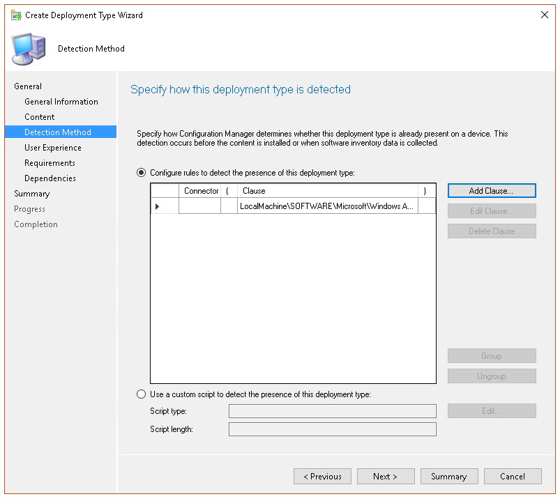

# <a name="troubleshoot-microsoft-defender-for-endpoint-onboarding-issues"></a><span data-ttu-id="65173-104">Behandeln von Problemen beim Onboarding von Microsoft Defender for Endpoint</span><span class="sxs-lookup"><span data-stu-id="65173-104">Troubleshoot Microsoft Defender for Endpoint onboarding issues</span></span>

[!INCLUDE [Microsoft 365 Defender rebranding](../../includes/microsoft-defender.md)]


<span data-ttu-id="65173-105">**Gilt für:**</span><span class="sxs-lookup"><span data-stu-id="65173-105">**Applies to:**</span></span>

- [<span data-ttu-id="65173-106">Microsoft Defender für Endpunkt</span><span class="sxs-lookup"><span data-stu-id="65173-106">Microsoft Defender for Endpoint</span></span>](https://go.microsoft.com/fwlink/?linkid=2154037)
- <span data-ttu-id="65173-107">Windows Server 2012 R2</span><span class="sxs-lookup"><span data-stu-id="65173-107">Windows Server 2012 R2</span></span>
- <span data-ttu-id="65173-108">Windows Server 2016</span><span class="sxs-lookup"><span data-stu-id="65173-108">Windows Server 2016</span></span>
- [<span data-ttu-id="65173-109">Microsoft 365 Defender</span><span class="sxs-lookup"><span data-stu-id="65173-109">Microsoft 365 Defender</span></span>](https://go.microsoft.com/fwlink/?linkid=2118804)

> <span data-ttu-id="65173-110">Möchten Sie Defender for Endpoint erleben?</span><span class="sxs-lookup"><span data-stu-id="65173-110">Want to experience Defender for Endpoint?</span></span> [<span data-ttu-id="65173-111">Registrieren Sie sich für eine kostenlose Testversion.</span><span class="sxs-lookup"><span data-stu-id="65173-111">Sign up for a free trial.</span></span>](https://www.microsoft.com/microsoft-365/windows/microsoft-defender-atp?ocid=docs-wdatp-pullalerts-abovefoldlink) 

<span data-ttu-id="65173-112">Möglicherweise müssen Sie beim Microsoft Defender for Endpoint-Onboarding-Prozess Probleme beheben, wenn Probleme auftreten.</span><span class="sxs-lookup"><span data-stu-id="65173-112">You might need to troubleshoot the Microsoft Defender for Endpoint onboarding process if you encounter issues.</span></span>
<span data-ttu-id="65173-113">Diese Seite enthält detaillierte Schritte zur Problembehandlung bei Onboardingproblemen, die bei der Bereitstellung mit einem der Bereitstellungstools auftreten können, sowie häufige Fehler, die auf den Geräten auftreten können.</span><span class="sxs-lookup"><span data-stu-id="65173-113">This page provides detailed steps to troubleshoot onboarding issues that might occur when deploying with one of the deployment tools and common errors that might occur on the devices.</span></span>

## <a name="troubleshoot-issues-with-onboarding-tools"></a><span data-ttu-id="65173-114">Behandeln von Problemen mit Onboardingtools</span><span class="sxs-lookup"><span data-stu-id="65173-114">Troubleshoot issues with onboarding tools</span></span>

<span data-ttu-id="65173-115">Wenn Sie den Onboardingprozess abgeschlossen haben und [](investigate-machines.md) geräte nach einer Stunde nicht mehr in der Liste Geräte angezeigt werden, kann dies auf ein Onboarding- oder Konnektivitätsproblem hinweisen.</span><span class="sxs-lookup"><span data-stu-id="65173-115">If you have completed the onboarding process and don't see devices in the [Devices list](investigate-machines.md) after an hour, it might indicate an onboarding or connectivity problem.</span></span>

### <a name="troubleshoot-onboarding-when-deploying-with-group-policy"></a><span data-ttu-id="65173-116">Problembehandlung beim Onboarding bei der Bereitstellung mit Gruppenrichtlinien</span><span class="sxs-lookup"><span data-stu-id="65173-116">Troubleshoot onboarding when deploying with Group Policy</span></span>

<span data-ttu-id="65173-117">Die Bereitstellung mit Gruppenrichtlinien erfolgt durch Ausführen des Onboardingskripts auf den Geräten.</span><span class="sxs-lookup"><span data-stu-id="65173-117">Deployment with Group Policy is done by running the onboarding script on the devices.</span></span> <span data-ttu-id="65173-118">Die Gruppenrichtlinienkonsole gibt nicht an, ob die Bereitstellung erfolgreich war oder nicht.</span><span class="sxs-lookup"><span data-stu-id="65173-118">The Group Policy console does not indicate if the deployment has succeeded or not.</span></span>

<span data-ttu-id="65173-119">Wenn Sie den Onboardingprozess abgeschlossen haben und [](investigate-machines.md) geräte nach einer Stunde nicht mehr in der Liste Geräte angezeigt werden, können Sie die Ausgabe des Skripts auf den Geräten überprüfen.</span><span class="sxs-lookup"><span data-stu-id="65173-119">If you have completed the onboarding process and don't see devices in the [Devices list](investigate-machines.md) after an hour, you can check the output of the script on the devices.</span></span> <span data-ttu-id="65173-120">Weitere Informationen finden Sie unter [Problembehandlung beim Onboarding bei der Bereitstellung mit einem Skript.](#troubleshoot-onboarding-when-deploying-with-a-script)</span><span class="sxs-lookup"><span data-stu-id="65173-120">For more information, see [Troubleshoot onboarding when deploying with a script](#troubleshoot-onboarding-when-deploying-with-a-script).</span></span>

<span data-ttu-id="65173-121">Wenn das Skript erfolgreich abgeschlossen wurde, finden Sie unter Problembehandlung von [Onboardingproblemen](#troubleshoot-onboarding-issues-on-the-device) auf den Geräten weitere Fehler, die auftreten können.</span><span class="sxs-lookup"><span data-stu-id="65173-121">If the script completes successfully, see [Troubleshoot onboarding issues on the devices](#troubleshoot-onboarding-issues-on-the-device) for additional errors that might occur.</span></span>

### <a name="troubleshoot-onboarding-issues-when-deploying-with-microsoft-endpoint-configuration-manager"></a><span data-ttu-id="65173-122">Behandeln von Problemen beim Onboarding bei der Bereitstellung mit Microsoft Endpoint Configuration Manager</span><span class="sxs-lookup"><span data-stu-id="65173-122">Troubleshoot onboarding issues when deploying with Microsoft Endpoint Configuration Manager</span></span>

<span data-ttu-id="65173-123">Beim Onboarding von Geräten mit den folgenden Versionen von Configuration Manager:</span><span class="sxs-lookup"><span data-stu-id="65173-123">When onboarding devices using the following versions of Configuration Manager:</span></span>

- <span data-ttu-id="65173-124">Microsoft Endpoint Configuration Manager</span><span class="sxs-lookup"><span data-stu-id="65173-124">Microsoft Endpoint Configuration Manager</span></span>
- <span data-ttu-id="65173-125">System Center 2012 Configuration Manager</span><span class="sxs-lookup"><span data-stu-id="65173-125">System Center 2012 Configuration Manager</span></span>
- <span data-ttu-id="65173-126">System Center 2012 R2 Configuration Manager</span><span class="sxs-lookup"><span data-stu-id="65173-126">System Center 2012 R2 Configuration Manager</span></span>

<span data-ttu-id="65173-127">Die Bereitstellung mit den oben genannten Versionen von Configuration Manager erfolgt durch Ausführen des Onboardingskripts auf den Geräten.</span><span class="sxs-lookup"><span data-stu-id="65173-127">Deployment with the above-mentioned versions of Configuration Manager is done by running the onboarding script on the devices.</span></span> <span data-ttu-id="65173-128">Sie können die Bereitstellung in der Configuration Manager-Konsole nachverfolgen.</span><span class="sxs-lookup"><span data-stu-id="65173-128">You can track the deployment in the Configuration Manager Console.</span></span>

<span data-ttu-id="65173-129">Wenn die Bereitstellung fehlschlägt, können Sie die Ausgabe des Skripts auf den Geräten überprüfen.</span><span class="sxs-lookup"><span data-stu-id="65173-129">If the deployment fails, you can check the output of the script on the devices.</span></span>

<span data-ttu-id="65173-130">Wenn das Onboarding erfolgreich abgeschlossen wurde, die  Geräte jedoch nach einer Stunde nicht in der Liste Geräte angezeigt werden, finden Sie unter Problembehandlung bei [Onboardingproblemen](#troubleshoot-onboarding-issues-on-the-device) auf dem Gerät weitere Fehler, die auftreten können.</span><span class="sxs-lookup"><span data-stu-id="65173-130">If the onboarding completed successfully but the devices are not showing up in the **Devices list** after an hour, see [Troubleshoot onboarding issues on the device](#troubleshoot-onboarding-issues-on-the-device) for additional errors that might occur.</span></span>

### <a name="troubleshoot-onboarding-when-deploying-with-a-script"></a><span data-ttu-id="65173-131">Problembehandlung beim Onboarding bei der Bereitstellung mit einem Skript</span><span class="sxs-lookup"><span data-stu-id="65173-131">Troubleshoot onboarding when deploying with a script</span></span>

<span data-ttu-id="65173-132">**Überprüfen Sie das Ergebnis des Skripts auf dem Gerät:**</span><span class="sxs-lookup"><span data-stu-id="65173-132">**Check the result of the script on the device:**</span></span>

1. <span data-ttu-id="65173-133">Klicken **Sie auf Start,** geben **Sie Ereignisanzeige ein,** und drücken Sie die **EINGABETASTE.**</span><span class="sxs-lookup"><span data-stu-id="65173-133">Click **Start**, type **Event Viewer**, and press **Enter**.</span></span>

2. <span data-ttu-id="65173-134">Wechseln Sie **zu Windows Logs**  >  **Application**.</span><span class="sxs-lookup"><span data-stu-id="65173-134">Go to **Windows Logs** > **Application**.</span></span>

3. <span data-ttu-id="65173-135">Suchen Sie nach einem Ereignis aus **der WDATPOnboarding-Ereignisquelle.**</span><span class="sxs-lookup"><span data-stu-id="65173-135">Look for an event from **WDATPOnboarding** event source.</span></span>

<span data-ttu-id="65173-136">Wenn das Skript fehlschlägt und das Ereignis ein Fehler ist, können Sie die Ereignis-ID in der folgenden Tabelle überprüfen, um Ihnen bei der Problembehandlung zu helfen.</span><span class="sxs-lookup"><span data-stu-id="65173-136">If the script fails and the event is an error, you can check the event ID in the following table to help you troubleshoot the issue.</span></span>

> [!NOTE]
> <span data-ttu-id="65173-137">Die folgenden Ereignis-IDs sind nur für das Onboardingskript spezifisch.</span><span class="sxs-lookup"><span data-stu-id="65173-137">The following event IDs are specific to the onboarding script only.</span></span>

<span data-ttu-id="65173-138">Ereignis-ID</span><span class="sxs-lookup"><span data-stu-id="65173-138">Event ID</span></span> | <span data-ttu-id="65173-139">Fehlertyp</span><span class="sxs-lookup"><span data-stu-id="65173-139">Error Type</span></span> | <span data-ttu-id="65173-140">Lösungsschritte</span><span class="sxs-lookup"><span data-stu-id="65173-140">Resolution steps</span></span>
:---:|:---|:---
 `5` | <span data-ttu-id="65173-141">Offboardingdaten wurden gefunden, konnten jedoch nicht gelöscht werden.</span><span class="sxs-lookup"><span data-stu-id="65173-141">Offboarding data was found but couldn't be deleted</span></span> | <span data-ttu-id="65173-142">Überprüfen der Berechtigungen für die Registrierung, insbesondere</span><span class="sxs-lookup"><span data-stu-id="65173-142">Check the permissions on the registry, specifically</span></span><br> <span data-ttu-id="65173-143">`HKLM\SOFTWARE\Policies\Microsoft\Windows Advanced Threat Protection`.</span><span class="sxs-lookup"><span data-stu-id="65173-143">`HKLM\SOFTWARE\Policies\Microsoft\Windows Advanced Threat Protection`.</span></span>
`10` | <span data-ttu-id="65173-144">Onboardingdaten konnten nicht in die Registrierung geschrieben werden</span><span class="sxs-lookup"><span data-stu-id="65173-144">Onboarding data couldn't be written to registry</span></span> |  <span data-ttu-id="65173-145">Überprüfen der Berechtigungen für die Registrierung, insbesondere</span><span class="sxs-lookup"><span data-stu-id="65173-145">Check the permissions on the registry, specifically</span></span><br> <span data-ttu-id="65173-146">`HKLM\SOFTWARE\Policies\Microsoft\Windows Advanced Threat Protection`.</span><span class="sxs-lookup"><span data-stu-id="65173-146">`HKLM\SOFTWARE\Policies\Microsoft\Windows Advanced Threat Protection`.</span></span><br><span data-ttu-id="65173-147">Stellen Sie sicher, dass das Skript als Administrator ausgeführt wurde.</span><span class="sxs-lookup"><span data-stu-id="65173-147">Verify that the script has been run as an administrator.</span></span>
`15` |  <span data-ttu-id="65173-148">Fehler beim Starten des SENSE-Diensts</span><span class="sxs-lookup"><span data-stu-id="65173-148">Failed to start SENSE service</span></span> |<span data-ttu-id="65173-149">Überprüfen Sie den Dienstzustand ( `sc query sense` -Befehl).</span><span class="sxs-lookup"><span data-stu-id="65173-149">Check the service health (`sc query sense` command).</span></span> <span data-ttu-id="65173-150">Stellen Sie sicher, dass es sich nicht in einem Zwischenzustand (*"Pending_Stopped"*, *"Pending_Running")* und versuchen Sie, das Skript erneut auszuführen (mit Administratorrechten).</span><span class="sxs-lookup"><span data-stu-id="65173-150">Make sure it's not in an intermediate state (*'Pending_Stopped'*, *'Pending_Running'*) and try to run the script again (with administrator rights).</span></span> <br> <br> <span data-ttu-id="65173-151">Wenn auf dem Gerät Windows 10, Version 1607, ausgeführt wird und der Befehl zurückgegeben wird, starten Sie `sc query sense` `START_PENDING` das Gerät neu.</span><span class="sxs-lookup"><span data-stu-id="65173-151">If the device is running Windows 10, version 1607 and running the command `sc query sense` returns `START_PENDING`, reboot the device.</span></span> <span data-ttu-id="65173-152">Wenn das Problem durch einen Neustart des Geräts nicht behoben wird, aktualisieren Sie auf KB4015217, und versuchen Sie es erneut.</span><span class="sxs-lookup"><span data-stu-id="65173-152">If rebooting the device doesn't address the issue, upgrade to KB4015217 and try onboarding again.</span></span>
`15` | <span data-ttu-id="65173-153">Fehler beim Starten des SENSE-Diensts</span><span class="sxs-lookup"><span data-stu-id="65173-153">Failed to start SENSE service</span></span> | <span data-ttu-id="65173-154">Wenn die Fehlermeldung lautet: Systemfehler 577 oder Fehler 1058 ist aufgetreten, müssen Sie den Microsoft Defender Antivirus ELAM-Treiber aktivieren. Anweisungen dazu finden Sie unter [Sicherstellen,](#ensure-that-microsoft-defender-antivirus-is-not-disabled-by-a-policy) dass Microsoft Defender Antivirus nicht durch eine Richtlinie deaktiviert wird.</span><span class="sxs-lookup"><span data-stu-id="65173-154">If the message of the error is: System error 577  or error 1058 has occurred, you need to enable the Microsoft Defender Antivirus ELAM driver, see [Ensure that Microsoft Defender Antivirus is not disabled by a policy](#ensure-that-microsoft-defender-antivirus-is-not-disabled-by-a-policy) for instructions.</span></span>
`30` |  <span data-ttu-id="65173-155">Das Skript konnte nicht warten, bis der Dienst ausgeführt wurde</span><span class="sxs-lookup"><span data-stu-id="65173-155">The script failed to wait for the service to start running</span></span> | <span data-ttu-id="65173-156">Der Dienst hätte beim Starten mehr Zeit zum Starten oder Fehler festgestellt.</span><span class="sxs-lookup"><span data-stu-id="65173-156">The service could have taken more time to start or has encountered errors while trying to start.</span></span> <span data-ttu-id="65173-157">Weitere Informationen zu Ereignissen und Fehlern im Zusammenhang mit SENSE finden Sie unter [Überprüfen von Ereignissen und Fehlern mithilfe der Ereignisanzeige](event-error-codes.md).</span><span class="sxs-lookup"><span data-stu-id="65173-157">For more information on events and errors related to SENSE, see [Review events and errors using Event viewer](event-error-codes.md).</span></span>
`35` |  <span data-ttu-id="65173-158">Das Skript konnte den erforderlichen Registrierungswert für den Onboardingstatus nicht finden.</span><span class="sxs-lookup"><span data-stu-id="65173-158">The script failed to find needed onboarding status registry value</span></span> | <span data-ttu-id="65173-159">Wenn der SENSE-Dienst zum ersten Mal gestartet wird, schreibt er den Onboardingstatus an den Registrierungsspeicherort.</span><span class="sxs-lookup"><span data-stu-id="65173-159">When the SENSE service starts for the first time, it writes onboarding status to the registry location</span></span><br><span data-ttu-id="65173-160">`HKLM\SOFTWARE\Microsoft\Windows Advanced Threat Protection\Status`.</span><span class="sxs-lookup"><span data-stu-id="65173-160">`HKLM\SOFTWARE\Microsoft\Windows Advanced Threat Protection\Status`.</span></span><br> <span data-ttu-id="65173-161">Das Skript konnte es nach einigen Sekunden nicht finden.</span><span class="sxs-lookup"><span data-stu-id="65173-161">The script failed to find it after several seconds.</span></span> <span data-ttu-id="65173-162">Sie können ihn manuell testen und überprüfen, ob er dort ist.</span><span class="sxs-lookup"><span data-stu-id="65173-162">You can manually test it and check if it's there.</span></span> <span data-ttu-id="65173-163">Weitere Informationen zu Ereignissen und Fehlern im Zusammenhang mit SENSE finden Sie unter [Überprüfen von Ereignissen und Fehlern mithilfe der Ereignisanzeige](event-error-codes.md).</span><span class="sxs-lookup"><span data-stu-id="65173-163">For more information on events and errors related to SENSE, see [Review events and errors using Event viewer](event-error-codes.md).</span></span>
`40` | <span data-ttu-id="65173-164">Status des SENSE-Dienst-Onboardings ist nicht auf **1 festgelegt**</span><span class="sxs-lookup"><span data-stu-id="65173-164">SENSE service onboarding status is not set to **1**</span></span> | <span data-ttu-id="65173-165">Fehler beim ordnungsgemäßen Onboarding des SENSE-Diensts.</span><span class="sxs-lookup"><span data-stu-id="65173-165">The SENSE service has failed to onboard properly.</span></span> <span data-ttu-id="65173-166">Weitere Informationen zu Ereignissen und Fehlern im Zusammenhang mit SENSE finden Sie unter [Überprüfen von Ereignissen und Fehlern mithilfe der Ereignisanzeige](event-error-codes.md).</span><span class="sxs-lookup"><span data-stu-id="65173-166">For more information on events and errors related to SENSE, see [Review events and errors using Event viewer](event-error-codes.md).</span></span>
`65` | <span data-ttu-id="65173-167">Unzureichende Rechte</span><span class="sxs-lookup"><span data-stu-id="65173-167">Insufficient privileges</span></span>| <span data-ttu-id="65173-168">Führen Sie das Skript erneut mit Administratorrechten aus.</span><span class="sxs-lookup"><span data-stu-id="65173-168">Run the script again with administrator privileges.</span></span>

### <a name="troubleshoot-onboarding-issues-using-microsoft-intune"></a><span data-ttu-id="65173-169">Behandeln von Problemen beim Onboarding mithilfe von Microsoft Intune</span><span class="sxs-lookup"><span data-stu-id="65173-169">Troubleshoot onboarding issues using Microsoft Intune</span></span>

<span data-ttu-id="65173-170">Sie können Microsoft Intune verwenden, um Fehlercodes zu überprüfen und zu versuchen, die Ursache des Problems zu beheben.</span><span class="sxs-lookup"><span data-stu-id="65173-170">You can use Microsoft Intune to check error codes and attempt to troubleshoot the cause of the issue.</span></span>

<span data-ttu-id="65173-171">Wenn Sie Richtlinien in Intune konfiguriert haben und sie nicht auf Geräten verbreitet werden, müssen Sie möglicherweise die automatische MDM-Registrierung konfigurieren.</span><span class="sxs-lookup"><span data-stu-id="65173-171">If you have configured policies in Intune and they are not propagated on devices, you might need to configure automatic MDM enrollment.</span></span>

<span data-ttu-id="65173-172">Verwenden Sie die folgenden Tabellen, um die möglichen Ursachen von Problemen beim Onboarding zu verstehen:</span><span class="sxs-lookup"><span data-stu-id="65173-172">Use the following tables to understand the possible causes of issues while onboarding:</span></span>

- <span data-ttu-id="65173-173">Microsoft Intune-Fehlercodes und OMA-URIs Tabelle</span><span class="sxs-lookup"><span data-stu-id="65173-173">Microsoft Intune error codes and OMA-URIs table</span></span>
- <span data-ttu-id="65173-174">Bekannte Probleme mit der Tabelle "Nichtkonformität"</span><span class="sxs-lookup"><span data-stu-id="65173-174">Known issues with non-compliance table</span></span>
- <span data-ttu-id="65173-175">MdM-Ereignisprotokolltabelle (Mobile Device Management)</span><span class="sxs-lookup"><span data-stu-id="65173-175">Mobile Device Management (MDM) event logs table</span></span>

<span data-ttu-id="65173-176">Wenn keines der Ereignisprotokolle und Problembehandlungsschritte funktioniert, laden Sie das Lokale Skript aus dem Abschnitt Geräteverwaltung des Portals herunter, und führen Sie es in einer Eingabeaufforderung mit erhöhten Rechten aus. </span><span class="sxs-lookup"><span data-stu-id="65173-176">If none of the event logs and troubleshooting steps work, download the Local script from the **Device management** section of the portal, and run it in an elevated command prompt.</span></span>

#### <a name="microsoft-intune-error-codes-and-oma-uris"></a><span data-ttu-id="65173-177">Microsoft Intune-Fehlercodes und -OMA-URIs</span><span class="sxs-lookup"><span data-stu-id="65173-177">Microsoft Intune error codes and OMA-URIs</span></span>

<span data-ttu-id="65173-178">Fehlercode-Hex</span><span class="sxs-lookup"><span data-stu-id="65173-178">Error Code Hex</span></span> | <span data-ttu-id="65173-179">Fehlercode Dec</span><span class="sxs-lookup"><span data-stu-id="65173-179">Error Code Dec</span></span> | <span data-ttu-id="65173-180">Fehlerbeschreibung</span><span class="sxs-lookup"><span data-stu-id="65173-180">Error Description</span></span> | <span data-ttu-id="65173-181">OMA-URI</span><span class="sxs-lookup"><span data-stu-id="65173-181">OMA-URI</span></span> | <span data-ttu-id="65173-182">Mögliche Ursachen- und Problembehandlungsschritte</span><span class="sxs-lookup"><span data-stu-id="65173-182">Possible cause and troubleshooting steps</span></span>
:---:|:---|:---|:---|:---
<span data-ttu-id="65173-183">0x87D1FDE8</span><span class="sxs-lookup"><span data-stu-id="65173-183">0x87D1FDE8</span></span> | <span data-ttu-id="65173-184">-2016281112</span><span class="sxs-lookup"><span data-stu-id="65173-184">-2016281112</span></span> | <span data-ttu-id="65173-185">Behebung fehlgeschlagen</span><span class="sxs-lookup"><span data-stu-id="65173-185">Remediation failed</span></span> | <span data-ttu-id="65173-186">Onboarding</span><span class="sxs-lookup"><span data-stu-id="65173-186">Onboarding</span></span> <br> <span data-ttu-id="65173-187">Offboarding</span><span class="sxs-lookup"><span data-stu-id="65173-187">Offboarding</span></span> | <span data-ttu-id="65173-188">**Mögliche Ursache:** Beim Onboarding oder Offboarding ist ein Fehler bei einem falschen Blob fehlgeschlagen: falsche Signatur oder fehlende PreviousOrgIds-Felder.</span><span class="sxs-lookup"><span data-stu-id="65173-188">**Possible cause:** Onboarding or offboarding failed on a wrong blob: wrong signature or missing PreviousOrgIds fields.</span></span> <br><br> <span data-ttu-id="65173-189">**Schritte zur Problembehandlung:**</span><span class="sxs-lookup"><span data-stu-id="65173-189">**Troubleshooting steps:**</span></span> <br> <span data-ttu-id="65173-190">Überprüfen Sie die Ereignis-IDs im Abschnitt Anzeigen von [Agent-Onboardingfehlern im Abschnitt Geräteereignisprotokoll.](#view-agent-onboarding-errors-in-the-device-event-log)</span><span class="sxs-lookup"><span data-stu-id="65173-190">Check the event IDs in the [View agent onboarding errors in the device event log](#view-agent-onboarding-errors-in-the-device-event-log) section.</span></span> <br><br> <span data-ttu-id="65173-191">Überprüfen Sie die MDM-Ereignisprotokolle in der folgenden Tabelle, oder befolgen Sie die Anweisungen unter Diagnose von [MDM-Fehlern in Windows 10](https://docs.microsoft.com/windows/client-management/mdm/diagnose-mdm-failures-in-windows-10).</span><span class="sxs-lookup"><span data-stu-id="65173-191">Check the MDM event logs in the following table or follow the instructions in [Diagnose MDM failures in Windows 10](https://docs.microsoft.com/windows/client-management/mdm/diagnose-mdm-failures-in-windows-10).</span></span>
 | | | | <span data-ttu-id="65173-192">Onboarding</span><span class="sxs-lookup"><span data-stu-id="65173-192">Onboarding</span></span> <br> <span data-ttu-id="65173-193">Offboarding</span><span class="sxs-lookup"><span data-stu-id="65173-193">Offboarding</span></span> <br> <span data-ttu-id="65173-194">SampleSharing</span><span class="sxs-lookup"><span data-stu-id="65173-194">SampleSharing</span></span> | <span data-ttu-id="65173-195">**Mögliche Ursache:** Microsoft Defender für Endpunktrichtlinien-Registrierungsschlüssel ist nicht vorhanden, oder der OMA -DM-Client verfügt nicht über Berechtigungen zum Schreiben.</span><span class="sxs-lookup"><span data-stu-id="65173-195">**Possible cause:** Microsoft Defender for Endpoint Policy registry key does not exist or the OMA DM client doesn't have permissions to write to it.</span></span> <br><br> <span data-ttu-id="65173-196">**Schritte zur Problembehandlung:** Stellen Sie sicher, dass der folgende Registrierungsschlüssel vorhanden ist: `HKEY_LOCAL_MACHINE\SOFTWARE\Policies\Microsoft\Windows Advanced Threat Protection`</span><span class="sxs-lookup"><span data-stu-id="65173-196">**Troubleshooting steps:** Ensure that the following registry key exists: `HKEY_LOCAL_MACHINE\SOFTWARE\Policies\Microsoft\Windows Advanced Threat Protection`</span></span> <br> <br> <span data-ttu-id="65173-197">Wenn er nicht vorhanden ist, öffnen Sie einen Befehl mit erhöhten Rechten, und fügen Sie den Schlüssel hinzu.</span><span class="sxs-lookup"><span data-stu-id="65173-197">If it doesn't exist, open an elevated command and add the key.</span></span>
 | | | | <span data-ttu-id="65173-198">SenseIsRunning</span><span class="sxs-lookup"><span data-stu-id="65173-198">SenseIsRunning</span></span> <br> <span data-ttu-id="65173-199">OnboardingState</span><span class="sxs-lookup"><span data-stu-id="65173-199">OnboardingState</span></span> <br> <span data-ttu-id="65173-200">OrgId</span><span class="sxs-lookup"><span data-stu-id="65173-200">OrgId</span></span> |  <span data-ttu-id="65173-201">**Mögliche Ursache:** Ein Versuch, die Behebung durch schreibgeschützte Eigenschaft zu versuchen.</span><span class="sxs-lookup"><span data-stu-id="65173-201">**Possible cause:** An attempt to remediate by read-only property.</span></span> <span data-ttu-id="65173-202">Das Onboarding ist fehlgeschlagen.</span><span class="sxs-lookup"><span data-stu-id="65173-202">Onboarding has failed.</span></span> <br><br> <span data-ttu-id="65173-203">**Schritte zur Problembehandlung:** Überprüfen Sie die Schritte zur Problembehandlung unter Problembehandlung bei [Onboardingproblemen auf dem Gerät.](#troubleshoot-onboarding-issues-on-the-device)</span><span class="sxs-lookup"><span data-stu-id="65173-203">**Troubleshooting steps:** Check the troubleshooting steps in [Troubleshoot onboarding issues on the device](#troubleshoot-onboarding-issues-on-the-device).</span></span> <br><br> <span data-ttu-id="65173-204">Überprüfen Sie die MDM-Ereignisprotokolle in der folgenden Tabelle, oder befolgen Sie die Anweisungen unter Diagnose von [MDM-Fehlern in Windows 10](https://docs.microsoft.com/windows/client-management/mdm/diagnose-mdm-failures-in-windows-10).</span><span class="sxs-lookup"><span data-stu-id="65173-204">Check the MDM event logs in the following table or follow the instructions in [Diagnose MDM failures in Windows 10](https://docs.microsoft.com/windows/client-management/mdm/diagnose-mdm-failures-in-windows-10).</span></span>
 | | | | <span data-ttu-id="65173-205">Alle</span><span class="sxs-lookup"><span data-stu-id="65173-205">All</span></span> | <span data-ttu-id="65173-206">**Mögliche Ursache:** Versuchen Sie, Microsoft Defender for Endpoint auf nicht unterstützter SKU/Platform, insbesondere der Holographic SKU, zu implementieren.</span><span class="sxs-lookup"><span data-stu-id="65173-206">**Possible cause:** Attempt to deploy Microsoft Defender for Endpoint on non-supported SKU/Platform, particularly Holographic SKU.</span></span> <br><br> <span data-ttu-id="65173-207">Derzeit unterstützte Plattformen:</span><span class="sxs-lookup"><span data-stu-id="65173-207">Currently supported platforms:</span></span><br> <span data-ttu-id="65173-208">Enterprise, Education und Professional.</span><span class="sxs-lookup"><span data-stu-id="65173-208">Enterprise, Education, and Professional.</span></span><br> <span data-ttu-id="65173-209">Server wird nicht unterstützt.</span><span class="sxs-lookup"><span data-stu-id="65173-209">Server is not supported.</span></span>
 <span data-ttu-id="65173-210">0x87D101A9</span><span class="sxs-lookup"><span data-stu-id="65173-210">0x87D101A9</span></span> | <span data-ttu-id="65173-211">-2016345687</span><span class="sxs-lookup"><span data-stu-id="65173-211">-2016345687</span></span> |<span data-ttu-id="65173-212">SyncML(425): Fehler beim angeforderten Befehl, da der Absender nicht über ausreichende Zugriffssteuerungsberechtigungen (Access Control Permissions, ACL) für den Empfänger verfügt.</span><span class="sxs-lookup"><span data-stu-id="65173-212">SyncML(425): The requested command failed because the sender does not have adequate access control permissions (ACL) on the recipient.</span></span> | <span data-ttu-id="65173-213">Alle</span><span class="sxs-lookup"><span data-stu-id="65173-213">All</span></span> |  <span data-ttu-id="65173-214">**Mögliche Ursache:** Versuchen Sie, Microsoft Defender for Endpoint auf nicht unterstützter SKU/Platform, insbesondere der Holographic SKU, zu implementieren.</span><span class="sxs-lookup"><span data-stu-id="65173-214">**Possible cause:** Attempt to deploy Microsoft Defender for Endpoint on non-supported SKU/Platform, particularly Holographic SKU.</span></span><br><br> <span data-ttu-id="65173-215">Derzeit unterstützte Plattformen:</span><span class="sxs-lookup"><span data-stu-id="65173-215">Currently supported platforms:</span></span><br>  <span data-ttu-id="65173-216">Enterprise, Education und Professional.</span><span class="sxs-lookup"><span data-stu-id="65173-216">Enterprise, Education, and Professional.</span></span>

#### <a name="known-issues-with-non-compliance"></a><span data-ttu-id="65173-217">Bekannte Probleme mit der Nichtkonformität</span><span class="sxs-lookup"><span data-stu-id="65173-217">Known issues with non-compliance</span></span>

<span data-ttu-id="65173-218">Die folgende Tabelle enthält Informationen zu Problemen mit Nichtkonformität und wie Sie die Probleme beheben können.</span><span class="sxs-lookup"><span data-stu-id="65173-218">The following table provides information on issues with non-compliance and how you can address the issues.</span></span>

<span data-ttu-id="65173-219">Fall</span><span class="sxs-lookup"><span data-stu-id="65173-219">Case</span></span> | <span data-ttu-id="65173-220">Problembeschreibung</span><span class="sxs-lookup"><span data-stu-id="65173-220">Symptoms</span></span> | <span data-ttu-id="65173-221">Mögliche Ursachen- und Problembehandlungsschritte</span><span class="sxs-lookup"><span data-stu-id="65173-221">Possible cause and troubleshooting steps</span></span>
:---:|:---|:---
 `1` | <span data-ttu-id="65173-222">Das Gerät ist kompatibel mit SenseIsRunning OMA-URI.</span><span class="sxs-lookup"><span data-stu-id="65173-222">Device is compliant by SenseIsRunning OMA-URI.</span></span> <span data-ttu-id="65173-223">Ist jedoch nicht kompatibel mit OrgId-, Onboarding- und OnboardingState-OMA-URIs.</span><span class="sxs-lookup"><span data-stu-id="65173-223">But is non-compliant by OrgId, Onboarding and OnboardingState OMA-URIs.</span></span> | <span data-ttu-id="65173-224">**Mögliche Ursache:** Überprüfen Sie, ob der Benutzer OOBE nach der Installation oder dem Upgrade von Windows übergeben hat.</span><span class="sxs-lookup"><span data-stu-id="65173-224">**Possible cause:** Check that user passed OOBE after Windows installation or upgrade.</span></span> <span data-ttu-id="65173-225">Während des OOBE-Onboardings konnte das Onboarding nicht abgeschlossen werden, aber SENSE wird bereits ausgeführt.</span><span class="sxs-lookup"><span data-stu-id="65173-225">During OOBE onboarding couldn't be completed but SENSE is running already.</span></span><br><br> <span data-ttu-id="65173-226">**Schritte zur Problembehandlung:** Warten Sie, bis OOBE abgeschlossen ist.</span><span class="sxs-lookup"><span data-stu-id="65173-226">**Troubleshooting steps:** Wait for OOBE to complete.</span></span>
 `2` |  <span data-ttu-id="65173-227">Das Gerät ist kompatibel mit OrgId-, Onboarding- und OnboardingState-OMA-URIs, aber nicht kompatibel mit SenseIsRunning OMA-URI.</span><span class="sxs-lookup"><span data-stu-id="65173-227">Device is compliant by OrgId, Onboarding, and OnboardingState OMA-URIs, but is non-compliant by SenseIsRunning OMA-URI.</span></span> |  <span data-ttu-id="65173-228">**Mögliche Ursache:** Der Starttyp des Sense-Diensts wird als "Verzögerter Start" festgelegt.</span><span class="sxs-lookup"><span data-stu-id="65173-228">**Possible cause:** Sense service's startup type is set as "Delayed Start".</span></span> <span data-ttu-id="65173-229">Manchmal führt dies dazu, dass der Microsoft Intune-Server das Gerät von SenseIsRunning als nicht kompatibel gemeldet, wenn die DM-Sitzung beim Systemstart stattfindet.</span><span class="sxs-lookup"><span data-stu-id="65173-229">Sometimes this causes the Microsoft Intune server to report the device as non-compliant by SenseIsRunning when DM session occurs on system start.</span></span> <br><br> <span data-ttu-id="65173-230">**Schritte zur Problembehandlung:** Das Problem sollte automatisch innerhalb von 24 Stunden behoben werden.</span><span class="sxs-lookup"><span data-stu-id="65173-230">**Troubleshooting steps:** The issue should automatically be fixed within 24 hours.</span></span>
 `3` | <span data-ttu-id="65173-231">Gerät ist nicht kompatibel</span><span class="sxs-lookup"><span data-stu-id="65173-231">Device is non-compliant</span></span> | <span data-ttu-id="65173-232">**Schritte zur Problembehandlung:** Stellen Sie sicher, dass Onboarding- und Offboardingrichtlinien nicht gleichzeitig auf demselben Gerät bereitgestellt werden.</span><span class="sxs-lookup"><span data-stu-id="65173-232">**Troubleshooting steps:** Ensure that Onboarding and Offboarding policies are not deployed on the same device at same time.</span></span>

#### <a name="mobile-device-management-mdm-event-logs"></a><span data-ttu-id="65173-233">Ereignisprotokolle für die Mobile Device Management (MDM)</span><span class="sxs-lookup"><span data-stu-id="65173-233">Mobile Device Management (MDM) event logs</span></span>

<span data-ttu-id="65173-234">Zeigen Sie die MDM-Ereignisprotokolle an, um Probleme zu beheben, die beim Onboarding auftreten können:</span><span class="sxs-lookup"><span data-stu-id="65173-234">View the MDM event logs to troubleshoot issues that might arise during onboarding:</span></span>

<span data-ttu-id="65173-235">Protokollname: Microsoft\Windows\DeviceManagement-EnterpriseDiagnostics-Provider</span><span class="sxs-lookup"><span data-stu-id="65173-235">Log name: Microsoft\Windows\DeviceManagement-EnterpriseDiagnostics-Provider</span></span>

<span data-ttu-id="65173-236">Kanalname: Administrator</span><span class="sxs-lookup"><span data-stu-id="65173-236">Channel name: Admin</span></span>

<span data-ttu-id="65173-237">ID</span><span class="sxs-lookup"><span data-stu-id="65173-237">ID</span></span> | <span data-ttu-id="65173-238">Severity</span><span class="sxs-lookup"><span data-stu-id="65173-238">Severity</span></span> | <span data-ttu-id="65173-239">Ereignisbeschreibung</span><span class="sxs-lookup"><span data-stu-id="65173-239">Event description</span></span> | <span data-ttu-id="65173-240">Schritte zur Problembehandlung</span><span class="sxs-lookup"><span data-stu-id="65173-240">Troubleshooting steps</span></span>
:---|:---|:---|:---
<span data-ttu-id="65173-241">1819</span><span class="sxs-lookup"><span data-stu-id="65173-241">1819</span></span> | <span data-ttu-id="65173-242">Fehler</span><span class="sxs-lookup"><span data-stu-id="65173-242">Error</span></span> | <span data-ttu-id="65173-243">Microsoft Defender for Endpoint CSP: Fehler beim Festlegen des Knotenwerts.</span><span class="sxs-lookup"><span data-stu-id="65173-243">Microsoft Defender for Endpoint CSP: Failed to Set Node's Value.</span></span> <span data-ttu-id="65173-244">NodeId: (%1), TokenName: (%2), Ergebnis: (%3).</span><span class="sxs-lookup"><span data-stu-id="65173-244">NodeId: (%1), TokenName: (%2), Result: (%3).</span></span> | <span data-ttu-id="65173-245">Laden Sie [das kumulative Update für Windows 10, 1607 herunter.](https://go.microsoft.com/fwlink/?linkid=829760)</span><span class="sxs-lookup"><span data-stu-id="65173-245">Download the [Cumulative Update for Windows 10, 1607](https://go.microsoft.com/fwlink/?linkid=829760).</span></span>

## <a name="troubleshoot-onboarding-issues-on-the-device"></a><span data-ttu-id="65173-246">Behandeln von Problemen beim Onboarding auf dem Gerät</span><span class="sxs-lookup"><span data-stu-id="65173-246">Troubleshoot onboarding issues on the device</span></span>

<span data-ttu-id="65173-247">Wenn die verwendeten Bereitstellungstools keinen Fehler im Onboardingprozess angeben, Geräte jedoch weiterhin nicht in einer Stunde in der Geräteliste angezeigt werden, lesen Sie die folgenden Überprüfungsthemen, um zu überprüfen, ob beim Microsoft Defender for Endpoint-Agent ein Fehler aufgetreten ist.</span><span class="sxs-lookup"><span data-stu-id="65173-247">If the deployment tools used does not indicate an error in the onboarding process, but devices are still not appearing in the devices list in an hour, go through the following verification topics to check if an error occurred with the Microsoft Defender for Endpoint agent.</span></span>

- [<span data-ttu-id="65173-248">Anzeigen von Fehlern beim Onboarding des Agents im Geräteereignisprotokoll</span><span class="sxs-lookup"><span data-stu-id="65173-248">View agent onboarding errors in the device event log</span></span>](#view-agent-onboarding-errors-in-the-device-event-log)
- [<span data-ttu-id="65173-249">Sicherstellen, dass der Diagnosedatendienst aktiviert ist</span><span class="sxs-lookup"><span data-stu-id="65173-249">Ensure the diagnostic data service is enabled</span></span>](#ensure-the-diagnostics-service-is-enabled)
- [<span data-ttu-id="65173-250">Sicherstellen, dass der Dienst auf den Start festgelegt ist</span><span class="sxs-lookup"><span data-stu-id="65173-250">Ensure the service is set to start</span></span>](#ensure-the-service-is-set-to-start)
- [<span data-ttu-id="65173-251">Sicherstellen, dass das Gerät über eine Internetverbindung verfügt</span><span class="sxs-lookup"><span data-stu-id="65173-251">Ensure the device has an Internet connection</span></span>](#ensure-the-device-has-an-internet-connection)
- [<span data-ttu-id="65173-252">Stellen Sie sicher, dass Microsoft Defender Antivirus nicht durch eine Richtlinie deaktiviert ist</span><span class="sxs-lookup"><span data-stu-id="65173-252">Ensure that Microsoft Defender Antivirus is not disabled by a policy</span></span>](#ensure-that-microsoft-defender-antivirus-is-not-disabled-by-a-policy)

### <a name="view-agent-onboarding-errors-in-the-device-event-log"></a><span data-ttu-id="65173-253">Anzeigen von Fehlern beim Onboarding des Agents im Geräteereignisprotokoll</span><span class="sxs-lookup"><span data-stu-id="65173-253">View agent onboarding errors in the device event log</span></span>

1. <span data-ttu-id="65173-254">Klicken **Sie auf Start,** geben **Sie Ereignisanzeige ein,** und drücken Sie die **EINGABETASTE.**</span><span class="sxs-lookup"><span data-stu-id="65173-254">Click **Start**, type **Event Viewer**, and press **Enter**.</span></span>

2. <span data-ttu-id="65173-255">Erweitern Sie **im Bereich Ereignisanzeige (Lokal)** **Anwendungen und Dienstprotokolle**  >  **Microsoft**  >  **Windows**  >  **SENSE**.</span><span class="sxs-lookup"><span data-stu-id="65173-255">In the **Event Viewer (Local)** pane, expand **Applications and Services Logs** > **Microsoft** > **Windows** > **SENSE**.</span></span>

   > [!NOTE]
   > <span data-ttu-id="65173-256">SENSE ist der interne Name, der verwendet wird, um auf den Verhaltenssensor zu verweisen, der Microsoft Defender for Endpoint unterstützt.</span><span class="sxs-lookup"><span data-stu-id="65173-256">SENSE is the internal name used to refer to the behavioral sensor that powers Microsoft Defender for Endpoint.</span></span>

3. <span data-ttu-id="65173-257">Wählen **Sie Betriebsbereit** aus, um das Protokoll zu laden.</span><span class="sxs-lookup"><span data-stu-id="65173-257">Select **Operational** to load the log.</span></span>

4. <span data-ttu-id="65173-258">Klicken Sie **im Aktionsbereich** auf **Aktuelles Protokoll filtern.**</span><span class="sxs-lookup"><span data-stu-id="65173-258">In the **Action** pane, click **Filter Current log**.</span></span>

5. <span data-ttu-id="65173-259">Wählen Sie **auf der** Registerkarte Filter unter **Ereignisebene die** Option **Kritisch,** **Warnung** und **Fehler** aus, und klicken Sie auf **OK**.</span><span class="sxs-lookup"><span data-stu-id="65173-259">On the **Filter** tab, under **Event level:** select **Critical**, **Warning**, and **Error**, and click **OK**.</span></span>

   

6. <span data-ttu-id="65173-261">Ereignisse, die auf Probleme hinweisen können, werden im **Bereich Betrieb** angezeigt.</span><span class="sxs-lookup"><span data-stu-id="65173-261">Events which can indicate issues will appear in the **Operational** pane.</span></span> <span data-ttu-id="65173-262">Sie können versuchen, sie basierend auf den Lösungen in der folgenden Tabelle zu beheben:</span><span class="sxs-lookup"><span data-stu-id="65173-262">You can attempt to troubleshoot them based on the solutions in the following table:</span></span>

<span data-ttu-id="65173-263">Ereigniskennung</span><span class="sxs-lookup"><span data-stu-id="65173-263">Event ID</span></span> | <span data-ttu-id="65173-264">Message</span><span class="sxs-lookup"><span data-stu-id="65173-264">Message</span></span> | <span data-ttu-id="65173-265">Lösungsschritte</span><span class="sxs-lookup"><span data-stu-id="65173-265">Resolution steps</span></span>
:---:|:---|:---
 `5` | <span data-ttu-id="65173-266">Microsoft Defender for Endpoint-Dienst konnte keine Verbindung mit dem Server unter Variable _herstellen_</span><span class="sxs-lookup"><span data-stu-id="65173-266">Microsoft Defender for Endpoint service failed to connect to the server at _variable_</span></span> | <span data-ttu-id="65173-267">[Stellen Sie sicher, dass das Gerät über Internetzugriff verfügt.](#ensure-the-device-has-an-internet-connection)</span><span class="sxs-lookup"><span data-stu-id="65173-267">[Ensure the device has Internet access](#ensure-the-device-has-an-internet-connection).</span></span>
 `6` | <span data-ttu-id="65173-268">Der Microsoft Defender for Endpoint-Dienst ist nicht onboarded, und es wurden keine Onboardingparameter gefunden.</span><span class="sxs-lookup"><span data-stu-id="65173-268">Microsoft Defender for Endpoint service is not onboarded and no onboarding parameters were found.</span></span> <span data-ttu-id="65173-269">Fehlercode: _Variable_</span><span class="sxs-lookup"><span data-stu-id="65173-269">Failure code: _variable_</span></span> | <span data-ttu-id="65173-270">[Führen Sie das Onboardingskript erneut aus.](configure-endpoints-script.md)</span><span class="sxs-lookup"><span data-stu-id="65173-270">[Run the onboarding script again](configure-endpoints-script.md).</span></span>
 `7` | <span data-ttu-id="65173-271">Der Microsoft Defender for Endpoint-Dienst konnte die Onboardingparameter nicht lesen.</span><span class="sxs-lookup"><span data-stu-id="65173-271">Microsoft Defender for Endpoint service failed to read the onboarding parameters.</span></span> <span data-ttu-id="65173-272">Fehlercode: _Variable_</span><span class="sxs-lookup"><span data-stu-id="65173-272">Failure code: _variable_</span></span> | <span data-ttu-id="65173-273">[Stellen Sie sicher, dass das Gerät über Internetzugriff](#ensure-the-device-has-an-internet-connection)verfügt, und führen Sie dann den gesamten Onboardingvorgang erneut aus.</span><span class="sxs-lookup"><span data-stu-id="65173-273">[Ensure the device has Internet access](#ensure-the-device-has-an-internet-connection), then run the entire onboarding process again.</span></span>
 `9` | <span data-ttu-id="65173-274">Der Microsoft Defender for Endpoint-Dienst konnte seinen Starttyp nicht ändern.</span><span class="sxs-lookup"><span data-stu-id="65173-274">Microsoft Defender for Endpoint service failed to change its start type.</span></span> <span data-ttu-id="65173-275">Fehlercode: Variable</span><span class="sxs-lookup"><span data-stu-id="65173-275">Failure code: variable</span></span> | <span data-ttu-id="65173-276">Wenn das Ereignis während des Onboardings passiert ist, starten Sie das Onboardingskript neu, und versuchen Sie es erneut.</span><span class="sxs-lookup"><span data-stu-id="65173-276">If the event happened during onboarding, reboot and re-attempt running the onboarding script.</span></span> <span data-ttu-id="65173-277">Weitere Informationen finden Sie unter [Ausführen des Onboardingskripts erneut](configure-endpoints-script.md).</span><span class="sxs-lookup"><span data-stu-id="65173-277">For more information, see [Run the onboarding script again](configure-endpoints-script.md).</span></span> <br><br><span data-ttu-id="65173-278">Wenn das Ereignis während des Offboardings passiert ist, wenden Sie sich an den Support.</span><span class="sxs-lookup"><span data-stu-id="65173-278">If the event happened during offboarding, contact support.</span></span>
`10` | <span data-ttu-id="65173-279">Der Microsoft Defender for Endpoint-Dienst konnte die Onboardinginformationen nicht beibehalten.</span><span class="sxs-lookup"><span data-stu-id="65173-279">Microsoft Defender for Endpoint service failed to persist the onboarding information.</span></span> <span data-ttu-id="65173-280">Fehlercode: Variable</span><span class="sxs-lookup"><span data-stu-id="65173-280">Failure code: variable</span></span> | <span data-ttu-id="65173-281">Wenn das Ereignis während des Onboardings passiert ist, versuchen Sie erneut, das Onboardingskript auszuführen.</span><span class="sxs-lookup"><span data-stu-id="65173-281">If the event happened during onboarding, re-attempt running the onboarding script.</span></span> <span data-ttu-id="65173-282">Weitere Informationen finden Sie unter [Ausführen des Onboardingskripts erneut](configure-endpoints-script.md).</span><span class="sxs-lookup"><span data-stu-id="65173-282">For more information, see [Run the onboarding script again](configure-endpoints-script.md).</span></span> <br><br><span data-ttu-id="65173-283">Wenn das Problem weiterhin besteht, wenden Sie sich an den Support.</span><span class="sxs-lookup"><span data-stu-id="65173-283">If the problem persists, contact support.</span></span>
`15` | <span data-ttu-id="65173-284">Microsoft Defender for Endpoint kann den Befehlskanal nicht mit DER URL starten: _variable_</span><span class="sxs-lookup"><span data-stu-id="65173-284">Microsoft Defender for Endpoint cannot start command channel with URL: _variable_</span></span> | <span data-ttu-id="65173-285">[Stellen Sie sicher, dass das Gerät über Internetzugriff verfügt.](#ensure-the-device-has-an-internet-connection)</span><span class="sxs-lookup"><span data-stu-id="65173-285">[Ensure the device has Internet access](#ensure-the-device-has-an-internet-connection).</span></span>
`17` | <span data-ttu-id="65173-286">Der Microsoft Defender for Endpoint-Dienst konnte den Speicherort des Diensts für verbundene Benutzererfahrungen und Telemetrie nicht ändern.</span><span class="sxs-lookup"><span data-stu-id="65173-286">Microsoft Defender for Endpoint service failed to change the Connected User Experiences and Telemetry service location.</span></span> <span data-ttu-id="65173-287">Fehlercode: Variable</span><span class="sxs-lookup"><span data-stu-id="65173-287">Failure code: variable</span></span> | <span data-ttu-id="65173-288">[Führen Sie das Onboardingskript erneut aus.](configure-endpoints-script.md)</span><span class="sxs-lookup"><span data-stu-id="65173-288">[Run the onboarding script again](configure-endpoints-script.md).</span></span> <span data-ttu-id="65173-289">Wenn das Problem weiterhin besteht, wenden Sie sich an den Support.</span><span class="sxs-lookup"><span data-stu-id="65173-289">If the problem persists, contact support.</span></span>
`25` | <span data-ttu-id="65173-290">Der Microsoft Defender for Endpoint-Dienst konnte den Integritätsstatus in der Registrierung nicht zurücksetzen.</span><span class="sxs-lookup"><span data-stu-id="65173-290">Microsoft Defender for Endpoint service failed to reset health status in the registry.</span></span> <span data-ttu-id="65173-291">Fehlercode: _Variable_</span><span class="sxs-lookup"><span data-stu-id="65173-291">Failure code: _variable_</span></span> | <span data-ttu-id="65173-292">Kontaktieren Sie den Support.</span><span class="sxs-lookup"><span data-stu-id="65173-292">Contact support.</span></span>
`27` | <span data-ttu-id="65173-293">Fehler beim Aktivieren des Microsoft Defender for Endpoint-Modus in Windows Defender.</span><span class="sxs-lookup"><span data-stu-id="65173-293">Failed to enable Microsoft Defender for Endpoint mode in Windows Defender.</span></span> <span data-ttu-id="65173-294">Fehler beim Onboardingprozess.</span><span class="sxs-lookup"><span data-stu-id="65173-294">Onboarding process failed.</span></span> <span data-ttu-id="65173-295">Fehlercode: Variable</span><span class="sxs-lookup"><span data-stu-id="65173-295">Failure code: variable</span></span> | <span data-ttu-id="65173-296">Kontaktieren Sie den Support.</span><span class="sxs-lookup"><span data-stu-id="65173-296">Contact support.</span></span>
`29` | <span data-ttu-id="65173-297">Fehler beim Lesen der offboarding-Parameter.</span><span class="sxs-lookup"><span data-stu-id="65173-297">Failed to read the offboarding parameters.</span></span> <span data-ttu-id="65173-298">Fehlertyp: %1, Fehlercode: %2, Beschreibung: %3</span><span class="sxs-lookup"><span data-stu-id="65173-298">Error type: %1, Error code: %2, Description: %3</span></span> | <span data-ttu-id="65173-299">Stellen Sie sicher, dass das Gerät über Internetzugriff verfügt, und führen Sie dann den gesamten Offboardingvorgang erneut aus.</span><span class="sxs-lookup"><span data-stu-id="65173-299">Ensure the device has Internet access, then run the entire offboarding process again.</span></span>
`30` | <span data-ttu-id="65173-300">Fehler beim Deaktivieren des $(build.sense.productDisplayName)-Modus in Microsoft Defender for Endpoint.</span><span class="sxs-lookup"><span data-stu-id="65173-300">Failed to disable $(build.sense.productDisplayName) mode in Microsoft Defender for Endpoint.</span></span> <span data-ttu-id="65173-301">Fehlercode: %1</span><span class="sxs-lookup"><span data-stu-id="65173-301">Failure code: %1</span></span> | <span data-ttu-id="65173-302">Kontaktieren Sie den Support.</span><span class="sxs-lookup"><span data-stu-id="65173-302">Contact support.</span></span>
`32` | <span data-ttu-id="65173-303">$(build.sense.productDisplayName) service failed to request to stop itself after offboarding process.</span><span class="sxs-lookup"><span data-stu-id="65173-303">$(build.sense.productDisplayName) service failed to request to stop itself after offboarding process.</span></span> <span data-ttu-id="65173-304">Fehlercode: %1</span><span class="sxs-lookup"><span data-stu-id="65173-304">Failure code: %1</span></span> | <span data-ttu-id="65173-305">Stellen Sie sicher, dass der Dienststarttyp manuell ist, und starten Sie das Gerät neu.</span><span class="sxs-lookup"><span data-stu-id="65173-305">Verify that the service start type is manual and reboot the device.</span></span>
`55` | <span data-ttu-id="65173-306">Fehler beim Erstellen des Secure ETW-Autologgers.</span><span class="sxs-lookup"><span data-stu-id="65173-306">Failed to create the Secure ETW autologger.</span></span> <span data-ttu-id="65173-307">Fehlercode: %1</span><span class="sxs-lookup"><span data-stu-id="65173-307">Failure code: %1</span></span> | <span data-ttu-id="65173-308">Starten Sie das Gerät neu.</span><span class="sxs-lookup"><span data-stu-id="65173-308">Reboot the device.</span></span>
`63` | <span data-ttu-id="65173-309">Aktualisieren des Starttyps des externen Diensts.</span><span class="sxs-lookup"><span data-stu-id="65173-309">Updating the start type of external service.</span></span> <span data-ttu-id="65173-310">Name: %1, tatsächlicher Starttyp: %2, erwarteter Starttyp: %3, Exitcode: %4</span><span class="sxs-lookup"><span data-stu-id="65173-310">Name: %1, actual start type: %2, expected start type: %3, exit code: %4</span></span> | <span data-ttu-id="65173-311">Identifizieren Sie, was Änderungen am Starttyp des erwähnten Diensts verursacht.</span><span class="sxs-lookup"><span data-stu-id="65173-311">Identify what is causing changes in start type of mentioned service.</span></span> <span data-ttu-id="65173-312">Wenn der Exitcode nicht 0 ist, korrigieren Sie den Starttyp manuell auf den erwarteten Starttyp.</span><span class="sxs-lookup"><span data-stu-id="65173-312">If the exit code is not 0, fix the start type manually to expected start type.</span></span>
`64` | <span data-ttu-id="65173-313">Starten des beendeten externen Diensts.</span><span class="sxs-lookup"><span data-stu-id="65173-313">Starting stopped external service.</span></span> <span data-ttu-id="65173-314">Name: %1, Exitcode: %2</span><span class="sxs-lookup"><span data-stu-id="65173-314">Name: %1, exit code: %2</span></span> | <span data-ttu-id="65173-315">Wenden Sie sich an den Support, wenn das Ereignis weiterhin angezeigt wird.</span><span class="sxs-lookup"><span data-stu-id="65173-315">Contact support if the event keeps re-appearing.</span></span>
`68` | <span data-ttu-id="65173-316">Der Starttyp des Diensts ist unerwartet.</span><span class="sxs-lookup"><span data-stu-id="65173-316">The start type of the service is unexpected.</span></span> <span data-ttu-id="65173-317">Dienstname: %1, tatsächlicher Starttyp: %2, erwarteter Starttyp: %3</span><span class="sxs-lookup"><span data-stu-id="65173-317">Service name: %1, actual start type: %2, expected start type: %3</span></span> | <span data-ttu-id="65173-318">Identifizieren Sie, was Änderungen am Starttyp verursacht.</span><span class="sxs-lookup"><span data-stu-id="65173-318">Identify what is causing changes in start type.</span></span> <span data-ttu-id="65173-319">Behebung des erwähnten Dienststarttyps.</span><span class="sxs-lookup"><span data-stu-id="65173-319">Fix mentioned service start type.</span></span>
`69` | <span data-ttu-id="65173-320">Der Dienst wird beendet.</span><span class="sxs-lookup"><span data-stu-id="65173-320">The service is stopped.</span></span> <span data-ttu-id="65173-321">Dienstname: %1</span><span class="sxs-lookup"><span data-stu-id="65173-321">Service name: %1</span></span> | <span data-ttu-id="65173-322">Starten Sie den erwähnten Dienst.</span><span class="sxs-lookup"><span data-stu-id="65173-322">Start the mentioned service.</span></span> <span data-ttu-id="65173-323">Wenden Sie sich an den Support, wenn diese beibehalten wird.</span><span class="sxs-lookup"><span data-stu-id="65173-323">Contact support if persists.</span></span>

<br />

<span data-ttu-id="65173-324">Es gibt zusätzliche Komponenten auf dem Gerät, von dem der Microsoft Defender for Endpoint-Agent abhängt, um ordnungsgemäß zu funktionieren.</span><span class="sxs-lookup"><span data-stu-id="65173-324">There are additional components on the device that the Microsoft Defender for Endpoint agent depends on to function properly.</span></span> <span data-ttu-id="65173-325">Wenn im Microsoft Defender for Endpoint-Agent-Ereignisprotokoll keine Onboardingfehler auftreten, führen Sie die folgenden Schritte aus, um sicherzustellen, dass die zusätzlichen Komponenten ordnungsgemäß konfiguriert sind.</span><span class="sxs-lookup"><span data-stu-id="65173-325">If there are no onboarding related errors in the Microsoft Defender for Endpoint agent event log, proceed with the following steps to ensure that the additional components are configured correctly.</span></span>

<span id="ensure-the-diagnostics-service-is-enabled" />

### <a name="ensure-the-diagnostic-data-service-is-enabled"></a><span data-ttu-id="65173-326">Sicherstellen, dass der Diagnosedatendienst aktiviert ist</span><span class="sxs-lookup"><span data-stu-id="65173-326">Ensure the diagnostic data service is enabled</span></span>

<span data-ttu-id="65173-327">Wenn die Geräte nicht ordnungsgemäß melden, müssen Sie möglicherweise überprüfen, ob der Windows 10-Diagnosedatendienst auf den automatischen Start festgelegt ist und auf dem Gerät ausgeführt wird.</span><span class="sxs-lookup"><span data-stu-id="65173-327">If the devices aren't reporting correctly, you might need to check that the Windows 10 diagnostic data service is set to automatically start and is running on the device.</span></span> <span data-ttu-id="65173-328">Möglicherweise wurde der Dienst durch andere Programme oder Benutzerkonfigurationsänderungen deaktiviert.</span><span class="sxs-lookup"><span data-stu-id="65173-328">The service might have been disabled by other programs or user configuration changes.</span></span>

<span data-ttu-id="65173-329">Zuerst sollten Sie überprüfen, ob der Dienst automatisch gestartet wird, wenn Windows gestartet wird, und dann überprüfen, ob der Dienst gerade ausgeführt wird (und starten Sie ihn, falls nicht).</span><span class="sxs-lookup"><span data-stu-id="65173-329">First, you should check that the service is set to start automatically when Windows starts, then you should check that the service is currently running (and start it if it isn't).</span></span>

### <a name="ensure-the-service-is-set-to-start"></a><span data-ttu-id="65173-330">Sicherstellen, dass der Dienst auf den Start festgelegt ist</span><span class="sxs-lookup"><span data-stu-id="65173-330">Ensure the service is set to start</span></span>

<span data-ttu-id="65173-331">**Verwenden Sie die Befehlszeile, um den Starttyp des Windows 10-Diagnosedatendiensts zu überprüfen:**</span><span class="sxs-lookup"><span data-stu-id="65173-331">**Use the command line to check the Windows 10 diagnostic data service startup type**:</span></span>

1. <span data-ttu-id="65173-332">Öffnen Sie eine Befehlszeilenaufforderung mit erhöhten Rechten auf dem Gerät:</span><span class="sxs-lookup"><span data-stu-id="65173-332">Open an elevated command-line prompt on the device:</span></span>

   <span data-ttu-id="65173-333">a.</span><span class="sxs-lookup"><span data-stu-id="65173-333">a.</span></span> <span data-ttu-id="65173-334">Klicken **Sie auf Start,** geben **Sie cmd** ein, und drücken Sie die **EINGABETASTE.**</span><span class="sxs-lookup"><span data-stu-id="65173-334">Click **Start**, type **cmd**, and press **Enter**.</span></span>

   <span data-ttu-id="65173-335">b.</span><span class="sxs-lookup"><span data-stu-id="65173-335">b.</span></span> <span data-ttu-id="65173-336">Klicken Sie mit der rechten Maustaste auf **Eingabeaufforderung**, und wählen Sie **Als Administrator ausführen** aus.</span><span class="sxs-lookup"><span data-stu-id="65173-336">Right-click **Command prompt** and select **Run as administrator**.</span></span>

2. <span data-ttu-id="65173-337">Geben Sie den folgenden Befehl ein, und drücken Sie die **EINGABETASTE**:</span><span class="sxs-lookup"><span data-stu-id="65173-337">Enter the following command, and press **Enter**:</span></span>

   ```text
   sc qc diagtrack
   ```

   <span data-ttu-id="65173-338">Wenn der Dienst aktiviert ist, sollte das Ergebnis wie der folgende Screenshot aussehen:</span><span class="sxs-lookup"><span data-stu-id="65173-338">If the service is enabled, then the result should look like the following screenshot:</span></span>

   

   <span data-ttu-id="65173-340">Wenn der nicht auf festgelegt ist, müssen Sie festlegen, dass der Dienst `START_TYPE` `AUTO_START` automatisch gestartet wird.</span><span class="sxs-lookup"><span data-stu-id="65173-340">If the `START_TYPE` is not set to `AUTO_START`, then you'll need to set the service to automatically start.</span></span>

<span data-ttu-id="65173-341">**Verwenden Sie die Befehlszeile, um den Windows 10-Diagnosedatendienst so zu legen, dass er automatisch gestartet wird:**</span><span class="sxs-lookup"><span data-stu-id="65173-341">**Use the command line to set the Windows 10 diagnostic data service to automatically start:**</span></span>

1. <span data-ttu-id="65173-342">Öffnen Sie eine Befehlszeilenaufforderung mit erhöhten Rechten auf dem Gerät:</span><span class="sxs-lookup"><span data-stu-id="65173-342">Open an elevated command-line prompt on the device:</span></span>

   <span data-ttu-id="65173-343">a.</span><span class="sxs-lookup"><span data-stu-id="65173-343">a.</span></span> <span data-ttu-id="65173-344">Klicken **Sie auf Start,** geben **Sie cmd** ein, und drücken Sie die **EINGABETASTE.**</span><span class="sxs-lookup"><span data-stu-id="65173-344">Click **Start**, type **cmd**, and press **Enter**.</span></span>

   <span data-ttu-id="65173-345">b.</span><span class="sxs-lookup"><span data-stu-id="65173-345">b.</span></span> <span data-ttu-id="65173-346">Klicken Sie mit der rechten Maustaste auf **Eingabeaufforderung**, und wählen Sie **Als Administrator ausführen** aus.</span><span class="sxs-lookup"><span data-stu-id="65173-346">Right-click **Command prompt** and select **Run as administrator**.</span></span>

2. <span data-ttu-id="65173-347">Geben Sie den folgenden Befehl ein, und drücken Sie die **EINGABETASTE**:</span><span class="sxs-lookup"><span data-stu-id="65173-347">Enter the following command, and press **Enter**:</span></span>

   ```text
   sc config diagtrack start=auto
   ```

3. <span data-ttu-id="65173-348">Es wird eine Erfolgsmeldung angezeigt.</span><span class="sxs-lookup"><span data-stu-id="65173-348">A success message is displayed.</span></span> <span data-ttu-id="65173-349">Überprüfen Sie die Änderung, indem Sie den folgenden Befehl eingeben, und drücken Sie die **EINGABETASTE:**</span><span class="sxs-lookup"><span data-stu-id="65173-349">Verify the change by entering the following command, and press **Enter**:</span></span>

   ```text
   sc qc diagtrack
   ```

4. <span data-ttu-id="65173-350">Starten Sie den Dienst.</span><span class="sxs-lookup"><span data-stu-id="65173-350">Start the service.</span></span>

   <span data-ttu-id="65173-351">a.</span><span class="sxs-lookup"><span data-stu-id="65173-351">a.</span></span> <span data-ttu-id="65173-352">Geben Sie in der Eingabeaufforderung den folgenden Befehl ein, und drücken Sie die **EINGABETASTE**:</span><span class="sxs-lookup"><span data-stu-id="65173-352">In the command prompt, type the following command and press **Enter**:</span></span>

   ```text
   sc start diagtrack
   ```

### <a name="ensure-the-device-has-an-internet-connection"></a><span data-ttu-id="65173-353">Sicherstellen, dass das Gerät über eine Internetverbindung verfügt</span><span class="sxs-lookup"><span data-stu-id="65173-353">Ensure the device has an Internet connection</span></span>

<span data-ttu-id="65173-354">Für den Window Defender ATP-Sensor muss Microsoft Windows HTTP (WinHTTP) Sensordaten melden und mit dem Microsoft Defender for Endpoint-Dienst kommunizieren.</span><span class="sxs-lookup"><span data-stu-id="65173-354">The Window Defender ATP sensor requires Microsoft Windows HTTP (WinHTTP) to report sensor data and communicate with the Microsoft Defender for Endpoint service.</span></span>

<span data-ttu-id="65173-355">WinHTTP ist unabhängig von den Internet-Browserproxyeinstellungen und anderen Benutzerkontextanwendungen und muss in der Lage sein, die Proxyserver zu erkennen, die in Ihrer bestimmten Umgebung verfügbar sind.</span><span class="sxs-lookup"><span data-stu-id="65173-355">WinHTTP is independent of the Internet browsing proxy settings and other user context applications and must be able to detect the proxy servers that are available in your particular environment.</span></span>

<span data-ttu-id="65173-356">Führen Sie die im Thema Überprüfen der Clientkonnektivität mit [Microsoft Defender for Endpoint-Dienst-URLs](configure-proxy-internet.md#verify-client-connectivity-to-microsoft-defender-for-endpoint-service-urls) beschriebenen Schritte aus, um sicherzustellen, dass der Sensor über Dienstkonnektivität verfügt.</span><span class="sxs-lookup"><span data-stu-id="65173-356">To ensure that sensor has service connectivity, follow the steps described in the [Verify client connectivity to Microsoft Defender for Endpoint service URLs](configure-proxy-internet.md#verify-client-connectivity-to-microsoft-defender-for-endpoint-service-urls) topic.</span></span>

<span data-ttu-id="65173-357">Wenn die Überprüfung fehlschlägt und Ihre Umgebung einen Proxy verwendet, um eine Verbindung mit dem Internet herzustellen, führen Sie die im Thema Konfigurieren von Proxy- und [Internetverbindungseinstellungen](configure-proxy-internet.md) beschriebenen Schritte aus.</span><span class="sxs-lookup"><span data-stu-id="65173-357">If the verification fails and your environment is using a proxy to connect to the Internet, then follow the steps described in [Configure proxy and Internet connectivity settings](configure-proxy-internet.md) topic.</span></span>

### <a name="ensure-that-microsoft-defender-antivirus-is-not-disabled-by-a-policy"></a><span data-ttu-id="65173-358">Stellen Sie sicher, dass Microsoft Defender Antivirus nicht durch eine Richtlinie deaktiviert ist</span><span class="sxs-lookup"><span data-stu-id="65173-358">Ensure that Microsoft Defender Antivirus is not disabled by a policy</span></span>

> [!IMPORTANT]
> <span data-ttu-id="65173-359">Folgendes gilt nur für  Geräte, die das Update vom August 2020 (Version 4.18.2007.8) für Microsoft Defender Antivirus noch nicht erhalten haben.</span><span class="sxs-lookup"><span data-stu-id="65173-359">The following only applies to devices that have **not** yet received the August 2020 (version 4.18.2007.8) update to Microsoft Defender Antivirus.</span></span>
>
> <span data-ttu-id="65173-360">Das Update stellt sicher, dass Microsoft Defender Antivirus nicht über eine Systemrichtlinie auf Clientgeräten deaktiviert werden kann.</span><span class="sxs-lookup"><span data-stu-id="65173-360">The update ensures that Microsoft Defender Antivirus cannot be turned off on client devices via system policy.</span></span>

<span data-ttu-id="65173-361">**Problem:** Der Microsoft Defender for Endpoint-Dienst wird nach dem Onboarding nicht gestartet.</span><span class="sxs-lookup"><span data-stu-id="65173-361">**Problem**: The Microsoft Defender for Endpoint service does not start after onboarding.</span></span>

<span data-ttu-id="65173-362">**Symptom:** Das Onboarding wurde erfolgreich abgeschlossen, beim Starten des Diensts wird jedoch Fehler 577 oder Fehler 1058 angezeigt.</span><span class="sxs-lookup"><span data-stu-id="65173-362">**Symptom**: Onboarding successfully completes, but you see error 577 or error 1058 when trying to start the service.</span></span>

<span data-ttu-id="65173-363">**Lösung:** Wenn auf Ihren Geräten ein Drittanbieter-Antischatischwareclient ausgeführt wird, muss der Microsoft Defender for Endpoint-Agent den Early Launch Antimalware (ELAM)-Treiber aktivieren.</span><span class="sxs-lookup"><span data-stu-id="65173-363">**Solution**: If your devices are running a third-party antimalware client, the Microsoft Defender for Endpoint agent needs the Early Launch Antimalware (ELAM) driver to be enabled.</span></span> <span data-ttu-id="65173-364">Sie müssen sicherstellen, dass sie nicht von einer Systemrichtlinie deaktiviert wird.</span><span class="sxs-lookup"><span data-stu-id="65173-364">You must ensure that it's not turned off by a system policy.</span></span>

- <span data-ttu-id="65173-365">Je nach tool that you use to implement policies, you'll need to verify that the following Windows Defender policies are cleared:</span><span class="sxs-lookup"><span data-stu-id="65173-365">Depending on the tool that you use to implement policies, you'll need to verify that the following Windows Defender policies are cleared:</span></span>

  - <span data-ttu-id="65173-366">DisableAntiSpyware</span><span class="sxs-lookup"><span data-stu-id="65173-366">DisableAntiSpyware</span></span>
  - <span data-ttu-id="65173-367">DisableAntiVirus</span><span class="sxs-lookup"><span data-stu-id="65173-367">DisableAntiVirus</span></span>

  <span data-ttu-id="65173-368">In Gruppenrichtlinien sollten beispielsweise keine Einträge wie die folgenden Werte enthalten sein:</span><span class="sxs-lookup"><span data-stu-id="65173-368">For example, in Group Policy there should be no entries such as the following values:</span></span>

  - `<Key Path="SOFTWARE\Policies\Microsoft\Windows Defender"><KeyValue Value="0" ValueKind="DWord" Name="DisableAntiSpyware"/></Key>`
  - `<Key Path="SOFTWARE\Policies\Microsoft\Windows Defender"><KeyValue Value="0" ValueKind="DWord" Name="DisableAntiVirus"/></Key>`

> [!IMPORTANT]
> <span data-ttu-id="65173-369">Die Einstellung wird eingestellt und wird ab dem `disableAntiSpyware` Update vom August 2020 (Version 4.18.2007.8) auf allen Clientgeräten auf Microsoft Defender Antivirus ignoriert.</span><span class="sxs-lookup"><span data-stu-id="65173-369">The `disableAntiSpyware` setting is discontinued and will be ignored on all client devices, as of the August 2020 (version 4.18.2007.8) update to Microsoft Defender Antivirus.</span></span>

- <span data-ttu-id="65173-370">Führen Sie nach dem Löschen der Richtlinie die Onboardingschritte erneut aus.</span><span class="sxs-lookup"><span data-stu-id="65173-370">After clearing the policy, run the onboarding steps again.</span></span>

- <span data-ttu-id="65173-371">Sie können auch die vorherigen Registrierungsschlüsselwerte überprüfen, um zu überprüfen, ob die Richtlinie deaktiviert ist, indem Sie den Registrierungsschlüssel `HKEY_LOCAL_MACHINE\SOFTWARE\Policies\Microsoft\Windows Defender` öffnen.</span><span class="sxs-lookup"><span data-stu-id="65173-371">You can also check the previous registry key values to verify that the policy is disabled, by opening the registry key `HKEY_LOCAL_MACHINE\SOFTWARE\Policies\Microsoft\Windows Defender`.</span></span>

    

   > [!NOTE]
   > <span data-ttu-id="65173-373">Alle Windows Defender (wdboot, wdfilter, wdnisdrv, wdnissvc und windefend) sollten den Standardstatus haben.</span><span class="sxs-lookup"><span data-stu-id="65173-373">All Windows Defender services (wdboot, wdfilter, wdnisdrv, wdnissvc, and windefend) should be in their default state.</span></span> <span data-ttu-id="65173-374">Das Ändern des Startvorgangs dieser Dienste wird nicht unterstützt und kann dazu zwingen, Ihr System neu zu abbilden.</span><span class="sxs-lookup"><span data-stu-id="65173-374">Changing the startup of these services is unsupported and may force you to reimage your system.</span></span>
   >
   > <span data-ttu-id="65173-375">Beispiel für Standardkonfigurationen für WdBoot und WdFilter:</span><span class="sxs-lookup"><span data-stu-id="65173-375">Example default configurations for WdBoot and WdFilter:</span></span>
   > - `<Key Path="SYSTEM\CurrentControlSet\Services\WdBoot"><KeyValue Value="0" ValueKind="DWord" Name="Start"/></Key>`
   > - `<Key Path="SYSTEM\CurrentControlSet\Services\WdFilter"><KeyValue Value="0" ValueKind="DWord" Name="Start"/></Key>`

## <a name="troubleshoot-onboarding-issues-on-a-server"></a><span data-ttu-id="65173-376">Behandeln von Problemen beim Onboarding auf einem Server</span><span class="sxs-lookup"><span data-stu-id="65173-376">Troubleshoot onboarding issues on a server</span></span>

<span data-ttu-id="65173-377">Wenn beim Onboarding eines Servers Probleme auftreten, führen Sie die folgenden Überprüfungsschritte aus, um mögliche Probleme zu beheben.</span><span class="sxs-lookup"><span data-stu-id="65173-377">If you encounter issues while onboarding a server, go through the following verification steps to address possible issues.</span></span>

- [<span data-ttu-id="65173-378">Sicherstellen, dass Microsoft Monitoring Agent (MMA) installiert und konfiguriert ist, um Sensordaten an den Dienst zu melden</span><span class="sxs-lookup"><span data-stu-id="65173-378">Ensure Microsoft Monitoring Agent (MMA) is installed and configured to report sensor data to the service</span></span>](configure-server-endpoints.md)
- [<span data-ttu-id="65173-379">Stellen Sie sicher, dass die Serverproxy- und Internetverbindungseinstellungen ordnungsgemäß konfiguriert sind.</span><span class="sxs-lookup"><span data-stu-id="65173-379">Ensure that the server proxy and Internet connectivity settings are configured properly</span></span>](configure-server-endpoints.md)

<span data-ttu-id="65173-380">Möglicherweise müssen Sie auch Folgendes überprüfen:</span><span class="sxs-lookup"><span data-stu-id="65173-380">You might also need to check the following:</span></span>

- <span data-ttu-id="65173-381">Überprüfen Sie, ob auf der Registerkarte  Prozesse im Task Manager ein Microsoft Defender for Endpoint Service **ausgeführt wird.**</span><span class="sxs-lookup"><span data-stu-id="65173-381">Check that there is a Microsoft Defender for Endpoint Service running in the **Processes** tab in **Task Manager**.</span></span> <span data-ttu-id="65173-382">Beispiel:</span><span class="sxs-lookup"><span data-stu-id="65173-382">For example:</span></span>

    

- <span data-ttu-id="65173-384">Überprüfen Sie den Vorgangs-Manager für Ereignisanzeigeanwendungen und   >    >  **Diensteprotokolle,** um zu sehen, ob Fehler auftreten.</span><span class="sxs-lookup"><span data-stu-id="65173-384">Check **Event Viewer** > **Applications and Services Logs** > **Operation Manager** to see if there are any errors.</span></span>

- <span data-ttu-id="65173-385">Überprüfen **Sie unter Dienste,** ob **der Microsoft Monitoring Agent** auf dem Server ausgeführt wird.</span><span class="sxs-lookup"><span data-stu-id="65173-385">In **Services**, check if the **Microsoft Monitoring Agent** is running on the server.</span></span> <span data-ttu-id="65173-386">Beispiel:</span><span class="sxs-lookup"><span data-stu-id="65173-386">For example,</span></span>

    

- <span data-ttu-id="65173-388">Überprüfen **Sie in Microsoft Monitoring Agent** Azure Log Analytics  >  **(OMS)** die Arbeitsbereiche, und überprüfen Sie, ob der Status ausgeführt wird.</span><span class="sxs-lookup"><span data-stu-id="65173-388">In **Microsoft Monitoring Agent** > **Azure Log Analytics (OMS)**, check the Workspaces and verify that the status is running.</span></span>

    

- <span data-ttu-id="65173-390">Überprüfen Sie, ob Geräte in der Liste **Geräte im** Portal angezeigt werden.</span><span class="sxs-lookup"><span data-stu-id="65173-390">Check to see that devices are reflected in the **Devices list** in the portal.</span></span>

## <a name="confirming-onboarding-of-newly-built-devices"></a><span data-ttu-id="65173-391">Bestätigen des Onboardings von neu erstellten Geräten</span><span class="sxs-lookup"><span data-stu-id="65173-391">Confirming onboarding of newly built devices</span></span>

<span data-ttu-id="65173-392">Möglicherweise gibt es Instanzen, wenn das Onboarding auf einem neu erstellten Gerät bereitgestellt, aber nicht abgeschlossen wird.</span><span class="sxs-lookup"><span data-stu-id="65173-392">There may be instances when onboarding is deployed on a newly built device but not completed.</span></span>

<span data-ttu-id="65173-393">Die folgenden Schritte bieten Anleitungen für das folgende Szenario:</span><span class="sxs-lookup"><span data-stu-id="65173-393">The steps below provide guidance for the following scenario:</span></span>

- <span data-ttu-id="65173-394">Onboardingpaket wird auf neu erstellten Geräten bereitgestellt</span><span class="sxs-lookup"><span data-stu-id="65173-394">Onboarding package is deployed to newly built devices</span></span>
- <span data-ttu-id="65173-395">Sensor wird nicht gestartet, da die Out-of-Box-Benutzeroberfläche (OOBE) oder die erste Benutzeranmeldung nicht abgeschlossen wurde</span><span class="sxs-lookup"><span data-stu-id="65173-395">Sensor does not start because the Out-of-box experience (OOBE) or first user logon has not been completed</span></span>
- <span data-ttu-id="65173-396">Gerät ist deaktiviert oder neu gestartet, bevor der Endbenutzer eine erste Anmeldung durchführt</span><span class="sxs-lookup"><span data-stu-id="65173-396">Device is turned off or restarted before the end user performs a first logon</span></span>
- <span data-ttu-id="65173-397">In diesem Szenario wird der SENSE-Dienst nicht automatisch gestartet, obwohl das Onboardingpaket bereitgestellt wurde.</span><span class="sxs-lookup"><span data-stu-id="65173-397">In this scenario, the SENSE service will not start automatically even though onboarding package was deployed</span></span>

> [!NOTE]
> <span data-ttu-id="65173-398">Die folgenden Schritte sind nur bei Verwendung von Microsoft Endpoint Configuration Manager relevant.</span><span class="sxs-lookup"><span data-stu-id="65173-398">The following steps are only relevant when using Microsoft Endpoint Configuration Manager.</span></span> <span data-ttu-id="65173-399">Weitere Informationen zum Onboarding mit Microsoft Endpoint Configuration Manager finden Sie unter [Microsoft Defender for Endpoint](https://docs.microsoft.com/mem/configmgr/protect/deploy-use/windows-defender-advanced-threat-protection).</span><span class="sxs-lookup"><span data-stu-id="65173-399">For more details about onboarding using Microsoft Endpoint Configuration Manager, see [Microsoft Defender for Endpoint](https://docs.microsoft.com/mem/configmgr/protect/deploy-use/windows-defender-advanced-threat-protection).</span></span>

1. <span data-ttu-id="65173-400">Erstellen Sie eine Anwendung in Microsoft Endpoint Configuration Manager.</span><span class="sxs-lookup"><span data-stu-id="65173-400">Create an application in Microsoft Endpoint Configuration Manager.</span></span>

    

2. <span data-ttu-id="65173-402">Wählen **Sie Manuelles Angeben der Anwendungsinformationen aus.**</span><span class="sxs-lookup"><span data-stu-id="65173-402">Select **Manually specify the application information**.</span></span>

    

3. <span data-ttu-id="65173-404">Geben Sie Informationen zur Anwendung an, und wählen Sie dann **Weiter aus.**</span><span class="sxs-lookup"><span data-stu-id="65173-404">Specify information about the application, then select **Next**.</span></span>

    

4. <span data-ttu-id="65173-406">Geben Sie Informationen zum Software center an, und wählen Sie dann **Weiter aus.**</span><span class="sxs-lookup"><span data-stu-id="65173-406">Specify information about the software center, then select **Next**.</span></span>

    

5. <span data-ttu-id="65173-408">Wählen **Sie unter Bereitstellungstypen** **Hinzufügen aus.**</span><span class="sxs-lookup"><span data-stu-id="65173-408">In **Deployment types** select **Add**.</span></span>

    

6. <span data-ttu-id="65173-410">Wählen **Sie Manuelles Angeben der Bereitstellungstypinformationen** aus, und wählen Sie dann **Weiter aus.**</span><span class="sxs-lookup"><span data-stu-id="65173-410">Select **Manually specify the deployment type information**, then select **Next**.</span></span>

    

7. <span data-ttu-id="65173-412">Geben Sie Informationen zum Bereitstellungstyp an, und wählen Sie dann **Weiter aus.**</span><span class="sxs-lookup"><span data-stu-id="65173-412">Specify information about the deployment type, then select **Next**.</span></span>

    

8. <span data-ttu-id="65173-414">Geben **Sie im Programm** für die  >  **Inhaltsinstallation** den Befehl an: `net start sense` .</span><span class="sxs-lookup"><span data-stu-id="65173-414">In **Content** > **Installation program** specify the command: `net start sense`.</span></span>

    

9. <span data-ttu-id="65173-416">Wählen **Sie in Detection-Methode** **Die Option Regeln konfigurieren aus,** um das Vorhandensein dieses Bereitstellungstyps zu erkennen, und wählen Sie **dann Add Clause aus.**</span><span class="sxs-lookup"><span data-stu-id="65173-416">In **Detection method**, select **Configure rules to detect the presence of this deployment type**, then select **Add Clause**.</span></span>

    

10. <span data-ttu-id="65173-418">Geben Sie die folgenden Erkennungsregeldetails an, und wählen Sie dann **OK aus:**</span><span class="sxs-lookup"><span data-stu-id="65173-418">Specify the following detection rule details, then select **OK**:</span></span>

    

11. <span data-ttu-id="65173-420">Wählen **Sie unter Erkennungsmethode** **die Option Weiter aus.**</span><span class="sxs-lookup"><span data-stu-id="65173-420">In **Detection method** select **Next**.</span></span>

    

12. <span data-ttu-id="65173-422">Geben **Sie in Benutzererfahrung** die folgenden Informationen an, und wählen Sie dann **Weiter** aus:</span><span class="sxs-lookup"><span data-stu-id="65173-422">In **User Experience**, specify the following information, then select **Next**:</span></span>

    

13. <span data-ttu-id="65173-424">Wählen **Sie unter Anforderungen** die Option Weiter **aus.**</span><span class="sxs-lookup"><span data-stu-id="65173-424">In **Requirements**, select **Next**.</span></span>

    

14. <span data-ttu-id="65173-426">Wählen **Sie unter Abhängigkeiten** die Option **Weiter aus.**</span><span class="sxs-lookup"><span data-stu-id="65173-426">In **Dependencies**, select **Next**.</span></span>

    

15. <span data-ttu-id="65173-428">Wählen **Sie in Zusammenfassung** **weiter** aus.</span><span class="sxs-lookup"><span data-stu-id="65173-428">In **Summary**, select **Next**.</span></span>

    

16. <span data-ttu-id="65173-430">Wählen **Sie unter Fertigstellung** die Option Schließen **aus.**</span><span class="sxs-lookup"><span data-stu-id="65173-430">In **Completion**, select **Close**.</span></span>

    

17. <span data-ttu-id="65173-432">Wählen **Sie unter Bereitstellungstypen** die Option **Weiter aus.**</span><span class="sxs-lookup"><span data-stu-id="65173-432">In **Deployment types**, select **Next**.</span></span>

    

18. <span data-ttu-id="65173-434">Wählen **Sie in Zusammenfassung** **weiter** aus.</span><span class="sxs-lookup"><span data-stu-id="65173-434">In **Summary**, select **Next**.</span></span>

    

    <span data-ttu-id="65173-436">Der Status wird dann angezeigt: </span><span class="sxs-lookup"><span data-stu-id="65173-436">The status is then displayed: </span></span>

19. <span data-ttu-id="65173-437">Wählen **Sie unter Fertigstellung** die Option Schließen **aus.**</span><span class="sxs-lookup"><span data-stu-id="65173-437">In **Completion**, select **Close**.</span></span>

    

20. <span data-ttu-id="65173-439">Sie können die Anwendung jetzt bereitstellen, indem Sie mit der rechten Maustaste auf die App klicken und **Bereitstellen auswählen.**</span><span class="sxs-lookup"><span data-stu-id="65173-439">You can now deploy the application by right-clicking the app and selecting **Deploy**.</span></span>

    

21. <span data-ttu-id="65173-441">Wählen **Sie im Allgemeinen** Die Option Inhalte für **Abhängigkeiten automatisch verteilen und** Durchsuchen **aus.**</span><span class="sxs-lookup"><span data-stu-id="65173-441">In **General** select **Automatically distribute content for dependencies** and **Browse**.</span></span>

    

22. <span data-ttu-id="65173-443">Wählen **Sie unter Inhalt** die Option Weiter **aus.**</span><span class="sxs-lookup"><span data-stu-id="65173-443">In **Content** select **Next**.</span></span>

    

23. <span data-ttu-id="65173-445">Wählen **Sie unter Bereitstellungseinstellungen** die Option **Weiter aus.**</span><span class="sxs-lookup"><span data-stu-id="65173-445">In **Deployment settings**, select **Next**.</span></span>

    

24. <span data-ttu-id="65173-447">Wählen Sie unter **Planung** die Option So bald wie möglich nach der verfügbaren **Zeit** aus, und wählen Sie dann **Weiter aus.**</span><span class="sxs-lookup"><span data-stu-id="65173-447">In **Scheduling** select **As soon as possible after the available time**, then select **Next**.</span></span>

    

25. <span data-ttu-id="65173-449">Wählen **Sie in Benutzererfahrung** die Option Änderungen zum Stichtag oder während eines Wartungsfensters **commit aus (erfordert Neustarts)** und wählen Sie dann **Weiter aus.**</span><span class="sxs-lookup"><span data-stu-id="65173-449">In **User experience**, select **Commit changes at deadline or during a maintenance window (requires restarts)**, then select **Next**.</span></span>

    

26. <span data-ttu-id="65173-451">Wählen **Sie unter Warnungen** **die Option Weiter aus.**</span><span class="sxs-lookup"><span data-stu-id="65173-451">In **Alerts** select **Next**.</span></span>

    

27. <span data-ttu-id="65173-453">Wählen **Sie in Zusammenfassung** **weiter** aus.</span><span class="sxs-lookup"><span data-stu-id="65173-453">In **Summary**, select **Next**.</span></span>

    

    <span data-ttu-id="65173-455">Der Status wird dann angezeigt </span><span class="sxs-lookup"><span data-stu-id="65173-455">The status is then displayed </span></span>

28. <span data-ttu-id="65173-456">Wählen **Sie unter Fertigstellung** die Option Schließen **aus.**</span><span class="sxs-lookup"><span data-stu-id="65173-456">In **Completion**, select **Close**.</span></span>

    


## <a name="related-topics"></a><span data-ttu-id="65173-458">Verwandte Themen</span><span class="sxs-lookup"><span data-stu-id="65173-458">Related topics</span></span>

- [<span data-ttu-id="65173-459">Problembehandlung von Microsoft Defender für Endpunkt</span><span class="sxs-lookup"><span data-stu-id="65173-459">Troubleshoot Microsoft Defender for Endpoint</span></span>](troubleshoot-mdatp.md)
- [<span data-ttu-id="65173-460">Onboarding von Geräten</span><span class="sxs-lookup"><span data-stu-id="65173-460">Onboard devices</span></span>](onboard-configure.md)
- [<span data-ttu-id="65173-461">Konfigurieren von Geräteproxy- und Internetverbindungseinstellungen</span><span class="sxs-lookup"><span data-stu-id="65173-461">Configure device proxy and Internet connectivity settings</span></span>](configure-proxy-internet.md)
