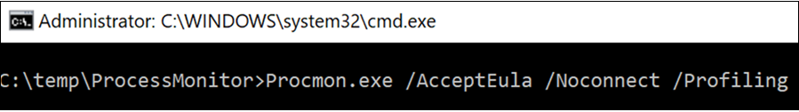
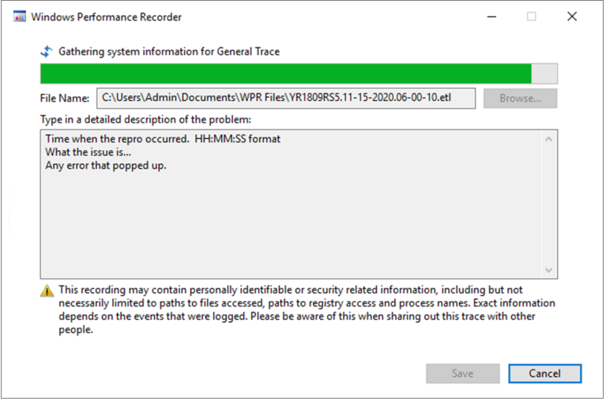

# <a name="troubleshoot-performance-issues-related-to-real-time-protection"></a><span data-ttu-id="450b8-104">Behandeln von Leistungsproblemen im Zusammenhang mit dem Echtzeitschutz</span><span class="sxs-lookup"><span data-stu-id="450b8-104">Troubleshoot performance issues related to real-time protection</span></span>


[!INCLUDE [Microsoft 365 Defender rebranding](../../includes/microsoft-defender.md)]


<span data-ttu-id="450b8-105">**Gilt für:**</span><span class="sxs-lookup"><span data-stu-id="450b8-105">**Applies to:**</span></span>

- [<span data-ttu-id="450b8-106">Microsoft Defender für Endpunkt</span><span class="sxs-lookup"><span data-stu-id="450b8-106">Microsoft Defender for Endpoint</span></span>](https://go.microsoft.com/fwlink/p/?linkid=2146631)
 
<span data-ttu-id="450b8-107">Wenn ihr System eine hohe CPU-Auslastung oder Leistungsprobleme im Zusammenhang mit dem Echtzeitschutzdienst in Microsoft Defender for Endpoint hat, können Sie ein Ticket an den Microsoft-Support übermitteln.</span><span class="sxs-lookup"><span data-stu-id="450b8-107">If your system is having high CPU usage or performance issues related to the real-time protection service in Microsoft Defender for Endpoint, you can submit a ticket to Microsoft support.</span></span> <span data-ttu-id="450b8-108">Führen Sie die Schritte unter [Collect Microsoft Defender Antivirus diagnostic data aus.](collect-diagnostic-data.md)</span><span class="sxs-lookup"><span data-stu-id="450b8-108">Follow the steps in [Collect Microsoft Defender Antivirus diagnostic data](collect-diagnostic-data.md).</span></span>

<span data-ttu-id="450b8-109">Als Administrator können Sie diese Probleme auch selbst beheben.</span><span class="sxs-lookup"><span data-stu-id="450b8-109">As an admin, you can also troubleshoot these issues on your own.</span></span> 

<span data-ttu-id="450b8-110">Zunächst sollten Sie überprüfen, ob das Problem von einer anderen Software verursacht wird.</span><span class="sxs-lookup"><span data-stu-id="450b8-110">First, you might want to check if the issue is being caused by another software.</span></span> <span data-ttu-id="450b8-111">Lesen [Sie Überprüfen sie beim Hersteller nach Antivirenausschlüssen](#check-with-vendor-for-antivirus-exclusions).</span><span class="sxs-lookup"><span data-stu-id="450b8-111">Read [Check with vendor for antivirus exclusions](#check-with-vendor-for-antivirus-exclusions).</span></span>

<span data-ttu-id="450b8-112">Andernfalls können Sie ermitteln, welche Software im Zusammenhang mit dem identifizierten Leistungsproblem steht, indem Sie die Schritte unter [Analysieren des Microsoft Protection-Protokolls ausführen.](#analyze-the-microsoft-protection-log)</span><span class="sxs-lookup"><span data-stu-id="450b8-112">Otherwise, you can identify which software is related to the identified performance issue by following the steps in [Analyze the Microsoft Protection Log](#analyze-the-microsoft-protection-log).</span></span> 

<span data-ttu-id="450b8-113">Sie können auch zusätzliche Protokolle für Ihre Übermittlung an den Microsoft-Support bereitstellen, indem Sie die folgenden Schritte ausführen:</span><span class="sxs-lookup"><span data-stu-id="450b8-113">You can also provide additional logs to your submission to Microsoft support by following the steps in:</span></span>
- [<span data-ttu-id="450b8-114">Erfassen von Prozessprotokollen mithilfe der Prozessüberwachung</span><span class="sxs-lookup"><span data-stu-id="450b8-114">Capture process logs using Process Monitor</span></span>](#capture-process-logs-using-process-monitor)
- [<span data-ttu-id="450b8-115">Erfassen von Leistungsprotokollen mithilfe Windows Leistungsaufzeichnung</span><span class="sxs-lookup"><span data-stu-id="450b8-115">Capture performance logs using Windows Performance Recorder</span></span>](#capture-performance-logs-using-windows-performance-recorder) 

## <a name="check-with-vendor-for-antivirus-exclusions"></a><span data-ttu-id="450b8-116">Suchen Sie beim Hersteller nach Antivirenausschlüssen</span><span class="sxs-lookup"><span data-stu-id="450b8-116">Check with vendor for antivirus exclusions</span></span>

<span data-ttu-id="450b8-117">Wenn Sie die Software, die sich auf die Systemleistung auswirken kann, leicht identifizieren können, wechseln Sie zur Knowledge Base oder dem Support Center des Softwareanbieters.</span><span class="sxs-lookup"><span data-stu-id="450b8-117">If you can readily identify the software affecting system performance, go to the software vendor's knowledge base or support center.</span></span> <span data-ttu-id="450b8-118">Suchen Sie, ob sie Empfehlungen zu Antivirenausschlüssen haben.</span><span class="sxs-lookup"><span data-stu-id="450b8-118">Search if they have recommendations about antivirus exclusions.</span></span> <span data-ttu-id="450b8-119">Wenn die Website des Anbieters nicht über diese verfügt, können Sie ein Supportticket mit ihm öffnen und ihn bitten, eins zu veröffentlichen.</span><span class="sxs-lookup"><span data-stu-id="450b8-119">If the vendor's website does not have them, you can open a support ticket with them and ask them to publish one.</span></span> 

<span data-ttu-id="450b8-120">Es wird empfohlen, dass Softwareanbieter die verschiedenen Richtlinien in Partnering with the industry befolgen, um falsch [positive Ergebnisse zu minimieren.](https://www.microsoft.com/security/blog/2018/08/16/partnering-with-the-industry-to-minimize-false-positives/)</span><span class="sxs-lookup"><span data-stu-id="450b8-120">We recommend that software vendors follow the various guidelines in [Partnering with the industry to minimize false positives](https://www.microsoft.com/security/blog/2018/08/16/partnering-with-the-industry-to-minimize-false-positives/).</span></span> <span data-ttu-id="450b8-121">Der Anbieter kann seine Software über das [Microsoft Defender Security Intelligence Portal (MDSI) übermitteln.](https://www.microsoft.com/wdsi/filesubmission?persona=SoftwareDeveloper)</span><span class="sxs-lookup"><span data-stu-id="450b8-121">The vendor can submit their software through the [Microsoft Defender Security Intelligence portal (MDSI)](https://www.microsoft.com/wdsi/filesubmission?persona=SoftwareDeveloper).</span></span>


## <a name="analyze-the-microsoft-protection-log"></a><span data-ttu-id="450b8-122">Analysieren des Microsoft Protection-Protokolls</span><span class="sxs-lookup"><span data-stu-id="450b8-122">Analyze the Microsoft Protection Log</span></span>

<span data-ttu-id="450b8-123">In **MPLog-xxxxxxxx-xxxxxx.log** finden Sie die geschätzten Leistungsauswirkungen von ausgeführter Software *als EstimatedImpact*:</span><span class="sxs-lookup"><span data-stu-id="450b8-123">In **MPLog-xxxxxxxx-xxxxxx.log**, you can find the estimated performance impact information of running software as *EstimatedImpact*:</span></span>
    
`Per-process counts:ProcessImageName: smsswd.exe, TotalTime: 6597, Count: 1406, MaxTime: 609, MaxTimeFile: \Device\HarddiskVolume3\_SMSTaskSequence\Packages\WQ1008E9\Files\FramePkg.exe, EstimatedImpact: 65%`

| <span data-ttu-id="450b8-124">Feldname</span><span class="sxs-lookup"><span data-stu-id="450b8-124">Field name</span></span> | <span data-ttu-id="450b8-125">Beschreibung</span><span class="sxs-lookup"><span data-stu-id="450b8-125">Description</span></span> |
|---|---|
|<span data-ttu-id="450b8-126">ProcessImageName</span><span class="sxs-lookup"><span data-stu-id="450b8-126">ProcessImageName</span></span> | <span data-ttu-id="450b8-127">Prozessbildname</span><span class="sxs-lookup"><span data-stu-id="450b8-127">Process image name</span></span> |
| <span data-ttu-id="450b8-128">TotalTime</span><span class="sxs-lookup"><span data-stu-id="450b8-128">TotalTime</span></span> | <span data-ttu-id="450b8-129">Die kumulierte Dauer in Millisekunden für Scans von Dateien, auf die durch diesen Prozess zugegriffen wird</span><span class="sxs-lookup"><span data-stu-id="450b8-129">The cumulative duration in milliseconds spent in scans of files accessed by this process</span></span> |
|<span data-ttu-id="450b8-130">Anzahl</span><span class="sxs-lookup"><span data-stu-id="450b8-130">Count</span></span> | <span data-ttu-id="450b8-131">Die Anzahl der gescannten Dateien, auf die von diesem Prozess zugegriffen wird</span><span class="sxs-lookup"><span data-stu-id="450b8-131">The number of scanned files accessed by this process</span></span> |
|<span data-ttu-id="450b8-132">MaxTime</span><span class="sxs-lookup"><span data-stu-id="450b8-132">MaxTime</span></span> |  <span data-ttu-id="450b8-133">Die Dauer in Millisekunden bei der längsten einzelnen Überprüfung einer Datei, auf die von diesem Prozess zugegriffen wird</span><span class="sxs-lookup"><span data-stu-id="450b8-133">The duration in milliseconds in the longest single scan of a file accessed by this process</span></span> |
| <span data-ttu-id="450b8-134">MaxTimeFile</span><span class="sxs-lookup"><span data-stu-id="450b8-134">MaxTimeFile</span></span> | <span data-ttu-id="450b8-135">Der Pfad der Datei, auf die von diesem Prozess zugegriffen wird, für die die längste Überprüfung `MaxTime` der Dauer aufgezeichnet wurde</span><span class="sxs-lookup"><span data-stu-id="450b8-135">The path of the file accessed by this process for which the longest scan of `MaxTime` duration was recorded</span></span> |
| <span data-ttu-id="450b8-136">EstimatedImpact</span><span class="sxs-lookup"><span data-stu-id="450b8-136">EstimatedImpact</span></span> | <span data-ttu-id="450b8-137">Der Prozentsatz der Zeit, die in Scans auf Dateien verwendet wird, auf die von diesem Prozess zugegriffen wird, ab dem Zeitraum, in dem dieser Prozess Scanaktivitäten erfahren hat</span><span class="sxs-lookup"><span data-stu-id="450b8-137">The percentage of time spent in scans for files accessed by this process out of the period in which this process experienced scan activity</span></span> |

<span data-ttu-id="450b8-138">Wenn die Leistungsauswirkung hoch ist, versuchen Sie, den Prozess den Pfad-/Prozessausschlüssen zu hinzufügen, indem Sie die Schritte unter Konfigurieren und Überprüfen von Ausschlüssen für Microsoft Defender Antivirus [ausführen.](collect-diagnostic-data.md)</span><span class="sxs-lookup"><span data-stu-id="450b8-138">If the performance impact is high, try adding the process to the Path/Process exclusions by following the steps in [Configure and validate exclusions for Microsoft Defender Antivirus scans](collect-diagnostic-data.md).</span></span>

<span data-ttu-id="450b8-139">Wenn das Problem im vorherigen Schritt nicht behoben wird, können Sie weitere Informationen über den Prozessmonitor oder die Windows [in](#capture-performance-logs-using-windows-performance-recorder) den folgenden Abschnitten sammeln. [](#capture-process-logs-using-process-monitor)</span><span class="sxs-lookup"><span data-stu-id="450b8-139">If the previous step doesn't solve the problem, you can collect more information through the [Process Monitor](#capture-process-logs-using-process-monitor) or the [Windows Performance Recorder](#capture-performance-logs-using-windows-performance-recorder) in the following sections.</span></span>
     
## <a name="capture-process-logs-using-process-monitor"></a><span data-ttu-id="450b8-140">Erfassen von Prozessprotokollen mithilfe der Prozessüberwachung</span><span class="sxs-lookup"><span data-stu-id="450b8-140">Capture process logs using Process Monitor</span></span>

<span data-ttu-id="450b8-141">Process Monitor (ProcMon) ist ein erweitertes Überwachungstool, das Echtzeitprozesse anzeigen kann.</span><span class="sxs-lookup"><span data-stu-id="450b8-141">Process Monitor (ProcMon) is an advanced monitoring tool that can show real-time processes.</span></span> <span data-ttu-id="450b8-142">Sie können dies verwenden, um das Leistungsproblem zu erfassen, während es auftritt.</span><span class="sxs-lookup"><span data-stu-id="450b8-142">You can use this to capture the performance issue as it is occurring.</span></span>

1. <span data-ttu-id="450b8-143">Laden [Sie Process Monitor v3.60](/sysinternals/downloads/procmon) in einen Ordner wie `C:\temp` herunter.</span><span class="sxs-lookup"><span data-stu-id="450b8-143">Download [Process Monitor v3.60](/sysinternals/downloads/procmon) to a folder like `C:\temp`.</span></span>

2. <span data-ttu-id="450b8-144">So entfernen Sie die Dateimarke des Webs:</span><span class="sxs-lookup"><span data-stu-id="450b8-144">To remove the file's mark of the web:</span></span>
    1. <span data-ttu-id="450b8-145">Klicken Sie mit der **rechtenProcessMonitor.zip,** und wählen Sie **Eigenschaften aus.**</span><span class="sxs-lookup"><span data-stu-id="450b8-145">Right-click **ProcessMonitor.zip** and select **Properties**.</span></span>
    1. <span data-ttu-id="450b8-146">Suchen Sie *auf* der Registerkarte Allgemein nach *Sicherheit*.</span><span class="sxs-lookup"><span data-stu-id="450b8-146">Under the *General* tab, look for *Security*.</span></span>
    1. <span data-ttu-id="450b8-147">Aktivieren Sie das Kontrollkästchen neben **Entsperren**.</span><span class="sxs-lookup"><span data-stu-id="450b8-147">Check the box beside **Unblock**.</span></span>
    1. <span data-ttu-id="450b8-148">Wählen Sie **Anwenden** aus.</span><span class="sxs-lookup"><span data-stu-id="450b8-148">Select **Apply**.</span></span>
    
     

3. <span data-ttu-id="450b8-150">Entpacken Sie die Datei `C:\temp` in, sodass der Ordnerpfad `C:\temp\ProcessMonitor` ist.</span><span class="sxs-lookup"><span data-stu-id="450b8-150">Unzip the file in `C:\temp` so that the folder path will be `C:\temp\ProcessMonitor`.</span></span> 

4. <span data-ttu-id="450b8-151">Kopieren **ProcMon.exe** auf den Windows oder Windows, den Sie beheben möchten.</span><span class="sxs-lookup"><span data-stu-id="450b8-151">Copy **ProcMon.exe**  to the Windows client or Windows server you're troubleshooting.</span></span>  

5. <span data-ttu-id="450b8-152">Stellen Sie vor dem Ausführen von ProcMon sicher, dass alle anderen Anwendungen, die nicht mit dem Problem mit der hohen CPU-Auslastung in Zusammenhang stehen, geschlossen werden.</span><span class="sxs-lookup"><span data-stu-id="450b8-152">Before running ProcMon, make sure all other applications not related to the high CPU usage issue are closed.</span></span> <span data-ttu-id="450b8-153">Dadurch wird die Anzahl der zu überprüfende Prozesse minimiert.</span><span class="sxs-lookup"><span data-stu-id="450b8-153">Doing this will minimize the number of processes to check.</span></span>

6. <span data-ttu-id="450b8-154">Sie können ProcMon auf zwei Arten starten.</span><span class="sxs-lookup"><span data-stu-id="450b8-154">You can launch ProcMon in two ways.</span></span>
    1. <span data-ttu-id="450b8-155">Klicken Sie mit der **rechtenProcMon.exe,** und wählen **Sie Als Administrator ausführen aus.**</span><span class="sxs-lookup"><span data-stu-id="450b8-155">Right-click **ProcMon.exe** and select **Run as administrator**.</span></span> 
    

        <span data-ttu-id="450b8-156">Da die Protokollierung automatisch gestartet wird, wählen Sie das Vergrößerungsglassymbol aus, um die aktuelle Aufnahme zu beenden oder die Tastenkombination **STRG+E zu verwenden.**</span><span class="sxs-lookup"><span data-stu-id="450b8-156">Since logging starts automatically, select the magnifying glass icon  to stop the current capture or use the keyboard shortcut **Ctrl+E**.</span></span>
 
        

        <span data-ttu-id="450b8-158">Überprüfen Sie, ob das Vergrößerungsglassymbol jetzt mit einem roten X angezeigt wird, um zu überprüfen, ob Sie die Aufnahme beendet haben.</span><span class="sxs-lookup"><span data-stu-id="450b8-158">To verify that you have stopped the capture, check if the magnifying glass icon now appears with a red X.</span></span>

                 

        <span data-ttu-id="450b8-160">Wählen Sie als Nächstes das Radierersymbol aus, um die frühere Aufnahme zu löschen.</span><span class="sxs-lookup"><span data-stu-id="450b8-160">Next, to clear the earlier capture, select the eraser icon.</span></span>

        

        <span data-ttu-id="450b8-162">Oder verwenden Sie die Tastenkombination **STRG+X**.</span><span class="sxs-lookup"><span data-stu-id="450b8-162">Or use the keyboard shortcut **Ctrl+X**.</span></span>

    2. <span data-ttu-id="450b8-163">Die zweite Möglichkeit besteht in der Ausführung **der** Befehlszeile als Administrator, und führen Sie dann im Prozessüberwachungspfad die folgenden Befehle aus:</span><span class="sxs-lookup"><span data-stu-id="450b8-163">The second way is to run the **command line** as admin, then from the Process Monitor path, run:</span></span>

        
 
        ```console
        Procmon.exe /AcceptEula /Noconnect /Profiling
        ```
        
        >[!TIP] 
        ><span data-ttu-id="450b8-165">Machen Sie das ProcMon-Fenster beim Erfassen von Daten so klein wie möglich, damit Sie die Ablaufverfolgung problemlos starten und beenden können.</span><span class="sxs-lookup"><span data-stu-id="450b8-165">Make the ProcMon window as small as possible when capturing data so you can easily start and stop the trace.</span></span>
        > 
        >
    
7. <span data-ttu-id="450b8-167">Nachdem Sie eines der Verfahren in Schritt 6 durchgeführt haben, wird als Nächstes eine Option zum Festlegen von Filtern angezeigt.</span><span class="sxs-lookup"><span data-stu-id="450b8-167">After following one of the procedures in step 6, you'll next see an option to set filters.</span></span> <span data-ttu-id="450b8-168">Klicken Sie auf **OK**.</span><span class="sxs-lookup"><span data-stu-id="450b8-168">Select **OK**.</span></span> <span data-ttu-id="450b8-169">Sie können die Ergebnisse nach Abschluss der Aufnahme immer filtern.</span><span class="sxs-lookup"><span data-stu-id="450b8-169">You can always filter the results after the capture is completed.</span></span>
 
     

8. <span data-ttu-id="450b8-171">Um die Aufnahme zu starten, wählen Sie erneut das Vergrößerungsglassymbol aus.</span><span class="sxs-lookup"><span data-stu-id="450b8-171">To start the capture, select the magnifying glass icon again.</span></span>
     
9. <span data-ttu-id="450b8-172">Reproduzieren Sie das Problem.</span><span class="sxs-lookup"><span data-stu-id="450b8-172">Reproduce the problem.</span></span>
 
    >[!TIP] 
    ><span data-ttu-id="450b8-173">Warten Sie, bis das Problem vollständig reproduziert ist, und notieren Sie sich den Zeitstempel, als die Ablaufverfolgung gestartet wurde.</span><span class="sxs-lookup"><span data-stu-id="450b8-173">Wait for the problem to be fully reproduced, then take note of the timestamp when the trace started.</span></span>

10. <span data-ttu-id="450b8-174">Sobald Sie während der hohen CPU-Auslastung zwei bis vier Minuten Prozessaktivität haben, beenden Sie die Aufnahme, indem Sie das Vergrößerungsglassymbol auswählen.</span><span class="sxs-lookup"><span data-stu-id="450b8-174">Once you have two to four minutes of process activity during the high CPU usage condition, stop the capture by selecting the magnifying glass icon.</span></span>

11. <span data-ttu-id="450b8-175">Um die Aufnahme mit einem eindeutigen Namen und im PML-Format zu speichern, wählen Sie **Datei** und dann **Speichern... aus.** Stellen Sie sicher, dass Sie die Optionsfelder **Alle Ereignisse und** **Systemeigenes Prozessmonitorformat (Native Process Monitor Format, PML) auswählen.**</span><span class="sxs-lookup"><span data-stu-id="450b8-175">To save the capture with a unique name and with the .pml format, select **File** then select **Save...**. Make sure to select the radio buttons **All events** and **Native Process Monitor Format (PML)**.</span></span>

    

12. <span data-ttu-id="450b8-177">Ändern Sie für eine bessere Nachverfolgung den Standardpfad von `C:\temp\ProcessMonitor\LogFile.PML` wo `C:\temp\ProcessMonitor\%ComputerName%_LogFile_MMDDYEAR_Repro_of_issue.PML` aus:</span><span class="sxs-lookup"><span data-stu-id="450b8-177">For better tracking, change the default path from `C:\temp\ProcessMonitor\LogFile.PML` to `C:\temp\ProcessMonitor\%ComputerName%_LogFile_MMDDYEAR_Repro_of_issue.PML` where:</span></span>
    - <span data-ttu-id="450b8-178">`%ComputerName%` ist der Gerätename</span><span class="sxs-lookup"><span data-stu-id="450b8-178">`%ComputerName%` is the device name</span></span>
    - <span data-ttu-id="450b8-179">`MMDDYEAR` ist Monat, Tag und Jahr</span><span class="sxs-lookup"><span data-stu-id="450b8-179">`MMDDYEAR` is the month, day, and year</span></span>
    -  <span data-ttu-id="450b8-180">`Repro_of_issue` ist der Name des Problems, das Sie reproduzieren möchten</span><span class="sxs-lookup"><span data-stu-id="450b8-180">`Repro_of_issue` is the name of the issue you're trying to reproduce</span></span>

    >[!TIP] 
    > <span data-ttu-id="450b8-181">Wenn Sie über ein funktionierendes System verfügen, können Sie ein Beispielprotokoll zum Vergleichen erhalten.</span><span class="sxs-lookup"><span data-stu-id="450b8-181">If you have a working system, you might want to get a sample log to compare.</span></span>

13. <span data-ttu-id="450b8-182">Zip the .pml file and submit it to Microsoft support.</span><span class="sxs-lookup"><span data-stu-id="450b8-182">Zip the .pml file and submit it to Microsoft support.</span></span>


## <a name="capture-performance-logs-using-windows-performance-recorder"></a><span data-ttu-id="450b8-183">Erfassen von Leistungsprotokollen mithilfe Windows Leistungsaufzeichnung</span><span class="sxs-lookup"><span data-stu-id="450b8-183">Capture performance logs using Windows Performance Recorder</span></span>

<span data-ttu-id="450b8-184">Sie können die Windows (Performance Recorder, WPR) verwenden, um zusätzliche Informationen in Ihre Übermittlung an den Microsoft-Support einschlussen.</span><span class="sxs-lookup"><span data-stu-id="450b8-184">You can use Windows Performance Recorder (WPR) to include additional information in your submission to Microsoft support.</span></span> <span data-ttu-id="450b8-185">WPR ist ein leistungsstarkes Aufzeichnungstool, das ereignisablaufverfolgung für Windows erstellt.</span><span class="sxs-lookup"><span data-stu-id="450b8-185">WPR is a powerful recording tool that creates Event Tracing for Windows recordings.</span></span> 

<span data-ttu-id="450b8-186">WPR ist Teil des Windows Assessment and Deployment Kit (Windows ADK) und kann unter Download and install the Windows [ADK heruntergeladen werden.](/windows-hardware/get-started/adk-install)</span><span class="sxs-lookup"><span data-stu-id="450b8-186">WPR is part of the Windows Assessment and Deployment Kit (Windows ADK) and can be downloaded from [Download and install the Windows ADK](/windows-hardware/get-started/adk-install).</span></span> <span data-ttu-id="450b8-187">Sie können es auch als Teil des Windows 10 Software Development Kit unter [Windows 10 SDK herunterladen.](https://developer.microsoft.com/windows/downloads/windows-10-sdk/)</span><span class="sxs-lookup"><span data-stu-id="450b8-187">You can also download it as part of the Windows 10 Software Development Kit at [Windows 10 SDK](https://developer.microsoft.com/windows/downloads/windows-10-sdk/).</span></span>

<span data-ttu-id="450b8-188">Sie können die WPR-Benutzeroberfläche verwenden, indem Sie die Schritte unter Erfassen von Leistungsprotokollen mithilfe [der WPR-Benutzeroberfläche ausführen.](#capture-performance-logs-using-the-wpr-ui)</span><span class="sxs-lookup"><span data-stu-id="450b8-188">You can use the WPR user interface by following the steps in [Capture performance logs using the WPR UI](#capture-performance-logs-using-the-wpr-ui).</span></span> 

<span data-ttu-id="450b8-189">Alternativ können Sie auch das Befehlszeilentool *wpr.exe* verwenden, das in Windows 8 und späteren Versionen verfügbar ist, indem Sie die Schritte unter Erfassen von Leistungsprotokollen mithilfe der [WPR CLI ausführen.](#capture-performance-logs-using-the-wpr-cli)</span><span class="sxs-lookup"><span data-stu-id="450b8-189">Alternatively, you can also use the command-line tool *wpr.exe*, which is available in Windows 8 and later versions  by following the steps in [Capture performance logs using the WPR CLI](#capture-performance-logs-using-the-wpr-cli).</span></span>


### <a name="capture-performance-logs-using-the-wpr-ui"></a><span data-ttu-id="450b8-190">Erfassen von Leistungsprotokollen mithilfe der WPR-Benutzeroberfläche</span><span class="sxs-lookup"><span data-stu-id="450b8-190">Capture performance logs using the WPR UI</span></span>

>[!TIP]
><span data-ttu-id="450b8-191">Wenn Sie über mehrere Geräte verfügen, auf denen das Problem auftritt, verwenden Sie das Gerät mit dem größten Ram-Speicher.</span><span class="sxs-lookup"><span data-stu-id="450b8-191">If you have multiple devices where the issue is occurring, use the one which has the most amount of RAM.</span></span>

1. <span data-ttu-id="450b8-192">Laden Sie WPR herunter, und installieren Sie sie.</span><span class="sxs-lookup"><span data-stu-id="450b8-192">Download and install WPR.</span></span>

2. <span data-ttu-id="450b8-193">Klicken *Windows Kits* mit der rechten Maustaste auf Windows **Leistungsaufzeichnung**.</span><span class="sxs-lookup"><span data-stu-id="450b8-193">Under *Windows Kits*, right-click **Windows Performance Recorder**.</span></span> 

    

    <span data-ttu-id="450b8-195">Wählen Sie **Weitere aus.**</span><span class="sxs-lookup"><span data-stu-id="450b8-195">Select **More**.</span></span> <span data-ttu-id="450b8-196">Wählen **Sie Als Administrator ausführen aus.**</span><span class="sxs-lookup"><span data-stu-id="450b8-196">Select **Run as administrator**.</span></span>

3. <span data-ttu-id="450b8-197">Wenn das Dialogfeld Benutzerkontensteuerung angezeigt wird, wählen Sie **Ja aus.**</span><span class="sxs-lookup"><span data-stu-id="450b8-197">When the User Account Control dialog box appears, select **Yes**.</span></span>

    

4. <span data-ttu-id="450b8-199">Laden Sie als Nächstes das [Microsoft Defender for Endpoint-Analyseprofil](https://github.com/YongRhee-MDE/Scripts/blob/master/MDAV.wprp) herunter, und speichern Sie `WD.wprp` unter in einem Ordner wie `C:\temp` .</span><span class="sxs-lookup"><span data-stu-id="450b8-199">Next, download the [Microsoft Defender for Endpoint analysis](https://github.com/YongRhee-MDE/Scripts/blob/master/MDAV.wprp) profile and save as `WD.wprp` to a folder like `C:\temp`.</span></span> 
     
5. <span data-ttu-id="450b8-200">Wählen Sie im Dialogfeld WPR weitere **Optionen aus.**</span><span class="sxs-lookup"><span data-stu-id="450b8-200">On the WPR dialog box, select **More options**.</span></span>

    

6. <span data-ttu-id="450b8-202">Wählen **Sie Profile hinzufügen...** aus, und navigieren Sie zum Pfad der `WD.wprp` Datei.</span><span class="sxs-lookup"><span data-stu-id="450b8-202">Select **Add Profiles...** and browse to the path of the `WD.wprp` file.</span></span>

7. <span data-ttu-id="450b8-203">Danach sollte ein neuer Profilsatz  unter Benutzerdefinierte Messungen namens *Microsoft Defender for Endpoint-Analyse* darunter angezeigt werden.</span><span class="sxs-lookup"><span data-stu-id="450b8-203">After that, you should see a new profile set under *Custom measurements* named *Microsoft Defender for Endpoint analysis* underneath it.</span></span>

    

    >[!WARNING]
    ><span data-ttu-id="450b8-205">Wenn Ihr Windows server über 64 GB RAM oder mehr verfügt, verwenden Sie die benutzerdefinierte `Microsoft Defender for Endpoint analysis for large servers` Maßeinheit anstelle von `Microsoft Defender for Endpoint analysis` .</span><span class="sxs-lookup"><span data-stu-id="450b8-205">If your Windows Server has 64 GB of RAM or more, use the custom measurement `Microsoft Defender for Endpoint analysis for large servers` instead of `Microsoft Defender for Endpoint analysis`.</span></span> <span data-ttu-id="450b8-206">Andernfalls kann ihr System eine hohe Menge an nicht aus seiteierten Poolspeichern oder Puffern verbrauchen, was zu Systeminstabilität führen kann.</span><span class="sxs-lookup"><span data-stu-id="450b8-206">Otherwise, your system could consume a high amount of non-paged pool memory or buffers which can lead to system instability.</span></span> <span data-ttu-id="450b8-207">Sie können auswählen, welche Profile hinzugefügt werden, indem Sie die **Ressourcenanalyse erweitern.**</span><span class="sxs-lookup"><span data-stu-id="450b8-207">You can choose which profiles to add by expanding **Resource Analysis**.</span></span> <span data-ttu-id="450b8-208">Dieses benutzerdefinierte Profil bietet den erforderlichen Kontext für eine detaillierte Leistungsanalyse.</span><span class="sxs-lookup"><span data-stu-id="450b8-208">This custom profile provides the necessary context for in-depth performance analysis.</span></span>
 
8. <span data-ttu-id="450b8-209">So verwenden Sie das benutzerdefinierte Maß microsoft Defender for Endpoint ausführliches Analyseprofil in der WPR-Benutzeroberfläche:</span><span class="sxs-lookup"><span data-stu-id="450b8-209">To use the custom measurement Microsoft Defender for Endpoint verbose analysis profile in the WPR UI:</span></span>

    1. <span data-ttu-id="450b8-210">Stellen Sie sicher, dass keine Profile unter den Gruppen *First-level triage,* *Resource Analysis* und Scenario *Analysis ausgewählt* sind.</span><span class="sxs-lookup"><span data-stu-id="450b8-210">Ensure no profiles are selected under the *First-level triage*, *Resource Analysis* and *Scenario Analysis* groups.</span></span>
    2. <span data-ttu-id="450b8-211">Wählen Sie **Benutzerdefinierte Messungen aus.**</span><span class="sxs-lookup"><span data-stu-id="450b8-211">Select **Custom measurements**.</span></span>
    3. <span data-ttu-id="450b8-212">Wählen **Sie Microsoft Defender for Endpoint analysis aus.**</span><span class="sxs-lookup"><span data-stu-id="450b8-212">Select **Microsoft Defender for Endpoint analysis**.</span></span>
    4. <span data-ttu-id="450b8-213">Wählen **Sie ausführlich unter** *Detailebene* aus.</span><span class="sxs-lookup"><span data-stu-id="450b8-213">Select **Verbose** under *Detail* level.</span></span>
    1. <span data-ttu-id="450b8-214">Wählen **Sie Datei** oder **Arbeitsspeicher** unter Protokollierungsmodus aus.</span><span class="sxs-lookup"><span data-stu-id="450b8-214">Select **File** or **Memory** under Logging mode.</span></span> 

    >[!important]
    ><span data-ttu-id="450b8-215">Sie sollten *Datei auswählen,* um den Dateiprotokollierungsmodus zu verwenden, wenn das Leistungsproblem direkt vom Benutzer reproduziert werden kann.</span><span class="sxs-lookup"><span data-stu-id="450b8-215">You should select *File* to use the file logging mode if the performance issue can be reproduced directly by the user.</span></span> <span data-ttu-id="450b8-216">Die meisten Probleme fallen unter diese Kategorie.</span><span class="sxs-lookup"><span data-stu-id="450b8-216">Most issues fall under this category.</span></span> <span data-ttu-id="450b8-217">Wenn der Benutzer das Problem jedoch nicht direkt reproduzieren kann, es  aber leicht bemerken kann, sobald das Problem auftritt, sollte der Benutzer Speicher auswählen, um den Speicherprotokollierungsmodus zu verwenden.</span><span class="sxs-lookup"><span data-stu-id="450b8-217">However, if the user cannot directly reproduce the issue but can easily notice it once the issue occurs, the user should select *Memory* to use the memory logging mode.</span></span> <span data-ttu-id="450b8-218">Dadurch wird sichergestellt, dass das Ablaufverfolgungsprotokoll aufgrund der langen Laufzeit nicht übermäßig aufgebläht wird.</span><span class="sxs-lookup"><span data-stu-id="450b8-218">This ensures that the trace log will not inflate excessively due to the long run time.</span></span>

9. <span data-ttu-id="450b8-219">Jetzt können Sie Daten sammeln.</span><span class="sxs-lookup"><span data-stu-id="450b8-219">Now you're ready to collect data.</span></span> <span data-ttu-id="450b8-220">Beenden Sie alle Anwendungen, die für die Reproduzierbarkeit des Leistungsproblems nicht relevant sind.</span><span class="sxs-lookup"><span data-stu-id="450b8-220">Exit all the applications that are not relevant to reproducing the performance issue.</span></span> <span data-ttu-id="450b8-221">Sie können Optionen ausblenden **auswählen,** um den vom WPR-Fenster belegten Platz klein zu halten.</span><span class="sxs-lookup"><span data-stu-id="450b8-221">You can select **Hide options** to keep the space occupied by the WPR window small.</span></span>

    

    >[!TIP]
    ><span data-ttu-id="450b8-223">Versuchen Sie, die Ablaufverfolgung mit ganzen Sekunden zu starten.</span><span class="sxs-lookup"><span data-stu-id="450b8-223">Try starting the trace at whole number seconds.</span></span> <span data-ttu-id="450b8-224">Beispiel: 01:30:00.</span><span class="sxs-lookup"><span data-stu-id="450b8-224">For instance, 01:30:00.</span></span> <span data-ttu-id="450b8-225">Dies erleichtert die Analyse der Daten.</span><span class="sxs-lookup"><span data-stu-id="450b8-225">This will make it easier to analyze the data.</span></span> <span data-ttu-id="450b8-226">Versuchen Sie außerdem, den Zeitstempel genau zu verfolgen, wann das Problem reproduziert wird.</span><span class="sxs-lookup"><span data-stu-id="450b8-226">Also try to keep track of the timestamp of exactly when the issue is reproduced.</span></span>

10. <span data-ttu-id="450b8-227">Klicken Sie auf **Starten**.</span><span class="sxs-lookup"><span data-stu-id="450b8-227">Select **Start**.</span></span>

    

11. <span data-ttu-id="450b8-229">Reproduzieren Sie das Problem.</span><span class="sxs-lookup"><span data-stu-id="450b8-229">Reproduce the issue.</span></span>

    >[!TIP]
    ><span data-ttu-id="450b8-230">Halten Sie die Datensammlung auf nicht länger als fünf Minuten.</span><span class="sxs-lookup"><span data-stu-id="450b8-230">Keep the data collection to no more than five minutes.</span></span> <span data-ttu-id="450b8-231">Zwei bis drei Minuten sind ein guter Bereich, da viele Daten gesammelt werden.</span><span class="sxs-lookup"><span data-stu-id="450b8-231">Two to three minutes is a good range since a lot of data is being collected.</span></span>

12. <span data-ttu-id="450b8-232">Klicken Sie auf **Speichern**.</span><span class="sxs-lookup"><span data-stu-id="450b8-232">Select **Save**.</span></span>

    

13. <span data-ttu-id="450b8-234">Füllen Sie **Type in einer detaillierten Beschreibung des Problems aus:** mit Informationen zum Problem und wie Sie das Problem reproduziert haben.</span><span class="sxs-lookup"><span data-stu-id="450b8-234">Fill up **Type in a detailed description of the problem:** with information about the problem and how you reproduced the issue.</span></span>

    

    1. <span data-ttu-id="450b8-236">Wählen **Sie Dateiname:** aus, um zu bestimmen, wo Ihre Ablaufverfolgungsdatei gespeichert wird.</span><span class="sxs-lookup"><span data-stu-id="450b8-236">Select **File Name:** to determine where your trace file will be saved.</span></span> <span data-ttu-id="450b8-237">Standardmäßig wird 1.is `%user%\Documents\WPR Files\` gespeichert.</span><span class="sxs-lookup"><span data-stu-id="450b8-237">By default, it 1.is saved to `%user%\Documents\WPR Files\`.</span></span>
    1. <span data-ttu-id="450b8-238">Klicken Sie auf **Speichern**.</span><span class="sxs-lookup"><span data-stu-id="450b8-238">Select **Save**.</span></span>

14. <span data-ttu-id="450b8-239">Warten Sie, während die Ablaufverfolgung zusammengeführt wird.</span><span class="sxs-lookup"><span data-stu-id="450b8-239">Wait while the trace is being merged.</span></span>

    

15. <span data-ttu-id="450b8-241">Nachdem die Ablaufverfolgung gespeichert wurde, wählen Sie **Ordner öffnen aus.**</span><span class="sxs-lookup"><span data-stu-id="450b8-241">Once the trace is saved, select **Open folder**.</span></span>

    

    <span data-ttu-id="450b8-243">Schließen Sie sowohl die Datei als auch den Ordner in Ihre Übermittlung an den Microsoft-Support ein.</span><span class="sxs-lookup"><span data-stu-id="450b8-243">Include both the file and the folder in your submission to Microsoft support.</span></span>

    

### <a name="capture-performance-logs-using-the-wpr-cli"></a><span data-ttu-id="450b8-245">Erfassen von Leistungsprotokollen mithilfe der WPR CLI</span><span class="sxs-lookup"><span data-stu-id="450b8-245">Capture performance logs using the WPR CLI</span></span>

<span data-ttu-id="450b8-246">Das Befehlszeilentool *wpr.exe* Teil des Betriebssystems ab Windows 8.</span><span class="sxs-lookup"><span data-stu-id="450b8-246">The command-line tool *wpr.exe* is part of the operating system starting with Windows 8.</span></span> <span data-ttu-id="450b8-247">So erfassen Sie eine WPR-Ablaufverfolgung mithilfe des Befehlszeilentools wpr.exe:</span><span class="sxs-lookup"><span data-stu-id="450b8-247">To collect a WPR trace using the command-line tool wpr.exe:</span></span>

1. <span data-ttu-id="450b8-248">Laden **[Sie Microsoft Defender for Endpoint-Analyseprofil](https://github.com/YongRhee-MDE/Scripts/blob/master/MDAV.wprp)** für Leistungsverfolgungen in eine Datei mit dem Namen in einem lokalen Verzeichnis wie `WD.wprp` `C:\traces` herunter.</span><span class="sxs-lookup"><span data-stu-id="450b8-248">Download **[Microsoft Defender for Endpoint analysis](https://github.com/YongRhee-MDE/Scripts/blob/master/MDAV.wprp)** profile for performance traces to a file named `WD.wprp` in a local directory such as `C:\traces`.</span></span>

3. <span data-ttu-id="450b8-249">Klicken Sie  mit der rechten Maustaste auf das Symbol Startmenü, und wählen **Sie Windows PowerShell (Administrator)** oder Eingabeaufforderung **(Administrator)** aus, um ein Eingabeaufforderungsfenster für Administratoren zu öffnen.</span><span class="sxs-lookup"><span data-stu-id="450b8-249">Right-click the **Start Menu** icon and select **Windows PowerShell (Admin)** or **Command Prompt (Admin)** to open an Admin command prompt window.</span></span>

4. <span data-ttu-id="450b8-250">Wenn das Dialogfeld Benutzerkontensteuerung angezeigt wird, wählen Sie **Ja aus.**</span><span class="sxs-lookup"><span data-stu-id="450b8-250">When the User Account Control dialog box appears, select **Yes**.</span></span>

5. <span data-ttu-id="450b8-251">Führen Sie an der Eingabeaufforderung mit erhöhten Rechten den folgenden Befehl aus, um eine Microsoft Defender for Endpoint-Leistungsverfolgung zu starten:</span><span class="sxs-lookup"><span data-stu-id="450b8-251">At the elevated prompt, run the following command to start a Microsoft Defender for Endpoint performance trace:</span></span>

    ```console
    wpr.exe -start C:\traces\WD.wprp!WD.Verbose -filemode
    ```
    
    >[!WARNING]
    ><span data-ttu-id="450b8-252">Wenn Ihr Windows Server 64 GB oder mehr ram oder mehr hat, verwenden Sie Profile und anstelle von Profilen `WDForLargeServers.Light` `WDForLargeServers.Verbose` `WD.Light` `WD.Verbose` bzw. .</span><span class="sxs-lookup"><span data-stu-id="450b8-252">If your Windows Server has 64 GB or RAM or more, use profiles `WDForLargeServers.Light` and `WDForLargeServers.Verbose` instead of profiles `WD.Light` and `WD.Verbose`, respectively.</span></span> <span data-ttu-id="450b8-253">Andernfalls kann ihr System eine hohe Menge an nicht aus seiteierten Poolspeichern oder Puffern verbrauchen, was zu Systeminstabilität führen kann.</span><span class="sxs-lookup"><span data-stu-id="450b8-253">Otherwise, your system could consume a high amount of non-paged pool memory or buffers which can lead to system instability.</span></span>

6. <span data-ttu-id="450b8-254">Reproduzieren Sie das Problem.</span><span class="sxs-lookup"><span data-stu-id="450b8-254">Reproduce the issue.</span></span>

    >[!TIP]
    ><span data-ttu-id="450b8-255">Die Datensammlung muss nicht länger als fünf Minuten dauern.</span><span class="sxs-lookup"><span data-stu-id="450b8-255">Keep the data collection no to more than five minutes.</span></span>  <span data-ttu-id="450b8-256">Je nach Szenario sind zwei bis drei Minuten ein guter Bereich, da viele Daten gesammelt werden.</span><span class="sxs-lookup"><span data-stu-id="450b8-256">Depending on the scenario, two to three minutes is a good range since a lot of data is being collected.</span></span>

7. <span data-ttu-id="450b8-257">Führen Sie an der Eingabeaufforderung mit erhöhten Rechten den folgenden Befehl aus, um die Leistungsverfolgung zu beenden, und stellen Sie sicher, dass Sie Informationen zu dem Problem und zur Art und Weise bereitstellen, wie Sie das Problem reproduziert haben:</span><span class="sxs-lookup"><span data-stu-id="450b8-257">At the elevated prompt, run the following command to stop the performance trace, making sure to provide information about the problem and how you reproduced the issue:</span></span>

    ```console
    wpr.exe -stop merged.etl "Timestamp when the issue was reproduced, in HH:MM:SS format" "Description of the issue" "Any error that popped up"
    ```

8. <span data-ttu-id="450b8-258">Warten Sie, bis die Ablaufverfolgung zusammengeführt wurde.</span><span class="sxs-lookup"><span data-stu-id="450b8-258">Wait until the trace is merged.</span></span> 

9. <span data-ttu-id="450b8-259">Schließen Sie sowohl die Datei als auch den Ordner in Ihre Übermittlung an den Microsoft-Support ein.</span><span class="sxs-lookup"><span data-stu-id="450b8-259">Include both the file and the folder in your submission to Microsoft support.</span></span>

## <a name="see-also"></a><span data-ttu-id="450b8-260">Siehe auch</span><span class="sxs-lookup"><span data-stu-id="450b8-260">See also</span></span>

- [<span data-ttu-id="450b8-261">Sammeln Microsoft Defender Antivirus Diagnosedaten</span><span class="sxs-lookup"><span data-stu-id="450b8-261">Collect Microsoft Defender Antivirus diagnostic data</span></span>](collect-diagnostic-data.md)
- [<span data-ttu-id="450b8-262">Konfigurieren und Überprüfen von Ausschlüssen für Microsoft Defender Antivirus Scans</span><span class="sxs-lookup"><span data-stu-id="450b8-262">Configure and validate exclusions for Microsoft Defender Antivirus scans</span></span>](configure-exclusions-microsoft-defender-antivirus.md)
