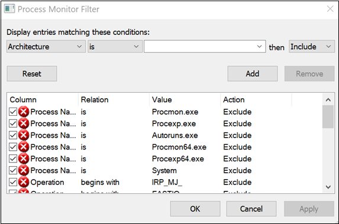
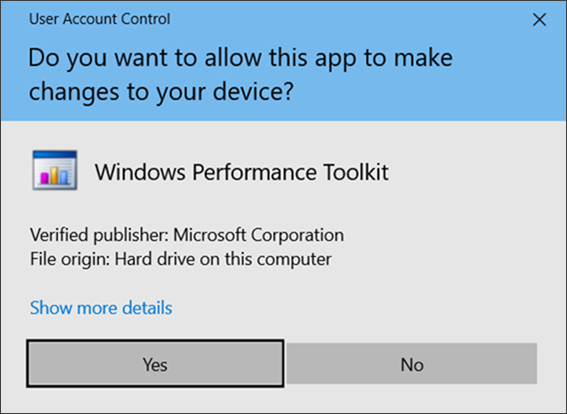
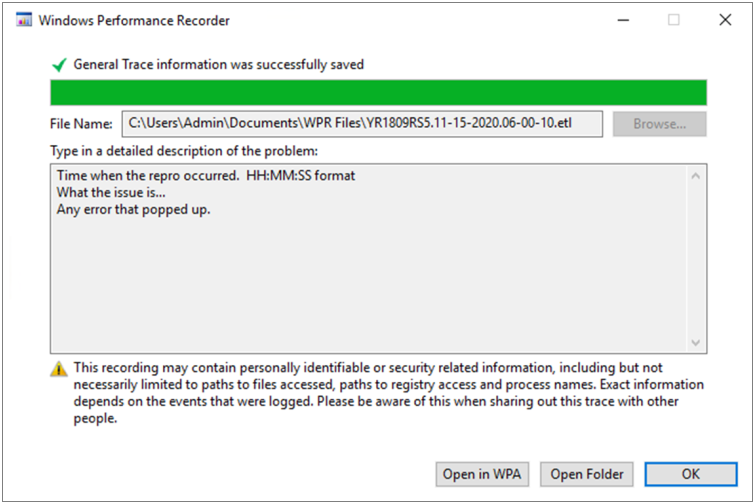

# <a name="troubleshoot-performance-issues-related-to-real-time-protection"></a>Behandeln von Leistungsproblemen im Zusammenhang mit dem Echtzeitschutz


[!INCLUDE [Microsoft 365 Defender rebranding](../../includes/microsoft-defender.md)]


**Gilt für:**

- [Microsoft Defender für Endpunkt](https://go.microsoft.com/fwlink/p/?linkid=2146631)
 
Wenn ihr System eine hohe CPU-Auslastung oder Leistungsprobleme im Zusammenhang mit dem Echtzeitschutzdienst in Microsoft Defender for Endpoint hat, können Sie ein Ticket an den Microsoft-Support übermitteln. Führen Sie die Schritte unter [Sammeln von Microsoft Defender Antivirus-Diagnosedaten aus.](collect-diagnostic-data.md)

Als Administrator können Sie diese Probleme auch selbst beheben. 

Zunächst sollten Sie überprüfen, ob das Problem von einer anderen Software verursacht wird. Lesen [Sie Überprüfen sie beim Hersteller nach Antivirenausschlüssen](#check-with-vendor-for-antivirus-exclusions).

Andernfalls können Sie ermitteln, welche Software im Zusammenhang mit dem identifizierten Leistungsproblem steht, indem Sie die Schritte unter [Analysieren des Microsoft Protection-Protokolls ausführen.](#analyze-the-microsoft-protection-log) 

Sie können auch zusätzliche Protokolle für Ihre Übermittlung an den Microsoft-Support bereitstellen, indem Sie die folgenden Schritte ausführen:
- [Erfassen von Prozessprotokollen mithilfe der Prozessüberwachung](#capture-process-logs-using-process-monitor)
- [Erfassen von Leistungsprotokollen mithilfe der Windows-Leistungsaufzeichnung](#capture-performance-logs-using-windows-performance-recorder) 

## <a name="check-with-vendor-for-antivirus-exclusions"></a>Suchen Sie beim Hersteller nach Antivirenausschlüssen

Wenn Sie die Software, die sich auf die Systemleistung auswirken kann, leicht identifizieren können, wechseln Sie zur Knowledge Base oder dem Support Center des Softwareanbieters. Suchen Sie, ob sie Empfehlungen zu Antivirenausschlüssen haben. Wenn die Website des Anbieters nicht über diese verfügt, können Sie ein Supportticket mit ihm öffnen und ihn bitten, eins zu veröffentlichen. 

Es wird empfohlen, dass Softwareanbieter die verschiedenen Richtlinien in Partnering with the industry befolgen, um falsch [positive Ergebnisse zu minimieren.](https://www.microsoft.com/security/blog/2018/08/16/partnering-with-the-industry-to-minimize-false-positives/) Der Anbieter kann seine Software über das [Microsoft Defender Security Intelligence Portal (MDSI) übermitteln.](https://www.microsoft.com/wdsi/filesubmission?persona=SoftwareDeveloper)


## <a name="analyze-the-microsoft-protection-log"></a>Analysieren des Microsoft Protection-Protokolls

In **MPLog-xxxxxxxx-xxxxxx.log** finden Sie die geschätzten Leistungsauswirkungen von ausgeführter Software *als EstimatedImpact*:
    
`Per-process counts:ProcessImageName: smsswd.exe, TotalTime: 6597, Count: 1406, MaxTime: 609, MaxTimeFile: \Device\HarddiskVolume3\_SMSTaskSequence\Packages\WQ1008E9\Files\FramePkg.exe, EstimatedImpact: 65%`

| Feldname | Beschreibung |
|---|---|
|ProcessImageName | Prozessbildname |
| TotalTime | Die kumulierte Dauer in Millisekunden für Scans von Dateien, auf die durch diesen Prozess zugegriffen wird |
|Anzahl | Die Anzahl der gescannten Dateien, auf die von diesem Prozess zugegriffen wird |
|MaxTime |  Die Dauer in Millisekunden bei der längsten einzelnen Überprüfung einer Datei, auf die von diesem Prozess zugegriffen wird |
| MaxTimeFile | Der Pfad der Datei, auf die von diesem Prozess zugegriffen wird, für die die längste Überprüfung `MaxTime` der Dauer aufgezeichnet wurde |
| EstimatedImpact | Der Prozentsatz der Zeit, die in Scans auf Dateien verwendet wird, auf die von diesem Prozess zugegriffen wird, ab dem Zeitraum, in dem dieser Prozess Scanaktivitäten erfahren hat |

Wenn die Leistungsauswirkung hoch ist, versuchen Sie, den Prozess den Pfad-/Prozessausschlüssen zu hinzufügen, indem Sie die Schritte unter Konfigurieren und Überprüfen von Ausschlüssen für [Microsoft Defender Antivirus-Scans ausführen.](collect-diagnostic-data.md)

Wenn das Problem im vorherigen Schritt nicht gelöst wird, können Sie weitere Informationen über den Prozessmonitor oder die [Windows-Leistungsaufzeichnung](#capture-performance-logs-using-windows-performance-recorder) in den folgenden Abschnitten sammeln. [](#capture-process-logs-using-process-monitor)
     
## <a name="capture-process-logs-using-process-monitor"></a>Erfassen von Prozessprotokollen mithilfe der Prozessüberwachung

Process Monitor (ProcMon) ist ein erweitertes Überwachungstool, das Echtzeitprozesse anzeigen kann. Sie können dies verwenden, um das Leistungsproblem zu erfassen, während es auftritt.

1. Laden [Sie Process Monitor v3.60](/sysinternals/downloads/procmon) in einen Ordner wie `C:\temp` herunter.

2. So entfernen Sie die Dateimarke des Webs:
    1. Klicken Sie mit der **rechtenProcessMonitor.zip,** und wählen Sie **Eigenschaften aus.**
    1. Suchen Sie *auf* der Registerkarte Allgemein nach *Sicherheit*.
    1. Aktivieren Sie das Kontrollkästchen neben **Entsperren**.
    1. Wählen Sie **Anwenden** aus.
    
     

3. Entpacken Sie die Datei `C:\temp` in, sodass der Ordnerpfad `C:\temp\ProcessMonitor` ist. 

4. Kopieren **ProcMon.exe**  auf den Windows-Client oder Den Windows-Server, den Sie beheben möchten.  

5. Stellen Sie vor dem Ausführen von ProcMon sicher, dass alle anderen Anwendungen, die nicht mit dem Problem mit der hohen CPU-Auslastung in Zusammenhang stehen, geschlossen werden. Dadurch wird die Anzahl der zu überprüfende Prozesse minimiert.

6. Sie können ProcMon auf zwei Arten starten.
    1. Klicken Sie mit der **rechtenProcMon.exe,** und wählen **Sie Als Administrator ausführen aus.** 
    

        Da die Protokollierung automatisch gestartet wird, wählen Sie das Vergrößerungsglassymbol aus, um die aktuelle Aufnahme zu beenden oder die Tastenkombination **STRG+E zu verwenden.**
 
        

        Überprüfen Sie, ob das Vergrößerungsglassymbol jetzt mit einem roten X angezeigt wird, um zu überprüfen, ob Sie die Aufnahme beendet haben.

                 

        Wählen Sie als Nächstes das Radierersymbol aus, um die frühere Aufnahme zu löschen.

        

        Oder verwenden Sie die Tastenkombination **STRG+X**.

    2. Die zweite Möglichkeit besteht in der Ausführung **der** Befehlszeile als Administrator, und führen Sie dann im Prozessüberwachungspfad die folgenden Befehle aus:

        
 
        ```console
        Procmon.exe /AcceptEula /Noconnect /Profiling
        ```
        
        >[!TIP] 
        >Machen Sie das ProcMon-Fenster beim Erfassen von Daten so klein wie möglich, damit Sie die Ablaufverfolgung problemlos starten und beenden können.
        > 
        >
    
7. Nachdem Sie eines der Verfahren in Schritt 6 durchgeführt haben, wird als Nächstes eine Option zum Festlegen von Filtern angezeigt. Wählen Sie **OK** aus. Sie können die Ergebnisse nach Abschluss der Aufnahme immer filtern.
 
     

8. Um die Aufnahme zu starten, wählen Sie erneut das Vergrößerungsglassymbol aus.
     
9. Reproduzieren Sie das Problem.
 
    >[!TIP] 
    >Warten Sie, bis das Problem vollständig reproduziert ist, und notieren Sie sich den Zeitstempel, als die Ablaufverfolgung gestartet wurde.

10. Sobald Sie während der hohen CPU-Auslastung zwei bis vier Minuten Prozessaktivität haben, beenden Sie die Aufnahme, indem Sie das Vergrößerungsglassymbol auswählen.

11. Um die Aufnahme mit einem eindeutigen Namen und im PML-Format zu speichern, wählen Sie **Datei** und dann **Speichern... aus.** Stellen Sie sicher, dass Sie die Optionsfelder **Alle Ereignisse und** **Systemeigenes Prozessmonitorformat (Native Process Monitor Format, PML) auswählen.**

    

12. Ändern Sie für eine bessere Nachverfolgung den Standardpfad von `C:\temp\ProcessMonitor\LogFile.PML` wo `C:\temp\ProcessMonitor\%ComputerName%_LogFile_MMDDYEAR_Repro_of_issue.PML` aus:
    - `%ComputerName%` ist der Gerätename
    - `MMDDYEAR` ist Monat, Tag und Jahr
    -  `Repro_of_issue` ist der Name des Problems, das Sie reproduzieren möchten

    >[!TIP] 
    > Wenn Sie über ein funktionierendes System verfügen, können Sie ein Beispielprotokoll zum Vergleichen erhalten.

13. Zip the .pml file and submit it to Microsoft support.


## <a name="capture-performance-logs-using-windows-performance-recorder"></a>Erfassen von Leistungsprotokollen mithilfe der Windows-Leistungsaufzeichnung

Sie können Windows Performance Recorder (WPR) verwenden, um zusätzliche Informationen in Ihre Übermittlung an den Microsoft-Support einschlussen zu können. WPR ist ein leistungsstarkes Aufzeichnungstool, das ereignisablaufverfolgung für Windows-Aufzeichnungen erstellt. 

WPR ist Teil des Windows Assessment and Deployment Kit (Windows ADK) und kann unter Herunterladen und Installieren von [Windows ADK heruntergeladen werden.](/windows-hardware/get-started/adk-install) Sie können es auch als Teil des Windows 10 Software Development Kit unter [Windows 10 SDK herunterladen.](https://developer.microsoft.com/windows/downloads/windows-10-sdk/)

Sie können die WPR-Benutzeroberfläche verwenden, indem Sie die Schritte unter Erfassen von Leistungsprotokollen mithilfe [der WPR-Benutzeroberfläche ausführen.](#capture-performance-logs-using-the-wpr-ui) 

Alternativ können Sie auch das Befehlszeilentool *wpr.exe* verwenden, das in Windows 8 und höher verfügbar ist, indem Sie die Schritte unter Erfassen von Leistungsprotokollen mithilfe der [WPR CLI ausführen.](#capture-performance-logs-using-the-wpr-cli)


### <a name="capture-performance-logs-using-the-wpr-ui"></a>Erfassen von Leistungsprotokollen mithilfe der WPR-Benutzeroberfläche

>[!TIP]
>Wenn Sie über mehrere Geräte verfügen, auf denen das Problem auftritt, verwenden Sie das Gerät mit dem größten Ram-Speicher.

1. Laden Sie WPR herunter, und installieren Sie sie.

2. Klicken *Sie unter Windows Kits* mit der rechten Maustaste auf Windows Performance **Recorder**. 

    

    Wählen Sie **Weitere aus.** Wählen **Sie Als Administrator ausführen aus.**

3. Wenn das Dialogfeld Benutzerkontensteuerung angezeigt wird, wählen Sie **Ja aus.**

    

4. Laden Sie als Nächstes das [Microsoft Defender for Endpoint-Analyseprofil](https://github.com/YongRhee-MDE/Scripts/blob/master/MDAV.wprp) herunter, und speichern Sie `WD.wprp` unter in einem Ordner wie `C:\temp` . 
     
5. Wählen Sie im Dialogfeld WPR weitere **Optionen aus.**

    

6. Wählen **Sie Profile hinzufügen...** aus, und navigieren Sie zum Pfad der `WD.wprp` Datei.

7. Danach sollte ein neuer Profilsatz  unter Benutzerdefinierte Messungen namens *Microsoft Defender for Endpoint-Analyse* darunter angezeigt werden.

    

    >[!WARNING]
    >Wenn Ihr Windows Server über 64 GB RAM oder mehr verfügt, verwenden Sie die benutzerdefinierte Maßeinheit `Microsoft Defender for Endpoint analysis for large servers` anstelle von `Microsoft Defender for Endpoint analysis` . Andernfalls kann ihr System eine hohe Menge an nicht aus seiteierten Poolspeichern oder Puffern verbrauchen, was zu Systeminstabilität führen kann. Sie können auswählen, welche Profile hinzugefügt werden, indem Sie die **Ressourcenanalyse erweitern.** Dieses benutzerdefinierte Profil bietet den erforderlichen Kontext für eine detaillierte Leistungsanalyse.
 
8. So verwenden Sie das benutzerdefinierte Maß microsoft Defender for Endpoint ausführliches Analyseprofil in der WPR-Benutzeroberfläche:

    1. Stellen Sie sicher, dass keine Profile unter den Gruppen *First-level triage,* *Resource Analysis* und Scenario *Analysis ausgewählt* sind.
    2. Wählen Sie **Benutzerdefinierte Messungen aus.**
    3. Wählen **Sie Microsoft Defender for Endpoint analysis aus.**
    4. Wählen **Sie ausführlich unter** *Detailebene* aus.
    1. Wählen **Sie Datei** oder **Arbeitsspeicher** unter Protokollierungsmodus aus. 

    >[!important]
    >Sie sollten *Datei auswählen,* um den Dateiprotokollierungsmodus zu verwenden, wenn das Leistungsproblem direkt vom Benutzer reproduziert werden kann. Die meisten Probleme fallen unter diese Kategorie. Wenn der Benutzer das Problem jedoch nicht direkt reproduzieren kann, es  aber leicht bemerken kann, sobald das Problem auftritt, sollte der Benutzer Speicher auswählen, um den Speicherprotokollierungsmodus zu verwenden. Dadurch wird sichergestellt, dass das Ablaufverfolgungsprotokoll aufgrund der langen Laufzeit nicht übermäßig aufgebläht wird.

9. Jetzt können Sie Daten sammeln. Beenden Sie alle Anwendungen, die für die Reproduzierbarkeit des Leistungsproblems nicht relevant sind. Sie können Optionen ausblenden **auswählen,** um den vom WPR-Fenster belegten Platz klein zu halten.

    

    >[!TIP]
    >Versuchen Sie, die Ablaufverfolgung mit ganzen Sekunden zu starten. Beispiel: 01:30:00. Dies erleichtert die Analyse der Daten. Versuchen Sie außerdem, den Zeitstempel genau zu verfolgen, wann das Problem reproduziert wird.

10. Klicken Sie auf **Starten**.

    

11. Reproduzieren Sie das Problem.

    >[!TIP]
    >Halten Sie die Datensammlung auf nicht länger als fünf Minuten. Zwei bis drei Minuten sind ein guter Bereich, da viele Daten gesammelt werden.

12. Wählen Sie **Speichern** aus.

    

13. Füllen Sie **Type in einer detaillierten Beschreibung des Problems aus:** mit Informationen zum Problem und wie Sie das Problem reproduziert haben.

    

    1. Wählen **Sie Dateiname:** aus, um zu bestimmen, wo Ihre Ablaufverfolgungsdatei gespeichert wird. Standardmäßig wird 1.is `%user%\Documents\WPR Files\` gespeichert.
    1. Wählen Sie **Speichern** aus.

14. Warten Sie, während die Ablaufverfolgung zusammengeführt wird.

    

15. Nachdem die Ablaufverfolgung gespeichert wurde, wählen Sie **Ordner öffnen aus.**

    

    Schließen Sie sowohl die Datei als auch den Ordner in Ihre Übermittlung an den Microsoft-Support ein.

    

### <a name="capture-performance-logs-using-the-wpr-cli"></a>Erfassen von Leistungsprotokollen mithilfe der WPR CLI

Das Befehlszeilentool *wpr.exe* Teil des Betriebssystems ab Windows 8. So erfassen Sie eine WPR-Ablaufverfolgung mithilfe des Befehlszeilentools wpr.exe:

1. Laden **[Sie Microsoft Defender for Endpoint-Analyseprofil](https://github.com/YongRhee-MDE/Scripts/blob/master/MDAV.wprp)** für Leistungsverfolgungen in eine Datei mit dem Namen in einem lokalen Verzeichnis wie `WD.wprp` `C:\traces` herunter.

3. Klicken Sie mit der rechten **Maustaste** auf das **Symbol Startmenü, und wählen Windows PowerShell (Administrator)** oder Eingabeaufforderung **(Administrator)** aus, um ein Eingabeaufforderungsfenster für Administratoren zu öffnen.

4. Wenn das Dialogfeld Benutzerkontensteuerung angezeigt wird, wählen Sie **Ja aus.**

5. Führen Sie an der Eingabeaufforderung mit erhöhten Rechten den folgenden Befehl aus, um eine Microsoft Defender for Endpoint-Leistungsverfolgung zu starten:

    ```console
    wpr.exe -start C:\traces\WD.wprp!WD.Verbose -filemode
    ```
    
    >[!WARNING]
    >Wenn Ihr Windows Server über 64 GB oder mehr RAM oder mehr verfügt, verwenden Sie Profile und anstelle von Profilen `WDForLargeServers.Light` `WDForLargeServers.Verbose` `WD.Light` `WD.Verbose` bzw. . Andernfalls kann ihr System eine hohe Menge an nicht aus seiteierten Poolspeichern oder Puffern verbrauchen, was zu Systeminstabilität führen kann.

6. Reproduzieren Sie das Problem.

    >[!TIP]
    >Die Datensammlung muss nicht länger als fünf Minuten dauern.  Je nach Szenario sind zwei bis drei Minuten ein guter Bereich, da viele Daten gesammelt werden.

7. Führen Sie an der Eingabeaufforderung mit erhöhten Rechten den folgenden Befehl aus, um die Leistungsverfolgung zu beenden, und stellen Sie sicher, dass Sie Informationen zu dem Problem und zur Art und Weise bereitstellen, wie Sie das Problem reproduziert haben:

    ```console
    wpr.exe -stop merged.etl "Timestamp when the issue was reproduced, in HH:MM:SS format" "Description of the issue" "Any error that popped up"
    ```

8. Warten Sie, bis die Ablaufverfolgung zusammengeführt wurde. 

9. Schließen Sie sowohl die Datei als auch den Ordner in Ihre Übermittlung an den Microsoft-Support ein.

## <a name="see-also"></a>Siehe auch

- [Sammeln von Microsoft Defender Antivirus-Diagnosedaten](collect-diagnostic-data.md)
- [Konfigurieren und Überprüfen von Ausschlüssen für Microsoft Defender Antivirus-Scans](configure-exclusions-microsoft-defender-antivirus.md)
