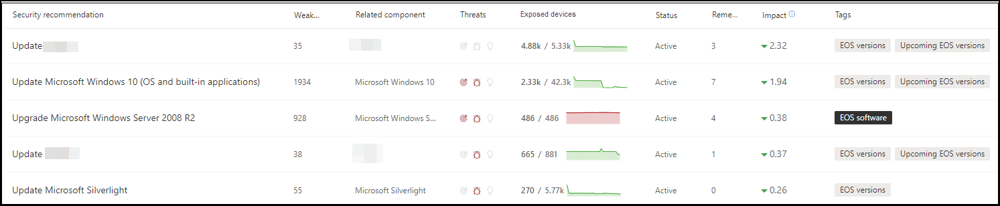
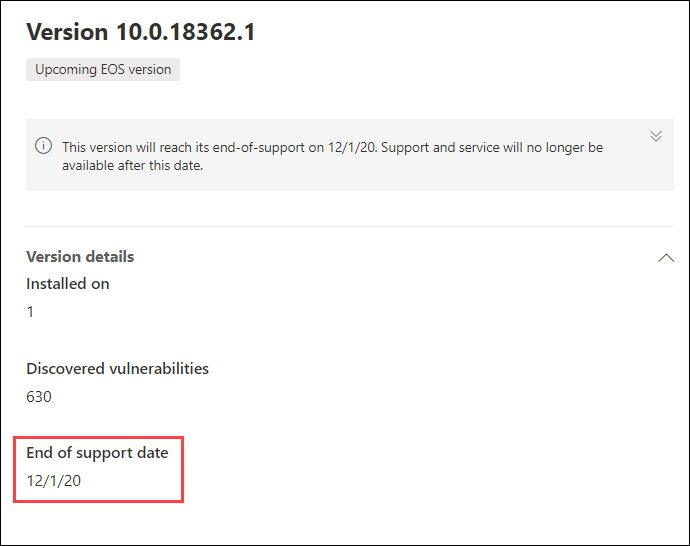

# Planen von Software- und Softwareversionen am Ende der Unterstützung mit Bedrohungs- und SicherheitsrisikomanagementPlan for end-of-support software and software versions with threat and vulnerability management

[!INCLUDE [Microsoft 365 Defender rebranding](../../includes/microsoft-defender.md)]

**Gilt für:****Applies to:**

- [Microsoft Defender für EndpunktMicrosoft Defender for Endpoint](https://go.microsoft.com/fwlink/?linkid=2154037)
- [Bedrohung und SicherheitsrisikomanagementThreat and vulnerability management](next-gen-threat-and-vuln-mgt.md)
- [Microsoft 365 DefenderMicrosoft 365 Defender](https://go.microsoft.com/fwlink/?linkid=2118804)

>Möchten Sie Microsoft Defender for Endpoint erleben?Want to experience Microsoft Defender for Endpoint? [Registrieren Sie sich für eine kostenlose Testversion.Sign up for a free trial.](https://www.microsoft.com/microsoft-365/windows/microsoft-defender-atp?ocid=docs-wdatp-portaloverview-abovefoldlink)

End-of-Support (EOS), auch als End-of-Life (EOL) bezeichnet, bedeutet für Software- oder Softwareversionen, dass sie nicht mehr unterstützt oder in Betrieb sind und keine Sicherheitsupdates erhalten.End-of-support (EOS), otherwise known as end-of-life (EOL), for software or software versions means that they will no longer be supported or serviced, and will not receive security updates. Wenn Sie Software- oder Softwareversionen mit beendeter Unterstützung verwenden, setzen Sie Ihre Organisation Sicherheitsrisiken, rechtlichen und finanziellen Risiken aus.When you use software or software versions with ended support, you're exposing your organization to security vulnerabilities, legal, and financial risks.

Es ist wichtig, dass Sicherheits- und IT-Administratoren zusammenarbeiten und sicherstellen, dass das Softwareinventar der Organisation für optimale Ergebnisse, Compliance und ein gesundes Netzwerkökosystem konfiguriert ist.It's crucial for Security and IT Administrators to work together and ensure that the organization's software inventory is configured for optimal results, compliance, and a healthy network ecosystem. Sie sollten die Optionen zum Entfernen oder Ersetzen von Apps untersuchen, die das Ende der Support- und Updateversionen erreicht haben, die nicht mehr unterstützt werden.They should examine the options to remove or replace apps that have reached end-of-support and update versions that are no longer supported. Es ist am besten, einen  Plan vor dem Ende der Supporttermine zu erstellen und zu implementieren.It's best to create and implement a plan **before** the end of support dates.

## Suchen nach Software- oder Softwareversionen, die nicht mehr unterstützt werdenFind software or software versions that are no longer supported

1. Navigieren Sie Bedrohungs- und Sicherheitsrisikomanagement Menü zu [**Sicherheitsempfehlungen**](tvm-security-recommendation.md).From the threat and vulnerability management menu, navigate to [**Security recommendations**](tvm-security-recommendation.md).
2. Wechseln Sie zum **Bereich Filter,** und suchen Sie nach dem Abschnitt Tags.Go to the **Filters** panel and look for the tags section. Wählen Sie eine oder mehrere der EOS-Tagoptionen aus.Select one or more of the EOS tag options. Wenden Sie **dann an**.Then **Apply**.

    

3. Sie sehen eine Liste der Empfehlungen im Zusammenhang mit Software mit beendeter Unterstützung, Softwareversionen, die ende des Support sind, oder Versionen mit bevorstehendem Ende des Support.You'll see a list of recommendations related to software with ended support, software versions that are end of support, or versions with upcoming end of support. Diese Tags sind auch auf der Seite [softwareinventar](tvm-software-inventory.md) sichtbar.These tags are also visible in the [software inventory](tvm-software-inventory.md) page.

    

## Liste der Versionen und DatumsangabenList of versions and dates

Führen Sie die folgenden Schritte aus, um eine Liste der Versionen anzeigen zu können, die das Ende des Supportendes erreicht haben oder bald enden oder den Support bald beenden und diese Datumsangaben enthalten:To view a list of versions that have reached end of support, or end or support soon, and those dates, follow the below steps:

1. Eine Meldung wird im Flyout für Sicherheitsempfehlungen für Software mit Versionen angezeigt, die das Ende der Unterstützung erreicht haben oder bald das Ende des Support erreichen.A message will appear in the security recommendation flyout for software with versions that have reached end of support, or will reach end of support soon.

    

2. Wählen Sie **den Link zur** Versionsverteilung aus, um zur Software-Drilldownseite zu wechseln.Select the **version distribution** link to go to the software drill-down page. Dort sehen Sie eine gefilterte Liste von Versionen mit Tags, die sie als Ende des Support oder bevorstehendes Ende des Support identifizieren.There, you can see a filtered list of versions with tags identifying them as end of support, or upcoming end of support.

    

3. Wählen Sie eine der Versionen in der zu öffnende Tabelle aus.Select one of the versions in the table to open. Beispiel: Version 10.0.18362.1.For example, version 10.0.18362.1. Ein Flyout wird mit dem Ende des Supportdatums angezeigt.A flyout will appear with the end of support date.

    

Nachdem Sie ermittelt haben, welche Software- und Softwareversionen aufgrund ihres Status am Ende des Supportstatus anfällig sind, müssen Sie entscheiden, ob Sie sie aus Ihrer Organisation aktualisieren oder entfernen möchten.Once you identify which software and software versions are vulnerable due to their end-of-support status, you must decide whether to update or remove them from your organization. Dadurch wird die Gefährdung Ihrer Organisation durch Sicherheitsrisiken und erweiterte dauerhafte Bedrohungen gesenkt.Doing so will lower your organizations exposure to vulnerabilities and advanced persistent threats.

## Verwandte ThemenRelated topics

- [Übersicht über Bedrohungen Sicherheitsrisikomanagement BedrohungenThreat and vulnerability management overview](next-gen-threat-and-vuln-mgt.md)
- [SicherheitsempfehlungenSecurity recommendations](tvm-security-recommendation.md)
- [SoftwarebestandSoftware inventory](tvm-software-inventory.md)
