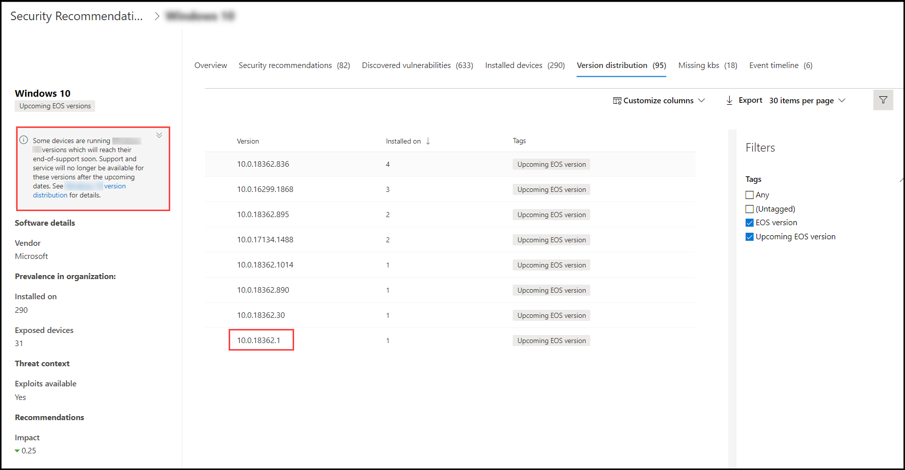

# Planen von Software- und Softwareversionen am Ende der Unterstützung mit Bedrohungs- und Sicherheitsrisikomanagement

[!INCLUDE [Microsoft 365 Defender rebranding](../../includes/microsoft-defender.md)]

**Gilt für:**

- [Microsoft Defender für Endpunkt](https://go.microsoft.com/fwlink/?linkid=2154037)
- [Bedrohung und Sicherheitsrisikomanagement](next-gen-threat-and-vuln-mgt.md)
- [Microsoft 365 Defender](https://go.microsoft.com/fwlink/?linkid=2118804)

>Möchten Sie Microsoft Defender for Endpoint erleben? [Registrieren Sie sich für eine kostenlose Testversion.](https://www.microsoft.com/microsoft-365/windows/microsoft-defender-atp?ocid=docs-wdatp-portaloverview-abovefoldlink)

End-of-Support (EOS), auch als End-of-Life (EOL) bezeichnet, bedeutet für Software- oder Softwareversionen, dass sie nicht mehr unterstützt oder in Betrieb sind und keine Sicherheitsupdates erhalten. Wenn Sie Software- oder Softwareversionen mit beendeter Unterstützung verwenden, setzen Sie Ihre Organisation Sicherheitsrisiken, rechtlichen und finanziellen Risiken aus.

Es ist wichtig, dass Sicherheits- und IT-Administratoren zusammenarbeiten und sicherstellen, dass das Softwareinventar der Organisation für optimale Ergebnisse, Compliance und ein gesundes Netzwerkökosystem konfiguriert ist. Sie sollten die Optionen zum Entfernen oder Ersetzen von Apps untersuchen, die das Ende der Support- und Updateversionen erreicht haben, die nicht mehr unterstützt werden. Es ist am besten, einen  Plan vor dem Ende der Supporttermine zu erstellen und zu implementieren.

## Suchen nach Software- oder Softwareversionen, die nicht mehr unterstützt werden

1. Navigieren Sie Bedrohungs- und Sicherheitsrisikomanagement Menü zu [**Sicherheitsempfehlungen**](tvm-security-recommendation.md).
2. Wechseln Sie zum **Bereich Filter,** und suchen Sie nach dem Abschnitt Tags. Wählen Sie eine oder mehrere der EOS-Tagoptionen aus. Wenden Sie **dann an**.

    

3. Sie sehen eine Liste der Empfehlungen im Zusammenhang mit Software mit beendeter Unterstützung, Softwareversionen, die ende des Support sind, oder Versionen mit bevorstehendem Ende des Support. Diese Tags sind auch auf der Seite [softwareinventar](tvm-software-inventory.md) sichtbar.

    

## Liste der Versionen und Datumsangaben

Führen Sie die folgenden Schritte aus, um eine Liste der Versionen anzeigen zu können, die das Ende des Supportendes erreicht haben oder bald enden oder den Support bald beenden und diese Datumsangaben enthalten:

1. Eine Meldung wird im Flyout für Sicherheitsempfehlungen für Software mit Versionen angezeigt, die das Ende der Unterstützung erreicht haben oder bald das Ende des Support erreichen.

    

2. Wählen Sie **den Link zur** Versionsverteilung aus, um zur Software-Drilldownseite zu wechseln. Dort sehen Sie eine gefilterte Liste von Versionen mit Tags, die sie als Ende des Support oder bevorstehendes Ende des Support identifizieren.

    

3. Wählen Sie eine der Versionen in der zu öffnende Tabelle aus. Beispiel: Version 10.0.18362.1. Ein Flyout wird mit dem Ende des Supportdatums angezeigt.

    

Nachdem Sie ermittelt haben, welche Software- und Softwareversionen aufgrund ihres Status am Ende des Supportstatus anfällig sind, müssen Sie entscheiden, ob Sie sie aus Ihrer Organisation aktualisieren oder entfernen möchten. Dadurch wird die Gefährdung Ihrer Organisation durch Sicherheitsrisiken und erweiterte dauerhafte Bedrohungen gesenkt.

## Verwandte Themen

- [Übersicht über Bedrohungen Sicherheitsrisikomanagement Bedrohungen](next-gen-threat-and-vuln-mgt.md)
- [Sicherheitsempfehlungen](tvm-security-recommendation.md)
- [Softwarebestand](tvm-software-inventory.md)
