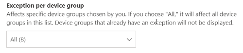
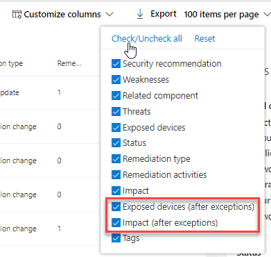

# Erstellen und Anzeigen von Ausnahmen für Sicherheitsempfehlungen – Bedrohungs- und Sicherheitsrisikoverwaltung

[!INCLUDE [Microsoft 365 Defender rebranding](../../includes/microsoft-defender.md)]

**Gilt für:**

- [Microsoft Defender für Endpunkt](https://go.microsoft.com/fwlink/?linkid=2154037)
- [Bedrohungs- und Sicherheitsrisikoverwaltung](next-gen-threat-and-vuln-mgt.md)
- [Microsoft 365 Defender](https://go.microsoft.com/fwlink/?linkid=2118804)

>Möchten Sie Microsoft Defender for Endpoint erleben? [Registrieren Sie sich für eine kostenlose Testversion.](https://www.microsoft.com/microsoft-365/windows/microsoft-defender-atp?ocid=docs-wdatp-portaloverview-abovefoldlink)

Als Alternative zu einer Korrekturanforderung, wenn eine Empfehlung derzeit nicht relevant ist, können Sie Ausnahmen für Empfehlungen erstellen. Wenn Ihre Organisation über Gerätegruppen verfügt, können Sie die Ausnahme auf bestimmte Gerätegruppen austeilen. Ausnahmen können entweder für ausgewählte Gerätegruppen oder für alle früheren und aktuellen Gerätegruppen erstellt werden.  

Wenn eine Ausnahme für eine Empfehlung erstellt wird, ist die Empfehlung erst am Ende der Ausnahmedauer aktiv. Der Empfehlungsstatus wird in **Vollständige Ausnahme** oder **Teilausnahme** (nach Gerätegruppe) geändert.

## Berechtigungen

Nur Benutzer mit Berechtigungen zur Behandlung von Ausnahmen können Ausnahmen verwalten (einschließlich Erstellen oder Abbrechen). [Erfahren Sie mehr über RBAC-Rollen](user-roles.md).

## Erstellen einer Ausnahme

Wählen Sie eine Sicherheitsempfehlung aus, für die Sie eine Ausnahme erstellen möchten, und wählen Sie dann Ausnahmeoptionen **aus,** und füllen Sie das Formular aus.  

### Ausnahme nach Gerätegruppe

Wenden Sie die Ausnahme auf alle aktuellen Gerätegruppen an, oder wählen Sie bestimmte Gerätegruppen aus. Zukünftige Gerätegruppen werden nicht in die Ausnahme einbezogen. Gerätegruppen, die bereits über eine Ausnahme verfügen, werden nicht in der Liste angezeigt. Wenn Sie nur bestimmte Gerätegruppen auswählen, wird der Empfehlungsstatus von "aktiv" in "Teilausnahme" geändert. Der Status wird in "vollständige Ausnahme" geändert, wenn Sie alle Gerätegruppen auswählen.

#### Gefilterte Ansichten

Wenn Sie nach Gerätegruppe auf einer der Bedrohungs- und Sicherheitsrisikoverwaltungsseiten gefiltert haben, werden nur ihre gefilterten Gerätegruppen als Optionen angezeigt.

Dies ist die Schaltfläche zum Filtern nach Gerätegruppe auf einer der Seiten zur Verwaltung von Bedrohungen und Sicherheitslücken: 

Ausnahmeansicht mit gefilterten Gerätegruppen:

#### Große Anzahl von Gerätegruppen

Wenn Ihre Organisation über mehr als 20 Gerätegruppen verfügt, wählen Sie **Neben** der gefilterten Gerätegruppe bearbeiten aus.

Es wird ein Flyout angezeigt, in dem Sie Gerätegruppen suchen und auswählen können, die sie enthalten möchten. Aktivieren Sie das Häkchensymbol unter Suchen, um alle zu überprüfen/deaktivieren.

### Globale Ausnahmen

Wenn Sie über globale Administratorberechtigungen verfügen, können Sie eine globale Ausnahme erstellen und abbrechen. Sie wirkt **sich auf** alle aktuellen und zukünftigen Gerätegruppen in Ihrer Organisation aus, und nur ein Benutzer mit einer ähnlichen Berechtigung kann sie ändern. Der Empfehlungsstatus wird von "aktiv" in "vollständige Ausnahme" geändert.

Einige Dinge, die Sie beachten sollten:

- Wenn eine Empfehlung einer globalen Ausnahme unterläuft, werden neu erstellte Ausnahmen für Gerätegruppen angehalten, bis die globale Ausnahme abgelaufen oder abgebrochen wurde. Danach werden die ausnahmen für neue Gerätegruppen wirksam, bis sie ablaufen.
- Wenn eine Empfehlung bereits Ausnahmen für bestimmte Gerätegruppen hat und eine globale Ausnahme erstellt wird, wird die Gerätegruppenausnahme angehalten, bis sie abläuft oder die globale Ausnahme abgebrochen wird, bevor sie abläuft.

### Begründung

Wählen Sie Ihre Begründung für die Ausnahme aus, die Sie erstellen müssen, anstatt die in Frage gestellte Sicherheitsempfehlung zu löschen. Füllen Sie den Begründungskontext aus, und legen Sie dann die Ausnahmedauer ein.

In der folgenden Liste werden die Begründungen für die Ausnahmeoptionen aufgeführt:

- **Drittanbieterkontrolle** – Ein Produkt oder eine Software eines Drittanbieters hat diese Empfehlung bereits adressiert : Wenn Sie diesen Begründungstyp auswählen, wird Ihre Belichtungsnote gesenkt und Ihre sichere Bewertung erhöht, da Ihr Risiko reduziert wird.
- **Alternative Gegenmaßnahmen** – Ein internes Tool hat diese Empfehlung bereits adressiert: Wenn Sie diesen Begründungstyp auswählen, wird Ihre Risikopunktzahl gesenkt und Ihre sichere Bewertung erhöht, da Ihr Risiko reduziert wird.
- **Risiko akzeptiert** – Birgt ein geringes Risiko und/oder die Implementierung der Empfehlung ist zu teuer
- **Geplante Korrektur (Nachfrist)** – Bereits geplant, aber wartet auf Ausführung oder Autorisierung

## Anzeigen aller Ausnahmen

Navigieren Sie **auf** der Seite **Korrektur** zur Registerkarte Ausnahmen. Sie können nach Begründung, Typ und Status filtern.

 Wählen Sie eine Ausnahme aus, um ein Flyout mit weiteren Details zu öffnen. Ausnahmen pro Gerätegruppe enthalten eine Liste aller Gerätegruppen, die die Ausnahme behandelt, die Sie exportieren können. Sie können auch die zugehörige Empfehlung anzeigen oder die Ausnahme abbrechen.

## Abbrechen einer Ausnahme

Zum Abbrechen einer Ausnahme navigieren Sie auf der Seite Korrektur zur **Registerkarte** **Ausnahmen.** Wählen Sie die Ausnahme aus.

Wählen Sie zum Abbrechen der Ausnahme für alle Gerätegruppen oder für eine globale Ausnahme die Schaltfläche **Abbrechen für alle Gerätegruppen** aus. Ausnahmen können nur für Gerätegruppen abgebrochen werden, für die Sie über Berechtigungen verfügen.

### Abbrechen der Ausnahme für eine bestimmte Gerätegruppe

Wählen Sie die bestimmte Gerätegruppe aus, um die Ausnahme für sie abbricht. Für die Gerätegruppe wird ein Flyout angezeigt, und Sie können Die Ausnahme **abbrechen auswählen.**

## Anzeigen von Auswirkungen nach der Anwendung von Ausnahmen

Wählen Sie auf der Seite Sicherheitsempfehlungen **spalten** anpassen aus, und aktivieren Sie die Kontrollkästchen für Verfügbar gemachte Geräte **(nach Ausnahmen)** und **Auswirkung (nach Ausnahmen).**

In der Spalte verfügbar gemachte Geräte (nach Ausnahmen) werden die verbleibenden Geräte angezeigt, die nach der Anwendung von Ausnahmen weiterhin Sicherheitsrisiken ausgesetzt sind. Zu den Ausnahmen, die sich auf die Risikoexposition auswirken, gehören "Kontrolle durch Dritte" und "alternative Gegenmaßnahmen". Andere Begründungen verringern die Belichtung eines Geräts nicht und gelten weiterhin als verfügbar.

Die Auswirkung (nach Ausnahmen) zeigt die verbleibenden Auswirkungen auf die Bewertung der Belichtung oder die sichere Bewertung, nachdem Ausnahmen angewendet wurden. Ausnahmegrundwerte, die sich auf die Bewertungen auswirken, sind "Drittanbietersteuerung" und "alternative Gegenmaßnahmen". Andere Begründungen verringern die Belichtung eines Geräts nicht, sodass sich die Belichtungs- und Sicherheitspunktzahl nicht ändert.

## Verwandte Themen

- [Übersicht über die Verwaltung von Bedrohungen und Sicherheitslücken](next-gen-threat-and-vuln-mgt.md)
- [Sicherheitsrisiken korrigieren](tvm-remediation.md)
- [Sicherheitsempfehlungen](tvm-security-recommendation.md)
- [Gefährdungsscore](tvm-exposure-score.md)
- [Microsoft-Sicherheitsbewertung für Geräte](tvm-microsoft-secure-score-devices.md)
