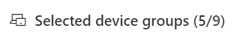

# Erstellen und Anzeigen von Ausnahmen für Sicherheitsempfehlungen – Bedrohungs- und SicherheitsrisikomanagementCreate and view exceptions for security recommendations - threat and vulnerability management

[!INCLUDE [Microsoft 365 Defender rebranding](../../includes/microsoft-defender.md)]

**Gilt für:****Applies to:**

- [Microsoft Defender für EndpunktMicrosoft Defender for Endpoint](https://go.microsoft.com/fwlink/?linkid=2154037)
- [Bedrohung und SicherheitsrisikomanagementThreat and vulnerability management](next-gen-threat-and-vuln-mgt.md)
- [Microsoft 365 DefenderMicrosoft 365 Defender](https://go.microsoft.com/fwlink/?linkid=2118804)

>Möchten Sie Microsoft Defender for Endpoint erleben?Want to experience Microsoft Defender for Endpoint? [Registrieren Sie sich für eine kostenlose Testversion.Sign up for a free trial.](https://www.microsoft.com/microsoft-365/windows/microsoft-defender-atp?ocid=docs-wdatp-portaloverview-abovefoldlink)

Als Alternative zu einer Korrekturanforderung, wenn eine Empfehlung derzeit nicht relevant ist, können Sie Ausnahmen für Empfehlungen erstellen.As an alternative to a remediation request when a recommendation is not relevant at the moment, you can create exceptions for recommendations. Wenn Ihre Organisation über Gerätegruppen verfügt, können Sie die Ausnahme auf bestimmte Gerätegruppen austeilen.If your organization has device groups, you will be able to scope the exception to specific device groups. Ausnahmen können entweder für ausgewählte Gerätegruppen oder für alle früheren und aktuellen Gerätegruppen erstellt werden.Exceptions can either be created for selected device groups, or for all device groups past and present.  

Wenn eine Ausnahme für eine Empfehlung erstellt wird, ist die Empfehlung erst am Ende der Ausnahmedauer aktiv.When an exception is created for a recommendation, the recommendation will not be active until the end of the exception duration. Der Empfehlungsstatus wird in **Vollständige Ausnahme** oder **Teilausnahme** (nach Gerätegruppe) geändert.The recommendation state will change to **Full exception** or **Partial exception** (by device group).

## BerechtigungenPermissions

Nur Benutzer mit Berechtigungen zur Behandlung von Ausnahmen können Ausnahmen verwalten (einschließlich Erstellen oder Abbrechen).Only users with “exceptions handling” permissions can manage exceptions (including creating or canceling). [Erfahren Sie mehr über RBAC-Rollen](user-roles.md).[Learn more about RBAC roles](user-roles.md).

## Erstellen einer AusnahmeCreate an exception

Wählen Sie eine Sicherheitsempfehlung aus, für die Sie eine Ausnahme erstellen möchten, und wählen Sie dann Ausnahmeoptionen **aus,** und füllen Sie das Formular aus.Select a security recommendation you would like create an exception for, and then select **Exception options** and fill out the form.  

### Ausnahme nach GerätegruppeException by device group

Wenden Sie die Ausnahme auf alle aktuellen Gerätegruppen an, oder wählen Sie bestimmte Gerätegruppen aus.Apply the exception to all current device groups or choose specific device groups. Zukünftige Gerätegruppen werden nicht in die Ausnahme einbezogen.Future device groups won't be included in the exception. Gerätegruppen, die bereits über eine Ausnahme verfügen, werden nicht in der Liste angezeigt.Device groups that already have an exception will not be displayed in the list. Wenn Sie nur bestimmte Gerätegruppen auswählen, wird der Empfehlungsstatus von "aktiv" in "Teilausnahme" geändert.If you only select certain device groups, the recommendation state will change from “active” to “partial exception.” Der Status wird in "vollständige Ausnahme" geändert, wenn Sie alle Gerätegruppen auswählen.The state will change to “full exception” if you select all the device groups.

#### Gefilterte AnsichtenFiltered views

Wenn Sie auf einer der Bedrohungs- und Sicherheitsrisikomanagement nach Gerätegruppe gefiltert haben, werden nur die gefilterten Gerätegruppen als Optionen angezeigt.If you have filtered by device group on any of the threat and vulnerability management pages, only your filtered device groups will appear as options.

Dies ist die Schaltfläche zum Filtern nach Gerätegruppe auf einer der Bedrohungs- und Sicherheitsrisikomanagement Seiten:This is the button to filter by device group on any of the threat and vulnerability management pages: 

Ausnahmeansicht mit gefilterten Gerätegruppen:Exception view with filtered device groups:

#### Große Anzahl von GerätegruppenLarge number of device groups

Wenn Ihre Organisation über mehr als 20 Gerätegruppen verfügt, wählen Sie **Neben** der gefilterten Gerätegruppe bearbeiten aus.If your organization has more than 20 device groups, select **Edit** next to the filtered device group option.

Es wird ein Flyout angezeigt, in dem Sie Gerätegruppen suchen und auswählen können, die sie enthalten möchten.A flyout will appear where you can search and choose device groups you want included. Aktivieren Sie das Häkchensymbol unter Suchen, um alle zu überprüfen/deaktivieren.Select the check mark icon below Search to check/uncheck all.

### Globale AusnahmenGlobal exceptions

Wenn Sie über globale Administratorberechtigungen verfügen, können Sie eine globale Ausnahme erstellen und abbrechen.If you have global administrator permissions, you will be able to create and cancel a global exception. Sie wirkt **sich auf** alle aktuellen und zukünftigen Gerätegruppen in Ihrer Organisation aus, und nur ein Benutzer mit einer ähnlichen Berechtigung kann sie ändern.It affects **all** current and future device groups in your organization, and only a user with similar permission would be able to change it. Der Empfehlungsstatus wird von "aktiv" in "vollständige Ausnahme" geändert.The recommendation state will change from “active” to “full exception.”

Einige Dinge, die Sie beachten sollten:Some things to keep in mind:

- Wenn eine Empfehlung einer globalen Ausnahme unterläuft, werden neu erstellte Ausnahmen für Gerätegruppen angehalten, bis die globale Ausnahme abgelaufen oder abgebrochen wurde.If a recommendation is under global exception, then newly created exceptions for device groups will be suspended until the global exception has expired or been cancelled. Danach werden die ausnahmen für neue Gerätegruppen wirksam, bis sie ablaufen.After that point, the new device group exceptions will go into effect until they expire.
- Wenn eine Empfehlung bereits Ausnahmen für bestimmte Gerätegruppen hat und eine globale Ausnahme erstellt wird, wird die Gerätegruppenausnahme angehalten, bis sie abläuft oder die globale Ausnahme abgebrochen wird, bevor sie abläuft.If a recommendation already has exceptions for specific device groups and a global exception is created, then the device group exception will be suspended until it expires or the global exception is cancelled before it expires.

### BegründungJustification

Wählen Sie Ihre Begründung für die Ausnahme aus, die Sie erstellen müssen, anstatt die in Frage gestellte Sicherheitsempfehlung zu löschen.Select your justification for the exception you need to file instead of remediating the security recommendation in question. Füllen Sie den Begründungskontext aus, und legen Sie dann die Ausnahmedauer ein.Fill out the justification context, then set the exception duration.

In der folgenden Liste werden die Begründungen für die Ausnahmeoptionen aufgeführt:The following list details the justifications behind the exception options:

- **Drittanbieterkontrolle** – Ein Produkt oder eine Software eines Drittanbieters hat diese Empfehlung bereits adressiert : Wenn Sie diesen Begründungstyp auswählen, wird Ihre Belichtungsnote gesenkt und Ihre sichere Bewertung erhöht, da Ihr Risiko reduziert wird.**Third party control** - A third party product or software already addresses this recommendation       - Choosing this justification type will lower your exposure score and increase your secure score because your risk is reduced
- **Alternative Gegenmaßnahmen** – Ein internes Tool hat diese Empfehlung bereits adressiert: Wenn Sie diesen Begründungstyp auswählen, wird Ihre Risikopunktzahl gesenkt und Ihre sichere Bewertung erhöht, da Ihr Risiko reduziert wird.**Alternate mitigation** - An internal tool already addresses this recommendation       - Choosing this justification type will lower your exposure score and increase your secure score because your risk is reduced
- **Risiko akzeptiert** – Birgt ein geringes Risiko und/oder die Implementierung der Empfehlung ist zu teuer**Risk accepted** - Poses low risk and/or implementing the recommendation is too expensive
- **Geplante Korrektur (Nachfrist)** – Bereits geplant, aber wartet auf Ausführung oder Autorisierung**Planned remediation (grace)** - Already planned but is awaiting execution or authorization

## Anzeigen aller AusnahmenView all exceptions

Navigieren Sie **auf** der Seite **Korrektur** zur Registerkarte Ausnahmen.Navigate to the **Exceptions** tab in the **Remediation** page. Sie können nach Begründung, Typ und Status filtern.You can filter by justification, type, and status.

 Wählen Sie eine Ausnahme aus, um ein Flyout mit weiteren Details zu öffnen.Select an exception to open a flyout with more details. Ausnahmen pro Gerätegruppe enthalten eine Liste aller Gerätegruppen, die die Ausnahme behandelt, die Sie exportieren können.Exceptions per devices group will have a list of every device group the exception covers, which you can export. Sie können auch die zugehörige Empfehlung anzeigen oder die Ausnahme abbrechen.You can also view the related recommendation or cancel the exception.

## Abbrechen einer AusnahmeHow to cancel an exception

Zum Abbrechen einer Ausnahme navigieren Sie auf der Seite Korrektur zur **Registerkarte** **Ausnahmen.**To cancel an exception, navigate to the **Exceptions** tab in the **Remediation** page. Wählen Sie die Ausnahme aus.Select the exception.

Wählen Sie zum Abbrechen der Ausnahme für alle Gerätegruppen oder für eine globale Ausnahme die Schaltfläche **Abbrechen für alle Gerätegruppen** aus.To cancel the exception for all device groups or for a global exception, select the **Cancel exception for all device groups** button. Ausnahmen können nur für Gerätegruppen abgebrochen werden, für die Sie über Berechtigungen verfügen.You will only be able to cancel exceptions for device groups you have permissions for.

### Abbrechen der Ausnahme für eine bestimmte GerätegruppeCancel the exception for a specific device group

Wählen Sie die bestimmte Gerätegruppe aus, um die Ausnahme für sie abbricht.Select the specific device group to cancel the exception for it. Für die Gerätegruppe wird ein Flyout angezeigt, und Sie können Die Ausnahme **abbrechen auswählen.**A flyout will appear for the device group, and you can select **Cancel exception**.

## Anzeigen von Auswirkungen nach der Anwendung von AusnahmenView impact after exceptions are applied

Wählen Sie auf Empfehlungen Seite  Sicherheit Spalten anpassen aus, und aktivieren Sie die Kontrollkästchen für Verfügbar gemachte Geräte **(nach Ausnahmen)** und **Auswirkung (nach Ausnahmen).**In the Security Recommendations page, select **Customize columns** and check the boxes for **Exposed devices (after exceptions)** and **Impact (after exceptions)**.

In der Spalte verfügbar gemachte Geräte (nach Ausnahmen) werden die verbleibenden Geräte angezeigt, die nach der Anwendung von Ausnahmen weiterhin Sicherheitsrisiken ausgesetzt sind.The exposed devices (after exceptions) column shows the remaining devices that are still exposed to vulnerabilities after exceptions are applied. Zu den Ausnahmen, die sich auf die Risikoexposition auswirken, gehören "Kontrolle durch Dritte" und "alternative Gegenmaßnahmen".Exception justifications that affect the exposure include ‘third party control’ and ‘alternate mitigation’. Andere Begründungen verringern die Belichtung eines Geräts nicht und gelten weiterhin als verfügbar.Other justifications do not reduce the exposure of a device, and they are still considered exposed.

Die Auswirkung (nach Ausnahmen) zeigt die verbleibenden Auswirkungen auf die Bewertung der Belichtung oder die sichere Bewertung, nachdem Ausnahmen angewendet wurden.The impact (after exceptions) shows remaining impact to exposure score or secure score after exceptions are applied. Ausnahmegrundwerte, die sich auf die Bewertungen auswirken, sind "Drittanbietersteuerung" und "alternative Gegenmaßnahmen".Exception justifications that affect the scores include ‘third party control’ and ‘alternate mitigation.’ Andere Begründungen verringern die Belichtung eines Geräts nicht, sodass sich die Belichtungs- und Sicherheitspunktzahl nicht ändert.Other justifications do not reduce the exposure of a device, and so the exposure score and secure score do not change.

## Verwandte ThemenRelated topics

- [Übersicht über Bedrohungen Sicherheitsrisikomanagement BedrohungenThreat and vulnerability management overview](next-gen-threat-and-vuln-mgt.md)
- [Sicherheitsrisiken korrigierenRemediate vulnerabilities](tvm-remediation.md)
- [SicherheitsempfehlungenSecurity recommendations](tvm-security-recommendation.md)
- [GefährdungsscoreExposure score](tvm-exposure-score.md)
- [Microsoft-Sicherheitsbewertung für GeräteMicrosoft Secure Score for Devices](tvm-microsoft-secure-score-devices.md)
