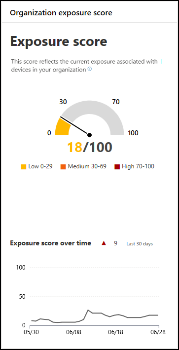

# Belichtungsergebnis – Bedrohungs- und Sicherheitsrisikoverwaltung

[!INCLUDE [Microsoft 365 Defender rebranding](../../includes/microsoft-defender.md)]

**Gilt für:**

- [Microsoft Defender für Endpunkt](https://go.microsoft.com/fwlink/?linkid=2154037)
- [Bedrohungs- und Sicherheitsrisikoverwaltung](next-gen-threat-and-vuln-mgt.md)
- [Microsoft 365 Defender](https://go.microsoft.com/fwlink/?linkid=2118804)

>Möchten Sie Microsoft Defender for Endpoint erleben? [Registrieren Sie sich für eine kostenlose Testversion.](https://www.microsoft.com/microsoft-365/windows/microsoft-defender-atp?ocid=docs-wdatp-portaloverview-abovefoldlink)

Ihr Belichtungsergebnis wird im Dashboard zur Verwaltung von Bedrohungen und [Sicherheitsrisiken](tvm-dashboard-insights.md) im Microsoft Defender Security Center angezeigt. Es spiegelt wider, wie anfällig Ihre Organisation für Cybersicherheitsbedrohungen ist. Niedrige Belichtungszahl bedeutet, dass Ihre Geräte weniger anfällig für die Nutzung sind.

- Schnelles Verständnis und Identifizieren von hochrangigen Informationen zum Sicherheitsstatus in Ihrer Organisation.
- Erkennen und reagieren Sie auf Bereiche, die eine Untersuchung oder Aktion erfordern, um den aktuellen Status zu verbessern.
- Kommunizieren Sie mit Kollegen und der Verwaltung über die Auswirkungen von Sicherheitsbemühungen.

Mit der Karte erhalten Sie eine hohe Ansicht des Belichtungsergebnistrends im Laufe der Zeit. Alle Spitzen im Diagramm geben Ihnen einen visuellen Hinweis auf eine hohe Bedrohung durch Cybersicherheit, die Sie weiter untersuchen können.

## Funktionsweise

Die Belichtungsnote ist in die folgenden Ebenen aufgeschlüsselt:

- 0–29: Niedrige Belichtungszahl
- 30–69: mittlere Belichtungszahl
- 70–100: Hohe Belichtungszahl

Sie können die Probleme basierend auf  priorisierten Sicherheitsempfehlungen beheben, um die Belichtungszahl zu reduzieren. Jede Software hat Schwächen, die in Empfehlungen umgewandelt und basierend auf dem Risiko für die Organisation priorisiert werden.

## Verringern Der Bedrohungs- und Sicherheitsrisikorisiko

Verringern Sie Ihre Bedrohungs- und Sicherheitsrisikorisiken, indem Sie [Sicherheitsempfehlungen enfeinen.](tvm-security-recommendation.md) Machen Sie die größten Auswirkungen auf Ihre Belichtungsergebnis, indem Sie die wichtigsten Sicherheitsempfehlungen, die im Dashboard für die Bedrohungs- und Sicherheitsrisikoverwaltung [angezeigt werden können, besennen.](tvm-dashboard-insights.md)

## Verwandte Themen

- [Übersicht über die Verwaltung von Bedrohungen und Sicherheitslücken](next-gen-threat-and-vuln-mgt.md)
- [Microsoft-Sicherheitsbewertung für Geräte](tvm-microsoft-secure-score-devices.md)
- [Sicherheitsempfehlungen](tvm-security-recommendation.md)
- [Ablauf der Veranstaltung](threat-and-vuln-mgt-event-timeline.md)
