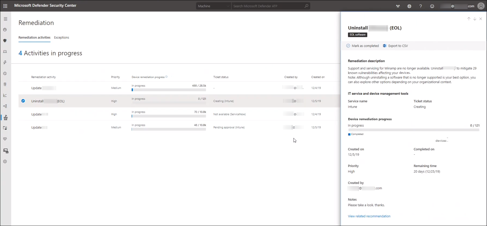

# Beheben von Sicherheitsrisiken mit Bedrohungs- und SicherheitsrisikomanagementRemediate vulnerabilities with threat and vulnerability management

[!INCLUDE [Microsoft 365 Defender rebranding](../../includes/microsoft-defender.md)]

**Gilt für:****Applies to:**
- [Microsoft Defender für EndpunktMicrosoft Defender for Endpoint](https://go.microsoft.com/fwlink/?linkid=2154037)
- [Bedrohung und SicherheitsrisikomanagementThreat and vulnerability management](next-gen-threat-and-vuln-mgt.md)
- [Microsoft 365 DefenderMicrosoft 365 Defender](https://go.microsoft.com/fwlink/?linkid=2118804)

>Möchten Sie Microsoft Defender für Endpunkt erleben?Want to experience Microsoft Defender for Endpoint? [Registrieren Sie sich für eine kostenlose Testversion.Sign up for a free trial.](https://www.microsoft.com/microsoft-365/windows/microsoft-defender-atp?ocid=docs-wdatp-portaloverview-abovefoldlink)

## Korrektur anfordernRequest remediation

Die Bedrohungs- und Sicherheitsrisikomanagement-Funktion in Microsoft Defender für Endpunkt schließt die Lücke zwischen Sicherheits- und IT-Administratoren über den Korrekturanforderungsworkflow.The threat and vulnerability management capability in Microsoft Defender for Endpoint bridges the gap between Security and IT administrators through the remediation request workflow. Sicherheitsadministratoren wie Sie können anfordern, dass der IT-Administrator eine Sicherheitslücke von den **Sicherheitsempfehlungen** an Intune behebt.Security admins like you can request for the IT Administrator to remediate a vulnerability from the **Security recommendation** pages to Intune.

### Aktivieren Microsoft Intune VerbindungEnable Microsoft Intune connection

Um diese Funktion zu verwenden, aktivieren Sie Ihre Microsoft Intune Verbindungen.To use this capability, enable your Microsoft Intune connections. Navigieren Sie im Microsoft Defender Security Center zu **Einstellungen**  >  **Allgemeinen**  >  **erweiterten Features.**In the Microsoft Defender Security Center, navigate to **Settings** > **General** > **Advanced features**. Scrollen Sie nach unten, und suchen Sie **nach Microsoft Intune Verbindung.**Scroll down and look for **Microsoft Intune connection**. Standardmäßig ist die Umschaltfläche deaktiviert.By default, the toggle is turned off. Schalten Sie die **Microsoft Intune Verbindungsschaltfläche** **ein.**Turn your **Microsoft Intune connection** toggle **On**.

**Hinweis:** Wenn Sie die Intune-Verbindung aktiviert haben, erhalten Sie eine Option zum Erstellen einer Intune-Sicherheitsaufgabe beim Erstellen einer Wartungsanforderung.**Note**: If you have the Intune connection enabled, you get an option to create an Intune security task when creating a remediation request. Diese Option wird nicht angezeigt, wenn die Verbindung nicht festgelegt ist.This option does not appear if the connection is not set.

Weitere Informationen finden Sie unter ["Verwenden von Intune zum Beheben von Von Microsoft Defender für Endpunkt identifizierten Sicherheitsrisiken".](/intune/atp-manage-vulnerabilities)See [Use Intune to remediate vulnerabilities identified by Microsoft Defender for Endpoint](/intune/atp-manage-vulnerabilities) for details.

### Schritte zur KorrekturanforderungRemediation request steps

1. Wechseln Sie im Microsoft Defender Security Center zum navigationsmenü Bedrohungs- und Sicherheitsrisikomanagement, und wählen Sie [**Sicherheitsempfehlungen aus.**](tvm-security-recommendation.md)Go to the threat and vulnerability management navigation menu in the Microsoft Defender Security Center, and select [**Security recommendations**](tvm-security-recommendation.md).

2. Wählen Sie eine Sicherheitsempfehlung aus, für die Sie eine Korrektur anfordern möchten, und wählen Sie dann **Korrekturoptionen** aus.Select a security recommendation you would like to request remediation for, and then select **Remediation options**.

3. Füllen Sie das Formular aus, einschließlich der Informationen, für die Sie eine Korrektur anfordern, zutreffender Gerätegruppen, Priorität, Fälligkeitsdatum und optionaler Hinweise.Fill out the form, including what you are requesting remediation for, applicable device groups, priority, due date, and optional notes.
    1. Wenn Sie die Korrekturoption "Achtung erforderlich" auswählen, ist die Auswahl eines Fälligkeitsdatums nicht verfügbar, da keine bestimmte Aktion vorhanden ist.If you choose the "attention required" remediation option, selecting a due date will not be available since there is no specific action.

4. Wählen Sie **"Anforderung senden"** aus.Select **Submit request**. Durch das Senden einer Korrekturanforderung wird innerhalb Bedrohungs- und Sicherheitsrisikomanagement ein Wartungsaktivitätselement erstellt, das zum Überwachen des Wartungsfortschritts für diese Empfehlung verwendet werden kann.Submitting a remediation request creates a remediation activity item within threat and vulnerability management, which can be used for monitoring the remediation progress for this recommendation. Dies löst keine Korrektur aus oder wendet keine Änderungen auf Geräte an.This will not trigger a remediation or apply any changes to devices.

5. Benachrichtigen Sie Ihren IT-Administrator über die neue Anforderung, und lassen Sie ihn sich bei Intune anmelden, um die Anforderung zu genehmigen oder abzulehnen und eine Paketbereitstellung zu starten.Notify your IT Administrator about the new request and have them log into Intune to approve or reject the request and start a package deployment.

6. Wechseln Sie zur Seite [**"Korrektur",**](tvm-remediation.md) um den Status Ihrer Korrekturanfrage anzuzeigen.Go to the [**Remediation**](tvm-remediation.md) page to view the status of your remediation request.

Wenn Sie überprüfen möchten, wie das Ticket in Intune angezeigt wird, finden Sie weitere Informationen unter [Verwenden von Intune zum Beheben von Sicherheitsrisiken,](/intune/atp-manage-vulnerabilities) die von Microsoft Defender für Endpunkt identifiziert wurden.If you want to check how the ticket shows up in Intune, see [Use Intune to remediate vulnerabilities identified by Microsoft Defender for Endpoint](/intune/atp-manage-vulnerabilities) for details.

>[!NOTE]
>Wenn Ihre Anforderung die Behebung von mehr als 10.000 Geräten umfasst, können wir nur 10.000 Geräte zur Behebung an Intune senden.If your request involves remediating more than 10,000 devices, we can only send 10,000 devices for remediation to Intune.

Nachdem die Cybersicherheitsschwächen Ihrer Organisation identifiziert und umsetzbaren [Sicherheitsempfehlungen](tvm-security-recommendation.md)zugeordnet wurden, beginnen Sie mit der Erstellung von Sicherheitsaufgaben.After your organization's cybersecurity weaknesses are identified and mapped to actionable [security recommendations](tvm-security-recommendation.md), start creating security tasks. Sie können Aufgaben durch die Integration in Microsoft Intune erstellen, in denen Wartungstickets erstellt werden.You can create tasks through the integration with Microsoft Intune where remediation tickets are created.

Verringern Sie die Gefährdung Ihrer Organisation durch Sicherheitsrisiken, und erhöhen Sie Ihre Sicherheitskonfiguration, indem Sie die Sicherheitsempfehlungen korrigieren.Lower your organization's exposure from vulnerabilities and increase your security configuration by remediating the security recommendations.

## Anzeigen Ihrer KorrekturaktivitätenView your remediation activities

Wenn Sie eine Korrekturanforderung von der Seite "Sicherheitsempfehlungen" übermitteln, wird eine Korrekturaktivität gestartet.When you submit a remediation request from the Security recommendations page, it kicks-off a remediation activity. Eine Sicherheitsaufgabe wird erstellt, die auf der Seite Bedrohungs- und Sicherheitsrisikomanagement **Korrektur** nachverfolgt werden kann, und ein Wartungsticket wird in Microsoft Intune erstellt.A security task is created that can be tracked in the threat and vulnerability management **Remediation** page, and a remediation ticket is created in Microsoft Intune.

Wenn Sie die Korrekturoption "Aufmerksamkeit erforderlich" ausgewählt haben, gibt es keine Statusanzeige, keinen Ticketstatus oder kein Fälligkeitsdatum, da keine tatsächliche Aktion vorhanden ist, die wir überwachen können.If you chose the "attention required" remediation option, there will be no progress bar, ticket status, or due date since there is no actual action we can monitor.

Sobald Sie sich auf der Seite "Korrektur" befinden, wählen Sie die Korrekturaktivität aus, die Sie anzeigen möchten.Once you are in the Remediation page, select the remediation activity that you want to view. Sie können die Korrekturschritte ausführen, den Fortschritt nachverfolgen, die zugehörige Empfehlung anzeigen, in CSV exportieren oder als abgeschlossen markieren.You can follow the remediation steps, track progress, view the related recommendation, export to CSV, or mark as complete.

>[!NOTE]
> Es gibt einen Aufbewahrungszeitraum von 180 Tagen für abgeschlossene Korrekturaktivitäten.There is a 180 day retention period for completed remediation activities. Damit die Seite "Korrektur" optimal ausgeführt wird, wird die Korrekturaktivität 6 Monate nach abschluss entfernt.To keep the Remediation page performing optimally, the remediation activity will be removed 6 months after its completion.

### Abgeschlossen nach SpalteCompleted by column

Verfolgen Sie, wer die Korrekturaktivität mit der Spalte "Abgeschlossen von" auf der Seite "Korrektur" geschlossen hat.Track who closed the remediation activity with the "Completed by" column on the Remediation page.

- **E-Mail-Adresse:** Die E-Mail-Adresse der Person, die die Aufgabe manuell abgeschlossen hat**Email address**: The email of the person who manually completed the task
- **Systembestätigung:** Die Aufgabe wurde automatisch abgeschlossen (alle Geräte behoben)**System confirmation**: The task was automatically completed (all devices remediated)
- **Nicht** verfügbar: Informationen sind nicht verfügbar, da wir nicht wissen, wie diese ältere Aufgabe abgeschlossen wurde**N/A**: Information is not available because we don't know how this older task was completed

### Wichtigste Wartungsaktivitäten im DashboardTop remediation activities in the dashboard

Zeigen Sie die **wichtigsten Wartungsaktivitäten** im [Bedrohungs- und Sicherheitsrisikomanagement-Dashboard](tvm-dashboard-insights.md)an.View **Top remediation activities** in the [threat and vulnerability management dashboard](tvm-dashboard-insights.md). Wählen Sie einen der Einträge aus, um zur Seite **"Korrektur"** zu wechseln.Select any of the entries to go to the **Remediation** page. Sie können die Korrekturaktivität als abgeschlossen markieren, nachdem das IT-Administratorteam die Aufgabe behoben hat.You can mark the remediation activity as completed after the IT admin team remediates the task.

## Verwandte ArtikelRelated articles

- [Übersicht über Bedrohungen und SicherheitsrisikomanagementThreat and vulnerability management overview](next-gen-threat-and-vuln-mgt.md)
- [DashboardDashboard](tvm-dashboard-insights.md)
- [SicherheitsempfehlungenSecurity recommendations](tvm-security-recommendation.md)