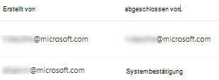

# Behebung von Sicherheitsrisiken mit Bedrohungs- und SicherheitsrisikoverwaltungRemediate vulnerabilities with threat and vulnerability management

[!INCLUDE [Microsoft 365 Defender rebranding](../../includes/microsoft-defender.md)]

**Gilt für:****Applies to:**
- [Microsoft Defender für EndpunktMicrosoft Defender for Endpoint](https://go.microsoft.com/fwlink/?linkid=2154037)
- [Bedrohungs- und SicherheitsrisikoverwaltungThreat and vulnerability management](next-gen-threat-and-vuln-mgt.md)
- [Microsoft 365 DefenderMicrosoft 365 Defender](https://go.microsoft.com/fwlink/?linkid=2118804)

>Möchten Sie Microsoft Defender for Endpoint erleben?Want to experience Microsoft Defender for Endpoint? [Registrieren Sie sich für eine kostenlose Testversion.Sign up for a free trial.](https://www.microsoft.com/microsoft-365/windows/microsoft-defender-atp?ocid=docs-wdatp-portaloverview-abovefoldlink)

## AnforderungsbehebungRequest remediation

Die Bedrohungs- und Sicherheitsrisikoverwaltungsfunktion in Microsoft Defender for Endpoint überbrückt die Lücke zwischen Sicherheits- und IT-Administratoren über den Workflow zur Behebungsanforderung.The threat and vulnerability management capability in Microsoft Defender for Endpoint bridges the gap between Security and IT administrators through the remediation request workflow. Sicherheitsadministratoren wie Sie können den IT-Administrator bitten, eine  Sicherheitslücke von den Sicherheitsempfehlungsseiten auf Intune zu be behebung.Security admins like you can request for the IT Administrator to remediate a vulnerability from the **Security recommendation** pages to Intune.

### Aktivieren der Microsoft Intune-VerbindungEnable Microsoft Intune connection

Um diese Funktion zu verwenden, aktivieren Sie Ihre Microsoft Intune-Verbindungen.To use this capability, enable your Microsoft Intune connections. Navigieren Sie im Microsoft Defender Security Center zu **Einstellungen**  >  **Allgemeine erweiterte**  >  **Features**.In the Microsoft Defender Security Center, navigate to **Settings** > **General** > **Advanced features**. Scrollen Sie nach unten, und suchen **Sie nach Microsoft Intune-Verbindung.**Scroll down and look for **Microsoft Intune connection**. Standardmäßig ist der Umschalter deaktiviert.By default, the toggle is turned off. Schalten Sie **Ihre Microsoft Intune-Verbindung** **ein.**Turn your **Microsoft Intune connection** toggle **On**.

**Hinweis:** Wenn Sie die Intune-Verbindung aktiviert haben, erhalten Sie eine Option zum Erstellen einer Intune-Sicherheitsaufgabe beim Erstellen einer Korrekturanforderung.**Note**: If you have the Intune connection enabled, you get an option to create an Intune security task when creating a remediation request. Diese Option wird nicht angezeigt, wenn die Verbindung nicht festgelegt ist.This option does not appear if the connection is not set.

Weitere [Informationen finden Sie unter Verwenden](https://docs.microsoft.com/intune/atp-manage-vulnerabilities) von Intune zur Behebung von von Microsoft Defender for Endpoint identifizierten Sicherheitsrisiken.See [Use Intune to remediate vulnerabilities identified by Microsoft Defender for Endpoint](https://docs.microsoft.com/intune/atp-manage-vulnerabilities) for details.

### Schritte zur BehebungsanforderungRemediation request steps

1. Wechseln Sie zum Navigationsmenü zur Bedrohungs- und Sicherheitsrisikoverwaltung im Microsoft Defender Security Center, und wählen Sie [**Sicherheitsempfehlungen aus.**](tvm-security-recommendation.md)Go to the threat and vulnerability management navigation menu in the Microsoft Defender Security Center, and select [**Security recommendations**](tvm-security-recommendation.md).

2. Wählen Sie eine Sicherheitsempfehlung aus, für die Sie eine Korrektur anfordern möchten, und wählen Sie dann **Korrekturoptionen aus.**Select a security recommendation you would like to request remediation for, and then select **Remediation options**.

3. Füllen Sie das Formular aus, einschließlich der Informationen, für die Sie eine Korrektur anfordern, anwendbare Gerätegruppen, Priorität, Fälligkeitsdatum und optionale Notizen.Fill out the form, including what you are requesting remediation for, applicable device groups, priority, due date, and optional notes.
    1. Wenn Sie die Option "Aufmerksamkeit erforderlich" auswählen, ist die Auswahl eines Fälligkeitsdatums nicht verfügbar, da keine bestimmte Aktion vorhanden ist.If you choose the "attention required" remediation option, selecting a due date will not be available since there is no specific action.

4. Wählen **Sie Anforderung übermitteln aus.**Select **Submit request**. Durch das Übermitteln einer Korrekturanforderung wird ein Problembehebungsaktivitätselement innerhalb der Bedrohungs- und Sicherheitsrisikoverwaltung erstellt, das zum Überwachen des Behebungsfortschritts für diese Empfehlung verwendet werden kann.Submitting a remediation request creates a remediation activity item within threat and vulnerability management, which can be used for monitoring the remediation progress for this recommendation. Dadurch wird keine Korrektur ausgelöst oder Änderungen auf Geräten angewendet.This will not trigger a remediation or apply any changes to devices.

5. Benachrichtigen Sie Ihren IT-Administrator über die neue Anforderung, und lassen Sie sie sich bei Intune anmelden, um die Anforderung zu genehmigen oder abzulehnen und eine Paketbereitstellung zu starten.Notify your IT Administrator about the new request and have them log into Intune to approve or reject the request and start a package deployment.

6. Wechseln Sie zur [**Seite Korrektur,**](tvm-remediation.md) um den Status Ihrer Behebungsanforderung zu sehen.Go to the [**Remediation**](tvm-remediation.md) page to view the status of your remediation request.

Wenn Sie überprüfen möchten, wie das Ticket in Intune angezeigt wird, finden Sie weitere Informationen unter Verwenden von Intune zur Behebung von von [Microsoft Defender for Endpoint](https://docs.microsoft.com/intune/atp-manage-vulnerabilities) identifizierten Sicherheitsrisiken.If you want to check how the ticket shows up in Intune, see [Use Intune to remediate vulnerabilities identified by Microsoft Defender for Endpoint](https://docs.microsoft.com/intune/atp-manage-vulnerabilities) for details.

>[!NOTE]
>Wenn Ihre Anforderung die Behebung von mehr als 10.000 Geräten umfasst, können wir nur 10.000 Geräte zur Behebung an Intune senden.If your request involves remediating more than 10,000 devices, we can only send 10,000 devices for remediation to Intune.

Nachdem die Cybersicherheitsschwächen Ihrer Organisation identifiziert und den Empfehlungen für umsetzbare Sicherheit zugeordnet [wurden,](tvm-security-recommendation.md)beginnen Sie mit dem Erstellen von Sicherheitsaufgaben.After your organization's cybersecurity weaknesses are identified and mapped to actionable [security recommendations](tvm-security-recommendation.md), start creating security tasks. Sie können Aufgaben über die Integration mit Microsoft Intune erstellen, in der Wartungstickets erstellt werden.You can create tasks through the integration with Microsoft Intune where remediation tickets are created.

Verringern Sie die Gefährdung Ihrer Organisation durch Sicherheitsrisiken, und erhöhen Sie Ihre Sicherheitskonfiguration, indem Sie die Sicherheitsempfehlungen abstellen.Lower your organization's exposure from vulnerabilities and increase your security configuration by remediating the security recommendations.

## Anzeigen Ihrer KorrekturaktivitätenView your remediation activities

Wenn Sie eine Behebungsanforderung von der Seite Sicherheitsempfehlungen übermitteln, wird eine Korrekturaktivität ins Jahr 2013 starten.When you submit a remediation request from the Security recommendations page, it kicks-off a remediation activity. Es wird eine Sicherheitsaufgabe erstellt, die auf der  Seite Zur Behebung von Bedrohungen und Sicherheitsrisiken nachverfolgt werden kann, und in Microsoft Intune wird ein Behebungsticket erstellt.A security task is created that can be tracked in the threat and vulnerability management **Remediation** page, and a remediation ticket is created in Microsoft Intune.

Wenn Sie die Option "Aufmerksamkeit erforderlich" ausgewählt haben, gibt es keine Statusanzeige, keinen Ticketstatus oder kein Fälligkeitsdatum, da es keine tatsächliche Aktion gibt, die wir überwachen können.If you chose the "attention required" remediation option, there will be no progress bar, ticket status, or due date since there is no actual action we can monitor.

Sobald Sie sich auf der Seite Korrektur befinden, wählen Sie die Korrekturaktivität aus, die Sie anzeigen möchten.Once you are in the Remediation page, select the remediation activity that you want to view. Sie können die Korrekturschritte ausführen, den Fortschritt nachverfolgen, die zugehörige Empfehlung anzeigen, in CSV exportieren oder als abgeschlossen markieren.You can follow the remediation steps, track progress, view the related recommendation, export to CSV, or mark as complete.

>[!NOTE]
> Es gibt einen Aufbewahrungszeitraum von 180 Tage für abgeschlossene Korrekturaktivitäten.There is a 180 day retention period for completed remediation activities. Damit die Korrekturseite optimal funktioniert, wird die Behebungsaktivität 6 Monate nach abschluss entfernt.To keep the Remediation page performing optimally, the remediation activity will be removed 6 months after its completion.

### Nach Spalte abgeschlossenCompleted by column

Verfolgen Sie, wer die Korrekturaktivität mit der Spalte "Abgeschlossen von" auf der Seite Korrektur geschlossen hat.Track who closed the remediation activity with the "Completed by" column on the Remediation page.

- **E-Mail-Adresse**: Die E-Mail der Person, die die Aufgabe manuell abgeschlossen hat**Email address**: The email of the person who manually completed the task
- **Systembestätigung**: Die Aufgabe wurde automatisch abgeschlossen (alle Geräte wurden behoben)**System confirmation**: The task was automatically completed (all devices remediated)
- **N/A**: Informationen sind nicht verfügbar, da wir nicht wissen, wie diese ältere Aufgabe abgeschlossen wurde.**N/A**: Information is not available because we don't know how this older task was completed

### Die obersten Korrekturaktivitäten im DashboardTop remediation activities in the dashboard

Sehen **Sie sich im** Dashboard für die Verwaltung von Bedrohungen und Sicherheitslücken die aktivitäten zur Behebung von Bedrohungen und [Sicherheitslücken an.](tvm-dashboard-insights.md)View **Top remediation activities** in the [threat and vulnerability management dashboard](tvm-dashboard-insights.md). Wählen Sie einen der Einträge aus, die zur Seite **Korrektur wechseln.**Select any of the entries to go to the **Remediation** page. Sie können die Korrekturaktivität als abgeschlossen markieren, nachdem das IT-Administratorteam die Aufgabe behoben hat.You can mark the remediation activity as completed after the IT admin team remediates the task.

## Verwandte ArtikelRelated articles

- [Übersicht über die Verwaltung von Bedrohungen und SicherheitslückenThreat and vulnerability management overview](next-gen-threat-and-vuln-mgt.md)
- [DashboardDashboard](tvm-dashboard-insights.md)
- [SicherheitsempfehlungenSecurity recommendations](tvm-security-recommendation.md)