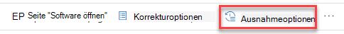
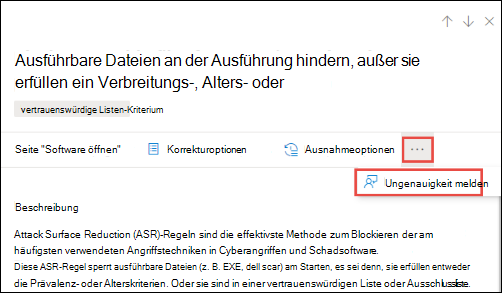

# Sicherheitsempfehlungen – Bedrohungs- und SicherheitsrisikoverwaltungSecurity recommendations - threat and vulnerability management

[!INCLUDE [Microsoft 365 Defender rebranding](../../includes/microsoft-defender.md)]

**Gilt für:****Applies to:**

- [Microsoft Defender für EndpunktMicrosoft Defender for Endpoint](https://go.microsoft.com/fwlink/?linkid=2154037)
- [Bedrohungs- und SicherheitsrisikoverwaltungThreat and vulnerability management](next-gen-threat-and-vuln-mgt.md)
- [Microsoft 365 DefenderMicrosoft 365 Defender](https://go.microsoft.com/fwlink/?linkid=2118804)

>Möchten Sie Microsoft Defender for Endpoint erleben?Want to experience Microsoft Defender for Endpoint? [Registrieren Sie sich für eine kostenlose Testversion.Sign up for a free trial.](https://www.microsoft.com/microsoft-365/windows/microsoft-defender-atp?ocid=docs-wdatp-portaloverview-abovefoldlink)

Cybersicherheitsschwächen, die in Ihrer Organisation identifiziert werden, werden aktionsrelevanten Sicherheitsempfehlungen zugeordnet und durch ihre Auswirkungen priorisiert.Cybersecurity weaknesses identified in your organization are mapped to actionable security recommendations and prioritized by their impact. Mit priorisierten Empfehlungen können Sie die Zeit zur Behebung oder Behebung von Sicherheitsrisiken und zur Verbesserung der Compliance kürzen.Prioritized recommendations help shorten the time to mitigate or remediate vulnerabilities and drive compliance.

Jede Sicherheitsempfehlung enthält Maßnahmen zur Behebung.Each security recommendation includes actionable remediation steps. Zur Unterstützung der Aufgabenverwaltung kann die Empfehlung auch mit Microsoft Intune und Microsoft Endpoint Configuration Manager gesendet werden.To help with task management, the recommendation can also be sent using Microsoft Intune and Microsoft Endpoint Configuration Manager. Wenn sich die Bedrohungslandschaft ändert, ändert sich auch die Empfehlung, da sie kontinuierlich Informationen aus Ihrer Umgebung sammelt.When the threat landscape changes, the recommendation also changes as it continuously collects information from your environment.

>[!TIP]
>Informationen zu E-Mails zu neuen Sicherheitsrisikoereignissen finden Sie unter [Configure vulnerability email notifications in Microsoft Defender for Endpoint](configure-vulnerability-email-notifications.md)To get emails about new vulnerability events, see [Configure vulnerability email notifications in Microsoft Defender for Endpoint](configure-vulnerability-email-notifications.md)

## FunktionsweiseHow it works

Jedes Gerät in der Organisation wird basierend auf drei wichtigen Faktoren erzielt, mit deren Hilfe Kunden sich zum richtigen Zeitpunkt auf die richtigen Dinge konzentrieren können.Each device in the organization is scored based on three important factors to help customers to focus on the right things at the right time.

- **Bedrohung** – Merkmale der Sicherheitsrisiken und Exploits in den Geräten Ihrer Organisation und des Verletzungsverlaufs.**Threat** - Characteristics of the vulnerabilities and exploits in your organizations' devices and breach history. Basierend auf diesen Faktoren zeigen die Sicherheitsempfehlungen die entsprechenden Links zu aktiven Warnungen, laufenden Bedrohungskampagnen und den entsprechenden Bedrohungsanalyseberichten an.Based on these factors, the security recommendations show the corresponding links to active alerts, ongoing threat campaigns, and their corresponding threat analytic reports.

- **Wahrscheinlichkeit von** Sicherheitsverletzungen – Sicherheitslage und Ausfallsicherheit Ihrer Organisation gegen Bedrohungen**Breach likelihood** - Your organization's security posture and resilience against threats

- **Geschäftswert** – Die Ressourcen, kritischen Prozesse und geistigen Eigenschaften Ihrer Organisation**Business value** - Your organization's assets, critical processes, and intellectual properties

## Navigieren Sie zur Seite SicherheitsempfehlungenNavigate to the Security recommendations page

Greifen Sie auf die Seite Sicherheitsempfehlungen auf verschiedene Arten zu:Access the Security recommendations page a few different ways:

- Navigationsmenü zur Bedrohungs- und Sicherheitsrisikoverwaltung im [Microsoft Defender Security Center](portal-overview.md)Threat and vulnerability management navigation menu in the [Microsoft Defender Security Center](portal-overview.md)
- Die besten Sicherheitsempfehlungen im Dashboard zur Verwaltung von Bedrohungen [und Sicherheitsrisiken](tvm-dashboard-insights.md)Top security recommendations in the [threat and vulnerability management dashboard](tvm-dashboard-insights.md)

Zeigen Sie verwandte Sicherheitsempfehlungen an den folgenden Stellen an:View related security recommendations in the following places:

- SoftwareseiteSoftware page
- GeräteseiteDevice page

### NavigationsmenüNavigation menu

Wechseln Sie zum Navigationsmenü zur Bedrohungs- und Sicherheitsrisikoverwaltung, und wählen Sie **Sicherheitsempfehlungen aus.**Go to the threat and vulnerability management navigation menu and select **Security recommendations**. Die Seite enthält eine Liste der Sicherheitsempfehlungen für die Bedrohungen und Sicherheitsrisiken in Ihrer Organisation.The page contains a list of security recommendations for the threats and vulnerabilities found in your organization.

### Die besten Sicherheitsempfehlungen im Dashboard zur Verwaltung von Bedrohungen und SicherheitsrisikenTop security recommendations in the threat and vulnerability management dashboard

An einem bestimmten Tag als Sicherheitsadministrator können  Sie sich das Dashboard für  die Verwaltung von Bedrohungen und Sicherheitsrisiken anschauen, um Ihre Belichtungsergebnisseite neben Ihrer [Microsoft Secure Score for Devices anzuzeigen.](tvm-microsoft-secure-score-devices.md)In a given day as a Security Administrator, you can take a look at the [threat and vulnerability management dashboard](tvm-dashboard-insights.md) to see your [exposure score](tvm-exposure-score.md) side by side with your [Microsoft Secure Score for Devices](tvm-microsoft-secure-score-devices.md). Das Ziel ist **es,** die Gefährdung Ihrer  Organisation durch Sicherheitsrisiken zu verringern und die Gerätesicherheit Ihrer Organisation zu erhöhen, um widerstandsfähiger gegen Cybersicherheitsangriffe zu sein.The goal is to **lower** your organization's exposure from vulnerabilities, and **increase** your organization's device security to be more resilient against cybersecurity threat attacks. Die Liste der besten Sicherheitsempfehlungen kann Ihnen dabei helfen, dieses Ziel zu erreichen.The top security recommendations list can help you achieve that goal.

In den wichtigsten Sicherheitsempfehlungen werden die Verbesserungsmöglichkeiten aufgeführt, die basierend auf den im vorherigen Abschnitt erwähnten wichtigen Faktoren – Bedrohung, Wahrscheinlichkeit, dass eine Verletzung besteht, und Wert – priorisiert wurden.The top security recommendations list the improvement opportunities prioritized based on the important factors mentioned in the previous section - threat, likelihood to be breached, and value. Wenn Sie eine Empfehlung auswählen, gelangen Sie zur Seite mit den Sicherheitsempfehlungen mit weiteren Details.Selecting a recommendation will take you to the security recommendations page with more details.

## Übersicht über SicherheitsempfehlungenSecurity recommendations overview

Anzeigen von Empfehlungen, anzahl gefundener Schwachstellen, zugehöriger Komponenten, Bedrohungseinblicke, Anzahl der verfügbar gemachten Geräte, Status, Behebungstyp, Korrekturaktivitäten, Auswirkungen auf Ihre Belichtungsergebnis und Microsoft Secure Score für Geräte und zugehörige Tags.View recommendations, the number of weaknesses found, related components, threat insights, number of exposed devices, status, remediation type, remediation activities, impact to your exposure score and Microsoft Secure Score for Devices, and associated tags.

Die Farbe des **Diagramms "Verfügbar gemachte Geräte"** ändert sich, wenn sich der Trend ändert.The color of the **Exposed devices** graph changes as the trend changes. Wenn die Anzahl der verfügbar gemachten Geräte steigt, ändert sich die Farbe in Rot.If the number of exposed devices is on the rise, the color changes into red. Wenn die Anzahl der verfügbar gemachten Geräte sinkt, ändert sich die Farbe des Diagramms in Grün.If there's a decrease in the number of exposed devices, the color of the graph will change into green.

>[!NOTE]
>Das Bedrohungs- und Sicherheitsrisikomanagement zeigt Geräte an, die bis vor **30 Tagen verwendet wurden.**Threat and vulnerability management shows devices that were in use up to **30 days** ago. Dies ist anders als der Rest von Microsoft Defender for Endpoint. Wenn ein Gerät seit mehr als 7 Tagen nicht verwendet wird, hat es den Status "Inaktiv".This is different from the rest of Microsoft Defender for Endpoint, where if a device has not been in use for more than 7 days it has in an ‘Inactive’ status.

### SymboleIcons

Nützliche Symbole machen Sie auch schnell auf:Useful icons also quickly call your attention to:
-  mögliche aktive Warnungenpossible active alerts
-  zugeordnete öffentliche Exploitsassociated public exploits
-  Empfehlungseinblickerecommendation insights

### Erkunden von Optionen für SicherheitsempfehlungenExplore security recommendation options

Wählen Sie die Sicherheitsempfehlung aus, die Sie untersuchen oder verarbeiten möchten.Select the security recommendation that you want to investigate or process.

Im Flyout können Sie eine der folgenden Optionen auswählen:From the flyout, you can choose any of the following options:

- **Seite "Software öffnen"** – Öffnen Sie die Softwareseite, um mehr Kontext zur Software und deren Verteilung zu erhalten.**Open software page** - Open the software page to get more context on the software and how it's distributed. Die Informationen können Bedrohungskontext, zugehörige Empfehlungen, ermittelte Schwachstellen, die Anzahl der verfügbar gemachten Geräte, ermittelte Sicherheitsrisiken, Namen und detaillierte Geräte mit der installierten Software sowie die Versionsverteilung umfassen.The information can include threat context, associated recommendations, weaknesses discovered, number of exposed devices, discovered vulnerabilities, names and detailed of devices with the software installed, and version distribution.

- [**Korrekturoptionen –**](tvm-remediation.md) Übermitteln Sie eine Korrekturanforderung, um ein Ticket in Microsoft Intune zu öffnen, damit Ihr IT-Administrator es abberaten und adressieren kann.[**Remediation options**](tvm-remediation.md) - Submit a remediation request to open a ticket in Microsoft Intune for your IT administrator to pick up and address. Verfolgen Sie die Korrekturaktivität auf der Seite Korrektur.Track the remediation activity in the Remediation page.

- [**Ausnahmeoptionen**](tvm-exception.md) – Senden Sie eine Ausnahme, geben Sie eine Begründung an, und legen Sie die Ausnahmedauer fest, wenn Sie das Problem noch nicht beheben können.[**Exception options**](tvm-exception.md) - Submit an exception, provide justification, and set exception duration if you can't remediate the issue yet.

>[!NOTE]
>Wenn eine Softwareänderung auf einem Gerät vorgenommen wird, dauert es in der Regel 2 Stunden, bis die Daten im Sicherheitsportal angezeigt werden.When a software change is made on a device, it typically takes 2 hours for the data to be reflected in the security portal. Es kann jedoch manchmal länger dauern.However, it may sometimes take longer. Konfigurationsänderungen können zwischen 4 und 24 Stunden dauern.Configuration changes can take anywhere from 4 to 24 hours.

### Untersuchen von Änderungen bei der Gerätebelichtung oder -auswirkungInvestigate changes in device exposure or impact

Wenn die Anzahl der verfügbar gemachten Geräte stark anspringt oder die Auswirkungen auf die Belichtungszahl Ihrer Organisation und die Microsoft Secure Score für Geräte stark steigen, ist diese Sicherheitsempfehlung eine Untersuchung wert.If there is a large jump in the number of exposed devices, or a sharp increase in the impact on your organization exposure score and Microsoft Secure Score for Devices, then that security recommendation is worth investigating.

1. Wählen Sie die Empfehlung und **Die Seite Software öffnen aus.**Select the recommendation and **Open software page**
2. Wählen Sie **die Registerkarte Ereigniszeitachse** aus, um alle auswirkungenreichen Ereignisse im Zusammenhang mit dieser Software anzuzeigen, z. B. neue Sicherheitsrisiken oder neue öffentliche Exploits.Select the **Event timeline** tab to view all the impactful events related to that software, such as new vulnerabilities or new public exploits. [Weitere Informationen zur EreigniszeitachseLearn more about event timeline](threat-and-vuln-mgt-event-timeline.md)
3. Entscheiden Sie, wie Sie die Erhöhung oder das Risiko Ihrer Organisation, z. B. das Einreichen einer Korrekturanforderung, adressieren.Decide how to address the increase or your organization's exposure, such as submitting a remediation request

## AnforderungsbehebungRequest remediation

Die Bereinigungsfunktion für die Bedrohungs- und Sicherheitsrisikoverwaltung überbrückt die Lücke zwischen Sicherheits- und IT-Administratoren über den Workflow zur Behebungsanforderung.The threat and vulnerability management remediation capability bridges the gap between Security and IT administrators through the remediation request workflow. Sicherheitsadministratoren wie Sie können den IT-Administrator bitten, eine  Sicherheitslücke von der Seite Sicherheitsempfehlung zu Intune zu be behebung.Security admins like you can request for the IT Administrator to remediate a vulnerability from the **Security recommendation** page to Intune. [Weitere Informationen zu KorrekturoptionenLearn more about remediation options](tvm-remediation.md)

### Anfordern einer KorrekturHow to request remediation

Wählen Sie eine Sicherheitsempfehlung aus, für die Sie eine Korrektur anfordern möchten, und wählen Sie dann **Korrekturoptionen aus.**Select a security recommendation you would like to request remediation for, and then select **Remediation options**. Füllen Sie das Formular aus, und wählen Sie **Anforderung senden aus.**Fill out the form and select **Submit request**. Wechseln Sie zur [**Seite Korrektur,**](tvm-remediation.md) um den Status Ihrer Behebungsanforderung zu sehen.Go to the [**Remediation**](tvm-remediation.md) page to view the status of your remediation request. [Weitere Informationen zum Anfordern von KorrekturenLearn more about how to request remediation](tvm-remediation.md#request-remediation)

## Datei zur AusnahmeFile for exception

Als Alternative zu einer Korrekturanforderung, wenn eine Empfehlung derzeit nicht relevant ist, können Sie Ausnahmen für Empfehlungen erstellen.As an alternative to a remediation request when a recommendation is not relevant at the moment, you can create exceptions for recommendations. [Weitere Informationen zu AusnahmenLearn more about exceptions](tvm-exception.md)

Ausnahme können nur Benutzer mit Denkberechtigungen hinzufügen.Only users with “exceptions handling” permissions can add exception. [Erfahren Sie mehr über RBAC-Rollen](user-roles.md).[Learn more about RBAC roles](user-roles.md).

Wenn eine Ausnahme für eine Empfehlung erstellt wird, ist die Empfehlung nicht mehr aktiv.When an exception is created for a recommendation, the recommendation is no longer active. Der Empfehlungsstatus wird in **Vollständige Ausnahme** oder **Teilausnahme** (nach Gerätegruppe) geändert.The recommendation state will change to **Full exception** or **Partial exception** (by device group).

### Erstellen einer AusnahmeHow to create an exception

Wählen Sie eine Sicherheitsempfehlung aus, für die Sie eine Ausnahme erstellen möchten, und wählen Sie dann **Ausnahmeoptionen aus.**Select a security recommendation you would like create an exception for, and then select **Exception options**.  

Füllen Sie das Formular aus, und übermitteln Sie es.Fill out the form and submit. Navigieren Sie zum Anzeigen aller Ausnahmen (aktuell und früher) zur Seite Problembehebung unter  dem Menü Bedrohung **&** Sicherheitsrisikoverwaltung, und wählen Sie die Registerkarte Ausnahmen aus. Erfahren Sie mehr über das Erstellen einer [Ausnahme.](tvm-exception.md#create-an-exception) To view all your exceptions (current and past), navigate to the [Remediation](tvm-remediation.md) page under the **Threat & Vulnerability Management** menu and select the **Exceptions** tab. [Learn more about how to create an exception](tvm-exception.md#create-an-exception)

## Ungenauigkeit meldenReport inaccuracy

Sie können ein falsch positives Ergebnis melden, wenn vage, ungenaue, unvollständige oder bereits behobene Sicherheitsempfehlungsinformationen angezeigt werden.You can report a false positive when you see any vague, inaccurate, incomplete, or already remediated security recommendation information.

1. Öffnen Sie die Sicherheitsempfehlung.Open the Security recommendation.

2. Wählen Sie die drei Punkte neben der Sicherheitsempfehlung aus, die Sie melden möchten, und wählen Sie **dann Ungenauigkeit** melden aus.Select the three dots beside the security recommendation that you want to report,  then select **Report inaccuracy**.

    

3. Wählen Sie im Flyoutbereich im Dropdownmenü die Kategorie Ungenauigkeit aus, geben Sie Ihre E-Mail-Adresse ein, und geben Sie Details zur Ungenauigkeit an.From the flyout pane, select the inaccuracy category from the drop-down menu, fill in your email address, and details regarding the inaccuracy.

4. Wählen Sie **Senden** aus.Select **Submit**. Ihr Feedback wird sofort an die Experten für die Bedrohungs- und Sicherheitsrisikoverwaltung gesendet.Your feedback is immediately sent to the threat and vulnerability management experts.

## Verwandte ArtikelRelated articles

- [Übersicht über die Verwaltung von Bedrohungen und SicherheitslückenThreat and vulnerability management overview](next-gen-threat-and-vuln-mgt.md)
- [DashboardDashboard](tvm-dashboard-insights.md)
- [GefährdungsscoreExposure score](tvm-exposure-score.md)
- [Microsoft-Sicherheitsbewertung für GeräteMicrosoft Secure Score for Devices](tvm-microsoft-secure-score-devices.md)
- [Sicherheitsrisiken korrigierenRemediate vulnerabilities](tvm-remediation.md)
- [Erstellen und Anzeigen von Ausnahmen für SicherheitsempfehlungenCreate and view exceptions for security recommendations](tvm-exception.md)
- [Ablauf der VeranstaltungEvent timeline](threat-and-vuln-mgt-event-timeline.md)
