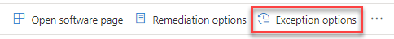
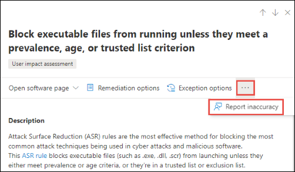

# Sicherheitsempfehlungen – Bedrohungs- und Sicherheitsrisikoverwaltung

[!INCLUDE [Microsoft 365 Defender rebranding](../../includes/microsoft-defender.md)]

**Gilt für:**

- [Microsoft Defender für Endpunkt](https://go.microsoft.com/fwlink/?linkid=2154037)
- [Bedrohungs- und Sicherheitsrisikoverwaltung](next-gen-threat-and-vuln-mgt.md)
- [Microsoft 365 Defender](https://go.microsoft.com/fwlink/?linkid=2118804)

>Möchten Sie Microsoft Defender for Endpoint erleben? [Registrieren Sie sich für eine kostenlose Testversion.](https://www.microsoft.com/microsoft-365/windows/microsoft-defender-atp?ocid=docs-wdatp-portaloverview-abovefoldlink)

Cybersicherheitsschwächen, die in Ihrer Organisation identifiziert werden, werden aktionsrelevanten Sicherheitsempfehlungen zugeordnet und durch ihre Auswirkungen priorisiert. Mit priorisierten Empfehlungen können Sie die Zeit zur Behebung oder Behebung von Sicherheitsrisiken und zur Verbesserung der Compliance kürzen.

Jede Sicherheitsempfehlung enthält Maßnahmen zur Behebung. Zur Unterstützung der Aufgabenverwaltung kann die Empfehlung auch mit Microsoft Intune und Microsoft Endpoint Configuration Manager gesendet werden. Wenn sich die Bedrohungslandschaft ändert, ändert sich auch die Empfehlung, da sie kontinuierlich Informationen aus Ihrer Umgebung sammelt.

>[!TIP]
>Informationen zu E-Mails zu neuen Sicherheitsrisikoereignissen finden Sie unter [Configure vulnerability email notifications in Microsoft Defender for Endpoint](configure-vulnerability-email-notifications.md)

## Funktionsweise

Jedes Gerät in der Organisation wird basierend auf drei wichtigen Faktoren erzielt, mit deren Hilfe Kunden sich zum richtigen Zeitpunkt auf die richtigen Dinge konzentrieren können.

- **Bedrohung** – Merkmale der Sicherheitsrisiken und Exploits in den Geräten Ihrer Organisation und des Verletzungsverlaufs. Basierend auf diesen Faktoren zeigen die Sicherheitsempfehlungen die entsprechenden Links zu aktiven Warnungen, laufenden Bedrohungskampagnen und den entsprechenden Bedrohungsanalyseberichten an.

- **Wahrscheinlichkeit von** Sicherheitsverletzungen – Sicherheitslage und Ausfallsicherheit Ihrer Organisation gegen Bedrohungen

- **Geschäftswert** – Die Ressourcen, kritischen Prozesse und geistigen Eigenschaften Ihrer Organisation

## Navigieren Sie zur Seite Sicherheitsempfehlungen

Greifen Sie auf die Seite Sicherheitsempfehlungen auf verschiedene Arten zu:

- Navigationsmenü zur Bedrohungs- und Sicherheitsrisikoverwaltung im [Microsoft Defender Security Center](portal-overview.md)
- Die besten Sicherheitsempfehlungen im Dashboard zur Verwaltung von Bedrohungen [und Sicherheitsrisiken](tvm-dashboard-insights.md)

Zeigen Sie verwandte Sicherheitsempfehlungen an den folgenden Stellen an:

- Softwareseite
- Geräteseite

### Navigationsmenü

Wechseln Sie zum Navigationsmenü zur Bedrohungs- und Sicherheitsrisikoverwaltung, und wählen Sie **Sicherheitsempfehlungen aus.** Die Seite enthält eine Liste der Sicherheitsempfehlungen für die Bedrohungen und Sicherheitsrisiken in Ihrer Organisation.

### Die besten Sicherheitsempfehlungen im Dashboard zur Verwaltung von Bedrohungen und Sicherheitsrisiken

An einem bestimmten Tag als Sicherheitsadministrator können  Sie sich das Dashboard für  die Verwaltung von Bedrohungen und Sicherheitsrisiken anschauen, um Ihre Belichtungsergebnisseite neben Ihrer [Microsoft Secure Score for Devices anzuzeigen.](tvm-microsoft-secure-score-devices.md) Das Ziel ist **es,** die Gefährdung Ihrer  Organisation durch Sicherheitsrisiken zu verringern und die Gerätesicherheit Ihrer Organisation zu erhöhen, um widerstandsfähiger gegen Cybersicherheitsangriffe zu sein. Die Liste der besten Sicherheitsempfehlungen kann Ihnen dabei helfen, dieses Ziel zu erreichen.

In den wichtigsten Sicherheitsempfehlungen werden die Verbesserungsmöglichkeiten aufgeführt, die basierend auf den im vorherigen Abschnitt erwähnten wichtigen Faktoren – Bedrohung, Wahrscheinlichkeit, dass eine Verletzung besteht, und Wert – priorisiert wurden. Wenn Sie eine Empfehlung auswählen, gelangen Sie zur Seite mit den Sicherheitsempfehlungen mit weiteren Details.

## Übersicht über Sicherheitsempfehlungen

Anzeigen von Empfehlungen, anzahl gefundener Schwachstellen, zugehöriger Komponenten, Bedrohungseinblicke, Anzahl der verfügbar gemachten Geräte, Status, Behebungstyp, Korrekturaktivitäten, Auswirkungen auf Ihre Belichtungsergebnis und Microsoft Secure Score für Geräte und zugehörige Tags.

Die Farbe des **Diagramms "Verfügbar gemachte Geräte"** ändert sich, wenn sich der Trend ändert. Wenn die Anzahl der verfügbar gemachten Geräte steigt, ändert sich die Farbe in Rot. Wenn die Anzahl der verfügbar gemachten Geräte sinkt, ändert sich die Farbe des Diagramms in Grün.

>[!NOTE]
>Das Bedrohungs- und Sicherheitsrisikomanagement zeigt Geräte an, die bis vor **30 Tagen verwendet wurden.** Dies ist anders als der Rest von Microsoft Defender for Endpoint. Wenn ein Gerät seit mehr als 7 Tagen nicht verwendet wird, hat es den Status "Inaktiv".

### Symbole

Nützliche Symbole machen Sie auch schnell auf:
-  mögliche aktive Warnungen
-  zugeordnete öffentliche Exploits
-  Empfehlungseinblicke

### Erkunden von Optionen für Sicherheitsempfehlungen

Wählen Sie die Sicherheitsempfehlung aus, die Sie untersuchen oder verarbeiten möchten.

Im Flyout können Sie eine der folgenden Optionen auswählen:

- **Seite "Software öffnen"** – Öffnen Sie die Softwareseite, um mehr Kontext zur Software und deren Verteilung zu erhalten. Die Informationen können Bedrohungskontext, zugehörige Empfehlungen, ermittelte Schwachstellen, die Anzahl der verfügbar gemachten Geräte, ermittelte Sicherheitsrisiken, Namen und detaillierte Geräte mit der installierten Software sowie die Versionsverteilung umfassen.

- [**Korrekturoptionen –**](tvm-remediation.md) Übermitteln Sie eine Korrekturanforderung, um ein Ticket in Microsoft Intune zu öffnen, damit Ihr IT-Administrator es abberaten und adressieren kann. Verfolgen Sie die Korrekturaktivität auf der Seite Korrektur.

- [**Ausnahmeoptionen**](tvm-exception.md) – Senden Sie eine Ausnahme, geben Sie eine Begründung an, und legen Sie die Ausnahmedauer fest, wenn Sie das Problem noch nicht beheben können.

>[!NOTE]
>Wenn eine Softwareänderung auf einem Gerät vorgenommen wird, dauert es in der Regel 2 Stunden, bis die Daten im Sicherheitsportal angezeigt werden. Es kann jedoch manchmal länger dauern. Konfigurationsänderungen können zwischen 4 und 24 Stunden dauern.

### Untersuchen von Änderungen bei der Gerätebelichtung oder -auswirkung

Wenn die Anzahl der verfügbar gemachten Geräte stark anspringt oder die Auswirkungen auf die Belichtungszahl Ihrer Organisation und die Microsoft Secure Score für Geräte stark steigen, ist diese Sicherheitsempfehlung eine Untersuchung wert.

1. Wählen Sie die Empfehlung und **Die Seite Software öffnen aus.**
2. Wählen Sie **die Registerkarte Ereigniszeitachse** aus, um alle auswirkungenreichen Ereignisse im Zusammenhang mit dieser Software anzuzeigen, z. B. neue Sicherheitsrisiken oder neue öffentliche Exploits. [Weitere Informationen zur Ereigniszeitachse](threat-and-vuln-mgt-event-timeline.md)
3. Entscheiden Sie, wie Sie die Erhöhung oder das Risiko Ihrer Organisation, z. B. das Einreichen einer Korrekturanforderung, adressieren.

## Anforderungsbehebung

Die Bereinigungsfunktion für die Bedrohungs- und Sicherheitsrisikoverwaltung überbrückt die Lücke zwischen Sicherheits- und IT-Administratoren über den Workflow zur Behebungsanforderung. Sicherheitsadministratoren wie Sie können den IT-Administrator bitten, eine  Sicherheitslücke von der Seite Sicherheitsempfehlung zu Intune zu be behebung. [Weitere Informationen zu Korrekturoptionen](tvm-remediation.md)

### Anfordern einer Korrektur

Wählen Sie eine Sicherheitsempfehlung aus, für die Sie eine Korrektur anfordern möchten, und wählen Sie dann **Korrekturoptionen aus.** Füllen Sie das Formular aus, und wählen Sie **Anforderung senden aus.** Wechseln Sie zur [**Seite Korrektur,**](tvm-remediation.md) um den Status Ihrer Behebungsanforderung zu sehen. [Weitere Informationen zum Anfordern von Korrekturen](tvm-remediation.md#request-remediation)

## Datei zur Ausnahme

Als Alternative zu einer Korrekturanforderung, wenn eine Empfehlung derzeit nicht relevant ist, können Sie Ausnahmen für Empfehlungen erstellen. [Weitere Informationen zu Ausnahmen](tvm-exception.md)

Ausnahme können nur Benutzer mit Denkberechtigungen hinzufügen. [Erfahren Sie mehr über RBAC-Rollen](user-roles.md).

Wenn eine Ausnahme für eine Empfehlung erstellt wird, ist die Empfehlung nicht mehr aktiv. Der Empfehlungsstatus wird in **Vollständige Ausnahme** oder **Teilausnahme** (nach Gerätegruppe) geändert.

### Erstellen einer Ausnahme

Wählen Sie eine Sicherheitsempfehlung aus, für die Sie eine Ausnahme erstellen möchten, und wählen Sie dann **Ausnahmeoptionen aus.**  

Füllen Sie das Formular aus, und übermitteln Sie es. Navigieren Sie zum Anzeigen aller Ausnahmen (aktuell und früher) zur Seite Problembehebung unter  dem Menü Bedrohung **&** Sicherheitsrisikoverwaltung, und wählen Sie die Registerkarte Ausnahmen aus. Erfahren Sie mehr über das Erstellen einer [Ausnahme.](tvm-exception.md#create-an-exception) 

## Ungenauigkeit melden

Sie können ein falsch positives Ergebnis melden, wenn vage, ungenaue, unvollständige oder bereits behobene Sicherheitsempfehlungsinformationen angezeigt werden.

1. Öffnen Sie die Sicherheitsempfehlung.

2. Wählen Sie die drei Punkte neben der Sicherheitsempfehlung aus, die Sie melden möchten, und wählen Sie **dann Ungenauigkeit** melden aus.

    

3. Wählen Sie im Flyoutbereich im Dropdownmenü die Kategorie Ungenauigkeit aus, geben Sie Ihre E-Mail-Adresse ein, und geben Sie Details zur Ungenauigkeit an.

4. Wählen Sie **Senden** aus. Ihr Feedback wird sofort an die Experten für die Bedrohungs- und Sicherheitsrisikoverwaltung gesendet.

## Verwandte Artikel

- [Übersicht über die Verwaltung von Bedrohungen und Sicherheitslücken](next-gen-threat-and-vuln-mgt.md)
- [Dashboard](tvm-dashboard-insights.md)
- [Gefährdungsscore](tvm-exposure-score.md)
- [Microsoft-Sicherheitsbewertung für Geräte](tvm-microsoft-secure-score-devices.md)
- [Sicherheitsrisiken korrigieren](tvm-remediation.md)
- [Erstellen und Anzeigen von Ausnahmen für Sicherheitsempfehlungen](tvm-exception.md)
- [Ablauf der Veranstaltung](threat-and-vuln-mgt-event-timeline.md)
