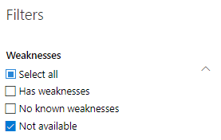

# Softwareinventar – Bedrohungs- und Sicherheitsrisikoverwaltung

[!INCLUDE [Microsoft 365 Defender rebranding](../../includes/microsoft-defender.md)]

**Gilt für:**
- [Microsoft Defender für Endpunkt](https://go.microsoft.com/fwlink/?linkid=2154037)
- [Bedrohungs- und Sicherheitsrisikoverwaltung](next-gen-threat-and-vuln-mgt.md)
- [Microsoft 365 Defender](https://go.microsoft.com/fwlink/?linkid=2118804)

>Möchten Sie Defender for Endpoint erleben? [Registrieren Sie sich für eine kostenlose Testversion.](https://www.microsoft.com/microsoft-365/windows/microsoft-defender-atp?ocid=docs-wdatp-portaloverview-abovefoldlink)

Das Softwareinventar im Bedrohungs- und Sicherheitsrisikomanagement ist eine Liste bekannter Software in Ihrer Organisation mit offiziellen [Common Platform Enumerations (CPE).](https://nvd.nist.gov/products/cpe) Softwareprodukte ohne offizielle CPE haben keine Sicherheitsrisiken veröffentlicht. Sie enthält auch Details wie den Namen des Anbieters, die Anzahl der Schwächen, Bedrohungen und die Anzahl der verfügbar gemachten Geräte.

## Funktionsweise

Im Bereich der Ermittlung nutzen wir den gleichen Satz von Signalen, der für die Erkennung und Bewertung von Sicherheitslücken in Microsoft Defender for Endpoint Erkennungs- und Reaktionsfunktionen [verantwortlich ist.](overview-endpoint-detection-response.md)

Da es in Echtzeit ist, werden in wenigen Minuten Informationen zu Sicherheitslücken erkannt. Das Modul greift automatisch Informationen aus mehreren Sicherheitsfeeds auf. Tatsächlich sehen Sie, ob eine bestimmte Software mit einer Livebedrohungskampagne verbunden ist. Sie stellt außerdem einen Link zu einem Threat Analytics-Bericht bereit, sobald er verfügbar ist.

## Navigieren zur Seite Softwareinventar

Greifen Sie auf die Seite Softwarebestand zu, indem Sie **im** Navigationsmenü zur Bedrohungs- und Sicherheitsrisikoverwaltung im [Microsoft Defender Security Center softwareinventar auswählen.](portal-overview.md)

Anzeigen von Software auf bestimmten Geräten auf den einzelnen Geräteseiten in der [Geräteliste](machines-view-overview.md).

>[!NOTE]
>Wenn Sie mithilfe der globalen Microsoft Defender for Endpoint-Suche nach Software suchen, stellen Sie sicher, dass Sie einen Unterstrich anstelle eines Leerzeichens setzen. Für die besten Suchergebnisse würden Sie z. B. "windows_10" anstelle von "Windows 10" schreiben.

## Übersicht über das Softwareinventar

Die **Seite Softwareinventar** wird mit einer Liste der in Ihrem Netzwerk installierten Software geöffnet, einschließlich des Herstellernamens, gefundener Schwachstellen, damit verbundener Bedrohungen, verfügbar gemachter Geräte, Auswirkungen auf die Belichtungsbewertung und Tags.

Sie können die Listenansicht basierend auf Denkschwächen in der Software, den damit verbundenen Bedrohungen und Tags filtern, z. B. ob die Software das Ende des Support erreicht hat.

Wählen Sie die Software aus, die Sie untersuchen möchten. Ein Flyoutpanel wird mit einer kompakteren Ansicht der Informationen auf der Seite geöffnet. Sie können entweder tiefer in die Untersuchung eintauchen und Softwareseite öffnen auswählen **oder** technische Inkonsistenzen kennzeichnen, indem Sie Ungenauigkeit melden **auswählen.**

### Software, die nicht unterstützt wird

Software, die derzeit nicht von der Bedrohungsverwaltung & unterstützt wird, kann auf der Seite Softwareinventar vorhanden sein. Da sie nicht unterstützt wird, sind nur begrenzte Daten verfügbar. Filtern Sie nach nicht unterstützter Software mit der Option "Nicht verfügbar" im Abschnitt "Schwachstelle".

Im Folgenden wird angegeben, dass eine Software nicht unterstützt wird:

- Das Feld "Schwächen" zeigt "Nicht verfügbar" an.
- Feld "Verfügbar gemachte Geräte" zeigt einen Strich an
- Im Seitenbereich und auf der Softwareseite hinzugefügter Informationstext
- Die Softwareseite enthält keine Sicherheitsempfehlungen, entdeckten Sicherheitsrisiken oder Abschnitte der Ereigniszeitachse.

Derzeit werden Produkte ohne CPE nicht auf der Seite Softwareinventar angezeigt, sondern nur im Softwareinventar auf Geräteebene.

## Softwareinventar auf Geräten

Wechseln Sie im Microsoft Defender Security Center-Navigationsbereich zur **[Liste Geräte](machines-view-overview.md)**. Wählen Sie den Namen eines Geräts aus, um die Geräteseite zu öffnen (z. B. Computer1), und wählen Sie dann die Registerkarte **Softwarebestand** aus, um eine Liste aller auf dem Gerät vorhandenen bekannten Software zu sehen. Wählen Sie einen bestimmten Softwareeintrag aus, um das Flyout mit weiteren Informationen zu öffnen.

Software kann auf Geräteebene sichtbar sein, auch wenn sie derzeit nicht von der Bedrohungs- und Sicherheitsrisikoverwaltung unterstützt wird. Es sind jedoch nur begrenzte Daten verfügbar. Sie wissen, ob Software nicht unterstützt wird, da sie in der Spalte "Schwäche" "Nicht verfügbar" sagen wird.

Software ohne CPE kann auch unter diesem gerätespezifischen Softwarebestand angezeigt werden.

### Softwarebeweis

Sehen Sie sich an, wo wir eine bestimmte Software auf einem Gerät aus der Registrierung, dem Datenträger oder beiden erkannt haben. Sie finden sie auf jedem Gerät im Gerätesoftwarebestand.

Wählen Sie einen Softwarenamen aus, um das Flyout zu öffnen, und suchen Sie nach dem Abschnitt "Software Evidence".

## Softwareseiten

Sie können Softwareseiten auf verschiedene Weise anzeigen:

- Seite "Softwareinventar" > Wählen Sie einen Softwarenamen > **Wählen** Sie im Flyout Softwareseite öffnen aus.
- [Seite "Sicherheitsempfehlungen"](tvm-security-recommendation.md) > Wählen Sie eine Empfehlung > **Wählen** Sie im Flyout Die Seite Software öffnen aus.
- [Event timeline page](threat-and-vuln-mgt-event-timeline.md) > Select an event > Select the hyperlinked software name (like Visual Studio 2017) in the section called "Related component" in the flyout

 Eine vollständige Seite mit allen Details einer bestimmten Software und den folgenden Informationen wird angezeigt:

- Side panel with vendor information, prevalence of the software in the organization (including number of devices it's installed on, and exposed devices that aren't patched), whether and exploit is available, and impact to your exposure score.
- Datenvisualisierungen, die die Anzahl und den Schweregrad von Sicherheitsrisiken und Falschkonfigurationen anzeigen. Außerdem werden Diagramme mit der Anzahl der verfügbar gemachten Geräte angezeigt.
- Registerkarten mit Informationen wie:
    - Entsprechende Sicherheitsempfehlungen für die identifizierten Schwachstellen und Schwachstellen.
    - Benannte CVEs von entdeckten Sicherheitsrisiken.
    - Geräte, auf die die Software installiert ist (zusammen mit Gerätename, Domäne, Betriebssystem und mehr).
    - Liste der Softwareversion (einschließlich der Anzahl der Geräte, auf denen die Version installiert ist, die Anzahl der erkannten Sicherheitsrisiken und die Namen der installierten Geräte).

    

## Ungenauigkeit melden

Melden Sie ein falsch positives Ergebnis, wenn vage, ungenaue oder unvollständige Informationen angezeigt werden. Sie können auch über Sicherheitsempfehlungen berichten, die bereits behoben wurden.

1. Öffnen Sie das Softwaref flyout auf der Seite Softwareinventar.
2. Wählen **Sie Ungenauigkeit melden aus.**
3. Wählen Sie im Flyoutbereich im Dropdownmenü die Kategorie Ungenauigkeit aus, geben Sie Ihre E-Mail-Adresse ein und geben Sie Details zur Ungenauigkeit an.
4. Wählen Sie **Senden** aus. Ihr Feedback wird sofort an die Experten für die Bedrohungs- und Sicherheitsrisikoverwaltung gesendet.

## Verwandte Artikel

- [Übersicht über die Verwaltung von Bedrohungen und Sicherheitslücken](next-gen-threat-and-vuln-mgt.md)
- [Sicherheitsempfehlungen](tvm-security-recommendation.md)
- [Ablauf der Veranstaltung](threat-and-vuln-mgt-event-timeline.md)
- [Anzeigen und Organisieren der Microsoft Defender for Endpoint Devices-Liste](machines-view-overview.md)
