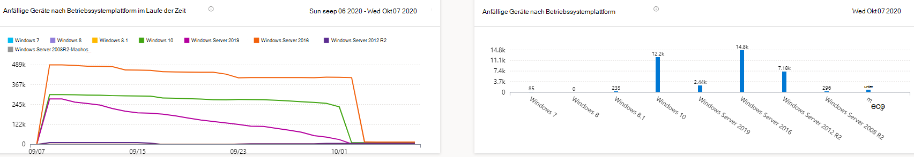

# Bericht über anfällige Geräte – Bedrohungs- und Sicherheitsrisikomanagement

[!INCLUDE [Microsoft 365 Defender rebranding](../../includes/microsoft-defender.md)]

**Gilt für:**

- [Microsoft Defender für Endpunkt](https://go.microsoft.com/fwlink/?linkid=2154037)
- [Bedrohung und Sicherheitsrisikomanagement](next-gen-threat-and-vuln-mgt.md)
- [Microsoft 365 Defender](https://go.microsoft.com/fwlink/?linkid=2118804)

>Möchten Sie Microsoft Defender for Endpoint erleben? [Registrieren Sie sich für eine kostenlose Testversion.](https://www.microsoft.com/microsoft-365/windows/microsoft-defender-atp?ocid=docs-wdatp-portaloverview-abovefoldlink)

Der Bericht zeigt Diagramme und Balkendiagramme mit anfälligen Gerätetrends und aktuellen Statistiken. Das Ziel ist, dass Sie den Atem und umfang Ihrer Gerätebelichtung verstehen.

Greifen Sie auf den Bericht im Microsoft Defender Security Center zu Berichte **> gefährdeten Geräten zu**

Es gibt zwei Spalten:

- Trends (im Laufe der Zeit). Kann die letzten 30 Tage, 3 Monate, 6 Monate oder einen benutzerdefinierten Datumsbereich anzeigen.
- Heute (aktuelle Informationen)

**Filter**: Sie können die Daten nach Schweregraden der Sicherheitsanfälligkeit, Exploitverfügbarkeit, Sicherheitsrisikoalter, Betriebssystemplattform, Windows 10 Version oder Gerätegruppe filtern.

**Drilldown**: Wenn Sie einen Einblick erhalten möchten, wählen Sie das entsprechende Balkendiagramm aus, um eine gefilterte Liste von Geräten auf der Seite Geräteinventar anzeigen zu können. Von dort können Sie die Liste exportieren.

## Schweregraddiagramme

Jedes Gerät wird nur einmal nach der schwersten Sicherheitslücke auf diesem Gerät gezählt.

## Exploit-Verfügbarkeitsdiagramme

Jedes Gerät wird basierend auf der höchsten Stufe bekannter Exploits nur einmal gezählt.

## Altersdiagramme für Sicherheitslücken

Jedes Gerät wird nur einmal unter dem ältesten Datum für die Veröffentlichung von Sicherheitslücken gezählt. Ältere Sicherheitsrisiken haben eine höhere Wahrscheinlichkeit, ausgebeutet zu werden.

## Anfällige Geräte nach Betriebssystemplattformdiagrammen

Die Anzahl der Geräte auf jedem Betriebssystem, die aufgrund von Softwarerisiken verfügbar gemacht werden.

## Anfällige Geräte nach Windows 10 Versionsdiagrammen

Die Anzahl der Geräte auf jedem Windows 10, die aufgrund anfälliger Anwendungen oder Betriebssysteme verfügbar gemacht werden.

## Verwandte Themen

- [Übersicht über Bedrohungen Sicherheitsrisikomanagement Bedrohungen](next-gen-threat-and-vuln-mgt.md)
- [Sicherheitsempfehlungen](tvm-security-recommendation.md)
