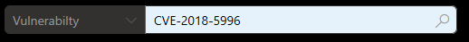
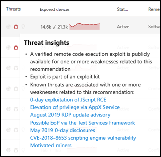

# Sicherheitsrisiken in meiner Organisation – Bedrohungs- und SicherheitsrisikoverwaltungVulnerabilities in my organization - threat and vulnerability management

[!INCLUDE [Microsoft 365 Defender rebranding](../../includes/microsoft-defender.md)]

**Gilt für:****Applies to:**
- [Microsoft Defender für EndpunktMicrosoft Defender for Endpoint](https://go.microsoft.com/fwlink/?linkid=2154037)
- [Bedrohungs- und SicherheitsrisikoverwaltungThreat and vulnerability management](next-gen-threat-and-vuln-mgt.md)
- [Microsoft 365 DefenderMicrosoft 365 Defender](https://go.microsoft.com/fwlink/?linkid=2118804)

>Möchten Sie Microsoft Defender for Endpoint erleben?Want to experience Microsoft Defender for Endpoint? [Registrieren Sie sich für eine kostenlose Testversion.Sign up for a free trial.](https://www.microsoft.com/microsoft-365/windows/microsoft-defender-atp?ocid=docs-wdatp-portaloverview-abovefoldlink)

Die Bedrohungs- und Sicherheitsrisikoverwaltung verwendet dieselben Signale im Endpunktschutz von Defender for Endpoint, um Sicherheitsrisiken zu überprüfen und zu erkennen.Threat and vulnerability management uses the same signals in Defender for Endpoint's endpoint protection to scan and detect vulnerabilities.

Auf **der Seite Schwächen** werden die Softwarerisiken aufgeführt, für die Ihre Geräte verfügbar sind, indem Sie die ID für häufige Sicherheitsrisiken und -risiken (Common Vulnerabilities and Exposures, CVE) auflisten.The **Weaknesses** page lists the software vulnerabilities your devices are exposed to by listing the Common Vulnerabilities and Exposures (CVE) ID. Sie können auch den Schweregrad, die Bewertung des Allgemeinen Bewertungssystems für Sicherheitslücken (Common Vulnerability Scoring System, CVSS), die Verbreitung in Ihrer Organisation, die entsprechende Verletzung, Bedrohungseinblicke und vieles mehr anzeigen.You can also view the severity, Common Vulnerability Scoring System (CVSS) rating, prevalence in your organization, corresponding breach, threat insights, and more.

>[!NOTE]
>Wenn einer Sicherheitslücke keine offizielle CVE-ID zugewiesen ist, wird der Sicherheitsrisikoname von der Bedrohungs- und Sicherheitsrisikoverwaltung zugewiesen.If there is no official CVE-ID assigned to a vulnerability, the vulnerability name is assigned by threat and vulnerability management.

>[!TIP]
>Informationen zu E-Mails zu neuen Sicherheitsrisikoereignissen finden Sie unter [Configure vulnerability email notifications in Microsoft Defender for Endpoint](configure-vulnerability-email-notifications.md)To get emails about new vulnerability events, see [Configure vulnerability email notifications in Microsoft Defender for Endpoint](configure-vulnerability-email-notifications.md)

## Navigieren Sie zur Seite SchwächenNavigate to the Weaknesses page

Greifen Sie auf die Seite Schwächen auf verschiedene Arten zu:Access the Weaknesses page a few different ways:

- Auswählen **von Schwächen** im Navigationsmenü zur Bedrohungs- und Sicherheitsrisikoverwaltung im Microsoft Defender Security [Center](portal-overview.md)Selecting **Weaknesses** from the threat and vulnerability management navigation menu in the [Microsoft Defender Security Center](portal-overview.md)
- Globale SucheGlobal search

### NavigationsmenüNavigation menu

Wechseln Sie zum Navigationsmenü zur Bedrohungs- und Sicherheitsrisikoverwaltung, und wählen Sie **Schwächen** aus, um die Liste der CVEs zu öffnen.Go to the threat and vulnerability management navigation menu and select **Weaknesses** to open the list of CVEs.

### Sicherheitsrisiken bei der globalen SucheVulnerabilities in global search

1. Wechseln Sie zum Dropdownmenü globale Suche.Go to the global search drop-down menu.
2. Wählen **Sie Sicherheitsanfälligkeit** und Schlüssel in der ID für häufige Sicherheitsrisiken und Gefährdungen (Common Vulnerabilites and Exposures, CVE) aus, die Sie suchen, und wählen Sie dann das Suchsymbol aus.Select **Vulnerability** and key-in the Common Vulnerabilities and Exposures (CVE) ID that you're looking for, then select the search icon. Die **Seite Schwächen** wird mit den von Ihnen gesuchten CVE-Informationen geöffnet.The **Weaknesses** page opens with the CVE information that you're looking for.

3. Wählen Sie den CVE aus, um ein Flyoutpanel mit weiteren Informationen zu öffnen, einschließlich der Beschreibung der Sicherheitslücke, Details, Bedrohungseinblicke und verfügbar gemachten Geräten.Select the CVE to open a flyout panel with more information, including the vulnerability description, details, threat insights, and exposed devices.

Um die restlichen Sicherheitsrisiken auf der Seite Schwächen zu **sehen,** geben Sie CVE ein, und wählen Sie dann Suche aus.To see the rest of the vulnerabilities in the **Weaknesses** page, type CVE, then select search.

## Übersicht über SchwächenWeaknesses overview

Behebung der Sicherheitsrisiken auf exponierten Geräten, um das Risiko für Ihre Ressourcen und Ihre Organisation zu reduzieren.Remediate the vulnerabilities in exposed devices to reduce the risk to your assets and organization. Wenn die **Spalte Verfügbar gemachte** Geräte 0 zeigt, bedeutet dies, dass Sie nicht gefährdet sind.If the **Exposed Devices** column shows 0, that means you aren't at risk.

### Einblicke in Sicherheitsverletzungen und BedrohungenBreach and threat insights

Sehen Sie sich in der Spalte Bedrohung alle informationen zu Sicherheitsverletzungen und Bedrohungen **an,** wenn die Symbole rot gefärbt sind.View any related breach and threat insights in the **Threat** column when the icons are colored red.

 >[!NOTE]
 > Priorisieren Sie immer Empfehlungen, die laufenden Bedrohungen zugeordnet sind.Always prioritize recommendations that are associated with ongoing threats. Diese Empfehlungen sind mit dem Symbol "Bedrohungserblick" These recommendations are marked with the threat insight icon  and breach insight icon and breach insight icon .  

Das Symbol für Sicherheitslückeneinblicke wird hervorgehoben, wenn in Ihrer Organisation eine Sicherheitslücke gefunden wurde.The breach insights icon is highlighted if there's a vulnerability found in your organization.

Das Symbol für Bedrohungseinblicke wird hervorgehoben, wenn die in Ihrer Organisation gefundene Sicherheitslücke mit Exploits verknüpft ist.The threat insights icon is highlighted if there are associated exploits in the vulnerability found in your organization. Das Zeigen auf das Symbol zeigt, ob die Bedrohung Teil eines Exploitkits ist oder mit bestimmten erweiterten persistenten Kampagnen oder Aktivitätsgruppen verbunden ist.Hovering over the icon shows whether the threat is a part of an exploit kit, or connected to specific advanced persistent campaigns or activity groups. Wenn verfügbar, gibt es einen Link zu einem Threat Analytics-Bericht mit Zero-Day-Nutzungsnachrichten, Enthüllungen oder zugehörigen Sicherheitsratgebern.When available, there's a link to a Threat Analytics report with zero-day exploitation news, disclosures, or related security advisories.  

### Gewinnen von Erkenntnissen zu SicherheitslückenGain vulnerability insights

Wenn Sie einen CVE auswählen, wird ein Flyoutpanel mit weiteren Informationen wie der Sicherheitsrisikobeschreibung, Details, Bedrohungseinblicken und verfügbar gemachten Geräten geöffnet.If you select a CVE, a flyout panel will open with more information such as the vulnerability description, details, threat insights, and exposed devices.

- Die Kategorie "Betriebssystemfeature" wird in relevanten Szenarien angezeigt.The "OS Feature" category is shown in relevant scenarios
- Sie können zu der zugehörigen Sicherheitsempfehlung für jeden CVE mit verfügbar gemachten Geräten wechseln.You can go to the related security recommendation for every CVE with exposed device

 

### Software, die nicht unterstützt wirdSoftware that isn't supported

CVEs für Software, die derzeit nicht von bedrohungsbedrohungen unterstützt & auf der Seite Schwächen weiterhin vorhanden.CVEs for software that isn't currently supported by threat & vulnerability management is still present in the Weaknesses page. Da die Software nicht unterstützt wird, sind nur begrenzte Daten verfügbar.Because the software is not supported, only limited data will be available.

Verfügbar gemachte Geräteinformationen sind für CVEs mit nicht unterstützter Software nicht verfügbar.Exposed device information will not be available for CVEs with unsupported software. Filtern Sie nach nicht unterstützter Software, indem Sie im Abschnitt "Verfügbar gemachte Geräte" die Option "Nicht verfügbar" auswählen.Filter by unsupported software by selecting the "Not available" option in the "Exposed devices" section.

 

## Anzeigen von Einträgen zu häufigen Sicherheitsrisiken und Gefährdungen (Common Vulnerabilities and Exposures, CVE) an anderen OrtenView Common Vulnerabilities and Exposures (CVE) entries in other places

### Besonders anfällige Software im DashboardTop vulnerable software in the dashboard

1. Wechseln Sie zum [Dashboard für die Verwaltung](tvm-dashboard-insights.md) von Bedrohungen und Sicherheitslücken, und scrollen Sie zum Widget **"Besonders anfällige Software".**Go to the [threat and vulnerability management dashboard](tvm-dashboard-insights.md) and scroll down to the **Top vulnerable software** widget. Sie sehen die Anzahl der Sicherheitsrisiken, die in jeder Software gefunden werden, sowie Bedrohungsinformationen und eine hohe Ansicht der Geräteexposition im Laufe der Zeit.You will see the number of vulnerabilities found in each software, along with threat information and a high-level view of device exposure over time.

    

2. Wählen Sie die Software aus, die Sie untersuchen möchten, um zu einer Drilldownseite zu wechseln.Select the software you want to investigate to go to a drilldown page.
3. Wählen Sie die **Registerkarte Gefundene Sicherheitsrisiken** aus.Select the **Discovered vulnerabilities** tab.
4. Wählen Sie die Sicherheitslücke aus, die Sie untersuchen möchten, um weitere Informationen zu Sicherheitsrisikodetails zu erhalten.Select the vulnerability you want to investigate for more information on vulnerability details

    

### Entdecken von Sicherheitsrisiken auf der GeräteseiteDiscover vulnerabilities in the device page

Anzeigen verwandter Schwachstelleninformationen auf der Geräteseite.View related weaknesses information in the device page.

1. Wechseln Sie zur Navigationsleiste microsoft Defender Security Center, und wählen Sie dann das Gerätesymbol aus.Go to the Microsoft Defender Security Center navigation menu bar, then select the device icon. Die **Seite Geräteliste** wird geöffnet.The **Devices list** page opens.
2. Wählen Sie **auf der Seite** Geräteliste den Gerätenamen aus, den Sie untersuchen möchten.In the **Devices list** page, select the device name that you want to investigate.

    

3. Die Geräteseite wird mit Details und Antwortoptionen für das Gerät geöffnet, das Sie untersuchen möchten.The device page will open with details and response options for the device you want to investigate.
4. Wählen **Sie Gefundene Sicherheitsrisiken aus.**Select **Discovered vulnerabilities**.

    

5. Wählen Sie die Sicherheitslücke aus, die Sie untersuchen möchten, um ein Flyoutpanel mit den CVE-Details zu öffnen, z. B.: Beschreibung von Sicherheitslücken, Einblicke in Bedrohungen und Erkennungslogik.Select the vulnerability that you want to investigate to open up a flyout panel with the CVE details, such as: vulnerability description, threat insights, and detection logic.

#### CVE-ErkennungslogikCVE Detection logic

Ähnlich wie der Softwarebeweis zeigen wir nun die Erkennungslogik an, die wir auf einem Gerät angewendet haben, um zu erkennen, dass es anfällig ist.Similar to the software evidence, we now show the detection logic we applied on a device in order to state that it's vulnerable. Der neue Abschnitt heißt "Erkennungslogik" (in allen erkannten Sicherheitslücken auf der Geräteseite) und zeigt die Erkennungslogik und -quelle.The new section is called "Detection Logic" (in any discovered vulnerability in the device page) and shows the detection logic and source.

Die Kategorie "Betriebssystemfeature" wird auch in relevanten Szenarien angezeigt.The "OS Feature" category is also shown in relevant scenarios. Ein CVE würde sich nur dann auf Geräte auswirken, auf die ein anfälliges Betriebssystem ausgeführt wird, wenn eine bestimmte Betriebssystemkomponente aktiviert ist.A CVE would affect devices that run a vulnerable OS only if a specific OS component is enabled. Angenommen, Windows Server 2019 hat eine Sicherheitslücke in seiner DNS-Komponente.Let's say Windows Server 2019 has vulnerability in its DNS component. Mit dieser neuen Funktion fügen wir diesen CVE nur an die Windows Server 2019-Geräte an, deren DNS-Funktion im Betriebssystem aktiviert ist.With this new capability, we’ll only attach this CVE to the Windows Server 2019 devices with the DNS capability enabled in their OS.

## Ungenauigkeit meldenReport inaccuracy

Melden Sie ein falsch positives Ergebnis, wenn vage, ungenaue oder unvollständige Informationen angezeigt werden.Report a false positive when you see any vague, inaccurate, or incomplete information. Sie können auch über Sicherheitsempfehlungen berichten, die bereits behoben wurden.You can also report on security recommendations that have already been remediated.

1. Öffnen Sie den CVE auf der Seite Schwächen.Open the CVE on the Weaknesses page.
2. Wählen **Sie Ungenauigkeit melden aus,** und ein Flyoutbereich wird geöffnet.Select **Report inaccuracy** and a flyout pane will open.
3. Wählen Sie im Dropdownmenü die Kategorie Ungenauigkeit aus, und geben Sie Ihre E-Mail-Adresse und Ungenauigkeitsdetails ein.Select the inaccuracy category from the drop-down menu and fill in your email address and inaccuracy details.
4. Wählen Sie **Senden** aus.Select **Submit**. Ihr Feedback wird sofort an die Experten für die Bedrohungs- und Sicherheitsrisikoverwaltung gesendet.Your feedback is immediately sent to the threat and vulnerability management experts.

## Verwandte ArtikelRelated articles

- [Übersicht über die Verwaltung von Bedrohungen und SicherheitslückenThreat and vulnerability management overview](next-gen-threat-and-vuln-mgt.md)
- [SicherheitsempfehlungenSecurity recommendations](tvm-security-recommendation.md)
- [SoftwarebestandSoftware inventory](tvm-software-inventory.md)
- [Dashboard-InsightsDashboard insights](tvm-dashboard-insights.md)
- [Anzeigen und Organisieren der Microsoft Defender for Endpoint Devices-ListeView and organize the Microsoft Defender for Endpoint Devices list](machines-view-overview.md)
