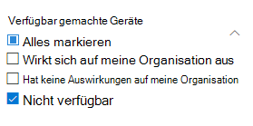

# Sicherheitsrisiken in meiner Organisation – Bedrohungs- und Sicherheitsrisikoverwaltung

[!INCLUDE [Microsoft 365 Defender rebranding](../../includes/microsoft-defender.md)]

**Gilt für:**
- [Microsoft Defender für Endpunkt](https://go.microsoft.com/fwlink/?linkid=2154037)
- [Bedrohungs- und Sicherheitsrisikoverwaltung](next-gen-threat-and-vuln-mgt.md)
- [Microsoft 365 Defender](https://go.microsoft.com/fwlink/?linkid=2118804)

>Möchten Sie Microsoft Defender for Endpoint erleben? [Registrieren Sie sich für eine kostenlose Testversion.](https://www.microsoft.com/microsoft-365/windows/microsoft-defender-atp?ocid=docs-wdatp-portaloverview-abovefoldlink)

Die Bedrohungs- und Sicherheitsrisikoverwaltung verwendet dieselben Signale im Endpunktschutz von Defender for Endpoint, um Sicherheitsrisiken zu überprüfen und zu erkennen.

Auf **der Seite Schwächen** werden die Softwarerisiken aufgeführt, für die Ihre Geräte verfügbar sind, indem Sie die ID für häufige Sicherheitsrisiken und -risiken (Common Vulnerabilities and Exposures, CVE) auflisten. Sie können auch den Schweregrad, die Bewertung des Allgemeinen Bewertungssystems für Sicherheitslücken (Common Vulnerability Scoring System, CVSS), die Verbreitung in Ihrer Organisation, die entsprechende Verletzung, Bedrohungseinblicke und vieles mehr anzeigen.

>[!NOTE]
>Wenn einer Sicherheitslücke keine offizielle CVE-ID zugewiesen ist, wird der Sicherheitsrisikoname von der Bedrohungs- und Sicherheitsrisikoverwaltung zugewiesen.

>[!TIP]
>Informationen zu E-Mails zu neuen Sicherheitsrisikoereignissen finden Sie unter [Configure vulnerability email notifications in Microsoft Defender for Endpoint](configure-vulnerability-email-notifications.md)

## Navigieren Sie zur Seite Schwächen

Greifen Sie auf die Seite Schwächen auf verschiedene Arten zu:

- Auswählen **von Schwächen** im Navigationsmenü zur Bedrohungs- und Sicherheitsrisikoverwaltung im Microsoft Defender Security [Center](portal-overview.md)
- Globale Suche

### Navigationsmenü

Wechseln Sie zum Navigationsmenü zur Bedrohungs- und Sicherheitsrisikoverwaltung, und wählen Sie **Schwächen** aus, um die Liste der CVEs zu öffnen.

### Sicherheitsrisiken bei der globalen Suche

1. Wechseln Sie zum Dropdownmenü globale Suche.
2. Wählen **Sie Sicherheitsanfälligkeit** und Schlüssel in der ID für häufige Sicherheitsrisiken und Gefährdungen (Common Vulnerabilites and Exposures, CVE) aus, die Sie suchen, und wählen Sie dann das Suchsymbol aus. Die **Seite Schwächen** wird mit den von Ihnen gesuchten CVE-Informationen geöffnet.

3. Wählen Sie den CVE aus, um ein Flyoutpanel mit weiteren Informationen zu öffnen, einschließlich der Beschreibung der Sicherheitslücke, Details, Bedrohungseinblicke und verfügbar gemachten Geräten.

Um die restlichen Sicherheitsrisiken auf der Seite Schwächen zu **sehen,** geben Sie CVE ein, und wählen Sie dann Suche aus.

## Übersicht über Schwächen

Behebung der Sicherheitsrisiken auf exponierten Geräten, um das Risiko für Ihre Ressourcen und Ihre Organisation zu reduzieren. Wenn die **Spalte Verfügbar gemachte** Geräte 0 zeigt, bedeutet dies, dass Sie nicht gefährdet sind.

### Einblicke in Sicherheitsverletzungen und Bedrohungen

Sehen Sie sich in der Spalte Bedrohung alle informationen zu Sicherheitsverletzungen und Bedrohungen **an,** wenn die Symbole rot gefärbt sind.

 >[!NOTE]
 > Priorisieren Sie immer Empfehlungen, die laufenden Bedrohungen zugeordnet sind. Diese Empfehlungen sind mit dem Symbol "Bedrohungserblick"  and breach insight icon   

Das Symbol für Sicherheitslückeneinblicke wird hervorgehoben, wenn in Ihrer Organisation eine Sicherheitslücke gefunden wurde.

Das Symbol für Bedrohungseinblicke wird hervorgehoben, wenn die in Ihrer Organisation gefundene Sicherheitslücke mit Exploits verknüpft ist. Das Zeigen auf das Symbol zeigt, ob die Bedrohung Teil eines Exploitkits ist oder mit bestimmten erweiterten persistenten Kampagnen oder Aktivitätsgruppen verbunden ist. Wenn verfügbar, gibt es einen Link zu einem Threat Analytics-Bericht mit Zero-Day-Nutzungsnachrichten, Enthüllungen oder zugehörigen Sicherheitsratgebern.  

### Gewinnen von Erkenntnissen zu Sicherheitslücken

Wenn Sie einen CVE auswählen, wird ein Flyoutpanel mit weiteren Informationen wie der Sicherheitsrisikobeschreibung, Details, Bedrohungseinblicken und verfügbar gemachten Geräten geöffnet.

- Die Kategorie "Betriebssystemfeature" wird in relevanten Szenarien angezeigt.
- Sie können zu der zugehörigen Sicherheitsempfehlung für jeden CVE mit verfügbar gemachten Geräten wechseln.

 

### Software, die nicht unterstützt wird

CVEs für Software, die derzeit nicht von bedrohungsbedrohungen unterstützt & auf der Seite Schwächen weiterhin vorhanden. Da die Software nicht unterstützt wird, sind nur begrenzte Daten verfügbar.

Verfügbar gemachte Geräteinformationen sind für CVEs mit nicht unterstützter Software nicht verfügbar. Filtern Sie nach nicht unterstützter Software, indem Sie im Abschnitt "Verfügbar gemachte Geräte" die Option "Nicht verfügbar" auswählen.

 

## Anzeigen von Einträgen zu häufigen Sicherheitsrisiken und Gefährdungen (Common Vulnerabilities and Exposures, CVE) an anderen Orten

### Besonders anfällige Software im Dashboard

1. Wechseln Sie zum [Dashboard für die Verwaltung](tvm-dashboard-insights.md) von Bedrohungen und Sicherheitslücken, und scrollen Sie zum Widget **"Besonders anfällige Software".** Sie sehen die Anzahl der Sicherheitsrisiken, die in jeder Software gefunden werden, sowie Bedrohungsinformationen und eine hohe Ansicht der Geräteexposition im Laufe der Zeit.

    

2. Wählen Sie die Software aus, die Sie untersuchen möchten, um zu einer Drilldownseite zu wechseln.
3. Wählen Sie die **Registerkarte Gefundene Sicherheitsrisiken** aus.
4. Wählen Sie die Sicherheitslücke aus, die Sie untersuchen möchten, um weitere Informationen zu Sicherheitsrisikodetails zu erhalten.

    

### Entdecken von Sicherheitsrisiken auf der Geräteseite

Anzeigen verwandter Schwachstelleninformationen auf der Geräteseite.

1. Wechseln Sie zur Navigationsleiste microsoft Defender Security Center, und wählen Sie dann das Gerätesymbol aus. Die **Seite Geräteliste** wird geöffnet.
2. Wählen Sie **auf der Seite** Geräteliste den Gerätenamen aus, den Sie untersuchen möchten.

    

3. Die Geräteseite wird mit Details und Antwortoptionen für das Gerät geöffnet, das Sie untersuchen möchten.
4. Wählen **Sie Gefundene Sicherheitsrisiken aus.**

    

5. Wählen Sie die Sicherheitslücke aus, die Sie untersuchen möchten, um ein Flyoutpanel mit den CVE-Details zu öffnen, z. B.: Beschreibung von Sicherheitslücken, Einblicke in Bedrohungen und Erkennungslogik.

#### CVE-Erkennungslogik

Ähnlich wie der Softwarebeweis zeigen wir nun die Erkennungslogik an, die wir auf einem Gerät angewendet haben, um zu erkennen, dass es anfällig ist. Der neue Abschnitt heißt "Erkennungslogik" (in allen erkannten Sicherheitslücken auf der Geräteseite) und zeigt die Erkennungslogik und -quelle.

Die Kategorie "Betriebssystemfeature" wird auch in relevanten Szenarien angezeigt. Ein CVE würde sich nur dann auf Geräte auswirken, auf die ein anfälliges Betriebssystem ausgeführt wird, wenn eine bestimmte Betriebssystemkomponente aktiviert ist. Angenommen, Windows Server 2019 hat eine Sicherheitslücke in seiner DNS-Komponente. Mit dieser neuen Funktion fügen wir diesen CVE nur an die Windows Server 2019-Geräte an, deren DNS-Funktion im Betriebssystem aktiviert ist.

## Ungenauigkeit melden

Melden Sie ein falsch positives Ergebnis, wenn vage, ungenaue oder unvollständige Informationen angezeigt werden. Sie können auch über Sicherheitsempfehlungen berichten, die bereits behoben wurden.

1. Öffnen Sie den CVE auf der Seite Schwächen.
2. Wählen **Sie Ungenauigkeit melden aus,** und ein Flyoutbereich wird geöffnet.
3. Wählen Sie im Dropdownmenü die Kategorie Ungenauigkeit aus, und geben Sie Ihre E-Mail-Adresse und Ungenauigkeitsdetails ein.
4. Wählen Sie **Senden** aus. Ihr Feedback wird sofort an die Experten für die Bedrohungs- und Sicherheitsrisikoverwaltung gesendet.

## Verwandte Artikel

- [Übersicht über die Verwaltung von Bedrohungen und Sicherheitslücken](next-gen-threat-and-vuln-mgt.md)
- [Sicherheitsempfehlungen](tvm-security-recommendation.md)
- [Softwarebestand](tvm-software-inventory.md)
- [Dashboard-Insights](tvm-dashboard-insights.md)
- [Anzeigen und Organisieren der Microsoft Defender for Endpoint Devices-Liste](machines-view-overview.md)
