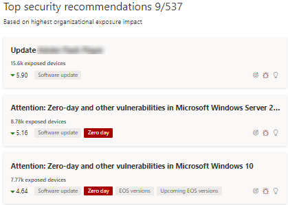

# Minimieren von Zero-Day-Sicherheitsrisiken – Bedrohungs- und Sicherheitsrisikoverwaltung

[!INCLUDE [Microsoft 365 Defender rebranding](../../includes/microsoft-defender.md)]

**Gilt für:**

- [Microsoft Defender für Endpunkt](https://go.microsoft.com/fwlink/?linkid=2154037)
- [Bedrohungs- und Sicherheitsrisikoverwaltung](next-gen-threat-and-vuln-mgt.md)
- [Microsoft 365 Defender](https://go.microsoft.com/fwlink/?linkid=2118804)

>Möchten Sie Microsoft Defender for Endpoint erleben? [Registrieren Sie sich für eine kostenlose Testversion.](https://www.microsoft.com/microsoft-365/windows/microsoft-defender-atp?ocid=docs-wdatp-portaloverview-abovefoldlink)

Eine Zero-Day-Sicherheitslücke ist eine öffentlich offengelegte Sicherheitslücke, für die keine offiziellen Patches oder Sicherheitsupdates veröffentlicht wurden. Zero-Day-Sicherheitsrisiken haben häufig einen hohen Schweregrad und werden aktiv ausgenutzt.

Das Bedrohungs- und Sicherheitsrisikomanagement zeigt nur Zero-Day-Sicherheitsrisiken an, über die informationen enthalten sind.

## Informationen zu Zero-Day-Sicherheitsrisiken finden

Sobald eine Zero-Day-Sicherheitslücke gefunden wurde, werden Informationen dazu über die folgenden Erfahrungen im Microsoft Defender Security Center vermittelt.

### Dashboard zur Verwaltung von Bedrohungen und Sicherheitslücken

Suchen Sie auf der Karte "Top security recommendations" nach Empfehlungen mit einem Zero-Day-Tag.

Suchen Sie auf der Karte "Besonders anfällige Software" nach Top-Software mit dem Tag "Zero-Day".

### Seite "Schwächen"

Suchen Sie nach der benannten Zero-Day-Sicherheitslücke zusammen mit einer Beschreibung und Details.

- Wenn dieser Sicherheitsanfälligkeit eine CVE-ID zugewiesen ist, wird neben dem CVE-Namen die Zero-Day-Bezeichnung angezeigt.

- Wenn dieser Sicherheitsanfälligkeit keine CVE-ID zugewiesen ist, finden Sie sie unter einem internen, temporären Namen, der wie "TVM-XXXX-XXXX" aussieht. Der Name wird aktualisiert, sobald eine offizielle CVE-ID zugewiesen wurde, aber der vorherige interne Name ist weiterhin durchsuchbar und wird im Seitenbereich gefunden.

### Seite "Softwareinventar"

Suchen Sie nach Software mit dem Zero-Day-Tag. Filtern Sie nach dem Tag "Zero Day", um nur Software mit Zero-Day-Sicherheitsrisiken zu sehen.

### Softwareseite

Suchen Sie nach einem Zero-Day-Tag für jede Software, die von der Zero-Day-Sicherheitslücke betroffen ist.

### Seite mit Sicherheitsempfehlungen

Zeigen Sie klare Vorschläge zu Korrektur- und Abhilfemaßnahmen an, einschließlich Problemumgehungen, falls vorhanden. Filtern Sie nach dem Tag "Zero Day", um nur Sicherheitsempfehlungen zur Behandlung von Zero-Day-Sicherheitsrisiken zu sehen.

Wenn Software mit einer Zero-Day-Sicherheitslücke und zusätzlichen Sicherheitsrisiken zur Verfügung steht, erhalten Sie eine Empfehlung zu allen Sicherheitsrisiken.

## Behebung von Zero-Day-Sicherheitsrisiken

Wechseln Sie zur Seite Sicherheitsempfehlung, und wählen Sie eine Empfehlung mit einem Nulltag aus. Ein Flyout wird mit Informationen zu den Zero-Day- und anderen Sicherheitsrisiken für diese Software geöffnet.

Es gibt einen Link zu Abhilfemaßnahmen und Problemumgehungen, wenn diese verfügbar sind. Problemumgehungen können dazu beitragen, das Risiko dieser Zero-Day-Sicherheitslücke zu verringern, bis ein Patch oder Sicherheitsupdate bereitgestellt werden kann.

Öffnen Sie Korrekturoptionen, und wählen Sie den Aufmerksamkeitstyp aus. Für die Zero-Day-Sicherheitsrisiken wird eine Option zur Behebung von "Aufmerksamkeit erforderlich" empfohlen, da ein Update noch nicht veröffentlicht wurde. Sie können kein Fälligkeitsdatum auswählen, da keine bestimmte Aktion durchzuführen ist. Wenn ältere Sicherheitsrisiken für diese Software vorhanden sind, die Sie bereinigungen möchten, können Sie die Option "Aufmerksamkeit erforderlich" außer Kraft setzen und "aktualisieren" auswählen.

## Nachverfolgen von Zero-Day-Korrekturaktivitäten

Wechseln Sie zur Seite  Zur Behebung von Bedrohungen und Sicherheitslücken, um das Problembehebungsaktivitätselement zu sehen. Wenn Sie die Option "Aufmerksamkeit erforderlich" ausgewählt haben, gibt es keine Statusanzeige, keinen Ticketstatus oder kein Fälligkeitsdatum, da es keine tatsächliche Aktion gibt, die wir überwachen können. Sie können nach Behebungstyp filtern, z. B. "Softwareupdate" oder "Aufmerksamkeit erforderlich", um alle Aktivitätselemente in derselben Kategorie zu sehen.

## Patchen von Zero-Day-Sicherheitsrisiken

Wenn ein Patch für den Nulltag freigegeben wird, wird die Empfehlung in "Update" und eine blaue Beschriftung daneben mit der Bezeichnung "Neues Sicherheitsupdate für null Tag" geändert. Es wird nicht mehr als Zero-Day-Tag in Betracht ziehen, das Zero-Day-Tag wird von allen Seiten entfernt.

## Verwandte Artikel

- [Übersicht über die Verwaltung von Bedrohungen und Sicherheitslücken](next-gen-threat-and-vuln-mgt.md)
- [Dashboard](tvm-dashboard-insights.md)
- [Sicherheitsempfehlungen](tvm-security-recommendation.md)
- [Softwarebestand](tvm-software-inventory.md)
- [Sicherheitsrisiken in meiner Organisation](tvm-weaknesses.md)
