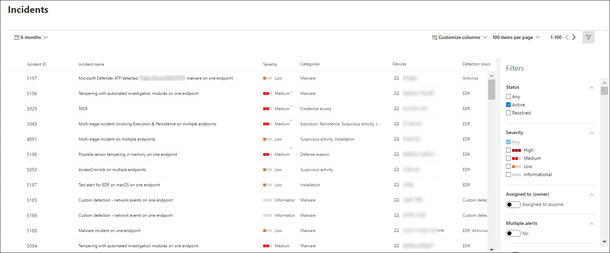

# Anzeigen und Organisieren der Warteschlange für Microsoft Defender für Endpunktvorfälle

[!INCLUDE [Microsoft 365 Defender rebranding](../../includes/microsoft-defender.md)]

**Gilt für:**
- [Microsoft Defender für Endpunkt](https://go.microsoft.com/fwlink/?linkid=2154037)
- [Microsoft 365 Defender](https://go.microsoft.com/fwlink/?linkid=2118804)

> Möchten Sie Defender für Endpunkt erleben? [Registrieren Sie sich für eine kostenlose Testversion.](https://www.microsoft.com/microsoft-365/windows/microsoft-defender-atp?ocid=docs-wdatp-pullalerts-abovefoldlink) 

Die **Vorfallwarteschlange** zeigt eine Sammlung von Vorfällen an, die von Geräten in Ihrem Netzwerk gekennzeichnet wurden. Sie können damit Vorfälle sortieren, um eine fundierte Entscheidung im Hinblick auf eine geeignete Reaktion auf einen Cyberangriff zu treffen.

Standardmäßig zeigt die Warteschlange Vorfälle an, die in den letzten 30 Tagen aufgetreten sind, wobei der letzte Vorfall oben in der Liste angezeigt wird, damit Sie die neuesten Vorfälle zuerst sehen können.

Es gibt mehrere Optionen, aus denen Sie auswählen können, um die Vorfallwarteschlangenansicht anzupassen. 

In der oberen Navigationsleiste haben Sie folgende Möglichkeiten:
- Anpassen von Spalten zum Hinzufügen oder Entfernen von Spalten 
- Ändern der Anzahl der Elemente, die pro Seite angezeigt werden sollen
- Auswählen der Elemente, die pro Seite angezeigt werden sollen
- Batchauswahl der zuzuweisenden Vorfälle 
- Navigieren zwischen Seiten
- Anwenden von Filtern

## Sortieren und Filtern der Vorfallwarteschlange
Sie können die folgenden Filter anwenden, um die Liste der Vorfälle einzuschränken und eine stärker fokussierte Ansicht zu erhalten.

### Severity

Schweregrad des Vorfalls | Beschreibung
:---|:---
Hoch  (Rot) | Bedrohungen, die häufig mit erweiterten dauerhaften Bedrohungen (Advanced Persistent Threats, APT) verbunden sind. Diese Vorfälle weisen aufgrund des Schweregrads des Schadens, den sie auf Geräten verursachen können, auf ein hohes Risiko hin.
Mittel  (Orange) | Bedrohungen, die in der Organisation selten beobachtet werden, z. B. anomale Registrierungsänderungen, Ausführung verdächtiger Dateien und beobachtete Verhaltensweisen, die typisch für Angriffsphasen sind.
Niedrig  (Gelb) | Bedrohungen im Zusammenhang mit weit verbreiteter Schadsoftware und Hack-Tools, die nicht notwendigerweise auf eine erweiterte Bedrohung für die Organisation hinweisen.
Zur Information  (Grau) | Informationsvorfälle werden möglicherweise nicht als schädlich für das Netzwerk betrachtet, können aber gut nachverfolgt werden.

## Zugewiesen an
Sie können die Liste filtern, indem Sie Vorfälle auswählen, die einer Person oder Ihnen zugewiesen sind.

### Kategorie
Vorfälle werden basierend auf der Beschreibung der Phase kategorisiert, in der sich die Cybersicherheits-Kill Chain befindet. Diese Ansicht hilft dem Bedrohungsanalysten, Priorität, Dringlichkeit und entsprechende Reaktionsstrategie zu bestimmen, die basierend auf dem Kontext bereitgestellt werden soll.

### Status
Sie können die Liste der Vorfälle basierend auf deren Status einschränken, um zu sehen, welche Vorgänge aktiv oder aufgelöst sind.

### Vertraulichkeit der Daten
Verwenden Sie diesen Filter, um Vorfälle anzuzeigen, die Vertraulichkeitsbezeichnungen enthalten.

## Benennung von Vorfällen

Um den Umfang des Vorfalls auf einen Blick zu verstehen, werden Vorfallnamen automatisch basierend auf Warnungsattributen wie der Anzahl der betroffenen Endpunkte, betroffenen Benutzern, Erkennungsquellen oder Kategorien generiert.

Beispiel: *Mehrstufiger Vorfall auf mehreren Endpunkten, die von mehreren Quellen gemeldet werden.*

> [!NOTE]
> Vorfälle, die vor dem Rollout der automatischen Benennung von Vorfällen aufgetreten sind, behalten ihren Namen.

## Siehe auch
- [Vorfallswarteschlange](/microsoft-365/security/defender-endpoint/view-incidents-queue)
- [Verwalten von Vorfällen](manage-incidents.md)
- [Untersuchen von Vorfällen](investigate-incidents.md)

